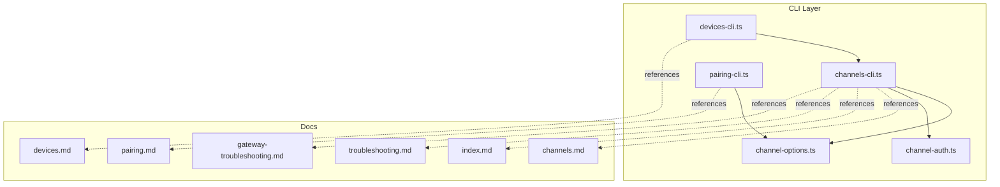
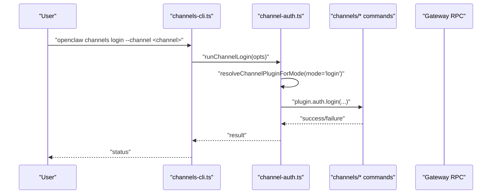
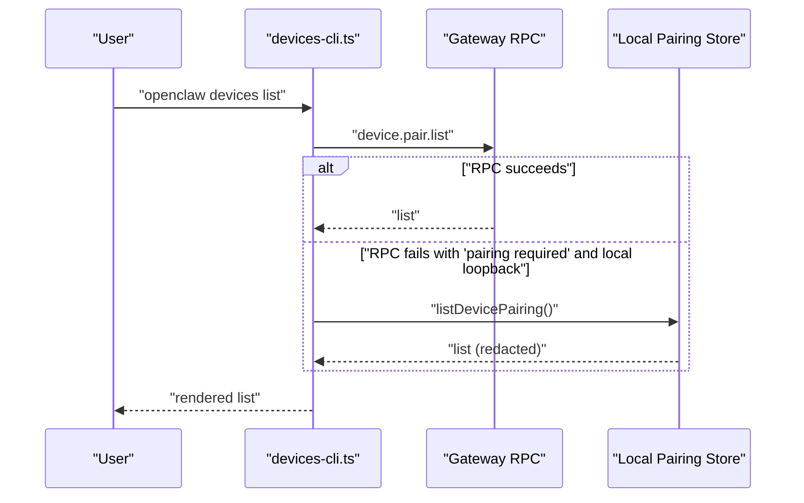
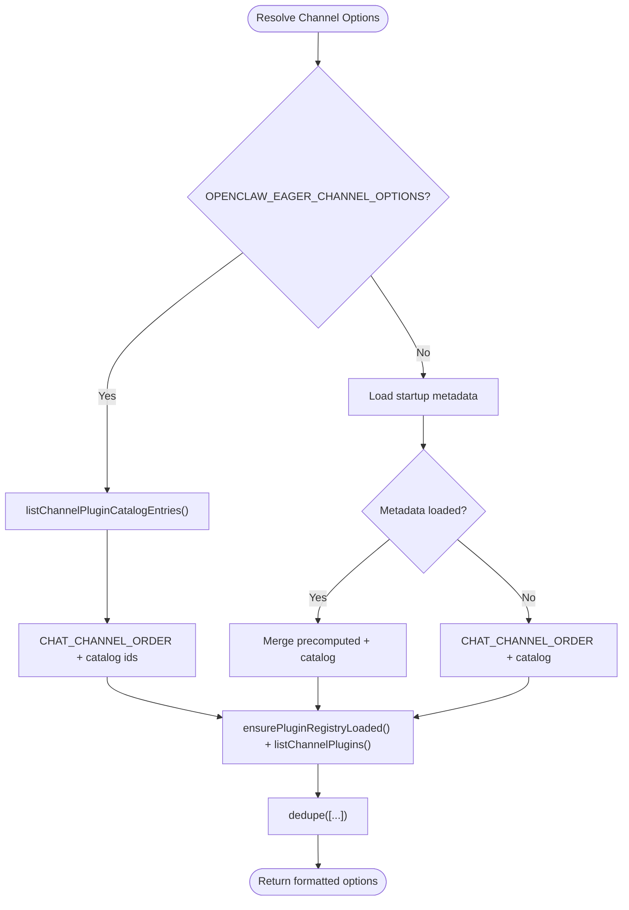
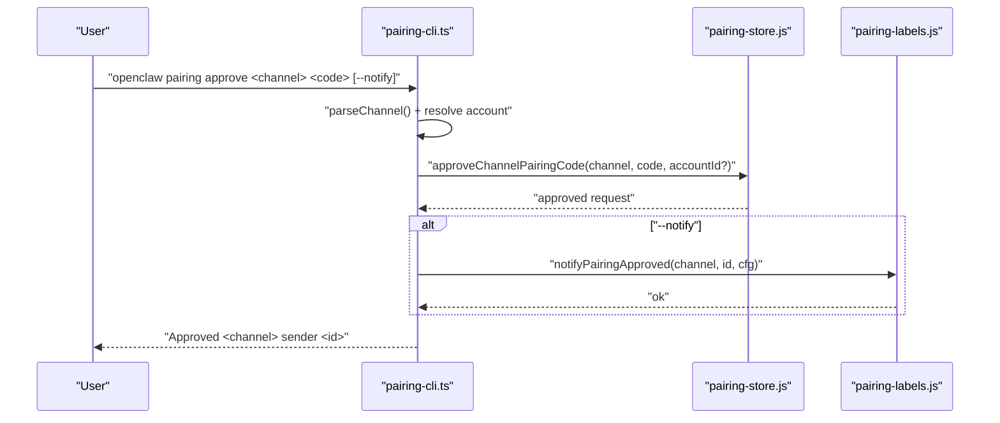
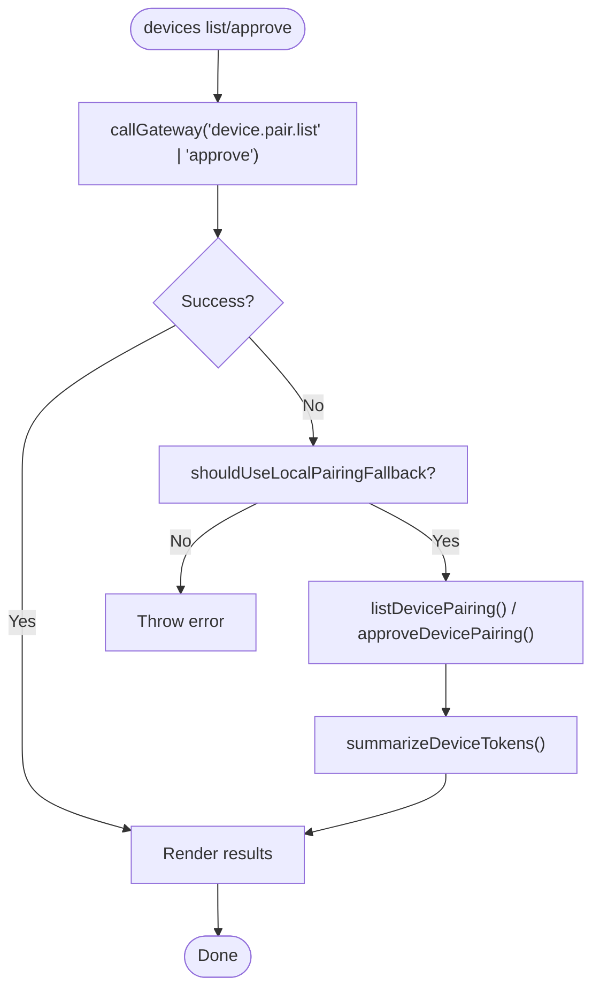
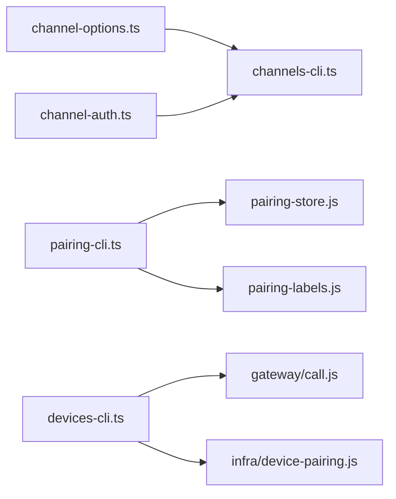

# Channel Commands

<cite>
**Referenced Files in This Document**
- [channels-cli.ts](file://src/cli/channels-cli.ts)
- [pairing-cli.ts](file://src/cli/pairing-cli.ts)
- [devices-cli.ts](file://src/cli/devices-cli.ts)
- [channel-options.ts](file://src/cli/channel-options.ts)
- [channel-auth.ts](file://src/cli/channel-auth.ts)
- [channels.md](file://docs/cli/channels.md)
- [pairing.md](file://docs/cli/pairing.md)
- [devices.md](file://docs/cli/devices.md)
- [index.md](file://docs/channels/index.md)
- [troubleshooting.md](file://docs/channels/troubleshooting.md)
- [gateway-troubleshooting.md](file://docs/gateway/troubleshooting.md)
</cite>

## Table of Contents
1. [Introduction](#introduction)
2. [Project Structure](#project-structure)
3. [Core Components](#core-components)
4. [Architecture Overview](#architecture-overview)
5. [Detailed Component Analysis](#detailed-component-analysis)
6. [Dependency Analysis](#dependency-analysis)
7. [Performance Considerations](#performance-considerations)
8. [Troubleshooting Guide](#troubleshooting-guide)
9. [Conclusion](#conclusion)
10. [Appendices](#appendices)

## Introduction
This document explains the channel management commands for OpenClaw, covering channels, pairing, and devices. It details how to add and remove channel accounts, authenticate and log out of channels, inspect channel capabilities, resolve names to IDs, review channel logs, approve device pairing requests, and rotate or revoke device tokens. It also provides troubleshooting guidance for connectivity, authentication, and pairing failures, and outlines multi-channel configuration and account scoping.

## Project Structure
The channel-related CLI is implemented in the CLI layer and delegates to underlying commands and runtime. The documentation for channels, pairing, and devices is provided alongside the CLI reference.

**Diagram sources**
- [channels-cli.ts](file://src/cli/channels-cli.ts#L1-L257)
- [pairing-cli.ts](file://src/cli/pairing-cli.ts#L1-L174)
- [devices-cli.ts](file://src/cli/devices-cli.ts#L1-L454)
- [channel-options.ts](file://src/cli/channel-options.ts#L1-L69)
- [channel-auth.ts](file://src/cli/channel-auth.ts#L1-L90)
- [channels.md](file://docs/cli/channels.md#L1-L102)
- [pairing.md](file://docs/cli/pairing.md#L1-L33)
- [devices.md](file://docs/cli/devices.md#L1-L95)
- [index.md](file://docs/channels/index.md#L1-L48)
- [troubleshooting.md](file://docs/channels/troubleshooting.md#L1-L118)
- [gateway-troubleshooting.md](file://docs/gateway/troubleshooting.md#L1-L367)

**Section sources**
- [channels-cli.ts](file://src/cli/channels-cli.ts#L1-L257)
- [pairing-cli.ts](file://src/cli/pairing-cli.ts#L1-L174)
- [devices-cli.ts](file://src/cli/devices-cli.ts#L1-L454)
- [channel-options.ts](file://src/cli/channel-options.ts#L1-L69)
- [channel-auth.ts](file://src/cli/channel-auth.ts#L1-L90)
- [channels.md](file://docs/cli/channels.md#L1-L102)
- [pairing.md](file://docs/cli/pairing.md#L1-L33)
- [devices.md](file://docs/cli/devices.md#L1-L95)
- [index.md](file://docs/channels/index.md#L1-L48)
- [troubleshooting.md](file://docs/channels/troubleshooting.md#L1-L118)
- [gateway-troubleshooting.md](file://docs/gateway/troubleshooting.md#L1-L367)

## Core Components
- Channels CLI: Adds/removes channel accounts, lists status, shows capabilities, resolves names, tails logs, and performs interactive login/logout.
- Pairing CLI: Lists and approves DM pairing requests for channels that support pairing.
- Devices CLI: Manages device pairing requests and device-scoped tokens, including rotation and revocation.
- Channel Options: Resolves available channel identifiers for CLI autocompletion and help text.
- Channel Auth: Executes channel-specific login/logout flows.

**Section sources**
- [channels-cli.ts](file://src/cli/channels-cli.ts#L70-L256)
- [pairing-cli.ts](file://src/cli/pairing-cli.ts#L52-L173)
- [devices-cli.ts](file://src/cli/devices-cli.ts#L213-L453)
- [channel-options.ts](file://src/cli/channel-options.ts#L50-L69)
- [channel-auth.ts](file://src/cli/channel-auth.ts#L48-L90)

## Architecture Overview
The CLI commands delegate to runtime-aware handlers and, where applicable, to the Gateway via RPC. Some commands fall back to local pairing files when direct access is restricted.

**Diagram sources**
- [channels-cli.ts](file://src/cli/channels-cli.ts#L222-L238)
- [channel-auth.ts](file://src/cli/channel-auth.ts#L48-L68)

**Diagram sources**
- [devices-cli.ts](file://src/cli/devices-cli.ts#L129-L145)

## Detailed Component Analysis

### Channels CLI
The channels command exposes subcommands for listing, status, capabilities, resolve, logs, add, remove, login, and logout. It supports channel-specific options and account scoping.

Key behaviors:
- List and status: Optionally probe credentials and include usage snapshots.
- Capabilities: Probe provider intents/scopes and supported features; supports channel targets for Discord.
- Resolve: Convert names to IDs using provider directories; read-only and degraded gracefully when credentials are unavailable.
- Logs: Tail channel logs from the gateway log file.
- Add/Remove: Non-interactive and interactive modes; wizard can bind accounts to agents and migrate single-account configs to multi-account shape.
- Login/Logout: Interactive flows for channels that support them; account selection respects default and explicit IDs.

Channel options are formatted dynamically from the channel registry and plugin catalog.

**Section sources**
- [channels-cli.ts](file://src/cli/channels-cli.ts#L70-L256)
- [channel-options.ts](file://src/cli/channel-options.ts#L50-L69)
- [channels.md](file://docs/cli/channels.md#L18-L102)

#### Channel Options Resolution

**Diagram sources**
- [channel-options.ts](file://src/cli/channel-options.ts#L25-L64)

### Pairing CLI
The pairing command manages DM pairing requests for channels that support pairing. It supports listing, approving, and notifying requesters.

Key behaviors:
- List: Accepts positional or named channel; optional account for multi-account channels; prints JSON or a formatted table.
- Approve: Accepts channel and code either positionally or via flags; optional notification back to requester; supports latest pending when no requestId given.
- Validation: Normalizes channel IDs and allows extension channels; throws descriptive errors for invalid inputs or unsupported channels.

**Section sources**
- [pairing-cli.ts](file://src/cli/pairing-cli.ts#L52-L173)
- [pairing.md](file://docs/cli/pairing.md#L16-L33)

#### Pairing Approval Flow

**Diagram sources**
- [pairing-cli.ts](file://src/cli/pairing-cli.ts#L114-L172)

### Devices CLI
The devices command manages device pairing requests and device-scoped tokens. It supports listing, removing, clearing, approving, rejecting, rotating, and revoking.

Key behaviors:
- List: Supports JSON output; renders pending and paired devices in tables; falls back to local pairing store when RPC indicates pairing required and conditions permit.
- Remove/Clear: Remove a single paired device or bulk clear with confirmation; optionally rejects pending requests.
- Approve/Reject: Approve latest or a specific pending request; reject a pending request; supports latest flag.
- Rotate/Revoke: Rotate a device token for a role with optional scopes; revoke a device token for a role.
- Authentication: Requires operator pairing/admin scope; warns about sensitive token output.

**Section sources**
- [devices-cli.ts](file://src/cli/devices-cli.ts#L213-L453)
- [devices.md](file://docs/cli/devices.md#L13-L95)

#### Devices RPC and Fallback

**Diagram sources**
- [devices-cli.ts](file://src/cli/devices-cli.ts#L129-L169)

### Channel Account Management and Multi-Channel Configuration
- Adding accounts: Use non-interactive flags for tokens and channel-specific options; the wizard can guide interactive setup and optionally bind accounts to agents.
- Removing accounts: Disable or delete channel accounts; deletion bypasses prompts.
- Multi-account configuration: When adding a second account to a channel, OpenClaw migrates top-level single-account values into the default account block and writes the new account, preserving existing behavior and bindings.

**Section sources**
- [channels-cli.ts](file://src/cli/channels-cli.ts#L164-L219)
- [channels.md](file://docs/cli/channels.md#L29-L57)

### Authentication Workflows
- Login: Resolves channel plugin and account, invokes plugin’s login handler; does not mutate channel config.
- Logout: Resolves channel plugin and account, invokes plugin’s logout handler to clear session state.

**Section sources**
- [channel-auth.ts](file://src/cli/channel-auth.ts#L48-L90)
- [channels-cli.ts](file://src/cli/channels-cli.ts#L222-L255)

### Device Pairing Procedures
- Listing: Review pending and paired devices; JSON output for scripting.
- Approving: Approve latest or a specific request; optionally notify requester.
- Rejecting: Reject a pending request.
- Clearing: Bulk remove paired devices with confirmation; optionally reject pending requests.
- Rotation/Revocation: Rotate or revoke device tokens scoped to a role.

**Section sources**
- [devices-cli.ts](file://src/cli/devices-cli.ts#L218-L452)
- [devices.md](file://docs/cli/devices.md#L15-L95)

### Examples for Popular Channels
- Telegram: Add via bot token; resolve names to IDs; tail logs; pair DMs if required.
- Discord: Add via bot token; probe capabilities; resolve targets; pair DMs if required.
- WhatsApp: Use QR pairing; approve DM senders; handle mention gating and group policies.
- iMessage/BlueBubbles: Use webhook reachability and app permissions; approve DMs; adjust allowlists.
- Signal: Verify daemon URL and receive mode; approve DMs; adjust group allowlists.
- Matrix: Check group policy and room allowlist; approve DMs; enable encryption support.

**Section sources**
- [channels.md](file://docs/cli/channels.md#L18-L102)
- [index.md](file://docs/channels/index.md#L14-L48)
- [troubleshooting.md](file://docs/channels/troubleshooting.md#L31-L118)

## Dependency Analysis
- channels-cli.ts depends on channel-options.ts for channel names and on channel-auth.ts for login/logout flows.
- pairing-cli.ts depends on channel normalization and pairing store APIs; it also uses pairing labels for notifications.
- devices-cli.ts depends on gateway RPC and local pairing store; it handles fallback logic for pairing scenarios.

**Diagram sources**
- [channels-cli.ts](file://src/cli/channels-cli.ts#L1-L20)
- [channel-options.ts](file://src/cli/channel-options.ts#L1-L10)
- [channel-auth.ts](file://src/cli/channel-auth.ts#L1-L15)
- [pairing-cli.ts](file://src/cli/pairing-cli.ts#L1-L16)
- [devices-cli.ts](file://src/cli/devices-cli.ts#L1-L16)

**Section sources**
- [channels-cli.ts](file://src/cli/channels-cli.ts#L1-L20)
- [pairing-cli.ts](file://src/cli/pairing-cli.ts#L1-L16)
- [devices-cli.ts](file://src/cli/devices-cli.ts#L1-L16)

## Performance Considerations
- Prefer JSON output for machine-readable parsing to avoid rendering overhead.
- Use targeted channel options (e.g., --channel) to reduce scanning and probing costs.
- Limit log lines with --lines to reduce I/O during log retrieval.
- Batch operations (e.g., devices clear) require confirmation to prevent accidental bulk changes.

## Troubleshooting Guide
- Channel connectivity issues:
  - Run status and gateway status probes; inspect logs; use doctor for guided fixes.
  - For DM pairing failures, approve pending requests or adjust DM policies.
  - For group message gating, verify mention requirements and bot privacy modes.
- Authentication problems:
  - For Claude usage snapshots requiring user:profile scope, use --no-usage or provide session credentials.
  - For degraded reporting when credentials are unavailable in current path, rely on config-only summaries.
- Device pairing failures:
  - Use devices list to review pending and paired devices; approve latest or specific requests.
  - Rotate or revoke tokens when necessary; treat rotated tokens as secrets.

**Section sources**
- [channels.md](file://docs/cli/channels.md#L65-L71)
- [troubleshooting.md](file://docs/channels/troubleshooting.md#L13-L24)
- [gateway-troubleshooting.md](file://docs/gateway/troubleshooting.md#L169-L199)
- [devices.md](file://docs/cli/devices.md#L89-L95)

## Conclusion
The channels, pairing, and devices CLI commands provide a comprehensive toolkit for managing OpenClaw’s integration with multiple messaging platforms. They support multi-account configurations, interactive wizards, provider capability probes, name resolution, and robust device and DM pairing workflows. Use the troubleshooting guidance to diagnose connectivity, authentication, and pairing issues efficiently.

## Appendices

### Quick Reference: Channels Commands
- List and status: openclaw channels list, openclaw channels status --probe
- Capabilities and resolve: openclaw channels capabilities, openclaw channels resolve
- Logs: openclaw channels logs --channel all
- Add/remove accounts: openclaw channels add --channel <channel>, openclaw channels remove --channel <channel> --delete
- Login/logout: openclaw channels login --channel <channel>, openclaw channels logout --channel <channel>

**Section sources**
- [channels.md](file://docs/cli/channels.md#L18-L27)

### Quick Reference: Pairing Commands
- List and approve: openclaw pairing list <channel>, openclaw pairing approve <channel> <code> [--notify]
- Optional account scoping: --account <accountId> for multi-account channels

**Section sources**
- [pairing.md](file://docs/cli/pairing.md#L18-L25)

### Quick Reference: Devices Commands
- List/remove/clear: openclaw devices list, openclaw devices remove <deviceId>, openclaw devices clear --yes [--pending]
- Approve/reject: openclaw devices approve [<requestId>|--latest], openclaw devices reject <requestId>
- Rotate/revoke: openclaw devices rotate --device <id> --role <role> [--scope <scope...>], openclaw devices revoke --device <id> --role <role>

**Section sources**
- [devices.md](file://docs/cli/devices.md#L15-L77)