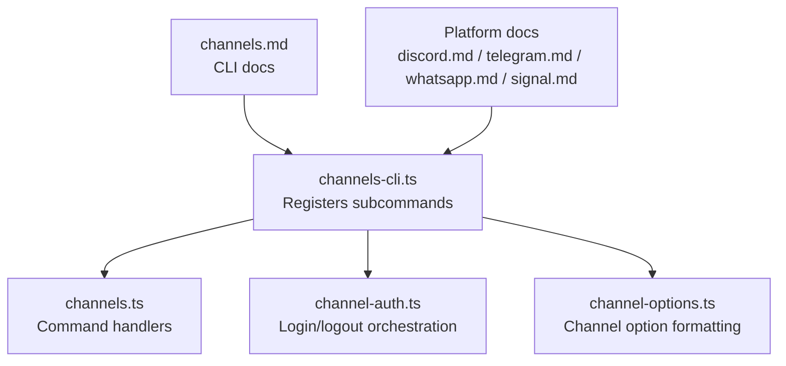
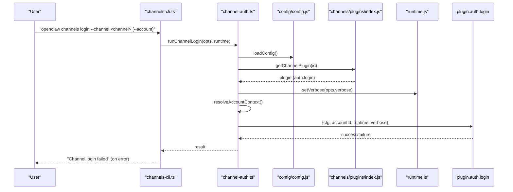
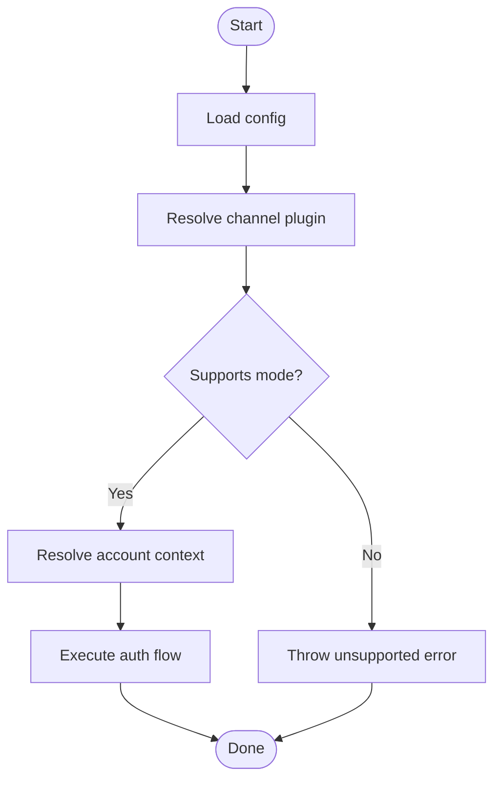
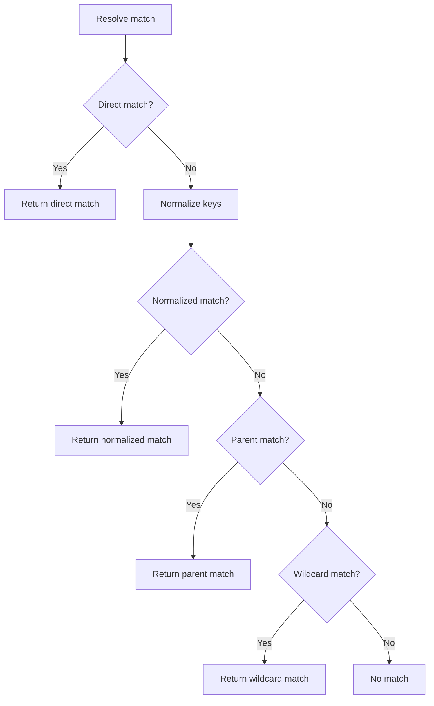
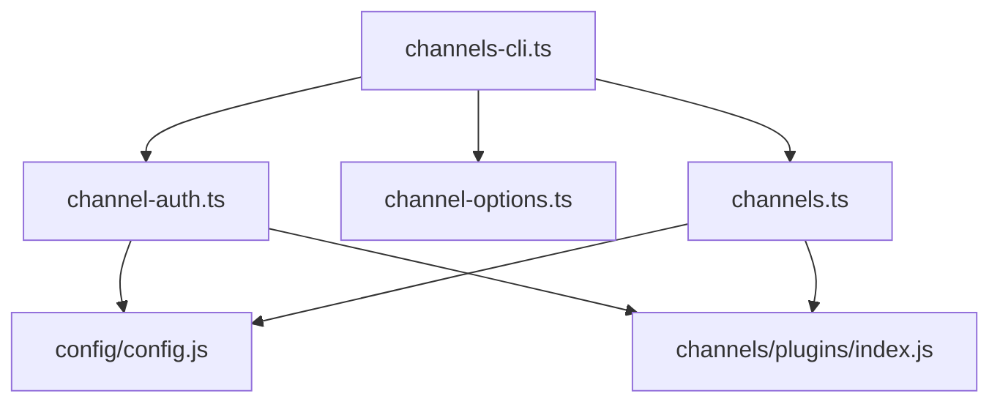

# Channel Operations

<cite>
**Referenced Files in This Document**
- [channels.md](file://docs/cli/channels.md)
- [channels-cli.ts](file://src/cli/channels-cli.ts)
- [channel-auth.ts](file://src/cli/channel-auth.ts)
- [channel-options.ts](file://src/cli/channel-options.ts)
- [channels.ts](file://src/commands/channels.ts)
- [discord.md](file://docs/channels/discord.md)
- [telegram.md](file://docs/channels/telegram.md)
- [whatsapp.md](file://docs/channels/whatsapp.md)
- [signal.md](file://docs/channels/signal.md)
- [index.md](file://docs/channels/index.md)
- [channel-config.ts](file://src/channels/channel-config.ts)
</cite>

## Table of Contents
1. [Introduction](#introduction)
2. [Project Structure](#project-structure)
3. [Core Components](#core-components)
4. [Architecture Overview](#architecture-overview)
5. [Detailed Component Analysis](#detailed-component-analysis)
6. [Dependency Analysis](#dependency-analysis)
7. [Performance Considerations](#performance-considerations)
8. [Troubleshooting Guide](#troubleshooting-guide)
9. [Conclusion](#conclusion)
10. [Appendices](#appendices)

## Introduction
This document explains channel operations commands for OpenClaw channel management. It covers adding/removing channel accounts, configuration, status checking, authentication, and platform-specific setup. It also provides practical examples for popular channels (Discord, Telegram, WhatsApp, Signal), permission and routing configuration, testing and troubleshooting, security and rate limiting, and advanced scenarios like multi-account setups and channel grouping.

## Project Structure
Channel operations are exposed via the CLI under the channels command group. The CLI registers subcommands for listing, status, capabilities, resolution, logs, add/remove, and login/logout. Channel-specific configuration and behavior are documented in platform guides.

**Diagram sources**
- [channels-cli.ts:63-259](file://src/cli/channels-cli.ts#L63-L259)
- [channel-auth.ts:8-90](file://src/cli/channel-auth.ts#L8-L90)
- [channel-options.ts:50-69](file://src/cli/channel-options.ts#L50-L69)
- [channels.md:9-103](file://docs/cli/channels.md#L9-L103)
- [discord.md:8-1224](file://docs/channels/discord.md#L8-L1224)
- [telegram.md:8-982](file://docs/channels/telegram.md#L8-L982)
- [whatsapp.md:8-446](file://docs/channels/whatsapp.md#L8-L446)
- [signal.md:9-330](file://docs/channels/signal.md#L9-L330)

**Section sources**
- [channels-cli.ts:63-259](file://src/cli/channels-cli.ts#L63-L259)
- [channels.md:9-103](file://docs/cli/channels.md#L9-L103)

## Core Components
- Channels CLI: Registers commands for list, status, capabilities, resolve, logs, add, remove, login, logout.
- Channel authentication: Orchestrates login/logout flows per channel plugin.
- Channel options: Resolves and formats channel names for CLI help and validation.
- Command handlers: Implements the logic for each channel operation.

Key CLI commands and options:
- List: List configured channels and auth profiles; optional JSON output and usage snapshot control.
- Status: Show channel status; optional probe, timeout, and JSON output.
- Capabilities: Provider capability hints and supported features; optional channel/account/target filters.
- Resolve: Resolve names to IDs using provider directory; supports kind override.
- Logs: Tail channel logs from the gateway log file; filter by channel and line count.
- Add: Add or update a channel account; supports per-channel flags (tokens, private keys, app tokens, signal-cli paths, etc.).
- Remove: Disable or delete a channel account; optional deletion flag.
- Login/Logout: Interactive linking and session logout for supported channels.

**Section sources**
- [channels-cli.ts:85-259](file://src/cli/channels-cli.ts#L85-L259)
- [channels.md:18-103](file://docs/cli/channels.md#L18-L103)

## Architecture Overview
Channel operations integrate CLI, runtime, and channel plugins. The CLI validates options, loads configuration, and invokes command handlers. Authentication flows resolve channel plugin capabilities and account context before performing login/logout.

**Diagram sources**
- [channels-cli.ts:223-240](file://src/cli/channels-cli.ts#L223-L240)
- [channel-auth.ts:48-68](file://src/cli/channel-auth.ts#L48-L68)

**Section sources**
- [channels-cli.ts:223-240](file://src/cli/channels-cli.ts#L223-L240)
- [channel-auth.ts:8-90](file://src/cli/channel-auth.ts#L8-L90)

## Detailed Component Analysis

### Channels CLI: Subcommands and Options
- list: Lists configured channels and auth profiles; supports JSON output and usage snapshot control.
- status: Shows channel status; supports probe, timeout, and JSON output.
- capabilities: Capability probing for providers; supports channel/account/target filters.
- resolve: Resolves names to IDs; supports kind override and JSON output.
- logs: Tails channel logs; supports channel filter and line count.
- add: Adds or updates channel accounts; supports extensive per-channel flags.
- remove: Disables or deletes channel accounts; supports deletion flag.
- login/logout: Interactive flows for supported channels.

Channel option formatting ensures consistent help text and validation across supported channels.

**Section sources**
- [channels-cli.ts:85-259](file://src/cli/channels-cli.ts#L85-L259)
- [channel-options.ts:50-69](file://src/cli/channel-options.ts#L50-L69)

### Channel Authentication Orchestration
- Login: Validates channel and mode, resolves plugin, and executes channel-specific login flow with account context.
- Logout: Validates channel and mode, resolves plugin, and executes channel-specific logout flow clearing session state.

**Diagram sources**
- [channel-auth.ts:17-37](file://src/cli/channel-auth.ts#L17-L37)
- [channel-auth.ts:48-89](file://src/cli/channel-auth.ts#L48-L89)

**Section sources**
- [channel-auth.ts:8-90](file://src/cli/channel-auth.ts#L8-L90)

### Platform-Specific Configuration and Setup

#### Discord
- Setup: Create bot, enable intents, copy token, invite bot, enable developer mode, collect IDs, configure token and enable channel, pair via DM.
- Policies: DM policy (pairing, allowlist, open, disabled), guild allowlist, mention gating, group DMs.
- Routing: Role-based bindings, persistent ACP bindings, thread bindings for subagents.
- Limits and streaming: Streaming modes, history limits, reply tagging, reaction notifications, acknowledgements.

Practical example paths:
- [Discord quick setup:24-167](file://docs/channels/discord.md#L24-L167)
- [Access control and routing:369-461](file://docs/channels/discord.md#L369-L461)
- [Feature details:554-800](file://docs/channels/discord.md#L554-L800)

**Section sources**
- [discord.md:24-167](file://docs/channels/discord.md#L24-L167)
- [discord.md:369-461](file://docs/channels/discord.md#L369-L461)
- [discord.md:554-800](file://docs/channels/discord.md#L554-L800)

#### Telegram
- Setup: Create bot token in BotFather, configure token and DM policy, start gateway, approve pairing, add bot to groups.
- Policies: DM policy, group policy, allowlists, mention behavior, forum topics and per-topic routing.
- Features: Live stream preview, inline buttons, message actions, stickers, reaction notifications, long polling vs webhook, limits and retries.

Practical example paths:
- [Telegram quick setup:24-69](file://docs/channels/telegram.md#L24-L69)
- [Access control and activation:105-246](file://docs/channels/telegram.md#L105-L246)
- [Feature reference:258-796](file://docs/channels/telegram.md#L258-L796)

**Section sources**
- [telegram.md:24-69](file://docs/channels/telegram.md#L24-L69)
- [telegram.md:105-246](file://docs/channels/telegram.md#L105-L246)
- [telegram.md:258-796](file://docs/channels/telegram.md#L258-L796)

#### WhatsApp
- Setup: Configure access policy, link via QR, start gateway, approve pairing if using pairing mode.
- Policies: DM policy, group policy, allowlists, mention gating, self-chat safeguards.
- Behavior: Message normalization, media placeholders, pending group history, read receipts, delivery limits, acknowledgments, multi-account credentials.

Practical example paths:
- [WhatsApp quick setup:24-76](file://docs/channels/whatsapp.md#L24-L76)
- [Access control and activation:134-200](file://docs/channels/whatsapp.md#L134-L200)
- [Message normalization and context:210-290](file://docs/channels/whatsapp.md#L210-L290)
- [Delivery, chunking, and media:292-316](file://docs/channels/whatsapp.md#L292-L316)
- [Multi-account and credentials:343-364](file://docs/channels/whatsapp.md#L343-L364)

**Section sources**
- [whatsapp.md:24-76](file://docs/channels/whatsapp.md#L24-L76)
- [whatsapp.md:134-200](file://docs/channels/whatsapp.md#L134-L200)
- [whatsapp.md:210-290](file://docs/channels/whatsapp.md#L210-L290)
- [whatsapp.md:292-316](file://docs/channels/whatsapp.md#L292-L316)
- [whatsapp.md:343-364](file://docs/channels/whatsapp.md#L343-L364)

#### Signal
- Setup: Use separate number, install signal-cli, link or register, configure OpenClaw, pair DM.
- Policies: DM policy (pairing recommended), group policy, allowlists, UUID-based identifiers.
- Behavior: Daemon mode (HTTP JSON-RPC + SSE), typing indicators, read receipts, media, limits, reactions, delivery targets.

Practical example paths:
- [Signal quick setup:20-157](file://docs/channels/signal.md#L20-L157)
- [Access control (DMs + groups):182-201](file://docs/channels/signal.md#L182-L201)
- [How it works (behavior):202-222](file://docs/channels/signal.md#L202-L222)
- [Media + limits:208-216](file://docs/channels/signal.md#L208-L216)
- [Reactions (message tool):223-245](file://docs/channels/signal.md#L223-L245)
- [Delivery targets (CLI/cron):246-252](file://docs/channels/signal.md#L246-L252)

**Section sources**
- [signal.md:20-157](file://docs/channels/signal.md#L20-L157)
- [signal.md:182-201](file://docs/channels/signal.md#L182-L201)
- [signal.md:202-222](file://docs/channels/signal.md#L202-L222)
- [signal.md:208-216](file://docs/channels/signal.md#L208-L216)
- [signal.md:223-245](file://docs/channels/signal.md#L223-L245)
- [signal.md:246-252](file://docs/channels/signal.md#L246-L252)

### Channel Configuration Matching and Routing
Channel configuration supports flexible matching and inheritance:
- Direct, parent, and wildcard matching for entries.
- Normalization of keys and candidate building.
- Nested allowlist decisions combining outer and inner configuration.

**Diagram sources**
- [channel-config.ts:60-164](file://src/channels/channel-config.ts#L60-L164)

**Section sources**
- [channel-config.ts:1-183](file://src/channels/channel-config.ts#L1-L183)

### Practical Examples

#### Adding and Removing Accounts
- Add a Telegram bot account: use the token flag.
- Add a Nostr account: use the private key flag.
- Remove a Telegram account: use the delete flag to remove configuration entries.

Reference:
- [channels.md:29-57](file://docs/cli/channels.md#L29-L57)

#### Login and Logout
- Link a WhatsApp Web account: interactive login.
- Log out of a channel session: interactive logout.

Reference:
- [channels.md:59-71](file://docs/cli/channels.md#L59-L71)

#### Status and Capabilities
- Probe channel credentials and capabilities.
- Resolve names to IDs using provider directory.

Reference:
- [channels.md:73-103](file://docs/cli/channels.md#L73-L103)

#### Popular Channel Setup Examples
- Discord: create bot, enable intents, copy token, invite bot, configure token, pair via DM.
- Telegram: create bot token, configure token and DM policy, start gateway, approve pairing, add bot to groups.
- WhatsApp: configure access policy, link via QR, start gateway, approve pairing if using pairing mode.
- Signal: use separate number, install signal-cli, link or register, configure OpenClaw, pair DM.

References:
- [discord.md:24-167](file://docs/channels/discord.md#L24-L167)
- [telegram.md:24-69](file://docs/channels/telegram.md#L24-L69)
- [whatsapp.md:24-76](file://docs/channels/whatsapp.md#L24-L76)
- [signal.md:20-157](file://docs/channels/signal.md#L20-L157)

#### Permissions and Routing
- Discord: DM policy, guild allowlist, mention gating, role-based bindings, thread bindings.
- Telegram: DM policy, group policy, allowlists, mention behavior, forum topics and per-topic routing.
- WhatsApp: DM policy, group policy, allowlists, mention gating, self-chat safeguards.
- Signal: DM policy, group policy, allowlists, UUID-based identifiers.

References:
- [discord.md:369-461](file://docs/channels/discord.md#L369-L461)
- [telegram.md:105-246](file://docs/channels/telegram.md#L105-L246)
- [whatsapp.md:134-200](file://docs/channels/whatsapp.md#L134-L200)
- [signal.md:182-201](file://docs/channels/signal.md#L182-L201)

#### Advanced Scenarios
- Multi-account setups: use accounts blocks and per-account overrides.
- Channel grouping: configure groups and topics per channel.
- Custom channel configurations: leverage provider-specific fields and capabilities.

References:
- [discord.md:369-461](file://docs/channels/discord.md#L369-L461)
- [telegram.md:105-246](file://docs/channels/telegram.md#L105-L246)
- [whatsapp.md:343-364](file://docs/channels/whatsapp.md#L343-L364)
- [signal.md:182-201](file://docs/channels/signal.md#L182-L201)

## Dependency Analysis
Channel operations depend on:
- CLI registration and option parsing.
- Configuration loading and validation.
- Channel plugin resolution and capability checks.
- Runtime environment and verbose logging.

**Diagram sources**
- [channels-cli.ts:63-259](file://src/cli/channels-cli.ts#L63-L259)
- [channel-auth.ts:48-89](file://src/cli/channel-auth.ts#L48-L89)
- [channel-options.ts:50-69](file://src/cli/channel-options.ts#L50-L69)

**Section sources**
- [channels-cli.ts:63-259](file://src/cli/channels-cli.ts#L63-L259)
- [channel-auth.ts:8-90](file://src/cli/channel-auth.ts#L8-L90)
- [channel-options.ts:50-69](file://src/cli/channel-options.ts#L50-L69)

## Performance Considerations
- Use JSON output for machine-readable status and logs.
- Limit log lines and timeouts for faster diagnostics.
- Prefer allowlists and mention gating to reduce unnecessary processing.
- Tune streaming modes and chunk sizes per channel to balance latency and throughput.

## Troubleshooting Guide
Common issues and resolutions:
- Status and diagnostics: run deep status and doctor checks; use logs to follow activity.
- Capability probing: fetch provider capabilities and static feature support.
- Name resolution: resolve names to IDs using provider directory; read-only operation.
- Channel-specific troubleshooting: consult platform guides for setup and runtime behavior.

References:
- [channels.md:66-103](file://docs/cli/channels.md#L66-L103)
- [discord.md:554-800](file://docs/channels/discord.md#L554-L800)
- [telegram.md:258-796](file://docs/channels/telegram.md#L258-L796)
- [whatsapp.md:374-424](file://docs/channels/whatsapp.md#L374-L424)
- [signal.md:253-288](file://docs/channels/signal.md#L253-L288)

**Section sources**
- [channels.md:66-103](file://docs/cli/channels.md#L66-L103)
- [discord.md:554-800](file://docs/channels/discord.md#L554-L800)
- [telegram.md:258-796](file://docs/channels/telegram.md#L258-L796)
- [whatsapp.md:374-424](file://docs/channels/whatsapp.md#L374-L424)
- [signal.md:253-288](file://docs/channels/signal.md#L253-L288)

## Conclusion
OpenClaw’s channel operations provide a comprehensive CLI for managing channel accounts, authentication, and runtime status. Platform-specific guides offer detailed configuration patterns for Discord, Telegram, WhatsApp, and Signal. Use capabilities probing, name resolution, and logs to troubleshoot and optimize channel behavior. Apply permissions and routing controls to secure and tailor channel interactions to your workflows.

## Appendices
- Supported channels overview: [Chat Channels:14-37](file://docs/channels/index.md#L14-L37)

**Section sources**
- [index.md:14-37](file://docs/channels/index.md#L14-L37)