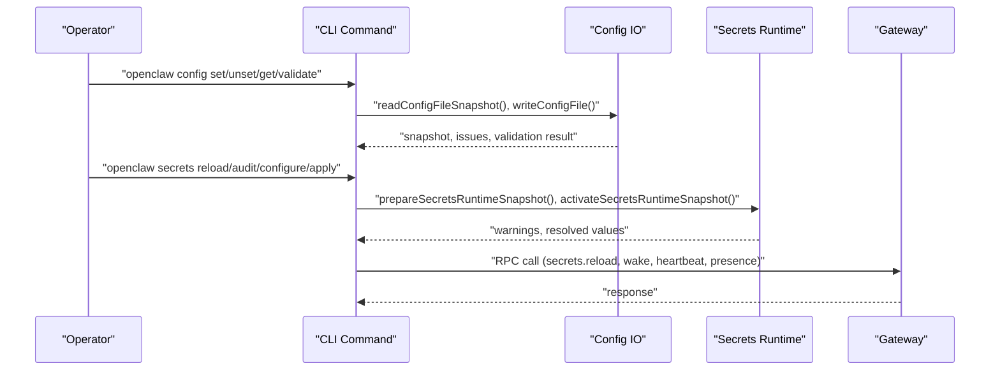
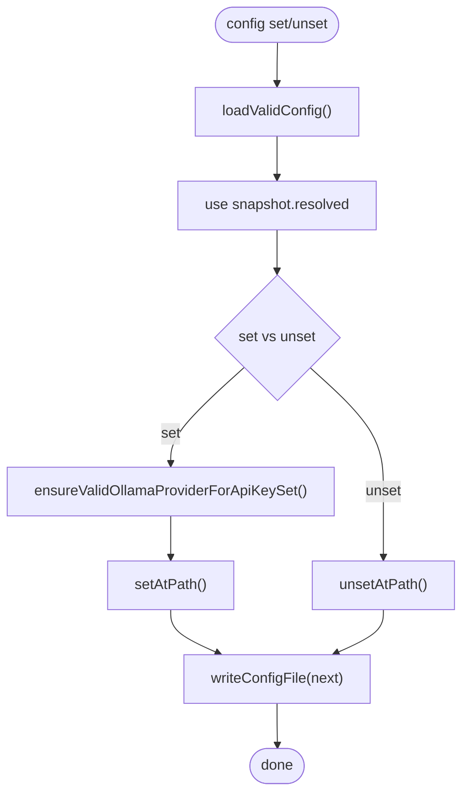
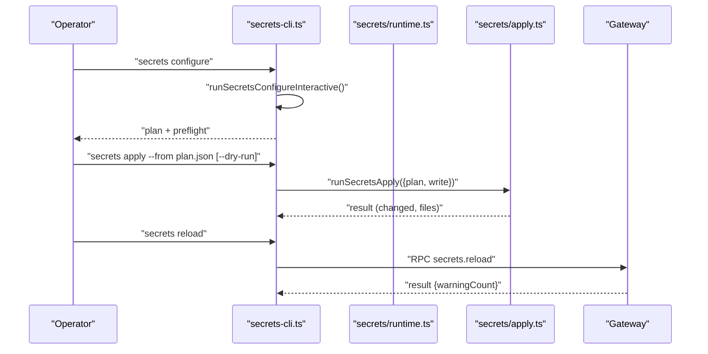
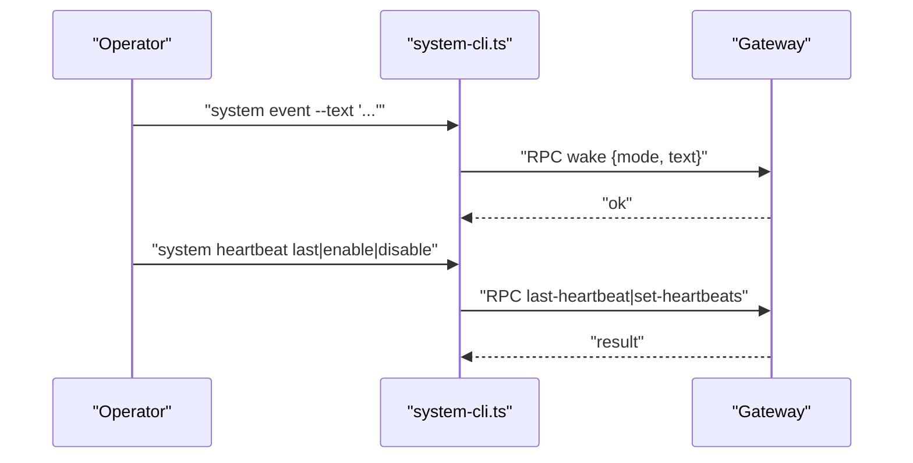
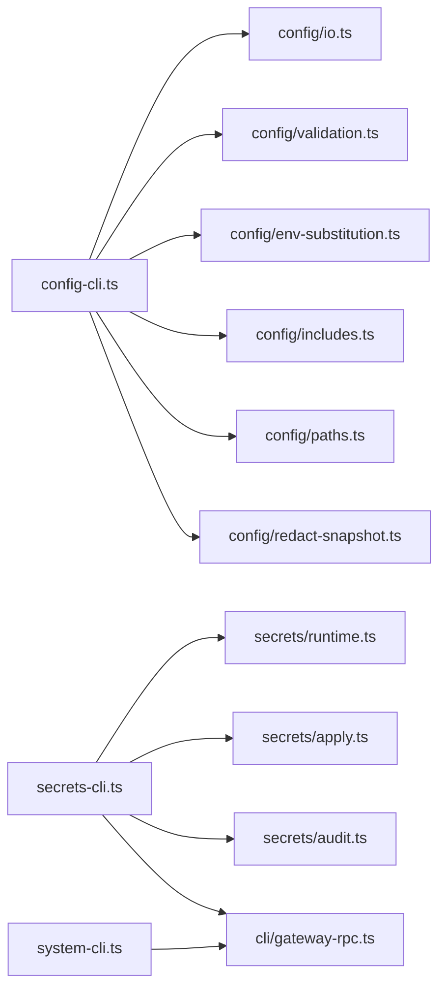

# Configuration Management

<cite>
**Referenced Files in This Document**
- [src/cli/config-cli.ts](file://src/cli/config-cli.ts)
- [src/cli/secrets-cli.ts](file://src/cli/secrets-cli.ts)
- [src/cli/system-cli.ts](file://src/cli/system-cli.ts)
- [src/config/io.ts](file://src/config/io.ts)
- [src/config/config.ts](file://src/config/config.ts)
- [src/config/env-substitution.ts](file://src/config/env-substitution.ts)
- [src/config/env-vars.ts](file://src/config/env-vars.ts)
- [src/config/includes.ts](file://src/config/includes.ts)
- [src/config/paths.ts](file://src/config/paths.ts)
- [src/config/redact-snapshot.ts](file://src/config/redact-snapshot.ts)
- [src/config/validation.ts](file://src/config/validation.ts)
- [src/config/backup-rotation.ts](file://src/config/backup-rotation.ts)
- [src/secrets/runtime.ts](file://src/secrets/runtime.ts)
- [src/secrets/config-io.ts](file://src/secrets/config-io.ts)
- [src/secrets/audit.ts](file://src/secrets/audit.ts)
- [src/secrets/apply.ts](file://src/secrets/apply.ts)
- [src/secrets/configure.ts](file://src/secrets/configure.ts)
- [src/secrets/plan.ts](file://src/secrets/plan.ts)
- [src/secrets/resolve.ts](file://src/secrets/resolve.ts)
- [src/secrets/shared.ts](file://src/secrets/shared.ts)
- [src/cli/gateway-rpc.ts](file://src/cli/gateway-rpc.ts)
- [docs/cli/config.md](file://docs/cli/config.md)
- [docs/cli/secrets.md](file://docs/cli/secrets.md)
- [docs/cli/system.md](file://docs/cli/system.md)
</cite>

## Table of Contents
1. [Introduction](#introduction)
2. [Project Structure](#project-structure)
3. [Core Components](#core-components)
4. [Architecture Overview](#architecture-overview)
5. [Detailed Component Analysis](#detailed-component-analysis)
6. [Dependency Analysis](#dependency-analysis)
7. [Performance Considerations](#performance-considerations)
8. [Troubleshooting Guide](#troubleshooting-guide)
9. [Conclusion](#conclusion)
10. [Appendices](#appendices)

## Introduction
This document explains configuration management in the system, focusing on three CLI command families: config, secrets, and system. It covers configuration file management, environment variable handling, secret storage and rotation, and system-level controls. It also documents configuration hierarchy, precedence rules, validation procedures, secret management workflows, encryption considerations, security best practices, backup and migration procedures, and troubleshooting.

## Project Structure
The configuration management capabilities are implemented across CLI command modules and core configuration/runtime subsystems:
- CLI commands: config, secrets, system
- Configuration IO and validation: includes, environment substitution, env vars, paths, validation, backup rotation
- Secrets runtime and plan-driven apply pipeline
- Gateway RPC integration for system commands

```mermaid
graph TB
subgraph "CLI Commands"
CFG["config-cli.ts"]
SEC["secrets-cli.ts"]
SYS["system-cli.ts"]
end
subgraph "Config Core"
IO["config/io.ts"]
ENV_SUB["config/env-substitution.ts"]
ENV_VARS["config/env-vars.ts"]
INCLUDES["config/includes.ts"]
PATHS["config/paths.ts"]
VALID["config/validation.ts"]
BACKUP["config/backup-rotation.ts"]
end
subgraph "Secrets Core"
SEC_RT["secrets/runtime.ts"]
SEC_IO["secrets/config-io.ts"]
SEC_AUD["secrets/audit.ts"]
SEC_APPLY["secrets/apply.ts"]
SEC_CONF["secrets/configure.ts"]
SEC_PLAN["secrets/plan.ts"]
SEC_RESOLVE["secrets/resolve.ts"]
end
subgraph "Gateway RPC"
GW_RPC["cli/gateway-rpc.ts"]
end
CFG --> IO
CFG --> VALID
CFG --> PATHS
CFG --> ENV_SUB
CFG --> INCLUDES
CFG --> BACKUP
SEC --> SEC_RT
SEC --> SEC_IO
SEC --> SEC_AUD
SEC --> SEC_APPLY
SEC --> SEC_CONF
SEC --> SEC_PLAN
SEC --> SEC_RESOLVE
SYS --> GW_RPC
```

**Diagram sources**
- [src/cli/config-cli.ts](file://src/cli/config-cli.ts#L1-L477)
- [src/cli/secrets-cli.ts](file://src/cli/secrets-cli.ts#L1-L252)
- [src/cli/system-cli.ts](file://src/cli/system-cli.ts#L1-L133)
- [src/config/io.ts](file://src/config/io.ts#L1-L800)
- [src/config/env-substitution.ts](file://src/config/env-substitution.ts)
- [src/config/env-vars.ts](file://src/config/env-vars.ts)
- [src/config/includes.ts](file://src/config/includes.ts)
- [src/config/paths.ts](file://src/config/paths.ts)
- [src/config/validation.ts](file://src/config/validation.ts)
- [src/config/backup-rotation.ts](file://src/config/backup-rotation.ts)
- [src/secrets/runtime.ts](file://src/secrets/runtime.ts#L1-L251)
- [src/secrets/config-io.ts](file://src/secrets/config-io.ts#L1-L15)
- [src/secrets/audit.ts](file://src/secrets/audit.ts)
- [src/secrets/apply.ts](file://src/secrets/apply.ts)
- [src/secrets/configure.ts](file://src/secrets/configure.ts)
- [src/secrets/plan.ts](file://src/secrets/plan.ts)
- [src/secrets/resolve.ts](file://src/secrets/resolve.ts)
- [src/cli/gateway-rpc.ts](file://src/cli/gateway-rpc.ts)

**Section sources**
- [src/cli/config-cli.ts](file://src/cli/config-cli.ts#L1-L477)
- [src/cli/secrets-cli.ts](file://src/cli/secrets-cli.ts#L1-L252)
- [src/cli/system-cli.ts](file://src/cli/system-cli.ts#L1-L133)
- [src/config/io.ts](file://src/config/io.ts#L1-L800)

## Core Components
- Config CLI: Non-interactive helpers to get/set/unset values by path, print the active config file, and validate the schema without starting the gateway.
- Secrets CLI: Runtime controls for reloading secret references, auditing plaintext/unresolved refs, interactive configure (provider setup + SecretRef mapping + preflight), and applying saved plans.
- System CLI: System-level tools to enqueue system events, control heartbeats, and list presence entries via Gateway RPC.

**Section sources**
- [src/cli/config-cli.ts](file://src/cli/config-cli.ts#L395-L477)
- [src/cli/secrets-cli.ts](file://src/cli/secrets-cli.ts#L43-L252)
- [src/cli/system-cli.ts](file://src/cli/system-cli.ts#L41-L133)
- [docs/cli/config.md](file://docs/cli/config.md#L1-L69)
- [docs/cli/secrets.md](file://docs/cli/secrets.md#L1-L174)
- [docs/cli/system.md](file://docs/cli/system.md#L1-L61)

## Architecture Overview
Configuration management spans file IO, environment handling, include resolution, validation, and runtime snapshots. Secrets management builds on top of the configuration runtime to resolve references and atomically swap snapshots.

**Diagram sources**
- [src/cli/config-cli.ts](file://src/cli/config-cli.ts#L279-L393)
- [src/config/io.ts](file://src/config/io.ts#L707-L800)
- [src/secrets/runtime.ts](file://src/secrets/runtime.ts#L102-L197)
- [src/cli/secrets-cli.ts](file://src/cli/secrets-cli.ts#L58-L79)
- [src/cli/system-cli.ts](file://src/cli/system-cli.ts#L58-L71)

## Detailed Component Analysis

### Config CLI
- Path parsing supports dot and bracket notation with escaping and index segments.
- Value parsing uses JSON5 with a strict mode option; otherwise raw strings.
- Operations:
  - get: resolves config, redacts sensitive values, prints value or JSON.
  - set: loads resolved config, ensures provider defaults when setting API keys, updates path, writes file.
  - unset: removes path from resolved config and writes with unset paths recorded.
  - file: prints active config file path.
  - validate: validates against schema and prints issues or success.
- Precedence and safety:
  - Writes use the resolved config (after includes and ${ENV} resolution) to avoid leaking runtime defaults.
  - Backup rotation is maintained during writes.

**Diagram sources**
- [src/cli/config-cli.ts](file://src/cli/config-cli.ts#L279-L331)
- [src/config/io.ts](file://src/config/io.ts#L19-L20)

**Section sources**
- [src/cli/config-cli.ts](file://src/cli/config-cli.ts#L25-L182)
- [src/cli/config-cli.ts](file://src/cli/config-cli.ts#L279-L393)
- [docs/cli/config.md](file://docs/cli/config.md#L14-L69)

### Secrets CLI
- reload: gateway RPC to re-resolve secret references and atomically swap runtime snapshot; returns warning count.
- audit: read-only scan for plaintext, unresolved refs, precedence drift, legacy residues; supports --check and --json.
- configure: interactive planner for provider setup and credential mapping; generates a plan with preflight; optional apply with irreversible confirmation.
- apply: executes a saved plan (--dry-run for validation); updates openclaw.json, auth-profiles.json, legacy auth.json residues, and ~/.openclaw/.env for migrated keys.

**Diagram sources**
- [src/cli/secrets-cli.ts](file://src/cli/secrets-cli.ts#L133-L214)
- [src/cli/secrets-cli.ts](file://src/cli/secrets-cli.ts#L222-L250)
- [src/secrets/runtime.ts](file://src/secrets/runtime.ts#L102-L197)
- [src/secrets/apply.ts](file://src/secrets/apply.ts)
- [src/cli/gateway-rpc.ts](file://src/cli/gateway-rpc.ts)

**Section sources**
- [src/cli/secrets-cli.ts](file://src/cli/secrets-cli.ts#L43-L252)
- [docs/cli/secrets.md](file://docs/cli/secrets.md#L21-L174)

### System CLI
- event: enqueues a system event; --mode now triggers immediate heartbeat; next-heartbeat waits for the next tick.
- heartbeat: last, enable, disable.
- presence: lists system presence entries.

**Diagram sources**
- [src/cli/system-cli.ts](file://src/cli/system-cli.ts#L58-L131)
- [src/cli/gateway-rpc.ts](file://src/cli/gateway-rpc.ts)

**Section sources**
- [src/cli/system-cli.ts](file://src/cli/system-cli.ts#L41-L133)
- [docs/cli/system.md](file://docs/cli/system.md#L17-L61)

## Dependency Analysis
- Config CLI depends on:
  - Config IO for reading/writing snapshots and validation
  - Environment substitution and includes for resolving ${VAR} and $include
  - Paths for locating the active config file
  - Redaction for safe printing of config values
- Secrets CLI depends on:
  - Secrets runtime to prepare and activate a snapshot with resolved references
  - Apply pipeline to persist changes and scrub plaintext
  - Audit module for scanning and reporting
  - Gateway RPC for reload
- System CLI depends on Gateway RPC for event/heartbeat/presence operations.

**Diagram sources**
- [src/cli/config-cli.ts](file://src/cli/config-cli.ts#L1-L15)
- [src/config/io.ts](file://src/config/io.ts#L1-L56)
- [src/config/env-substitution.ts](file://src/config/env-substitution.ts)
- [src/config/includes.ts](file://src/config/includes.ts)
- [src/config/paths.ts](file://src/config/paths.ts)
- [src/config/redact-snapshot.ts](file://src/config/redact-snapshot.ts)
- [src/cli/secrets-cli.ts](file://src/cli/secrets-cli.ts#L1-L12)
- [src/secrets/runtime.ts](file://src/secrets/runtime.ts#L1-L28)
- [src/secrets/apply.ts](file://src/secrets/apply.ts)
- [src/secrets/audit.ts](file://src/secrets/audit.ts)
- [src/cli/gateway-rpc.ts](file://src/cli/gateway-rpc.ts)
- [src/cli/system-cli.ts](file://src/cli/system-cli.ts#L1-L7)

**Section sources**
- [src/cli/config-cli.ts](file://src/cli/config-cli.ts#L1-L15)
- [src/config/io.ts](file://src/config/io.ts#L1-L56)
- [src/cli/secrets-cli.ts](file://src/cli/secrets-cli.ts#L1-L12)
- [src/secrets/runtime.ts](file://src/secrets/runtime.ts#L1-L28)
- [src/cli/system-cli.ts](file://src/cli/system-cli.ts#L1-L7)

## Performance Considerations
- Config IO:
  - Includes and environment substitution are resolved once per read; avoid excessive re-reads.
  - Validation runs with plugins; keep config concise to reduce overhead.
- Secrets runtime:
  - Snapshot preparation clones large structures; avoid frequent refreshes.
  - Resolve operations are batched by reference; minimize redundant assignments.
- System commands:
  - RPC calls incur network latency; batch operations when possible.

[No sources needed since this section provides general guidance]

## Troubleshooting Guide
- Config validation failures:
  - Use config validate to identify schema issues; fix reported paths and rerun.
  - Some validations emit actionable suggestions for correcting mismatches.
- Invalid config errors:
  - Errors include a code and details; address issues and retry.
- Environment variable references:
  - Missing env vars produce warnings; ensure required variables are set or use dotenv.
- Secrets audit findings:
  - Use secrets audit --check to gate CI; address plaintext, unresolved refs, and precedence drift.
  - After configure/apply, run secrets reload to activate changes safely.
- System events:
  - Verify Gateway connectivity and heartbeat status; use --json for machine-readable output.

**Section sources**
- [src/config/io.ts](file://src/config/io.ts#L745-L761)
- [src/config/io.ts](file://src/config/io.ts#L729-L733)
- [src/config/env-substitution.ts](file://src/config/env-substitution.ts)
- [src/cli/secrets-cli.ts](file://src/cli/secrets-cli.ts#L86-L114)
- [src/cli/system-cli.ts](file://src/cli/system-cli.ts#L58-L71)
- [docs/cli/config.md](file://docs/cli/config.md#L60-L69)
- [docs/cli/secrets.md](file://docs/cli/secrets.md#L78-L92)
- [docs/cli/system.md](file://docs/cli/system.md#L57-L61)

## Conclusion
The configuration management system provides robust, non-interactive editing, secure secret handling with plan-driven apply, and system-level controls. By understanding precedence, validation, and the runtime snapshot mechanism, operators can reliably manage configurations, rotate secrets, and troubleshoot issues.

[No sources needed since this section summarizes without analyzing specific files]

## Appendices

### Configuration Hierarchy and Precedence
- Resolution order:
  - $include files are merged and resolved relative to the config root.
  - Environment variables are substituted after includes are resolved.
  - Runtime defaults are applied after validation and normalization.
- Safety:
  - Writes use the resolved config (before runtime defaults) to prevent leakage of defaults into persisted files.
  - Backup rotation maintains recent copies for recovery.

**Section sources**
- [src/config/io.ts](file://src/config/io.ts#L653-L691)
- [src/config/io.ts](file://src/config/io.ts#L707-L800)
- [src/config/backup-rotation.ts](file://src/config/backup-rotation.ts)

### Secret Management Workflows and Security Best Practices
- Workflow:
  - Audit -> Configure (interactive plan) -> Dry-run apply -> Apply -> Audit -> Reload.
- Security:
  - Prefer SecretRef over plaintext.
  - Scrub legacy residues and plaintext values during apply.
  - One-way migration for plaintext values; irreversible confirmation is required.
  - Secrets runtime snapshot is activated atomically; on failure, last-known-good snapshot is preserved.

**Section sources**
- [docs/cli/secrets.md](file://docs/cli/secrets.md#L21-L31)
- [docs/cli/secrets.md](file://docs/cli/secrets.md#L159-L164)
- [src/secrets/runtime.ts](file://src/secrets/runtime.ts#L168-L197)

### System Event Handling and Presence Management
- Enqueue system events via system event; choose wake mode now or next-heartbeat.
- Control heartbeats with enable/disable and inspect last heartbeat.
- List presence entries to monitor nodes and instances.

**Section sources**
- [src/cli/system-cli.ts](file://src/cli/system-cli.ts#L58-L131)
- [docs/cli/system.md](file://docs/cli/system.md#L24-L61)