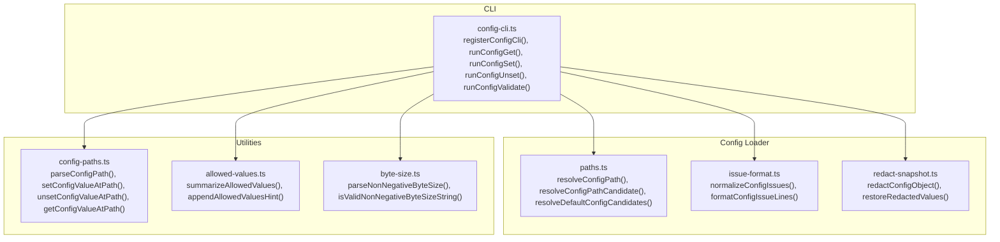
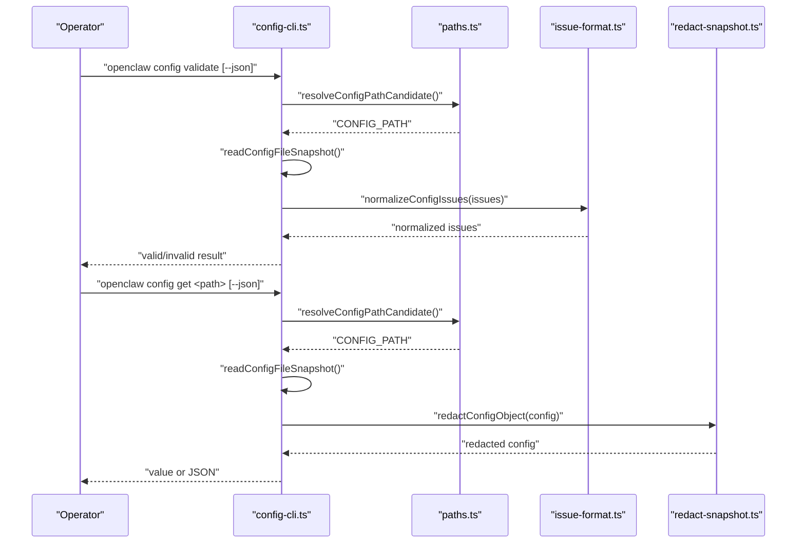
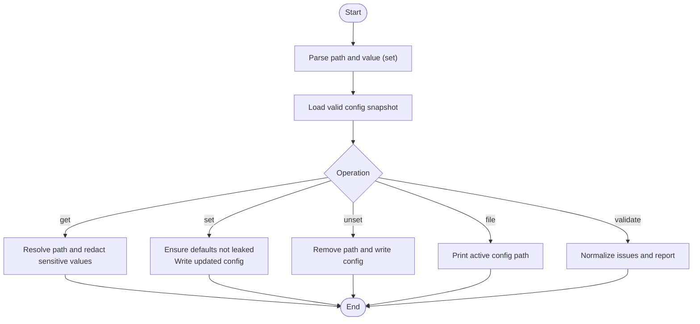
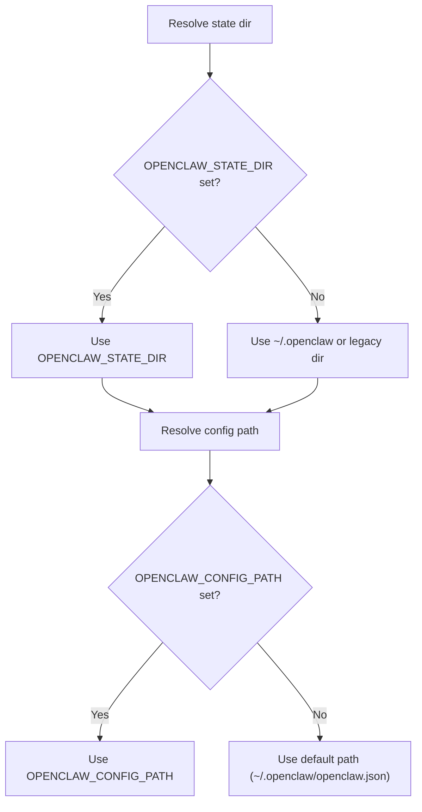
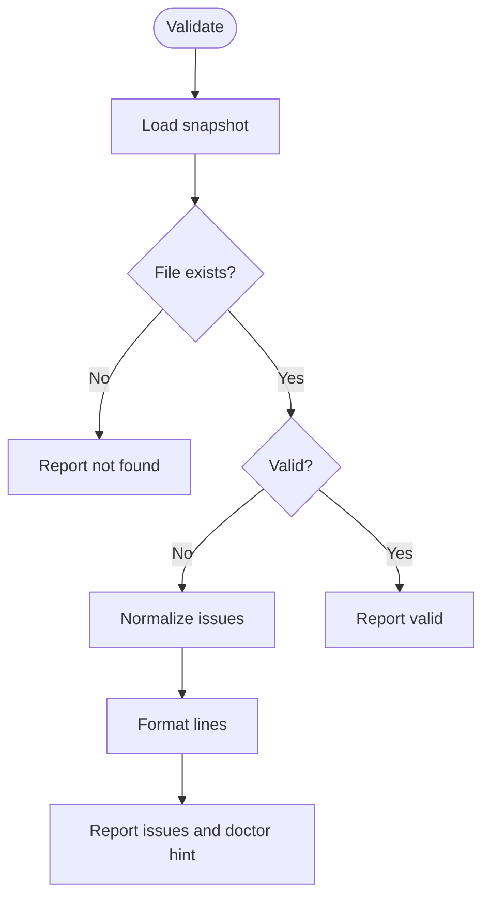
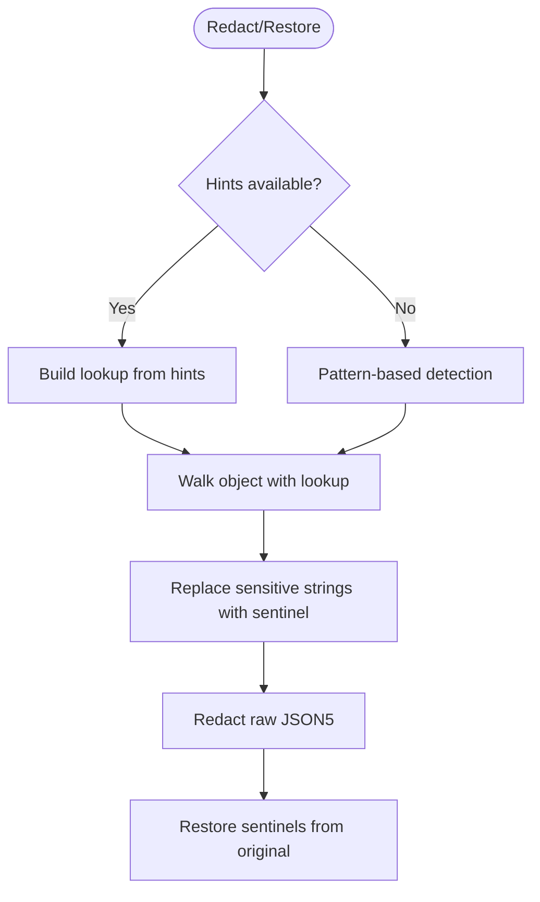
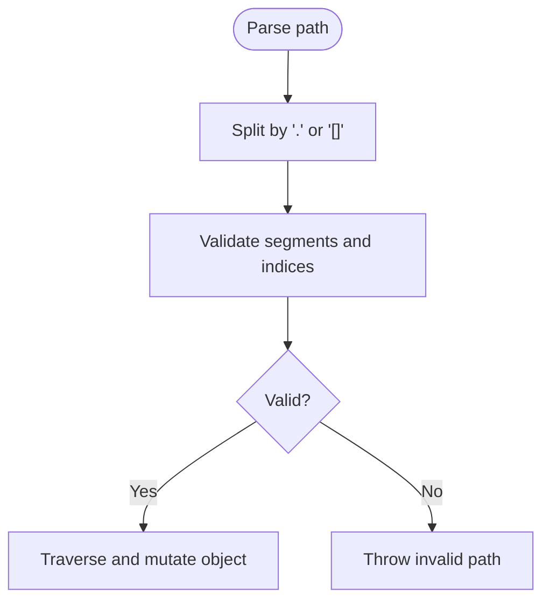
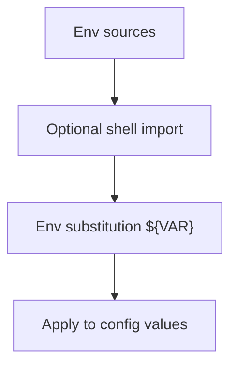
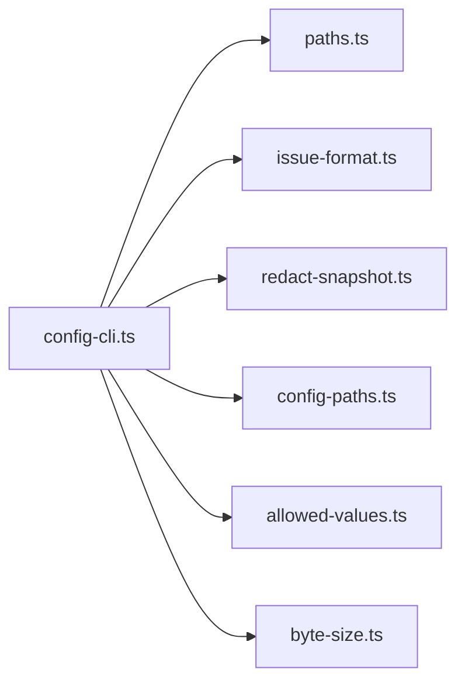

# Configuration Management

<cite>
**Referenced Files in This Document**
- [config.md](file://docs/cli/config.md)
- [configuration.md](file://docs/gateway/configuration.md)
- [configuration-reference.md](file://docs/gateway/configuration-reference.md)
- [config-cli.ts](file://src/cli/config-cli.ts)
- [paths.ts](file://src/config/paths.ts)
- [issue-format.ts](file://src/config/issue-format.ts)
- [redact-snapshot.ts](file://src/config/redact-snapshot.ts)
- [config-paths.ts](file://src/config/config-paths.ts)
- [allowed-values.ts](file://src/config/allowed-values.ts)
- [byte-size.ts](file://src/config/byte-size.ts)
- [types.ts](file://src/config/types.ts)
</cite>

## Table of Contents
1. [Introduction](#introduction)
2. [Project Structure](#project-structure)
3. [Core Components](#core-components)
4. [Architecture Overview](#architecture-overview)
5. [Detailed Component Analysis](#detailed-component-analysis)
6. [Dependency Analysis](#dependency-analysis)
7. [Performance Considerations](#performance-considerations)
8. [Troubleshooting Guide](#troubleshooting-guide)
9. [Conclusion](#conclusion)
10. [Appendices](#appendices)

## Introduction
This document explains configuration management for OpenClaw with a focus on the config get/set/unset commands, validation, and schema inspection. It covers configuration file locations, environment variable precedence, configuration inheritance patterns, and practical examples for common scenarios such as authentication credentials, model providers, channel settings, multi-agent setups, and environment-specific configurations. It also documents backup and restore operations, migration between versions, and troubleshooting configuration errors.

## Project Structure
OpenClaw’s configuration system centers around:
- A CLI subcommand suite for non-interactive configuration management
- A configuration loader and validator
- A configuration file resolver that honors environment overrides and legacy paths
- Utilities for path parsing, value redaction, allowed values reporting, and byte-size parsing

```mermaid
graph TB
subgraph "CLI"
CFG["config-cli.ts<br/>registerConfigCli(), runConfigGet(), runConfigSet(), runConfigUnset(), runConfigValidate()"]
end
subgraph "Config Loader"
PATHS["paths.ts<br/>resolveConfigPath(), resolveConfigPathCandidate(), resolveDefaultConfigCandidates()"]
ISSUE["issue-format.ts<br/>normalizeConfigIssues(), formatConfigIssueLines()"]
REDEEM["redact-snapshot.ts<br/>redactConfigObject(), restoreRedactedValues()"]
end
subgraph "Utilities"
CPATHS["config-paths.ts<br/>parseConfigPath(), setConfigValueAtPath(), unsetConfigValueAtPath(), getConfigValueAtPath()"]
ALLOW["allowed-values.ts<br/>summarizeAllowedValues(), appendAllowedValuesHint()"]
BYTES["byte-size.ts<br/>parseNonNegativeByteSize(), isValidNonNegativeByteSizeString()"]
end
CFG --> PATHS
CFG --> ISSUE
CFG --> REDEEM
CFG --> CPATHS
CFG --> BYTES
CFG --> ALLOW
```

**Diagram sources**
- [config-cli.ts:395-477](file://src/cli/config-cli.ts#L395-L477)
- [paths.ts:106-182](file://src/config/paths.ts#L106-L182)
- [issue-format.ts:35-68](file://src/config/issue-format.ts#L35-L68)
- [redact-snapshot.ts:378-431](file://src/config/redact-snapshot.ts#L378-L431)
- [config-paths.ts:6-82](file://src/config/config-paths.ts#L6-L82)
- [allowed-values.ts:54-98](file://src/config/allowed-values.ts#L54-L98)
- [byte-size.ts:7-29](file://src/config/byte-size.ts#L7-L29)

**Section sources**
- [config-cli.ts:1-477](file://src/cli/config-cli.ts#L1-L477)
- [paths.ts:1-273](file://src/config/paths.ts#L1-L273)
- [issue-format.ts:1-69](file://src/config/issue-format.ts#L1-L69)
- [redact-snapshot.ts:1-725](file://src/config/redact-snapshot.ts#L1-L725)
- [config-paths.ts:1-83](file://src/config/config-paths.ts#L1-L83)
- [allowed-values.ts:1-99](file://src/config/allowed-values.ts#L1-L99)
- [byte-size.ts:1-30](file://src/config/byte-size.ts#L1-L30)

## Core Components
- Config CLI commands: get, set, unset, file, validate
- Configuration file resolution and environment precedence
- Validation pipeline with normalized issues and human-readable formatting
- Sensitive value redaction and restoration for safe round-trips
- Path parsing and manipulation utilities
- Allowed values summarization and byte-size parsing helpers

**Section sources**
- [config.md:8-69](file://docs/cli/config.md#L8-L69)
- [config-cli.ts:279-393](file://src/cli/config-cli.ts#L279-L393)
- [paths.ts:106-182](file://src/config/paths.ts#L106-L182)
- [issue-format.ts:21-68](file://src/config/issue-format.ts#L21-L68)
- [redact-snapshot.ts:378-431](file://src/config/redact-snapshot.ts#L378-L431)
- [config-paths.ts:6-82](file://src/config/config-paths.ts#L6-L82)
- [allowed-values.ts:54-98](file://src/config/allowed-values.ts#L54-L98)
- [byte-size.ts:7-29](file://src/config/byte-size.ts#L7-L29)

## Architecture Overview
The configuration subsystem integrates CLI commands with the configuration loader and validator. The CLI resolves the active configuration path, validates it, and performs targeted updates or queries. Sensitive values are redacted in outputs and restored during writes to preserve credentials.

```mermaid
sequenceDiagram
participant User as "Operator"
participant CLI as "config-cli.ts"
participant Loader as "paths.ts"
participant Validator as "issue-format.ts"
participant Redactor as "redact-snapshot.ts"
User->>CLI : "openclaw config validate [--json]"
CLI->>Loader : "resolveConfigPathCandidate()"
Loader-->>CLI : "CONFIG_PATH"
CLI->>CLI : "readConfigFileSnapshot()"
CLI->>Validator : "normalizeConfigIssues(issues)"
Validator-->>CLI : "normalized issues"
CLI-->>User : "valid/invalid result"
User->>CLI : "openclaw config get <path> [--json]"
CLI->>Loader : "resolveConfigPathCandidate()"
Loader-->>CLI : "CONFIG_PATH"
CLI->>CLI : "readConfigFileSnapshot()"
CLI->>Redactor : "redactConfigObject(config)"
Redactor-->>CLI : "redacted config"
CLI-->>User : "value or JSON"
```

**Diagram sources**
- [config-cli.ts:344-393](file://src/cli/config-cli.ts#L344-L393)
- [paths.ts:121-182](file://src/config/paths.ts#L121-L182)
- [issue-format.ts:35-68](file://src/config/issue-format.ts#L35-L68)
- [redact-snapshot.ts:378-431](file://src/config/redact-snapshot.ts#L378-L431)

## Detailed Component Analysis

### Config CLI Commands
- get: Reads the active configuration, redacts sensitive values, and prints the requested value or JSON.
- set: Parses a path and value, ensures runtime defaults are not leaked into the written file, and writes the updated configuration.
- unset: Removes a key or array index from the resolved configuration and writes the result.
- file: Prints the active configuration file path.
- validate: Loads the configuration snapshot and reports validity with normalized issues.

```mermaid
flowchart TD
Start(["Start"]) --> Parse["Parse path and value (set)"]
Parse --> Load["Load valid config snapshot"]
Load --> Decision{"Operation"}
Decision --> |get| GetVal["Resolve path and redact sensitive values"]
Decision --> |set| SetVal["Ensure defaults not leaked<br/>Write updated config"]
Decision --> |unset| UnsetVal["Remove path and write config"]
Decision --> |file| PrintFile["Print active config path"]
Decision --> |validate| Validate["Normalize issues and report"]
GetVal --> End(["End"])
SetVal --> End
UnsetVal --> End
PrintFile --> End
Validate --> End
```

**Diagram sources**
- [config-cli.ts:279-393](file://src/cli/config-cli.ts#L279-L393)

**Section sources**
- [config.md:8-69](file://docs/cli/config.md#L8-L69)
- [config-cli.ts:279-393](file://src/cli/config-cli.ts#L279-L393)

### Configuration File Locations and Environment Precedence
- Default location: ~/.openclaw/openclaw.json
- Overrides:
  - OPENCLAW_CONFIG_PATH
  - OPENCLAW_STATE_DIR
- Legacy state directories are detected and preferred when present.
- Port resolution considers OPENCLAW_GATEWAY_PORT, then config.gateway.port, then default.

```mermaid
flowchart TD
A["Resolve state dir"] --> B{"OPENCLAW_STATE_DIR set?"}
B --> |Yes| C["Use OPENCLAW_STATE_DIR"]
B --> |No| D["Use ~/.openclaw or legacy dir"]
C --> E["Resolve config path"]
D --> E
E --> F{"OPENCLAW_CONFIG_PATH set?"}
F --> |Yes| G["Use OPENCLAW_CONFIG_PATH"]
F --> |No| H["Use default path (~/.openclaw/openclaw.json)"]
```

**Diagram sources**
- [paths.ts:60-182](file://src/config/paths.ts#L60-L182)

**Section sources**
- [configuration.md:12-18](file://docs/gateway/configuration.md#L12-L18)
- [paths.ts:60-182](file://src/config/paths.ts#L60-L182)

### Configuration Validation and Schema Inspection
- Validation runs against the active schema without starting the gateway.
- Issues are normalized and formatted with optional JSON output.
- Allowed values hints can be appended to error messages for guided fixes.

```mermaid
flowchart TD
VStart(["Validate"]) --> Snap["Load snapshot"]
Snap --> Exists{"File exists?"}
Exists --> |No| ReportNF["Report not found"]
Exists --> |Yes| Valid{"Valid?"}
Valid --> |No| Normalize["Normalize issues"]
Normalize --> Format["Format lines"]
Format --> ReportErr["Report issues and doctor hint"]
Valid --> |Yes| ReportOK["Report valid"]
```

**Diagram sources**
- [config-cli.ts:344-393](file://src/cli/config-cli.ts#L344-L393)
- [issue-format.ts:21-68](file://src/config/issue-format.ts#L21-L68)
- [allowed-values.ts:54-98](file://src/config/allowed-values.ts#L54-L98)

**Section sources**
- [config.md:60-69](file://docs/cli/config.md#L60-L69)
- [configuration.md:61-73](file://docs/gateway/configuration.md#L61-L73)
- [issue-format.ts:21-68](file://src/config/issue-format.ts#L21-L68)
- [allowed-values.ts:54-98](file://src/config/allowed-values.ts#L54-L98)

### Sensitive Value Redaction and Restoration
- Redaction replaces sensitive values with a sentinel and collects sensitive strings for raw redaction.
- Restoration restores sentinel values back to originals during writes to prevent credential loss.
- URL userinfo is stripped for safety.

```mermaid
flowchart TD
RStart(["Redact/Restore"]) --> HasHints{"Hints available?"}
HasHints --> |Yes| Lookup["Build lookup from hints"]
HasHints --> |No| Guess["Pattern-based detection"]
Lookup --> Walk["Walk object with lookup"]
Guess --> Walk
Walk --> Replace["Replace sensitive strings with sentinel"]
Replace --> Raw["Redact raw JSON5"]
Raw --> Restore["Restore sentinels from original"]
```

**Diagram sources**
- [redact-snapshot.ts:121-335](file://src/config/redact-snapshot.ts#L121-L335)
- [redact-snapshot.ts:447-481](file://src/config/redact-snapshot.ts#L447-L481)

**Section sources**
- [redact-snapshot.ts:15-725](file://src/config/redact-snapshot.ts#L15-L725)

### Path Parsing and Manipulation
- Dot and bracket notation supported for paths.
- Index segments validated; blocked prototype keys prevented.
- Utility functions set/unset/get values at paths with safe creation of nested objects.

```mermaid
flowchart TD
PStart(["Parse path"]) --> Split["Split by '.' or '[]'"]
Split --> Validate["Validate segments and indices"]
Validate --> OK{"Valid?"}
OK --> |Yes| Traverse["Traverse and mutate object"]
OK --> |No| Error["Throw invalid path"]
```

**Diagram sources**
- [config-cli.ts:29-79](file://src/cli/config-cli.ts#L29-L79)
- [config-cli.ts:140-182](file://src/cli/config-cli.ts#L140-L182)
- [config-paths.ts:6-82](file://src/config/config-paths.ts#L6-L82)

**Section sources**
- [config.md:29-52](file://docs/cli/config.md#L29-L52)
- [config-cli.ts:29-79](file://src/cli/config-cli.ts#L29-L79)
- [config-cli.ts:140-182](file://src/cli/config-cli.ts#L140-L182)
- [config-paths.ts:6-82](file://src/config/config-paths.ts#L6-L82)

### Environment Variables and Substitution
- Env sources: parent process, .env in cwd, ~/.openclaw/.env.
- Inline env in config via env fields.
- Shell env import optional with timeout.
- Env substitution in config values with ${VAR} and escaping via $${VAR}.
- SecretRef support for env/file/exec sources.

```mermaid
flowchart TD
ESrc["Env sources"] --> Import["Optional shell import"]
Import --> Subst["Env substitution ${VAR}"]
Subst --> Apply["Apply to config values"]
```

**Diagram sources**
- [configuration.md:536-626](file://docs/gateway/configuration.md#L536-L626)

**Section sources**
- [configuration.md:536-626](file://docs/gateway/configuration.md#L536-L626)

### Practical Configuration Scenarios

#### Authentication Credentials
- Set provider API keys via config set and ensure provider sections exist when required.
- Use SecretRef for env/file/exec sources to avoid embedding secrets directly.
- Example paths:
  - models.providers.ollama.apiKey
  - models.providers.openai.apiKey
  - channels.telegram.token
  - channels.discord.token

**Section sources**
- [config-cli.ts:261-277](file://src/cli/config-cli.ts#L261-L277)
- [configuration-reference.md:152-204](file://docs/gateway/configuration-reference.md#L152-L204)
- [configuration-reference.md:214-304](file://docs/gateway/configuration-reference.md#L214-L304)
- [configuration.md:588-623](file://docs/gateway/configuration.md#L588-L623)

#### Model Providers
- Configure primary and fallback models, aliases, and image scaling.
- Example paths:
  - agents.defaults.model.primary
  - agents.defaults.models.<ref>.alias
  - agents.defaults.imageMaxDimensionPx

**Section sources**
- [configuration.md:107-132](file://docs/gateway/configuration.md#L107-L132)
- [configuration-reference.md:759-800](file://docs/gateway/configuration-reference.md#L759-L800)

#### Channel Settings
- DM and group policies, allowlists, mention gating, and provider-specific options.
- Example paths:
  - channels.telegram.dmPolicy
  - channels.discord.actions.reactions
  - channels.whatsapp.groups["*"].requireMention

**Section sources**
- [configuration.md:76-176](file://docs/gateway/configuration.md#L76-L176)
- [configuration-reference.md:18-655](file://docs/gateway/configuration-reference.md#L18-L655)

#### Multi-Agent Setups
- Define multiple agents with distinct workspaces and bindings.
- Example paths:
  - agents.list[<index>].id
  - agents.list[<index>].workspace
  - bindings[<index>].agentId

**Section sources**
- [configuration.md:390-410](file://docs/gateway/configuration.md#L390-L410)
- [configuration-reference.md:412-434](file://docs/gateway/configuration-reference.md#L412-L434)

#### Environment-Specific Settings
- Use OPENCLAW_CONFIG_PATH and OPENCLAW_STATE_DIR to manage environment-specific configurations.
- Adjust gateway port via OPENCLAW_GATEWAY_PORT or config.gateway.port.

**Section sources**
- [paths.ts:106-182](file://src/config/paths.ts#L106-L182)
- [paths.ts:254-272](file://src/config/paths.ts#L254-L272)

### Configuration Backup and Restore
- Use the active config file path from config file to locate the current configuration.
- Back up by copying the resolved configuration file to a safe location.
- Restore by replacing the active configuration file with the backed-up copy and restarting the gateway.

**Section sources**
- [config-cli.ts:333-342](file://src/cli/config-cli.ts#L333-L342)
- [paths.ts:106-182](file://src/config/paths.ts#L106-L182)

### Configuration Migration Between Versions
- Review breaking changes in the configuration reference and apply necessary adjustments.
- Use $include to split large configurations into manageable files and maintain versioned fragments.
- Validate after migration using config validate.

**Section sources**
- [configuration.md:412-434](file://docs/gateway/configuration.md#L412-L434)
- [config.md:60-69](file://docs/cli/config.md#L60-L69)

### Configuration Templates and Defaults
- Minimal configuration example and common task templates are provided in the documentation.
- Defaults are applied by the runtime; use config get to inspect effective values.

**Section sources**
- [configuration.md:26-59](file://docs/gateway/configuration.md#L26-L59)

### Best Practices
- Prefer SecretRef for secrets and avoid embedding credentials directly.
- Use bracket notation for arrays and dot notation for objects.
- Validate frequently with config validate and leverage doctor for automated fixes.
- Keep environment-specific overrides minimal and centralized via OPENCLAW_CONFIG_PATH.

**Section sources**
- [configuration.md:61-73](file://docs/gateway/configuration.md#L61-L73)
- [config.md:60-69](file://docs/cli/config.md#L60-L69)

## Dependency Analysis
The CLI depends on the configuration loader for path resolution, the validator for normalized issues, and the redactor for safe output and writes. Utilities provide path parsing and value manipulation.

```mermaid
graph LR
CLI["config-cli.ts"] --> P["paths.ts"]
CLI --> IF["issue-format.ts"]
CLI --> RS["redact-snapshot.ts"]
CLI --> CP["config-paths.ts"]
CLI --> AV["allowed-values.ts"]
CLI --> BS["byte-size.ts"]
```

**Diagram sources**
- [config-cli.ts:1-14](file://src/cli/config-cli.ts#L1-L14)
- [paths.ts:1-6](file://src/config/paths.ts#L1-L6)
- [issue-format.ts:1-2](file://src/config/issue-format.ts#L1-L2)
- [redact-snapshot.ts:1-10](file://src/config/redact-snapshot.ts#L1-L10)
- [config-paths.ts:1-4](file://src/config/config-paths.ts#L1-L4)
- [allowed-values.ts:1-8](file://src/config/allowed-values.ts#L1-L8)
- [byte-size.ts:1-2](file://src/config/byte-size.ts#L1-L2)

**Section sources**
- [config-cli.ts:1-14](file://src/cli/config-cli.ts#L1-L14)
- [paths.ts:1-6](file://src/config/paths.ts#L1-L6)
- [issue-format.ts:1-2](file://src/config/issue-format.ts#L1-L2)
- [redact-snapshot.ts:1-10](file://src/config/redact-snapshot.ts#L1-L10)
- [config-paths.ts:1-4](file://src/config/config-paths.ts#L1-L4)
- [allowed-values.ts:1-8](file://src/config/allowed-values.ts#L1-L8)
- [byte-size.ts:1-2](file://src/config/byte-size.ts#L1-L2)

## Performance Considerations
- Hot reload reduces restarts for safe changes; hybrid mode applies changes instantly and restarts when necessary.
- Use bracket notation for array indexing to avoid unnecessary traversal.
- Minimize large nested structures in sensitive areas to reduce redaction overhead.

[No sources needed since this section provides general guidance]

## Troubleshooting Guide
- Use config validate to identify invalid keys, malformed types, or invalid values.
- Run openclaw doctor to diagnose and apply repairs; use --fix or --yes for automated fixes.
- Inspect normalized issues and allowed values hints for guidance.
- Verify the active config file path with config file.

**Section sources**
- [configuration.md:61-73](file://docs/gateway/configuration.md#L61-L73)
- [config.md:60-69](file://docs/cli/config.md#L60-L69)
- [issue-format.ts:21-68](file://src/config/issue-format.ts#L21-L68)
- [allowed-values.ts:54-98](file://src/config/allowed-values.ts#L54-L98)
- [config-cli.ts:333-342](file://src/cli/config-cli.ts#L333-L342)

## Conclusion
OpenClaw’s configuration management provides robust, non-interactive CLI operations, strict validation, and secure handling of sensitive values. By understanding file locations, environment precedence, and path semantics, operators can confidently manage configurations across environments, validate syntax, and troubleshoot issues efficiently.

[No sources needed since this section summarizes without analyzing specific files]

## Appendices

### Appendix A: CLI Command Reference
- config get <path> [--json]: Retrieve a value by path.
- config set <path> <value> [--strict-json]: Set a value by path with JSON5 parsing.
- config unset <path>: Remove a key or array index.
- config file: Print the active configuration file path.
- config validate [--json]: Validate the current configuration against the schema.

**Section sources**
- [config.md:14-69](file://docs/cli/config.md#L14-L69)
- [config-cli.ts:395-477](file://src/cli/config-cli.ts#L395-L477)

### Appendix B: Configuration Reference Highlights
- Channels: DM/group policies, provider-specific settings, and multi-account support.
- Agents: Defaults, workspaces, and multi-agent routing.
- Models: Primary/fallback configuration and aliases.
- Environment: Env sources, substitution, and SecretRef.

**Section sources**
- [configuration-reference.md:18-655](file://docs/gateway/configuration-reference.md#L18-L655)
- [configuration.md:74-434](file://docs/gateway/configuration.md#L74-L434)