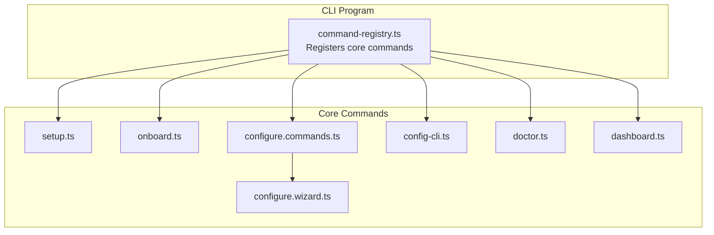
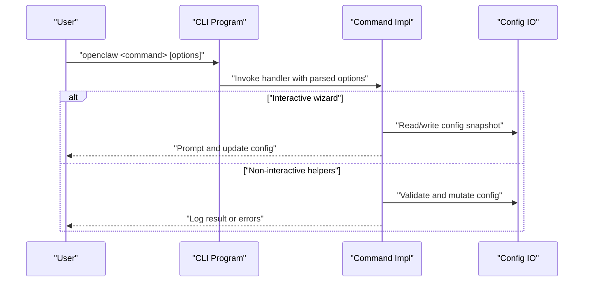
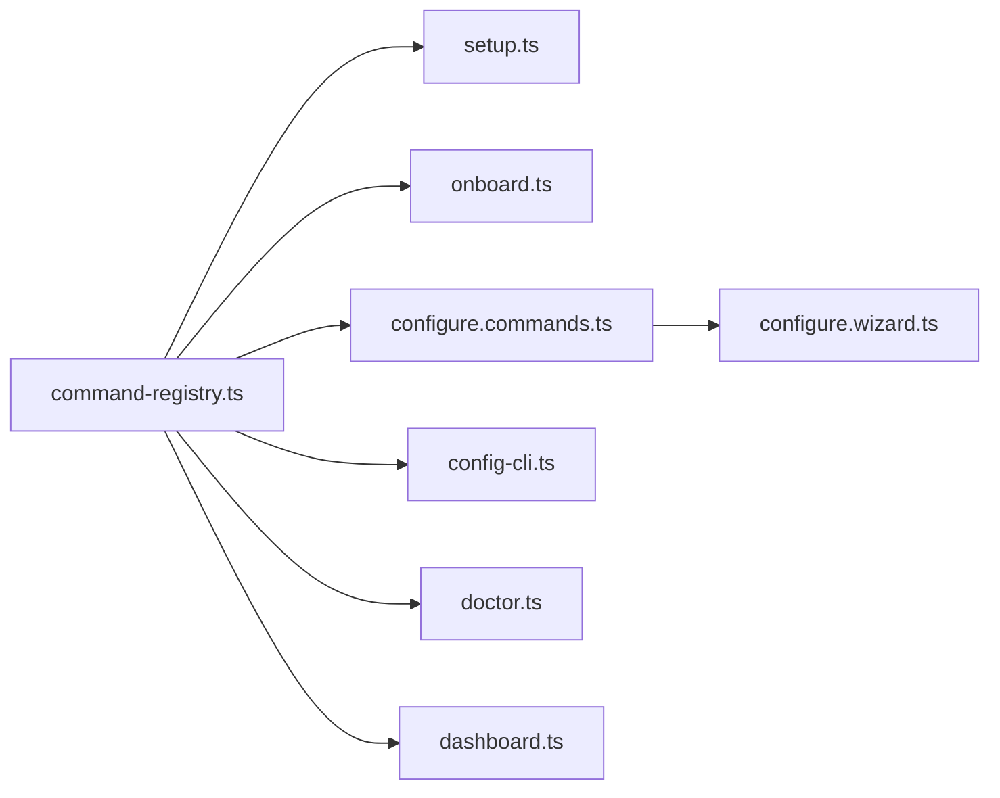

# Core Commands

<cite>
**Referenced Files in This Document**
- [setup.ts](file://src/commands/setup.ts)
- [onboard.ts](file://src/commands/onboard.ts)
- [configure.commands.ts](file://src/commands/configure.commands.ts)
- [configure.wizard.ts](file://src/commands/configure.wizard.ts)
- [config-cli.ts](file://src/cli/config-cli.ts)
- [doctor.ts](file://src/commands/doctor.ts)
- [dashboard.ts](file://src/commands/dashboard.ts)
- [command-registry.ts](file://src/cli/program/command-registry.ts)
- [register.setup.test.ts](file://src/cli/program/register.setup.test.ts)
- [register.onboard.test.ts](file://src/cli/program/register.onboard.test.ts)
- [register.maintenance.test.ts](file://src/cli/program/register.maintenance.test.ts)
</cite>

## Table of Contents
1. [Introduction](#introduction)
2. [Project Structure](#project-structure)
3. [Core Components](#core-components)
4. [Architecture Overview](#architecture-overview)
5. [Detailed Component Analysis](#detailed-component-analysis)
6. [Dependency Analysis](#dependency-analysis)
7. [Performance Considerations](#performance-considerations)
8. [Troubleshooting Guide](#troubleshooting-guide)
9. [Conclusion](#conclusion)

## Introduction
This document explains the core CLI commands that form the foundation of OpenClaw usage: setup, onboard, configure, config, doctor, and dashboard. It covers command syntax, options, practical usage scenarios, configuration management workflows, health checking procedures, dashboard integration, troubleshooting, and command chaining patterns for automation.

## Project Structure
The CLI is organized around a central registry that wires top-level commands to their implementations. The core commands are implemented under src/commands and registered under src/cli/program.

**Diagram sources**
- [command-registry.ts](file://src/cli/program/command-registry.ts#L37-L86)
- [setup.ts](file://src/commands/setup.ts#L27-L91)
- [onboard.ts](file://src/commands/onboard.ts#L15-L96)
- [configure.commands.ts](file://src/commands/configure.commands.ts#L7-L37)
- [configure.wizard.ts](file://src/commands/configure.wizard.ts#L306-L705)
- [config-cli.ts](file://src/cli/config-cli.ts#L395-L476)
- [doctor.ts](file://src/commands/doctor.ts#L73-L369)
- [dashboard.ts](file://src/commands/dashboard.ts#L50-L117)

**Section sources**
- [command-registry.ts](file://src/cli/program/command-registry.ts#L37-L86)

## Core Components
- setup: Initializes local configuration and agent workspace, ensuring defaults and bootstrap files are present.
- onboard: Interactive onboarding wizard for gateway, workspace, and skills; supports reset and non-interactive flows.
- configure: Starts the interactive configuration wizard; can target specific sections.
- config: Non-interactive helpers to get/set/unset config values, print file path, and validate configuration.
- doctor: Health and maintenance checks for configuration, gateway connectivity, and platform notes; can offer repairs.
- dashboard: Prints the Control UI URL, copies it to clipboard, optionally opens the browser, and provides SSH hints.

**Section sources**
- [setup.ts](file://src/commands/setup.ts#L27-L91)
- [onboard.ts](file://src/commands/onboard.ts#L15-L96)
- [configure.commands.ts](file://src/commands/configure.commands.ts#L7-L37)
- [config-cli.ts](file://src/cli/config-cli.ts#L395-L476)
- [doctor.ts](file://src/commands/doctor.ts#L73-L369)
- [dashboard.ts](file://src/commands/dashboard.ts#L50-L117)

## Architecture Overview
The CLI program registers commands and routes invocations to their implementations. The config command integrates with a wizard for interactive configuration and with non-interactive helpers for scripting.

**Diagram sources**
- [command-registry.ts](file://src/cli/program/command-registry.ts#L37-L86)
- [configure.wizard.ts](file://src/commands/configure.wizard.ts#L306-L705)
- [config-cli.ts](file://src/cli/config-cli.ts#L395-L476)

## Detailed Component Analysis

### setup
Purpose
- Initialize local configuration and agent workspace.
- Ensure gateway mode defaults and agent workspace bootstrap files.

Key behaviors
- Reads existing config and merges safe defaults.
- Writes minimal updates when needed and logs outcomes.
- Ensures workspace directory and session transcripts directory exist.

Usage scenarios
- First-time initialization of a new environment.
- Reconfiguring workspace defaults without touching other settings.

Options
- --workspace <path>: Override agent workspace directory.

Examples
- Initialize with default workspace: openclaw setup
- Specify workspace: openclaw setup --workspace ~/my-workspace

Notes
- Safe to run repeatedly; idempotent updates only.

**Section sources**
- [setup.ts](file://src/commands/setup.ts#L27-L91)
- [register.setup.test.ts](file://src/cli/program/register.setup.test.ts#L43-L52)

### onboard
Purpose
- Interactive onboarding wizard for gateway, workspace, and skills.
- Supports reset scopes and non-interactive mode with explicit risk acknowledgment.

Key behaviors
- Validates auth choices and deprecations.
- Supports manual/advanced flow normalization.
- Accepts reset scope and can reset config, credentials, sessions, or full state.
- Guides Windows users to WSL2 setup.
- Runs interactive or non-interactive flows.

Options
- --non-interactive: Run without prompts.
- --accept-risk: Required for non-interactive mode.
- --reset/--reset-scope: Reset config state.
- --flow: Choose flow (manual/advanced).
- --auth-choice: Select auth method (normalized).
- --workspace: Workspace override for reset.
- Daemon flags: --install-daemon/--no-install-daemon/--skip-daemon (with precedence rules).
- --gateway-port: Numeric port override.

Examples
- Interactive onboarding: openclaw onboard
- Non-interactive with risk acceptance: openclaw onboard --non-interactive --accept-risk --auth-choice token ...
- Reset with scope: openclaw onboard --reset --reset-scope config+creds+sessions

Notes
- Deprecated auth choices are normalized with guidance.
- Windows users receive helpful setup hints.

**Section sources**
- [onboard.ts](file://src/commands/onboard.ts#L15-L96)
- [register.onboard.test.ts](file://src/cli/program/register.onboard.test.ts#L51-L99)

### configure
Purpose
- Interactive configuration wizard covering credentials, channels, gateway, workspace, skills, and optional health checks.

Key behaviors
- Determines gateway mode (local vs remote) and adapts prompts.
- Guides workspace setup and ensures bootstrap files.
- Manages channels (link/remove) and skills installation.
- Optionally installs gateway service (daemon) and runs health checks.
- Builds Control UI assets and prints connection links.

Options
- --section <section>: Target specific sections (repeatable). Valid sections are exposed by the wizard.
- No subcommand: Starts the full wizard; with --section, targets only those sections.

Examples
- Full wizard: openclaw configure
- Target sections: openclaw configure --section workspace --section gateway --section skills

Notes
- Wizard validates existing config and exits early if invalid.
- After changes, writes config and logs updated paths.

**Section sources**
- [configure.commands.ts](file://src/commands/configure.commands.ts#L7-L37)
- [configure.wizard.ts](file://src/commands/configure.wizard.ts#L306-L705)

### config (non-interactive helpers)
Purpose
- Non-interactive helpers to inspect and modify configuration: get, set, unset, file, validate.

Key behaviors
- get: Retrieve a value by dot or bracket path; supports JSON output.
- set: Set a value by path; supports strict JSON5 parsing; auto-fixes related provider entries when setting API keys.
- unset: Remove a value by path; persists with unset markers.
- file: Print the active config file path.
- validate: Validate config against schema without starting the gateway; supports JSON output.

Options
- get: --json
- set: --strict-json (or legacy --json)
- unset: none
- file: none
- validate: --json

Examples
- Get a nested value: openclaw config get agents.defaults.workspace
- Set a value: openclaw config set gateway.mode local
- Unset a value: openclaw config unset hooks.gmail.model
- Print config path: openclaw config file
- Validate config: openclaw config validate

Notes
- Paths support dot notation and bracket notation (indices and keys).
- Setting sensitive values respects secret references and avoids leaking plaintext unnecessarily.

**Section sources**
- [config-cli.ts](file://src/cli/config-cli.ts#L395-L476)

### doctor
Purpose
- Health and maintenance checks for configuration, gateway connectivity, platform notes, and security.
- Offers repairs and suggestions; can auto-generate tokens when appropriate.

Key behaviors
- Loads and migrates doctor config; warns about invalid configurations.
- Checks gateway mode and auth ambiguity; suggests explicit auth mode.
- Notes deprecated environment variables and startup hints.
- Repairs legacy state migrations and cron stores.
- Validates gateway health and memory status; offers daemon repair.
- Checks shell completion and security warnings.
- Optionally generates a gateway token and writes config if changes are made.

Options
- --non-interactive: Skip interactive prompts.
- --deep: Enable deeper checks (e.g., TLS prerequisites).
- --generate-gateway-token: Auto-generate token when needed.
- --workspace-suggestions: Disable workspace suggestion tips.

Examples
- Interactive doctor: openclaw doctor
- Non-interactive doctor: openclaw doctor --non-interactive
- Repair and write changes: openclaw doctor --fix

Notes
- If changes are suggested, run with --fix to apply; otherwise, doctor advises applying changes.
- Invalid configs are reported with specific paths and messages.

**Section sources**
- [doctor.ts](file://src/commands/doctor.ts#L73-L369)

### dashboard
Purpose
- Resolve and display the Control UI URL, copy it to clipboard, optionally open the browser, and provide SSH hints.

Key behaviors
- Resolves gateway port and bind mode; coerces LAN to loopback for secure contexts.
- Resolves token from config/env/secret-ref with safety notes for SecretRef-managed tokens.
- Prints URL and logs copy status; attempts to open the browser if supported.
- Provides SSH hint fallback when browser cannot be opened.

Options
- --no-open: Do not attempt to open the browser; still prints URL and hint.

Examples
- Open dashboard: openclaw dashboard
- Copy URL only: openclaw dashboard --no-open

Notes
- When token is SecretRef-managed, auto-auth in URL is disabled; use external token source if prompted.
- Clipboard availability may vary; script automation should rely on printed URL.

**Section sources**
- [dashboard.ts](file://src/commands/dashboard.ts#L50-L117)

## Dependency Analysis
The CLI program registers core commands and delegates to their implementations. The configure command depends on the wizard, which orchestrates multiple subsystems (channels, skills, gateway, daemon, health). The config command provides both wizard integration and non-interactive helpers.

**Diagram sources**
- [command-registry.ts](file://src/cli/program/command-registry.ts#L37-L86)
- [configure.commands.ts](file://src/commands/configure.commands.ts#L7-L37)
- [configure.wizard.ts](file://src/commands/configure.wizard.ts#L306-L705)
- [config-cli.ts](file://src/cli/config-cli.ts#L395-L476)

**Section sources**
- [command-registry.ts](file://src/cli/program/command-registry.ts#L37-L86)

## Performance Considerations
- Interactive wizards perform network probes and health checks; use --non-interactive for scripted environments to reduce latency.
- Non-interactive config helpers are lightweight; batch operations by combining set/unset commands.
- Doctor performs multiple checks; consider running less frequently in CI or automation.

## Troubleshooting Guide
Common issues and resolutions
- Invalid config: Use openclaw doctor to diagnose and repair; then retry setup/config.
- Gateway connectivity: Run openclaw doctor to check health and memory status; verify port and bind settings.
- Token management: For SecretRef-managed tokens, resolve externally; dashboard disables auto-auth in this case.
- Windows setup: Use WSL2 for best compatibility; onboard provides guidance.
- Non-interactive onboarding: Must accept risk explicitly; ensure required flags are present.
- Clipboard/browser not available: Use --no-open and copy the printed URL; SSH hints are logged when applicable.

Validation and repair
- Validate config: openclaw config validate
- Repair and write changes: openclaw doctor --fix
- Reset onboarding state: openclaw onboard --reset --reset-scope config+creds+sessions

**Section sources**
- [doctor.ts](file://src/commands/doctor.ts#L112-L122)
- [doctor.ts](file://src/commands/doctor.ts#L156-L196)
- [dashboard.ts](file://src/commands/dashboard.ts#L78-L89)
- [onboard.ts](file://src/commands/onboard.ts#L56-L66)
- [register.maintenance.test.ts](file://src/cli/program/register.maintenance.test.ts#L52-L55)

## Conclusion
These six commands—setup, onboard, configure, config, doctor, and dashboard—provide a complete foundation for OpenClaw lifecycle management. Use setup and onboard for initial provisioning, configure for iterative adjustments, config for automation-friendly mutations, doctor for maintenance and diagnostics, and dashboard for quick access to the Control UI. Chain commands in scripts to automate provisioning and health monitoring.