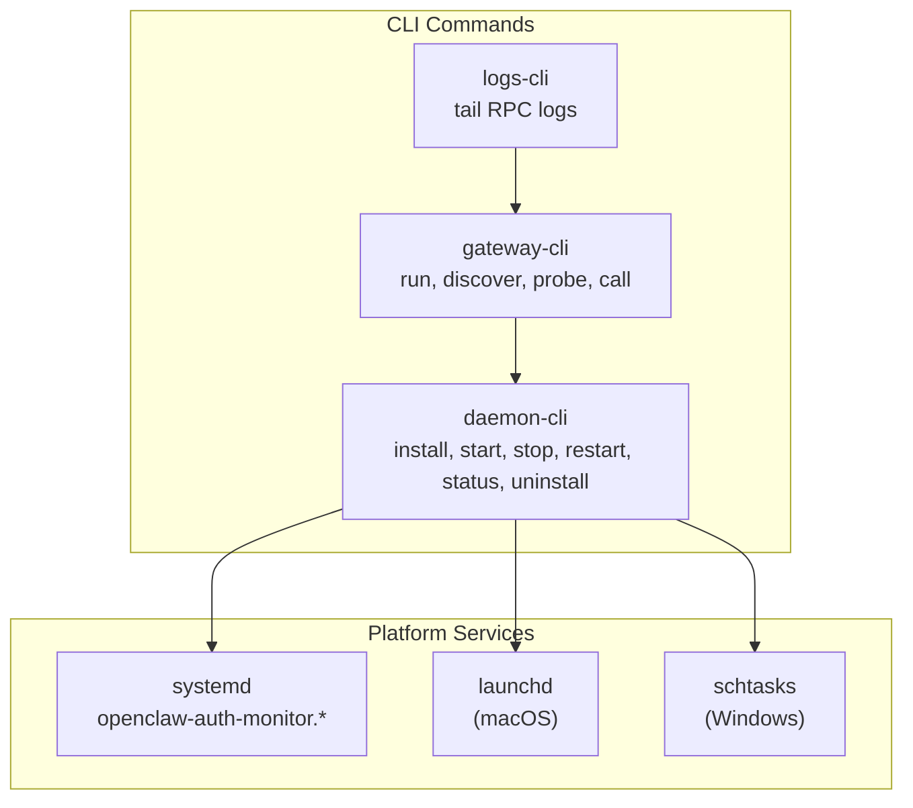
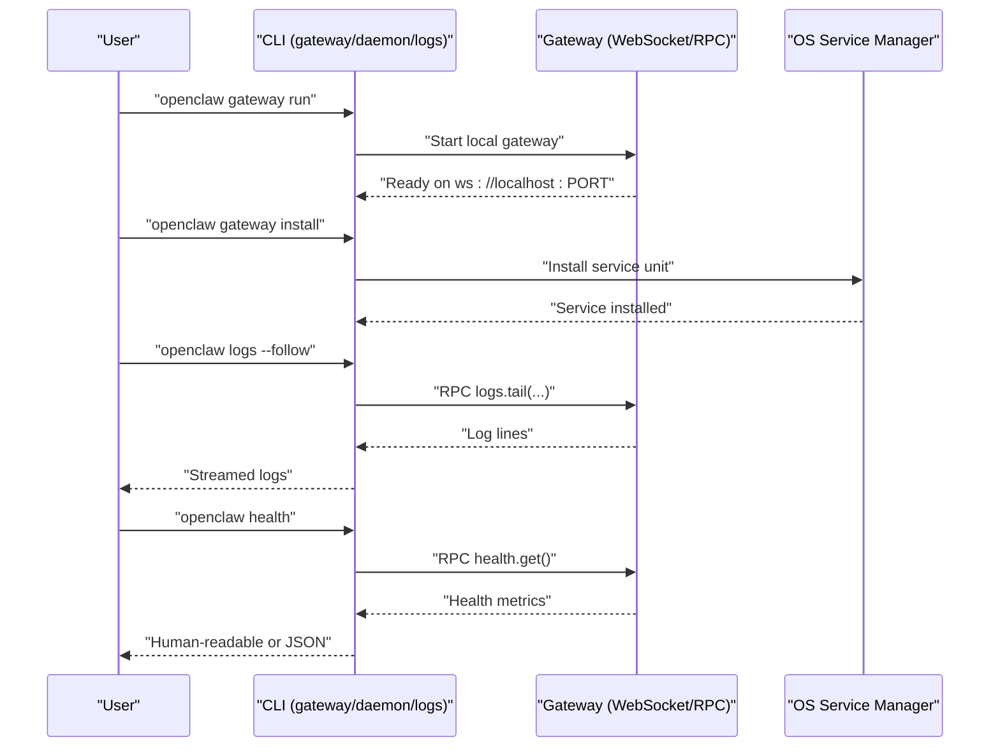
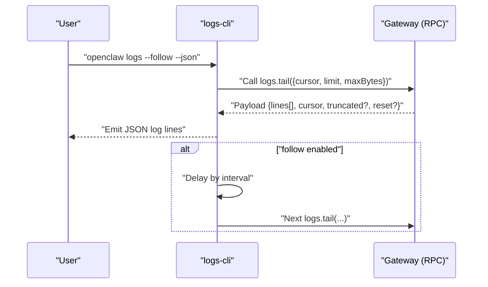
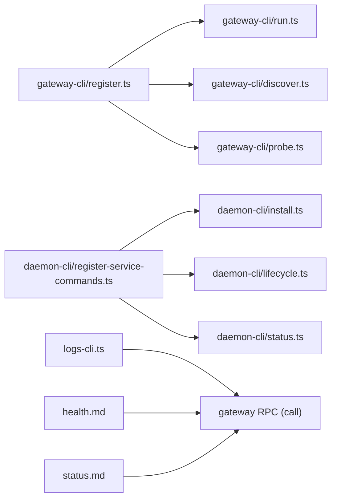

# Gateway Management

<cite>
**Referenced Files in This Document**
- [gateway.md](file://docs/cli/gateway.md)
- [daemon.md](file://docs/cli/daemon.md)
- [logs.md](file://docs/cli/logs.md)
- [health.md](file://docs/cli/health.md)
- [status.md](file://docs/cli/status.md)
- [gateway-cli.ts](file://src/cli/gateway-cli.ts)
- [daemon-cli.ts](file://src/cli/daemon-cli.ts)
- [logs-cli.ts](file://src/cli/logs-cli.ts)
- [register.ts](file://src/cli/gateway-cli/register.ts)
- [run.ts](file://src/cli/gateway-cli/run.ts)
- [discover.ts](file://src/cli/gateway-cli/discover.ts)
- [status.ts](file://src/cli/daemon-cli/status.ts)
- [install.ts](file://src/cli/daemon-cli/install.ts)
- [lifecycle.ts](file://src/cli/daemon-cli/lifecycle.ts)
- [probe.ts](file://src/cli/gateway-cli/probe.ts)
- [status.gather.ts](file://src/cli/daemon-cli/status.gather.ts)
- [status.print.ts](file://src/cli/daemon-cli/status.print.ts)
- [response.ts](file://src/cli/daemon-cli/response.ts)
- [openclaw-auth-monitor.service](file://scripts/systemd/openclaw-auth-monitor.service)
- [openclaw-auth-monitor.timer](file://scripts/systemd/openclaw-auth-monitor.timer)
</cite>

## Table of Contents
1. [Introduction](#introduction)
2. [Project Structure](#project-structure)
3. [Core Components](#core-components)
4. [Architecture Overview](#architecture-overview)
5. [Detailed Component Analysis](#detailed-component-analysis)
6. [Dependency Analysis](#dependency-analysis)
7. [Performance Considerations](#performance-considerations)
8. [Troubleshooting Guide](#troubleshooting-guide)
9. [Conclusion](#conclusion)

## Introduction
This document explains gateway management commands and related services across platforms. It covers:
- Gateway server lifecycle management (run, install, start, stop, restart, uninstall)
- Service installation and configuration for systemd, launchd, and Windows Task Scheduler
- Log monitoring and analysis via RPC
- Health checking and status reporting
- Cross-platform service management and platform-specific notes
- Troubleshooting for connectivity, startup, and performance

## Project Structure
The gateway management surface is implemented in the CLI layer and integrates with platform-specific service managers. The primary areas are:
- CLI command registration and runners for gateway and daemon commands
- RPC-based log tailing and health/status queries
- Platform service units for systemd

**Diagram sources**
- [gateway-cli.ts](file://src/cli/gateway-cli.ts#L1-L2)
- [daemon-cli.ts](file://src/cli/daemon-cli.ts#L1-L16)
- [logs-cli.ts](file://src/cli/logs-cli.ts#L1-L330)
- [openclaw-auth-monitor.service](file://scripts/systemd/openclaw-auth-monitor.service)
- [openclaw-auth-monitor.timer](file://scripts/systemd/openclaw-auth-monitor.timer)

**Section sources**
- [gateway.md](file://docs/cli/gateway.md#L1-L215)
- [daemon.md](file://docs/cli/daemon.md#L1-L52)
- [logs.md](file://docs/cli/logs.md#L1-L29)

## Core Components
- Gateway CLI: run, discover, probe, call, and manage the gateway service
- Daemon CLI: legacy alias for gateway service commands (install/start/stop/restart/status/uninstall)
- Logs CLI: tail gateway file logs over RPC with JSON and human-friendly output
- Status CLI: diagnostics and usage snapshots (different from gateway status)

**Section sources**
- [gateway.md](file://docs/cli/gateway.md#L1-L215)
- [daemon.md](file://docs/cli/daemon.md#L1-L52)
- [logs.md](file://docs/cli/logs.md#L1-L29)
- [status.md](file://docs/cli/status.md#L1-L29)

## Architecture Overview
The gateway is a WebSocket server exposing RPC endpoints. CLI commands interact with it either locally or remotely. Service management commands integrate with OS-native service managers.

**Diagram sources**
- [gateway.md](file://docs/cli/gateway.md#L22-L178)
- [daemon.md](file://docs/cli/daemon.md#L15-L52)
- [logs.md](file://docs/cli/logs.md#L9-L29)
- [health.md](file://docs/cli/health.md#L8-L22)

## Detailed Component Analysis

### Gateway CLI: Run, Discover, Probe, Call, Install, Status
- Run the gateway locally with configurable bind/auth modes, Tailscale exposure, and dev/reset options
- Discover gateways via Bonjour and probe connectivity
- Low-level RPC call helper
- Service management commands (install, start, stop, restart, uninstall) are aliased under daemon

Key behaviors:
- Authentication and binding safety guards
- SIGINT/SIGTERM handling and in-process restart via signal
- Dev workspace creation and reset
- Remote SSH tunneling support for probing

**Section sources**
- [gateway.md](file://docs/cli/gateway.md#L22-L215)
- [register.ts](file://src/cli/gateway-cli/register.ts)
- [run.ts](file://src/cli/gateway-cli/run.ts)
- [discover.ts](file://src/cli/gateway-cli/discover.ts)
- [probe.ts](file://src/cli/gateway-cli/probe.ts)

### Daemon CLI: Legacy Alias for Service Management
- Maps to the same service control surface as gateway service commands
- Supports status, install, uninstall, start, stop, restart
- Resolves auth SecretRefs for probe auth when possible
- Token drift checks on Linux systemd include Environment and EnvironmentFile

**Section sources**
- [daemon.md](file://docs/cli/daemon.md#L1-L52)
- [daemon-cli.ts](file://src/cli/daemon-cli.ts#L1-L16)
- [status.gather.ts](file://src/cli/daemon-cli/status.gather.ts)
- [status.print.ts](file://src/cli/daemon-cli/status.print.ts)
- [response.ts](file://src/cli/daemon-cli/response.ts)

### Logs CLI: Tail Gateway Logs Over RPC
- Uses RPC method logs.tail to fetch and stream logs
- Supports human-friendly colored output and JSON emission
- Handles truncation and cursor reset notifications
- Emits structured JSON lines for tooling

**Diagram sources**
- [logs-cli.ts](file://src/cli/logs-cli.ts#L45-L328)

**Section sources**
- [logs.md](file://docs/cli/logs.md#L1-L29)
- [logs-cli.ts](file://src/cli/logs-cli.ts#L1-L330)

### Health CLI: Fetch Gateway Health Over RPC
- Quick health check of the running gateway
- Optional verbose mode for live probes and per-account timings
- Includes per-agent session store details when multiple agents are configured

**Section sources**
- [health.md](file://docs/cli/health.md#L1-L22)

### Status CLI: Diagnostics and Usage Snapshots
- Diagnoses channels and sessions
- Supports deep probes across multiple channels
- Includes overview of gateway/node host service status, update info, and secret diagnostics

**Section sources**
- [status.md](file://docs/cli/status.md#L1-L29)

### Service Installation and Configuration Across Platforms
- systemd: service and timer units for auxiliary tasks
- launchd: macOS service management (via daemon commands)
- Windows Task Scheduler: service management (via daemon commands)

Notes:
- Token drift checks on Linux include Environment and EnvironmentFile
- When token auth requires a token and the token SecretRef is unresolved, install fails closed
- If both token and password are configured without explicit mode, install is blocked until mode is set

**Section sources**
- [daemon.md](file://docs/cli/daemon.md#L35-L47)
- [install.ts](file://src/cli/daemon-cli/install.ts)
- [lifecycle.ts](file://src/cli/daemon-cli/lifecycle.ts)
- [openclaw-auth-monitor.service](file://scripts/systemd/openclaw-auth-monitor.service)
- [openclaw-auth-monitor.timer](file://scripts/systemd/openclaw-auth-monitor.timer)

## Dependency Analysis
The gateway CLI and daemon CLI share a unified service control surface. Logs and health/status rely on RPC to the gateway.

**Diagram sources**
- [gateway-cli.ts](file://src/cli/gateway-cli.ts#L1-L2)
- [daemon-cli.ts](file://src/cli/daemon-cli.ts#L1-L16)
- [logs-cli.ts](file://src/cli/logs-cli.ts#L1-L330)
- [gateway.md](file://docs/cli/gateway.md#L85-L178)
- [daemon.md](file://docs/cli/daemon.md#L28-L47)

**Section sources**
- [gateway-cli.ts](file://src/cli/gateway-cli.ts#L1-L2)
- [daemon-cli.ts](file://src/cli/daemon-cli.ts#L1-L16)
- [logs-cli.ts](file://src/cli/logs-cli.ts#L1-L330)

## Performance Considerations
- Use appropriate polling intervals and limits for log tailing
- Prefer JSON output for tooling to reduce parsing overhead
- Limit follow duration and adjust max-bytes to avoid excessive memory usage
- Use concise bind/auth modes in production to minimize startup overhead

[No sources needed since this section provides general guidance]

## Troubleshooting Guide

### Gateway Connectivity Issues
- Verify the gateway is running and reachable
- Use discovery to locate gateways advertising via Bonjour
- Probe remote gateways via SSH tunneling when applicable
- Ensure correct URL and credentials; explicit flags override config

**Section sources**
- [gateway.md](file://docs/cli/gateway.md#L85-L178)

### Service Startup Problems
- On Linux systemd, confirm environment variables are loaded from both Environment and EnvironmentFile
- Resolve SecretRef-backed tokens/passwords before install
- If both token and password are configured without explicit mode, set auth mode explicitly

**Section sources**
- [daemon.md](file://docs/cli/daemon.md#L35-L47)

### Log Monitoring and Analysis
- Use logs CLI to tail RPC logs with JSON for tooling or human-friendly output
- Adjust limit and max-bytes to prevent truncation
- Handle broken pipes gracefully; logs CLI emits a clear message and exits

**Section sources**
- [logs.md](file://docs/cli/logs.md#L1-L29)
- [logs-cli.ts](file://src/cli/logs-cli.ts#L158-L196)

### Health Checking Procedures
- Use health CLI for quick checks; verbose mode runs live probes and shows per-account timings
- Include per-agent session store details when multiple agents are configured

**Section sources**
- [health.md](file://docs/cli/health.md#L1-L22)

### Status Reporting
- Use status CLI for diagnostics and usage snapshots
- Deep mode probes multiple channels; read-only status resolves SecretRefs when possible

**Section sources**
- [status.md](file://docs/cli/status.md#L1-L29)

### Performance Monitoring
- Monitor log tail throughput and adjust polling interval
- Reduce verbosity and color output for lower overhead in automated contexts
- Use JSON output for downstream analytics

[No sources needed since this section provides general guidance]

## Conclusion
The gateway management commands provide a cohesive interface for running, diagnosing, and maintaining the gateway across platforms. Use the gateway CLI for day-to-day operations, the daemon CLI for service lifecycle, and logs/health/status for operational visibility. Follow the platform-specific notes for secure and reliable service installation and operation.