# Gateway Operations

<cite>
**Referenced Files in This Document**
- [docs/cli/gateway.md](file://docs/cli/gateway.md)
- [docs/gateway/index.md](file://docs/gateway/index.md)
- [docs/gateway/configuration.md](file://docs/gateway/configuration.md)
- [docs/gateway/authentication.md](file://docs/gateway/authentication.md)
- [docs/gateway/health.md](file://docs/gateway/health.md)
- [docs/gateway/logging.md](file://docs/gateway/logging.md)
- [docs/install/index.md](file://docs/install/index.md)
- [docs/platforms/linux.md](file://docs/platforms/linux.md)
- [docs/platforms/macos.md](file://docs/platforms/macos.md)
- [docs/platforms/windows.md](file://docs/platforms/windows.md)
- [src/commands/status-all/gateway.ts](file://src/commands/status-all/gateway.ts)
- [src/infra/tls/gateway.ts](file://src/infra/tls/gateway.ts)
</cite>

## Table of Contents
1. [Introduction](#introduction)
2. [Project Structure](#project-structure)
3. [Core Components](#core-components)
4. [Architecture Overview](#architecture-overview)
5. [Detailed Component Analysis](#detailed-component-analysis)
6. [Dependency Analysis](#dependency-analysis)
7. [Performance Considerations](#performance-considerations)
8. [Troubleshooting Guide](#troubleshooting-guide)
9. [Conclusion](#conclusion)
10. [Appendices](#appendices)

## Introduction
This document provides comprehensive guidance for operating the OpenClaw Gateway service. It covers lifecycle management (start, stop, restart), daemon control, health monitoring, and status checking. It also documents configuration options (port binding, authentication, network exposure), platform-specific service management (systemd, launchd, Windows), troubleshooting commands, logging configuration, performance monitoring, and scaling considerations. Practical examples demonstrate running the gateway in development and production modes, configuring authentication, and managing the service across platforms.

## Project Structure
The repository organizes gateway operation documentation across CLI, gateway runbook, configuration, authentication, health, and platform-specific guides. Implementation details for gateway lifecycle, TLS, and log summarization are contained in the source tree.

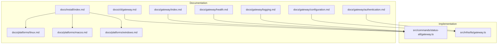

**Diagram sources**
- [docs/cli/gateway.md](file://docs/cli/gateway.md)
- [docs/gateway/index.md](file://docs/gateway/index.md)
- [docs/gateway/configuration.md](file://docs/gateway/configuration.md)
- [docs/gateway/authentication.md](file://docs/gateway/authentication.md)
- [docs/gateway/health.md](file://docs/gateway/health.md)
- [docs/gateway/logging.md](file://docs/gateway/logging.md)
- [docs/install/index.md](file://docs/install/index.md)
- [docs/platforms/linux.md](file://docs/platforms/linux.md)
- [docs/platforms/macos.md](file://docs/platforms/macos.md)
- [docs/platforms/windows.md](file://docs/platforms/windows.md)
- [src/commands/status-all/gateway.ts](file://src/commands/status-all/gateway.ts)
- [src/infra/tls/gateway.ts](file://src/infra/tls/gateway.ts)

**Section sources**
- [docs/cli/gateway.md:1-236](file://docs/cli/gateway.md#L1-L236)
- [docs/gateway/index.md:1-262](file://docs/gateway/index.md#L1-L262)
- [docs/gateway/configuration.md:1-634](file://docs/gateway/configuration.md#L1-L634)
- [docs/gateway/authentication.md:1-180](file://docs/gateway/authentication.md#L1-L180)
- [docs/gateway/health.md:1-45](file://docs/gateway/health.md#L1-L45)
- [docs/gateway/logging.md](file://docs/gateway/logging.md)
- [docs/install/index.md:1-229](file://docs/install/index.md#L1-L229)
- [docs/platforms/linux.md:1-95](file://docs/platforms/linux.md#L1-L95)
- [docs/platforms/macos.md:1-227](file://docs/platforms/macos.md#L1-L227)
- [docs/platforms/windows.md:1-242](file://docs/platforms/windows.md#L1-L242)
- [src/commands/status-all/gateway.ts:1-184](file://src/commands/status-all/gateway.ts#L1-L184)
- [src/infra/tls/gateway.ts:1-151](file://src/infra/tls/gateway.ts#L1-L151)

## Core Components
- Gateway CLI: Provides subcommands for running, querying, discovering, and managing the gateway lifecycle and status.
- Gateway runbook: Outlines startup, supervision, service lifecycle, and operational checks.
- Configuration: Defines port binding, bind mode, authentication, TLS, and hot reload behavior.
- Authentication: Covers API key and OAuth-based model authentication.
- Health: Guides health checks and diagnostics for channel connectivity.
- Platform services: Instructions for installing and managing the gateway as a daemon on macOS (launchd), Linux (systemd), and Windows (Scheduled Tasks/Startup items).

**Section sources**
- [docs/cli/gateway.md:22-236](file://docs/cli/gateway.md#L22-L236)
- [docs/gateway/index.md:27-262](file://docs/gateway/index.md#L27-L262)
- [docs/gateway/configuration.md:10-634](file://docs/gateway/configuration.md#L10-L634)
- [docs/gateway/authentication.md:9-180](file://docs/gateway/authentication.md#L9-L180)
- [docs/gateway/health.md:8-45](file://docs/gateway/health.md#L8-L45)
- [docs/platforms/linux.md:37-95](file://docs/platforms/linux.md#L37-L95)
- [docs/platforms/macos.md:35-49](file://docs/platforms/macos.md#L35-L49)
- [docs/platforms/windows.md:42-95](file://docs/platforms/windows.md#L42-L95)

## Architecture Overview
The gateway operates as a long-running process that serves WebSocket control/RPC, HTTP APIs, and the control UI. It supports supervised runs with platform-specific service managers and exposes discovery and health probing for diagnostics.

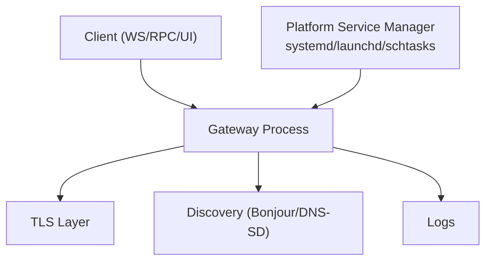

**Diagram sources**
- [docs/gateway/index.md:68-125](file://docs/gateway/index.md#L68-L125)
- [docs/gateway/configuration.md:436-475](file://docs/gateway/configuration.md#L436-L475)
- [src/infra/tls/gateway.ts:67-151](file://src/infra/tls/gateway.ts#L67-L151)

**Section sources**
- [docs/gateway/index.md:68-125](file://docs/gateway/index.md#L68-L125)
- [docs/gateway/configuration.md:436-475](file://docs/gateway/configuration.md#L436-L475)
- [src/infra/tls/gateway.ts:67-151](file://src/infra/tls/gateway.ts#L67-L151)

## Detailed Component Analysis

### Gateway CLI Commands
- Run the gateway:
  - Basic foreground run and alias.
  - Options include port, bind mode, auth override, token/password, Tailscale exposure, dev/reset flags, force restart, verbosity, and WebSocket log styles.
- Query a running gateway:
  - Health and status commands use WebSocket RPC with output modes (human-readable, JSON, no color).
  - Shared options include URL, token/password, timeout, and expect-final.
- Manage the gateway service:
  - Install, start, stop, restart, uninstall with optional JSON output and auth validation.
- Discover gateways:
  - Bonjour scanning for local and wide-area discovery with TXT record hints.

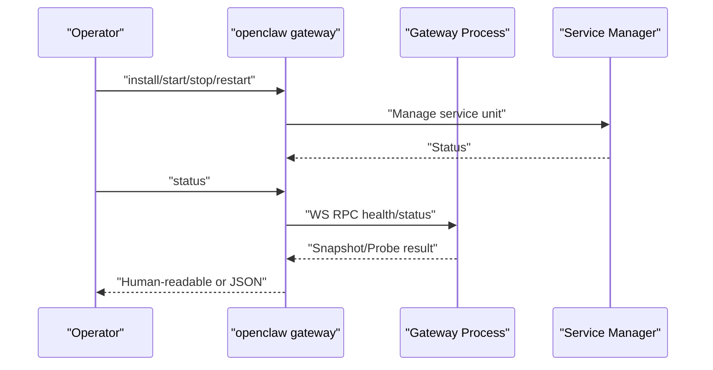

**Diagram sources**
- [docs/cli/gateway.md:85-117](file://docs/cli/gateway.md#L85-L117)
- [docs/cli/gateway.md:180-199](file://docs/cli/gateway.md#L180-L199)

**Section sources**
- [docs/cli/gateway.md:22-117](file://docs/cli/gateway.md#L22-L117)
- [docs/cli/gateway.md:180-236](file://docs/cli/gateway.md#L180-L236)

### Gateway Lifecycle and Status
- Runtime model: single always-on process with multiplexed port for WS/RPC, HTTP APIs, and UI/hooks.
- Port and bind precedence: CLI overrides, environment, and config.
- Hot reload modes: hybrid, hot, restart, off.
- Operator commands: status, install, restart, stop, secrets reload, logs, doctor.

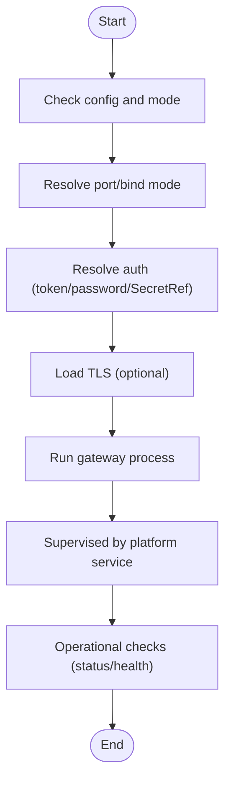

**Diagram sources**
- [docs/gateway/index.md:68-125](file://docs/gateway/index.md#L68-L125)
- [docs/gateway/configuration.md:436-475](file://docs/gateway/configuration.md#L436-L475)

**Section sources**
- [docs/gateway/index.md:68-125](file://docs/gateway/index.md#L68-L125)
- [docs/gateway/configuration.md:436-475](file://docs/gateway/configuration.md#L436-L475)

### Configuration Options
- Port binding and bind mode precedence.
- Hot reload behavior and categories requiring restart.
- RPC for programmatic config updates with rate limiting.
- Environment variables, secret references, and substitutions.

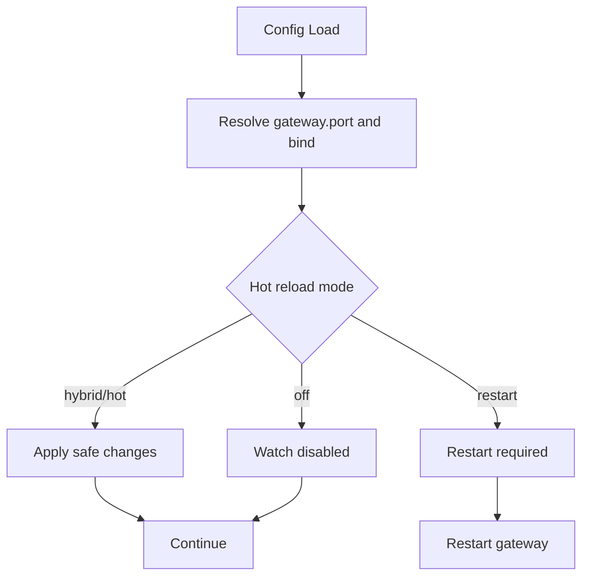

**Diagram sources**
- [docs/gateway/configuration.md:436-475](file://docs/gateway/configuration.md#L436-L475)

**Section sources**
- [docs/gateway/configuration.md:78-93](file://docs/gateway/configuration.md#L78-L93)
- [docs/gateway/configuration.md:436-534](file://docs/gateway/configuration.md#L436-L534)

### Authentication Setup
- API key preferred for long-lived hosts; OAuth supported for subscription accounts.
- SecretRef-based auth for tokens and keys; env/file/exec providers.
- Credential rotation behavior and per-session/per-agent overrides.

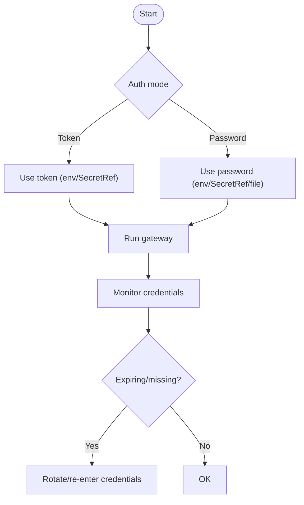

**Diagram sources**
- [docs/gateway/authentication.md:21-113](file://docs/gateway/authentication.md#L21-L113)

**Section sources**
- [docs/gateway/authentication.md:21-113](file://docs/gateway/authentication.md#L21-L113)

### Health Monitoring and Diagnostics
- Quick checks: status, deep status, health snapshot, channel status probe.
- Deep diagnostics: credentials/session store inspection, relink flow.
- Health monitor configuration and failure handling.

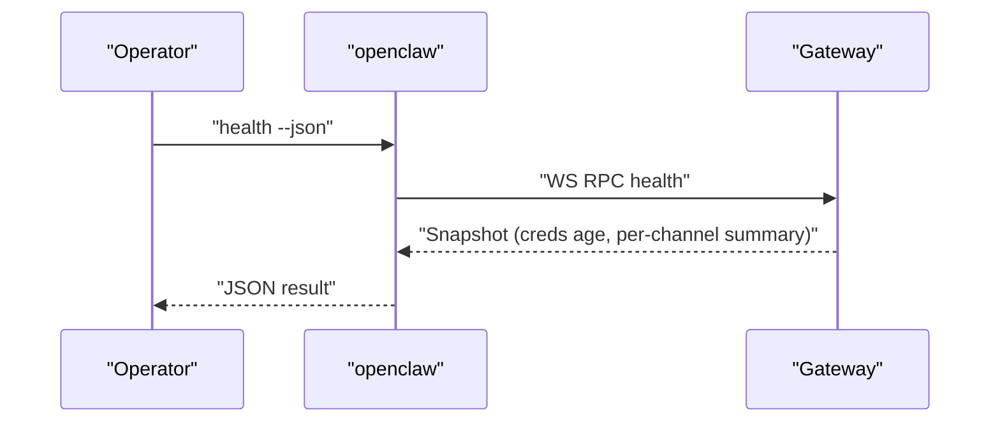

**Diagram sources**
- [docs/gateway/health.md:12-45](file://docs/gateway/health.md#L12-L45)

**Section sources**
- [docs/gateway/health.md:12-45](file://docs/gateway/health.md#L12-L45)

### Daemon Installation and Service Management
- macOS (launchd): install via CLI or app; labels and lifecycle control.
- Linux (systemd): user and system units; enable/enable-now patterns.
- Windows: Scheduled Tasks preferred; fallback Startup folder item; WSL integration for headless setups.

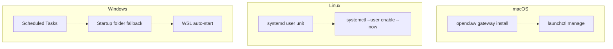

**Diagram sources**
- [docs/platforms/macos.md:35-49](file://docs/platforms/macos.md#L35-L49)
- [docs/platforms/linux.md:65-95](file://docs/platforms/linux.md#L65-L95)
- [docs/platforms/windows.md:42-95](file://docs/platforms/windows.md#L42-L95)

**Section sources**
- [docs/platforms/macos.md:35-49](file://docs/platforms/macos.md#L35-L49)
- [docs/platforms/linux.md:65-95](file://docs/platforms/linux.md#L65-L95)
- [docs/platforms/windows.md:42-95](file://docs/platforms/windows.md#L42-L95)

### TLS Configuration
- Self-signed certificate generation and loading with fingerprint verification.
- Minimum TLS version enforced.
- Auto-generate behavior and error handling.

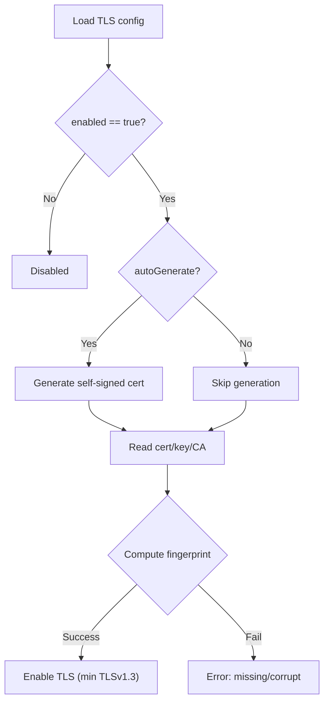

**Diagram sources**
- [src/infra/tls/gateway.ts:67-151](file://src/infra/tls/gateway.ts#L67-L151)

**Section sources**
- [src/infra/tls/gateway.ts:67-151](file://src/infra/tls/gateway.ts#L67-L151)

### Log Summarization Utilities
- Tail and summarize gateway logs with deduplication and grouping of repeated messages.
- Normalize noisy lines and produce concise summaries for diagnostics.

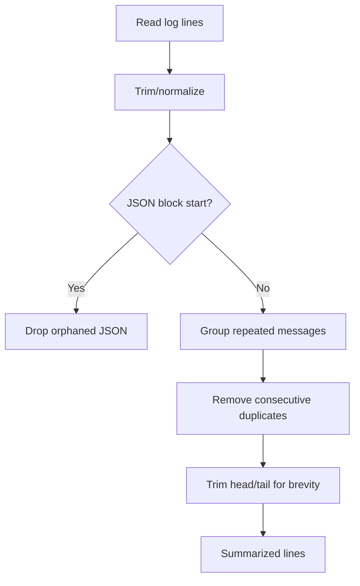

**Diagram sources**
- [src/commands/status-all/gateway.ts:59-181](file://src/commands/status-all/gateway.ts#L59-L181)

**Section sources**
- [src/commands/status-all/gateway.ts:59-181](file://src/commands/status-all/gateway.ts#L59-L181)

## Dependency Analysis
- CLI depends on gateway runtime for health/status RPCs.
- Platform services depend on CLI install/start/stop commands.
- TLS module depends on configuration and filesystem paths.
- Log summarization utility is used by status/all commands.

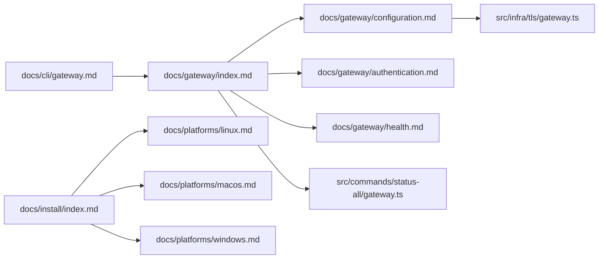

**Diagram sources**
- [docs/cli/gateway.md:16-21](file://docs/cli/gateway.md#L16-L21)
- [docs/gateway/index.md:12-26](file://docs/gateway/index.md#L12-L26)
- [docs/gateway/configuration.md:12-21](file://docs/gateway/configuration.md#L12-L21)
- [docs/gateway/authentication.md:15-19](file://docs/gateway/authentication.md#L15-L19)
- [docs/gateway/health.md:14-18](file://docs/gateway/health.md#L14-L18)
- [docs/install/index.md:14-22](file://docs/install/index.md#L14-L22)
- [docs/platforms/linux.md:14-17](file://docs/platforms/linux.md#L14-L17)
- [docs/platforms/macos.md:11-13](file://docs/platforms/macos.md#L11-L13)
- [docs/platforms/windows.md:11-15](file://docs/platforms/windows.md#L11-L15)
- [src/infra/tls/gateway.ts:7-9](file://src/infra/tls/gateway.ts#L7-L9)
- [src/commands/status-all/gateway.ts:1-11](file://src/commands/status-all/gateway.ts#L1-L11)

**Section sources**
- [docs/cli/gateway.md:16-21](file://docs/cli/gateway.md#L16-L21)
- [docs/gateway/index.md:12-26](file://docs/gateway/index.md#L12-L26)
- [docs/gateway/configuration.md:12-21](file://docs/gateway/configuration.md#L12-L21)
- [docs/gateway/authentication.md:15-19](file://docs/gateway/authentication.md#L15-L19)
- [docs/gateway/health.md:14-18](file://docs/gateway/health.md#L14-L18)
- [docs/install/index.md:14-22](file://docs/install/index.md#L14-L22)
- [docs/platforms/linux.md:14-17](file://docs/platforms/linux.md#L14-L17)
- [docs/platforms/macos.md:11-13](file://docs/platforms/macos.md#L11-L13)
- [docs/platforms/windows.md:11-15](file://docs/platforms/windows.md#L11-L15)
- [src/infra/tls/gateway.ts:7-9](file://src/infra/tls/gateway.ts#L7-L9)
- [src/commands/status-all/gateway.ts:1-11](file://src/commands/status-all/gateway.ts#L1-L11)

## Performance Considerations
- Use hybrid hot reload mode to minimize downtime while applying safe changes.
- Monitor channel health and adjust thresholds to prevent excessive restarts.
- Prefer API keys for long-lived hosts to avoid OAuth refresh overhead.
- Limit concurrent cron runs and tune run log retention to control disk usage.

[No sources needed since this section provides general guidance]

## Troubleshooting Guide
Common failure signatures and remediation:
- Non-loopback bind without auth: configure token or password.
- Port conflict: change port or use force to kill existing listener.
- Config set to remote mode: set local mode for ad-hoc runs.
- Unauthorized during connect: align client auth with gateway configuration.

Operational checks ladder:
- Liveness: connect and expect hello snapshot.
- Readiness: status, channel status probe, health snapshot.
- Gap recovery: refresh state snapshots before continuing.

**Section sources**
- [docs/gateway/index.md:235-244](file://docs/gateway/index.md#L235-L244)
- [docs/gateway/health.md:21-45](file://docs/gateway/health.md#L21-L45)

## Conclusion
The OpenClaw Gateway is a robust, supervised service with strong CLI tooling for lifecycle management, discovery, and diagnostics. By combining safe defaults, explicit configuration, and platform-native service managers, operators can reliably run the gateway in development and production environments. Use the provided commands and patterns to start, monitor, secure, and scale the gateway effectively.

[No sources needed since this section summarizes without analyzing specific files]

## Appendices

### Practical Examples

- Start the gateway in development mode:
  - Use allow-unconfigured flag for ad-hoc runs.
  - Force kill on selected port if needed.
  - Example paths:
    - [docs/gateway/index.md:29-38](file://docs/gateway/index.md#L29-L38)
    - [docs/cli/gateway.md:36-42](file://docs/cli/gateway.md#L36-L42)

- Start the gateway in production mode:
  - Install service via CLI or wizard.
  - Use systemd user or system unit depending on host type.
  - Example paths:
    - [docs/platforms/linux.md:65-95](file://docs/platforms/linux.md#L65-L95)
    - [docs/install/index.md:72-115](file://docs/install/index.md#L72-L115)

- Configure gateway authentication:
  - Token or password via env/SecretRef.
  - Prefer token for long-lived hosts; password for interactive scenarios.
  - Example paths:
    - [docs/gateway/authentication.md:21-57](file://docs/gateway/authentication.md#L21-L57)
    - [docs/gateway/configuration.md:588-623](file://docs/gateway/configuration.md#L588-L623)

- Manage gateway lifecycle:
  - Install, start, stop, restart, uninstall.
  - Example paths:
    - [docs/cli/gateway.md:180-199](file://docs/cli/gateway.md#L180-L199)

- Health monitoring:
  - Use status, health, and channel status probes.
  - Example paths:
    - [docs/gateway/health.md:12-18](file://docs/gateway/health.md#L12-L18)

- Logging configuration:
  - Use CLI flags for WS log style and raw stream capture.
  - Example paths:
    - [docs/cli/gateway.md:59-63](file://docs/cli/gateway.md#L59-L63)

- Scaling considerations:
  - Use multiple gateways only for strict isolation.
  - Ensure unique ports, config paths, state dirs, and workspaces.
  - Example paths:
    - [docs/gateway/index.md:171-191](file://docs/gateway/index.md#L171-L191)