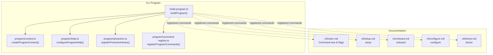
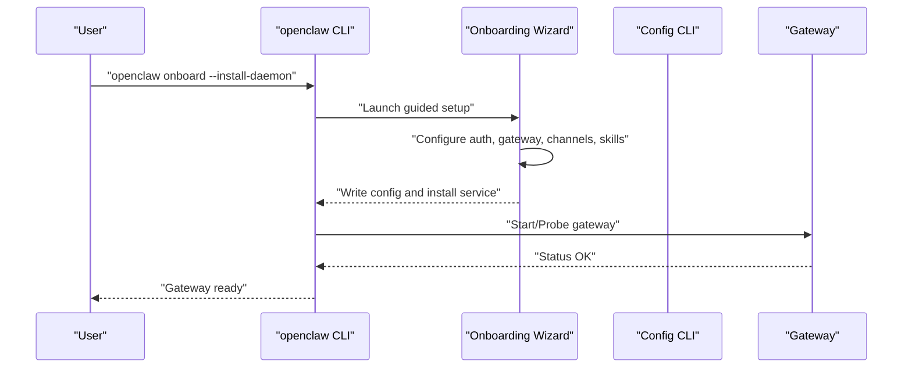
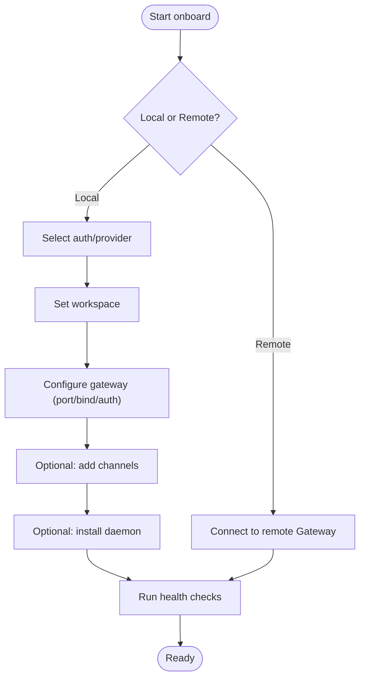
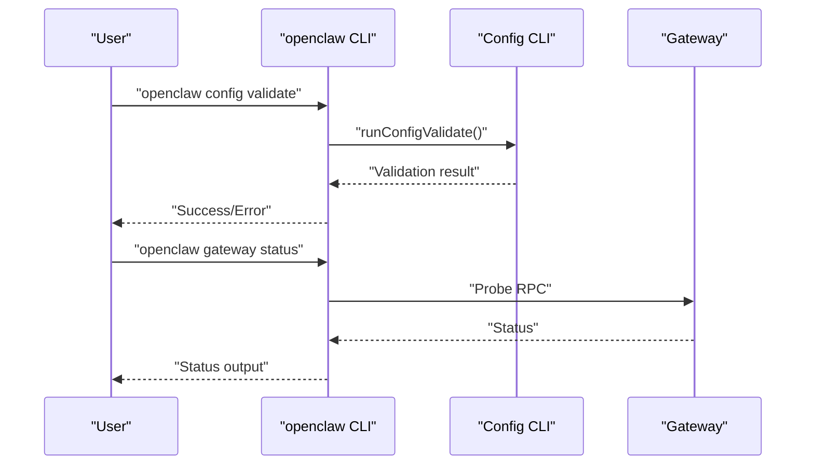
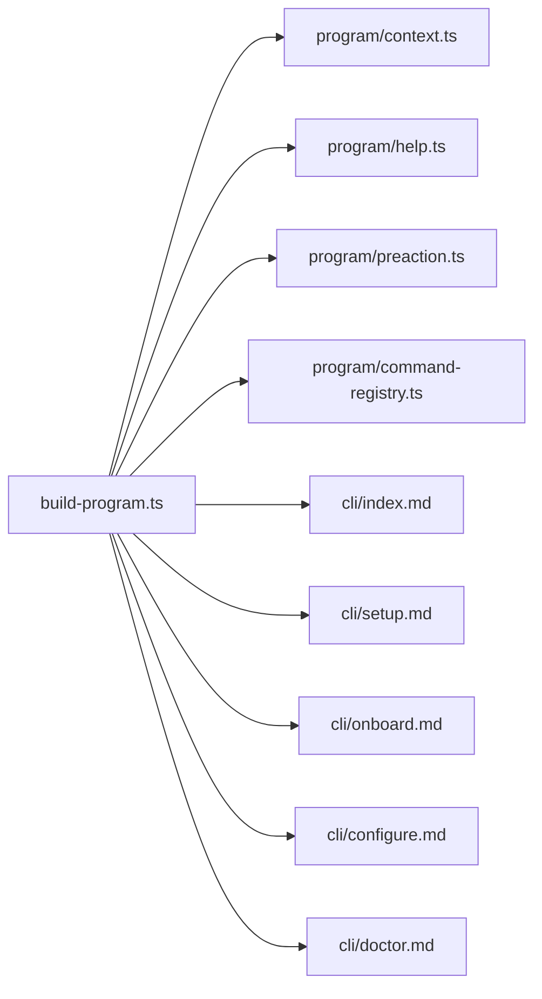

# Getting Started

<cite>
**Referenced Files in This Document**
- [getting-started.md](file://docs/start/getting-started.md)
- [quickstart.md](file://docs/start/quickstart.md)
- [wizard.md](file://docs/start/wizard.md)
- [cli/index.md](file://docs/cli/index.md)
- [cli/setup.md](file://docs/cli/setup.md)
- [cli/onboard.md](file://docs/cli/onboard.md)
- [cli/configure.md](file://docs/cli/configure.md)
- [cli/doctor.md](file://docs/cli/doctor.md)
- [program.ts](file://src/cli/program.ts)
- [build-program.ts](file://src/cli/program/build-program.ts)
- [config-cli.ts](file://src/cli/config-cli.ts)
</cite>

## Table of Contents
1. [Introduction](#introduction)
2. [Project Structure](#project-structure)
3. [Core Components](#core-components)
4. [Architecture Overview](#architecture-overview)
5. [Detailed Component Analysis](#detailed-component-analysis)
6. [Dependency Analysis](#dependency-analysis)
7. [Performance Considerations](#performance-considerations)
8. [Troubleshooting Guide](#troubleshooting-guide)
9. [Conclusion](#conclusion)
10. [Appendices](#appendices)

## Introduction
This guide helps you install OpenClaw, run the onboarding wizard, and use the CLI for daily tasks. It covers the fastest path to a working chat, essential commands, and common setup scenarios. You will learn how the CLI is structured, how the wizard works, and how to troubleshoot typical issues.

## Project Structure
OpenClaw’s CLI is organized around a central program builder that registers commands and subcommands. The documentation provides authoritative references for each command and workflow.

**Diagram sources**
- [build-program.ts](file://src/cli/program/build-program.ts#L8-L20)
- [program.ts](file://src/cli/program.ts#L1-L3)
- [cli/index.md](file://docs/cli/index.md#L93-L264)
- [cli/setup.md](file://docs/cli/setup.md#L9-L29)
- [cli/onboard.md](file://docs/cli/onboard.md#L8-L27)
- [cli/configure.md](file://docs/cli/configure.md#L8-L36)
- [cli/doctor.md](file://docs/cli/doctor.md#L9-L24)

**Section sources**
- [build-program.ts](file://src/cli/program/build-program.ts#L8-L20)
- [program.ts](file://src/cli/program.ts#L1-L3)
- [cli/index.md](file://docs/cli/index.md#L93-L264)

## Core Components
- CLI program builder: constructs the command tree and registers commands.
- Command references: authoritative docs for setup, onboarding, configuration, and health checks.
- Configuration CLI: non-interactive helpers to get/set/unset config values and validate the config.

Key entry points:
- Program construction and registration: [build-program.ts](file://src/cli/program/build-program.ts#L8-L20)
- CLI command tree and global flags: [cli/index.md](file://docs/cli/index.md#L93-L264)
- Setup command: [cli/setup.md](file://docs/cli/setup.md#L9-L29)
- Onboarding wizard: [cli/onboard.md](file://docs/cli/onboard.md#L8-L27), [wizard.md](file://docs/start/wizard.md#L10-L90)
- Configure wizard: [cli/configure.md](file://docs/cli/configure.md#L8-L36)
- Health checks: [cli/doctor.md](file://docs/cli/doctor.md#L9-L24)
- Config CLI helpers: [config-cli.ts](file://src/cli/config-cli.ts#L395-L476)

**Section sources**
- [build-program.ts](file://src/cli/program/build-program.ts#L8-L20)
- [cli/index.md](file://docs/cli/index.md#L93-L264)
- [cli/setup.md](file://docs/cli/setup.md#L9-L29)
- [cli/onboard.md](file://docs/cli/onboard.md#L8-L27)
- [wizard.md](file://docs/start/wizard.md#L10-L90)
- [cli/configure.md](file://docs/cli/configure.md#L8-L36)
- [cli/doctor.md](file://docs/cli/doctor.md#L9-L24)
- [config-cli.ts](file://src/cli/config-cli.ts#L395-L476)

## Architecture Overview
The CLI orchestrates setup, onboarding, configuration, and health checks. The wizard streamlines first-time setup and can be run in guided or non-interactive modes.

**Diagram sources**
- [wizard.md](file://docs/start/wizard.md#L10-L90)
- [cli/onboard.md](file://docs/cli/onboard.md#L8-L27)
- [cli/index.md](file://docs/cli/index.md#L328-L381)

## Detailed Component Analysis

### Initial Installation and First-Time Setup
- Recommended install method: use the official install script for your platform.
- After install, run the onboarding wizard to configure auth, gateway, and optional channels.
- Verify the gateway is running and open the Control UI to chat immediately.

Practical steps:
- Install OpenClaw using the install script for your OS.
- Run the onboarding wizard with optional daemon installation.
- Check gateway status and open the dashboard.

**Section sources**
- [getting-started.md](file://docs/start/getting-started.md#L28-L81)
- [wizard.md](file://docs/start/wizard.md#L10-L31)

### Onboarding Wizard Workflow
The wizard guides you through:
- Model and auth selection (including custom providers).
- Workspace initialization.
- Gateway configuration (port, bind, auth).
- Optional channel and daemon setup.
- Health verification.

Non-interactive options:
- Choose flows and modes.
- Provide tokens and provider credentials via flags.
- Use secret reference mode to avoid storing plaintext keys.

**Diagram sources**
- [wizard.md](file://docs/start/wizard.md#L64-L93)
- [cli/onboard.md](file://docs/cli/onboard.md#L120-L128)

**Section sources**
- [wizard.md](file://docs/start/wizard.md#L10-L93)
- [cli/onboard.md](file://docs/cli/onboard.md#L8-L27)

### Essential Commands for New Users
- Setup: initialize config and workspace.
- Onboard: guided setup (wizard).
- Configure: interactive configuration wizard.
- Doctor: health checks and guided repairs.
- Gateway: manage the gateway service and status.
- Dashboard: open the Control UI for chatting.

Reference command tree and flags:
- Command tree and global flags: [cli/index.md](file://docs/cli/index.md#L93-L264)

**Section sources**
- [cli/index.md](file://docs/cli/index.md#L93-L264)
- [cli/setup.md](file://docs/cli/setup.md#L9-L29)
- [cli/onboard.md](file://docs/cli/onboard.md#L8-L27)
- [cli/configure.md](file://docs/cli/configure.md#L8-L36)
- [cli/doctor.md](file://docs/cli/doctor.md#L9-L24)

### Everyday CLI Usage Patterns
- Check gateway status: use the gateway status command.
- Tail logs: use the logs command.
- Validate config: use the config validate command.
- Get/set/unset config values: use the config get/set/unset commands.

**Diagram sources**
- [config-cli.ts](file://src/cli/config-cli.ts#L344-L393)
- [cli/index.md](file://docs/cli/index.md#L789-L800)

**Section sources**
- [config-cli.ts](file://src/cli/config-cli.ts#L344-L393)
- [cli/index.md](file://docs/cli/index.md#L789-L800)

### Beginner Mistakes and Solutions
Common pitfalls and how to fix them:
- Invalid config: run the doctor to diagnose and repair.
- Missing or unresolved secrets: use the secrets reload or configure commands.
- Conflicting environment overrides (macOS launchctl): unset conflicting variables.
- Sandbox prerequisites: ensure Docker is available if sandbox mode is enabled.

**Section sources**
- [cli/doctor.md](file://docs/cli/doctor.md#L26-L45)

## Dependency Analysis
The CLI program composes several modules to build the command tree and register commands.

**Diagram sources**
- [build-program.ts](file://src/cli/program/build-program.ts#L8-L20)
- [program.ts](file://src/cli/program.ts#L1-L3)
- [cli/index.md](file://docs/cli/index.md#L93-L264)
- [cli/setup.md](file://docs/cli/setup.md#L9-L29)
- [cli/onboard.md](file://docs/cli/onboard.md#L8-L27)
- [cli/configure.md](file://docs/cli/configure.md#L8-L36)
- [cli/doctor.md](file://docs/cli/doctor.md#L9-L24)

**Section sources**
- [build-program.ts](file://src/cli/program/build-program.ts#L8-L20)
- [program.ts](file://src/cli/program.ts#L1-L3)
- [cli/index.md](file://docs/cli/index.md#L93-L264)

## Performance Considerations
- Use the dashboard for immediate chat without channel setup.
- Prefer non-interactive wizard flags for CI or scripted setups.
- Validate config before starting heavy operations to avoid repeated failures.

## Troubleshooting Guide
- Use the doctor command to run guided health checks and repairs.
- Review environment variables and overrides that may affect gateway auth.
- For macOS, check and clear conflicting launchctl environment variables.
- Validate configuration and fix issues before restarting services.

**Section sources**
- [cli/doctor.md](file://docs/cli/doctor.md#L9-L45)

## Conclusion
You now have the essentials to install OpenClaw, run the onboarding wizard, and use the CLI for daily tasks. Refer to the command references for detailed options and to the wizard docs for advanced scenarios.

## Appendices

### Quick Reference: Essential Commands and Workflows
- Install and run the wizard: [getting-started.md](file://docs/start/getting-started.md#L28-L77)
- Onboarding wizard options: [cli/onboard.md](file://docs/cli/onboard.md#L8-L27)
- Setup workspace: [cli/setup.md](file://docs/cli/setup.md#L9-L29)
- Interactive configuration: [cli/configure.md](file://docs/cli/configure.md#L8-L36)
- Health checks: [cli/doctor.md](file://docs/cli/doctor.md#L9-L24)
- Command tree and flags: [cli/index.md](file://docs/cli/index.md#L93-L264)