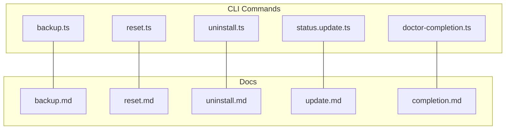
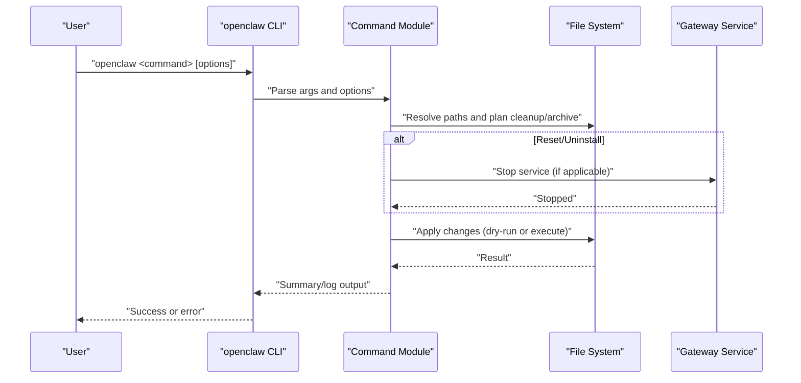
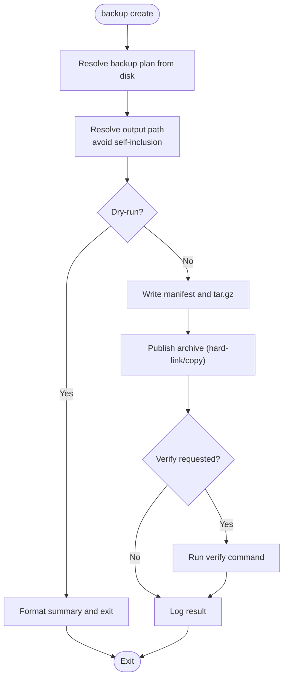
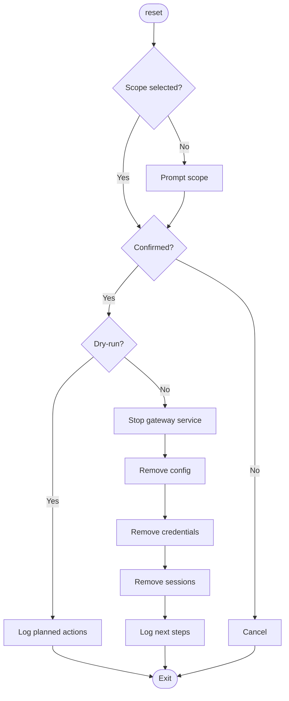
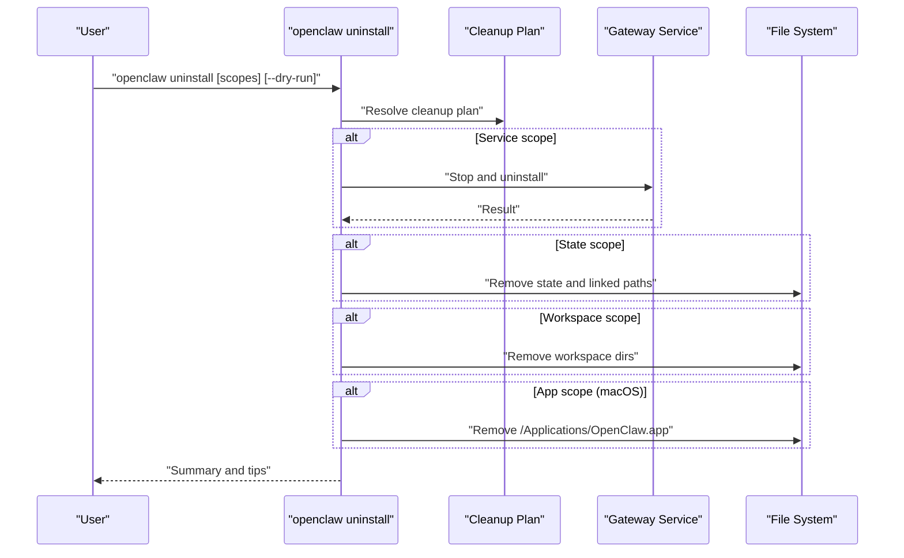
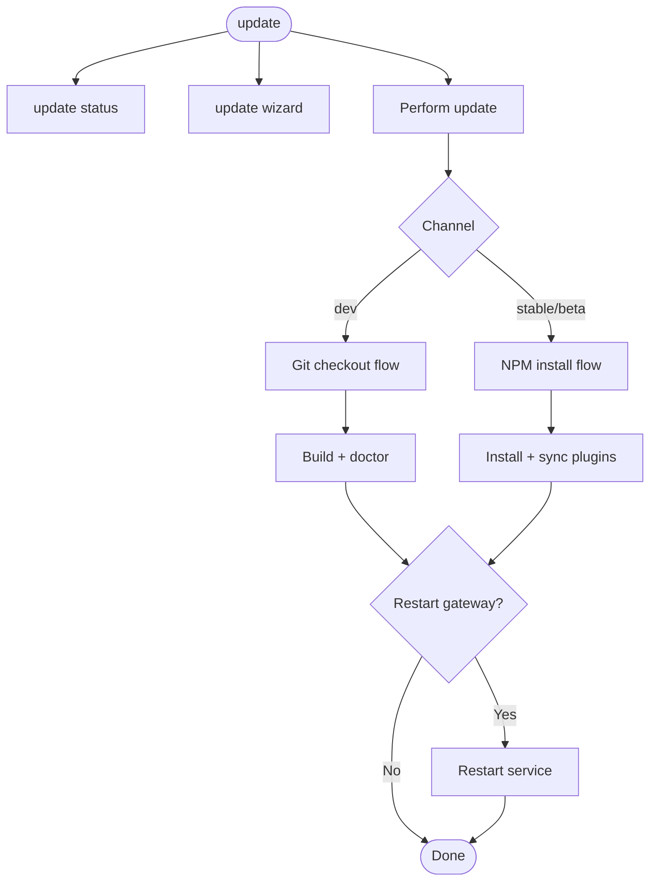
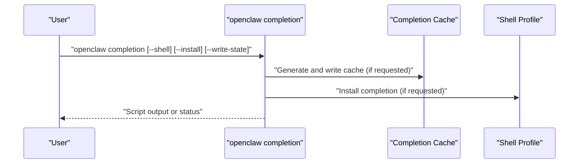
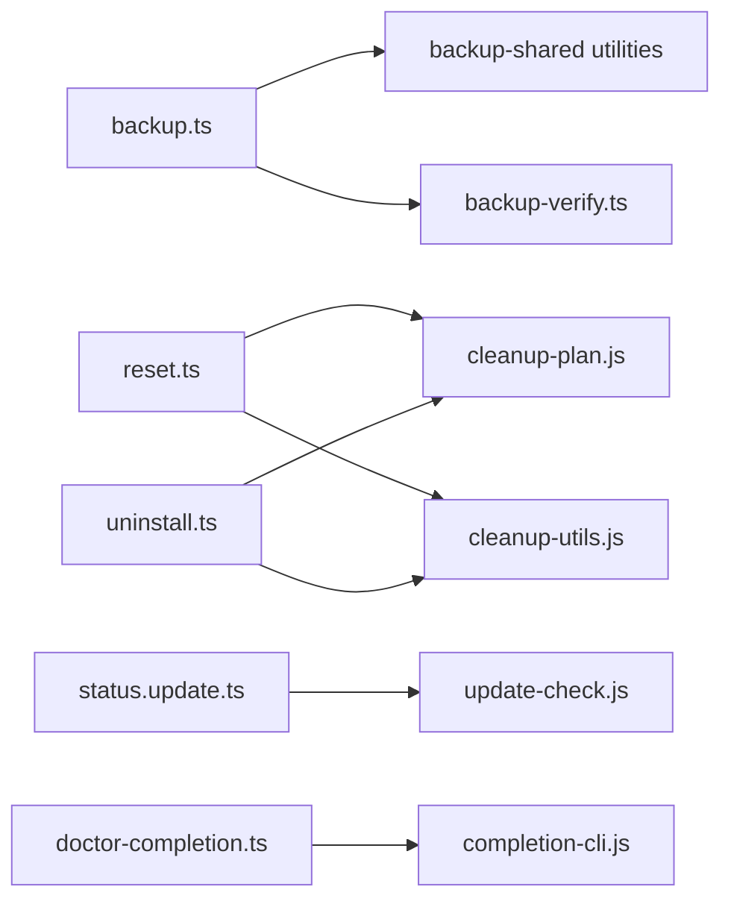

# Maintenance & Operations

<cite>
**Referenced Files in This Document**
- [backup.md](file://docs/cli/backup.md)
- [reset.md](file://docs/cli/reset.md)
- [uninstall.md](file://docs/cli/uninstall.md)
- [update.md](file://docs/cli/update.md)
- [completion.md](file://docs/cli/completion.md)
- [backup.ts](file://src/commands/backup.ts)
- [reset.ts](file://src/commands/reset.ts)
- [uninstall.ts](file://src/commands/uninstall.ts)
- [status.update.ts](file://src/commands/status.update.ts)
- [doctor-completion.ts](file://src/commands/doctor-completion.ts)
</cite>

## Table of Contents
1. [Introduction](#introduction)
2. [Project Structure](#project-structure)
3. [Core Components](#core-components)
4. [Architecture Overview](#architecture-overview)
5. [Detailed Component Analysis](#detailed-component-analysis)
6. [Dependency Analysis](#dependency-analysis)
7. [Performance Considerations](#performance-considerations)
8. [Troubleshooting Guide](#troubleshooting-guide)
9. [Conclusion](#conclusion)
10. [Appendices](#appendices)

## Introduction
This document provides comprehensive guidance for maintenance and operations tasks centered around backup, reset, uninstall, update, and shell completion. It explains backup and restore procedures, system reset workflows, uninstallation processes, update mechanisms, and shell completion setup. It also covers best practices for data preservation, rollback procedures, disaster recovery scenarios, system migration, and automated maintenance workflows, along with troubleshooting tips and performance optimization advice.

## Project Structure
The maintenance and operations commands are implemented as CLI subcommands with dedicated source modules and companion documentation. The relevant modules include:
- Backup: archive creation, verification, and output handling
- Reset: selective removal of configuration, credentials, sessions, and state/workspace directories
- Uninstall: removal of gateway service, state, workspaces, and macOS app
- Update: status reporting, channel switching, and safe update flows
- Completion: shell completion caching and installation

**Diagram sources**
- [backup.ts](file://src/commands/backup.ts#L1-L383)
- [reset.ts](file://src/commands/reset.ts#L1-L152)
- [uninstall.ts](file://src/commands/uninstall.ts#L1-L200)
- [status.update.ts](file://src/commands/status.update.ts#L1-L134)
- [doctor-completion.ts](file://src/commands/doctor-completion.ts#L1-L180)
- [backup.md](file://docs/cli/backup.md#L1-L77)
- [reset.md](file://docs/cli/reset.md#L1-L21)
- [uninstall.md](file://docs/cli/uninstall.md#L1-L21)
- [update.md](file://docs/cli/update.md#L1-L103)
- [completion.md](file://docs/cli/completion.md#L1-L36)

**Section sources**
- [backup.ts](file://src/commands/backup.ts#L1-L383)
- [reset.ts](file://src/commands/reset.ts#L1-L152)
- [uninstall.ts](file://src/commands/uninstall.ts#L1-L200)
- [status.update.ts](file://src/commands/status.update.ts#L1-L134)
- [doctor-completion.ts](file://src/commands/doctor-completion.ts#L1-L180)
- [backup.md](file://docs/cli/backup.md#L1-L77)
- [reset.md](file://docs/cli/reset.md#L1-L21)
- [uninstall.md](file://docs/cli/uninstall.md#L1-L21)
- [update.md](file://docs/cli/update.md#L1-L103)
- [completion.md](file://docs/cli/completion.md#L1-L36)

## Core Components
- Backup command: creates a compressed archive of state, config, credentials, and optionally workspaces, with optional verification and dry-run support.
- Reset command: selectively wipes configuration, credentials, sessions, or full state/workspace directories, with interactive and non-interactive modes.
- Uninstall command: removes the gateway service, state, workspaces, and macOS app, with explicit scope selection and dry-run support.
- Update command: reports update availability and performs safe updates across channels, with wizard and status subcommands.
- Completion command: generates and installs shell completion scripts, with caching and installation into shell profiles.

**Section sources**
- [backup.md](file://docs/cli/backup.md#L9-L77)
- [reset.md](file://docs/cli/reset.md#L9-L21)
- [uninstall.md](file://docs/cli/uninstall.md#L9-L21)
- [update.md](file://docs/cli/update.md#L9-L103)
- [completion.md](file://docs/cli/completion.md#L9-L36)

## Architecture Overview
The maintenance commands share common operational patterns:
- Discovery of local paths (state, config, credentials, workspaces)
- Interactive/non-interactive confirmation flows
- Dry-run planning and execution
- Safe file operations with safeguards against overwriting and self-inclusion
- Optional post-operation verification or doctor checks

**Diagram sources**
- [reset.ts](file://src/commands/reset.ts#L25-L45)
- [uninstall.ts](file://src/commands/uninstall.ts#L55-L84)
- [backup.ts](file://src/commands/backup.ts#L274-L383)

## Detailed Component Analysis

### Backup Command
Purpose:
- Create a local backup archive containing state, config, credentials, and optionally workspaces.
- Verify archive integrity and provide machine-readable output.

Key behaviors:
- Resolves output path with timestamped filename and avoids overwriting existing archives.
- Canonicalizes paths and prevents writing output inside source trees.
- Builds a manifest describing included assets and skipped items.
- Supports dry-run, verification, and scoped backups (only config).

**Diagram sources**
- [backup.ts](file://src/commands/backup.ts#L80-L170)
- [backup.ts](file://src/commands/backup.ts#L274-L383)

Operational notes:
- Archive layout includes a manifest and deduplicated paths when assets are already inside the state directory.
- Verification validates the manifest and payload existence.
- Performance considerations include workspace size and compression time.

**Section sources**
- [backup.md](file://docs/cli/backup.md#L13-L77)
- [backup.ts](file://src/commands/backup.ts#L20-L78)
- [backup.ts](file://src/commands/backup.ts#L80-L170)
- [backup.ts](file://src/commands/backup.ts#L274-L383)

### Reset Command
Purpose:
- Reset local configuration/state while keeping the CLI installed.
- Support multiple scopes: config-only, config+credentials+sessions, or full reset (state + workspaces).

Workflow:
- Interactive scope selection or explicit scope via options.
- Non-interactive mode requires confirmation flags.
- Stops gateway service when resetting beyond config-only.
- Removes targeted paths and suggests next steps.

**Diagram sources**
- [reset.ts](file://src/commands/reset.ts#L51-L152)

Best practices:
- Always back up before full reset.
- Use non-interactive mode with explicit scope and confirmation flags in automation.

**Section sources**
- [reset.md](file://docs/cli/reset.md#L13-L21)
- [reset.ts](file://src/commands/reset.ts#L16-L23)
- [reset.ts](file://src/commands/reset.ts#L51-L152)

### Uninstall Command
Purpose:
- Remove gateway service, state, workspaces, and optionally the macOS app.
- Provide explicit scope selection and dry-run capability.

Workflow:
- Build scope set from explicit flags or interactive multi-select.
- Stop and uninstall the gateway service when applicable.
- Remove state and linked paths, workspace directories, and macOS app if selected.
- Provide helpful hints when workspaces are preserved.

**Diagram sources**
- [uninstall.ts](file://src/commands/uninstall.ts#L100-L200)

**Section sources**
- [uninstall.md](file://docs/cli/uninstall.md#L13-L21)
- [uninstall.ts](file://src/commands/uninstall.ts#L12-L23)
- [uninstall.ts](file://src/commands/uninstall.ts#L100-L200)

### Update Command
Purpose:
- Report update availability and safely update across channels (stable, beta, dev).
- Provide wizard and status subcommands, with dry-run and no-restart options.

Update flow highlights:
- Channel alignment: dev uses git checkout; stable/beta use npm dist-tags.
- Git checkout flow includes clean worktree requirement, fetch/rebase, build, doctor, and plugin sync.
- Status subcommand reports channel, tag/branch/SHA, and availability.
- Wizard offers interactive channel selection and restart confirmation.

**Diagram sources**
- [update.md](file://docs/cli/update.md#L62-L92)
- [status.update.ts](file://src/commands/status.update.ts#L10-L53)

**Section sources**
- [update.md](file://docs/cli/update.md#L15-L103)
- [status.update.ts](file://src/commands/status.update.ts#L1-L134)

### Completion Command
Purpose:
- Generate shell completion scripts for zsh, bash, fish, and PowerShell.
- Optionally install into shell profiles or write cached scripts to state directory.

Doctor completion enhancements:
- Detects slow dynamic completion patterns and upgrades to cached completion.
- Auto-regenerates cache when missing and installs completion into profile upon user confirmation.

**Diagram sources**
- [completion.md](file://docs/cli/completion.md#L13-L36)
- [doctor-completion.ts](file://src/commands/doctor-completion.ts#L19-L38)
- [doctor-completion.ts](file://src/commands/doctor-completion.ts#L78-L163)

**Section sources**
- [completion.md](file://docs/cli/completion.md#L13-L36)
- [doctor-completion.ts](file://src/commands/doctor-completion.ts#L1-L180)

## Dependency Analysis
The maintenance commands depend on shared utilities for path resolution, cleanup, and runtime logging. The update command integrates with update-check infrastructure to determine availability and channel alignment.

**Diagram sources**
- [backup.ts](file://src/commands/backup.ts#L1-L18)
- [reset.ts](file://src/commands/reset.ts#L8-L14)
- [uninstall.ts](file://src/commands/uninstall.ts#L9-L10)
- [status.update.ts](file://src/commands/status.update.ts#L1-L8)
- [doctor-completion.ts](file://src/commands/doctor-completion.ts#L1-L11)

**Section sources**
- [backup.ts](file://src/commands/backup.ts#L1-L18)
- [reset.ts](file://src/commands/reset.ts#L8-L14)
- [uninstall.ts](file://src/commands/uninstall.ts#L9-L10)
- [status.update.ts](file://src/commands/status.update.ts#L1-L8)
- [doctor-completion.ts](file://src/commands/doctor-completion.ts#L1-L11)

## Performance Considerations
- Backup size is dominated by workspace content; exclude workspaces or back up only config for smaller archives.
- Prefer hard-link publishing when supported; otherwise, copies are used as a fallback.
- Verification adds overhead; use only when needed.
- Update wizard and doctor steps ensure safety but take time; use dry-run to estimate impact.

[No sources needed since this section provides general guidance]

## Troubleshooting Guide
Common issues and resolutions:
- Backup refuses to overwrite: ensure unique output path or remove existing archive.
- Backup output inside source tree: move output outside source paths.
- Reset/Uninstall without confirmation: use non-interactive flags and explicit scope.
- Gateway service errors: check service status and permissions; stop before destructive operations.
- Completion not working: doctor completion can auto-generate cache and upgrade slow dynamic patterns.

**Section sources**
- [backup.ts](file://src/commands/backup.ts#L115-L126)
- [backup.ts](file://src/commands/backup.ts#L298-L306)
- [reset.ts](file://src/commands/reset.ts#L52-L57)
- [uninstall.ts](file://src/commands/uninstall.ts#L100-L107)
- [doctor-completion.ts](file://src/commands/doctor-completion.ts#L78-L163)

## Conclusion
The maintenance and operations suite provides robust, safe, and user-friendly workflows for managing OpenClaw installations. By leveraging backups, controlled resets, precise uninstallations, safe updates, and reliable completion caching, operators can maintain systems with confidence, minimize downtime, and recover quickly from incidents.

[No sources needed since this section summarizes without analyzing specific files]

## Appendices

### Disaster Recovery Scenarios
- Full system restore: create a backup, then perform a full reset or uninstall as appropriate, followed by reinstallation and restoration from the backup archive.
- Partial recovery: use reset with config-only or config+credentials+sessions to rebuild from a known-good state while preserving workspaces.
- Rollback procedure: use update status to assess current state, then perform a safe update or downgrade with caution and confirmation.

**Section sources**
- [backup.md](file://docs/cli/backup.md#L13-L32)
- [reset.md](file://docs/cli/reset.md#L13-L21)
- [uninstall.md](file://docs/cli/uninstall.md#L13-L21)
- [update.md](file://docs/cli/update.md#L39-L50)

### System Migration
- Migrate state and workspaces by backing up on the source system, moving to the destination, and restoring the archive.
- Preserve credentials and sessions by including them in the backup plan and verifying integrity post-transfer.

**Section sources**
- [backup.md](file://docs/cli/backup.md#L34-L47)

### Automated Maintenance Workflows
- Schedule periodic backups with dry-run to validate inclusion and output paths.
- Use update status to monitor availability and trigger updates during maintenance windows.
- Integrate completion doctor checks into onboarding or update flows to ensure optimal shell performance.

**Section sources**
- [backup.md](file://docs/cli/backup.md#L13-L21)
- [update.md](file://docs/cli/update.md#L41-L50)
- [completion.md](file://docs/cli/completion.md#L13-L22)
- [doctor-completion.ts](file://src/commands/doctor-completion.ts#L165-L180)