# Plugin Management

<cite>
**Referenced Files in This Document**
- [docs/cli/plugins.md](file://docs/cli/plugins.md)
- [src/plugins/cli.ts](file://src/plugins/cli.ts)
- [src/cli/plugins-cli.ts](file://src/cli/plugins-cli.ts)
- [src/plugins/install.ts](file://src/plugins/install.ts)
- [src/plugins/uninstall.ts](file://src/plugins/uninstall.ts)
- [src/plugins/update.ts](file://src/plugins/update.ts)
- [src/plugins/discovery.ts](file://src/plugins/discovery.ts)
- [src/plugins/loader.ts](file://src/plugins/loader.ts)
- [src/plugins/config-state.ts](file://src/plugins/config-state.ts)
- [src/plugins/manifest.ts](file://src/plugins/manifest.ts)
- [extensions/memory-core/openclaw.plugin.json](file://extensions/memory-core/openclaw.plugin.json)
- [extensions/diffs/openclaw.plugin.json](file://extensions/diffs/openclaw.plugin.json)
</cite>

## Table of Contents
1. [Introduction](#introduction)
2. [Project Structure](#project-structure)
3. [Core Components](#core-components)
4. [Architecture Overview](#architecture-overview)
5. [Detailed Component Analysis](#detailed-component-analysis)
6. [Dependency Analysis](#dependency-analysis)
7. [Performance Considerations](#performance-considerations)
8. [Troubleshooting Guide](#troubleshooting-guide)
9. [Conclusion](#conclusion)
10. [Appendices](#appendices)

## Introduction
This document explains the plugin management system for OpenClaw, focusing on the plugins command and related workflows. It covers installation, configuration, lifecycle management, discovery, dependency resolution, conflict handling, development integration, testing, troubleshooting, and security considerations. It also provides practical examples for installing popular plugins, managing versions, and resolving common issues.

## Project Structure
The plugin management system spans documentation, CLI commands, discovery and loader logic, install/uninstall/update flows, and plugin manifests. The CLI integrates with the plugin subsystem to register commands and manage plugin state.

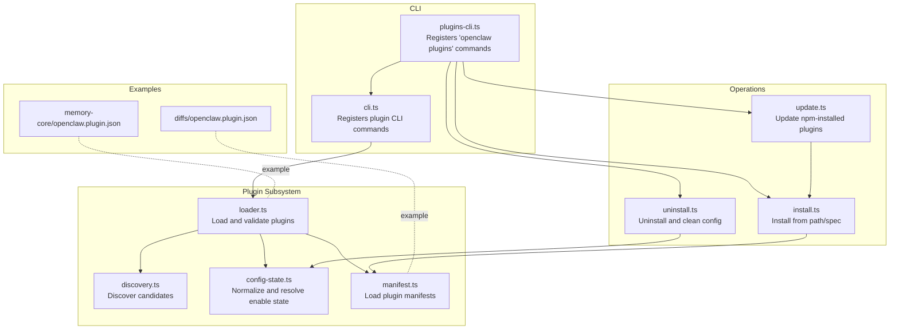

**Diagram sources**
- [src/cli/plugins-cli.ts](file://src/cli/plugins-cli.ts#L364-L727)
- [src/plugins/cli.ts](file://src/plugins/cli.ts#L11-L59)
- [src/plugins/discovery.ts](file://src/plugins/discovery.ts#L618-L712)
- [src/plugins/loader.ts](file://src/plugins/loader.ts#L447-L800)
- [src/plugins/config-state.ts](file://src/plugins/config-state.ts#L90-L220)
- [src/plugins/manifest.ts](file://src/plugins/manifest.ts#L45-L119)
- [src/plugins/install.ts](file://src/plugins/install.ts#L541-L573)
- [src/plugins/uninstall.ts](file://src/plugins/uninstall.ts#L177-L238)
- [src/plugins/update.ts](file://src/plugins/update.ts#L197-L394)
- [extensions/memory-core/openclaw.plugin.json](file://extensions/memory-core/openclaw.plugin.json#L1-L10)
- [extensions/diffs/openclaw.plugin.json](file://extensions/diffs/openclaw.plugin.json#L1-L183)

**Section sources**
- [docs/cli/plugins.md](file://docs/cli/plugins.md#L1-L103)
- [src/plugins/cli.ts](file://src/plugins/cli.ts#L11-L59)
- [src/cli/plugins-cli.ts](file://src/cli/plugins-cli.ts#L364-L727)

## Core Components
- CLI plugins command: Provides list, info, enable, disable, uninstall, doctor, install, and update subcommands.
- Discovery: Scans workspace, bundled, and global directories for plugin candidates, validates roots and permissions, and builds a candidate list.
- Loader: Normalizes configuration, validates plugin manifests and configs, loads modules safely, and registers plugins.
- Install/Uninstall/Update: Manage plugin sources (local, archive, npm), integrity checks, and config updates.
- Manifest: Defines plugin identity, schema, and metadata used for discovery and validation.
- Configuration state: Resolves enablement, allowlists, denials, and memory slot decisions.

**Section sources**
- [docs/cli/plugins.md](file://docs/cli/plugins.md#L19-L103)
- [src/plugins/discovery.ts](file://src/plugins/discovery.ts#L618-L712)
- [src/plugins/loader.ts](file://src/plugins/loader.ts#L447-L800)
- [src/plugins/install.ts](file://src/plugins/install.ts#L541-L573)
- [src/plugins/uninstall.ts](file://src/plugins/uninstall.ts#L177-L238)
- [src/plugins/update.ts](file://src/plugins/update.ts#L197-L394)
- [src/plugins/manifest.ts](file://src/plugins/manifest.ts#L45-L119)
- [src/plugins/config-state.ts](file://src/plugins/config-state.ts#L90-L220)

## Architecture Overview
The plugin system is layered:
- CLI layer parses user intent and delegates to install/uninstall/update or queries discovery/loader for status.
- Discovery layer enumerates plugin locations and validates safety.
- Loader layer normalizes configuration, validates manifests and schemas, and registers plugins.
- Operations layer handles installation, uninstallation, and updates with integrity and provenance checks.

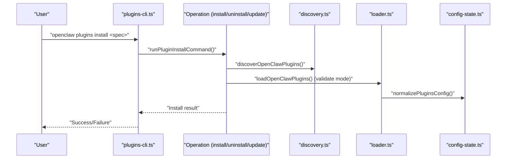

**Diagram sources**
- [src/cli/plugins-cli.ts](file://src/cli/plugins-cli.ts#L364-L727)
- [src/plugins/discovery.ts](file://src/plugins/discovery.ts#L618-L712)
- [src/plugins/loader.ts](file://src/plugins/loader.ts#L447-L800)
- [src/plugins/config-state.ts](file://src/plugins/config-state.ts#L90-L220)

## Detailed Component Analysis

### CLI: plugins command and subcommands
- Subcommands: list, info, enable, disable, uninstall, doctor, install, update.
- List supports JSON output, filtering by enabled state, and verbose details.
- Enable/Disable update configuration and require a gateway restart to apply.
- Install supports local paths, archives, and npm specs; links local directories; pins npm installs.
- Uninstall removes config entries, install records, allowlist entries, load paths, memory slot bindings, and optionally deletes files.
- Update supports per-plugin and batch updates for npm-installed plugins; warns on integrity drift.

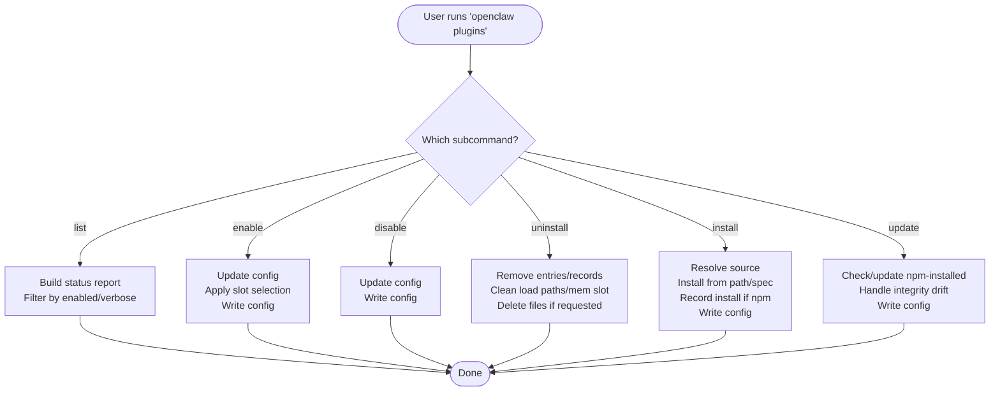

**Diagram sources**
- [src/cli/plugins-cli.ts](file://src/cli/plugins-cli.ts#L364-L727)
- [src/plugins/uninstall.ts](file://src/plugins/uninstall.ts#L177-L238)
- [src/plugins/update.ts](file://src/plugins/update.ts#L197-L394)
- [src/plugins/install.ts](file://src/plugins/install.ts#L541-L573)

**Section sources**
- [docs/cli/plugins.md](file://docs/cli/plugins.md#L19-L103)
- [src/cli/plugins-cli.ts](file://src/cli/plugins-cli.ts#L364-L727)

### Discovery: plugin discovery and safety checks
- Discovers plugins from workspace, bundled, and global directories.
- Validates roots, permissions, and ownership to block unsafe sources.
- Reads package manifests and extension entries; falls back to default index files.
- Caches discovery results for startup performance.

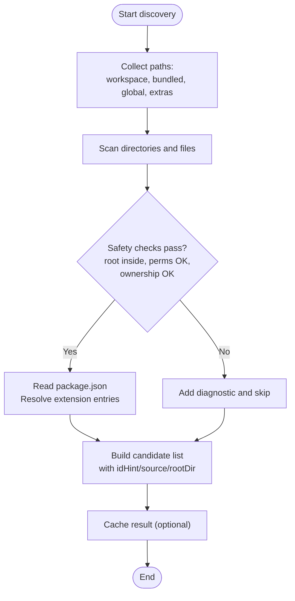

**Diagram sources**
- [src/plugins/discovery.ts](file://src/plugins/discovery.ts#L618-L712)

**Section sources**
- [src/plugins/discovery.ts](file://src/plugins/discovery.ts#L117-L251)
- [src/plugins/discovery.ts](file://src/plugins/discovery.ts#L394-L500)

### Loader: configuration normalization, validation, and registration
- Normalizes plugin configuration (allow/deny lists, load paths, slots).
- Resolves effective enable state considering bundled defaults and channel overrides.
- Validates plugin manifests and JSON schema for plugin config.
- Loads plugin modules safely, tracks provenance, and warns about untrusted loaded plugins.
- Supports lazy runtime initialization and SDK aliasing for plugin development.

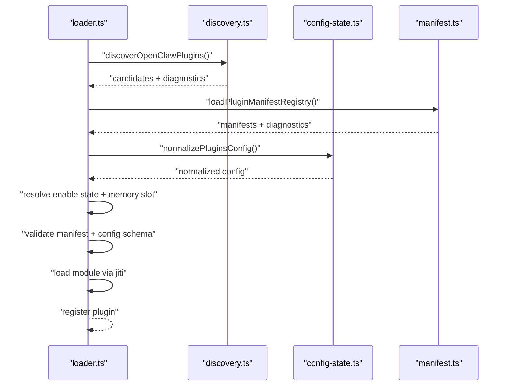

**Diagram sources**
- [src/plugins/loader.ts](file://src/plugins/loader.ts#L447-L800)
- [src/plugins/discovery.ts](file://src/plugins/discovery.ts#L618-L712)
- [src/plugins/config-state.ts](file://src/plugins/config-state.ts#L90-L220)
- [src/plugins/manifest.ts](file://src/plugins/manifest.ts#L45-L119)

**Section sources**
- [src/plugins/loader.ts](file://src/plugins/loader.ts#L447-L800)
- [src/plugins/config-state.ts](file://src/plugins/config-state.ts#L90-L220)
- [src/plugins/manifest.ts](file://src/plugins/manifest.ts#L45-L119)

### Install: installation from path/spec with integrity and safety
- Supports installing from local path, archive, or npm spec.
- Validates npm specs, downloads and verifies integrity, scans for suspicious code patterns.
- Ensures safe install directories and extension entries.
- Records npm installs with resolved specs and integrity hashes.

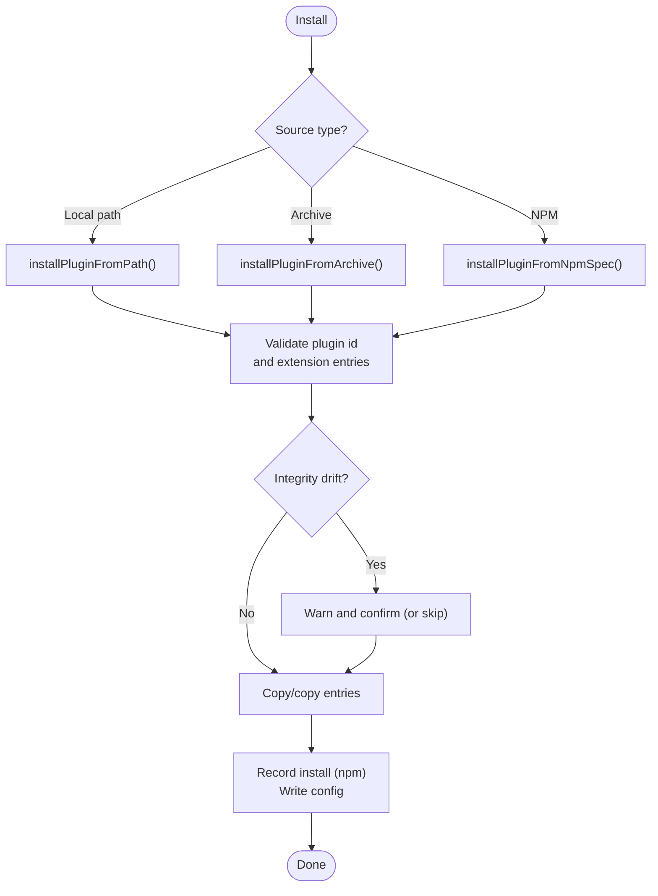

**Diagram sources**
- [src/plugins/install.ts](file://src/plugins/install.ts#L541-L573)
- [src/plugins/install.ts](file://src/plugins/install.ts#L487-L539)
- [src/plugins/install.ts](file://src/plugins/install.ts#L379-L411)

**Section sources**
- [src/plugins/install.ts](file://src/plugins/install.ts#L541-L573)
- [src/plugins/install.ts](file://src/plugins/install.ts#L487-L539)
- [src/plugins/install.ts](file://src/plugins/install.ts#L205-L377)

### Uninstall: removal and cleanup
- Removes plugin entries from config entries, installs, allowlist, load paths, and memory slot.
- Optionally deletes installed directory for non-linked plugins.
- Emits warnings for failures to delete directories.

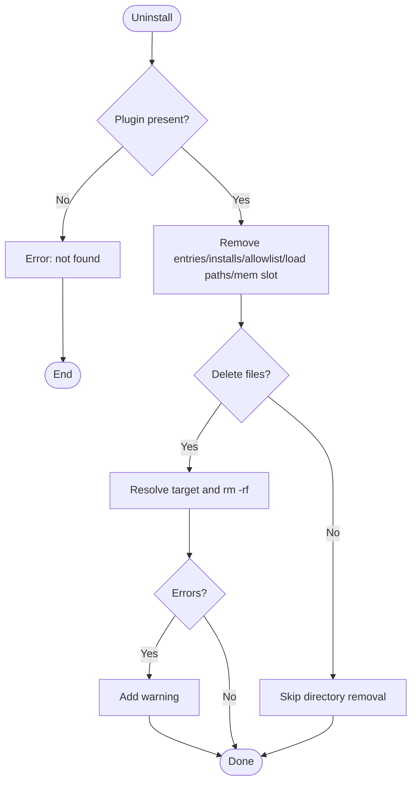

**Diagram sources**
- [src/plugins/uninstall.ts](file://src/plugins/uninstall.ts#L177-L238)

**Section sources**
- [src/plugins/uninstall.ts](file://src/plugins/uninstall.ts#L177-L238)

### Update: updating npm-installed plugins and channel sync
- Updates only plugins installed from npm; probes current version and compares with latest.
- Handles integrity drift by prompting for confirmation or skipping.
- Syncs channel-specific sources (e.g., switching to bundled vs npm) while preserving explicit choices.

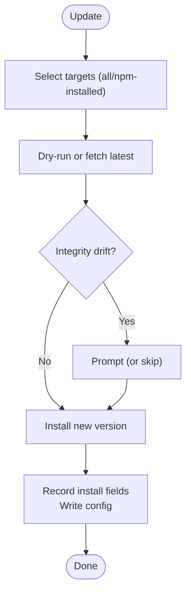

**Diagram sources**
- [src/plugins/update.ts](file://src/plugins/update.ts#L197-L394)

**Section sources**
- [src/plugins/update.ts](file://src/plugins/update.ts#L197-L394)

### Manifest: plugin identity and schema
- Defines plugin id, configSchema, kind, channels, providers, skills, and UI hints.
- Enforces presence of id and configSchema; rejects malformed manifests.
- Supports package metadata for onboarding and catalog.

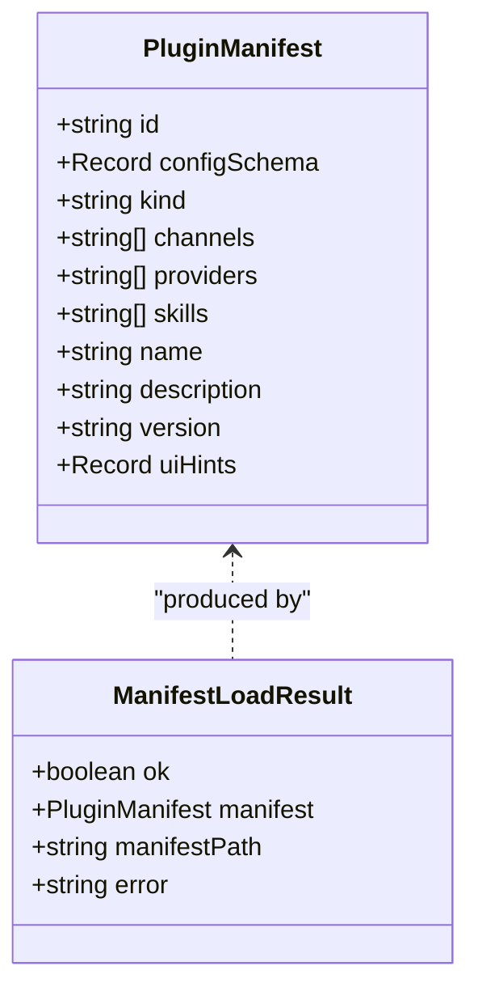

**Diagram sources**
- [src/plugins/manifest.ts](file://src/plugins/manifest.ts#L11-L27)

**Section sources**
- [src/plugins/manifest.ts](file://src/plugins/manifest.ts#L45-L119)
- [extensions/memory-core/openclaw.plugin.json](file://extensions/memory-core/openclaw.plugin.json#L1-L10)
- [extensions/diffs/openclaw.plugin.json](file://extensions/diffs/openclaw.plugin.json#L1-L183)

### Configuration state: enablement and memory slot decisions
- Normalizes allow/deny lists, load paths, and slots.
- Resolves whether a plugin is enabled based on global settings, allow/deny lists, explicit entry, bundled defaults, and channel overrides.
- Handles memory slot selection and conflicts.

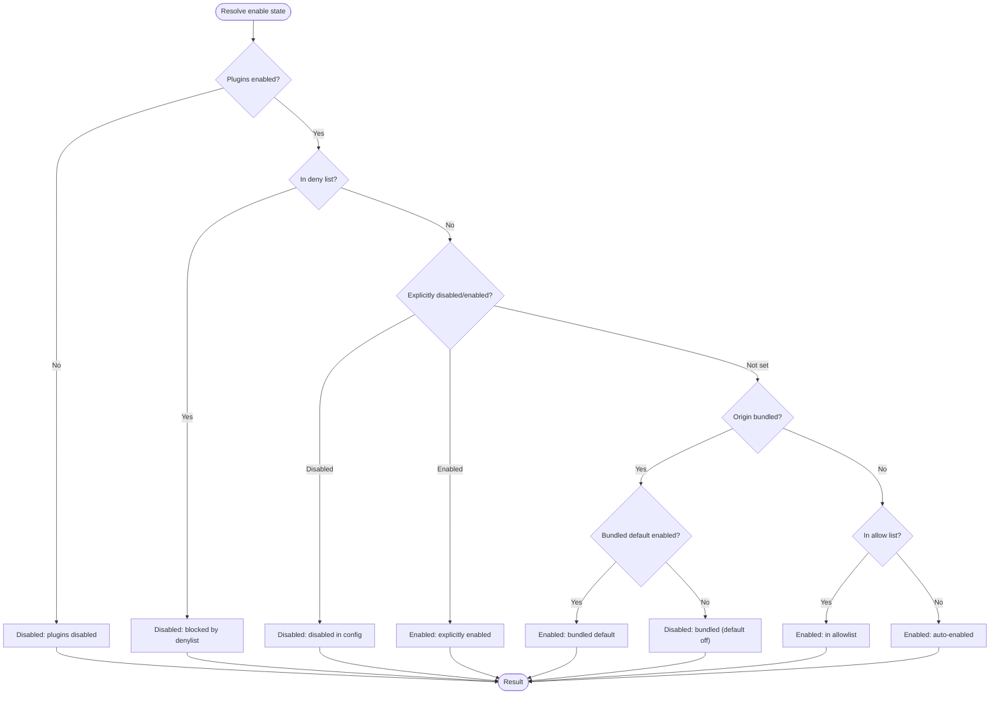

**Diagram sources**
- [src/plugins/config-state.ts](file://src/plugins/config-state.ts#L189-L220)

**Section sources**
- [src/plugins/config-state.ts](file://src/plugins/config-state.ts#L90-L220)

## Dependency Analysis
- CLI depends on install/uninstall/update operations and on loader/cli registration for dynamic commands.
- Loader depends on discovery, config-state, and manifest modules.
- Install depends on discovery for npm integrity checks and manifest for extension entries.
- Uninstall depends on config-state for normalization and loader for provenance tracking.

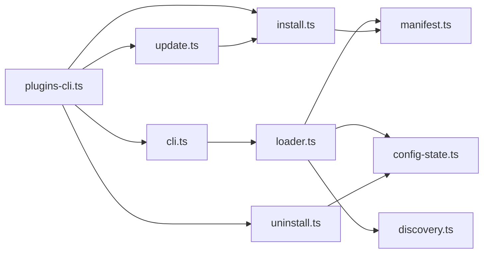

**Diagram sources**
- [src/cli/plugins-cli.ts](file://src/cli/plugins-cli.ts#L364-L727)
- [src/plugins/cli.ts](file://src/plugins/cli.ts#L11-L59)
- [src/plugins/loader.ts](file://src/plugins/loader.ts#L447-L800)
- [src/plugins/discovery.ts](file://src/plugins/discovery.ts#L618-L712)
- [src/plugins/config-state.ts](file://src/plugins/config-state.ts#L90-L220)
- [src/plugins/manifest.ts](file://src/plugins/manifest.ts#L45-L119)
- [src/plugins/install.ts](file://src/plugins/install.ts#L541-L573)
- [src/plugins/uninstall.ts](file://src/plugins/uninstall.ts#L177-L238)
- [src/plugins/update.ts](file://src/plugins/update.ts#L197-L394)

**Section sources**
- [src/plugins/loader.ts](file://src/plugins/loader.ts#L447-L800)
- [src/plugins/discovery.ts](file://src/plugins/discovery.ts#L618-L712)
- [src/plugins/install.ts](file://src/plugins/install.ts#L541-L573)
- [src/plugins/uninstall.ts](file://src/plugins/uninstall.ts#L177-L238)
- [src/plugins/update.ts](file://src/plugins/update.ts#L197-L394)

## Performance Considerations
- Discovery caching reduces repeated scans during startup; tune cache TTL via environment variables.
- Lazy runtime initialization avoids loading heavy dependencies until needed.
- Validation-only mode allows checking plugin readiness without full registration.
- Provenance tracking prevents expensive scans of untrusted sources.

[No sources needed since this section provides general guidance]

## Troubleshooting Guide
Common issues and resolutions:
- Plugin not found during install/uninstall: verify plugin id and existence in config/installs.
- Integrity drift warnings: confirm or skip; use pinned specs in CI.
- Missing openclaw.extensions in package.json: add proper extension entries.
- Plugin id mismatch: align manifest id with npm package name or use scoped spec to avoid conflicts.
- Unsafe plugin candidate blocked: fix ownership/perms or move to allowed location.
- Memory slot conflicts: adjust memory slot selection or disable conflicting plugins.

**Section sources**
- [src/plugins/install.ts](file://src/plugins/install.ts#L100-L129)
- [src/plugins/install.ts](file://src/plugins/install.ts#L531-L538)
- [src/plugins/uninstall.ts](file://src/plugins/uninstall.ts#L182-L188)
- [src/plugins/discovery.ts](file://src/plugins/discovery.ts#L216-L227)
- [src/plugins/config-state.ts](file://src/plugins/config-state.ts#L258-L286)

## Conclusion
OpenClaw’s plugin management provides a robust, secure, and configurable system for discovering, validating, installing, and operating plugins. The CLI offers straightforward workflows, while internal modules enforce safety, schema validation, and provenance tracking. Following the guidelines here ensures reliable plugin lifecycle management and secure operation.

[No sources needed since this section summarizes without analyzing specific files]

## Appendices

### Examples and Procedures
- Installing a plugin from npm with pinning:
  - Use the install command with an npm spec and the pin flag to record the exact resolved version.
  - After install, enable the plugin and restart the gateway.
- Managing plugin versions:
  - Use update to check and apply updates for npm-installed plugins; handle integrity drift prompts.
  - Pin versions in CI to avoid unexpected changes.
- Resolving plugin-related issues:
  - Use doctor-like reporting to inspect plugin status and diagnostics.
  - Review discovery diagnostics for safety violations and fix root/path/ownership issues.
  - For memory conflicts, adjust memory slot selections or disable conflicting plugins.

**Section sources**
- [docs/cli/plugins.md](file://docs/cli/plugins.md#L39-L103)
- [src/cli/plugins-cli.ts](file://src/cli/plugins-cli.ts#L364-L727)
- [src/plugins/update.ts](file://src/plugins/update.ts#L197-L394)
- [src/plugins/discovery.ts](file://src/plugins/discovery.ts#L216-L227)
- [src/plugins/config-state.ts](file://src/plugins/config-state.ts#L258-L286)

### Security Considerations and Best Practices
- Treat plugin installs like running code; prefer pinned versions and avoid semver ranges.
- Use integrity checks and review drift warnings before proceeding.
- Keep plugin allowlists explicit; avoid empty allowlists in production.
- Monitor discovery diagnostics for unsafe sources and fix ownership/perms.
- Validate plugin manifests and config schemas; ensure required fields are present.

**Section sources**
- [docs/cli/plugins.md](file://docs/cli/plugins.md#L46-L55)
- [src/plugins/install.ts](file://src/plugins/install.ts#L284-L306)
- [src/plugins/loader.ts](file://src/plugins/loader.ts#L407-L410)
- [src/plugins/discovery.ts](file://src/plugins/discovery.ts#L175-L193)