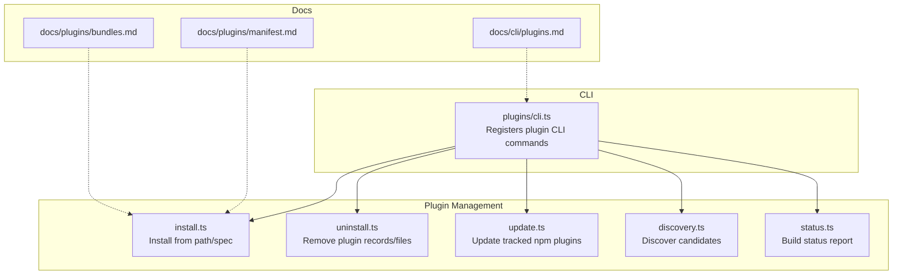
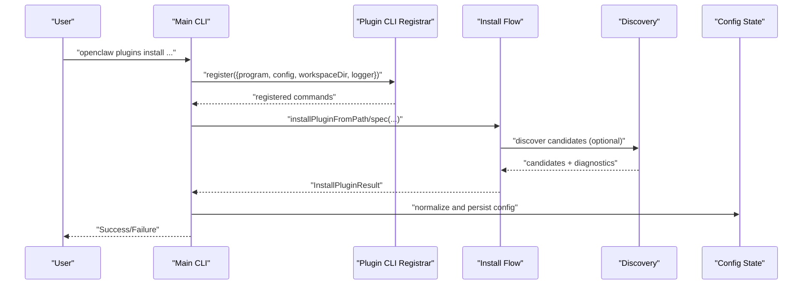
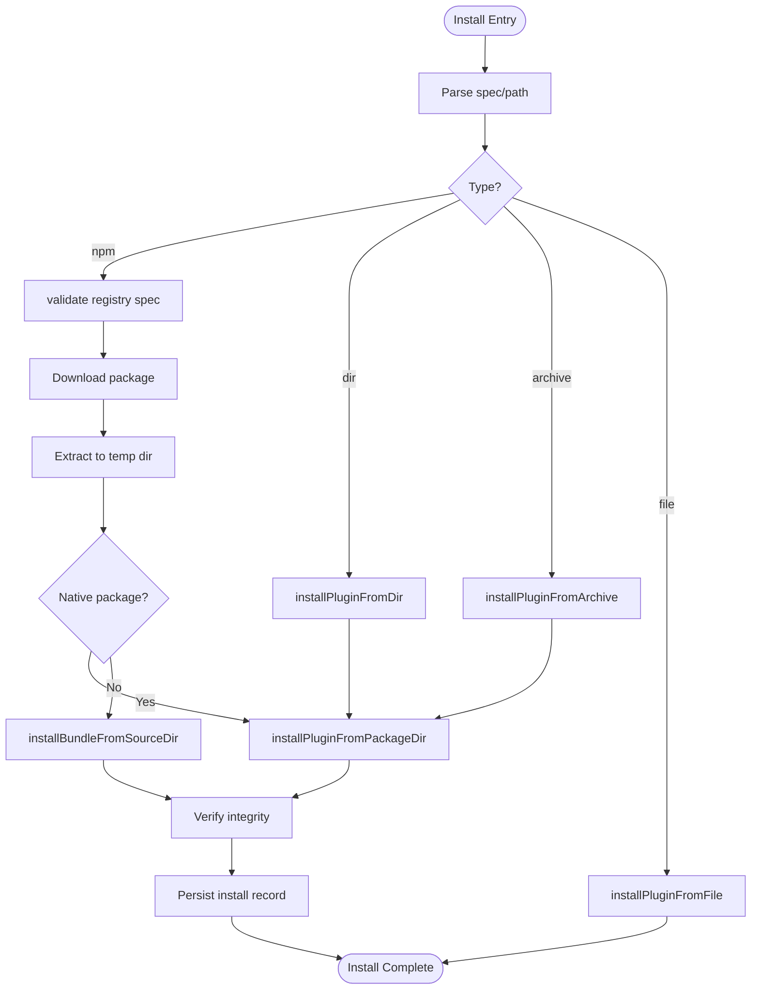
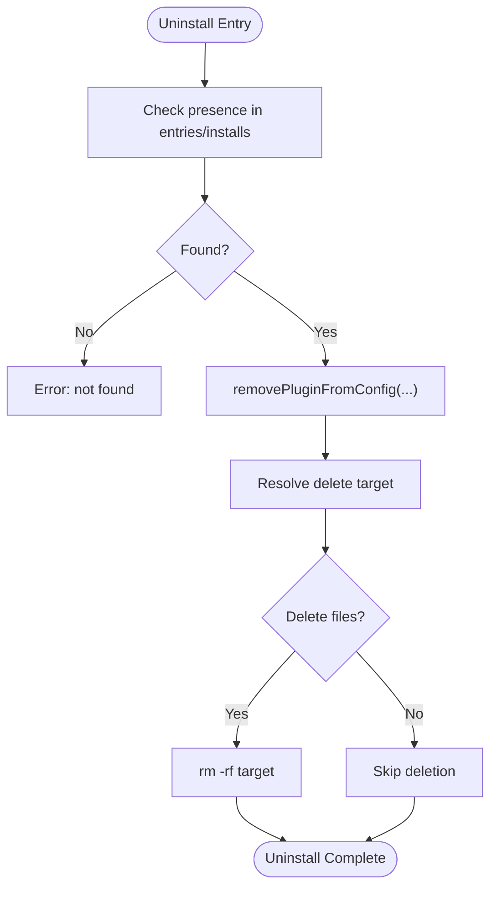
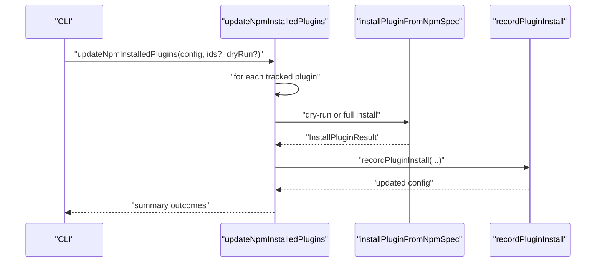
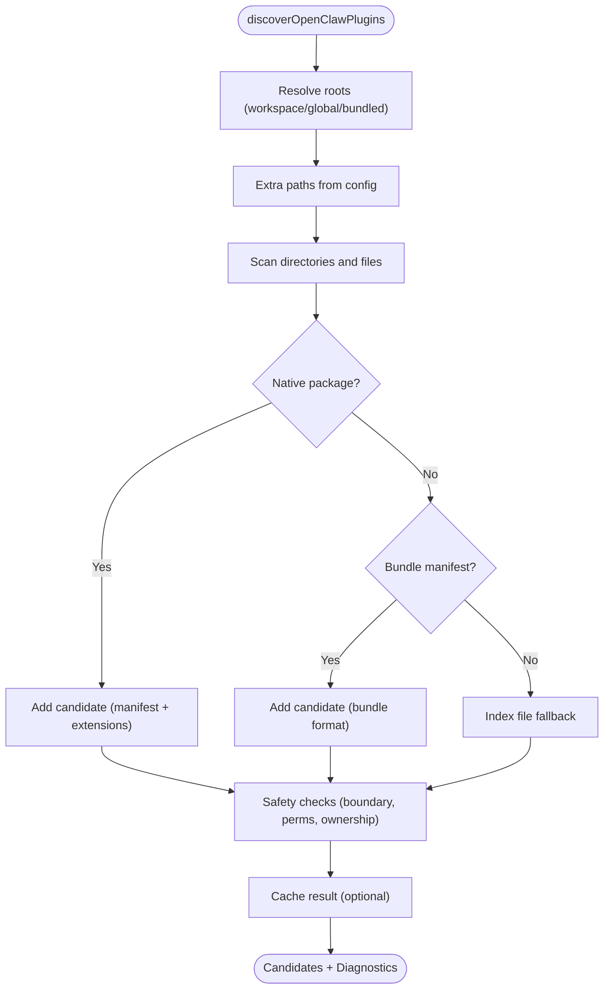
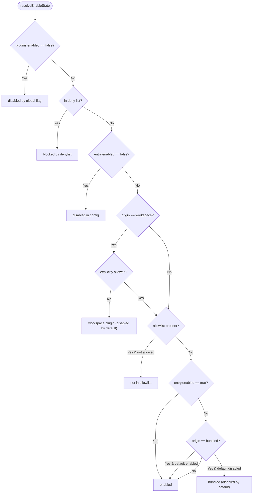
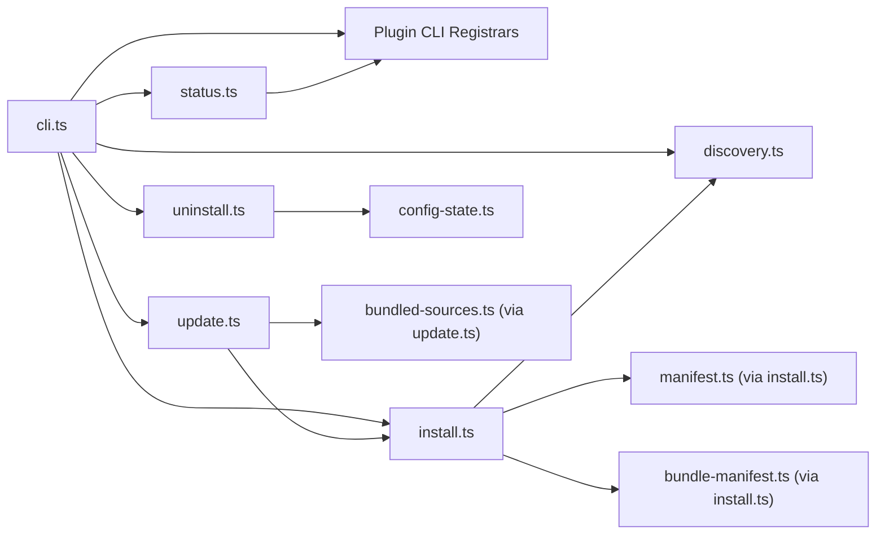

# Plugin Management

<cite>
**Referenced Files in This Document**
- [plugins.md](file://docs/cli/plugins.md)
- [manifest.md](file://docs/plugins/manifest.md)
- [bundles.md](file://docs/plugins/bundles.md)
- [cli.ts](file://src/plugins/cli.ts)
- [install.ts](file://src/plugins/install.ts)
- [uninstall.ts](file://src/plugins/uninstall.ts)
- [update.ts](file://src/plugins/update.ts)
- [discovery.ts](file://src/plugins/discovery.ts)
- [status.ts](file://src/plugins/status.ts)
- [config-state.ts](file://src/plugins/config-state.ts)
- [enable.ts](file://src/plugins/enable.ts)
</cite>

## Table of Contents
1. [Introduction](#introduction)
2. [Project Structure](#project-structure)
3. [Core Components](#core-components)
4. [Architecture Overview](#architecture-overview)
5. [Detailed Component Analysis](#detailed-component-analysis)
6. [Dependency Analysis](#dependency-analysis)
7. [Performance Considerations](#performance-considerations)
8. [Troubleshooting Guide](#troubleshooting-guide)
9. [Conclusion](#conclusion)
10. [Appendices](#appendices)

## Introduction
This document explains OpenClaw’s plugin management commands and internals for operating OpenClaw plugins. It covers installation, removal, listing, and updates; plugin discovery and dependency handling; version and integrity management; configuration and activation; and security and compatibility with official and third-party bundles. Practical examples demonstrate installing official plugins, managing custom plugins, resolving conflicts, and handling integrity drift.

## Project Structure
OpenClaw’s plugin system is implemented in the src/plugins directory and documented in docs/cli/plugins.md, docs/plugins/manifest.md, and docs/plugins/bundles.md. The CLI commands are registered dynamically via plugin-provided CLI registrars.

```mermaid
graph TB
subgraph "CLI"
PCLI["plugins/cli.ts<br/>Registers plugin CLI commands"]
end
subgraph "Plugin Management"
INST["install.ts<br/>Install from path/spec"]
UNINST["uninstall.ts<br/>Remove plugin records/files"]
UPD["update.ts<br/>Update tracked npm plugins"]
DISC["discovery.ts<br/>Discover candidates"]
STAT["status.ts<br/>Build status report"]
end
subgraph "Docs"
DCLI["docs/cli/plugins.md"]
DMAN["docs/plugins/manifest.md"]
DBUN["docs/plugins/bundles.md"]
end
PCLI --> INST
PCLI --> UNINST
PCLI --> UPD
PCLI --> DISC
PCLI --> STAT
DCLI -.-> PCLI
DMAN -.-> INST
DBUN -.-> INST
```

**Diagram sources**
- [cli.ts:11-64](file://src/plugins/cli.ts#L11-L64)
- [install.ts:1-783](file://src/plugins/install.ts#L1-L783)
- [uninstall.ts:1-238](file://src/plugins/uninstall.ts#L1-L238)
- [update.ts:1-588](file://src/plugins/update.ts#L1-L588)
- [discovery.ts:1-800](file://src/plugins/discovery.ts#L1-L800)
- [status.ts:1-39](file://src/plugins/status.ts#L1-L39)
- [plugins.md:1-122](file://docs/cli/plugins.md#L1-L122)
- [manifest.md:1-100](file://docs/plugins/manifest.md#L1-L100)
- [bundles.md:1-293](file://docs/plugins/bundles.md#L1-L293)

**Section sources**
- [cli.ts:11-64](file://src/plugins/cli.ts#L11-L64)
- [plugins.md:1-122](file://docs/cli/plugins.md#L1-L122)

## Core Components
- Plugin CLI registration: Loads plugin-provided CLI registrars and registers them into the main CLI, avoiding duplicates.
- Installation: Supports npm specs, local paths, archives, and linking. Validates manifests, enforces integrity, and scans for suspicious code patterns.
- Uninstallation: Removes plugin entries from configuration and optionally deletes installed files, with safeguards against unsafe deletions.
- Updates: Updates only npm-tracked plugins, probing versions and handling integrity drift with user prompts or non-interactive overrides.
- Discovery: Scans workspace, global extensions, and bundled roots to find candidates, enforcing safety gates and caching.
- Status: Builds a report of discovered plugins and their enablement state.
- Configuration state: Normalizes allowlists, denials, slots, and per-plugin entries; resolves effective enablement and memory slot selection.

**Section sources**
- [cli.ts:11-64](file://src/plugins/cli.ts#L11-L64)
- [install.ts:1-783](file://src/plugins/install.ts#L1-L783)
- [uninstall.ts:1-238](file://src/plugins/uninstall.ts#L1-L238)
- [update.ts:1-588](file://src/plugins/update.ts#L1-L588)
- [discovery.ts:1-800](file://src/plugins/discovery.ts#L1-L800)
- [status.ts:1-39](file://src/plugins/status.ts#L1-L39)
- [config-state.ts:1-336](file://src/plugins/config-state.ts#L1-L336)

## Architecture Overview
The plugin management subsystem integrates CLI registration, installation flows, discovery, and configuration normalization. The CLI delegates to plugin-provided installers and update handlers, while discovery and status rely on the plugin registry.

```mermaid
sequenceDiagram
participant User as "User"
participant CLI as "Main CLI"
participant Reg as "Plugin CLI Registrar"
participant Inst as "Install Flow"
participant Disc as "Discovery"
participant Cfg as "Config State"
User->>CLI : "openclaw plugins install ..."
CLI->>Reg : "register({program, config, workspaceDir, logger})"
Reg-->>CLI : "registered commands"
CLI->>Inst : "installPluginFromPath/spec(...)"
Inst->>Disc : "discover candidates (optional)"
Disc-->>Inst : "candidates + diagnostics"
Inst-->>CLI : "InstallPluginResult"
CLI->>Cfg : "normalize and persist config"
CLI-->>User : "Success/Failure"
```

**Diagram sources**
- [cli.ts:11-64](file://src/plugins/cli.ts#L11-L64)
- [install.ts:751-783](file://src/plugins/install.ts#L751-L783)
- [discovery.ts:750-800](file://src/plugins/discovery.ts#L750-L800)
- [config-state.ts:135-149](file://src/plugins/config-state.ts#L135-L149)

## Detailed Component Analysis

### Installation Flow
Installation supports:
- npm specs (registry-only, exact versions or dist-tags)
- Local paths and archives (.zip, .tgz, .tar.gz, .tar)
- Linking directories (--link) to avoid copying
- Pinning versions (--pin) to record exact specs in plugins.installs

Key behaviors:
- Validates plugin id and manifest presence
- Scans for suspicious code patterns (warn-only)
- Enforces integrity checks and handles drift with prompts
- Supports dry-run to preview changes
- Auto-detects native packages vs bundles

```mermaid
flowchart TD
Start(["Install Entry"]) --> ParseSpec["Parse spec/path"]
ParseSpec --> DetectType{"Type?"}
DetectType --> |npm| Npm["validate registry spec"]
DetectType --> |dir| Dir["installPluginFromDir"]
DetectType --> |archive| Arch["installPluginFromArchive"]
DetectType --> |file| File["installPluginFromFile"]
Npm --> Download["Download package"]
Download --> Extract["Extract to temp dir"]
Extract --> DetectNative{"Native package?"}
DetectNative --> |Yes| FromPkg["installPluginFromPackageDir"]
DetectNative --> |No| FromBundle["installBundleFromSourceDir"]
FromPkg --> Integrity["Verify integrity"]
FromBundle --> Integrity
Integrity --> Save["Persist install record"]
Save --> Done(["Install Complete"])
Dir --> FromPkg
Arch --> FromPkg
File --> Done
```

**Diagram sources**
- [install.ts:697-783](file://src/plugins/install.ts#L697-L783)
- [install.ts:407-587](file://src/plugins/install.ts#L407-L587)
- [install.ts:257-366](file://src/plugins/install.ts#L257-L366)

**Section sources**
- [plugins.md:44-90](file://docs/cli/plugins.md#L44-L90)
- [install.ts:1-783](file://src/plugins/install.ts#L1-L783)

### Uninstallation Flow
Removes plugin records from:
- plugins.entries
- plugins.installs
- plugins.allow
- plugins.load.paths (for linked plugins)
- memory slot resets to default

Optionally deletes installed files, with safeguards to avoid unsafe deletions.

```mermaid
flowchart TD
UStart(["Uninstall Entry"]) --> Check["Check presence in entries/installs"]
Check --> Found{"Found?"}
Found --> |No| UErr["Error: not found"]
Found --> |Yes| RemoveCfg["removePluginFromConfig(...)"]
RemoveCfg --> Target["Resolve delete target"]
Target --> Delete{"Delete files?"}
Delete --> |Yes| RM["rm -rf target"]
Delete --> |No| Skip["Skip deletion"]
RM --> UDone(["Uninstall Complete"])
Skip --> UDone
```

**Diagram sources**
- [uninstall.ts:177-238](file://src/plugins/uninstall.ts#L177-L238)
- [uninstall.ts:65-164](file://src/plugins/uninstall.ts#L65-L164)

**Section sources**
- [plugins.md:91-108](file://docs/cli/plugins.md#L91-L108)
- [uninstall.ts:1-238](file://src/plugins/uninstall.ts#L1-L238)

### Update Flow
Updates only plugins tracked in plugins.installs (npm-installed). Probes current vs next version, handles integrity drift, and migrates config keys when manifest id differs from npm package name.

```mermaid
sequenceDiagram
participant CLI as "CLI"
participant Upd as "updateNpmInstalledPlugins"
participant Inst as "installPluginFromNpmSpec"
participant Rec as "recordPluginInstall"
CLI->>Upd : "updateNpmInstalledPlugins(config, ids?, dryRun?)"
Upd->>Upd : "for each tracked plugin"
Upd->>Inst : "dry-run or full install"
Inst-->>Upd : "InstallPluginResult"
Upd->>Rec : "recordPluginInstall(...)"
Rec-->>Upd : "updated config"
Upd-->>CLI : "summary outcomes"
```

**Diagram sources**
- [update.ts:274-476](file://src/plugins/update.ts#L274-L476)
- [install.ts:697-749](file://src/plugins/install.ts#L697-L749)
- [update.ts:444-452](file://src/plugins/update.ts#L444-L452)

**Section sources**
- [plugins.md:109-122](file://docs/cli/plugins.md#L109-L122)
- [update.ts:1-588](file://src/plugins/update.ts#L1-L588)

### Discovery and Safety Gates
Discovery scans workspace, global extensions, and bundled roots, auto-detecting native packages and bundles. It enforces:
- Path boundary checks
- World-writable directory protection
- Suspicious ownership checks
- Optional cache to reduce startup overhead

```mermaid
flowchart TD
DStart(["discoverOpenClawPlugins"]) --> Roots["Resolve roots (workspace/global/bundled)"]
Roots --> Extra["Extra paths from config"]
Extra --> Scan["Scan directories and files"]
Scan --> Native{"Native package?"}
Native --> |Yes| AddNative["Add candidate (manifest + extensions)"]
Native --> |No| Bundle{"Bundle manifest?"}
Bundle --> |Yes| AddBundle["Add candidate (bundle format)"]
Bundle --> |No| Fallback["Index file fallback"]
AddNative --> Safety["Safety checks (boundary, perms, ownership)"]
AddBundle --> Safety
Fallback --> Safety
Safety --> Cache["Cache result (optional)"]
Cache --> DEnd(["Candidates + Diagnostics"])
```

**Diagram sources**
- [discovery.ts:750-800](file://src/plugins/discovery.ts#L750-L800)
- [discovery.ts:404-444](file://src/plugins/discovery.ts#L404-L444)
- [discovery.ts:103-276](file://src/plugins/discovery.ts#L103-L276)

**Section sources**
- [discovery.ts:1-800](file://src/plugins/discovery.ts#L1-L800)

### Activation and Configuration
Activation considers:
- Global enable flag
- Denylist and allowlist
- Per-plugin entries (enabled, hooks, config)
- Slots (exclusive kinds like memory)
- Built-in channel special cases

```mermaid
flowchart TD
CStart(["resolveEnableState"]) --> Disabled{"plugins.enabled == false?"}
Disabled --> |Yes| R1["disabled by global flag"]
Disabled --> |No| Denied{"in deny list?"}
Denied --> |Yes| R2["blocked by denylist"]
Denied --> |No| EntryOff{"entry.enabled == false?"}
EntryOff --> |Yes| R3["disabled in config"]
EntryOff --> |No| Workspace{"origin == workspace?"}
Workspace --> |Yes| Allowed{"explicitly allowed?"}
Allowed --> |No| R4["workspace plugin (disabled by default)"]
Allowed --> |Yes| AllowCheck{"allowlist present?"}
Workspace --> |No| AllowCheck
AllowCheck --> |Yes & not allowed| R5["not in allowlist"]
AllowCheck --> |No| EntryOn{"entry.enabled == true?"}
EntryOn --> |Yes| Enabled["enabled"]
EntryOn --> |No| Bundled{"origin == bundled?"}
Bundled --> |Yes & default enabled| Enabled
Bundled --> |Yes & default disabled| R6["bundled (disabled by default)"]
Bundled --> |No| Enabled
```

**Diagram sources**
- [config-state.ts:234-305](file://src/plugins/config-state.ts#L234-L305)

**Section sources**
- [enable.ts:12-24](file://src/plugins/enable.ts#L12-L24)
- [config-state.ts:1-336](file://src/plugins/config-state.ts#L1-L336)

## Dependency Analysis
- CLI registration depends on plugin-provided CLI registrars and the plugin loader.
- Installation depends on discovery for bundle detection, integrity verification, and safety scanning.
- Uninstallation depends on configuration normalization and safe deletion logic.
- Updates depend on npm spec resolution and integrity drift handling.
- Status depends on the plugin loader and registry.

```mermaid
graph LR
CLI["cli.ts"] --> REG["Plugin CLI Registrars"]
CLI --> INST["install.ts"]
CLI --> UNINST["uninstall.ts"]
CLI --> UPD["update.ts"]
CLI --> DISC["discovery.ts"]
CLI --> STAT["status.ts"]
INST --> DISC
INST --> MAN["manifest.ts (via install.ts)"]
INST --> BUN["bundle-manifest.ts (via install.ts)"]
UNINST --> CFG["config-state.ts"]
UPD --> INST
UPD --> BUND["bundled-sources.ts (via update.ts)"]
STAT --> REG
```

**Diagram sources**
- [cli.ts:11-64](file://src/plugins/cli.ts#L11-L64)
- [install.ts:1-783](file://src/plugins/install.ts#L1-L783)
- [uninstall.ts:1-238](file://src/plugins/uninstall.ts#L1-L238)
- [update.ts:1-588](file://src/plugins/update.ts#L1-L588)
- [discovery.ts:1-800](file://src/plugins/discovery.ts#L1-L800)
- [status.ts:1-39](file://src/plugins/status.ts#L1-L39)

**Section sources**
- [cli.ts:11-64](file://src/plugins/cli.ts#L11-L64)
- [install.ts:1-783](file://src/plugins/install.ts#L1-L783)
- [uninstall.ts:1-238](file://src/plugins/uninstall.ts#L1-L238)
- [update.ts:1-588](file://src/plugins/update.ts#L1-L588)
- [discovery.ts:1-800](file://src/plugins/discovery.ts#L1-L800)
- [status.ts:1-39](file://src/plugins/status.ts#L1-L39)

## Performance Considerations
- Discovery caching reduces repeated scans during startup; tune OPENCLAW_PLUGIN_DISCOVERY_CACHE_MS or disable via OPENCLAW_DISABLE_PLUGIN_DISCOVERY_CACHE.
- Integrity checks and safety scans add overhead; use dry-run to preview updates and installs.
- Prefer linking directories (--link) for development to avoid copying files repeatedly.
- Limit extraPaths to necessary locations to reduce discovery surface.

[No sources needed since this section provides general guidance]

## Troubleshooting Guide
Common issues and resolutions:
- Plugin not found during uninstall: Verify plugin id exists in plugins.entries or plugins.installs.
- Integrity drift warnings: Confirm whether to proceed with updated package; use global --yes in non-interactive contexts.
- Unsafe plugin candidate blocked: Review diagnostics for world-writable paths, suspicious ownership, or escaping roots.
- Bundle capability not executed: Some capabilities are detected but not yet wired; check verbose info output for unsupported surfaces.
- Conflicts with bundled vs npm installs: Use channel sync to switch between bundled and npm sources; ensure consistent load paths.

**Section sources**
- [uninstall.ts:182-189](file://src/plugins/uninstall.ts#L182-L189)
- [update.ts:248-272](file://src/plugins/update.ts#L248-L272)
- [discovery.ts:241-252](file://src/plugins/discovery.ts#L241-L252)
- [bundles.md:124-158](file://docs/plugins/bundles.md#L124-L158)

## Conclusion
OpenClaw’s plugin management provides robust installation, uninstallation, and update flows with strong safety checks and integrity enforcement. Discovery and configuration normalization ensure predictable behavior across environments. By following the documented commands and best practices, users can confidently manage official and custom plugins, handle conflicts, and maintain secure and reliable plugin ecosystems.

[No sources needed since this section summarizes without analyzing specific files]

## Appendices

### Practical Examples

- Installing an official plugin
  - Use an npm spec (registry-only) and pin the resolved version if desired.
  - Example command: openclaw plugins install <npm-spec> --pin

- Managing a custom plugin
  - Install from a local directory or archive.
  - Use --link to avoid copying during development.

- Handling integrity drift
  - When integrity drift is detected, confirm before proceeding; in CI, use --yes to bypass prompts.

- Upgrading plugins
  - Update only npm-tracked plugins; use --all to update all tracked plugins.

- Removing unused plugins
  - Uninstall removes records and optionally deletes files; use --keep-files to preserve artifacts.

- Managing dependencies across environments
  - Use channel sync to align bundled vs npm sources; ensure consistent load paths.

**Section sources**
- [plugins.md:44-122](file://docs/cli/plugins.md#L44-L122)
- [update.ts:478-587](file://src/plugins/update.ts#L478-L587)
- [uninstall.ts:166-171](file://src/plugins/uninstall.ts#L166-L171)

### Security Considerations
- Treat plugin installs like running code; prefer pinned versions.
- Native packages must ship a manifest with a strict JSON schema for validation.
- Bundle support is intentionally narrower than native plugins; only supported surfaces are executed.
- Safety gates enforce boundary checks, world-writable protections, and suspicious ownership detection.

**Section sources**
- [plugins.md:51-80](file://docs/cli/plugins.md#L51-L80)
- [manifest.md:68-100](file://docs/plugins/manifest.md#L68-L100)
- [bundles.md:240-254](file://docs/plugins/bundles.md#L240-L254)

### Plugin Marketplace Integration
- Official plugins are distributed via npm; installation uses registry-only specs.
- Bundles from Codex, Claude, and Cursor ecosystems are supported and auto-detected.

**Section sources**
- [plugins.md:53-80](file://docs/cli/plugins.md#L53-L80)
- [bundles.md:10-29](file://docs/plugins/bundles.md#L10-L29)

### Development Workflow
- Use --link for rapid iteration on local plugin directories.
- Validate manifests and schemas before publishing.
- Keep pinned versions in production; use prerelease tags explicitly when opting in.

**Section sources**
- [plugins.md:82-90](file://docs/cli/plugins.md#L82-L90)
- [manifest.md:68-100](file://docs/plugins/manifest.md#L68-L100)