# System Administration

<cite>
**Referenced Files in This Document**
- [system.md](file://docs/cli/system.md)
- [doctor.md](file://docs/cli/doctor.md)
- [logs.md](file://docs/cli/logs.md)
- [update.md](file://docs/cli/update.md)
- [backup.md](file://docs/cli/backup.md)
- [reset.md](file://docs/cli/reset.md)
- [uninstall.md](file://docs/cli/uninstall.md)
- [status.md](file://docs/cli/status.md)
- [health.md](file://docs/cli/health.md)
- [memory.md](file://docs/cli/memory.md)
- [sessions.md](file://docs/cli/sessions.md)
- [dashboard.md](file://docs/cli/dashboard.md)
- [gateway/health.md](file://docs/gateway/health.md)
- [gateway/troubleshooting.md](file://docs/gateway/troubleshooting.md)
</cite>

## Table of Contents
1. [Introduction](#introduction)
2. [Project Structure](#project-structure)
3. [Core Components](#core-components)
4. [Architecture Overview](#architecture-overview)
5. [Detailed Component Analysis](#detailed-component-analysis)
6. [Dependency Analysis](#dependency-analysis)
7. [Performance Considerations](#performance-considerations)
8. [Troubleshooting Guide](#troubleshooting-guide)
9. [Conclusion](#conclusion)
10. [Appendices](#appendices)

## Introduction
This document provides system administration guidance for maintaining and operating the OpenClaw system. It covers health checks, diagnostics, log management, updates, backups, resets, uninstalls, monitoring, performance tuning, and troubleshooting workflows. Practical examples demonstrate running diagnostics, managing logs, updating OpenClaw, performing maintenance, and recovering from failures. Advanced topics include scaling, optimization, and security considerations.

## Project Structure
OpenClaw exposes a CLI surface for system administration. The relevant areas for system administration include:
- System-level helpers for events, heartbeats, and presence
- Health and status diagnostics
- Logs tailing via RPC
- Backup, reset, and uninstall workflows
- Memory management and search
- Sessions listing and cleanup
- Dashboard access and URL handling
- Gateway-specific health checks and troubleshooting

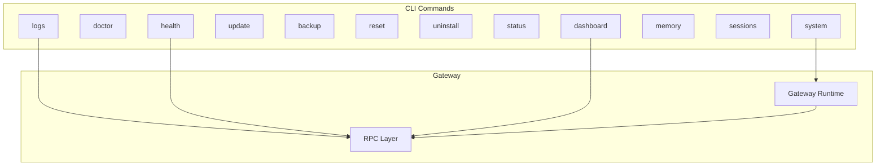

**Diagram sources**
- [system.md:10-61](file://docs/cli/system.md#L10-L61)
- [logs.md:9-29](file://docs/cli/logs.md#L9-L29)
- [health.md:8-22](file://docs/cli/health.md#L8-L22)
- [dashboard.md:9-23](file://docs/cli/dashboard.md#L9-L23)
- [gateway/health.md:8-45](file://docs/gateway/health.md#L8-L45)

**Section sources**
- [system.md:10-61](file://docs/cli/system.md#L10-L61)
- [logs.md:9-29](file://docs/cli/logs.md#L9-L29)
- [health.md:8-22](file://docs/cli/health.md#L8-L22)
- [dashboard.md:9-23](file://docs/cli/dashboard.md#L9-L23)
- [gateway/health.md:8-45](file://docs/gateway/health.md#L8-L45)

## Core Components
- System helpers: Enqueue system events, control heartbeats, and inspect presence.
- Health and status: Inspect channel and session health, and run diagnostics.
- Logs: Tail Gateway logs remotely via RPC with JSON support.
- Updates: Safely update OpenClaw across channels and handle restarts.
- Backups: Create verified archives of state, config, credentials, and optionally workspaces.
- Resets and Uninstalls: Wipe local state or remove the gateway service while preserving CLI.
- Memory: Manage semantic memory indexing, status, and search.
- Sessions: List stored sessions and run cleanup maintenance.
- Dashboard: Open the Control UI with current auth, or print the URL without launching.

**Section sources**
- [system.md:10-61](file://docs/cli/system.md#L10-L61)
- [status.md:9-30](file://docs/cli/status.md#L9-L30)
- [health.md:8-22](file://docs/cli/health.md#L8-L22)
- [logs.md:9-29](file://docs/cli/logs.md#L9-L29)
- [update.md:9-104](file://docs/cli/update.md#L9-L104)
- [backup.md:9-77](file://docs/cli/backup.md#L9-L77)
- [reset.md:9-21](file://docs/cli/reset.md#L9-L21)
- [uninstall.md:9-21](file://docs/cli/uninstall.md#L9-L21)
- [memory.md:9-67](file://docs/cli/memory.md#L9-L67)
- [sessions.md:8-111](file://docs/cli/sessions.md#L8-L111)
- [dashboard.md:9-23](file://docs/cli/dashboard.md#L9-L23)

## Architecture Overview
OpenClaw’s system administration relies on a CLI that communicates with the Gateway via RPC. Administrators run commands locally or remotely to inspect health, manage logs, update the system, back up state, and troubleshoot issues. The Gateway exposes health endpoints and stores session and credential data under the state directory.

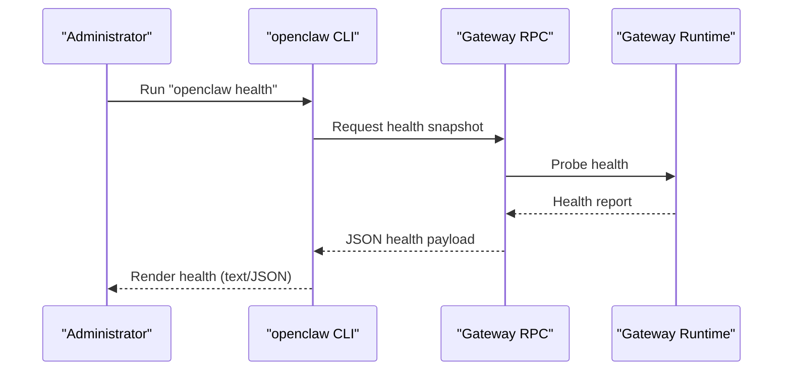

**Diagram sources**
- [health.md:8-22](file://docs/cli/health.md#L8-L22)
- [gateway/health.md:42-45](file://docs/gateway/health.md#L42-L45)

**Section sources**
- [health.md:8-22](file://docs/cli/health.md#L8-L22)
- [gateway/health.md:42-45](file://docs/gateway/health.md#L42-L45)

## Detailed Component Analysis

### System Events, Heartbeats, and Presence
- Enqueue system events on the main session; trigger immediately or on next heartbeat.
- Control heartbeats: enable/disable or show last heartbeat.
- Inspect presence entries for nodes and instances.

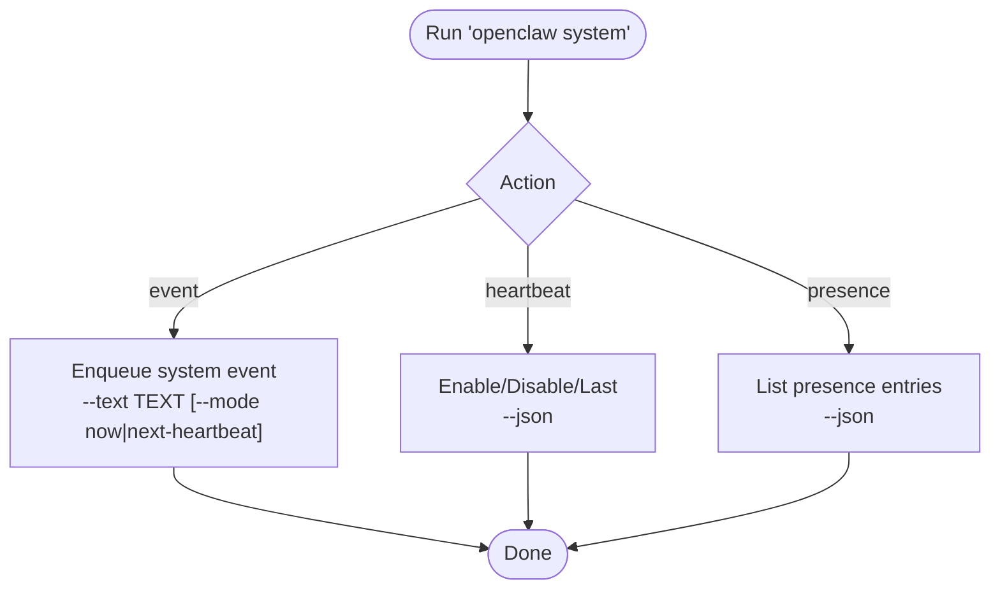

**Diagram sources**
- [system.md:17-61](file://docs/cli/system.md#L17-L61)

**Section sources**
- [system.md:10-61](file://docs/cli/system.md#L10-L61)

### Health Checks and Status Diagnostics
- Use status for quick diagnostics and usage snapshots.
- Use health to fetch a health snapshot from the running Gateway.
- Gateway-specific health checks and troubleshooting steps are documented separately.

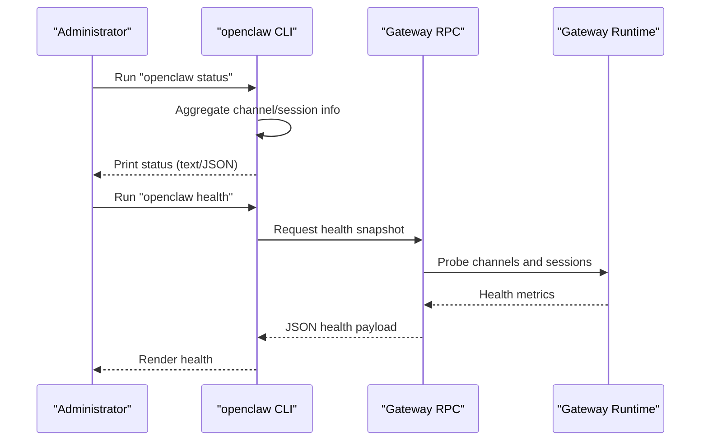

**Diagram sources**
- [status.md:13-30](file://docs/cli/status.md#L13-L30)
- [health.md:12-22](file://docs/cli/health.md#L12-L22)
- [gateway/health.md:12-45](file://docs/gateway/health.md#L12-L45)

**Section sources**
- [status.md:9-30](file://docs/cli/status.md#L9-L30)
- [health.md:8-22](file://docs/cli/health.md#L8-L22)
- [gateway/health.md:8-45](file://docs/gateway/health.md#L8-L45)

### Log Management
- Tail Gateway logs remotely via RPC.
- Support for JSON output, follow mode, limits, and local time rendering.

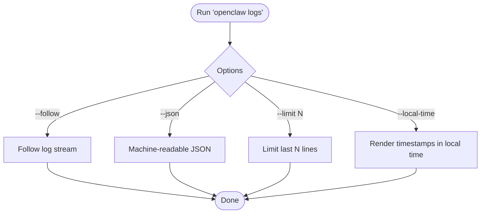

**Diagram sources**
- [logs.md:17-29](file://docs/cli/logs.md#L17-L29)

**Section sources**
- [logs.md:9-29](file://docs/cli/logs.md#L9-L29)

### Update Operations
- Safely update across stable, beta, and dev channels.
- Preview updates with dry-run, control restart behavior, and target specific tags.
- Wizard flow for interactive channel selection and restart confirmation.

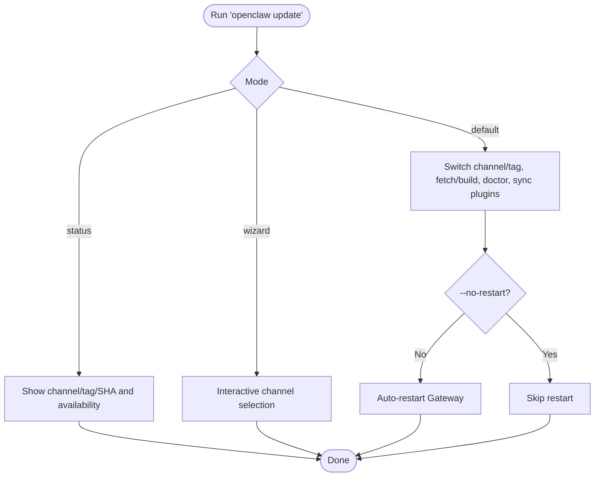

**Diagram sources**
- [update.md:15-104](file://docs/cli/update.md#L15-L104)

**Section sources**
- [update.md:9-104](file://docs/cli/update.md#L9-L104)

### Backup, Reset, and Uninstall
- Backup: Create verified archives of state, config, credentials, and optionally workspaces.
- Reset: Remove local state while keeping the CLI installed.
- Uninstall: Remove the gateway service and local data while keeping the CLI.

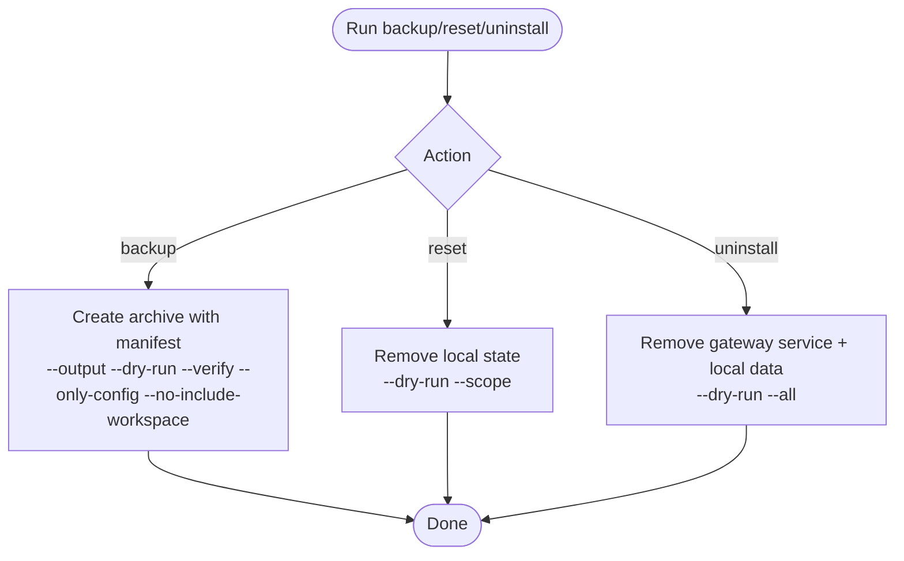

**Diagram sources**
- [backup.md:13-77](file://docs/cli/backup.md#L13-L77)
- [reset.md:13-21](file://docs/cli/reset.md#L13-L21)
- [uninstall.md:13-21](file://docs/cli/uninstall.md#L13-L21)

**Section sources**
- [backup.md:9-77](file://docs/cli/backup.md#L9-L77)
- [reset.md:9-21](file://docs/cli/reset.md#L9-L21)
- [uninstall.md:9-21](file://docs/cli/uninstall.md#L9-L21)

### Memory Management
- Manage semantic memory indexing and search.
- Status deep probing, reindexing, and verbose output for diagnostics.

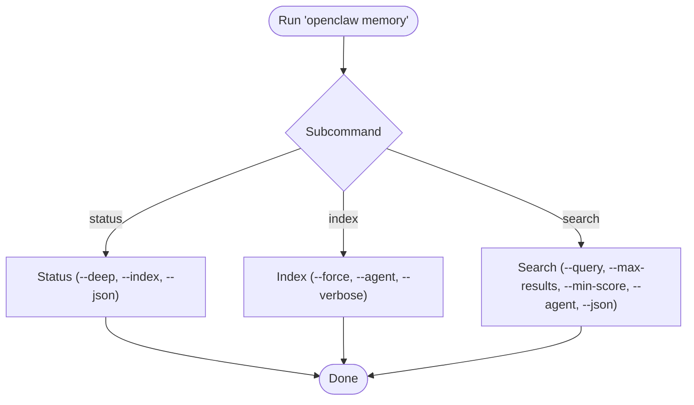

**Diagram sources**
- [memory.md:19-67](file://docs/cli/memory.md#L19-L67)

**Section sources**
- [memory.md:9-67](file://docs/cli/memory.md#L9-L67)

### Sessions Maintenance
- List stored sessions and recent activity.
- Run cleanup maintenance with dry-run previews and enforcement modes.

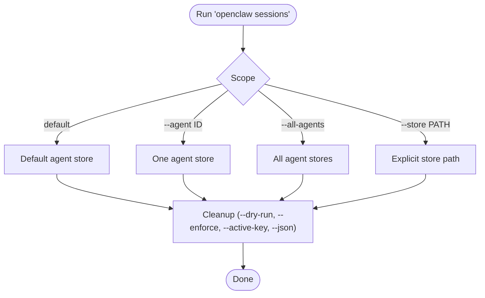

**Diagram sources**
- [sessions.md:12-111](file://docs/cli/sessions.md#L12-L111)

**Section sources**
- [sessions.md:8-111](file://docs/cli/sessions.md#L8-L111)

### Dashboard Access
- Open the Control UI with current auth or print the URL without launching.

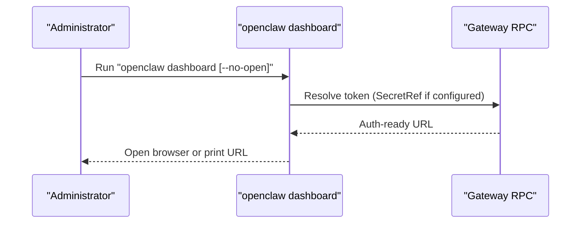

**Diagram sources**
- [dashboard.md:13-23](file://docs/cli/dashboard.md#L13-L23)

**Section sources**
- [dashboard.md:9-23](file://docs/cli/dashboard.md#L9-L23)

## Dependency Analysis
System administration commands depend on the Gateway runtime and RPC layer. The CLI orchestrates operations, while the Gateway executes health probes, manages sessions, and serves logs. Backup and reset/uninstall operate on local state and configuration files.

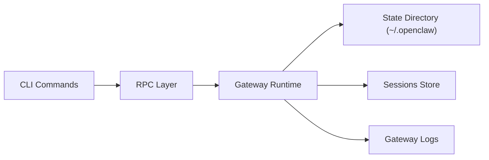

**Diagram sources**
- [gateway/troubleshooting.md:14-30](file://docs/gateway/troubleshooting.md#L14-L30)
- [backup.md:36-47](file://docs/cli/backup.md#L36-L47)

**Section sources**
- [gateway/troubleshooting.md:14-30](file://docs/gateway/troubleshooting.md#L14-L30)
- [backup.md:36-47](file://docs/cli/backup.md#L36-L47)

## Performance Considerations
- Use status and health to identify slow or failing channels before diving into logs.
- Prefer JSON output for machine-readable diagnostics and tooling integration.
- Limit log tailing with --limit and avoid excessive verbose modes in production.
- For memory operations, use --agent scoping and --max-results to constrain resource usage.
- Use sessions cleanup with --dry-run to estimate pruning impact before enforcing changes.
- Backups with --only-config or --no-include-workspace reduce archive size and improve speed.

[No sources needed since this section provides general guidance]

## Troubleshooting Guide
- Command ladder: status, gateway status, logs --follow, doctor, channels status --probe.
- Gateway not running: check runtime state, config mismatch, and port conflicts.
- No replies: verify pairing, allowlists, and group mention policies.
- Dashboard connectivity: validate URL, auth mode, and device identity requirements.
- Upgrades: review auth/URL overrides, bind/auth guardrails, and pairing/device identity changes.
- Cron and heartbeat delivery: verify scheduler state and delivery targets.
- Node paired tools: ensure foreground state, OS permissions, and exec approvals.
- Browser tools: check executable path, CDP profile reachability, and extension relay state.

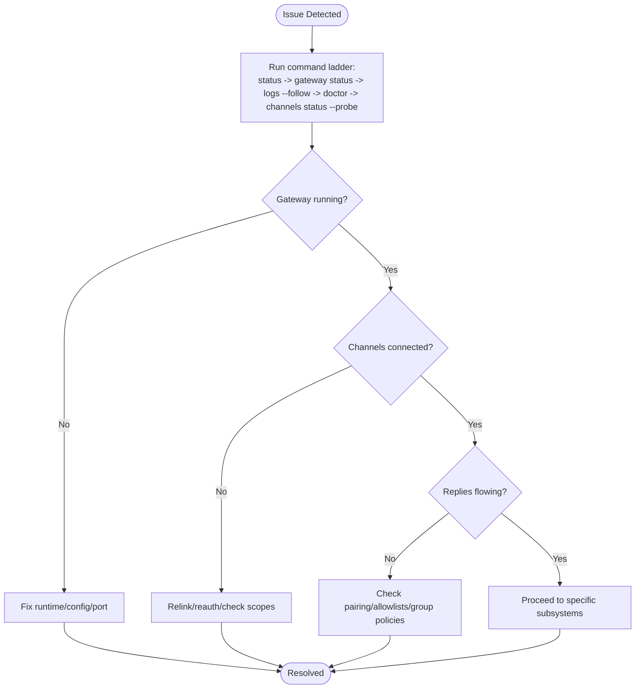

**Diagram sources**
- [gateway/troubleshooting.md:14-30](file://docs/gateway/troubleshooting.md#L14-L30)

**Section sources**
- [gateway/troubleshooting.md:9-380](file://docs/gateway/troubleshooting.md#L9-L380)

## Conclusion
OpenClaw’s CLI provides a comprehensive toolkit for system administration: health checks, diagnostics, logs, updates, backups, resets, uninstalls, memory management, sessions maintenance, and dashboard access. By following the command ladder and leveraging the documented workflows, administrators can maintain system reliability, troubleshoot efficiently, and optimize performance.

[No sources needed since this section summarizes without analyzing specific files]

## Appendices

### Practical Examples Index
- System events and heartbeats: [system.md:17-61](file://docs/cli/system.md#L17-L61)
- Health and status: [status.md:13-30](file://docs/cli/status.md#L13-L30), [health.md:12-22](file://docs/cli/health.md#L12-L22)
- Logs: [logs.md:17-29](file://docs/cli/logs.md#L17-L29)
- Updates: [update.md:15-104](file://docs/cli/update.md#L15-L104)
- Backup: [backup.md:13-77](file://docs/cli/backup.md#L13-L77)
- Reset: [reset.md:13-21](file://docs/cli/reset.md#L13-L21)
- Uninstall: [uninstall.md:13-21](file://docs/cli/uninstall.md#L13-L21)
- Memory: [memory.md:19-67](file://docs/cli/memory.md#L19-L67)
- Sessions: [sessions.md:12-111](file://docs/cli/sessions.md#L12-L111)
- Dashboard: [dashboard.md:13-23](file://docs/cli/dashboard.md#L13-L23)