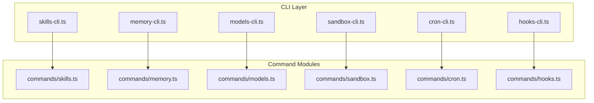
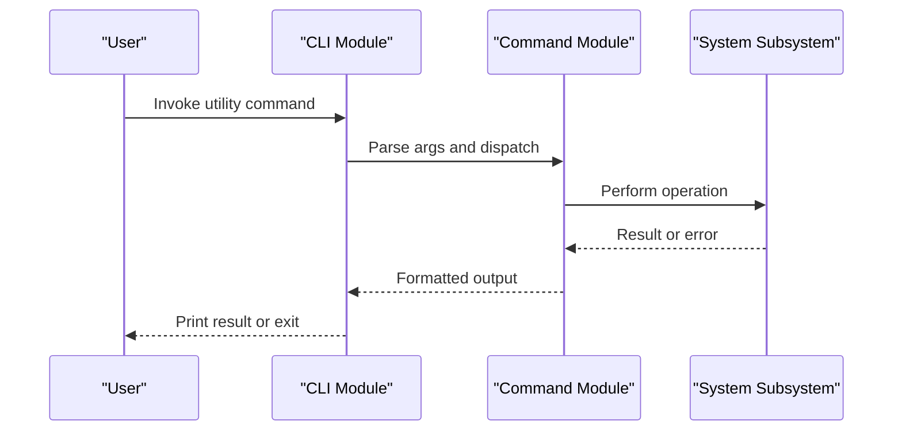
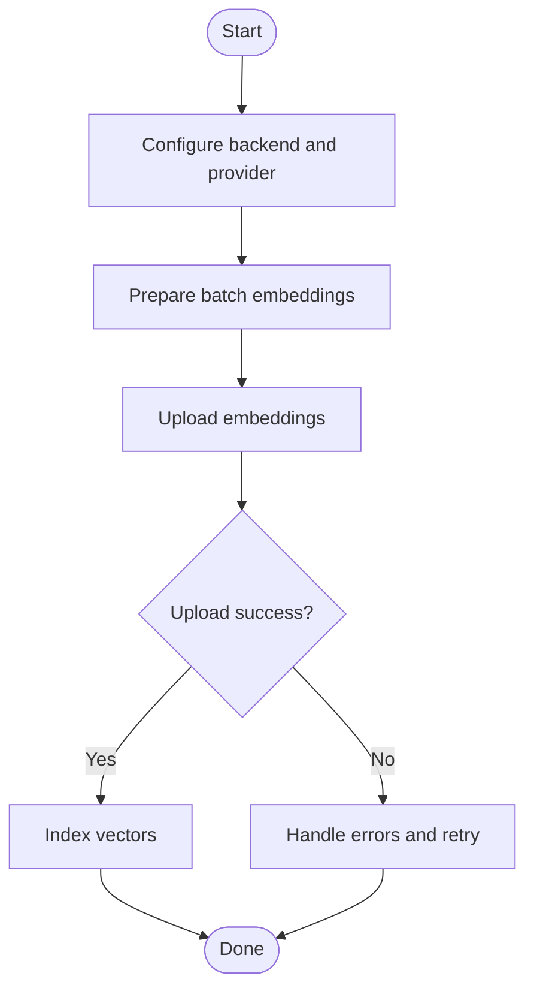
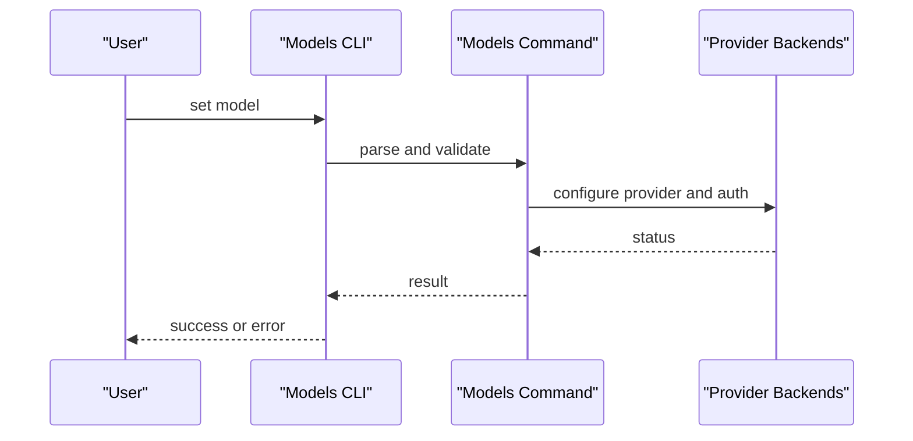
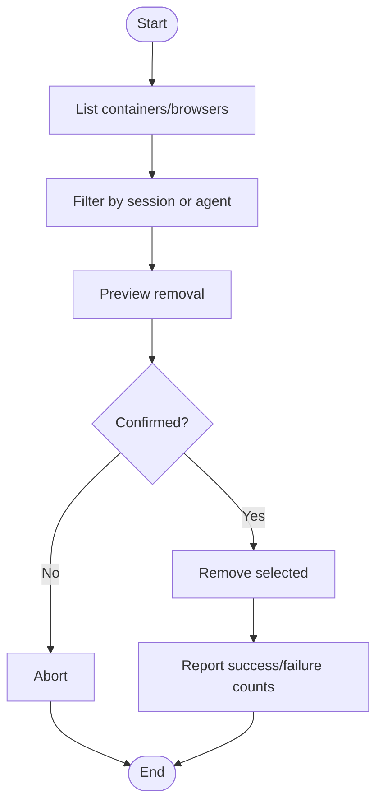
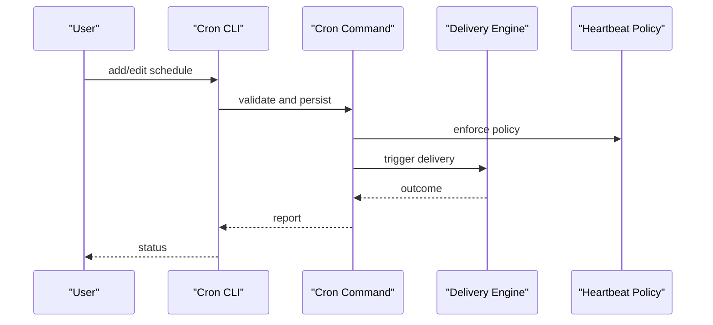
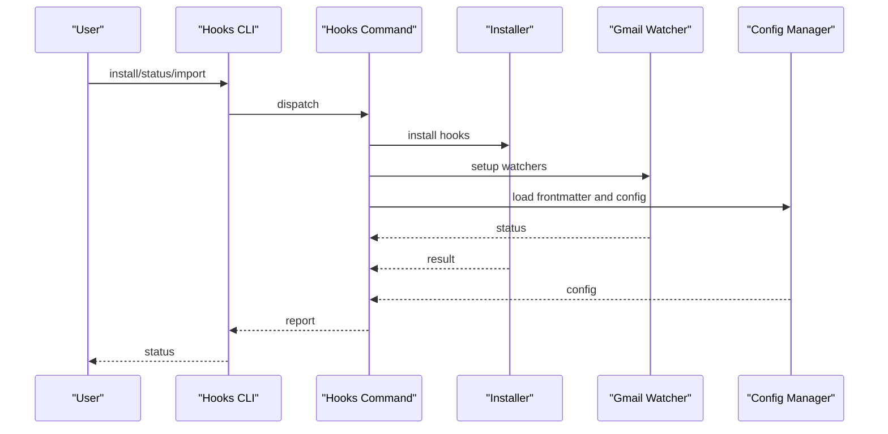
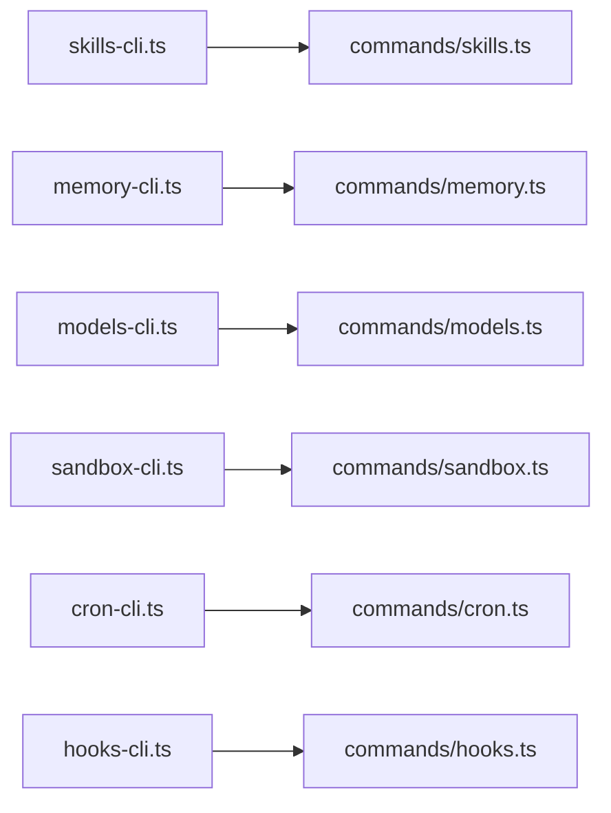

# Utility Commands

<cite>
**Referenced Files in This Document**
- [src/cli/skills-cli.ts](file://src/cli/skills-cli.ts)
- [src/cli/memory-cli.ts](file://src/cli/memory-cli.ts)
- [src/cli/models-cli.ts](file://src/cli/models-cli.ts)
- [src/cli/sandbox-cli.ts](file://src/cli/sandbox-cli.ts)
- [src/cli/cron-cli.ts](file://src/cli/cron-cli.ts)
- [src/cli/hooks-cli.ts](file://src/cli/hooks-cli.ts)
- [src/commands/models.ts](file://src/commands/models.ts)
- [src/commands/sandbox.ts](file://src/commands/sandbox.ts)
- [src/memory/backend-config.ts](file://src/memory/backend-config.ts)
- [src/memory/batch-runner.ts](file://src/memory/batch-runner.ts)
- [src/memory/batch-upload.ts](file://src/memory/batch-upload.ts)
- [src/memory/batch-output.ts](file://src/memory/batch-output.ts)
- [src/cron/delivery.ts](file://src/cron/delivery.ts)
- [src/cron/heartbeat-policy.ts](file://src/cron/heartbeat-policy.ts)
- [src/hooks/hooks.ts](file://src/hooks/hooks.ts)
- [src/hooks/gmail.ts](file://src/hooks/gmail.ts)
- [src/hooks/gmail-setup-utils.ts](file://src/hooks/gmail-setup-utils.ts)
- [src/hooks/config.ts](file://src/hooks/config.ts)
- [src/hooks/install.ts](file://src/hooks/install.ts)
- [src/hooks/status.ts](file://src/hooks/status.ts)
- [src/hooks/import-url.ts](file://src/hooks/import-url.ts)
- [src/hooks/frontmatter.ts](file://src/hooks/frontmatter.ts)
- [src/hooks/bundled-dir.ts](file://src/hooks/bundled-dir.ts)
- [src/hooks/gmail-watcher.ts](file://src/hooks/gmail-watcher.ts)
- [src/hooks/gmail-watcher-lifecycle.ts](file://src/hooks/gmail-watcher-lifecycle.ts)
- [src/hooks/gmail-ops.ts](file://src/hooks/gmail-ops.ts)
- [src/hooks/fire-and-forget.ts](file://src/hooks/fire-and-forget.ts)
- [src/hooks/gmail.test.ts](file://src/hooks/gmail.test.ts)
- [src/hooks/gmail-setup-utils.test.ts](file://src/hooks/gmail-setup-utils.test.ts)
- [src/hooks/gmail-watcher.test.ts](file://src/hooks/gmail-watcher.test.ts)
- [src/hooks/gmail-watcher-lifecycle.test.ts](file://src/hooks/gmail-watcher-lifecycle.test.ts)
- [src/hooks/hooks-install.test.ts](file://src/hooks/hooks-install.test.ts)
- [src/hooks/install.test.ts](file://src/hooks/install.test.ts)
- [src/hooks/status.test.ts](file://src/hooks/status.test.ts)
- [src/hooks/frontmatter.test.ts](file://src/hooks/frontmatter.test.ts)
- [src/hooks/bundled-dir.test.ts](file://src/hooks/bundled-dir.test.ts)
- [src/hooks/gmail-ops.test.ts](file://src/hooks/gmail-ops.test.ts)
- [src/hooks/fire-and-forget.test.ts](file://src/hooks/fire-and-forget.test.ts)
- [src/hooks/hooks-status.ts](file://src/hooks/hooks-status.ts)
- [src/hooks/gmail-watchers.ts](file://src/hooks/gmail-watchers.ts)
- [src/hooks/gmail-watchers.test.ts](file://src/hooks/gmail-watchers.test.ts)
- [src/hooks/gmail-watchers-lifecycle.test.ts](file://src/hooks/gmail-watchers-lifecycle.test.ts)
- [src/hooks/gmail-watchers-lifecycle.ts](file://src/hooks/gmail-watchers-lifecycle.ts)
- [src/hooks/gmail-watchers-setup.test.ts](file://src/hooks/gmail-watchers-setup.test.ts)
- [src/hooks/gmail-watchers-setup.ts](file://src/hooks/gmail-watchers-setup.ts)
- [src/hooks/gmail-watchers-ops.test.ts](file://src/hooks/gmail-watchers-ops.test.ts)
- [src/hooks/gmail-watchers-ops.ts](file://src/hooks/gmail-watchers-ops.ts)
- [src/hooks/gmail-watchers-ops.ts](file://src/hooks/gmail-watchers-ops.ts)
- [src/hooks/gmail-watchers-ops.test.ts](file://src/hooks/gmail-watchers-ops.test.ts)
- [src/hooks/gmail-watchers-ops.ts](file://src/hooks/gmail-watchers-ops.ts)
- [src/hooks/gmail-watchers-ops.test.ts](file://src/hooks/gmail-watchers-ops.test.ts)
- [src/hooks/gmail-watchers-ops.ts](file://src/hooks/gmail-watchers-ops.ts)
- [src/hooks/gmail-watchers-ops.test.ts](file://src/hooks/gmail-watchers-ops.test.ts)
- [src/hooks/gmail-watchers-ops.ts](file://src/hooks/gmail-watchers-ops.ts)
- [src/hooks/gmail-watchers-ops.test.ts](file://src/hooks/gmail-watchers-ops.test.ts)
- [src/hooks/gmail-watchers-ops.ts](file://src/hooks/gmail-watchers-ops.ts)
- [src/hooks/gmail-watchers-ops.test.ts](file://src/hooks/gmail-watchers-ops.test.ts)
- [src/hooks/gmail-watchers-ops.ts](file://src/hooks/gmail-watchers-ops.ts)
- [src/hooks/gmail-watchers-ops.test.ts](file://src/hooks/gmail-watchers-ops.test.ts)
- [src/hooks/gmail-watchers-ops.ts](file://src/hooks/gmail-watchers-ops.ts)
- [src/hooks/gmail-watchers-ops.test.ts](file://src/hooks/gmail-watchers-ops.test.ts)
- [src/hooks/gmail-watchers-ops.ts](file://src/hooks/gmail-watchers-ops.ts)
- [src/hooks/gmail-watchers-ops.test.ts](file://src/hooks/gmail-watchers-ops.test.ts)
- [src/hooks/gmail-watchers-ops.ts](file://src/hooks/gmail-watchers-ops.ts)
- [src/hooks/gmail-watchers-ops.test.ts](file://src/hooks/gmail-watchers-ops.test.ts)
- [src/hooks/gmail-watchers-ops.ts](file://src/hooks/gmail-watchers-ops.ts)
- [src/hooks/gmail-watchers-ops.test.ts](file://src/hooks/gmail-watchers-ops.test.ts)
......
</cite>

## Table of Contents
1. [Introduction](#introduction)
2. [Project Structure](#project-structure)
3. [Core Components](#core-components)
4. [Architecture Overview](#architecture-overview)
5. [Detailed Component Analysis](#detailed-component-analysis)
6. [Dependency Analysis](#dependency-analysis)
7. [Performance Considerations](#performance-considerations)
8. [Troubleshooting Guide](#troubleshooting-guide)
9. [Conclusion](#conclusion)
10. [Appendices](#appendices)

## Introduction
This document explains the utility commands that power day-to-day operations: skills, memory, models, sandbox, cron, and hooks. It covers workflows, integration patterns, and troubleshooting, with practical examples for memory indexing, model selection, sandbox configuration, and cron job management. The goal is to make these utilities approachable while remaining precise for both new and experienced users.

## Project Structure
Utility commands are exposed via CLI entry points and implemented in dedicated command modules. Each utility area has its own CLI module and a corresponding command module that encapsulates the logic.

**Diagram sources**
- [src/cli/skills-cli.ts](file://src/cli/skills-cli.ts)
- [src/cli/memory-cli.ts](file://src/cli/memory-cli.ts)
- [src/cli/models-cli.ts](file://src/cli/models-cli.ts)
- [src/cli/sandbox-cli.ts](file://src/cli/sandbox-cli.ts)
- [src/cli/cron-cli.ts](file://src/cli/cron-cli.ts)
- [src/cli/hooks-cli.ts](file://src/cli/hooks-cli.ts)
- [src/commands/models.ts](file://src/commands/models.ts)
- [src/commands/sandbox.ts](file://src/commands/sandbox.ts)

**Section sources**
- [src/cli/skills-cli.ts](file://src/cli/skills-cli.ts)
- [src/cli/memory-cli.ts](file://src/cli/memory-cli.ts)
- [src/cli/models-cli.ts](file://src/cli/models-cli.ts)
- [src/cli/sandbox-cli.ts](file://src/cli/sandbox-cli.ts)
- [src/cli/cron-cli.ts](file://src/cli/cron-cli.ts)
- [src/cli/hooks-cli.ts](file://src/cli/hooks-cli.ts)
- [src/commands/models.ts](file://src/commands/models.ts)
- [src/commands/sandbox.ts](file://src/commands/sandbox.ts)

## Core Components
- Skills: Discovery, installation, and management of skills and skill creators.
- Memory: Vector memory backend configuration, batch embedding, and indexing operations.
- Models: Model aliases, fallbacks, authentication, and selection for text and image tasks.
- Sandbox: Listing and recreating sandbox containers and browsers; filtering by session or agent.
- Cron: Scheduled delivery orchestration and heartbeat policies.
- Hooks: Hook lifecycle, installation, status, and Gmail watcher management.

**Section sources**
- [src/cli/skills-cli.ts](file://src/cli/skills-cli.ts)
- [src/cli/memory-cli.ts](file://src/cli/memory-cli.ts)
- [src/cli/models-cli.ts](file://src/cli/models-cli.ts)
- [src/cli/sandbox-cli.ts](file://src/cli/sandbox-cli.ts)
- [src/cli/cron-cli.ts](file://src/cli/cron-cli.ts)
- [src/cli/hooks-cli.ts](file://src/cli/hooks-cli.ts)

## Architecture Overview
The CLI modules parse arguments and delegate to command modules. Command modules coordinate with internal subsystems (e.g., memory backends, sandbox runtime, cron scheduler, hooks manager).

[No sources needed since this diagram shows conceptual workflow, not actual code structure]

## Detailed Component Analysis

### Skills Management
Skills are discovered, installed, and curated via the skills CLI. The command module exposes subcommands for listing, installing, and managing skills.

- Typical workflow:
  - Discover available skills and their metadata.
  - Install or update skills.
  - Manage skill creators and templates.

- Integration pattern:
  - Skills CLI delegates to skills command module.
  - Command module interacts with the skills registry and filesystem.

- Best practices:
  - Keep skills updated regularly.
  - Prefer official or verified skills.
  - Use skill creators for consistent templates.

**Section sources**
- [src/cli/skills-cli.ts](file://src/cli/skills-cli.ts)

### Memory Operations
Vector memory supports configurable backends and batch operations for embedding and indexing.

- Backend configuration:
  - Select and configure a memory backend.
  - Set embedding provider and chunking strategy.

- Batch operations:
  - Prepare batches for embedding.
  - Upload embeddings and handle errors.
  - Track batch status and output.

- Example scenarios:
  - Index documents for retrieval.
  - Re-index after schema or provider changes.

**Diagram sources**
- [src/memory/backend-config.ts](file://src/memory/backend-config.ts)
- [src/memory/batch-runner.ts](file://src/memory/batch-runner.ts)
- [src/memory/batch-upload.ts](file://src/memory/batch-upload.ts)
- [src/memory/batch-output.ts](file://src/memory/batch-output.ts)

**Section sources**
- [src/cli/memory-cli.ts](file://src/cli/memory-cli.ts)
- [src/memory/backend-config.ts](file://src/memory/backend-config.ts)
- [src/memory/batch-runner.ts](file://src/memory/batch-runner.ts)
- [src/memory/batch-upload.ts](file://src/memory/batch-upload.ts)
- [src/memory/batch-output.ts](file://src/memory/batch-output.ts)

### Model Configuration
Models command module centralizes model management: aliases, fallbacks, authentication, ordering, scanning, setting primary models, and image-specific configurations.

- Typical workflow:
  - Scan available models.
  - Set primary text and image models.
  - Configure authentication and fallbacks.
  - Adjust provider order for failover.

- Integration pattern:
  - Models CLI maps to models command exports.
  - Command module coordinates with provider backends and auth profiles.

- Best practices:
  - Define clear fallback chains for resilience.
  - Keep provider order aligned with cost and latency goals.
  - Regularly scan and prune unused models.

**Diagram sources**
- [src/commands/models.ts](file://src/commands/models.ts)

**Section sources**
- [src/cli/models-cli.ts](file://src/cli/models-cli.ts)
- [src/commands/models.ts](file://src/commands/models.ts)

### Sandbox Management
Sandbox commands manage containers and browsers used for isolated execution. Users can list, recreate, and filter sandbox resources.

- Typical workflow:
  - List existing containers and browsers.
  - Recreate containers for a session or agent.
  - Confirm destructive operations.

- Integration pattern:
  - Sandbox CLI delegates to sandbox command module.
  - Command module filters and removes containers or browsers.

- Best practices:
  - Use filtering by session or agent to limit scope.
  - Always confirm destructive actions.
  - Clean up unused containers periodically.

**Diagram sources**
- [src/commands/sandbox.ts](file://src/commands/sandbox.ts)

**Section sources**
- [src/cli/sandbox-cli.ts](file://src/cli/sandbox-cli.ts)
- [src/commands/sandbox.ts](file://src/commands/sandbox.ts)

### Cron Job Handling
Cron orchestrates scheduled deliveries and enforces heartbeat policies to keep jobs alive and responsive.

- Typical workflow:
  - Schedule or edit cron jobs.
  - Enforce heartbeat policy to prevent stale runs.
  - Deliver messages according to schedule.

- Integration pattern:
  - Cron CLI maps to cron command module.
  - Command module coordinates delivery and heartbeat logic.

- Best practices:
  - Use heartbeat policies to detect and recover from failures.
  - Keep schedules aligned with workload patterns.
  - Monitor delivery outcomes and adjust policies.

**Diagram sources**
- [src/cron/delivery.ts](file://src/cron/delivery.ts)
- [src/cron/heartbeat-policy.ts](file://src/cron/heartbeat-policy.ts)

**Section sources**
- [src/cli/cron-cli.ts](file://src/cli/cron-cli.ts)
- [src/cron/delivery.ts](file://src/cron/delivery.ts)
- [src/cron/heartbeat-policy.ts](file://src/cron/heartbeat-policy.ts)

### Hooks Administration
Hooks manage lifecycle events, installation, status checks, and Gmail watchers. The system supports importing URLs, frontmatter parsing, and bundled directories.

- Typical workflow:
  - Install hooks and check status.
  - Import hook definitions from URL or file.
  - Manage Gmail watchers and lifecycle.

- Integration pattern:
  - Hooks CLI delegates to hooks command module.
  - Command module coordinates with hook manager, setup utilities, and watchers.

- Best practices:
  - Validate hook configurations before installation.
  - Use frontmatter for declarative metadata.
  - Monitor Gmail watcher health and logs.

**Diagram sources**
- [src/hooks/hooks.ts](file://src/hooks/hooks.ts)
- [src/hooks/install.ts](file://src/hooks/install.ts)
- [src/hooks/status.ts](file://src/hooks/status.ts)
- [src/hooks/import-url.ts](file://src/hooks/import-url.ts)
- [src/hooks/frontmatter.ts](file://src/hooks/frontmatter.ts)
- [src/hooks/bundled-dir.ts](file://src/hooks/bundled-dir.ts)
- [src/hooks/gmail-watcher.ts](file://src/hooks/gmail-watcher.ts)
- [src/hooks/gmail-watcher-lifecycle.ts](file://src/hooks/gmail-watcher-lifecycle.ts)
- [src/hooks/gmail-ops.ts](file://src/hooks/gmail-ops.ts)

**Section sources**
- [src/cli/hooks-cli.ts](file://src/cli/hooks-cli.ts)
- [src/hooks/hooks.ts](file://src/hooks/hooks.ts)
- [src/hooks/install.ts](file://src/hooks/install.ts)
- [src/hooks/status.ts](file://src/hooks/status.ts)
- [src/hooks/import-url.ts](file://src/hooks/import-url.ts)
- [src/hooks/frontmatter.ts](file://src/hooks/frontmatter.ts)
- [src/hooks/bundled-dir.ts](file://src/hooks/bundled-dir.ts)
- [src/hooks/gmail-watcher.ts](file://src/hooks/gmail-watcher.ts)
- [src/hooks/gmail-watcher-lifecycle.ts](file://src/hooks/gmail-watcher-lifecycle.ts)
- [src/hooks/gmail-ops.ts](file://src/hooks/gmail-ops.ts)

## Dependency Analysis
Utility commands depend on their respective command modules and subsystems. Cohesion is strong within each utility; coupling is primarily through CLI dispatch and runtime logging/error handling.

[No sources needed since this diagram shows conceptual relationships, not actual code structure]

**Section sources**
- [src/cli/skills-cli.ts](file://src/cli/skills-cli.ts)
- [src/cli/memory-cli.ts](file://src/cli/memory-cli.ts)
- [src/cli/models-cli.ts](file://src/cli/models-cli.ts)
- [src/cli/sandbox-cli.ts](file://src/cli/sandbox-cli.ts)
- [src/cli/cron-cli.ts](file://src/cli/cron-cli.ts)
- [src/cli/hooks-cli.ts](file://src/cli/hooks-cli.ts)

## Performance Considerations
- Memory batching: Use batch runners to minimize overhead and improve throughput during embedding uploads.
- Model fallbacks: Configure sensible fallback chains to reduce retry storms and improve availability.
- Sandbox cleanup: Regularly remove unused containers to free resources and avoid contention.
- Cron scheduling: Align schedules with workload peaks and tune heartbeat intervals to balance responsiveness and resource usage.
- Hooks: Validate configurations early to avoid repeated setup failures and reduce runtime overhead.

[No sources needed since this section provides general guidance]

## Troubleshooting Guide
- Skills
  - Verify skill availability and permissions.
  - Reinstall if corrupted or outdated.
- Memory
  - Inspect backend configuration and provider credentials.
  - Review batch upload errors and retry failed segments.
- Models
  - Confirm authentication tokens and provider quotas.
  - Adjust fallback order to mitigate provider outages.
- Sandbox
  - Use filtering to target specific sessions or agents.
  - Check logs for removal failures and reattempt selectively.
- Cron
  - Review heartbeat policy violations and delivery failures.
  - Adjust schedules and retry policies based on logs.
- Hooks
  - Validate frontmatter and configuration files.
  - Inspect Gmail watcher status and lifecycle transitions.

**Section sources**
- [src/hooks/gmail.test.ts](file://src/hooks/gmail.test.ts)
- [src/hooks/gmail-setup-utils.test.ts](file://src/hooks/gmail-setup-utils.test.ts)
- [src/hooks/gmail-watcher.test.ts](file://src/hooks/gmail-watcher.test.ts)
- [src/hooks/gmail-watcher-lifecycle.test.ts](file://src/hooks/gmail-watcher-lifecycle.test.ts)
- [src/hooks/hooks-install.test.ts](file://src/hooks/hooks-install.test.ts)
- [src/hooks/install.test.ts](file://src/hooks/install.test.ts)
- [src/hooks/status.test.ts](file://src/hooks/status.test.ts)
- [src/hooks/frontmatter.test.ts](file://src/hooks/frontmatter.test.ts)
- [src/hooks/bundled-dir.test.ts](file://src/hooks/bundled-dir.test.ts)
- [src/hooks/gmail-ops.test.ts](file://src/hooks/gmail-ops.test.ts)
- [src/hooks/fire-and-forget.test.ts](file://src/hooks/fire-and-forget.test.ts)

## Conclusion
Utility commands streamline operational tasks across skills, memory, models, sandbox, cron, and hooks. By following the documented workflows, integration patterns, and best practices, teams can maintain reliable, efficient, and observable systems. Use the troubleshooting guidance to diagnose and resolve common issues quickly.

[No sources needed since this section summarizes without analyzing specific files]

## Appendices
- Examples
  - Memory indexing: Configure backend, prepare batches, upload, and index.
  - Model selection: Scan models, set primary and image models, configure auth and fallbacks.
  - Sandbox configuration: List containers, filter by session or agent, recreate safely.
  - Cron job management: Add/edit schedules, enforce heartbeat policies, monitor outcomes.
  - Hooks administration: Install, import, and manage Gmail watchers with proper status checks.

[No sources needed since this section provides general guidance]