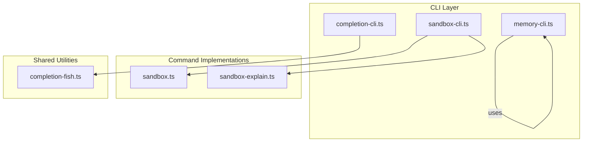
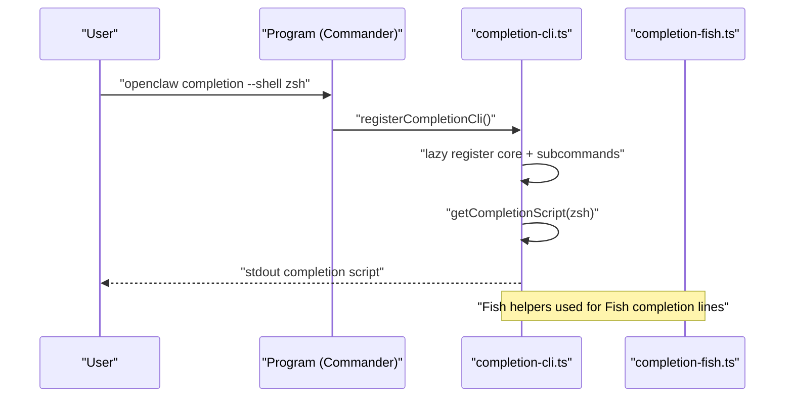
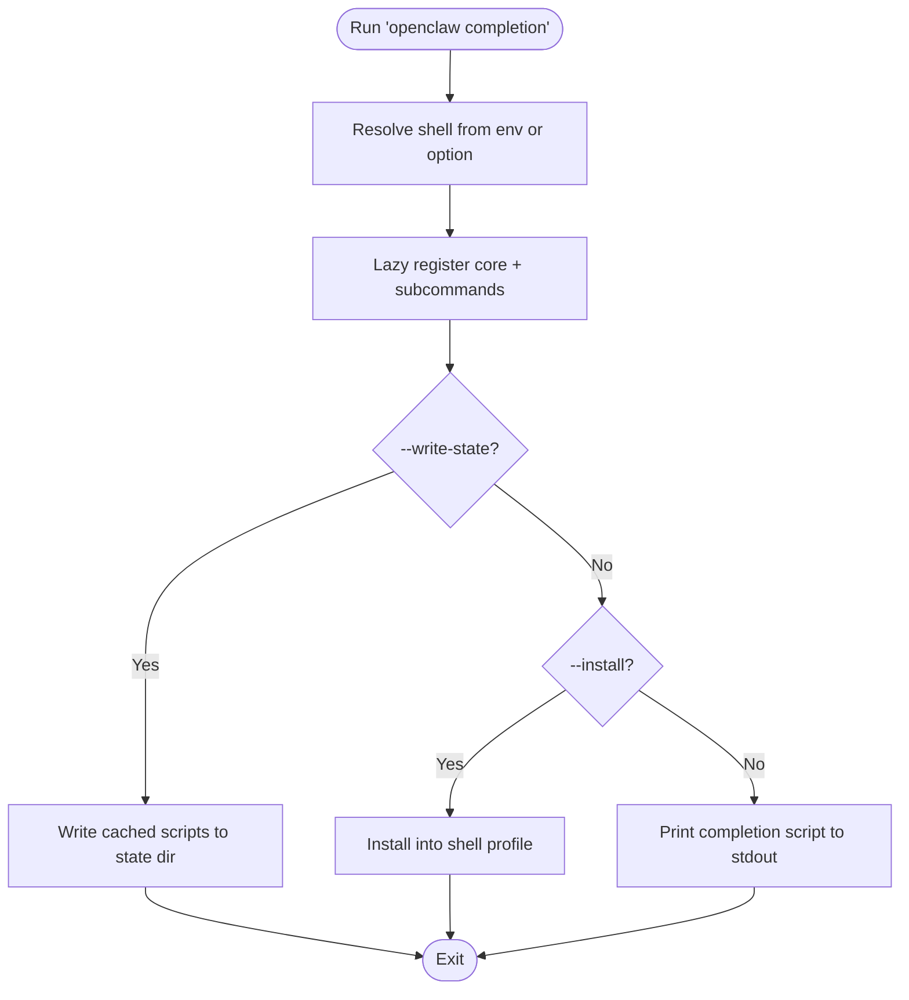
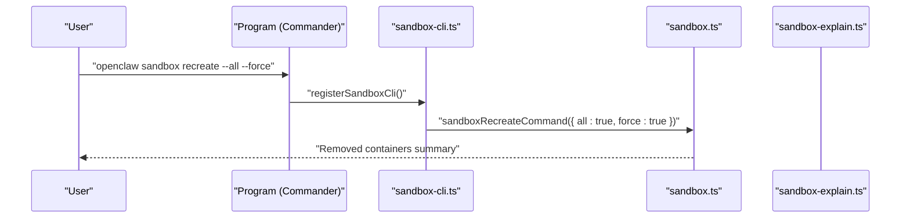
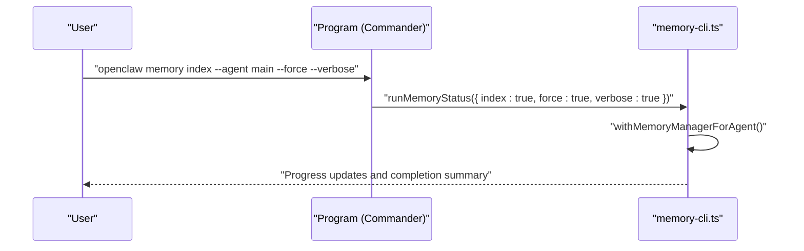
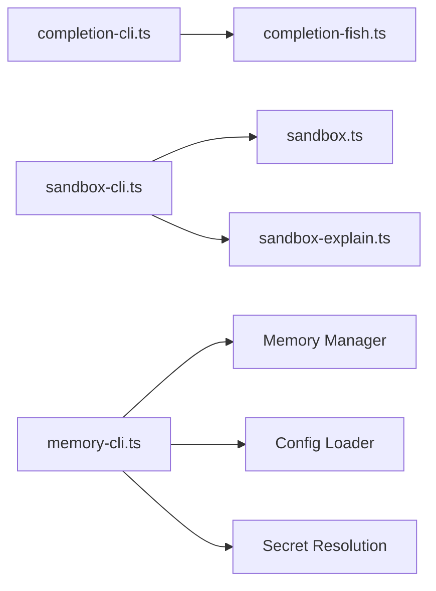

# Utility Commands

<cite>
**Referenced Files in This Document**
- [completion-cli.ts](file://src/cli/completion-cli.ts)
- [completion-fish.ts](file://src/cli/completion-fish.ts)
- [sandbox-cli.ts](file://src/cli/sandbox-cli.ts)
- [sandbox.ts](file://src/commands/sandbox.ts)
- [sandbox-explain.ts](file://src/commands/sandbox-explain.ts)
- [memory-cli.ts](file://src/cli/memory-cli.ts)
- [completion.md](file://docs/cli/completion.md)
- [sandbox.md](file://docs/cli/sandbox.md)
- [memory.md](file://docs/cli/memory.md)
</cite>

## Table of Contents
1. [Introduction](#introduction)
2. [Project Structure](#project-structure)
3. [Core Components](#core-components)
4. [Architecture Overview](#architecture-overview)
5. [Detailed Component Analysis](#detailed-component-analysis)
6. [Dependency Analysis](#dependency-analysis)
7. [Performance Considerations](#performance-considerations)
8. [Troubleshooting Guide](#troubleshooting-guide)
9. [Conclusion](#conclusion)
10. [Appendices](#appendices)

## Introduction
This document focuses on OpenClaw utility commands that assist with developer ergonomics, environment hygiene, and operational visibility. It covers:
- Shell completion generation and installation
- Memory search and indexing management
- Sandbox runtime inspection and maintenance

It explains command usage, configuration options, integration with other OpenClaw components, and provides practical examples, troubleshooting tips, and best practices.

## Project Structure
The utility commands are implemented as CLI subcommands registered in the main program. Each command module encapsulates:
- Command registration and help formatting
- Option parsing and validation
- Integration with core subsystems (e.g., memory managers, sandbox backends)
- Output formatting and JSON support

```mermaid
graph TB
subgraph "CLI Layer"
C["completion-cli.ts"]
S["sandbox-cli.ts"]
M["memory-cli.ts"]
end
subgraph "Command Implementations"
SC["sandbox.ts"]
SE["sandbox-explain.ts"]
end
subgraph "Shared Utilities"
CF["completion-fish.ts"]
end
C --> CF
S --> SC
S --> SE
M --> |"uses"| M
```

**Diagram sources**
- [completion-cli.ts:1-660](file://src/cli/completion-cli.ts#L1-L660)
- [completion-fish.ts:1-42](file://src/cli/completion-fish.ts#L1-L42)
- [sandbox-cli.ts:1-175](file://src/cli/sandbox-cli.ts#L1-L175)
- [sandbox.ts:1-201](file://src/commands/sandbox.ts#L1-L201)
- [sandbox-explain.ts:1-338](file://src/commands/sandbox-explain.ts#L1-L338)
- [memory-cli.ts:1-818](file://src/cli/memory-cli.ts#L1-L818)

**Section sources**
- [completion-cli.ts:1-660](file://src/cli/completion-cli.ts#L1-L660)
- [completion-fish.ts:1-42](file://src/cli/completion-fish.ts#L1-L42)
- [sandbox-cli.ts:1-175](file://src/cli/sandbox-cli.ts#L1-L175)
- [sandbox.ts:1-201](file://src/commands/sandbox.ts#L1-L201)
- [sandbox-explain.ts:1-338](file://src/commands/sandbox-explain.ts#L1-L338)
- [memory-cli.ts:1-818](file://src/cli/memory-cli.ts#L1-L818)

## Core Components
- Shell completion command
  - Generates completion scripts for zsh, bash, fish, and PowerShell
  - Supports writing cached scripts to state directory and installing into shell profiles
  - Uses a lazy registration strategy to build the full command tree for accurate completions
- Sandbox management command
  - Lists sandbox runtimes and their status
  - Recreates sandbox runtimes to apply configuration changes
  - Explains effective sandbox configuration and tool policy
- Memory management command
  - Inspects memory search status and provider readiness
  - Reindexes memory files and surfaces indexing progress and artifacts
  - Searches memory with configurable result limits and scoring

**Section sources**
- [completion-cli.ts:231-301](file://src/cli/completion-cli.ts#L231-L301)
- [completion.md:1-36](file://docs/cli/completion.md#L1-L36)
- [sandbox-cli.ts:59-175](file://src/cli/sandbox-cli.ts#L59-L175)
- [sandbox.md:1-198](file://docs/cli/sandbox.md#L1-L198)
- [memory-cli.ts:576-818](file://src/cli/memory-cli.ts#L576-L818)
- [memory.md:1-67](file://docs/cli/memory.md#L1-L67)

## Architecture Overview
The utility commands integrate with core subsystems through runtime abstractions and configuration loaders. The completion command builds a full command tree to generate accurate completions. The sandbox command orchestrates listing and recreation flows, delegating to backend-specific APIs. The memory command coordinates with memory managers and progress reporting.

```mermaid
sequenceDiagram
participant U as "User"
participant P as "Program (Commander)"
participant CC as "completion-cli.ts"
participant CF as "completion-fish.ts"
U->>P : "openclaw completion --shell zsh"
P->>CC : "registerCompletionCli()"
CC->>CC : "lazy register core + subcommands"
CC->>CC : "getCompletionScript(zsh)"
CC-->>U : "stdout completion script"
Note over CC,CF : "Fish helpers used for Fish completion lines"
```

**Diagram sources**
- [completion-cli.ts:231-301](file://src/cli/completion-cli.ts#L231-L301)
- [completion-fish.ts:1-42](file://src/cli/completion-fish.ts#L1-L42)

**Section sources**
- [completion-cli.ts:231-301](file://src/cli/completion-cli.ts#L231-L301)
- [completion-fish.ts:1-42](file://src/cli/completion-fish.ts#L1-L42)

## Detailed Component Analysis

### Shell Completion Command
- Purpose
  - Generate and install shell completion scripts for zsh, bash, fish, and PowerShell
  - Write cached scripts to state directory for fast shell startup
- Key behaviors
  - Lazy registration of core and subcommands to build a complete command tree
  - Writes completion scripts to $OPENCLAW_STATE_DIR/completions when requested
  - Installs completion by appending a “OpenClaw Completion” block to the appropriate shell profile
  - Detects slow dynamic completion patterns and warns
- Practical usage
  - Generate for a specific shell and print to stdout
  - Write cached scripts for all shells to state directory
  - Install completion into the user’s shell profile
- Integration
  - Uses the program context and subcommand registry to build the command tree
  - Fish completion line builders are reused for Fish-specific completions

```mermaid
flowchart TD
Start(["Run 'openclaw completion'"]) --> CheckShell["Resolve shell from env or option"]
CheckShell --> Register["Lazy register core + subcommands"]
Register --> Decision{"--write-state?"}
Decision --> |Yes| Write["Write cached scripts to state dir"]
Decision --> |No| Install{"--install?"}
Install --> |Yes| InstallFlow["Install into shell profile"]
Install --> |No| Print["Print completion script to stdout"]
Write --> End(["Exit"])
InstallFlow --> End
Print --> End
```

**Diagram sources**
- [completion-cli.ts:251-301](file://src/cli/completion-cli.ts#L251-L301)

**Section sources**
- [completion-cli.ts:231-301](file://src/cli/completion-cli.ts#L231-L301)
- [completion.md:1-36](file://docs/cli/completion.md#L1-L36)

### Sandbox Management Command
- Purpose
  - Manage sandbox runtimes (Docker-based agent isolation) and inspect effective sandbox configuration
- Subcommands
  - list: list sandbox containers and browsers, with optional JSON output
  - recreate: remove sandbox runtimes to force recreation with updated config
  - explain: explain effective sandbox mode/scope/workspace access, tool policy, and elevated gates
- Practical usage
  - List all containers or filter by browser
  - Recreate all containers or filter by session or agent
  - Explain sandbox configuration for a session or agent, optionally in JSON

```mermaid
sequenceDiagram
participant U as "User"
participant P as "Program (Commander)"
participant SC as "sandbox-cli.ts"
participant CMD as "sandbox.ts"
participant EX as "sandbox-explain.ts"
U->>P : "openclaw sandbox recreate --all --force"
P->>SC : "registerSandboxCli()"
SC->>CMD : "sandboxRecreateCommand({ all : true, force : true })"
CMD-->>U : "Removed containers summary"
```

**Diagram sources**
- [sandbox-cli.ts:59-175](file://src/cli/sandbox-cli.ts#L59-L175)
- [sandbox.ts:66-94](file://src/commands/sandbox.ts#L66-L94)

**Section sources**
- [sandbox-cli.ts:59-175](file://src/cli/sandbox-cli.ts#L59-L175)
- [sandbox.ts:43-94](file://src/commands/sandbox.ts#L43-L94)
- [sandbox-explain.ts:129-338](file://src/commands/sandbox-explain.ts#L129-L338)
- [sandbox.md:1-198](file://docs/cli/sandbox.md#L1-L198)

### Memory Management Command
- Purpose
  - Search, inspect, and reindex semantic memory for agents
- Subcommands
  - status: show memory search index status and provider readiness
  - index: reindex memory files with progress and optional force
  - search: search memory with configurable result limits and scoring
- Practical usage
  - Show status with deep probing and optional reindex
  - Force reindex with verbose progress
  - Search with positional or named query, limit results, and filter by minimum score

```mermaid
sequenceDiagram
participant U as "User"
participant P as "Program (Commander)"
participant MC as "memory-cli.ts"
U->>P : "openclaw memory index --agent main --force --verbose"
P->>MC : "runMemoryStatus({ index : true, force : true, verbose : true })"
MC->>MC : "withMemoryManagerForAgent()"
MC-->>U : "Progress updates and completion summary"
```

**Diagram sources**
- [memory-cli.ts:576-818](file://src/cli/memory-cli.ts#L576-L818)

**Section sources**
- [memory-cli.ts:335-574](file://src/cli/memory-cli.ts#L335-L574)
- [memory-cli.ts:604-744](file://src/cli/memory-cli.ts#L604-L744)
- [memory-cli.ts:746-818](file://src/cli/memory-cli.ts#L746-L818)
- [memory.md:1-67](file://docs/cli/memory.md#L1-L67)

## Dependency Analysis
- Completion command depends on:
  - Program context and subcommand registry to build a full command tree
  - Shell profile paths and caching under state directory
  - Fish completion line builders for Fish completions
- Sandbox command depends on:
  - Backend APIs for listing and removing sandbox containers and browsers
  - Display helpers for listing and summaries
  - Confirmation prompts for destructive operations
- Memory command depends on:
  - Memory search manager and progress reporting
  - Configuration loaders and secret resolution for memory backends
  - Session transcript paths for session-based memory sources

```mermaid
graph LR
CC["completion-cli.ts"] --> CF["completion-fish.ts"]
SC["sandbox-cli.ts"] --> CMD["sandbox.ts"]
SC --> EX["sandbox-explain.ts"]
MC["memory-cli.ts"] --> MM["Memory Manager"]
MC --> CFG["Config Loader"]
MC --> SEC["Secret Resolution"]
```

**Diagram sources**
- [completion-cli.ts:1-660](file://src/cli/completion-cli.ts#L1-L660)
- [completion-fish.ts:1-42](file://src/cli/completion-fish.ts#L1-L42)
- [sandbox-cli.ts:1-175](file://src/cli/sandbox-cli.ts#L1-L175)
- [sandbox.ts:1-201](file://src/commands/sandbox.ts#L1-L201)
- [sandbox-explain.ts:1-338](file://src/commands/sandbox-explain.ts#L1-L338)
- [memory-cli.ts:1-818](file://src/cli/memory-cli.ts#L1-L818)

**Section sources**
- [completion-cli.ts:1-660](file://src/cli/completion-cli.ts#L1-L660)
- [completion-fish.ts:1-42](file://src/cli/completion-fish.ts#L1-L42)
- [sandbox-cli.ts:1-175](file://src/cli/sandbox-cli.ts#L1-L175)
- [sandbox.ts:1-201](file://src/commands/sandbox.ts#L1-L201)
- [sandbox-explain.ts:1-338](file://src/commands/sandbox-explain.ts#L1-L338)
- [memory-cli.ts:1-818](file://src/cli/memory-cli.ts#L1-L818)

## Performance Considerations
- Completion generation
  - Writing cached scripts to state directory enables fast shell startup and avoids slow dynamic sourcing
  - The command detects slow dynamic completion patterns and advises switching to cached scripts
- Memory indexing
  - Progress reporting provides ETA and elapsed time; verbose mode emits per-phase details
  - Reindexing can be forced to rebuild the store when files or configuration change
- Sandbox recreation
  - Recreating runtimes ensures updated configuration takes effect without manual backend-specific cleanup
  - Filtering by session or agent reduces unnecessary churn

[No sources needed since this section provides general guidance]

## Troubleshooting Guide
- Completion installation
  - If installation fails, ensure the cache exists; run the write-state command first
  - Confirm the profile path exists or allow the command to create it
  - Verify the “OpenClaw Completion” block is present in the profile
- Slow dynamic completion
  - The command detects patterns like sourcing dynamic scripts and warns; switch to cached scripts
- Memory indexing
  - If indexing fails, check for backend-specific errors and review verbose logs
  - Ensure memory sources are readable and accessible
- Sandbox recreation
  - If no matching runtimes are found, verify filters (all/session/agent/browser)
  - Confirm that the runtime registry recognizes the scope and session keys

**Section sources**
- [completion-cli.ts:208-229](file://src/cli/completion-cli.ts#L208-L229)
- [completion-cli.ts:303-377](file://src/cli/completion-cli.ts#L303-L377)
- [memory-cli.ts:370-402](file://src/cli/memory-cli.ts#L370-L402)
- [sandbox.ts:98-113](file://src/commands/sandbox.ts#L98-L113)

## Conclusion
The utility commands streamline developer workflows by providing reliable shell completion, robust memory management, and pragmatic sandbox maintenance. By leveraging cached completion scripts, structured memory indexing, and targeted sandbox recreation, teams can improve productivity, reduce operational overhead, and maintain consistent environments across agents and sessions.

[No sources needed since this section summarizes without analyzing specific files]

## Appendices

### Practical Examples

- Shell completion
  - Generate and print a zsh completion script
  - Write cached scripts for all shells to state directory
  - Install completion into the user’s shell profile
  - Reference: [completion.md:1-36](file://docs/cli/completion.md#L1-L36)

- Sandbox management
  - List all sandbox containers
  - Recreate all containers with force
  - Explain effective sandbox configuration for a session
  - Reference: [sandbox.md:1-198](file://docs/cli/sandbox.md#L1-L198)

- Memory management
  - Show memory status with deep probing
  - Force reindex with verbose progress
  - Search memory with result limits and minimum score
  - Reference: [memory.md:1-67](file://docs/cli/memory.md#L1-L67)

### Best Practices
- Prefer cached completion scripts for faster shell startup
- Use sandbox recreate after updating Docker images or sandbox configuration
- Keep memory indexing current by running status/index regularly
- Scope memory operations to specific agents when diagnosing issues

[No sources needed since this section provides general guidance]