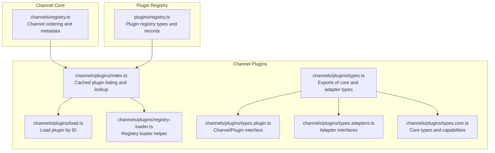
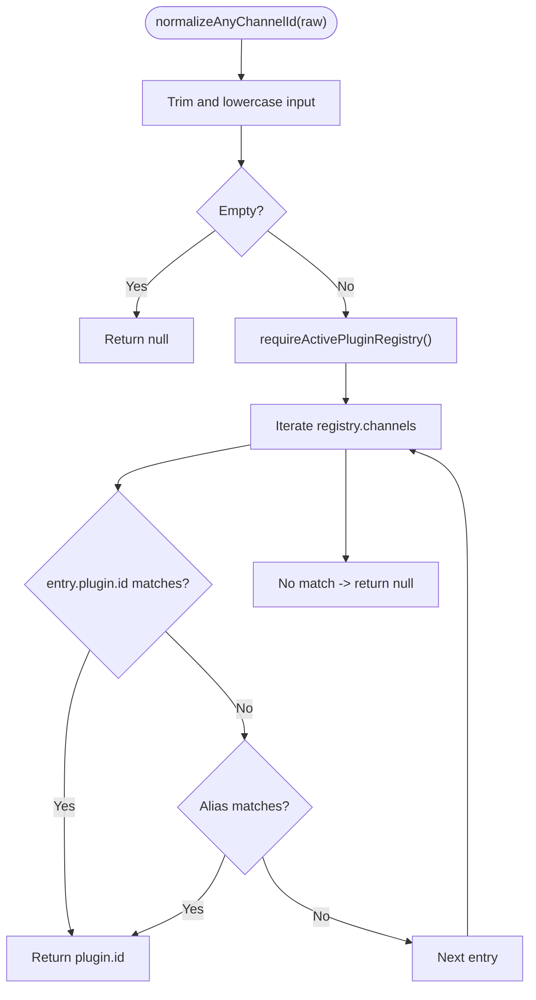
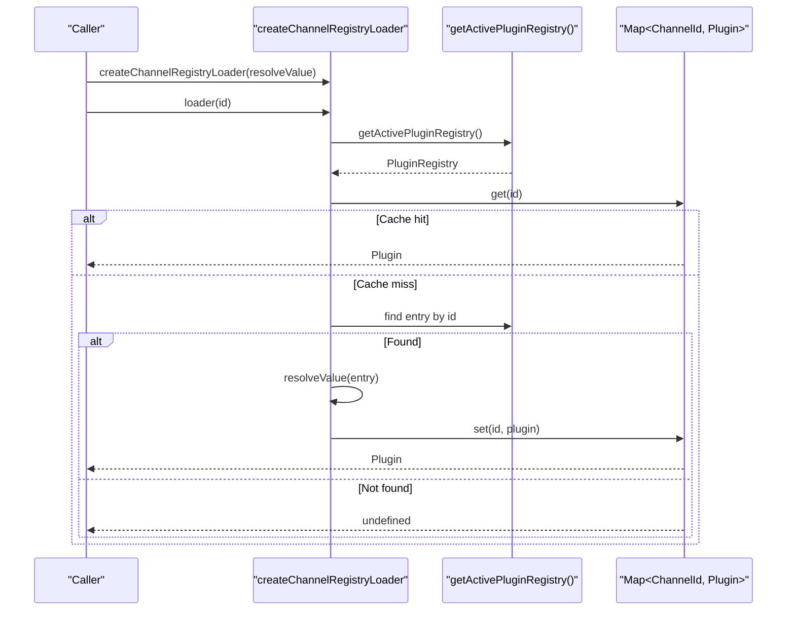
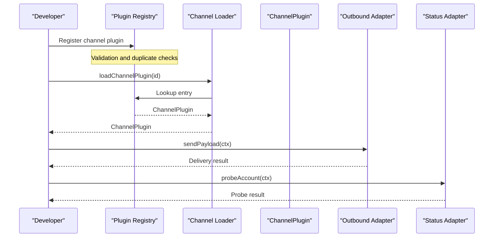
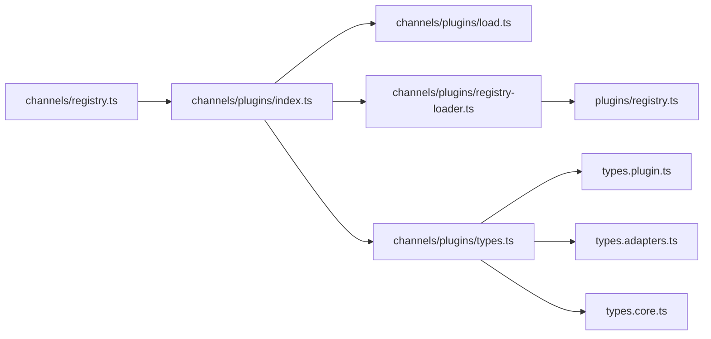

# Channel Architecture

<cite>
**Referenced Files in This Document**
- [types.ts](file://src/channels/plugins/types.ts)
- [types.core.ts](file://src/channels/plugins/types.core.ts)
- [types.adapters.ts](file://src/channels/plugins/types.adapters.ts)
- [types.plugin.ts](file://src/channels/plugins/types.plugin.ts)
- [registry.ts](file://src/channels/registry.ts)
- [index.ts](file://src/channels/plugins/index.ts)
- [load.ts](file://src/channels/plugins/load.ts)
- [registry-loader.ts](file://src/channels/plugins/registry-loader.ts)
- [registry.ts](file://src/plugins/registry.ts)
- [session.ts](file://src/channels/session.ts)
</cite>

## Table of Contents
1. [Introduction](#introduction)
2. [Project Structure](#project-structure)
3. [Core Components](#core-components)
4. [Architecture Overview](#architecture-overview)
5. [Detailed Component Analysis](#detailed-component-analysis)
6. [Dependency Analysis](#dependency-analysis)
7. [Performance Considerations](#performance-considerations)
8. [Troubleshooting Guide](#troubleshooting-guide)
9. [Conclusion](#conclusion)

## Introduction
This document explains OpenClaw’s channel architecture with a focus on the channel adapter system. It covers the channel registry pattern, plugin-based architecture, and core channel interfaces. It also documents the channel lifecycle from registration to message processing, including metadata management, normalization functions, and plugin integration patterns. Practical examples illustrate registration, configuration validation, and plugin loading. Guidance is provided for extending the channel system and implementing custom channel adapters.

## Project Structure
OpenClaw organizes channel-related logic under a dedicated namespace with a strong separation between core channel metadata and plugin-driven adapters. The channel system is composed of:
- Core channel metadata and ordering
- A plugin registry that stores channel plugins
- A loader that resolves channel plugins from the active registry
- Adapter interfaces that define capabilities and behaviors
- Shared utilities for session and message routing

**Diagram sources**
- [registry.ts:1-201](file://src/channels/registry.ts#L1-L201)
- [registry.ts:81-97](file://src/plugins/registry.ts#L81-L97)
- [index.ts:1-118](file://src/channels/plugins/index.ts#L1-L118)
- [load.ts:1-9](file://src/channels/plugins/load.ts#L1-L9)
- [registry-loader.ts:1-35](file://src/channels/plugins/registry-loader.ts#L1-L35)
- [types.ts:1-68](file://src/channels/plugins/types.ts#L1-L68)
- [types.plugin.ts:1-85](file://src/channels/plugins/types.plugin.ts#L1-L85)
- [types.adapters.ts:1-386](file://src/channels/plugins/types.adapters.ts#L1-L386)
- [types.core.ts:1-410](file://src/channels/plugins/types.core.ts#L1-L410)

**Section sources**
- [registry.ts:1-201](file://src/channels/registry.ts#L1-L201)
- [registry.ts:81-97](file://src/plugins/registry.ts#L81-L97)
- [index.ts:1-118](file://src/channels/plugins/index.ts#L1-L118)
- [load.ts:1-9](file://src/channels/plugins/load.ts#L1-L9)
- [registry-loader.ts:1-35](file://src/channels/plugins/registry-loader.ts#L1-L35)
- [types.ts:1-68](file://src/channels/plugins/types.ts#L1-L68)
- [types.plugin.ts:1-85](file://src/channels/plugins/types.plugin.ts#L1-L85)
- [types.adapters.ts:1-386](file://src/channels/plugins/types.adapters.ts#L1-L386)
- [types.core.ts:1-410](file://src/channels/plugins/types.core.ts#L1-L410)

## Core Components
- Channel metadata and ordering: Centralized channel ordering and metadata are defined and exported for UI and selection flows.
- Channel plugin interface: The ChannelPlugin contract defines capabilities, adapters, and optional features such as setup, auth, and agent tools.
- Adapter interfaces: A rich set of adapters encapsulate channel-specific behaviors (configuration, outbound delivery, status, directory, resolver, security, etc.).
- Plugin registry and loader: The active plugin registry stores channel registrations; loaders fetch plugins by ID with caching and invalidation.
- Session and routing: Utilities manage session metadata and inbound routing decisions.

**Section sources**
- [registry.ts:7-121](file://src/channels/registry.ts#L7-L121)
- [types.plugin.ts:49-84](file://src/channels/plugins/types.plugin.ts#L49-L84)
- [types.adapters.ts:24-386](file://src/channels/plugins/types.adapters.ts#L24-L386)
- [registry.ts:81-97](file://src/plugins/registry.ts#L81-L97)
- [index.ts:42-72](file://src/channels/plugins/index.ts#L42-L72)
- [load.ts:6-8](file://src/channels/plugins/load.ts#L6-L8)
- [session.ts:41-81](file://src/channels/session.ts#L41-L81)

## Architecture Overview
The channel architecture follows a plugin-based design:
- Channels are declared in the core registry with metadata and ordering.
- Channel plugins are registered into the active plugin registry.
- Channel adapters expose capabilities and behaviors via typed interfaces.
- Loaders resolve channel plugins from the registry with caching and registry-version-aware invalidation.
- Shared utilities integrate channel behavior into broader systems (sessions, routing).

```mermaid
classDiagram
class ChannelMeta {
+string id
+string label
+string selectionLabel
+string docsPath
+string blurb
+number order
+string[] aliases
}
class ChannelCapabilities {
+string[] chatTypes
+boolean polls
+boolean reactions
+boolean edit
+boolean unsend
+boolean reply
+boolean effects
+boolean groupManagement
+boolean threads
+boolean media
+boolean nativeCommands
+boolean blockStreaming
}
class ChannelConfigAdapter {
+listAccountIds(cfg) string[]
+resolveAccount(cfg, accountId) ResolvedAccount
+describeAccount(account, cfg) ChannelAccountSnapshot
}
class ChannelOutboundAdapter {
+deliveryMode
+resolveTarget(ctx) TargetResult
+sendPayload(ctx) OutboundDeliveryResult
+sendText(ctx) OutboundDeliveryResult
+sendMedia(ctx) OutboundDeliveryResult
+sendPoll(ctx) ChannelPollResult
}
class ChannelStatusAdapter {
+probeAccount(ctx) Probe
+auditAccount(ctx) Audit
+buildAccountSnapshot(ctx) ChannelAccountSnapshot
+collectStatusIssues(accounts) ChannelStatusIssue[]
}
class ChannelGatewayAdapter {
+startAccount(ctx) void
+stopAccount(ctx) void
+loginWithQrStart(params) LoginQrStartResult
+loginWithQrWait(params) LoginQrWaitResult
+logoutAccount(ctx) LogoutResult
}
class ChannelAuthAdapter {
+login(params) void
}
class ChannelSecurityAdapter {
+resolveDmPolicy(ctx) SecurityDmPolicy
+collectWarnings(ctx) string[]
}
class ChannelGroupAdapter {
+resolveRequireMention(ctx) boolean
+resolveGroupIntroHint(ctx) string
+resolveToolPolicy(ctx) GroupToolPolicyConfig
}
class ChannelDirectoryAdapter {
+self(ctx) DirectoryEntry
+listPeers(ctx) DirectoryEntry[]
+listGroups(ctx) DirectoryEntry[]
+listGroupMembers(ctx) DirectoryEntry[]
}
class ChannelResolverAdapter {
+resolveTargets(ctx) ResolveResult[]
}
class ChannelHeartbeatAdapter {
+checkReady(ctx) ReadyResult
+resolveRecipients(ctx) RecipientsResult
}
class ChannelPlugin {
+ChannelId id
+ChannelMeta meta
+ChannelCapabilities capabilities
+ChannelConfigAdapter config
+ChannelOutboundAdapter outbound
+ChannelStatusAdapter status
+ChannelGatewayAdapter gateway
+ChannelAuthAdapter auth
+ChannelSecurityAdapter security
+ChannelGroupAdapter groups
+ChannelDirectoryAdapter directory
+ChannelResolverAdapter resolver
+ChannelHeartbeatAdapter heartbeat
}
ChannelPlugin --> ChannelMeta
ChannelPlugin --> ChannelCapabilities
ChannelPlugin --> ChannelConfigAdapter
ChannelPlugin --> ChannelOutboundAdapter
ChannelPlugin --> ChannelStatusAdapter
ChannelPlugin --> ChannelGatewayAdapter
ChannelPlugin --> ChannelAuthAdapter
ChannelPlugin --> ChannelSecurityAdapter
ChannelPlugin --> ChannelGroupAdapter
ChannelPlugin --> ChannelDirectoryAdapter
ChannelPlugin --> ChannelResolverAdapter
ChannelPlugin --> ChannelHeartbeatAdapter
```

**Diagram sources**
- [types.plugin.ts:49-84](file://src/channels/plugins/types.plugin.ts#L49-L84)
- [types.core.ts:79-197](file://src/channels/plugins/types.core.ts#L79-L197)
- [types.adapters.ts:24-386](file://src/channels/plugins/types.adapters.ts#L24-L386)

## Detailed Component Analysis

### Channel Registry Pattern and Metadata Management
- Channel ordering and metadata are defined centrally for UI and selection flows.
- Aliases enable flexible normalization of channel identifiers.
- Helpers normalize channel IDs across core channels and registered plugins.

**Diagram sources**
- [registry.ts:162-183](file://src/channels/registry.ts#L162-L183)

**Section sources**
- [registry.ts:7-121](file://src/channels/registry.ts#L7-L121)
- [registry.ts:123-183](file://src/channels/registry.ts#L123-L183)

### Plugin-Based Architecture and Loader
- The active plugin registry stores channel registrations with metadata and source information.
- A loader helper creates a registry-backed loader with in-memory cache and registry-version invalidation.
- Public loaders fetch channel plugins by ID from the active registry.

**Diagram sources**
- [registry-loader.ts:9-35](file://src/channels/plugins/registry-loader.ts#L9-L35)
- [load.ts:6-8](file://src/channels/plugins/load.ts#L6-L8)
- [registry.ts:81-97](file://src/plugins/registry.ts#L81-L97)

**Section sources**
- [registry.ts:81-97](file://src/plugins/registry.ts#L81-L97)
- [registry-loader.ts:1-35](file://src/channels/plugins/registry-loader.ts#L1-L35)
- [load.ts:1-9](file://src/channels/plugins/load.ts#L1-L9)

### Core Channel Interfaces and Capabilities
- ChannelMeta defines UI labels, documentation paths, and selection hints.
- ChannelCapabilities enumerate supported chat types and features.
- Adapter interfaces define the contract for configuration, outbound delivery, status, gateway, auth, security, groups, directory, resolver, and heartbeat.

```mermaid
classDiagram
class ChannelMeta {
+id : string
+label : string
+selectionLabel : string
+docsPath : string
+blurb : string
+order? : number
+aliases? : string[]
}
class ChannelCapabilities {
+chatTypes : string[]
+polls? : boolean
+reactions? : boolean
+edit? : boolean
+unsend? : boolean
+reply? : boolean
+effects? : boolean
+groupManagement? : boolean
+threads? : boolean
+media? : boolean
+nativeCommands? : boolean
+blockStreaming? : boolean
}
class ChannelConfigAdapter {
+listAccountIds(cfg)
+resolveAccount(cfg, accountId)
+describeAccount(account, cfg)
}
class ChannelOutboundAdapter {
+deliveryMode
+resolveTarget(ctx)
+sendPayload(ctx)
+sendText(ctx)
+sendMedia(ctx)
+sendPoll(ctx)
}
class ChannelStatusAdapter {
+probeAccount(ctx)
+auditAccount(ctx)
+buildAccountSnapshot(ctx)
+collectStatusIssues(accounts)
}
class ChannelGatewayAdapter {
+startAccount(ctx)
+stopAccount(ctx)
+loginWithQrStart(params)
+loginWithQrWait(params)
+logoutAccount(ctx)
}
class ChannelAuthAdapter {
+login(params)
}
class ChannelSecurityAdapter {
+resolveDmPolicy(ctx)
+collectWarnings(ctx)
}
class ChannelGroupAdapter {
+resolveRequireMention(ctx)
+resolveGroupIntroHint(ctx)
+resolveToolPolicy(ctx)
}
class ChannelDirectoryAdapter {
+self(ctx)
+listPeers(ctx)
+listGroups(ctx)
+listGroupMembers(ctx)
}
class ChannelResolverAdapter {
+resolveTargets(ctx)
}
class ChannelHeartbeatAdapter {
+checkReady(ctx)
+resolveRecipients(ctx)
}
```

**Diagram sources**
- [types.core.ts:79-197](file://src/channels/plugins/types.core.ts#L79-L197)
- [types.adapters.ts:24-386](file://src/channels/plugins/types.adapters.ts#L24-L386)

**Section sources**
- [types.core.ts:79-197](file://src/channels/plugins/types.core.ts#L79-L197)
- [types.adapters.ts:24-386](file://src/channels/plugins/types.adapters.ts#L24-L386)

### Channel Lifecycle: Registration to Message Processing
- Registration: Channels are registered into the active plugin registry with validation and deduplication safeguards.
- Resolution: Channel plugins are resolved by ID from the registry with caching and registry-version invalidation.
- Message processing: Outbound adapters handle target resolution and delivery; directory and resolver adapters support target discovery; heartbeat adapter coordinates readiness and recipient resolution.

**Diagram sources**
- [registry.ts:463-499](file://src/plugins/registry.ts#L463-L499)
- [registry-loader.ts:15-34](file://src/channels/plugins/registry-loader.ts#L15-L34)
- [types.adapters.ts:110-127](file://src/channels/plugins/types.adapters.ts#L110-L127)
- [types.adapters.ts:129-168](file://src/channels/plugins/types.adapters.ts#L129-L168)

**Section sources**
- [registry.ts:463-499](file://src/plugins/registry.ts#L463-L499)
- [registry-loader.ts:1-35](file://src/channels/plugins/registry-loader.ts#L1-L35)
- [types.adapters.ts:110-168](file://src/channels/plugins/types.adapters.ts#L110-L168)

### Channel Metadata Management and Normalization
- Core channel metadata includes labels, documentation links, and selection hints.
- Normalization functions ensure consistent channel identification across core channels and registered plugins.
- Selection helpers format user-facing strings for channel selection UI.

**Section sources**
- [registry.ts:27-121](file://src/channels/registry.ts#L27-L121)
- [registry.ts:135-201](file://src/channels/registry.ts#L135-L201)

### Adapter Abstraction Layer and Shared Utilities
- Adapter interfaces encapsulate channel-specific behaviors while exposing a consistent surface area.
- Shared utilities integrate channel behavior into broader systems (e.g., session recording and inbound routing).

**Section sources**
- [types.adapters.ts:24-386](file://src/channels/plugins/types.adapters.ts#L24-L386)
- [session.ts:41-81](file://src/channels/session.ts#L41-L81)

### Practical Examples
- Channel registration: A plugin registers a channel with a minimal set of adapters and capabilities.
- Configuration validation: Setup adapters validate inputs and produce configuration updates.
- Plugin loading: Loaders fetch channel plugins by ID from the active registry with caching and registry-version invalidation.

**Section sources**
- [registry.ts:463-499](file://src/plugins/registry.ts#L463-L499)
- [types.adapters.ts:24-50](file://src/channels/plugins/types.adapters.ts#L24-L50)
- [registry-loader.ts:1-35](file://src/channels/plugins/registry-loader.ts#L1-L35)

### Extending the Channel System and Implementing Custom Channel Adapters
- Define a ChannelPlugin with required adapters and capabilities.
- Integrate with the plugin registry and ensure proper validation and deduplication.
- Implement adapter interfaces to support configuration, outbound delivery, status, gateway, auth, security, groups, directory, resolver, and heartbeat.
- Use shared utilities for session and routing integration.

**Section sources**
- [types.plugin.ts:49-84](file://src/channels/plugins/types.plugin.ts#L49-L84)
- [types.adapters.ts:24-386](file://src/channels/plugins/types.adapters.ts#L24-L386)
- [registry.ts:81-97](file://src/plugins/registry.ts#L81-L97)

## Dependency Analysis
The channel system exhibits low coupling between core metadata and plugin implementations. Loaders depend on the active plugin registry, and adapters are optional, enabling extensibility without modifying core logic.

**Diagram sources**
- [registry.ts:1-201](file://src/channels/registry.ts#L1-L201)
- [index.ts:1-118](file://src/channels/plugins/index.ts#L1-L118)
- [load.ts:1-9](file://src/channels/plugins/load.ts#L1-L9)
- [registry-loader.ts:1-35](file://src/channels/plugins/registry-loader.ts#L1-L35)
- [registry.ts:81-97](file://src/plugins/registry.ts#L81-L97)
- [types.ts:1-68](file://src/channels/plugins/types.ts#L1-L68)
- [types.plugin.ts:1-85](file://src/channels/plugins/types.plugin.ts#L1-L85)
- [types.adapters.ts:1-386](file://src/channels/plugins/types.adapters.ts#L1-L386)
- [types.core.ts:1-410](file://src/channels/plugins/types.core.ts#L1-L410)

**Section sources**
- [index.ts:42-72](file://src/channels/plugins/index.ts#L42-L72)
- [registry-loader.ts:1-35](file://src/channels/plugins/registry-loader.ts#L1-L35)
- [registry.ts:81-97](file://src/plugins/registry.ts#L81-L97)

## Performance Considerations
- Caching: Loaders cache resolved plugins keyed by ID and invalidate on registry version changes to minimize repeated lookups.
- Deduplication: Channel lists are de-duplicated by ID to prevent redundant processing.
- Concurrency: Channel message handlers operate concurrently across channels without per-channel serialization, improving throughput.

**Section sources**
- [registry-loader.ts:11-34](file://src/channels/plugins/registry-loader.ts#L11-L34)
- [index.ts:14-26](file://src/channels/plugins/index.ts#L14-L26)

## Troubleshooting Guide
- Duplicate channel IDs: Registration validation prevents duplicate channel IDs; diagnostics report conflicts.
- Missing channel ID: Registration validation requires a non-empty channel ID; diagnostics report missing IDs.
- Plugin not found: Loader returns undefined when a channel ID is not present in the registry.
- Session recording errors: Session utilities catch and delegate errors to an error callback for safe operation.

**Section sources**
- [registry.ts:463-499](file://src/plugins/registry.ts#L463-L499)
- [registry-loader.ts:25-28](file://src/channels/plugins/registry-loader.ts#L25-L28)
- [session.ts:49-58](file://src/channels/session.ts#L49-L58)

## Conclusion
OpenClaw’s channel architecture leverages a plugin-based design with a robust registry and adapter interfaces. The system provides clear separation of concerns, strong validation, and efficient caching. By adhering to the ChannelPlugin contract and adapter interfaces, developers can extend the platform with new channels while reusing shared utilities for configuration, status, and message routing.