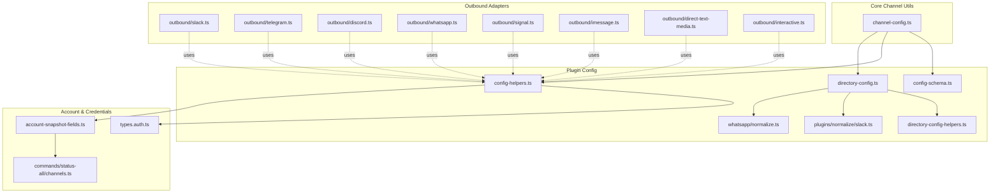
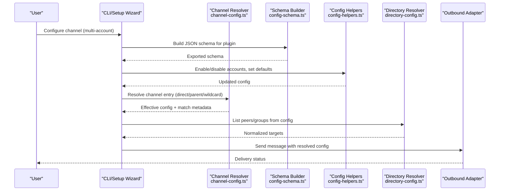
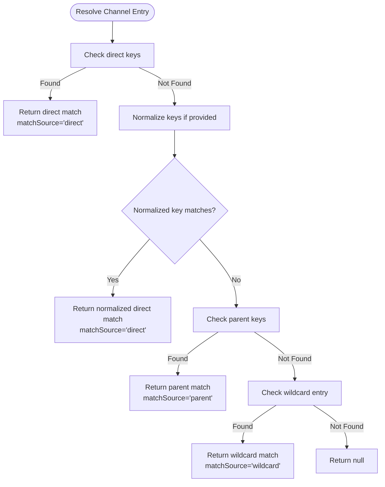
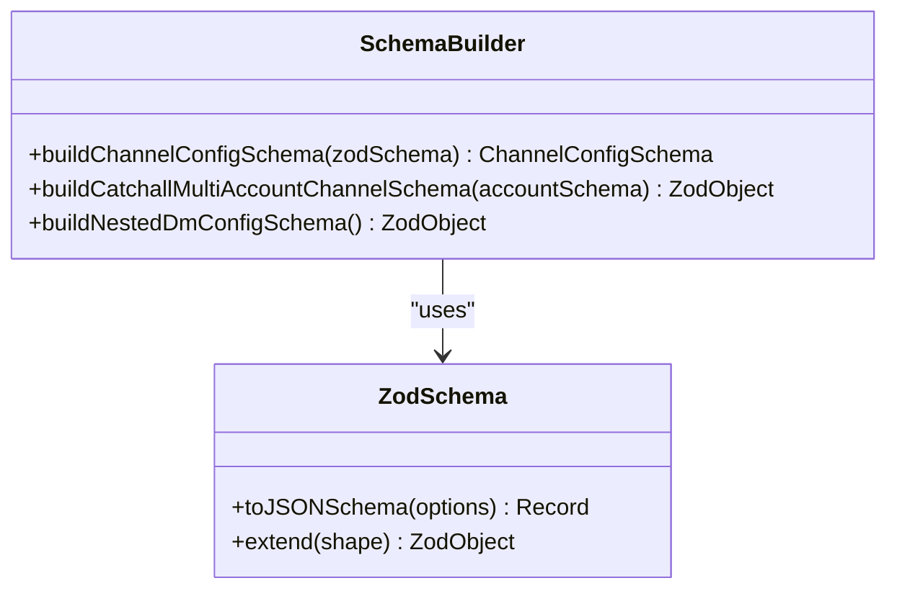
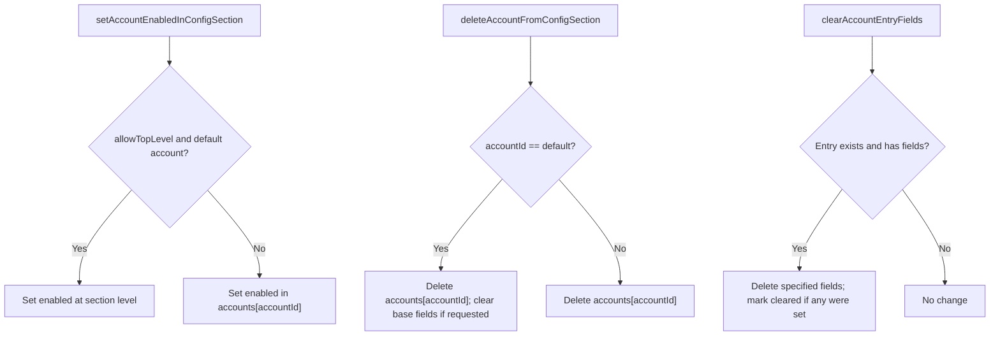
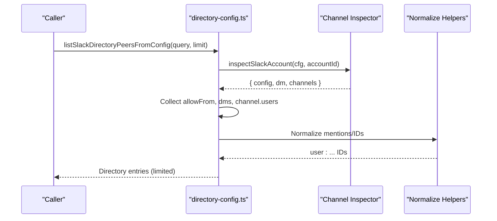
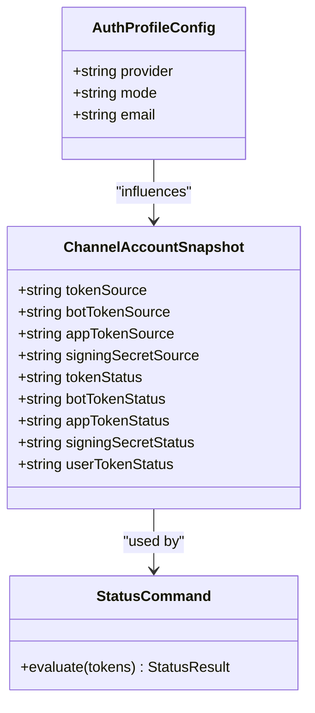
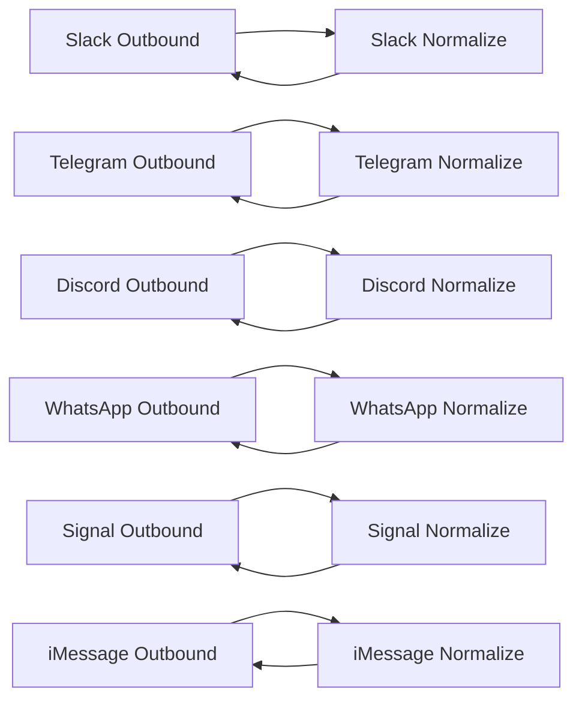
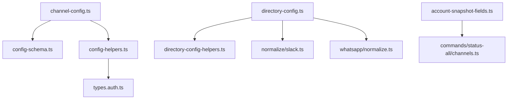

# Channel Configuration

<cite>
**Referenced Files in This Document**
- [src/channels/channel-config.ts](file://src/channels/channel-config.ts)
- [src/channels/plugins/channel-config.ts](file://src/channels/plugins/channel-config.ts)
- [src/channels/plugins/config-schema.ts](file://src/channels/plugins/config-schema.ts)
- [src/channels/plugins/config-helpers.ts](file://src/channels/plugins/config-helpers.ts)
- [src/channels/plugins/directory-config.ts](file://src/channels/plugins/directory-config.ts)
- [src/channels/plugins/directory-config-helpers.ts](file://src/channels/plugins/directory-config-helpers.ts)
- [src/channels/plugins/normalize/slack.ts](file://src/channels/plugins/normalize/slack.ts)
- [src/channels/whatsapp/normalize.ts](file://src/channels/whatsapp/normalize.ts)
- [src/config/zod-schema.core.ts](file://src/config/zod-schema.core.ts)
- [src/config/types.auth.ts](file://src/config/types.auth.ts)
- [src/commands/status-all/channels.ts](file://src/commands/status-all/channels.ts)
- [src/channels/account-snapshot-fields.ts](file://src/channels/account-snapshot-fields.ts)
- [src/channels/plugins/setup-wizard.ts](file://src/channels/plugins/setup-wizard.ts)
- [src/channels/plugins/setup-wizard-helpers.ts](file://src/channels/plugins/setup-wizard-helpers.ts)
- [src/channels/plugins/setup-group-access.ts](file://src/channels/plugins/setup-group-access.ts)
- [src/channels/plugins/setup-group-access-configure.ts](file://src/channels/plugins/setup-group-access-configure.ts)
- [src/channels/plugins/group-policy-warnings.ts](file://src/channels/plugins/group-policy-warnings.ts)
- [src/channels/plugins/media-limits.ts](file://src/channels/plugins/media-limits.ts)
- [src/channels/plugins/message-capabilities.ts](file://src/channels/plugins/message-capabilities.ts)
- [src/channels/plugins/pairing.ts](file://src/channels/plugins/pairing.ts)
- [src/channels/plugins/pairing-message.ts](file://src/channels/plugins/pairing-message.ts)
- [src/channels/plugins/account-helpers.ts](file://src/channels/plugins/account-helpers.ts)
- [src/channels/plugins/account-action-gate.ts](file://src/channels/plugins/account-action-gate.ts)
- [src/channels/plugins/allowlist-match.ts](file://src/channels/plugins/allowlist-match.ts)
- [src/channels/plugins/group-mentions.ts](file://src/channels/plugins/group-mentions.ts)
- [src/channels/plugins/status-issues/shared.ts](file://src/channels/plugins/status-issues/shared.ts)
- [src/channels/plugins/status-issues/discord.ts](file://src/channels/plugins/status-issues/discord.ts)
- [src/channels/plugins/status-issues/telegram.ts](file://src/channels/plugins/status-issues/telegram.ts)
- [src/channels/plugins/status-issues/whatsapp.ts](file://src/channels/plugins/status-issues/whatsapp.ts)
- [src/channels/plugins/status.ts](file://src/channels/plugins/status.ts)
- [src/channels/plugins/status-reactions.ts](file://src/channels/plugins/status-reactions.ts)
- [src/channels/plugins/status-issues.ts](file://src/channels/plugins/status-issues.ts)
- [src/channels/plugins/whatsapp-heartbeat.ts](file://src/channels/plugins/whatsapp-heartbeat.ts)
- [src/channels/plugins/whatsapp-shared.ts](file://src/channels/plugins/whatsapp-shared.ts)
- [src/channels/plugins/actions/discord.ts](file://src/channels/plugins/actions/discord.ts)
- [src/channels/plugins/actions/telegram.ts](file://src/channels/plugins/actions/telegram.ts)
- [src/channels/plugins/actions/signal.ts](file://src/channels/plugins/actions/signal.ts)
- [src/channels/plugins/outbound/discord.ts](file://src/channels/plugins/outbound/discord.ts)
- [src/channels/plugins/outbound/signal.ts](file://src/channels/plugins/outbound/signal.ts)
- [src/channels/plugins/outbound/slack.ts](file://src/channels/plugins/outbound/slack.ts)
- [src/channels/plugins/outbound/telegram.ts](file://src/channels/plugins/outbound/telegram.ts)
- [src/channels/plugins/outbound/whatsapp.ts](file://src/channels/plugins/outbound/whatsapp.ts)
- [src/channels/plugins/outbound/imessage.ts](file://src/channels/plugins/outbound/imessage.ts)
- [src/channels/plugins/outbound/direct-text-media.ts](file://src/channels/plugins/outbound/direct-text-media.ts)
- [src/channels/plugins/outbound/interactive.ts](file://src/channels/plugins/outbound/interactive.ts)
- [src/channels/plugins/outbound/load.ts](file://src/channels/plugins/outbound/load.ts)
- [src/channels/plugins/normalize/discord.ts](file://src/channels/plugins/normalize/discord.ts)
- [src/channels/plugins/normalize/imessage.ts](file://src/channels/plugins/normalize/imessage.ts)
- [src/channels/plugins/normalize/shared.ts](file://src/channels/plugins/normalize/shared.ts)
- [src/channels/plugins/normalize/signal.ts](file://src/channels/plugins/normalize/signal.ts)
- [src/channels/plugins/normalize/whatsapp.ts](file://src/channels/plugins/normalize/whatsapp.ts)
- [src/channels/plugins/normalize/targets.test.ts](file://src/channels/plugins/normalize/targets.test.ts)
- [src/channels/plugins/normalize/telegram.ts](file://src/channels/plugins/normalize/telegram.ts)
- [src/channels/plugins/normalize/slack.ts](file://src/channels/plugins/normalize/slack.ts)
- [src/channels/plugins/normalize/whatsapp.ts](file://src/channels/plugins/normalize/whatsapp.ts)
- [src/channels/plugins/normalize/whatsapp-shared.ts](file://src/channels/plugins/normalize/whatsapp-shared.ts)
- [src/channels/plugins/helpers.ts](file://src/channels/plugins/helpers.ts)
- [src/channels/plugins/helpers.test.ts](file://src/channels/plugins/helpers.test.ts)
- [src/channels/plugins/types.core.ts](file://src/channels/plugins/types.core.ts)
- [src/channels/plugins/types.plugin.ts](file://src/channels/plugins/types.plugin.ts)
- [src/channels/plugins/types.ts](file://src/channels/plugins/types.ts)
- [src/channels/plugins/types.adapters.ts](file://src/channels/plugins/types.adapters.ts)
- [src/channels/plugins/registry-loader.ts](file://src/channels/plugins/registry-loader.ts)
- [src/channels/plugins/setup-registry.ts](file://src/channels/plugins/setup-registry.ts)
- [src/channels/plugins/catalog.ts](file://src/channels/plugins/catalog.ts)
- [src/channels/plugins/message-actions.ts](file://src/channels/plugins/message-actions.ts)
- [src/channels/plugins/message-actions.test.ts](file://src/channels/plugins/message-actions.test.ts)
- [src/channels/plugins/message-actions.security.test.ts](file://src/channels/plugins/message-actions.security.test.ts)
- [src/channels/plugins/message-action-names.ts](file://src/channels/plugins/message-action-names.ts)
- [src/channels/plugins/media-payload.ts](file://src/channels/plugins/media-payload.ts)
- [src/channels/plugins/config-writes.ts](file://src/channels/plugins/config-writes.ts)
- [src/channels/plugins/directory-config-helpers.ts](file://src/channels/plugins/directory-config-helpers.ts)
- [src/channels/plugins/allowlist-match.ts](file://src/channels/plugins/allowlist-match.ts)
- [src/channels/plugins/group-mentions.ts](file://src/channels/plugins/group-mentions.ts)
- [src/channels/plugins/group-policy-warnings.ts](file://src/channels/plugins/group-policy-warnings.ts)
- [src/channels/plugins/inbound-debounce-policy.ts](file://src/channels/plugins/inbound-debounce-policy.ts)
- [src/channels/plugins/model-overrides.ts](file://src/channels/plugins/model-overrides.ts)
- [src/channels/plugins/session.ts](file://src/channels/plugins/session.ts)
- [src/channels/plugins/session-envelope.ts](file://src/channels/plugins/session-envelope.ts)
- [src/channels/plugins/session-meta.ts](file://src/channels/plugins/session-meta.ts)
- [src/channels/plugins/thread-bindings-messages.ts](file://src/channels/plugins/thread-bindings-messages.ts)
- [src/channels/plugins/thread-bindings-policy.ts](file://src/channels/plugins/thread-bindings-policy.ts)
- [src/channels/plugins/typing-lifecycle.ts](file://src/channels/plugins/typing-lifecycle.ts)
- [src/channels/plugins/typing-start-guard.ts](file://src/channels/plugins/typing-start-guard.ts)
- [src/channels/plugins/typing.ts](file://src/channels/plugins/typing.ts)
- [src/channels/plugins/typing.test.ts](file://src/channels/plugins/typing.test.ts)
- [src/channels/plugins/typing-start-guard.test.ts](file://src/channels/plugins/typing-start-guard.test.ts)
- [src/channels/plugins/typing-lifecycle.test.ts](file://src/channels/plugins/typing-lifecycle.test.ts)
- [src/channels/plugins/typing-lifecycle.ts](file://src/channels/plugins/typing-lifecycle.ts)
- [src/channels/plugins/typing-start-guard.ts](file://src/channels/plugins/typing-start-guard.ts)
- [src/channels/plugins/typing.ts](file://src/channels/plugins/typing.ts)
- [src/channels/plugins/typing.test.ts](file://src/channels/plugins/typing.test.ts)
- [src/channels/plugins/typing-start-guard.test.ts](file://src/channels/plugins/typing-start-guard.test.ts)
- [src/channels/plugins/typing-lifecycle.test.ts](file://src/channels/plugins/typing-lifecycle.test.ts)
- [src/channels/plugins/typing-lifecycle.ts](file://src/channels/plugins/typing-lifecycle.ts)
- [src/channels/plugins/typing-start-guard.ts](file://src/channels/plugins/typing-start-guard.ts)
- [src/channels/plugins/typing.ts](file://src/channels/plugins/typing.ts)
- [src/channels/plugins/typing.test.ts](file://src/channels/plugins/typing.test.ts)
- [src/channels/plugins/typing-start-guard.test.ts](file://src/channels/plugins/typing-start-guard.test.ts)
- [src/channels/plugins/typing-lifecycle.test.ts](file://src/channels/plugins/typing-lifecycle.test.ts)
- [src/channels/plugins/typing-lifecycle.ts](file://src/channels/plugins/typing-lifecycle.ts)
- [src/channels/plugins/typing-start-guard.ts](file://src/channels/plugins/typing-start-guard.ts)
- [src/channels/plugins/typing.ts](file://src/channels/plugins/typing.ts)
- [src/channels/plugins/typing.test.ts](file://src/channels/plugins/typing.test.ts)
- [src/channels/plugins/typing-start-guard.test.ts](file://src/channels/plugins/typing-start-guard.test.ts)
- [src/channels/plugins/typing-lifecycle.test.ts](file://src/channels/plugins/typing-lifecycle.test.ts)
- [src/channels/plugins/typing-lifecycle.ts](file://src/channels/plugins/typing-lifecycle.ts)
- [src/channels/plugins/typing-start-guard.ts](file://src/channels/plugins/typing-start-guard.ts)
- [src/channels/plugins/typing.ts](file://src/channels/plugins/typing.ts)
- [src/channels/plugins/typing.test.ts](file://src/channels/plugins/typing.test.ts)
- [src/channels/plugins/typing-start-guard.test.ts](file://src/channels/plugins/typing-start-guard.test.ts)
- [src/channels/plugins/typing-lifecycle.test.ts](file://src/channels/plugins/typing-lifecycle.test.ts)
- [src/channels/plugins/typing-lifecycle.ts](file://src/channels/plugins/typing-lifecycle.ts)
- [src/channels/plugins/typing-start-guard.ts](file://src/channels/plugins/typing-start-guard.ts)
- [src/channels/plugins/typing.ts](file://src/channels/plugins/typing.ts)
- [src/channels/plugins/typing.test.ts](file://src/channels/plugins/typing.test.ts)
- [src/channels/plugins/typing-start-guard.test.ts](file://src/channels/plugins/typing-start-guard.test.ts)
- [src/channels/plugins/typing-lifecycle.test.ts](file://src/channels/plugins/typing-lifecycle.test.ts)
- [src/channels/plugins/typing-lifecycle.ts](file://src/channels/plugins/typing-lifecycle.ts)
- [src/channels/plugins/typing-start-guard.ts](file://src/channels/plugins/typing-start-guard.ts)
- [src/channels/plugins/typing.ts](file://src/channels/plugins/typing.ts)
- [src/channels/plugins/typing.test.ts](file://src/channels/plugins/typing.test.ts)
- [src/channels/plugins/typing-start-guard.test.ts](file://src/channels/plugins/typing-start-guard.test......)
</cite>

## Table of Contents
1. [Introduction](#introduction)
2. [Project Structure](#project-structure)
3. [Core Components](#core-components)
4. [Architecture Overview](#architecture-overview)
5. [Detailed Component Analysis](#detailed-component-analysis)
6. [Dependency Analysis](#dependency-analysis)
7. [Performance Considerations](#performance-considerations)
8. [Troubleshooting Guide](#troubleshooting-guide)
9. [Conclusion](#conclusion)
10. [Appendices](#appendices)

## Introduction
This document explains OpenClaw’s channel configuration management system with a focus on how channels are configured, validated, inherited, and customized across multiple accounts. It covers configuration schemas, validation rules, environment variable integration, credential management, authentication token handling, channel-specific options, parameter validation, default value resolution, multi-account support, channel switching, configuration inheritance, migration and backup procedures, and best practices for secure configuration.

## Project Structure
OpenClaw organizes channel configuration logic primarily under:
- Core channel matching and normalization utilities
- Plugin-level configuration schema builders and helpers
- Directory and allowlist resolution for user/group targets
- Account-level helpers for enabling/disabling accounts and clearing sensitive fields
- Channel-specific adapters and outbound handlers
- Status reporting and credential snapshotting

**Diagram sources**
- [src/channels/channel-config.ts:1-183](file://src/channels/channel-config.ts#L1-L183)
- [src/channels/plugins/config-schema.ts:1-55](file://src/channels/plugins/config-schema.ts#L1-L55)
- [src/channels/plugins/config-helpers.ts:1-176](file://src/channels/plugins/config-helpers.ts#L1-L176)
- [src/channels/plugins/directory-config.ts:1-205](file://src/channels/plugins/directory-config.ts#L1-L205)
- [src/channels/plugins/directory-config-helpers.ts](file://src/channels/plugins/directory-config-helpers.ts)
- [src/channels/plugins/normalize/slack.ts](file://src/channels/plugins/normalize/slack.ts)
- [src/channels/whatsapp/normalize.ts](file://src/channels/whatsapp/normalize.ts)
- [src/config/types.auth.ts:1-29](file://src/config/types.auth.ts#L1-L29)
- [src/channels/account-snapshot-fields.ts:145-182](file://src/channels/account-snapshot-fields.ts#L145-L182)
- [src/commands/status-all/channels.ts:279-428](file://src/commands/status-all/channels.ts#L279-L428)
- [src/channels/plugins/outbound/slack.ts](file://src/channels/plugins/outbound/slack.ts)
- [src/channels/plugins/outbound/telegram.ts](file://src/channels/plugins/outbound/telegram.ts)
- [src/channels/plugins/outbound/discord.ts](file://src/channels/plugins/outbound/discord.ts)
- [src/channels/plugins/outbound/whatsapp.ts](file://src/channels/plugins/outbound/whatsapp.ts)
- [src/channels/plugins/outbound/signal.ts](file://src/channels/plugins/outbound/signal.ts)
- [src/channels/plugins/outbound/imessage.ts](file://src/channels/plugins/outbound/imessage.ts)
- [src/channels/plugins/outbound/direct-text-media.ts](file://src/channels/plugins/outbound/direct-text-media.ts)
- [src/channels/plugins/outbound/interactive.ts](file://src/channels/plugins/outbound/interactive.ts)

**Section sources**
- [src/channels/channel-config.ts:1-183](file://src/channels/channel-config.ts#L1-L183)
- [src/channels/plugins/config-schema.ts:1-55](file://src/channels/plugins/config-schema.ts#L1-L55)
- [src/channels/plugins/config-helpers.ts:1-176](file://src/channels/plugins/config-helpers.ts#L1-L176)
- [src/channels/plugins/directory-config.ts:1-205](file://src/channels/plugins/directory-config.ts#L1-L205)

## Core Components
- Channel matching and normalization utilities:
  - Match resolution across direct, parent, and wildcard entries
  - Key normalization and slug generation
  - Nested allowlist decision resolution
- Plugin configuration schema builder:
  - Zod-based schema construction with JSON Schema export
  - Multi-account catch-all schema extension
  - Nested DM configuration schema
- Configuration helpers:
  - Enabling/disabling accounts in channel sections
  - Deleting accounts and clearing sensitive fields
- Directory and allowlist resolution:
  - Building peer/group lists from configuration for Slack/Discord/Telegram/WhatsApp
  - Normalization helpers for channel/user identifiers
- Credential and snapshot management:
  - Credential status and source tracking
  - Status reporting for multi-token channels

**Section sources**
- [src/channels/channel-config.ts:1-183](file://src/channels/channel-config.ts#L1-L183)
- [src/channels/plugins/config-schema.ts:1-55](file://src/channels/plugins/config-schema.ts#L1-L55)
- [src/channels/plugins/config-helpers.ts:1-176](file://src/channels/plugins/config-helpers.ts#L1-L176)
- [src/channels/plugins/directory-config.ts:1-205](file://src/channels/plugins/directory-config.ts#L1-L205)
- [src/channels/plugins/directory-config-helpers.ts](file://src/channels/plugins/directory-config-helpers.ts)
- [src/channels/plugins/normalize/slack.ts](file://src/channels/plugins/normalize/slack.ts)
- [src/channels/whatsapp/normalize.ts](file://src/channels/whatsapp/normalize.ts)
- [src/channels/account-snapshot-fields.ts:145-182](file://src/channels/account-snapshot-fields.ts#L145-L182)
- [src/commands/status-all/channels.ts:279-428](file://src/commands/status-all/channels.ts#L279-L428)

## Architecture Overview
The channel configuration system centers on:
- A core matching engine that resolves effective channel configuration from direct, parent, or wildcard entries
- A plugin schema builder that validates and documents channel configuration
- Helpers that manage multi-account configuration and sensitive field clearing
- Directory resolvers that derive user/group targets from configuration
- Outbound adapters that consume resolved configuration and credentials

**Diagram sources**
- [src/channels/channel-config.ts:24-164](file://src/channels/channel-config.ts#L24-L164)
- [src/channels/plugins/config-schema.ts:35-54](file://src/channels/plugins/config-schema.ts#L35-L54)
- [src/channels/plugins/config-helpers.ts:16-120](file://src/channels/plugins/config-helpers.ts#L16-L120)
- [src/channels/plugins/directory-config.ts:58-204](file://src/channels/plugins/directory-config.ts#L58-L204)
- [src/channels/plugins/outbound/slack.ts](file://src/channels/plugins/outbound/slack.ts)

## Detailed Component Analysis

### Channel Matching and Resolution
- Direct, parent, and wildcard matching:
  - Resolves the most specific applicable entry
  - Supports optional key normalization and parent fallback
- Match metadata:
  - Tracks match key and source for diagnostics and inheritance tracing
- Nested allowlist decisions:
  - Combines outer and inner allowlist configurations with explicit precedence

**Diagram sources**
- [src/channels/channel-config.ts:60-164](file://src/channels/channel-config.ts#L60-L164)

**Section sources**
- [src/channels/channel-config.ts:1-183](file://src/channels/channel-config.ts#L1-L183)

### Configuration Schemas and Validation
- Zod-based schema building:
  - Exports JSON Schema compatible with draft-07
  - Fallback for legacy Zod versions
- Multi-account schema extension:
  - Adds an accounts map with catchall and default account selection
- Nested DM configuration:
  - Optional DM enablement, policy, and allowFrom list

**Diagram sources**
- [src/channels/plugins/config-schema.ts:1-55](file://src/channels/plugins/config-schema.ts#L1-L55)
- [src/config/zod-schema.core.ts](file://src/config/zod-schema.core.ts)

**Section sources**
- [src/channels/plugins/config-schema.ts:1-55](file://src/channels/plugins/config-schema.ts#L1-L55)

### Multi-Account Support and Defaults
- Enabling/disabling accounts:
  - Updates channel sections with top-level or per-account entries
  - Honors default account ID when unspecified
- Deleting accounts:
  - Removes account entries and clears base fields when appropriate
- Clearing sensitive fields:
  - Deletes specified fields from account entries if present and considered “set”
  - Returns whether changes occurred and whether sensitive values were cleared

**Diagram sources**
- [src/channels/plugins/config-helpers.ts:16-175](file://src/channels/plugins/config-helpers.ts#L16-L175)

**Section sources**
- [src/channels/plugins/config-helpers.ts:1-176](file://src/channels/plugins/config-helpers.ts#L1-L176)

### Directory and Allowlist Resolution
- Builds peer and group lists from configuration:
  - Slack: extracts users from allowFrom, DMs, and channel user lists; normalizes mentions and IDs
  - Discord: collects users from allowFrom, DMs, guilds, and channels; normalizes mentions and IDs
  - Telegram: normalizes usernames and numeric IDs from allowFrom and DMs
  - WhatsApp: normalizes contacts and filters out group JIDs
- Applies query filtering and limits
- Normalization helpers ensure consistent target formats across channels

**Diagram sources**
- [src/channels/plugins/directory-config.ts:58-79](file://src/channels/plugins/directory-config.ts#L58-L79)
- [src/channels/plugins/normalize/slack.ts](file://src/channels/plugins/normalize/slack.ts)
- [src/channels/plugins/directory-config-helpers.ts](file://src/channels/plugins/directory-config-helpers.ts)

**Section sources**
- [src/channels/plugins/directory-config.ts:1-205](file://src/channels/plugins/directory-config.ts#L1-L205)
- [src/channels/plugins/directory-config-helpers.ts](file://src/channels/plugins/directory-config-helpers.ts)
- [src/channels/plugins/normalize/slack.ts](file://src/channels/plugins/normalize/slack.ts)
- [src/channels/whatsapp/normalize.ts](file://src/channels/whatsapp/normalize.ts)

### Credential Management and Authentication Tokens
- Credential profiles:
  - Provider, mode (api_key, oauth, token), and optional email
- Snapshot fields:
  - Tracks token sources and statuses for bot/app/signing/user tokens
- Status reporting:
  - Determines readiness for multi-token channels (e.g., bot+app) and availability warnings

**Diagram sources**
- [src/config/types.auth.ts:1-29](file://src/config/types.auth.ts#L1-L29)
- [src/channels/account-snapshot-fields.ts:145-182](file://src/channels/account-snapshot-fields.ts#L145-L182)
- [src/commands/status-all/channels.ts:279-428](file://src/commands/status-all/channels.ts#L279-L428)

**Section sources**
- [src/config/types.auth.ts:1-29](file://src/config/types.auth.ts#L1-L29)
- [src/channels/account-snapshot-fields.ts:145-182](file://src/channels/account-snapshot-fields.ts#L145-L182)
- [src/commands/status-all/channels.ts:279-428](file://src/commands/status-all/channels.ts#L279-L428)

### Channel-Specific Configuration Options and Outbound Handling
- Slack:
  - Outbound handler supports sending and interactive messages
  - Normalize helpers handle user/channel mentions
- Telegram:
  - Outbound handler for text/media and direct messaging
  - Normalize helpers for usernames and numeric IDs
- Discord:
  - Outbound handler for text/media and interactive messages
  - Normalize helpers for mentions and IDs
- WhatsApp:
  - Outbound handler for text/media and heartbeat monitoring
  - Shared helpers for group and contact normalization
- Signal:
  - Outbound handler for text/media
- iMessage:
  - Outbound handler for native commands and targets

**Diagram sources**
- [src/channels/plugins/outbound/slack.ts](file://src/channels/plugins/outbound/slack.ts)
- [src/channels/plugins/outbound/telegram.ts](file://src/channels/plugins/outbound/telegram.ts)
- [src/channels/plugins/outbound/discord.ts](file://src/channels/plugins/outbound/discord.ts)
- [src/channels/plugins/outbound/whatsapp.ts](file://src/channels/plugins/outbound/whatsapp.ts)
- [src/channels/plugins/outbound/signal.ts](file://src/channels/plugins/outbound/signal.ts)
- [src/channels/plugins/outbound/imessage.ts](file://src/channels/plugins/outbound/imessage.ts)
- [src/channels/plugins/normalize/slack.ts](file://src/channels/plugins/normalize/slack.ts)
- [src/channels/plugins/normalize/telegram.ts](file://src/channels/plugins/normalize/telegram.ts)
- [src/channels/plugins/normalize/discord.ts](file://src/channels/plugins/normalize/discord.ts)
- [src/channels/plugins/normalize/whatsapp.ts](file://src/channels/plugins/normalize/whatsapp.ts)
- [src/channels/plugins/normalize/imessage.ts](file://src/channels/plugins/normalize/imessage.ts)
- [src/channels/plugins/normalize/signal.ts](file://src/channels/plugins/normalize/signal.ts)

**Section sources**
- [src/channels/plugins/outbound/slack.ts](file://src/channels/plugins/outbound/slack.ts)
- [src/channels/plugins/outbound/telegram.ts](file://src/channels/plugins/outbound/telegram.ts)
- [src/channels/plugins/outbound/discord.ts](file://src/channels/plugins/outbound/discord.ts)
- [src/channels/plugins/outbound/whatsapp.ts](file://src/channels/plugins/outbound/whatsapp.ts)
- [src/channels/plugins/outbound/signal.ts](file://src/channels/plugins/outbound/signal.ts)
- [src/channels/plugins/outbound/imessage.ts](file://src/channels/plugins/outbound/imessage.ts)
- [src/channels/plugins/normalize/slack.ts](file://src/channels/plugins/normalize/slack.ts)
- [src/channels/plugins/normalize/telegram.ts](file://src/channels/plugins/normalize/telegram.ts)
- [src/channels/plugins/normalize/discord.ts](file://src/channels/plugins/normalize/discord.ts)
- [src/channels/plugins/normalize/whatsapp.ts](file://src/channels/plugins/normalize/whatsapp.ts)
- [src/channels/plugins/normalize/imessage.ts](file://src/channels/plugins/normalize/imessage.ts)
- [src/channels/plugins/normalize/signal.ts](file://src/channels/plugins/normalize/signal.ts)

### Setup, Pairing, and Onboarding
- Setup wizard:
  - Guides users through channel configuration and multi-account setup
- Group access configuration:
  - Manages group membership and access policies
- Pairing:
  - Establishes channel pairing and pairing messages
- Action gates and helpers:
  - Gate actions per account and provide helper utilities

**Section sources**
- [src/channels/plugins/setup-wizard.ts](file://src/channels/plugins/setup-wizard.ts)
- [src/channels/plugins/setup-wizard-helpers.ts](file://src/channels/plugins/setup-wizard-helpers.ts)
- [src/channels/plugins/setup-group-access.ts](file://src/channels/plugins/setup-group-access.ts)
- [src/channels/plugins/setup-group-access-configure.ts](file://src/channels/plugins/setup-group-access-configure.ts)
- [src/channels/plugins/pairing.ts](file://src/channels/plugins/pairing.ts)
- [src/channels/plugins/pairing-message.ts](file://src/channels/plugins/pairing-message.ts)
- [src/channels/plugins/account-helpers.ts](file://src/channels/plugins/account-helpers.ts)
- [src/channels/plugins/account-action-gate.ts](file://src/channels/plugins/account-action-gate.ts)

## Dependency Analysis
- Core matching depends on:
  - Channel entry records keyed by normalized or literal identifiers
  - Optional wildcard and parent keys for inheritance
- Schema builder depends on:
  - Zod schemas and optional JSON Schema export capability
  - Core DM policy schema
- Directory resolver depends on:
  - Channel inspectors for each platform
  - Normalize helpers for user/channel IDs
- Credential status depends on:
  - Snapshot fields and status evaluation logic

**Diagram sources**
- [src/channels/channel-config.ts:1-183](file://src/channels/channel-config.ts#L1-L183)
- [src/channels/plugins/config-schema.ts:1-55](file://src/channels/plugins/config-schema.ts#L1-L55)
- [src/channels/plugins/config-helpers.ts:1-176](file://src/channels/plugins/config-helpers.ts#L1-L176)
- [src/channels/plugins/directory-config.ts:1-205](file://src/channels/plugins/directory-config.ts#L1-L205)
- [src/channels/plugins/directory-config-helpers.ts](file://src/channels/plugins/directory-config-helpers.ts)
- [src/channels/plugins/normalize/slack.ts](file://src/channels/plugins/normalize/slack.ts)
- [src/channels/whatsapp/normalize.ts](file://src/channels/whatsapp/normalize.ts)
- [src/config/types.auth.ts:1-29](file://src/config/types.auth.ts#L1-L29)
- [src/channels/account-snapshot-fields.ts:145-182](file://src/channels/account-snapshot-fields.ts#L145-L182)
- [src/commands/status-all/channels.ts:279-428](file://src/commands/status-all/channels.ts#L279-L428)

**Section sources**
- [src/channels/channel-config.ts:1-183](file://src/channels/channel-config.ts#L1-L183)
- [src/channels/plugins/config-schema.ts:1-55](file://src/channels/plugins/config-schema.ts#L1-L55)
- [src/channels/plugins/config-helpers.ts:1-176](file://src/channels/plugins/config-helpers.ts#L1-L176)
- [src/channels/plugins/directory-config.ts:1-205](file://src/channels/plugins/directory-config.ts#L1-L205)
- [src/channels/plugins/directory-config-helpers.ts](file://src/channels/plugins/directory-config-helpers.ts)
- [src/channels/plugins/normalize/slack.ts](file://src/channels/plugins/normalize/slack.ts)
- [src/channels/whatsapp/normalize.ts](file://src/channels/whatsapp/normalize.ts)
- [src/config/types.auth.ts:1-29](file://src/config/types.auth.ts#L1-L29)
- [src/channels/account-snapshot-fields.ts:145-182](file://src/channels/account-snapshot-fields.ts#L145-L182)
- [src/commands/status-all/channels.ts:279-428](file://src/commands/status-all/channels.ts#L279-L428)

## Performance Considerations
- Prefer normalized keys and minimal redundant lookups in directory resolution to reduce normalization overhead.
- Cache resolved channel entries when repeatedly accessed during a single operation.
- Limit directory queries with early exit and query filters to avoid scanning entire allowlists.
- Use wildcard and parent fallbacks judiciously to avoid deep inheritance chains.

## Troubleshooting Guide
- Channel not found:
  - Verify direct keys, normalized keys, and wildcard fallbacks are configured.
  - Confirm parent keys exist and are reachable.
- Partial tokens:
  - For channels requiring multiple tokens (e.g., bot+app), ensure both are present and available.
- Unavailable credentials:
  - Check credential status snapshots and token sources; reconfigure or refresh as needed.
- Directory list empty:
  - Review allowFrom entries, DMs, and channel/user lists; ensure normalization produces valid IDs.
- Multi-account misconfiguration:
  - Confirm default account and accounts map; use helpers to enable/disable accounts and clear sensitive fields.

**Section sources**
- [src/channels/plugins/config-helpers.ts:16-175](file://src/channels/plugins/config-helpers.ts#L16-L175)
- [src/channels/plugins/directory-config.ts:1-205](file://src/channels/plugins/directory-config.ts#L1-L205)
- [src/commands/status-all/channels.ts:279-428](file://src/commands/status-all/channels.ts#L279-L428)
- [src/channels/account-snapshot-fields.ts:145-182](file://src/channels/account-snapshot-fields.ts#L145-L182)

## Conclusion
OpenClaw’s channel configuration system provides a robust, extensible framework for managing channel setups across multiple accounts, validating configuration via Zod schemas, resolving effective settings through direct/parent/wildcard matching, and deriving user/group targets from configuration. Credential management and status reporting ensure secure and observable token handling. The outbound adapters and normalization helpers enable consistent cross-channel behavior.

## Appendices

### Practical Examples and Procedures
- Channel setup procedure:
  - Use the setup wizard to define channel sections, multi-account entries, and default account.
  - Configure allowFrom lists, DM policies, and channel/user lists.
  - Validate configuration using the exported JSON schema.
- Configuration file formats:
  - Channels section supports top-level enabled flag and per-account entries.
  - Multi-account schema includes an accounts map with catchall and defaultAccount.
- Runtime configuration changes:
  - Use helpers to toggle account enablement and clear sensitive fields.
  - Re-resolve channel entries after changes to ensure correct inheritance.

### Environment Variable Integration
- Integrate environment variables with configuration loading and credential resolution.
- Use snapshot fields to track sources (e.g., env var names) for auditability.

### Configuration Migration and Backup
- Back up the channels section before major updates.
- Validate migrated configuration against the exported JSON schema.
- Use helpers to migrate legacy fields to new multi-account structure.

### Best Practices
- Keep allowFrom lists minimal and normalized.
- Use defaultAccount for primary usage and separate accounts for distinct contexts.
- Regularly review credential status and rotate tokens as needed.
- Leverage nested DM configuration for granular control.