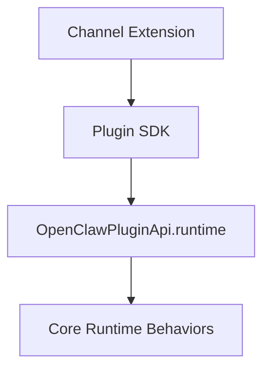
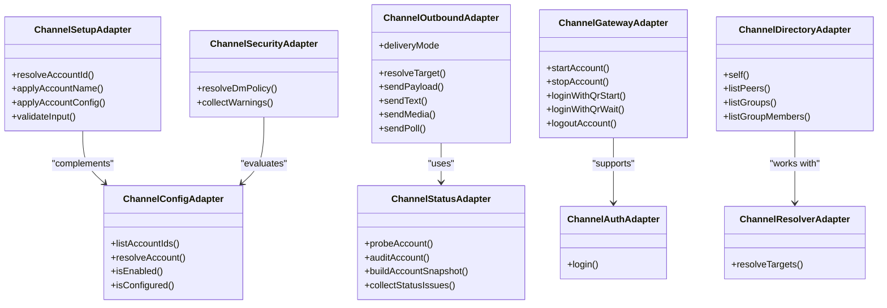
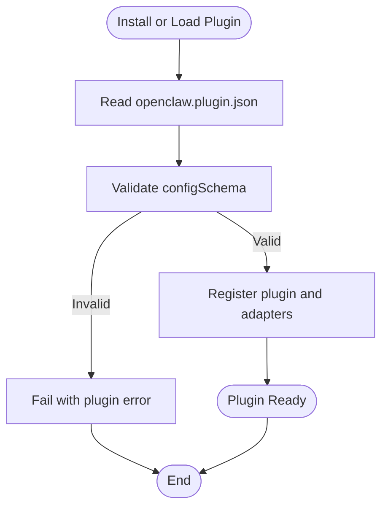
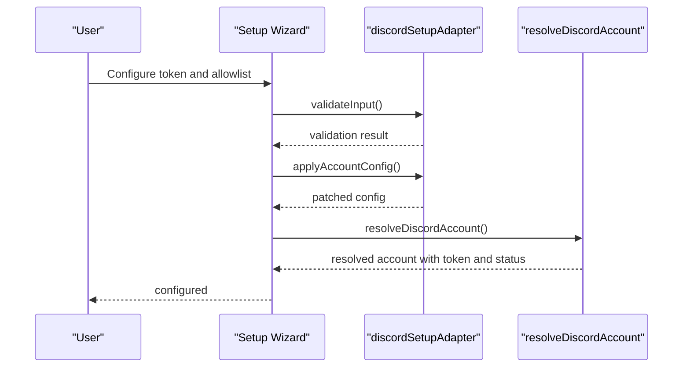
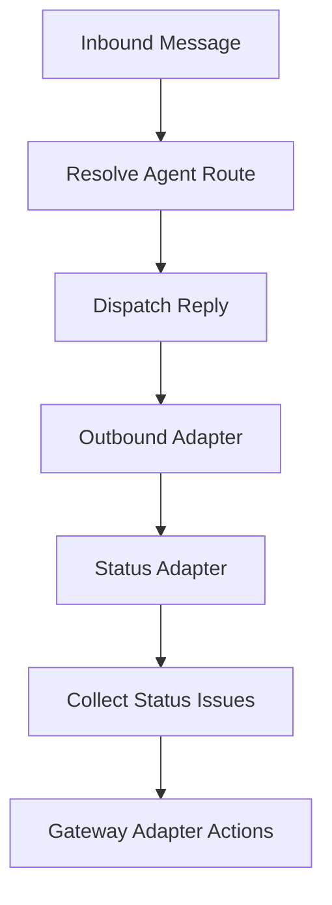
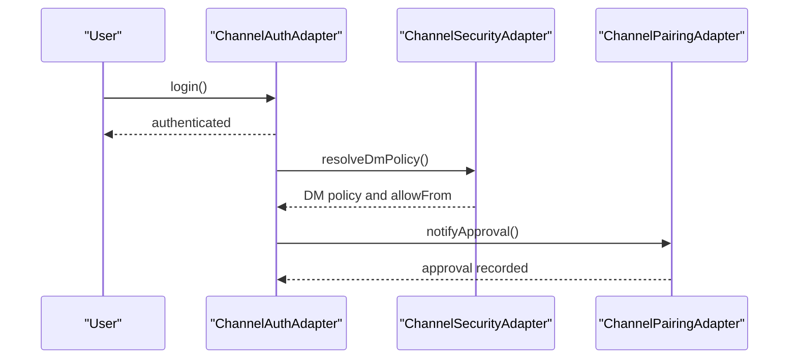
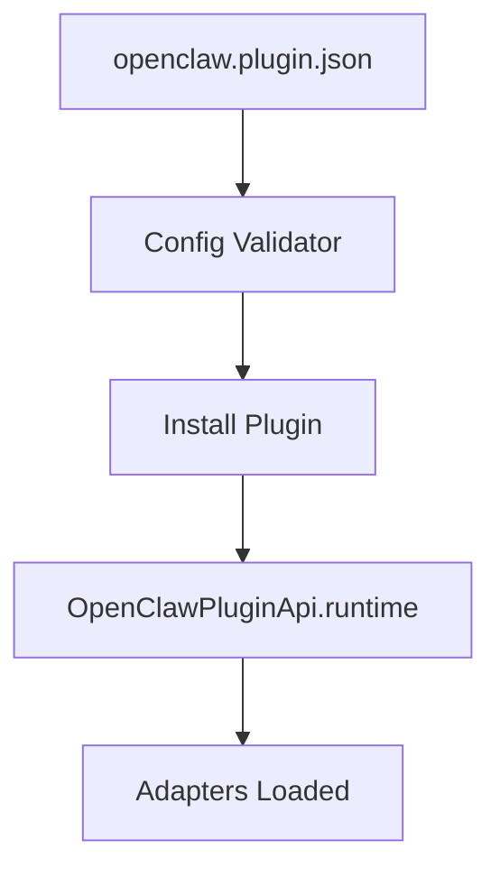
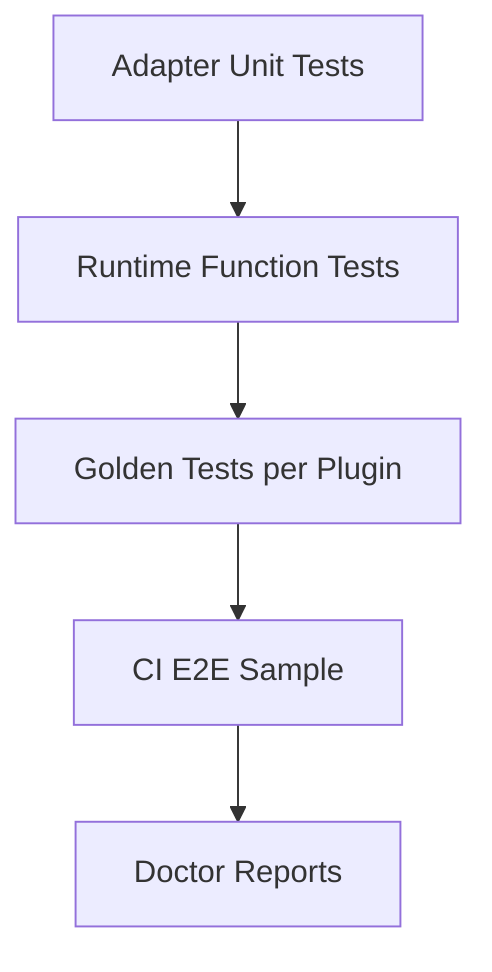
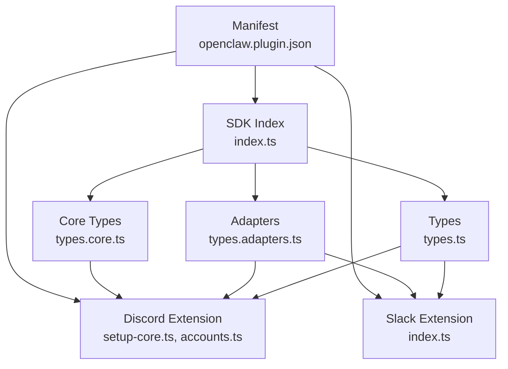

# Channel Development

<cite>
**Referenced Files in This Document**
- [index.ts](file://src/plugin-sdk/index.ts)
- [plugin-sdk.md](file://docs/refactor/plugin-sdk.md)
- [manifest.md](file://docs/plugins/manifest.md)
- [types.ts](file://src/channels/plugins/types.ts)
- [types.adapters.ts](file://src/channels/plugins/types.adapters.ts)
- [types.core.ts](file://src/channels/plugins/types.core.ts)
- [openclaw.plugin.json](file://extensions/discord/openclaw.plugin.json)
- [setup-core.ts](file://extensions/discord/src/setup-core.ts)
- [accounts.ts](file://extensions/discord/src/accounts.ts)
- [index.ts](file://extensions/slack/src/index.ts)
</cite>

## Table of Contents
1. [Introduction](#introduction)
2. [Project Structure](#project-structure)
3. [Core Components](#core-components)
4. [Architecture Overview](#architecture-overview)
5. [Detailed Component Analysis](#detailed-component-analysis)
6. [Dependency Analysis](#dependency-analysis)
7. [Performance Considerations](#performance-considerations)
8. [Troubleshooting Guide](#troubleshooting-guide)
9. [Conclusion](#conclusion)
10. [Appendices](#appendices)

## Introduction
This document explains how to develop custom channel adapters and extend OpenClaw’s platform support using the Plugin SDK. It covers the SDK architecture, channel adapter interfaces, plugin manifest requirements, configuration and dependency management, lifecycle and message handling, authentication, packaging and distribution, testing and debugging, and best practices. It also provides step-by-step tutorials for creating new channel adapters, integrating with external APIs, and handling platform-specific features.

## Project Structure
OpenClaw organizes channel development around:
- A stable Plugin SDK that exposes types, helpers, and configuration utilities without runtime state.
- Channel-specific extensions that implement adapters and integrate with external APIs.
- A plugin manifest (openclaw.plugin.json) for validation and discovery.

```mermaid
graph TB
subgraph "Plugin SDK"
SDK["SDK Exports<br/>index.ts"]
Types["Types and Helpers<br/>types.ts, types.adapters.ts, types.core.ts"]
end
subgraph "Channel Extensions"
Discord["Discord Extension<br/>setup-core.ts, accounts.ts"]
Slack["Slack Extension<br/>index.ts"]
end
subgraph "Manifest"
Manifest["openclaw.plugin.json"]
end
SDK --> Types
SDK --> Discord
SDK --> Slack
Manifest --> SDK
Manifest --> Discord
Manifest --> Slack
```

**Diagram sources**
- [index.ts:1-872](file://src/plugin-sdk/index.ts#L1-L872)
- [types.ts:1-68](file://src/channels/plugins/types.ts#L1-L68)
- [types.adapters.ts:1-386](file://src/channels/plugins/types.adapters.ts#L1-L386)
- [types.core.ts:1-410](file://src/channels/plugins/types.core.ts#L1-L410)
- [openclaw.plugin.json:1-10](file://extensions/discord/openclaw.plugin.json#L1-L10)
- [setup-core.ts:1-349](file://extensions/discord/src/setup-core.ts#L1-L349)
- [accounts.ts:1-93](file://extensions/discord/src/accounts.ts#L1-L93)
- [index.ts:1-26](file://extensions/slack/src/index.ts#L1-L26)

**Section sources**
- [index.ts:1-872](file://src/plugin-sdk/index.ts#L1-L872)
- [plugin-sdk.md:1-215](file://docs/refactor/plugin-sdk.md#L1-L215)

## Core Components
- Plugin SDK exports: Provides channel adapter types, runtime helpers, configuration utilities, and channel-specific helpers (e.g., Discord, Slack, Telegram).
- Channel adapter interfaces: Define capabilities for setup, configuration, outbound messaging, status, gateway lifecycle, authentication, directory, resolver, security, and message actions.
- Plugin manifest: Declares plugin identity, channels, providers, and a strict JSON Schema for configuration validation.

Key responsibilities:
- SDK: Stable, publishable API surface; no runtime state.
- Adapters: Implement platform-specific behavior while adhering to standardized interfaces.
- Manifest: Enables discovery, validation, and safe configuration.

**Section sources**
- [index.ts:1-872](file://src/plugin-sdk/index.ts#L1-L872)
- [types.adapters.ts:24-386](file://src/channels/plugins/types.adapters.ts#L24-L386)
- [types.core.ts:79-410](file://src/channels/plugins/types.core.ts#L79-L410)
- [manifest.md:1-100](file://docs/plugins/manifest.md#L1-L100)

## Architecture Overview
OpenClaw’s Plugin SDK defines a two-layer architecture:
- SDK layer: Types, helpers, and configuration utilities.
- Runtime layer: Accessible via OpenClawPluginApi.runtime, exposing core behaviors to adapters.



**Diagram sources**
- [plugin-sdk.md:40-145](file://docs/refactor/plugin-sdk.md#L40-L145)
- [index.ts:150-167](file://src/plugin-sdk/index.ts#L150-L167)

**Section sources**
- [plugin-sdk.md:1-215](file://docs/refactor/plugin-sdk.md#L1-L215)
- [index.ts:150-167](file://src/plugin-sdk/index.ts#L150-L167)

## Detailed Component Analysis

### Plugin SDK and Adapter Interfaces
The SDK aggregates channel adapter types and runtime helpers. Adapter interfaces define capabilities such as:
- Setup and configuration
- Outbound messaging and target resolution
- Status and probing
- Gateway lifecycle (start/stop, QR login/logout)
- Authentication
- Directory and resolver
- Security policies
- Message actions and tool sends



**Diagram sources**
- [types.adapters.ts:24-386](file://src/channels/plugins/types.adapters.ts#L24-L386)
- [types.core.ts:79-410](file://src/channels/plugins/types.core.ts#L79-L410)

**Section sources**
- [types.adapters.ts:24-386](file://src/channels/plugins/types.adapters.ts#L24-L386)
- [types.core.ts:79-410](file://src/channels/plugins/types.core.ts#L79-L410)

### Plugin Manifest and Metadata
Every native OpenClaw plugin must include a manifest (openclaw.plugin.json) in its root:
- Required: id, configSchema
- Optional: kind, channels, providers, providerAuthEnvVars, skills, name, description, uiHints, version

Validation occurs at config read/write time; unknown channels/providers or missing/disabled plugins produce errors or warnings.



**Diagram sources**
- [manifest.md:29-93](file://docs/plugins/manifest.md#L29-L93)

**Section sources**
- [manifest.md:1-100](file://docs/plugins/manifest.md#L1-L100)
- [openclaw.plugin.json:1-10](file://extensions/discord/openclaw.plugin.json#L1-L10)

### Channel Adapter Implementation Patterns
- Discord setup adapter demonstrates:
  - Account ID normalization
  - Applying account name and configuration
  - Validating inputs (e.g., requiring token or env usage)
  - Patching channel config for accounts
- Account resolution helpers:
  - Merge base and account-specific configs
  - Resolve token source and status
  - List enabled accounts



**Diagram sources**
- [setup-core.ts:74-138](file://extensions/discord/src/setup-core.ts#L74-L138)
- [accounts.ts:54-72](file://extensions/discord/src/accounts.ts#L54-L72)

**Section sources**
- [setup-core.ts:74-138](file://extensions/discord/src/setup-core.ts#L74-L138)
- [accounts.ts:54-72](file://extensions/discord/src/accounts.ts#L54-L72)

### Message Handling and Lifecycle Management
- Outbound adapter interface supports:
  - Target resolution
  - Payload/text/media sending
  - Poll creation
- Status adapter interface supports:
  - Probing and auditing
  - Building snapshots and collecting issues
- Gateway adapter interface supports:
  - Starting/stopping accounts
  - QR login/logout
  - Logout operations



**Diagram sources**
- [types.adapters.ts:110-168](file://src/channels/plugins/types.adapters.ts#L110-L168)
- [types.adapters.ts:277-291](file://src/channels/plugins/types.adapters.ts#L277-L291)

**Section sources**
- [types.adapters.ts:110-168](file://src/channels/plugins/types.adapters.ts#L110-L168)
- [types.adapters.ts:277-291](file://src/channels/plugins/types.adapters.ts#L277-L291)

### Authentication and Security
- Auth adapter enables login flows.
- Security adapter resolves DM policy and collects warnings.
- Pairing adapter manages allow-from entries and notifications.



**Diagram sources**
- [types.adapters.ts:293-301](file://src/channels/plugins/types.adapters.ts#L293-L301)
- [types.adapters.ts:380-385](file://src/channels/plugins/types.adapters.ts#L380-L385)
- [types.adapters.ts:267-275](file://src/channels/plugins/types.adapters.ts#L267-L275)

**Section sources**
- [types.adapters.ts:293-301](file://src/channels/plugins/types.adapters.ts#L293-L301)
- [types.adapters.ts:380-385](file://src/channels/plugins/types.adapters.ts#L380-L385)
- [types.adapters.ts:267-275](file://src/channels/plugins/types.adapters.ts#L267-L275)

### Plugin Packaging, Distribution, and Installation
- Manifest-driven discovery and validation.
- Strict JSON Schema validation at config read/write time.
- Optional providerAuthEnvVars for early auth resolution without loading runtime.
- Exclusive plugin kinds via plugins.slots.*.



**Diagram sources**
- [manifest.md:29-93](file://docs/plugins/manifest.md#L29-L93)

**Section sources**
- [manifest.md:1-100](file://docs/plugins/manifest.md#L1-L100)

### Testing Strategies and Debugging
- Adapter-level unit tests exercising runtime functions with real core behavior.
- Golden tests per plugin to prevent behavior drift.
- End-to-end plugin sample in CI covering install, run, and smoke tests.



**Diagram sources**
- [plugin-sdk.md:194-199](file://docs/refactor/plugin-sdk.md#L194-L199)

**Section sources**
- [plugin-sdk.md:194-199](file://docs/refactor/plugin-sdk.md#L194-L199)

### Step-by-Step Tutorial: Creating a New Channel Adapter

1. Define plugin metadata
- Create openclaw.plugin.json with id, channels, and configSchema.
- Reference: [manifest.md:36-73](file://docs/plugins/manifest.md#L36-L73), [openclaw.plugin.json:1-10](file://extensions/discord/openclaw.plugin.json#L1-L10)

2. Export SDK types and helpers
- Import and re-export SDK types and helpers from src/plugin-sdk/index.ts.
- Reference: [index.ts:1-872](file://src/plugin-sdk/index.ts#L1-L872)

3. Implement setup adapter
- Normalize account IDs, apply account name/config, validate inputs, and patch channel config.
- Reference: [setup-core.ts:74-138](file://extensions/discord/src/setup-core.ts#L74-L138)

4. Implement account resolution
- Merge base and account-specific configs, resolve token source/status, and list enabled accounts.
- Reference: [accounts.ts:54-92](file://extensions/discord/src/accounts.ts#L54-L92)

5. Implement outbound adapter
- Resolve targets, send payload/text/media, and create polls.
- Reference: [types.adapters.ts:110-127](file://src/channels/plugins/types.adapters.ts#L110-L127)

6. Implement status and gateway adapters
- Probe accounts, audit, build snapshots, and manage lifecycle (start/stop, QR login/logout).
- Reference: [types.adapters.ts:129-168](file://src/channels/plugins/types.adapters.ts#L129-L168), [types.adapters.ts:277-291](file://src/channels/plugins/types.adapters.ts#L277-L291)

7. Integrate with external APIs
- Use SDK runtime helpers for text chunking, reply dispatching, media handling, and session binding.
- Reference: [index.ts:172-242](file://src/plugin-sdk/index.ts#L172-L242)

8. Validate and distribute
- Ensure manifest is present and configSchema is valid; publish or install locally.
- Reference: [manifest.md:29-93](file://docs/plugins/manifest.md#L29-L93)

**Section sources**
- [manifest.md:29-93](file://docs/plugins/manifest.md#L29-L93)
- [openclaw.plugin.json:1-10](file://extensions/discord/openclaw.plugin.json#L1-L10)
- [index.ts:1-872](file://src/plugin-sdk/index.ts#L1-L872)
- [setup-core.ts:74-138](file://extensions/discord/src/setup-core.ts#L74-L138)
- [accounts.ts:54-92](file://extensions/discord/src/accounts.ts#L54-L92)
- [types.adapters.ts:110-127](file://src/channels/plugins/types.adapters.ts#L110-L127)
- [types.adapters.ts:129-168](file://src/channels/plugins/types.adapters.ts#L129-L168)
- [types.adapters.ts:277-291](file://src/channels/plugins/types.adapters.ts#L277-L291)

### Channel-Specific Development Patterns
- Discord: Use setup wizard helpers, guild/channel allowlists, and token resolution.
- Slack: Export actions and tokens; integrate message actions and threading tool context.
- Reference: [setup-core.ts:140-348](file://extensions/discord/src/setup-core.ts#L140-L348), [index.ts:1-26](file://extensions/slack/src/index.ts#L1-L26)

**Section sources**
- [setup-core.ts:140-348](file://extensions/discord/src/setup-core.ts#L140-L348)
- [index.ts:1-26](file://extensions/slack/src/index.ts#L1-L26)

### Error Handling and Performance Optimization
- Use SDK runtime helpers for:
  - Text chunking and markdown processing
  - Reply dispatching with buffered block dispatcher
  - Media fetching and saving
  - Debouncing inbound events
- Apply rate limiting and anomaly tracking for webhooks.
- Reference: [index.ts:172-242](file://src/plugin-sdk/index.ts#L172-L242), [index.ts:487-491](file://src/plugin-sdk/index.ts#L487-L491)

**Section sources**
- [index.ts:172-242](file://src/plugin-sdk/index.ts#L172-L242)
- [index.ts:487-491](file://src/plugin-sdk/index.ts#L487-L491)

## Dependency Analysis
- SDK exports aggregate types and helpers used by channel extensions.
- Channel extensions depend on SDK for adapter interfaces and runtime helpers.
- Manifest ensures discovery and validation before runtime.



**Diagram sources**
- [index.ts:1-872](file://src/plugin-sdk/index.ts#L1-L872)
- [types.ts:1-68](file://src/channels/plugins/types.ts#L1-L68)
- [types.adapters.ts:1-386](file://src/channels/plugins/types.adapters.ts#L1-L386)
- [types.core.ts:1-410](file://src/channels/plugins/types.core.ts#L1-L410)
- [setup-core.ts:1-349](file://extensions/discord/src/setup-core.ts#L1-L349)
- [accounts.ts:1-93](file://extensions/discord/src/accounts.ts#L1-L93)
- [index.ts:1-26](file://extensions/slack/src/index.ts#L1-L26)
- [openclaw.plugin.json:1-10](file://extensions/discord/openclaw.plugin.json#L1-L10)

**Section sources**
- [index.ts:1-872](file://src/plugin-sdk/index.ts#L1-L872)
- [types.ts:1-68](file://src/channels/plugins/types.ts#L1-L68)
- [types.adapters.ts:1-386](file://src/channels/plugins/types.adapters.ts#L1-L386)
- [types.core.ts:1-410](file://src/channels/plugins/types.core.ts#L1-L410)
- [setup-core.ts:1-349](file://extensions/discord/src/setup-core.ts#L1-L349)
- [accounts.ts:1-93](file://extensions/discord/src/accounts.ts#L1-L93)
- [index.ts:1-26](file://extensions/slack/src/index.ts#L1-L26)
- [openclaw.plugin.json:1-10](file://extensions/discord/openclaw.plugin.json#L1-L10)

## Performance Considerations
- Prefer SDK-provided text chunking and markdown processing to maintain consistent limits across channels.
- Use reply dispatchers with buffered block dispatching to optimize throughput.
- Apply rate limiting and anomaly tracking for webhook-heavy channels.
- Cache resolved targets and allowlists where appropriate.

[No sources needed since this section provides general guidance]

## Troubleshooting Guide
- Manifest validation failures: Ensure id and configSchema are present and valid; unknown channels/providers cause errors.
- Missing runtime access: Verify adapters use OpenClawPluginApi.runtime for core behaviors.
- Status issues: Use status adapters to probe, audit, and collect issues; review collected status issues.
- Pairing and allow-from: Confirm pairing adapter notifications and allow-from normalization.

**Section sources**
- [manifest.md:74-93](file://docs/plugins/manifest.md#L74-L93)
- [types.adapters.ts:129-168](file://src/channels/plugins/types.adapters.ts#L129-L168)
- [types.adapters.ts:267-275](file://src/channels/plugins/types.adapters.ts#L267-L275)

## Conclusion
OpenClaw’s Plugin SDK provides a stable, publishable surface for building channel adapters. By implementing standardized adapter interfaces, validating configuration via manifests, and leveraging SDK runtime helpers, developers can extend platform support reliably. The documented patterns, testing strategies, and troubleshooting guidance enable efficient development and maintenance of custom channel adapters.

[No sources needed since this section summarizes without analyzing specific files]

## Appendices

### Best Practices
- Keep SDK usage minimal and stable; avoid importing core modules directly.
- Use manifest-driven validation to prevent misconfiguration.
- Implement adapter interfaces consistently across channels.
- Test with adapter-level unit tests, golden tests, and CI E2E samples.

**Section sources**
- [plugin-sdk.md:11-12](file://docs/refactor/plugin-sdk.md#L11-L12)
- [plugin-sdk.md:194-199](file://docs/refactor/plugin-sdk.md#L194-L199)