# Channel Integration

<cite>
**Referenced Files in This Document**
- [docs/channels/index.md](file://docs/channels/index.md)
- [src/channels/registry.ts](file://src/channels/registry.ts)
- [src/channels/plugins/types.ts](file://src/channels/plugins/types.ts)
- [src/channels/plugins/types.core.ts](file://src/channels/plugins/types.core.ts)
- [src/channels/plugins/types.adapters.ts](file://src/channels/plugins/types.adapters.ts)
- [src/channels/plugins/catalog.ts](file://src/channels/plugins/catalog.ts)
- [src/channels/plugins/config-schema.ts](file://src/channels/plugins/config-schema.ts)
- [src/channels/plugins/setup-wizard.ts](file://src/channels/plugins/setup-wizard.ts)
- [src/channels/plugins/media-limits.ts](file://src/channels/plugins/media-limits.ts)
- [extensions/whatsapp/index.ts](file://extensions/whatsapp/index.ts)
- [extensions/telegram/index.ts](file://extensions/telegram/index.ts)
- [extensions/discord/index.ts](file://extensions/discord/index.ts)
- [extensions/signal/index.ts](file://extensions/signal/index.ts)
</cite>

## Table of Contents
1. [Introduction](#introduction)
2. [Project Structure](#project-structure)
3. [Core Components](#core-components)
4. [Architecture Overview](#architecture-overview)
5. [Detailed Component Analysis](#detailed-component-analysis)
6. [Dependency Analysis](#dependency-analysis)
7. [Performance Considerations](#performance-considerations)
8. [Troubleshooting Guide](#troubleshooting-guide)
9. [Conclusion](#conclusion)
10. [Appendices](#appendices)

## Introduction
This document explains OpenClaw’s channel integration architecture and operational model. It covers how channels are registered, configured, and operated across 20+ supported platforms. It also documents the channel adapter interfaces, configuration patterns, and platform-specific capabilities such as group routing, mention gating, reply tagging, and per-channel chunking. Practical examples outline setup procedures, configuration options, and troubleshooting for major channels including WhatsApp, Telegram, Discord, Slack, Google Chat, Signal, iMessage, and others.

## Project Structure
OpenClaw organizes channel integration around a plugin-based adapter architecture:
- Central registry defines supported channels and their metadata.
- Channel adapters implement standardized interfaces for setup, configuration, authentication, outbound messaging, directory, and status.
- A catalog system discovers and exposes channel plugins (bundled and external).
- A setup wizard coordinates credential collection, allowlists, and group access policies.
- Shared utilities handle media limits and configuration schemas.

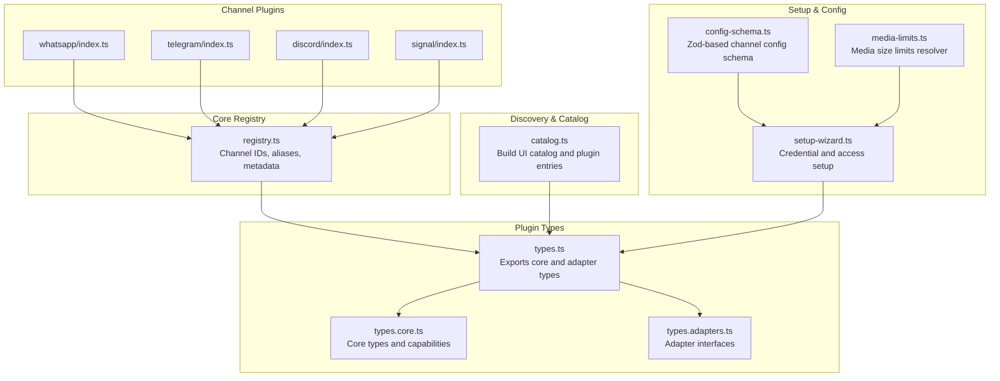

**Diagram sources**
- [src/channels/registry.ts:1-201](file://src/channels/registry.ts#L1-L201)
- [src/channels/plugins/types.ts:1-68](file://src/channels/plugins/types.ts#L1-L68)
- [src/channels/plugins/types.core.ts:1-410](file://src/channels/plugins/types.core.ts#L1-L410)
- [src/channels/plugins/types.adapters.ts:1-386](file://src/channels/plugins/types.adapters.ts#L1-L386)
- [src/channels/plugins/catalog.ts:1-346](file://src/channels/plugins/catalog.ts#L1-L346)
- [src/channels/plugins/setup-wizard.ts:1-871](file://src/channels/plugins/setup-wizard.ts#L1-L871)
- [src/channels/plugins/config-schema.ts:1-55](file://src/channels/plugins/config-schema.ts#L1-L55)
- [src/channels/plugins/media-limits.ts:1-26](file://src/channels/plugins/media-limits.ts#L1-L26)
- [extensions/whatsapp/index.ts:1-18](file://extensions/whatsapp/index.ts#L1-L18)
- [extensions/telegram/index.ts:1-18](file://extensions/telegram/index.ts#L1-L18)
- [extensions/discord/index.ts:1-23](file://extensions/discord/index.ts#L1-L23)
- [extensions/signal/index.ts:1-18](file://extensions/signal/index.ts#L1-L18)

**Section sources**
- [docs/channels/index.md:1-48](file://docs/channels/index.md#L1-L48)
- [src/channels/registry.ts:1-201](file://src/channels/registry.ts#L1-L201)
- [src/channels/plugins/types.ts:1-68](file://src/channels/plugins/types.ts#L1-L68)
- [src/channels/plugins/types.core.ts:1-410](file://src/channels/plugins/types.core.ts#L1-L410)
- [src/channels/plugins/types.adapters.ts:1-386](file://src/channels/plugins/types.adapters.ts#L1-L386)
- [src/channels/plugins/catalog.ts:1-346](file://src/channels/plugins/catalog.ts#L1-L346)
- [src/channels/plugins/setup-wizard.ts:1-871](file://src/channels/plugins/setup-wizard.ts#L1-L871)
- [src/channels/plugins/config-schema.ts:1-55](file://src/channels/plugins/config-schema.ts#L1-L55)
- [src/channels/plugins/media-limits.ts:1-26](file://src/channels/plugins/media-limits.ts#L1-L26)
- [extensions/whatsapp/index.ts:1-18](file://extensions/whatsapp/index.ts#L1-L18)
- [extensions/telegram/index.ts:1-18](file://extensions/telegram/index.ts#L1-L18)
- [extensions/discord/index.ts:1-23](file://extensions/discord/index.ts#L1-L23)
- [extensions/signal/index.ts:1-18](file://extensions/signal/index.ts#L1-L18)

## Core Components
- Channel registry and metadata: Defines canonical channel IDs, aliases, and selection metadata used across the UI and setup.
- Adapter interfaces: Standardized contracts for setup, configuration, authentication, outbound messaging, directory, threading, and status.
- Plugin catalog: Discovers channel plugins (bundled and external) and builds a UI catalog.
- Setup wizard: Guides users through credential capture, environment shortcuts, allowlists, and group access policies.
- Configuration schema: Provides Zod-based schemas for channel configs and nested DM policies.
- Media limits: Centralized resolver for media size limits across channels.

**Section sources**
- [src/channels/registry.ts:27-121](file://src/channels/registry.ts#L27-L121)
- [src/channels/plugins/types.adapters.ts:24-386](file://src/channels/plugins/types.adapters.ts#L24-L386)
- [src/channels/plugins/catalog.ts:266-346](file://src/channels/plugins/catalog.ts#L266-L346)
- [src/channels/plugins/setup-wizard.ts:247-277](file://src/channels/plugins/setup-wizard.ts#L247-L277)
- [src/channels/plugins/config-schema.ts:16-54](file://src/channels/plugins/config-schema.ts#L16-L54)
- [src/channels/plugins/media-limits.ts:6-25](file://src/channels/plugins/media-limits.ts#L6-L25)

## Architecture Overview
OpenClaw’s channel integration is plugin-driven. Each channel plugin registers a ChannelPlugin that implements one or more adapters. The registry and catalog expose channel metadata and discovery. The setup wizard coordinates configuration and security policies.

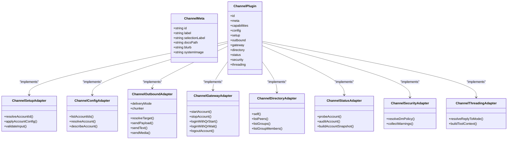

**Diagram sources**
- [src/channels/plugins/types.core.ts:79-162](file://src/channels/plugins/types.core.ts#L79-L162)
- [src/channels/plugins/types.adapters.ts:24-386](file://src/channels/plugins/types.adapters.ts#L24-L386)
- [src/channels/plugins/types.ts:9-68](file://src/channels/plugins/types.ts#L9-L68)

## Detailed Component Analysis

### Channel Registry and Metadata
- Maintains the canonical ordering and aliases for core channels.
- Exposes helpers to normalize channel IDs and format selection lines for UI.

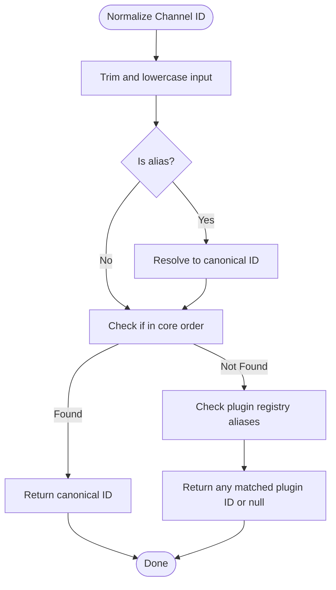

**Diagram sources**
- [src/channels/registry.ts:147-183](file://src/channels/registry.ts#L147-L183)

**Section sources**
- [src/channels/registry.ts:7-17](file://src/channels/registry.ts#L7-L17)
- [src/channels/registry.ts:123-128](file://src/channels/registry.ts#L123-L128)
- [src/channels/registry.ts:147-183](file://src/channels/registry.ts#L147-L183)

### Adapter Interfaces and Capabilities
- Core types define capabilities such as chat types, reactions, editing, unsend, reply, effects, group management, threads, media, native commands, and streaming blocking.
- Outbound adapter supports chunking, target resolution, and delivery modes (direct/gateway/hybrid).
- Threading adapter supports reply-to modes and tool context building.
- Security adapter resolves DM policy and collects warnings.

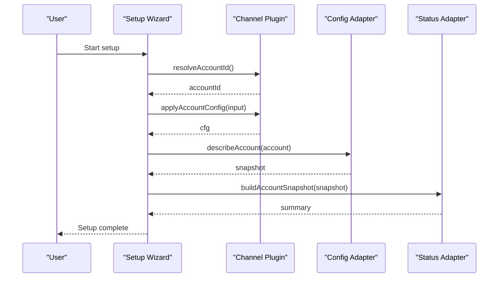

**Diagram sources**
- [src/channels/plugins/setup-wizard.ts:402-450](file://src/channels/plugins/setup-wizard.ts#L402-L450)
- [src/channels/plugins/types.adapters.ts:52-81](file://src/channels/plugins/types.adapters.ts#L52-L81)
- [src/channels/plugins/types.adapters.ts:129-168](file://src/channels/plugins/types.adapters.ts#L129-L168)

**Section sources**
- [src/channels/plugins/types.core.ts:184-197](file://src/channels/plugins/types.core.ts#L184-L197)
- [src/channels/plugins/types.adapters.ts:110-127](file://src/channels/plugins/types.adapters.ts#L110-L127)
- [src/channels/plugins/types.adapters.ts:240-263](file://src/channels/plugins/types.adapters.ts#L240-L263)
- [src/channels/plugins/types.adapters.ts:380-385](file://src/channels/plugins/types.adapters.ts#L380-L385)

### Plugin Catalog and Discovery
- Builds a UI catalog from plugin manifests and external catalogs.
- Supports prioritization by origin (config/workspace/global/bundled) and deduplication.

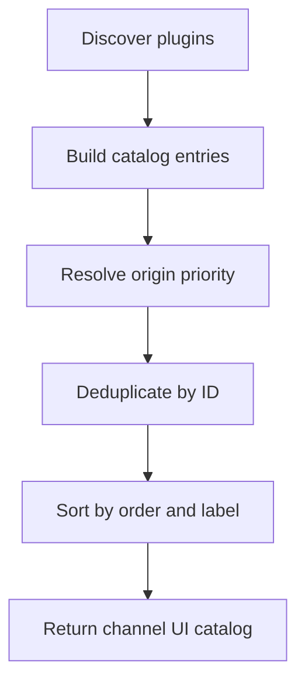

**Diagram sources**
- [src/channels/plugins/catalog.ts:294-346](file://src/channels/plugins/catalog.ts#L294-L346)

**Section sources**
- [src/channels/plugins/catalog.ts:266-292](file://src/channels/plugins/catalog.ts#L266-L292)
- [src/channels/plugins/catalog.ts:294-346](file://src/channels/plugins/catalog.ts#L294-L346)

### Setup Wizard and Configuration Patterns
- Coordinates credential steps, environment shortcuts, text inputs, group access, and allowlists.
- Uses Zod-based schemas for validation and JSON Schema export for UI.

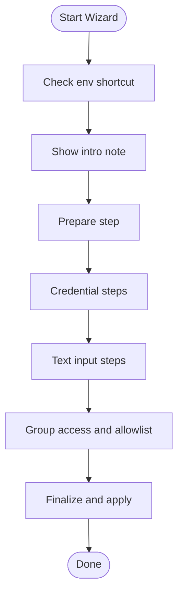

**Diagram sources**
- [src/channels/plugins/setup-wizard.ts:402-800](file://src/channels/plugins/setup-wizard.ts#L402-L800)
- [src/channels/plugins/config-schema.ts:35-54](file://src/channels/plugins/config-schema.ts#L35-L54)

**Section sources**
- [src/channels/plugins/setup-wizard.ts:247-277](file://src/channels/plugins/setup-wizard.ts#L247-L277)
- [src/channels/plugins/config-schema.ts:16-54](file://src/channels/plugins/config-schema.ts#L16-L54)

### Media Limits and Chunking
- Media size limits are resolved per account and channel, falling back to agent defaults.
- Outbound adapter supports chunking and per-channel text limits.

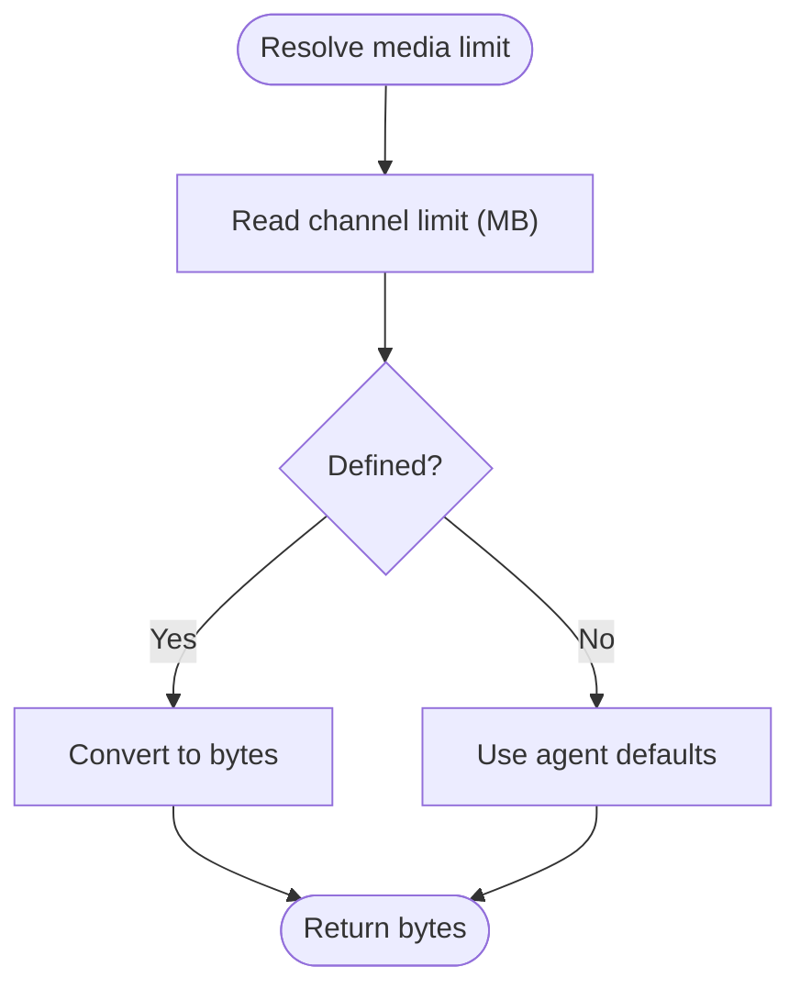

**Diagram sources**
- [src/channels/plugins/media-limits.ts:6-25](file://src/channels/plugins/media-limits.ts#L6-L25)
- [src/channels/plugins/types.adapters.ts:112-115](file://src/channels/plugins/types.adapters.ts#L112-L115)

**Section sources**
- [src/channels/plugins/media-limits.ts:6-25](file://src/channels/plugins/media-limits.ts#L6-L25)
- [src/channels/plugins/types.adapters.ts:110-127](file://src/channels/plugins/types.adapters.ts#L110-L127)

### Platform-Specific Examples

#### WhatsApp
- Uses QR pairing and requires a separate phone/eSIM for best results.
- Registers the plugin and sets runtime context.

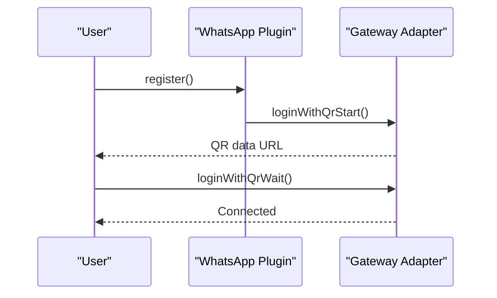

**Diagram sources**
- [extensions/whatsapp/index.ts:11-14](file://extensions/whatsapp/index.ts#L11-L14)
- [src/channels/plugins/types.adapters.ts:280-290](file://src/channels/plugins/types.adapters.ts#L280-L290)

**Section sources**
- [extensions/whatsapp/index.ts:1-18](file://extensions/whatsapp/index.ts#L1-L18)
- [docs/channels/index.md:35-35](file://docs/channels/index.md#L35-L35)

#### Telegram
- Bot API via grammY; supports groups and media.
- Registers the plugin and sets runtime context.

**Section sources**
- [extensions/telegram/index.ts:1-18](file://extensions/telegram/index.ts#L1-L18)
- [docs/channels/index.md:31-31](file://docs/channels/index.md#L31-L31)

#### Discord
- Bot API + Gateway; supports servers, channels, and DMs.
- Registers the plugin and conditionally registers subagent hooks.

**Section sources**
- [extensions/discord/index.ts:1-23](file://extensions/discord/index.ts#L1-L23)
- [docs/channels/index.md:17-17](file://docs/channels/index.md#L17-L17)

#### Signal
- signal-cli; privacy-focused with linked device requirements.
- Registers the plugin and sets runtime context.

**Section sources**
- [extensions/signal/index.ts:1-18](file://extensions/signal/index.ts#L1-L18)
- [docs/channels/index.md:28-28](file://docs/channels/index.md#L28-L28)

#### Slack, Google Chat, iMessage, IRC, LINE, Matrix, Mattermost, Microsoft Teams, Nextcloud Talk, Nostr, Twitch, WebChat, Zalo, Zalo Personal
- Listed in the channels index with platform-specific notes and links to dedicated documentation.

**Section sources**
- [docs/channels/index.md:14-48](file://docs/channels/index.md#L14-L48)

### Group Routing, Mention Gating, Reply Tags, and Per-Channel Chunking
- Group routing and mention gating are handled via group policy resolution and optional require-mention rules.
- Reply tags and threading modes are controlled by the threading adapter; reply-to modes can be off/first/all with explicit tag allowances.
- Outbound chunking is configurable per channel via the outbound adapter’s chunker and limits.

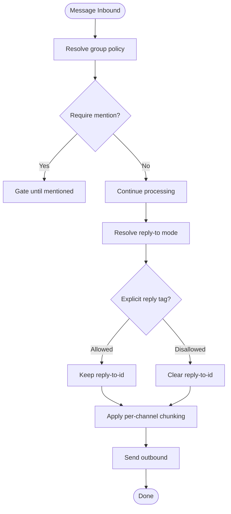

**Diagram sources**
- [src/channels/plugins/types.adapters.ts:83-87](file://src/channels/plugins/types.adapters.ts#L83-L87)
- [src/channels/plugins/types.adapters.ts:240-263](file://src/channels/plugins/types.adapters.ts#L240-L263)
- [src/channels/plugins/types.adapters.ts:112-115](file://src/channels/plugins/types.adapters.ts#L112-L115)

**Section sources**
- [src/channels/plugins/types.adapters.ts:83-87](file://src/channels/plugins/types.adapters.ts#L83-L87)
- [src/channels/plugins/types.adapters.ts:240-263](file://src/channels/plugins/types.adapters.ts#L240-L263)
- [src/channels/plugins/types.adapters.ts:110-127](file://src/channels/plugins/types.adapters.ts#L110-L127)

### Platform-Specific Capabilities: Media Handling, Voice, Integrations
- Media handling: Outbound adapter supports media sending and optional document mode to avoid compression on certain platforms.
- Voice: Not explicitly defined in the referenced files; consult platform-specific documentation for voice capabilities.
- Integrations: Directory adapters enable listing peers, groups, and members; security adapters manage DM policies and warnings.

**Section sources**
- [src/channels/plugins/types.adapters.ts:96-104](file://src/channels/plugins/types.adapters.ts#L96-L104)
- [src/channels/plugins/types.adapters.ts:337-346](file://src/channels/plugins/types.adapters.ts#L337-L346)
- [src/channels/plugins/types.adapters.ts:380-385](file://src/channels/plugins/types.adapters.ts#L380-L385)

### Developing Custom Channel Adapters and Extending Platform Support
- Implement a ChannelPlugin with required adapters (setup, config, outbound, gateway, directory, status, security, threading).
- Register the plugin in its entrypoint and ensure the plugin ID matches the channel manifest.
- Use the setup wizard to collect credentials and enforce allowlists.
- Export a Zod-based config schema for validation and UI rendering.

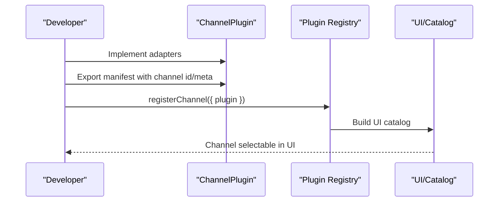

**Diagram sources**
- [src/channels/plugins/catalog.ts:216-256](file://src/channels/plugins/catalog.ts#L216-L256)
- [src/channels/plugins/types.adapters.ts:277-291](file://src/channels/plugins/types.adapters.ts#L277-L291)

**Section sources**
- [src/channels/plugins/catalog.ts:216-256](file://src/channels/plugins/catalog.ts#L216-L256)
- [src/channels/plugins/types.adapters.ts:277-291](file://src/channels/plugins/types.adapters.ts#L277-L291)

## Dependency Analysis
- The registry depends on the plugin registry to resolve aliases for any channel, including external ones.
- The setup wizard depends on plugin-provided setup adapters and config adapters.
- The catalog depends on plugin manifests and external catalog files.

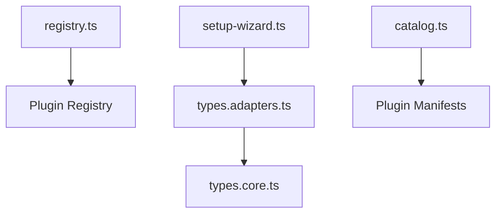

**Diagram sources**
- [src/channels/registry.ts:172-183](file://src/channels/registry.ts#L172-L183)
- [src/channels/plugins/setup-wizard.ts:1-20](file://src/channels/plugins/setup-wizard.ts#L1-L20)
- [src/channels/plugins/types.adapters.ts:1-22](file://src/channels/plugins/types.adapters.ts#L1-L22)
- [src/channels/plugins/types.core.ts:1-11](file://src/channels/plugins/types.core.ts#L1-L11)
- [src/channels/plugins/catalog.ts:1-10](file://src/channels/plugins/catalog.ts#L1-L10)

**Section sources**
- [src/channels/registry.ts:172-183](file://src/channels/registry.ts#L172-L183)
- [src/channels/plugins/catalog.ts:110-127](file://src/channels/plugins/catalog.ts#L110-L127)

## Performance Considerations
- Prefer direct delivery mode when available to reduce latency.
- Use chunking to respect platform limits and improve reliability.
- Limit media sizes using the centralized resolver to avoid failures.
- Minimize outbound polling and leverage gateway-based transports where supported.

## Troubleshooting Guide
- Verify channel metadata and aliases in the registry.
- Confirm plugin registration and manifest alignment.
- Review setup wizard status and collected credentials.
- Inspect status adapter snapshots and issues.
- Check security adapter DM policy and warnings.

**Section sources**
- [src/channels/registry.ts:147-183](file://src/channels/registry.ts#L147-L183)
- [src/channels/plugins/catalog.ts:216-256](file://src/channels/plugins/catalog.ts#L216-L256)
- [src/channels/plugins/setup-wizard.ts:281-310](file://src/channels/plugins/setup-wizard.ts#L281-L310)
- [src/channels/plugins/types.adapters.ts:129-168](file://src/channels/plugins/types.adapters.ts#L129-L168)
- [src/channels/plugins/types.adapters.ts:380-385](file://src/channels/plugins/types.adapters.ts#L380-L385)

## Conclusion
OpenClaw’s channel integration is built on a robust, plugin-driven architecture with standardized adapters, a comprehensive setup wizard, and a flexible catalog system. This enables rapid addition of new channels while maintaining consistent configuration, security, and operational behavior across platforms.

## Appendices
- For platform-specific setup guides and troubleshooting, refer to the channels index and individual platform docs referenced therein.

**Section sources**
- [docs/channels/index.md:14-48](file://docs/channels/index.md#L14-L48)