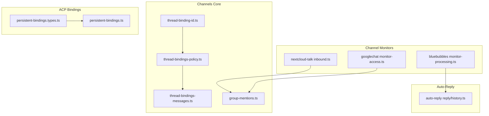
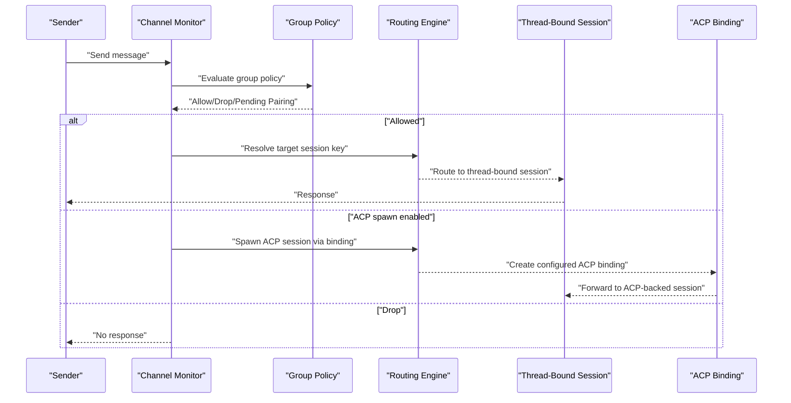
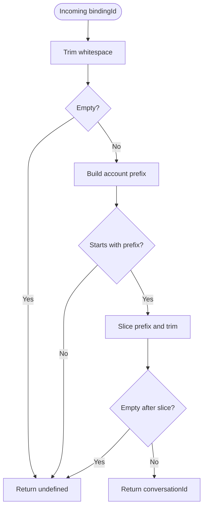
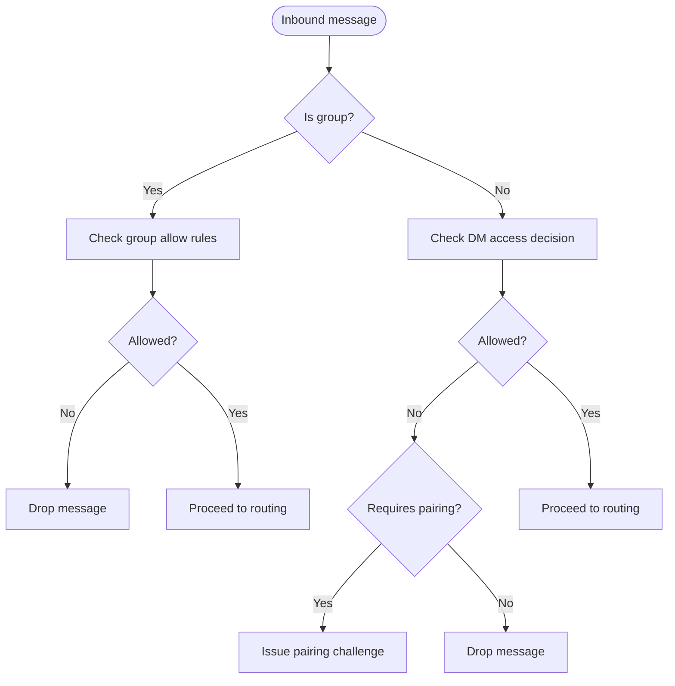
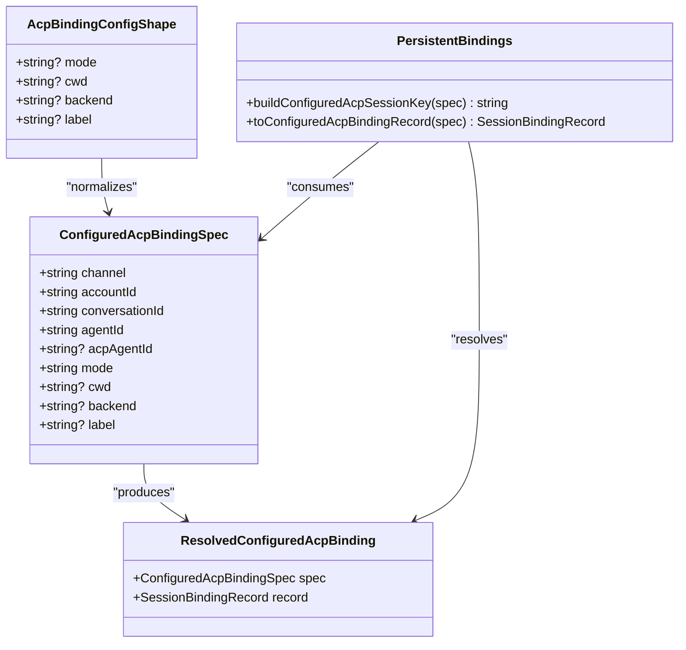
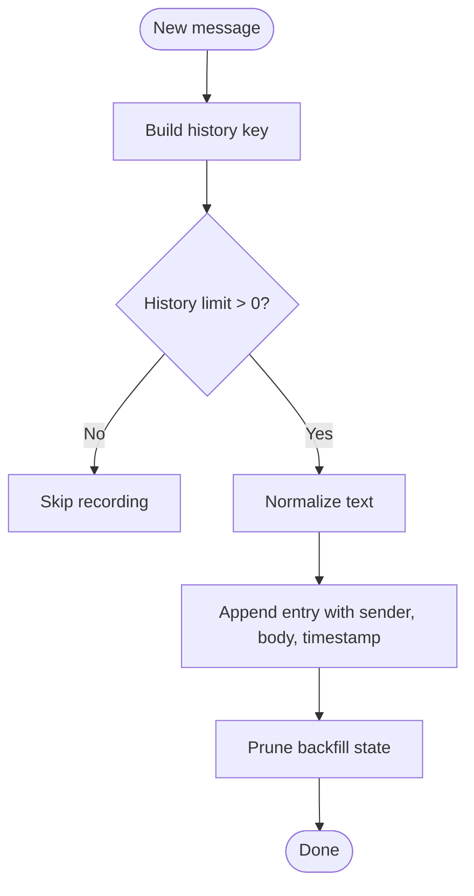
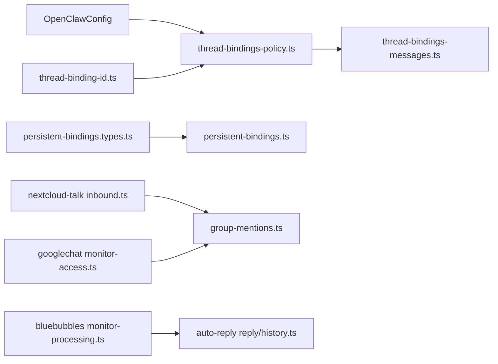

# Group and Thread Management

<cite>
**Referenced Files in This Document**
- [thread-binding-id.ts](file://src/channels/thread-binding-id.ts)
- [thread-bindings-policy.ts](file://src/channels/thread-bindings-policy.ts)
- [thread-bindings-messages.ts](file://src/channels/thread-bindings-messages.ts)
- [persistent-bindings.types.ts](file://src/acp/persistent-bindings.types.ts)
- [persistent-bindings.ts](file://src/acp/persistent-bindings.ts)
- [inbound.ts](file://extensions/nextcloud-talk/src/inbound.ts)
- [monitor-access.ts](file://extensions/googlechat/src/monitor-access.ts)
- [history.ts](file://src/auto-reply/reply/history.ts)
- [monitor-processing.ts](file://extensions/bluebubbles/src/monitor-processing.ts)
- [provider.group-policy.test.ts](file://extensions/discord/src/monitor/provider.group-policy.test.ts)
- [provider.group-policy.test.ts](file://extensions/imessage/src/monitor/provider.group-policy.test.ts)
- [provider.group-policy.test.ts](file://extensions/slack/src/monitor/provider.group-policy.test.ts)
- [group-mentions.ts](file://extensions/mattermost/src/group-mentions.ts)
- [group-mentions.ts](file://extensions/matrix/src/group-mentions.ts)
- [group-mentions.ts](file://src/channels/plugins/group-mentions.ts)
- [method-scopes.ts](file://src/gateway/method-scopes.ts)
- [conversation-binding.test.ts](file://src/plugins/conversation-binding.test.ts)
</cite>

## Table of Contents
1. [Introduction](#introduction)
2. [Project Structure](#project-structure)
3. [Core Components](#core-components)
4. [Architecture Overview](#architecture-overview)
5. [Detailed Component Analysis](#detailed-component-analysis)
6. [Dependency Analysis](#dependency-analysis)
7. [Performance Considerations](#performance-considerations)
8. [Troubleshooting Guide](#troubleshooting-guide)
9. [Conclusion](#conclusion)
10. [Appendices](#appendices)

## Introduction
This document explains OpenClaw’s group and thread management capabilities with a focus on conversation organization and routing. It covers:
- Group policy configuration and enforcement across channels
- Thread binding mechanisms for persistent routing
- Conversation routing and session spawning
- Group message handling, participant management, and role-based access control
- Thread-specific features, message threading, and conversation history management
- Group creation, member invitation, and administrative controls
- Group-specific settings, notification preferences, and privacy controls
- Thread migration, conversation archiving, and historical message retrieval
- Practical examples and troubleshooting guidance for group setup and advanced threading

## Project Structure
OpenClaw organizes group and thread features across core channels utilities, ACP persistent bindings, and channel-specific monitors and policies. The most relevant areas include:
- Channels utilities for thread binding resolution and lifecycle messaging
- ACP persistent bindings for configured, long-lived sessions
- Channel monitors for group policy enforcement and access gating
- Auto-reply history utilities for group context and retention
- Group mentions utilities for cross-channel group awareness

**Diagram sources**
- [thread-binding-id.ts:1-16](file://src/channels/thread-binding-id.ts#L1-L16)
- [thread-bindings-policy.ts:1-202](file://src/channels/thread-bindings-policy.ts#L1-L202)
- [thread-bindings-messages.ts:1-114](file://src/channels/thread-bindings-messages.ts#L1-L114)
- [persistent-bindings.types.ts:1-106](file://src/acp/persistent-bindings.types.ts#L1-L106)
- [persistent-bindings.ts:1-20](file://src/acp/persistent-bindings.ts#L1-L20)
- [inbound.ts:158-194](file://extensions/nextcloud-talk/src/inbound.ts#L158-L194)
- [monitor-access.ts:131-173](file://extensions/googlechat/src/monitor-access.ts#L131-L173)
- [monitor-processing.ts:1053-1081](file://extensions/bluebubbles/src/monitor-processing.ts#L1053-L1081)
- [history.ts:1-50](file://src/auto-reply/reply/history.ts#L1-L50)
- [group-mentions.ts](file://src/channels/plugins/group-mentions.ts)

**Section sources**
- [thread-binding-id.ts:1-16](file://src/channels/thread-binding-id.ts#L1-L16)
- [thread-bindings-policy.ts:1-202](file://src/channels/thread-bindings-policy.ts#L1-L202)
- [thread-bindings-messages.ts:1-114](file://src/channels/thread-bindings-messages.ts#L1-L114)
- [persistent-bindings.types.ts:1-106](file://src/acp/persistent-bindings.types.ts#L1-L106)
- [persistent-bindings.ts:1-20](file://src/acp/persistent-bindings.ts#L1-L20)
- [inbound.ts:158-194](file://extensions/nextcloud-talk/src/inbound.ts#L158-L194)
- [monitor-access.ts:131-173](file://extensions/googlechat/src/monitor-access.ts#L131-L173)
- [monitor-processing.ts:1053-1081](file://extensions/bluebubbles/src/monitor-processing.ts#L1053-L1081)
- [history.ts:1-50](file://src/auto-reply/reply/history.ts#L1-L50)
- [group-mentions.ts](file://src/channels/plugins/group-mentions.ts)

## Core Components
- Thread binding ID resolver: Extracts a conversation identifier from a binding identifier scoped to an account.
- Thread binding policy: Computes enablement, idle timeout, max age, and spawn policy for thread bindings per channel/account.
- Thread binding messages: Generates lifecycle and farewell messages for thread-bound sessions.
- ACP persistent bindings: Defines configured ACP binding specs and records for long-lived sessions.
- Channel group policy enforcement: Applies group access decisions and pairing challenges across channels.
- Auto-reply history: Manages group history context and retention limits.
- Group mentions: Provides group-awareness utilities across channels.

**Section sources**
- [thread-binding-id.ts:1-16](file://src/channels/thread-binding-id.ts#L1-L16)
- [thread-bindings-policy.ts:1-202](file://src/channels/thread-bindings-policy.ts#L1-L202)
- [thread-bindings-messages.ts:1-114](file://src/channels/thread-bindings-messages.ts#L1-L114)
- [persistent-bindings.types.ts:1-106](file://src/acp/persistent-bindings.types.ts#L1-L106)
- [inbound.ts:158-194](file://extensions/nextcloud-talk/src/inbound.ts#L158-L194)
- [monitor-access.ts:131-173](file://extensions/googlechat/src/monitor-access.ts#L131-L173)
- [history.ts:1-50](file://src/auto-reply/reply/history.ts#L1-L50)
- [group-mentions.ts](file://src/channels/plugins/group-mentions.ts)

## Architecture Overview
OpenClaw routes messages to thread-bound sessions and enforces group policies at the channel level. Thread binding configuration determines whether a thread is active, how long it remains alive, and whether ACP or subagent sessions are spawned. Group policy enforcement decides whether to allow or challenge incoming messages, and auto-reply history provides context for group conversations.

**Diagram sources**
- [thread-bindings-policy.ts:109-138](file://src/channels/thread-bindings-policy.ts#L109-L138)
- [thread-bindings-messages.ts:41-81](file://src/channels/thread-bindings-messages.ts#L41-L81)
- [persistent-bindings.types.ts:73-105](file://src/acp/persistent-bindings.types.ts#L73-L105)
- [inbound.ts:158-194](file://extensions/nextcloud-talk/src/inbound.ts#L158-L194)
- [monitor-access.ts:131-173](file://extensions/googlechat/src/monitor-access.ts#L131-L173)

## Detailed Component Analysis

### Thread Binding Resolution and Lifecycle
- Binding ID parsing ensures that a thread’s conversation identifier is extracted only when prefixed by the correct account scope.
- Policy resolution computes idle timeout and max age from channel, account, and session scopes, with sensible defaults.
- Lifecycle messaging formats introduce and conclude thread-bound sessions with optional details and durations.

**Diagram sources**
- [thread-binding-id.ts:1-16](file://src/channels/thread-binding-id.ts#L1-L16)

**Section sources**
- [thread-binding-id.ts:1-16](file://src/channels/thread-binding-id.ts#L1-L16)
- [thread-bindings-policy.ts:53-82](file://src/channels/thread-bindings-policy.ts#L53-L82)
- [thread-bindings-messages.ts:41-114](file://src/channels/thread-bindings-messages.ts#L41-L114)

### Group Policy Configuration and Enforcement
- Group policy evaluation determines whether to allow a message, require pairing, or drop it based on channel-specific rules.
- Access gates enforce group membership and sender permissions, issuing pairing challenges when necessary.

**Diagram sources**
- [inbound.ts:158-194](file://extensions/nextcloud-talk/src/inbound.ts#L158-L194)
- [monitor-access.ts:131-173](file://extensions/googlechat/src/monitor-access.ts#L131-L173)

**Section sources**
- [inbound.ts:158-194](file://extensions/nextcloud-talk/src/inbound.ts#L158-L194)
- [monitor-access.ts:131-173](file://extensions/googlechat/src/monitor-access.ts#L131-L173)

### ACP Persistent Bindings
- Configured ACP binding specs define channel, account, conversation identifiers, agent identity, mode, and metadata.
- Records encapsulate binding identifiers and target session keys for routing.
- Utilities compute session keys and binding hashes for stable identification.

**Diagram sources**
- [persistent-bindings.types.ts:8-105](file://src/acp/persistent-bindings.types.ts#L8-L105)
- [persistent-bindings.ts:1-20](file://src/acp/persistent-bindings.ts#L1-L20)

**Section sources**
- [persistent-bindings.types.ts:1-106](file://src/acp/persistent-bindings.types.ts#L1-L106)
- [persistent-bindings.ts:1-20](file://src/acp/persistent-bindings.ts#L1-L20)

### Group Mentions and Cross-Channel Awareness
- Group mentions utilities provide channel-specific implementations for detecting mentions and managing group awareness.
- These utilities support consistent behavior across Discord, Matrix, Mattermost, and core group mentions.

**Section sources**
- [group-mentions.ts](file://extensions/mattermost/src/group-mentions.ts)
- [group-mentions.ts](file://extensions/matrix/src/group-mentions.ts)
- [group-mentions.ts](file://src/channels/plugins/group-mentions.ts)

### Conversation History and Group Context
- Auto-reply history manages rolling message histories for group contexts, with eviction and context building utilities.
- Bluebubbles monitor processing demonstrates how history entries are recorded and pruned for group conversations.

**Diagram sources**
- [monitor-processing.ts:1053-1081](file://extensions/bluebubbles/src/monitor-processing.ts#L1053-L1081)
- [history.ts:1-50](file://src/auto-reply/reply/history.ts#L1-L50)

**Section sources**
- [history.ts:1-50](file://src/auto-reply/reply/history.ts#L1-L50)
- [monitor-processing.ts:1053-1081](file://extensions/bluebubbles/src/monitor-processing.ts#L1053-L1081)

### Role-Based Access Control and Administrative Controls
- Method scopes define operator scopes for approvals, pairing, read, and write operations, enabling role-based control over administrative actions.
- These scopes govern who can approve bindings, pair devices/nodes, and manage sessions.

**Section sources**
- [method-scopes.ts:32-93](file://src/gateway/method-scopes.ts#L32-L93)

### Thread Migration, Archiving, and Historical Retrieval
- Thread binding messages include farewell text generation for idle or max-age expiration, indicating session termination and routing cessation.
- History utilities provide eviction and context building for retrieving recent group context.

**Section sources**
- [thread-bindings-messages.ts:83-114](file://src/channels/thread-bindings-messages.ts#L83-L114)
- [history.ts:1-50](file://src/auto-reply/reply/history.ts#L1-L50)

## Dependency Analysis
- Thread binding policy depends on configuration resolution across channel, account, and session scopes.
- ACP persistent bindings rely on sanitized agent IDs and stable hashing for session keys.
- Channel monitors depend on group policy enforcement and access gating.
- Auto-reply history integrates with channel-specific history recording.

**Diagram sources**
- [thread-bindings-policy.ts:84-138](file://src/channels/thread-bindings-policy.ts#L84-L138)
- [thread-bindings-messages.ts:41-114](file://src/channels/thread-bindings-messages.ts#L41-L114)
- [thread-binding-id.ts:1-16](file://src/channels/thread-binding-id.ts#L1-L16)
- [persistent-bindings.types.ts:73-105](file://src/acp/persistent-bindings.types.ts#L73-L105)
- [persistent-bindings.ts:1-20](file://src/acp/persistent-bindings.ts#L1-L20)
- [inbound.ts:158-194](file://extensions/nextcloud-talk/src/inbound.ts#L158-L194)
- [monitor-access.ts:131-173](file://extensions/googlechat/src/monitor-access.ts#L131-L173)
- [monitor-processing.ts:1053-1081](file://extensions/bluebubbles/src/monitor-processing.ts#L1053-L1081)
- [history.ts:1-50](file://src/auto-reply/reply/history.ts#L1-L50)

**Section sources**
- [thread-bindings-policy.ts:84-138](file://src/channels/thread-bindings-policy.ts#L84-L138)
- [persistent-bindings.types.ts:73-105](file://src/acp/persistent-bindings.types.ts#L73-L105)
- [inbound.ts:158-194](file://extensions/nextcloud-talk/src/inbound.ts#L158-L194)
- [monitor-access.ts:131-173](file://extensions/googlechat/src/monitor-access.ts#L131-L173)
- [monitor-processing.ts:1053-1081](file://extensions/bluebubbles/src/monitor-processing.ts#L1053-L1081)
- [history.ts:1-50](file://src/auto-reply/reply/history.ts#L1-L50)

## Performance Considerations
- Prefer compact binding identifiers and stable conversation IDs to minimize routing overhead.
- Use idle timeouts and max ages to prevent unbounded session lifetimes.
- Apply history limits and eviction to control memory usage for group contexts.
- Normalize and sanitize identifiers early to avoid repeated computation.

## Troubleshooting Guide
- Thread binding disabled: Verify channel and account configuration for thread bindings and spawn policies.
- ACP spawn disabled: Confirm spawn flags for the channel and account; ensure non-Discord channels have spawn gates enabled by default.
- Group policy drops messages: Review group allow rules and pairing requirements; ensure proper sender identification.
- Excessive history growth: Adjust history limits and eviction thresholds; prune backfill state periodically.
- Plugin conversation binding approvals: Approvals are isolated per plugin root; ensure correct plugin root when requesting bindings.

**Section sources**
- [thread-bindings-policy.ts:178-201](file://src/channels/thread-bindings-policy.ts#L178-L201)
- [inbound.ts:158-194](file://extensions/nextcloud-talk/src/inbound.ts#L158-L194)
- [history.ts:1-50](file://src/auto-reply/reply/history.ts#L1-L50)
- [conversation-binding.test.ts:249-292](file://src/plugins/conversation-binding.test.ts#L249-L292)

## Conclusion
OpenClaw’s group and thread management system combines configurable thread binding policies, robust group policy enforcement, and persistent ACP bindings to deliver reliable conversation routing. With clear lifecycle messaging, history management, and role-based controls, administrators can tailor behavior per channel and account while maintaining strong privacy and performance characteristics.

## Appendices

### Practical Examples
- Enabling thread bindings for a channel/account and setting idle/max age:
  - Configure channel-level and account-level thread binding settings; defaults apply otherwise.
- Creating a thread-bound ACP session:
  - Define an ACP binding spec with channel, account, conversation, agent, and mode; resolve a binding record for routing.
- Managing group access:
  - Set group allow rules and pairing requirements; channel monitors will enforce decisions and issue challenges when needed.
- Recording group history:
  - Use history utilities to append entries and build context; prune when limits are exceeded.

**Section sources**
- [thread-bindings-policy.ts:84-138](file://src/channels/thread-bindings-policy.ts#L84-L138)
- [persistent-bindings.types.ts:73-105](file://src/acp/persistent-bindings.types.ts#L73-L105)
- [monitor-access.ts:131-173](file://extensions/googlechat/src/monitor-access.ts#L131-L173)
- [history.ts:1-50](file://src/auto-reply/reply/history.ts#L1-L50)