# Discord Integration

<cite>
**Referenced Files in This Document**
- [index.ts](file://extensions/discord/index.ts)
- [setup-entry.ts](file://extensions/discord/setup-entry.ts)
- [channel.ts](file://extensions/discord/src/channel.ts)
- [runtime.ts](file://extensions/discord/src/runtime.ts)
- [client.ts](file://extensions/discord/src/client.ts)
- [token.ts](file://extensions/discord/src/token.ts)
- [accounts.ts](file://extensions/discord/src/accounts.ts)
- [send.ts](file://extensions/discord/src/send.ts)
- [send.messages.ts](file://extensions/discord/src/send.messages.ts)
- [send.permissions.ts](file://extensions/discord/src/send.permissions.ts)
- [components.ts](file://extensions/discord/src/components.ts)
- [monitor.ts](file://extensions/discord/src/monitor.ts)
- [discord.md](file://docs/channels/discord.md)
</cite>

## Table of Contents
1. [Introduction](#introduction)
2. [Project Structure](#project-structure)
3. [Core Components](#core-components)
4. [Architecture Overview](#architecture-overview)
5. [Detailed Component Analysis](#detailed-component-analysis)
6. [Dependency Analysis](#dependency-analysis)
7. [Performance Considerations](#performance-considerations)
8. [Troubleshooting Guide](#troubleshooting-guide)
9. [Conclusion](#conclusion)
10. [Appendices](#appendices)

## Introduction
This document explains how the OpenClaw project integrates with Discord as a channel. It covers bot token acquisition, application and OAuth setup, invite URL generation with permissions, message handling across text channels, threads, forum posts, and direct messages, role-based permissions, member caching, server moderation features, Discord-native interactions (slash commands, context menus, modals, autocomplete), webhook integration, real-time event handling, forum channel support, topic-based threading, category organization, rich embeds, file uploads, reaction events, rate limiting, gateway intents, and performance optimization for large servers. It also includes troubleshooting guidance for common issues.

## Project Structure
The Discord integration is implemented as a channel plugin with a runtime store, a channel adapter, and a set of outbound APIs for messages, permissions, reactions, threads, and moderation. The plugin registers with the OpenClaw runtime and exposes capabilities such as DMs, guild channels, threads, media, and native commands.

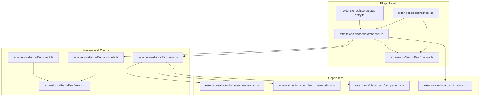

**Diagram sources**
- [index.ts:1-23](file://extensions/discord/index.ts#L1-L23)
- [setup-entry.ts:1-4](file://extensions/discord/setup-entry.ts#L1-L4)
- [channel.ts:1-413](file://extensions/discord/src/channel.ts#L1-L413)
- [runtime.ts:1-7](file://extensions/discord/src/runtime.ts#L1-L7)
- [accounts.ts:1-93](file://extensions/discord/src/accounts.ts#L1-L93)
- [token.ts:1-72](file://extensions/discord/src/token.ts#L1-L72)
- [client.ts:1-89](file://extensions/discord/src/client.ts#L1-L89)
- [send.ts:1-83](file://extensions/discord/src/send.ts#L1-L83)
- [send.messages.ts:1-194](file://extensions/discord/src/send.messages.ts#L1-L194)
- [send.permissions.ts:1-233](file://extensions/discord/src/send.permissions.ts#L1-L233)
- [components.ts:1-800](file://extensions/discord/src/components.ts#L1-L800)
- [monitor.ts:1-29](file://extensions/discord/src/monitor.ts#L1-L29)

**Section sources**
- [index.ts:1-23](file://extensions/discord/index.ts#L1-L23)
- [setup-entry.ts:1-4](file://extensions/discord/setup-entry.ts#L1-L4)
- [channel.ts:1-413](file://extensions/discord/src/channel.ts#L1-L413)
- [runtime.ts:1-7](file://extensions/discord/src/runtime.ts#L1-L7)
- [accounts.ts:1-93](file://extensions/discord/src/accounts.ts#L1-L93)
- [token.ts:1-72](file://extensions/discord/src/token.ts#L1-L72)
- [client.ts:1-89](file://extensions/discord/src/client.ts#L1-L89)
- [send.ts:1-83](file://extensions/discord/src/send.ts#L1-L83)
- [send.messages.ts:1-194](file://extensions/discord/src/send.messages.ts#L1-L194)
- [send.permissions.ts:1-233](file://extensions/discord/src/send.permissions.ts#L1-L233)
- [components.ts:1-800](file://extensions/discord/src/components.ts#L1-L800)
- [monitor.ts:1-29](file://extensions/discord/src/monitor.ts#L1-L29)

## Core Components
- Plugin registration and runtime: The plugin initializes the Discord runtime store and registers the channel with OpenClaw. It also conditionally registers subagent hooks during full registration.
- Channel adapter: Defines capabilities (DMs, guild channels, threads, media, native commands), security policies, grouping rules, mentions stripping, threading mode, directory listing, target resolution, and outbound send functions.
- Token and account resolution: Resolves tokens from config/env, merges per-account configuration, and builds resolved account objects with enabled flags and config.
- Outbound APIs: Expose functions for sending messages, threads, reactions, permissions checks, and moderation actions.
- Interactive components: Parse and render Discord components (buttons, selects, modals) and map them to OpenClaw’s interactive payloads.
- Monitoring and listeners: Provide message handlers, native command registration, and allowlist-based gating for guild and DM access.

**Section sources**
- [index.ts:7-20](file://extensions/discord/index.ts#L7-L20)
- [channel.ts:84-413](file://extensions/discord/src/channel.ts#L84-L413)
- [accounts.ts:54-72](file://extensions/discord/src/accounts.ts#L54-L72)
- [token.ts:20-71](file://extensions/discord/src/token.ts#L20-L71)
- [send.ts:1-83](file://extensions/discord/src/send.ts#L1-L83)
- [components.ts:225-278](file://extensions/discord/src/components.ts#L225-L278)
- [monitor.ts:6-29](file://extensions/discord/src/monitor.ts#L6-L29)

## Architecture Overview
The Discord integration follows a layered architecture:
- Plugin layer: Registers the channel and runtime.
- Channel adapter: Bridges OpenClaw’s channel abstraction to Discord specifics.
- Runtime store: Holds provider state and application/bot metadata.
- Client and token resolution: Provides REST client construction and token precedence.
- Outbound adapters: Encapsulate Discord API calls for messages, permissions, reactions, threads, and moderation.
- Interactive components: Convert OpenClaw interactive payloads to Discord components and back.
- Monitoring: Listens to gateway events, enforces allowlists, and routes inbound messages.

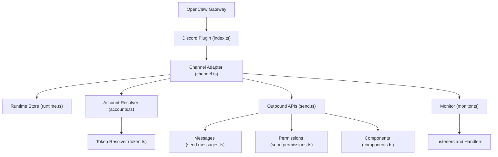

**Diagram sources**
- [index.ts:1-23](file://extensions/discord/index.ts#L1-L23)
- [channel.ts:1-413](file://extensions/discord/src/channel.ts#L1-L413)
- [runtime.ts:1-7](file://extensions/discord/src/runtime.ts#L1-L7)
- [accounts.ts:1-93](file://extensions/discord/src/accounts.ts#L1-L93)
- [token.ts:1-72](file://extensions/discord/src/token.ts#L1-L72)
- [send.ts:1-83](file://extensions/discord/src/send.ts#L1-L83)
- [send.messages.ts:1-194](file://extensions/discord/src/send.messages.ts#L1-L194)
- [send.permissions.ts:1-233](file://extensions/discord/src/send.permissions.ts#L1-L233)
- [components.ts:1-800](file://extensions/discord/src/components.ts#L1-L800)
- [monitor.ts:1-29](file://extensions/discord/src/monitor.ts#L1-L29)

## Detailed Component Analysis

### Plugin Registration and Setup
- The plugin exports an id, name, description, and an empty config schema. It sets the Discord runtime, registers the channel, and conditionally registers subagent hooks in full registration mode.
- The setup entry proxies to a setup wizard that handles token input, environment variable usage, and applying account configuration.

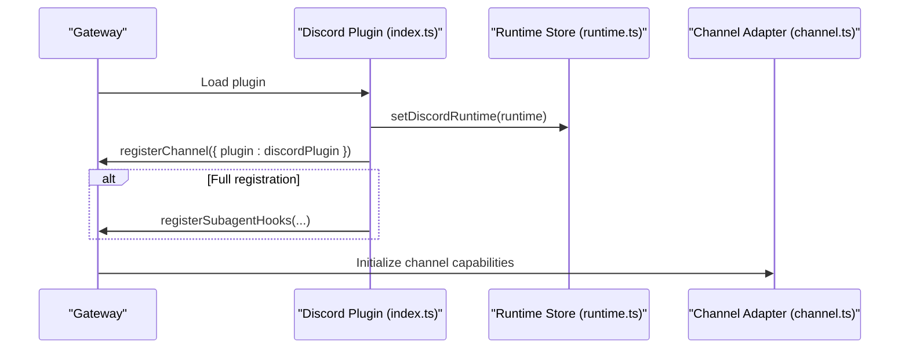

**Diagram sources**
- [index.ts:1-23](file://extensions/discord/index.ts#L1-L23)
- [runtime.ts:1-7](file://extensions/discord/src/runtime.ts#L1-L7)
- [channel.ts:84-125](file://extensions/discord/src/channel.ts#L84-L125)

**Section sources**
- [index.ts:1-23](file://extensions/discord/index.ts#L1-L23)
- [setup-entry.ts:1-4](file://extensions/discord/setup-entry.ts#L1-L4)

### Channel Adapter and Capabilities
- Capabilities include direct messages, channel messages, threads, media, and native commands.
- Security: DM policy builder, warnings collection for open group policy, and allow-from normalization.
- Groups: Require mention and tool policy resolution.
- Mentions: Strips user mentions for inbound processing.
- Threading: Reply-to mode resolution from configuration.
- Messaging: Target normalization and resolver hints.
- Directory: Lists peers/groups from config and live via runtime.
- Outbound: Delivery mode direct, chunk limits, target normalization, and send functions for text, media, and polls.

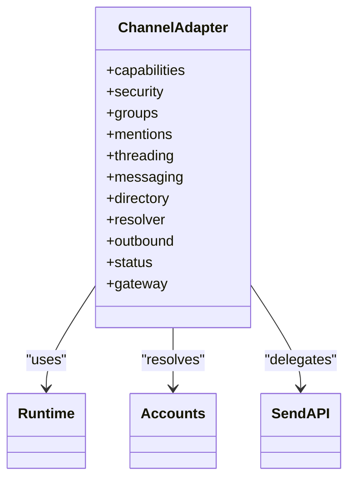

**Diagram sources**
- [channel.ts:84-413](file://extensions/discord/src/channel.ts#L84-L413)

**Section sources**
- [channel.ts:84-413](file://extensions/discord/src/channel.ts#L84-L413)

### Token and Account Resolution
- Token resolution prioritizes per-account config, then base config, then environment (only for default account). Normalizes “Bot ” prefix.
- Account merging combines base and per-account settings, computes enabled flag, and attaches token source.

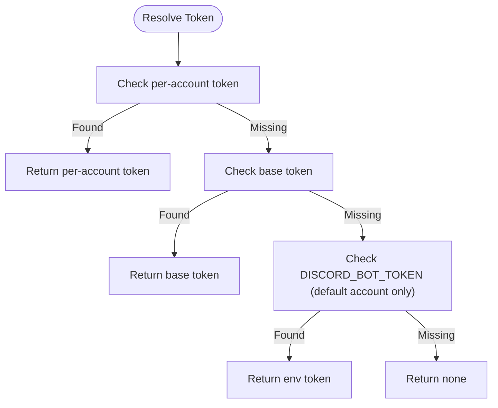

**Diagram sources**
- [token.ts:20-71](file://extensions/discord/src/token.ts#L20-L71)
- [accounts.ts:54-72](file://extensions/discord/src/accounts.ts#L54-L72)

**Section sources**
- [token.ts:12-71](file://extensions/discord/src/token.ts#L12-L71)
- [accounts.ts:25-72](file://extensions/discord/src/accounts.ts#L25-L72)

### Outbound Message Handling
- Text and media sending: Uses resolved outbound send dependency or runtime’s send function, with reply-to and silent flags.
- Polls: Dedicated send function for poll creation.
- Limits: Text chunk limit enforced at the channel level.

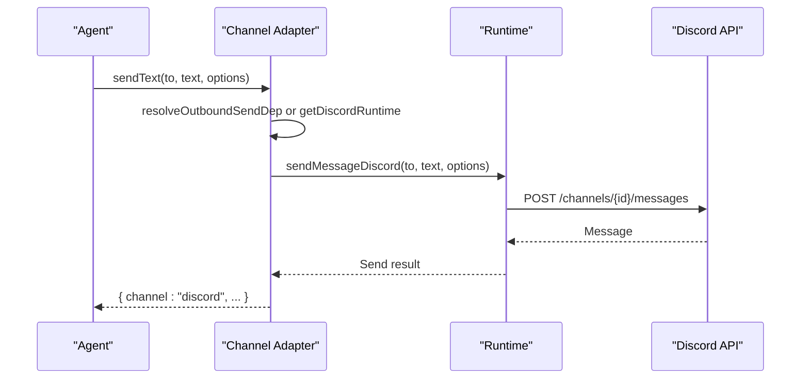

**Diagram sources**
- [channel.ts:248-292](file://extensions/discord/src/channel.ts#L248-L292)
- [send.ts:41-46](file://extensions/discord/src/send.ts#L41-L46)

**Section sources**
- [channel.ts:248-292](file://extensions/discord/src/channel.ts#L248-L292)
- [send.ts:1-83](file://extensions/discord/src/send.ts#L1-L83)

### Threads, Forum Posts, and Categories
- Creating threads: Supports forum-like channels (GuildForum/GuildMedia) with starter content and applied tags; non-forum channels default to public threads and send initial content separately.
- Listing threads: Active threads for a guild or archived/public threads for a channel.
- Categories: Channel type detection influences thread creation behavior.

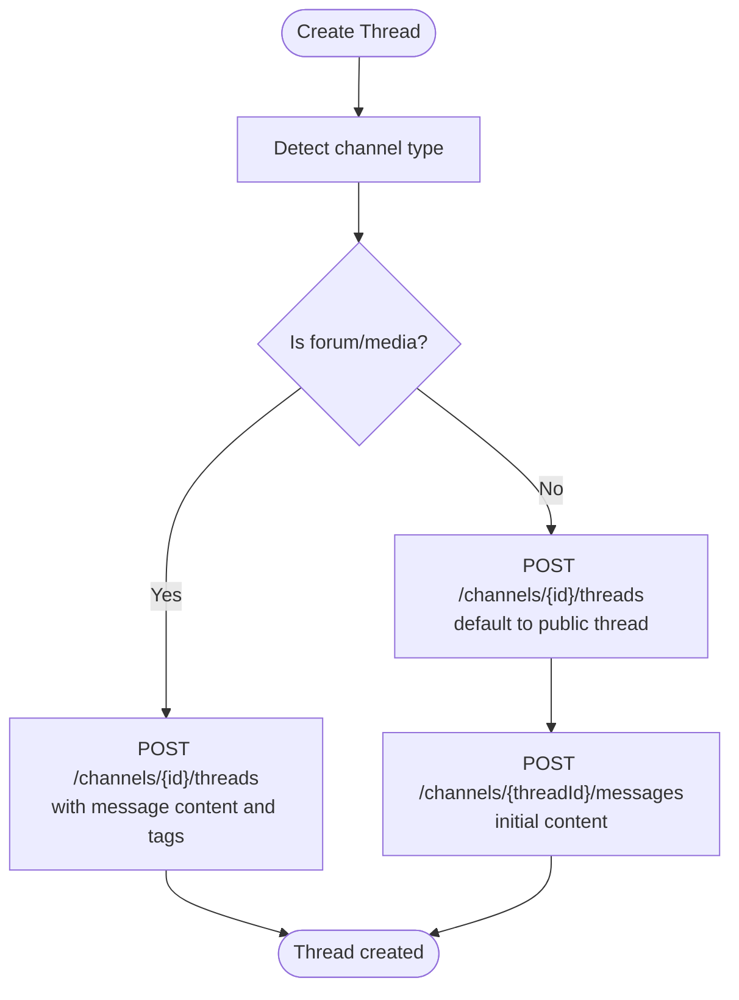

**Diagram sources**
- [send.messages.ts:98-151](file://extensions/discord/src/send.messages.ts#L98-L151)

**Section sources**
- [send.messages.ts:98-151](file://extensions/discord/src/send.messages.ts#L98-L151)

### Rich Embeds, File Uploads, and Components
- Rich embeds: Supported via message content and attachments; components can be included for interactive experiences.
- File uploads: Attachment references use the “attachment://” prefix; multiple files via media gallery.
- Components: Buttons, selects, modals, and media galleries are parsed and rendered; custom IDs encode component/modals for interaction routing.

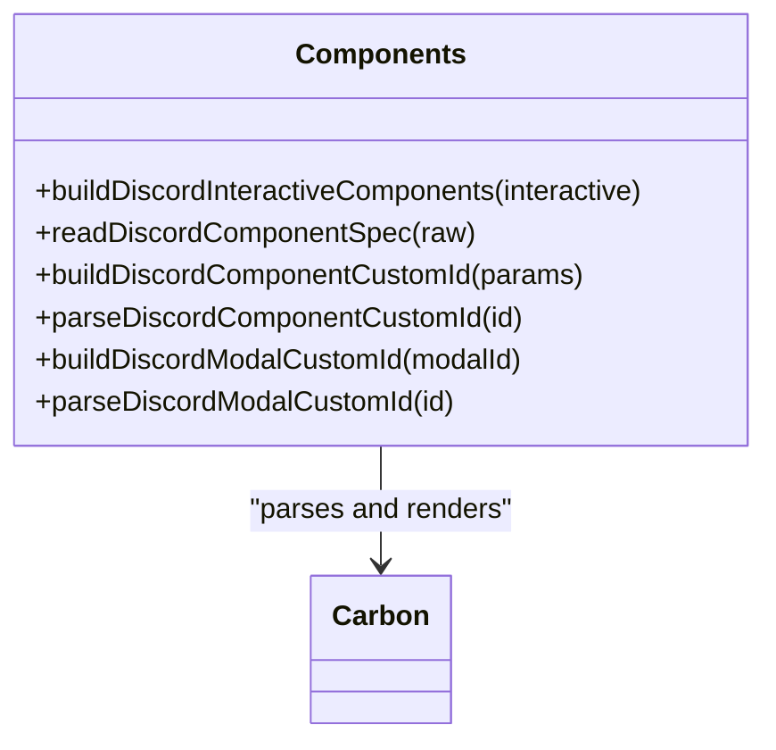

**Diagram sources**
- [components.ts:225-278](file://extensions/discord/src/components.ts#L225-L278)
- [components.ts:631-683](file://extensions/discord/src/components.ts#L631-L683)
- [components.ts:685-725](file://extensions/discord/src/components.ts#L685-L725)
- [components.ts:715-751](file://extensions/discord/src/components.ts#L715-L751)

**Section sources**
- [components.ts:225-278](file://extensions/discord/src/components.ts#L225-L278)
- [components.ts:631-683](file://extensions/discord/src/components.ts#L631-L683)
- [components.ts:685-725](file://extensions/discord/src/components.ts#L685-L725)
- [components.ts:715-751](file://extensions/discord/src/components.ts#L715-L751)

### Role-Based Permissions and Member Caching
- Permission checks: Resolve guild and channel permissions, compute effective bits, and detect Administrator bit.
- Member caching: Fetch guild and member info to compute base permissions; caches roles by ID for efficient lookups.
- Overwrites: Apply role and member overwrites to derive final channel permissions.

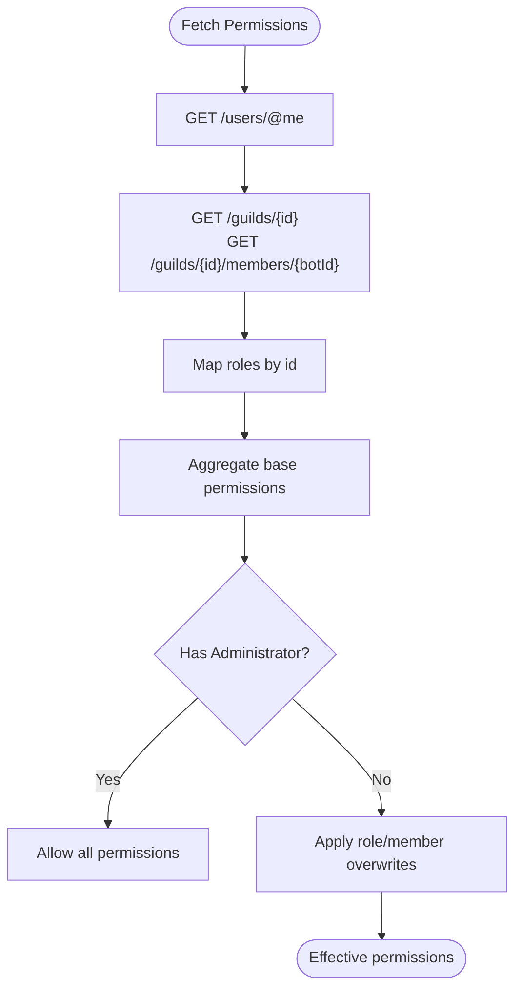

**Diagram sources**
- [send.permissions.ts:49-88](file://extensions/discord/src/send.permissions.ts#L49-L88)
- [send.permissions.ts:154-232](file://extensions/discord/src/send.permissions.ts#L154-L232)

**Section sources**
- [send.permissions.ts:49-88](file://extensions/discord/src/send.permissions.ts#L49-L88)
- [send.permissions.ts:154-232](file://extensions/discord/src/send.permissions.ts#L154-L232)

### Server Moderation Features
- Ban/kick/timeout: Provided via outbound moderation functions.
- Scheduled events: List/create scheduled events.
- Voice status: Fetch voice channel status.
- Roles: Add/remove roles, fetch role info.

**Section sources**
- [send.ts:15-27](file://extensions/discord/src/send.ts#L15-L27)

### Webhooks and Real-Time Event Handling
- Webhook messages: Dedicated send function for webhook-based posting.
- Real-time events: Monitor provider starts the Discord connection, probes application/bot metadata, and enforces intents (e.g., Message Content Intent). It also manages runtime status and reconnect attempts.

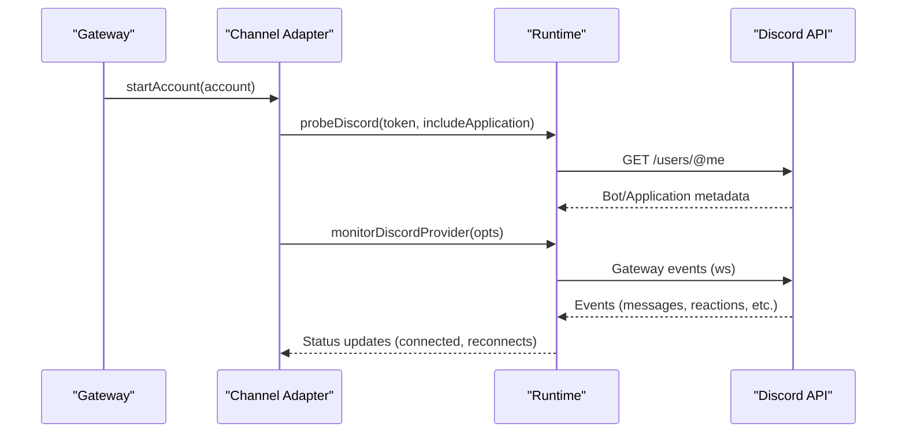

**Diagram sources**
- [channel.ts:366-411](file://extensions/discord/src/channel.ts#L366-L411)
- [send.ts:44](file://extensions/discord/src/send.ts#L44)

**Section sources**
- [channel.ts:366-411](file://extensions/discord/src/channel.ts#L366-L411)
- [send.ts:44](file://extensions/discord/src/send.ts#L44)

### Slash Commands, Context Menus, Autocomplete, and Modals
- Native commands: Enabled by default for Discord; per-channel override supported. Execution honors allowlists and returns “not authorized” for unauthorized users.
- Modals: Components support modal triggers with up to five fields; OpenClaw injects a trigger button and routes submissions as inbound messages.
- Context menus: Supported via components and modal integration.

**Section sources**
- [discord.md:540-549](file://docs/channels/discord.md#L540-L549)
- [components.ts:142-149](file://extensions/discord/src/components.ts#L142-L149)
- [components.ts:641-663](file://extensions/discord/src/components.ts#L641-L663)

### Access Control and Routing
- DM policy: Pairing, allowlist, open, disabled; allow-from normalization supports user mentions and IDs.
- Guild policy: Open, allowlist, disabled; secure baseline when the Discord section exists is allowlist.
- Mentions and group DMs: Mention gating, patterns, and optional ignore-other-mentions behavior; group DMs can be allowed via dedicated configuration.

**Section sources**
- [discord.md:369-461](file://docs/channels/discord.md#L369-L461)

### Rate Limiting, Intents, and Performance
- Rate limiting: Managed by underlying HTTP client and retry runner; configurable retry policy per account.
- Intents: Message Content Intent is required for responding to channel messages; limited vs disabled states are surfaced in status.
- Performance: Streaming modes (partial/block) and draft chunking; history limits; thread bindings for persistent sessions.

**Section sources**
- [discord.md:554-618](file://docs/channels/discord.md#L554-L618)
- [discord.md:619-687](file://docs/channels/discord.md#L619-L687)
- [client.ts:76-84](file://extensions/discord/src/client.ts#L76-L84)

## Dependency Analysis
- Coupling: Channel adapter depends on runtime store, account/token resolvers, and outbound APIs. Outbound APIs encapsulate Discord SDK usage.
- Cohesion: Each module focuses on a distinct concern (tokens, accounts, messages, permissions, components, monitoring).
- External dependencies: Discord API types and routes; carbon for component parsing/rendering; retry runner for robust HTTP calls.

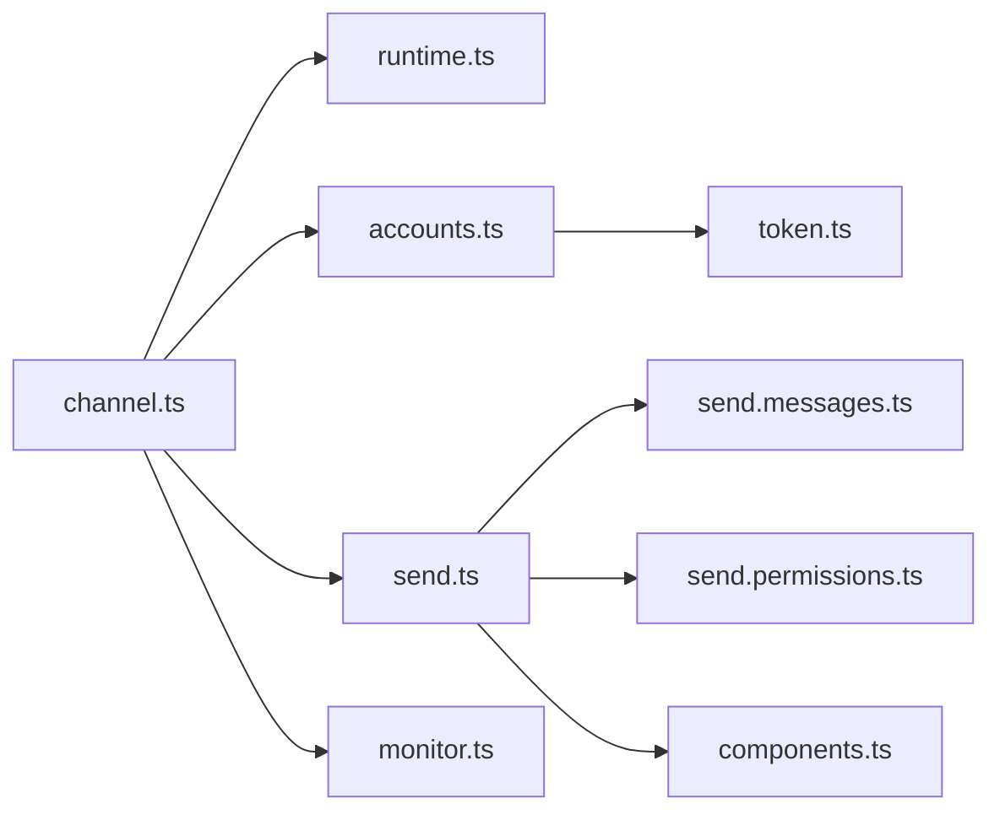

**Diagram sources**
- [channel.ts:1-413](file://extensions/discord/src/channel.ts#L1-L413)
- [runtime.ts:1-7](file://extensions/discord/src/runtime.ts#L1-L7)
- [accounts.ts:1-93](file://extensions/discord/src/accounts.ts#L1-L93)
- [token.ts:1-72](file://extensions/discord/src/token.ts#L1-L72)
- [send.ts:1-83](file://extensions/discord/src/send.ts#L1-L83)
- [send.messages.ts:1-194](file://extensions/discord/src/send.messages.ts#L1-L194)
- [send.permissions.ts:1-233](file://extensions/discord/src/send.permissions.ts#L1-L233)
- [components.ts:1-800](file://extensions/discord/src/components.ts#L1-L800)
- [monitor.ts:1-29](file://extensions/discord/src/monitor.ts#L1-L29)

**Section sources**
- [channel.ts:1-413](file://extensions/discord/src/channel.ts#L1-L413)
- [send.ts:1-83](file://extensions/discord/src/send.ts#L1-L83)

## Performance Considerations
- Streaming: Choose partial or block streaming depending on latency and bandwidth preferences; adjust draft chunk sizes for block mode.
- History limits: Tune guild and DM history limits to balance context and performance.
- Thread bindings: Enable thread bindings for persistent subagent sessions to reduce session churn.
- Retry policy: Configure retry settings per account to handle transient failures gracefully.

[No sources needed since this section provides general guidance]

## Troubleshooting Guide
- Missing permissions: Use permission checks to verify channel/guild permissions and Administrator bit; review role and member overwrites.
- Event handling problems: Verify Message Content Intent status; ensure bot is properly invited with required scopes and permissions.
- Connection stability: Inspect runtime status, reconnect attempts, and last event timestamps; confirm token validity and environment fallback behavior.
- Pairing and DM policy: Confirm DM policy configuration and allow-from entries; ensure server privacy settings allow DMs from members.

**Section sources**
- [send.permissions.ts:154-232](file://extensions/discord/src/send.permissions.ts#L154-L232)
- [discord.md:540-549](file://docs/channels/discord.md#L540-L549)
- [channel.ts:293-365](file://extensions/discord/src/channel.ts#L293-L365)

## Conclusion
The Discord integration in OpenClaw provides a comprehensive, modular channel implementation with strong security controls, rich interactivity, and robust moderation capabilities. It supports modern Discord features including threads, forums, components, and native commands, while offering flexible configuration for DMs, guild channels, and role-based routing. Proper intent configuration, permission modeling, and performance tuning ensure reliable operation across small and large servers.

[No sources needed since this section summarizes without analyzing specific files]

## Appendices

### Setup and Configuration References
- Quick setup steps, intents, invite URL generation, and configuration examples are documented in the channel guide.

**Section sources**
- [discord.md:24-167](file://docs/channels/discord.md#L24-L167)