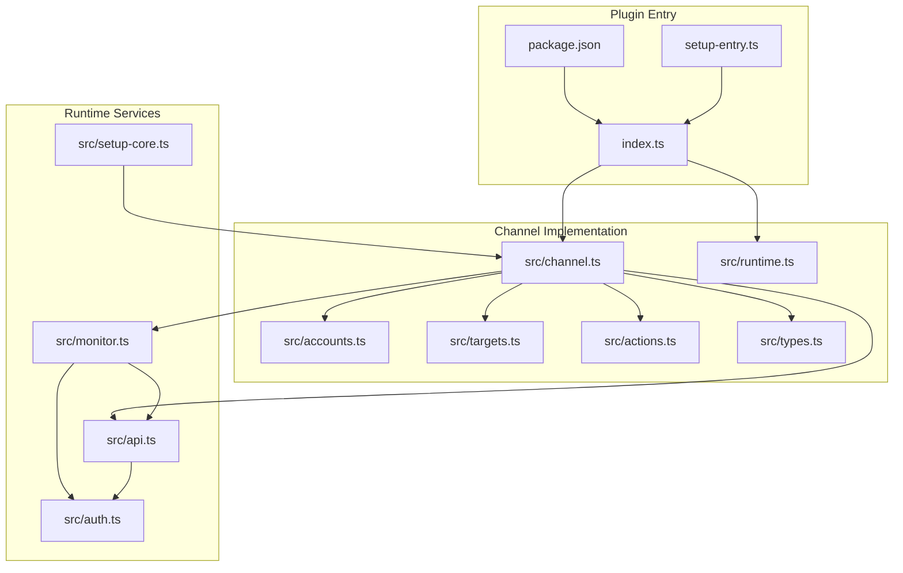
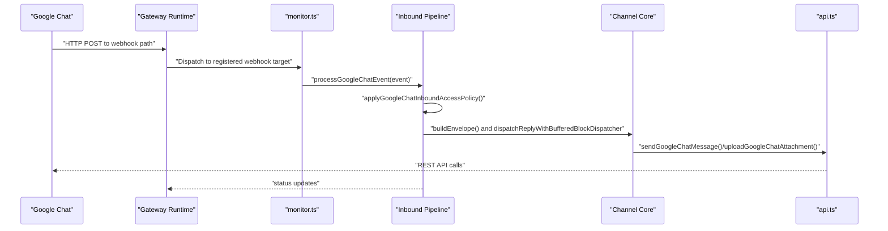
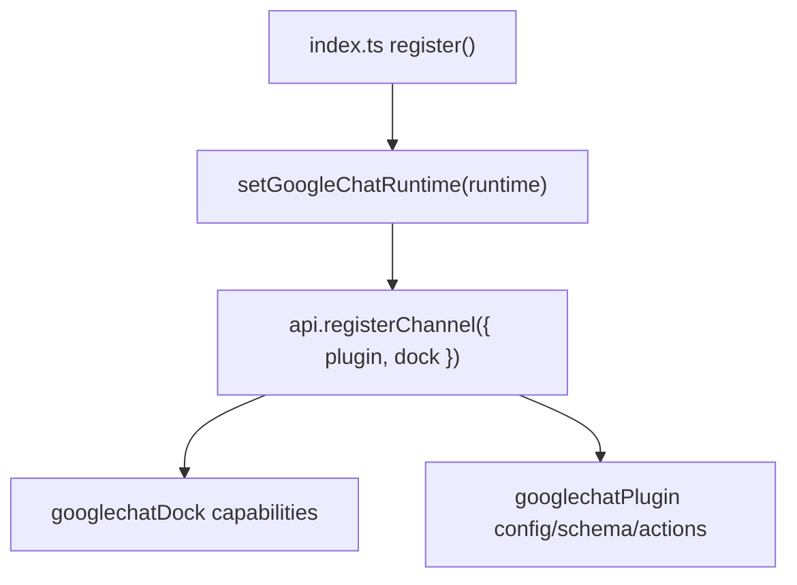
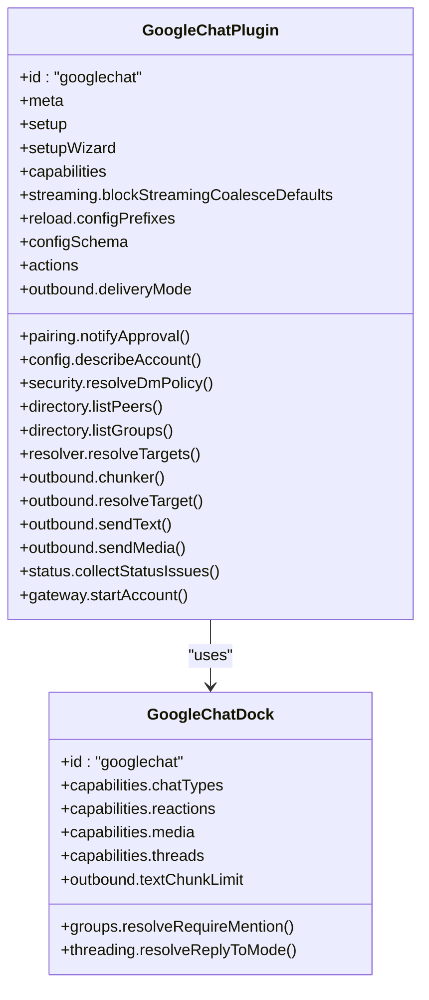
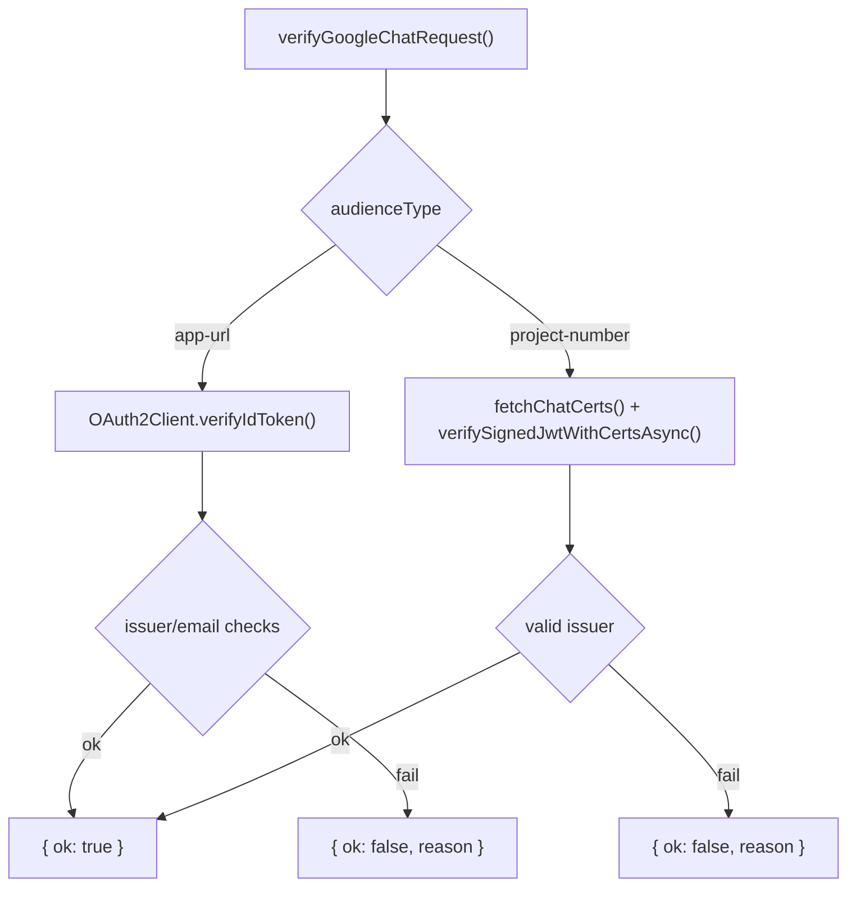
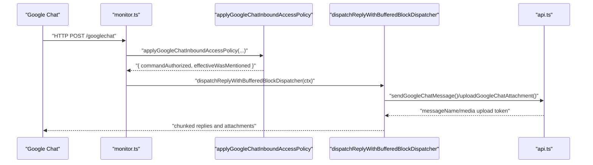
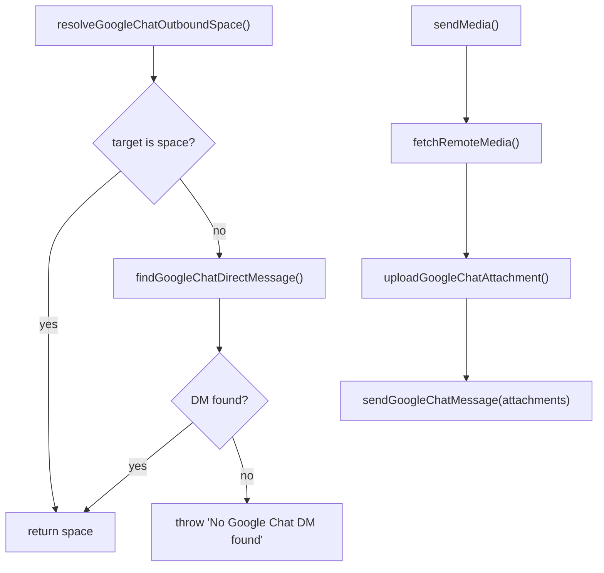
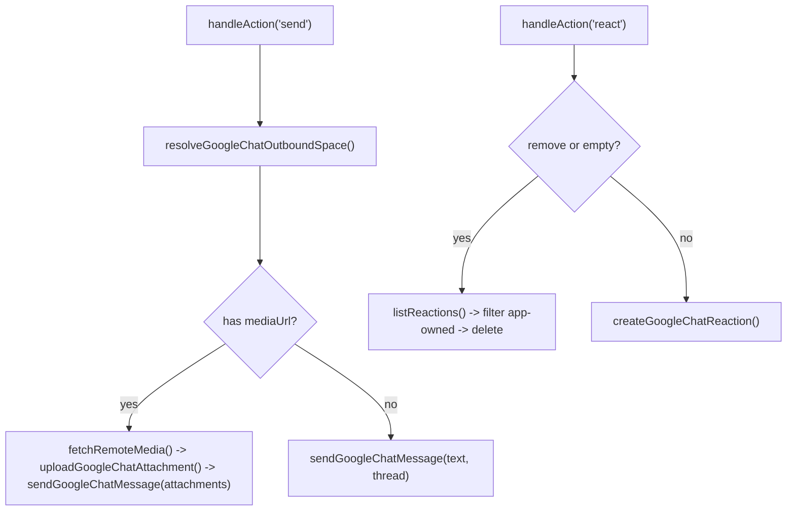
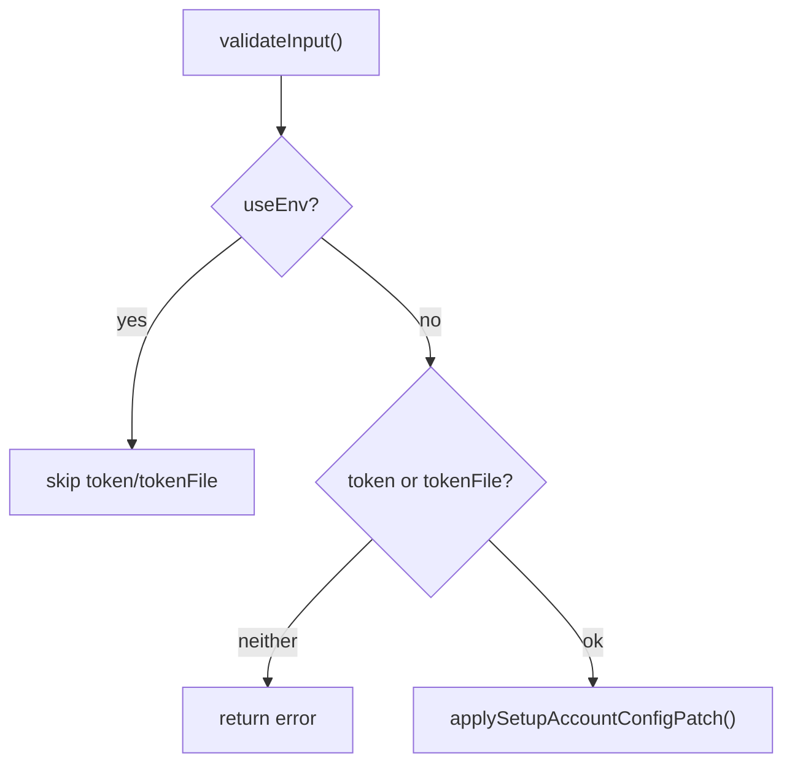
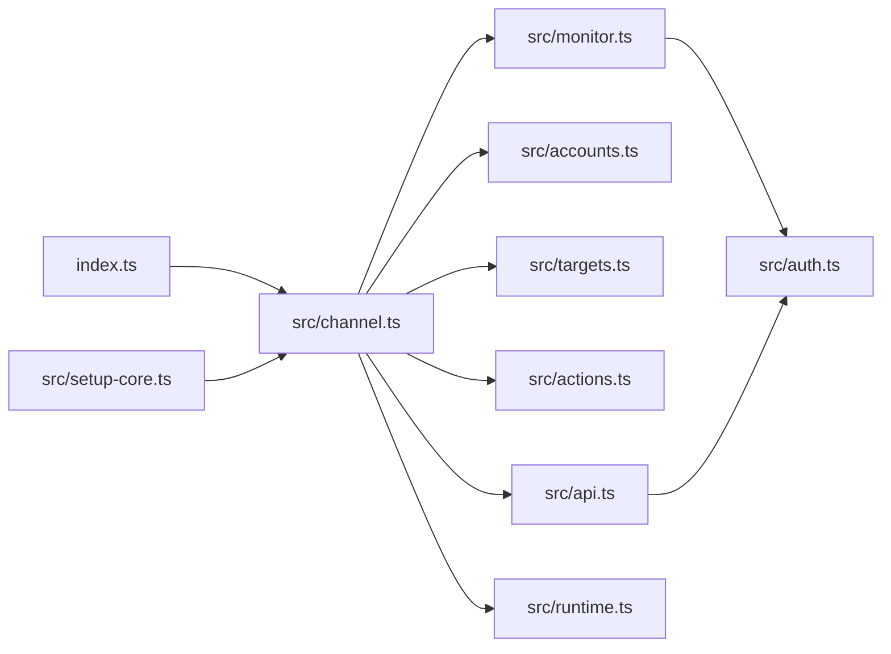

# Google Chat Integration

<cite>
**Referenced Files in This Document**
- [package.json](file://extensions/googlechat/package.json)
- [index.ts](file://extensions/googlechat/index.ts)
- [setup-entry.ts](file://extensions/googlechat/setup-entry.ts)
- [channel.ts](file://extensions/googlechat/src/channel.ts)
- [api.ts](file://extensions/googlechat/src/api.ts)
- [auth.ts](file://extensions/googlechat/src/auth.ts)
- [monitor.ts](file://extensions/googlechat/src/monitor.ts)
- [runtime.ts](file://extensions/googlechat/src/runtime.ts)
- [accounts.ts](file://extensions/googlechat/src/accounts.ts)
- [actions.ts](file://extensions/googlechat/src/actions.ts)
- [targets.ts](file://extensions/googlechat/src/targets.ts)
- [types.ts](file://extensions/googlechat/src/types.ts)
- [setup-core.ts](file://extensions/googlechat/src/setup-core.ts)
</cite>

## Table of Contents
1. [Introduction](#introduction)
2. [Project Structure](#project-structure)
3. [Core Components](#core-components)
4. [Architecture Overview](#architecture-overview)
5. [Detailed Component Analysis](#detailed-component-analysis)
6. [Dependency Analysis](#dependency-analysis)
7. [Performance Considerations](#performance-considerations)
8. [Troubleshooting Guide](#troubleshooting-guide)
9. [Conclusion](#conclusion)
10. [Appendices](#appendices)

## Introduction
This document explains the Google Chat integration built as an OpenClaw plugin. It covers Google Workspace API setup, OAuth verification, app configuration, inbound/outbound messaging for spaces, rooms, and direct messages, and outbound media handling. It also documents webhook-based real-time event processing, runtime initialization, and operational guidance for domain authentication, user context, permissions, rate limiting, and performance optimization.

## Project Structure
The Google Chat integration is implemented as a plugin module under extensions/googlechat. The key files include:
- Plugin registration and exports
- Channel plugin definition and docking
- Runtime and API wrappers for Google Chat
- Authentication and audience verification
- Webhook monitoring and event pipeline
- Target normalization and outbound resolution
- Action handlers for reactions and message sends

**Diagram sources**
- [index.ts:1-18](file://extensions/googlechat/index.ts#L1-L18)
- [package.json:1-49](file://extensions/googlechat/package.json#L1-L49)
- [setup-entry.ts:1-7](file://extensions/googlechat/setup-entry.ts#L1-L7)
- [channel.ts:1-495](file://extensions/googlechat/src/channel.ts#L1-L495)
- [runtime.ts:1-7](file://extensions/googlechat/src/runtime.ts#L1-L7)
- [accounts.ts:1-156](file://extensions/googlechat/src/accounts.ts#L1-L156)
- [targets.ts:1-66](file://extensions/googlechat/src/targets.ts#L1-L66)
- [actions.ts:1-174](file://extensions/googlechat/src/actions.ts#L1-L174)
- [types.ts:1-74](file://extensions/googlechat/src/types.ts#L1-L74)
- [monitor.ts:1-549](file://extensions/googlechat/src/monitor.ts#L1-L549)
- [api.ts:1-320](file://extensions/googlechat/src/api.ts#L1-L320)
- [auth.ts:1-161](file://extensions/googlechat/src/auth.ts#L1-L161)
- [setup-core.ts:1-68](file://extensions/googlechat/src/setup-core.ts#L1-L68)

**Section sources**
- [package.json:1-49](file://extensions/googlechat/package.json#L1-L49)
- [index.ts:1-18](file://extensions/googlechat/index.ts#L1-L18)
- [setup-entry.ts:1-7](file://extensions/googlechat/setup-entry.ts#L1-L7)

## Core Components
- Plugin registration: Declares the Google Chat plugin identity, registers the channel and dock, and sets runtime.
- Channel plugin: Defines capabilities, configuration schema, inbound/outbound messaging, threading, directory, security, and status collection.
- Runtime: Stores and retrieves the Google Chat runtime for media/text utilities.
- Accounts: Resolves per-account configuration, credentials, and enables multi-account support with defaults.
- Targets: Normalizes user/space identifiers and resolves outbound destinations including DM lookup.
- Actions: Provides message send and reaction operations for outbound actions.
- API: Wraps Google Chat REST endpoints for messages, attachments, reactions, and probes.
- Auth: Manages Google Auth instances, token acquisition, and audience verification for webhook requests.
- Monitor: Registers webhook routes, validates inbound requests, applies access policy, and runs the inbound pipeline.

**Section sources**
- [index.ts:6-18](file://extensions/googlechat/index.ts#L6-L18)
- [channel.ts:97-495](file://extensions/googlechat/src/channel.ts#L97-L495)
- [runtime.ts:4-7](file://extensions/googlechat/src/runtime.ts#L4-L7)
- [accounts.ts:129-156](file://extensions/googlechat/src/accounts.ts#L129-L156)
- [targets.ts:4-66](file://extensions/googlechat/src/targets.ts#L4-L66)
- [actions.ts:53-174](file://extensions/googlechat/src/actions.ts#L53-L174)
- [api.ts:140-320](file://extensions/googlechat/src/api.ts#L140-L320)
- [auth.ts:28-161](file://extensions/googlechat/src/auth.ts#L28-L161)
- [monitor.ts:47-110](file://extensions/googlechat/src/monitor.ts#L47-L110)

## Architecture Overview
The integration consists of:
- Plugin bootstrap wiring the channel and runtime
- Webhook endpoint receiving Google Chat events
- Inbound pipeline validating audience, applying access policies, building envelopes, and dispatching replies
- Outbound pipeline supporting text, threaded replies, and media uploads
- Authentication and token management for API calls and webhook verification

**Diagram sources**
- [monitor.ts:85-110](file://extensions/googlechat/src/monitor.ts#L85-L110)
- [monitor.ts:134-342](file://extensions/googlechat/src/monitor.ts#L134-L342)
- [api.ts:140-194](file://extensions/googlechat/src/api.ts#L140-L194)

**Section sources**
- [channel.ts:453-495](file://extensions/googlechat/src/channel.ts#L453-L495)
- [monitor.ts:47-110](file://extensions/googlechat/src/monitor.ts#L47-L110)
- [api.ts:140-320](file://extensions/googlechat/src/api.ts#L140-L320)

## Detailed Component Analysis

### Plugin Registration and Docking
- Exports the plugin identifier, name, description, and config schema.
- Registers the channel and dock with the OpenClaw runtime.
- Initializes the Google Chat runtime store.

**Diagram sources**
- [index.ts:11-15](file://extensions/googlechat/index.ts#L11-L15)
- [channel.ts:97-122](file://extensions/googlechat/src/channel.ts#L97-L122)

**Section sources**
- [index.ts:6-18](file://extensions/googlechat/index.ts#L6-L18)
- [channel.ts:97-122](file://extensions/googlechat/src/channel.ts#L97-L122)

### Channel Plugin and Dock
- Capabilities: supports direct, group, thread chat types; reactions; media; threads; blocks streaming.
- Outbound: text chunking, markdown mode, and thread resolution.
- Security: DM policy resolution and warnings for open group policies.
- Messaging: target normalization and resolver hints.
- Directory: lists peers/users and groups from allowFrom/groups.
- Status: probes API, builds snapshots, and collects issues.

**Diagram sources**
- [channel.ts:97-495](file://extensions/googlechat/src/channel.ts#L97-L495)

**Section sources**
- [channel.ts:97-495](file://extensions/googlechat/src/channel.ts#L97-L495)

### Authentication and Audience Verification
- Builds GoogleAuth instances from service account JSON, file, or environment.
- Caches up to a bounded number of auth clients.
- Fetches Chat certificates periodically and verifies JWTs for project-number audience.
- Verifies ID tokens for app-url audience and optionally binds to an addon principal.

**Diagram sources**
- [auth.ts:93-158](file://extensions/googlechat/src/auth.ts#L93-L158)

**Section sources**
- [auth.ts:28-75](file://extensions/googlechat/src/auth.ts#L28-L75)
- [auth.ts:93-158](file://extensions/googlechat/src/auth.ts#L93-L158)

### Webhook Monitoring and Event Pipeline
- Registers a webhook target with plugin route and in-flight limiter.
- Validates incoming requests using audience type and expected audience/principal.
- Filters non-MESSAGE events and skips bot-authored messages unless allowed.
- Downloads media attachments and builds inbound envelope with session metadata.
- Supports typing indicators (message mode) and reply prefixes.
- Delivers replies as chunked text or uploaded attachments with thread-awareness.

**Diagram sources**
- [monitor.ts:47-110](file://extensions/googlechat/src/monitor.ts#L47-L110)
- [monitor.ts:134-342](file://extensions/googlechat/src/monitor.ts#L134-L342)
- [api.ts:140-194](file://extensions/googlechat/src/api.ts#L140-L194)

**Section sources**
- [monitor.ts:47-110](file://extensions/googlechat/src/monitor.ts#L47-L110)
- [monitor.ts:134-342](file://extensions/googlechat/src/monitor.ts#L134-L342)

### Outbound Messaging and Media
- Text: resolves target, normalizes to spaces/users, and sends MESSAGE with optional thread.
- Media: fetches remote media, uploads via multipart upload, then attaches to message.
- Limits: enforces media size based on account/channel config.

**Diagram sources**
- [targets.ts:42-66](file://extensions/googlechat/src/targets.ts#L42-L66)
- [api.ts:196-239](file://extensions/googlechat/src/api.ts#L196-L239)
- [api.ts:140-171](file://extensions/googlechat/src/api.ts#L140-L171)

**Section sources**
- [targets.ts:42-66](file://extensions/googlechat/src/targets.ts#L42-L66)
- [api.ts:140-239](file://extensions/googlechat/src/api.ts#L140-L239)

### Actions: Send and Reactions
- Send: resolves target, optionally uploads media, and posts message.
- React: creates or removes reactions; supports removing by emoji or all app-owned reactions.

**Diagram sources**
- [actions.ts:70-124](file://extensions/googlechat/src/actions.ts#L70-L124)
- [actions.ts:126-158](file://extensions/googlechat/src/actions.ts#L126-L158)
- [api.ts:196-239](file://extensions/googlechat/src/api.ts#L196-L239)
- [api.ts:251-287](file://extensions/googlechat/src/api.ts#L251-L287)

**Section sources**
- [actions.ts:53-174](file://extensions/googlechat/src/actions.ts#L53-L174)

### Setup and Configuration
- CLI setup adapter validates inputs and applies patches for service account, audience, and webhook settings.
- Supports environment-based service account for default account only.

**Diagram sources**
- [setup-core.ts:20-28](file://extensions/googlechat/src/setup-core.ts#L20-L28)
- [setup-core.ts:54-66](file://extensions/googlechat/src/setup-core.ts#L54-L66)

**Section sources**
- [setup-core.ts:11-68](file://extensions/googlechat/src/setup-core.ts#L11-L68)

## Dependency Analysis
- External libraries: google-auth-library for token acquisition and verification.
- Internal dependencies: OpenClaw plugin SDK for channel config, runtime, media/text utilities, and webhook routing.
- Circular dependencies: None observed; runtime store is a simple singleton accessor.

**Diagram sources**
- [index.ts:1-18](file://extensions/googlechat/index.ts#L1-L18)
- [channel.ts:1-495](file://extensions/googlechat/src/channel.ts#L1-L495)
- [api.ts:1-320](file://extensions/googlechat/src/api.ts#L1-L320)
- [auth.ts:1-161](file://extensions/googlechat/src/auth.ts#L1-L161)
- [monitor.ts:1-549](file://extensions/googlechat/src/monitor.ts#L1-L549)
- [accounts.ts:1-156](file://extensions/googlechat/src/accounts.ts#L1-L156)
- [targets.ts:1-66](file://extensions/googlechat/src/targets.ts#L1-L66)
- [actions.ts:1-174](file://extensions/googlechat/src/actions.ts#L1-L174)
- [setup-core.ts:1-68](file://extensions/googlechat/src/setup-core.ts#L1-L68)
- [runtime.ts:1-7](file://extensions/googlechat/src/runtime.ts#L1-L7)

**Section sources**
- [package.json:7-17](file://extensions/googlechat/package.json#L7-L17)

## Performance Considerations
- Token caching: Auth instances are cached with bounded size to avoid repeated initialization.
- Certificates caching: Chat certificates are cached with a TTL to reduce network overhead.
- Chunking: Outbound text is chunked according to markdown mode and configured limits.
- Media limits: Enforced via max bytes derived from account/channel configuration.
- In-flight webhook limiter: Prevents overload during bursts of events.
- Typing indicator: Uses a single message mode to avoid reaction overhead with service accounts.

[No sources needed since this section provides general guidance]

## Troubleshooting Guide
Common issues and resolutions:
- Missing credentials: Ensure service account JSON or file is provided for the default account or via environment variables.
- Invalid audience or token: Verify audience type and audience value; for app-url, ensure ID token verification succeeds and principal binding matches when required.
- Domain restrictions: Confirm the Google Chat app is configured for the intended domain and the bot user is properly invited.
- API quota limits: Monitor Google Chat API quotas; consider batching and respecting rate limits.
- Event filtering: Bot-authored messages are skipped by default; enable allowBots if needed.
- Rate limiting: Use in-flight webhook limiter and chunked replies to manage throughput.
- Media errors: Validate media URLs and sizes; ensure upload tokens are returned before sending messages with attachments.

**Section sources**
- [auth.ts:93-158](file://extensions/googlechat/src/auth.ts#L93-L158)
- [monitor.ts:161-171](file://extensions/googlechat/src/monitor.ts#L161-L171)
- [api.ts:90-138](file://extensions/googlechat/src/api.ts#L90-L138)
- [api.ts:196-239](file://extensions/googlechat/src/api.ts#L196-L239)

## Conclusion
The Google Chat integration provides a robust, extensible plugin for OpenClaw with secure authentication, webhook-driven inbound processing, and comprehensive outbound messaging including media. It supports multi-account configurations, granular security controls, and efficient runtime utilities for performance.

[No sources needed since this section summarizes without analyzing specific files]

## Appendices

### Configuration Reference
- Channel section keys: channels.googlechat
- Account keys: channels.googlechat.accounts.{accountId}
- Credential sources: serviceAccount, serviceAccountFile, environment variables
- Audience: audienceType (app-url or project-number), audience
- Webhook: webhookPath, webhookUrl
- Defaults: mediaMaxMb, textChunkLimit, typingIndicator, dm.policy, allowBots

**Section sources**
- [accounts.ts:38-60](file://extensions/googlechat/src/accounts.ts#L38-L60)
- [accounts.ts:129-149](file://extensions/googlechat/src/accounts.ts#L129-L149)
- [channel.ts:172-183](file://extensions/googlechat/src/channel.ts#L172-L183)