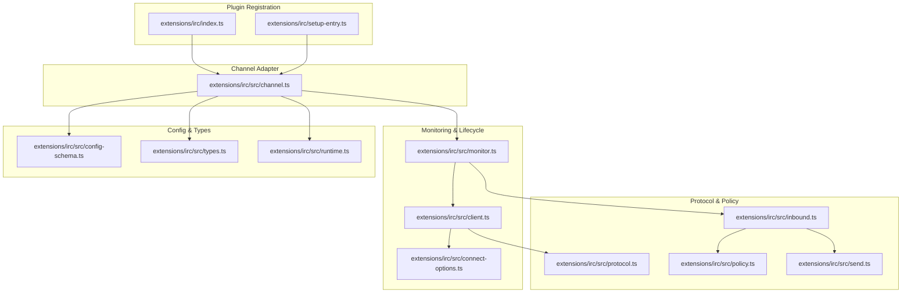
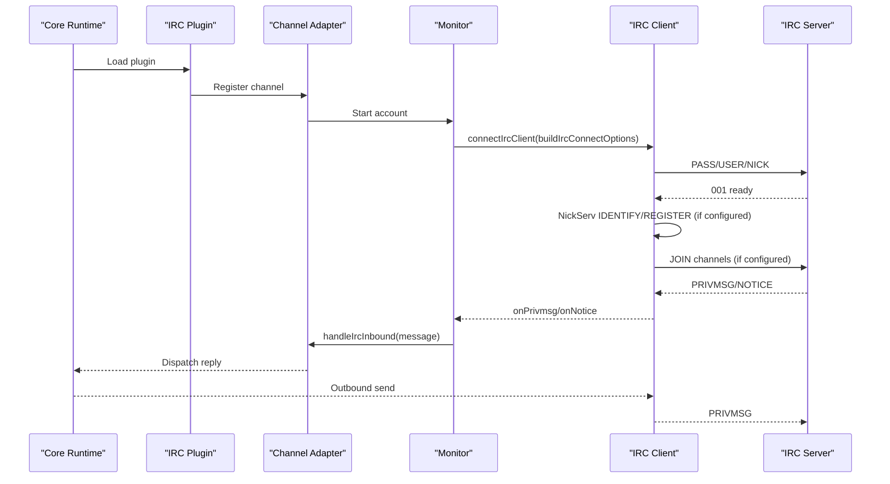
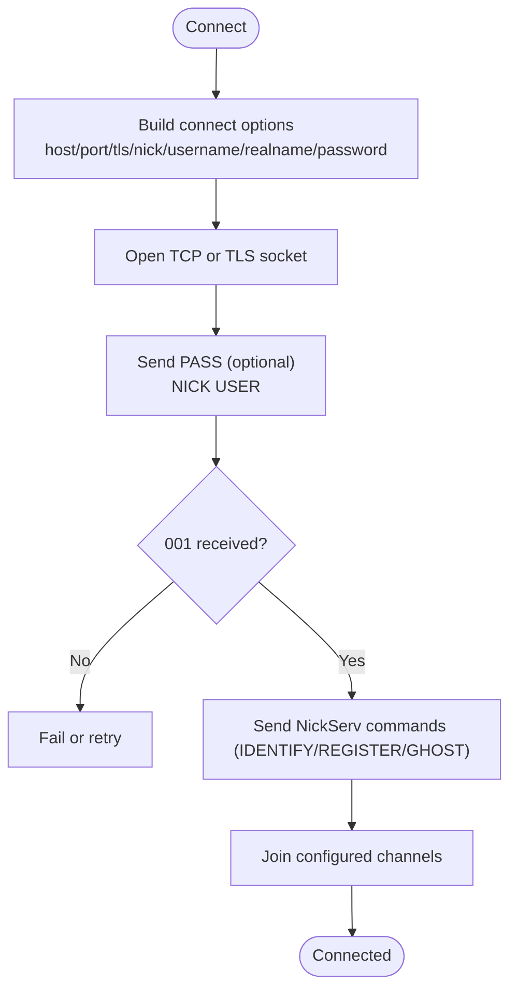
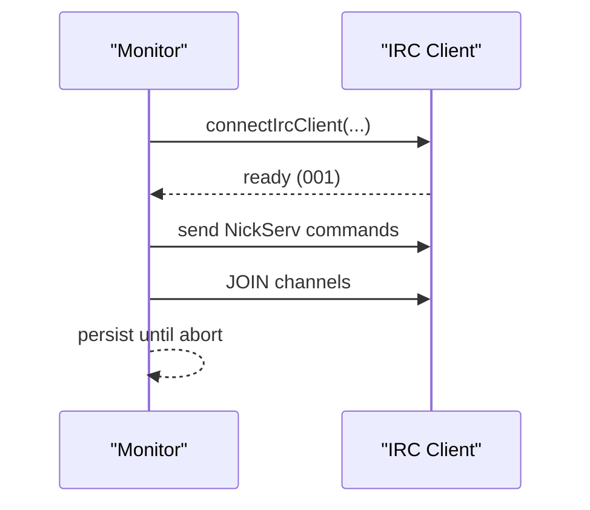
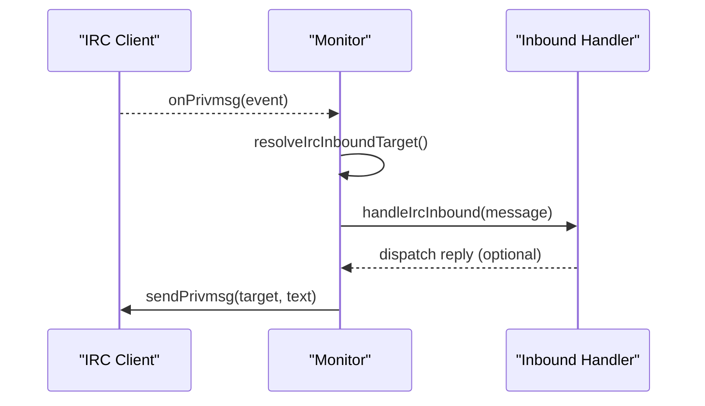
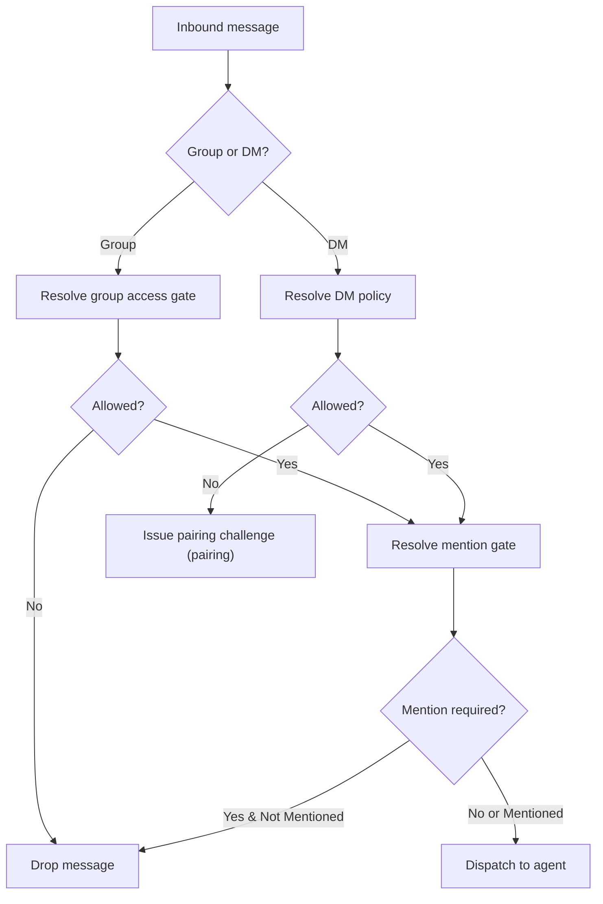
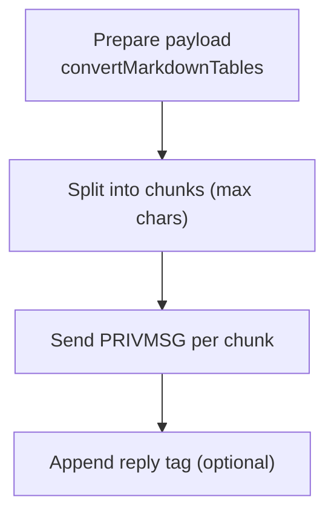
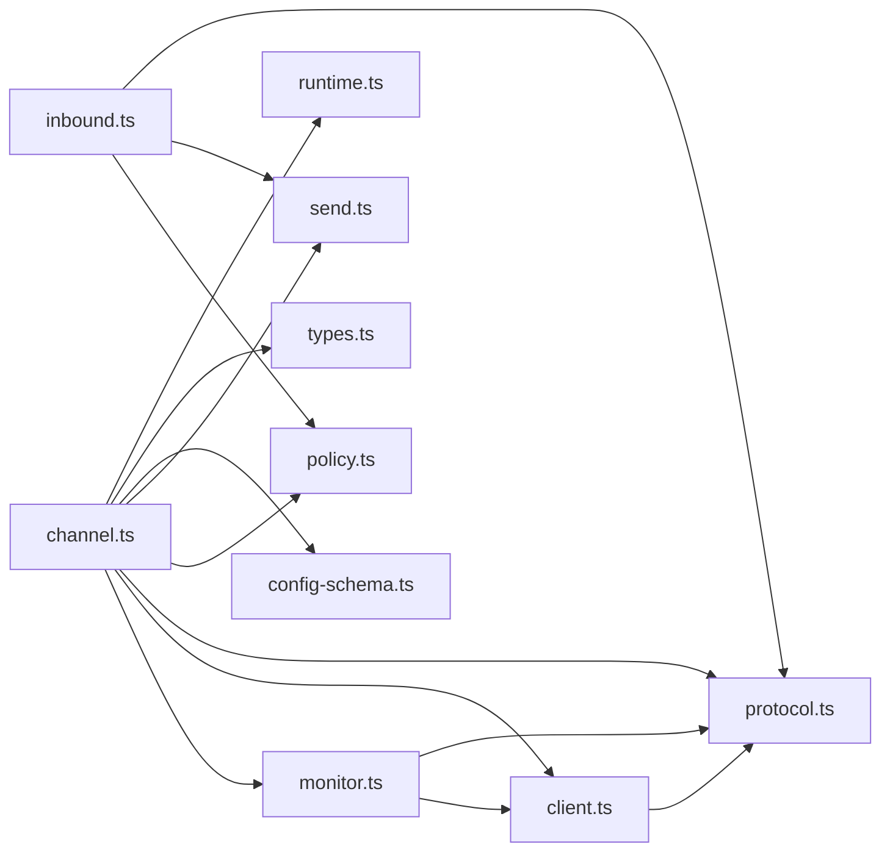

# IRC Integration

<cite>
**Referenced Files in This Document**
- [index.ts](file://extensions/irc/index.ts)
- [setup-entry.ts](file://extensions/irc/setup-entry.ts)
- [channel.ts](file://extensions/irc/src/channel.ts)
- [monitor.ts](file://extensions/irc/src/monitor.ts)
- [client.ts](file://extensions/irc/src/client.ts)
- [connect-options.ts](file://extensions/irc/src/connect-options.ts)
- [config-schema.ts](file://extensions/irc/src/config-schema.ts)
- [types.ts](file://extensions/irc/src/types.ts)
- [protocol.ts](file://extensions/irc/src/protocol.ts)
- [send.ts](file://extensions/irc/src/send.ts)
- [inbound.ts](file://extensions/irc/src/inbound.ts)
- [policy.ts](file://extensions/irc/src/policy.ts)
- [runtime.ts](file://extensions/irc/src/runtime.ts)
- [zod-schema.providers-core.ts](file://src/config/zod-schema.providers-core.ts)
</cite>

## Table of Contents
1. [Introduction](#introduction)
2. [Project Structure](#project-structure)
3. [Core Components](#core-components)
4. [Architecture Overview](#architecture-overview)
5. [Detailed Component Analysis](#detailed-component-analysis)
6. [Dependency Analysis](#dependency-analysis)
7. [Performance Considerations](#performance-considerations)
8. [Troubleshooting Guide](#troubleshooting-guide)
9. [Conclusion](#conclusion)
10. [Appendices](#appendices)

## Introduction
This document explains how the OpenClaw platform integrates Internet Relay Chat (IRC) as a channel. It covers connection setup, authentication, channel joining, message handling for private messages and channels, and advanced features such as nicknames, user modes, channel modes, operator privileges, network selection, SSL/TLS configuration, connection persistence, message formatting, CTCP responses, IRCv3 capability negotiation, rate limiting, flood protection, and practical troubleshooting. It also provides examples for handling kick/ban events, mode changes, and user quit/part messages, along with integration guidance for popular IRC networks and custom servers.

## Project Structure
The IRC integration is implemented as a plugin under the extensions/irc directory. The plugin registers a channel adapter that orchestrates configuration, monitoring, message parsing, and outbound sending. Supporting modules handle client lifecycle, protocol parsing, policy enforcement, and runtime access.

**Diagram sources**
- [index.ts:1-18](file://extensions/irc/index.ts#L1-L18)
- [setup-entry.ts:1-6](file://extensions/irc/setup-entry.ts#L1-L6)
- [channel.ts:1-386](file://extensions/irc/src/channel.ts#L1-L386)
- [monitor.ts:1-146](file://extensions/irc/src/monitor.ts#L1-L146)
- [client.ts:1-440](file://extensions/irc/src/client.ts#L1-L440)
- [connect-options.ts:1-31](file://extensions/irc/src/connect-options.ts#L1-L31)
- [protocol.ts:1-170](file://extensions/irc/src/protocol.ts#L1-L170)
- [policy.ts:1-167](file://extensions/irc/src/policy.ts#L1-L167)
- [inbound.ts:1-368](file://extensions/irc/src/inbound.ts#L1-L368)
- [send.ts:1-90](file://extensions/irc/src/send.ts#L1-L90)
- [config-schema.ts:1-94](file://extensions/irc/src/config-schema.ts#L1-L94)
- [types.ts:1-101](file://extensions/irc/src/types.ts#L1-L101)
- [runtime.ts:1-7](file://extensions/irc/src/runtime.ts#L1-L7)

**Section sources**
- [index.ts:1-18](file://extensions/irc/index.ts#L1-L18)
- [setup-entry.ts:1-6](file://extensions/irc/setup-entry.ts#L1-L6)
- [channel.ts:1-386](file://extensions/irc/src/channel.ts#L1-L386)

## Core Components
- Plugin registration and runtime wiring: Registers the IRC channel plugin and sets the runtime store.
- Channel adapter: Provides setup, configuration schema, security policies, grouping, messaging targets, directory listing, outbound sending, and status probing.
- Monitor: Establishes persistent connections, handles inbound PRIVMSG/NOTICE, and routes messages to the inbound handler.
- Client: Implements low-level IRC transport, PING/PONG handling, NICK collision recovery, JOIN, PASS/USER/NICK handshake, and message chunking.
- Protocol: Parses IRC lines and prefixes, sanitizes targets and text, splits long messages, and generates message IDs.
- Policy: Enforces group access gates, mention gating, and sender allowlists for channels and DMs.
- Inbound: Applies DM/group policies, mentions, control commands, and dispatches replies via the core routing.
- Send: Connects on-demand or reuses a ready client to send messages, with markdown table conversion and reply tagging.
- Config and Types: Defines account and channel configuration schemas, including nick/username/realname/password, TLS, channels, nick registration, DM/group policies, and group-level tool/system prompts.

**Section sources**
- [channel.ts:64-386](file://extensions/irc/src/channel.ts#L64-L386)
- [monitor.ts:35-146](file://extensions/irc/src/monitor.ts#L35-L146)
- [client.ts:116-440](file://extensions/irc/src/client.ts#L116-L440)
- [protocol.ts:21-170](file://extensions/irc/src/protocol.ts#L21-L170)
- [policy.ts:17-167](file://extensions/irc/src/policy.ts#L17-L167)
- [inbound.ts:83-368](file://extensions/irc/src/inbound.ts#L83-L368)
- [send.ts:35-90](file://extensions/irc/src/send.ts#L35-L90)
- [config-schema.ts:46-94](file://extensions/irc/src/config-schema.ts#L46-L94)
- [types.ts:32-101](file://extensions/irc/src/types.ts#L32-L101)

## Architecture Overview
The IRC integration follows a layered design:
- The plugin registers the channel adapter.
- The adapter resolves configuration and exposes setup, security, grouping, messaging, directory, outbound, and status APIs.
- The monitor connects to the IRC server and streams inbound messages.
- The client manages the TCP/TLS socket, handshake, and protocol frames.
- The inbound pipeline enforces policies and dispatches to agents.
- Outbound messages are sent via the client or a transient client.

**Diagram sources**
- [channel.ts:357-384](file://extensions/irc/src/channel.ts#L357-L384)
- [monitor.ts:35-146](file://extensions/irc/src/monitor.ts#L35-L146)
- [client.ts:116-440](file://extensions/irc/src/client.ts#L116-L440)
- [inbound.ts:83-368](file://extensions/irc/src/inbound.ts#L83-L368)

## Detailed Component Analysis

### Connection Setup and Authentication
- Host, port, and TLS: The adapter validates host and nick during setup and applies defaults for port based on TLS. The client uses TLS when enabled.
- Username/Realname: The client sends USER with username and realname.
- Password: Optional server password is sent as PASS before NICK.
- NickServ: Supports IDENTIFY and optional REGISTER with email; GHOST recovery on collisions.
- Nick collision handling: Attempts GHOST and falls back to a generated suffix nick.

**Diagram sources**
- [setup-core.ts:109-147](file://extensions/irc/src/setup-core.ts#L109-L147)
- [connect-options.ts:9-31](file://extensions/irc/src/connect-options.ts#L9-L31)
- [client.ts:116-440](file://extensions/irc/src/client.ts#L116-L440)

**Section sources**
- [setup-core.ts:109-147](file://extensions/irc/src/setup-core.ts#L109-L147)
- [connect-options.ts:9-31](file://extensions/irc/src/connect-options.ts#L9-L31)
- [client.ts:116-440](file://extensions/irc/src/client.ts#L116-L440)

### Channel Joining and Persistence
- Persistent monitor: Starts a long-running monitor bound to an AbortSignal; reconnects until aborted.
- On connect: Sends NickServ commands and joins configured channels.
- Connection lifecycle: Uses quit/close semantics; supports graceful shutdown.

**Diagram sources**
- [monitor.ts:35-146](file://extensions/irc/src/monitor.ts#L35-L146)
- [client.ts:322-353](file://extensions/irc/src/client.ts#L322-L353)

**Section sources**
- [monitor.ts:35-146](file://extensions/irc/src/monitor.ts#L35-L146)
- [client.ts:322-353](file://extensions/irc/src/client.ts#L322-L353)

### Message Handling: Private Messages, Channels, and Notices
- Inbound routing: PRIVMSG events are parsed, deduplicated (self-sent), and normalized into an internal message object.
- Target resolution: Groups are recognized by channel prefixes; DMs resolve to the sender’s nick.
- Notices: Logged and optionally surfaced to handlers.
- Activity tracking: Records inbound/outbound activity timestamps.

**Diagram sources**
- [monitor.ts:78-133](file://extensions/irc/src/monitor.ts#L78-L133)
- [inbound.ts:83-368](file://extensions/irc/src/inbound.ts#L83-L368)

**Section sources**
- [monitor.ts:78-133](file://extensions/irc/src/monitor.ts#L78-L133)
- [inbound.ts:83-368](file://extensions/irc/src/inbound.ts#L83-L368)

### Security Policies: DMs, Groups, Mentions, and Allowlists
- DM policy: Pairing, allowlist, or open; pairing mode challenges unknown senders.
- Group policy: Allowlist or open; open allows any channel (mention-gated) unless disabled.
- Mention gating: Requires explicit mention in group channels unless authorized control commands are used.
- Allowlists: Support nick/user@host matching; optional dangerous name-only matching; supports wildcard group entries.

**Diagram sources**
- [inbound.ts:112-275](file://extensions/irc/src/inbound.ts#L112-L275)
- [policy.ts:71-138](file://extensions/irc/src/policy.ts#L71-L138)

**Section sources**
- [inbound.ts:112-275](file://extensions/irc/src/inbound.ts#L112-L275)
- [policy.ts:71-138](file://extensions/irc/src/policy.ts#L71-L138)

### Message Formatting, Markdown, and Replies
- Markdown tables: Converted to IRC-friendly text depending on runtime configuration.
- Reply tagging: Outbound replies append a structured tag to indicate threading.
- Chunking: Long messages are split at word boundaries respecting a configurable limit.

**Diagram sources**
- [send.ts:54-89](file://extensions/irc/src/send.ts#L54-L89)
- [protocol.ts:143-165](file://extensions/irc/src/protocol.ts#L143-L165)

**Section sources**
- [send.ts:54-89](file://extensions/irc/src/send.ts#L54-L89)
- [protocol.ts:143-165](file://extensions/irc/src/protocol.ts#L143-L165)

### IRC Features: Nicknames, Modes, Operators, and Capabilities
- Nicknames: Supported via nick/username/realname; collision recovery via GHOST and fallback suffix.
- Modes: Not explicitly negotiated or applied by the client; channel modes and user modes are not part of the current implementation.
- Operators: No operator privilege handling is implemented; access control relies on allowlists and policies.
- CTCP: No CTCP parsing or responses are implemented.
- IRCv3: Capability negotiation is not implemented; the client focuses on basic protocol compliance.

**Section sources**
- [client.ts:172-201](file://extensions/irc/src/client.ts#L172-L201)
- [client.ts:355-360](file://extensions/irc/src/client.ts#L355-L360)
- [protocol.ts:21-106](file://extensions/irc/src/protocol.ts#L21-L106)

### Network Selection, SSL/TLS, and Connection Persistence
- Network selection: Host/port/tls are configured per account; defaults are applied based on TLS setting.
- SSL/TLS: Enabled via tls flag; socket uses TLS when true.
- Persistence: Monitor runs continuously until aborted; reconnects are implicit via the monitor lifecycle.

**Section sources**
- [setup-core.ts:127-133](file://extensions/irc/src/setup-core.ts#L127-L133)
- [client.ts:135-141](file://extensions/irc/src/client.ts#L135-L141)
- [monitor.ts:35-146](file://extensions/irc/src/monitor.ts#L35-L146)

### Examples: Kick/Ban Events, Mode Changes, Quit/Part
- Current implementation does not parse KICK/BAN/MODE/QUIT/PART events. These would require extending the client to emit events and the inbound handler to react accordingly.
- Recommendation: Add parsers for these numeric commands and dispatch appropriate actions (e.g., session updates, notifications).

[No sources needed since this section provides general guidance]

### Rate Limiting and Flood Protection
- Built-in protections:
  - Message chunking prevents oversized PRIVMSG frames.
  - Outbound sends are throttled implicitly by the underlying socket; no explicit rate limiter is present.
- Recommendations:
  - Introduce a rate limiter around sendPrivmsg.
  - Apply backoff on 421/ERR_UNKNOWNCOMMAND or similar server-side rate limits.
  - Batch small replies to reduce frame frequency.

**Section sources**
- [client.ts:211-233](file://extensions/irc/src/client.ts#L211-L233)
- [send.ts:66-77](file://extensions/irc/src/send.ts#L66-L77)

## Dependency Analysis
The IRC plugin composes several modules with clear separation of concerns:
- Channel adapter depends on accounts, monitor, protocol, policy, send, and runtime.
- Monitor depends on client and protocol.
- Client depends on protocol and node tls/net.
- Inbound depends on policy, protocol, and send.

**Diagram sources**
- [channel.ts:1-386](file://extensions/irc/src/channel.ts#L1-L386)
- [monitor.ts:1-146](file://extensions/irc/src/monitor.ts#L1-L146)
- [client.ts:1-440](file://extensions/irc/src/client.ts#L1-L440)
- [protocol.ts:1-170](file://extensions/irc/src/protocol.ts#L1-L170)
- [policy.ts:1-167](file://extensions/irc/src/policy.ts#L1-L167)
- [inbound.ts:1-368](file://extensions/irc/src/inbound.ts#L1-L368)
- [send.ts:1-90](file://extensions/irc/src/send.ts#L1-L90)
- [config-schema.ts:1-94](file://extensions/irc/src/config-schema.ts#L1-L94)
- [types.ts:1-101](file://extensions/irc/src/types.ts#L1-L101)
- [runtime.ts:1-7](file://extensions/irc/src/runtime.ts#L1-L7)

**Section sources**
- [channel.ts:1-386](file://extensions/irc/src/channel.ts#L1-L386)

## Performance Considerations
- Message chunking: Prevents fragmentation and respects server limits.
- Transient clients: Outbound sends may create short-lived clients; reuse a single client for sustained operations to reduce overhead.
- Logging verbosity: Verbose logging can impact performance; enable only when debugging.
- Mentions and routing: Efficient regex building and mention detection minimize CPU overhead.

[No sources needed since this section provides general guidance]

## Troubleshooting Guide
Common issues and resolutions:
- Connection drops:
  - Verify host/port/tls configuration.
  - Check firewall and TLS SNI settings.
  - Inspect monitor logs for errors and reconnection attempts.
- Nickname conflicts:
  - Enable NickServ GHOST to reclaim the nick.
  - Use a fallback suffix if GHOST fails.
- Channel access problems:
  - Ensure groupPolicy and allowFrom are configured appropriately.
  - For open mode, confirm channels are not explicitly disabled.
- DM policy issues:
  - Pairing mode requires explicit approval; use notifyApproval to approve senders.
  - For allowlist, add entries in allowFrom.
- Rate limiting and flooding:
  - Reduce message frequency or increase chunk size limits.
  - Consider implementing a client-side rate limiter.

**Section sources**
- [client.ts:172-201](file://extensions/irc/src/client.ts#L172-L201)
- [inbound.ts:200-236](file://extensions/irc/src/inbound.ts#L200-L236)
- [channel.ts:72-82](file://extensions/irc/src/channel.ts#L72-L82)

## Conclusion
The IRC integration provides a robust foundation for connecting to IRC networks, authenticating via passwords and NickServ, managing persistent connections, enforcing granular security policies, and routing messages to agents. While advanced features like CTCP, IRCv3 capabilities, and operator privileges are not currently implemented, the modular architecture supports incremental enhancements to meet diverse operational needs.

## Appendices

### Configuration Reference
Key configuration fields for IRC accounts:
- Basic: host, port, tls, nick, username, realname, password/passwordFile
- NickServ: enabled, service, password/passwordFile, register, registerEmail
- Access control: dmPolicy, allowFrom, groupPolicy, groupAllowFrom, groups
- Channels: channels (auto-join), mentionPatterns
- Behavior: markdown, reply settings, blockStreaming, textChunkLimit, mediaMaxMb

**Section sources**
- [config-schema.ts:46-94](file://extensions/irc/src/config-schema.ts#L46-L94)
- [types.ts:32-78](file://extensions/irc/src/types.ts#L32-L78)
- [zod-schema.providers-core.ts:1165-1188](file://src/config/zod-schema.providers-core.ts#L1165-L1188)