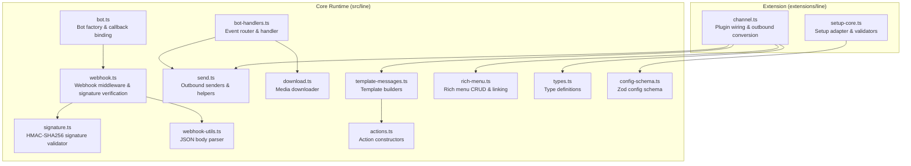
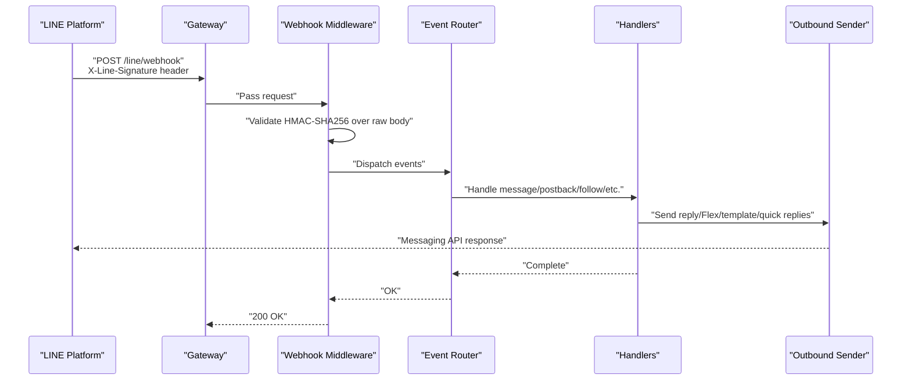
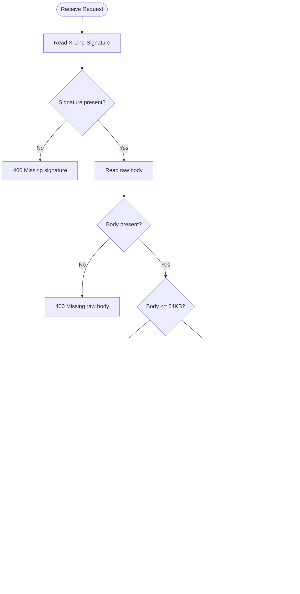
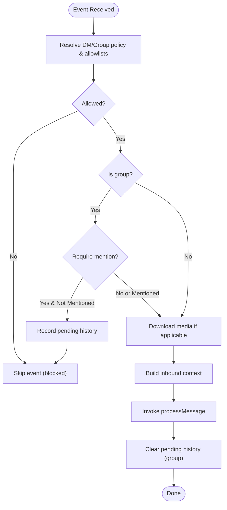
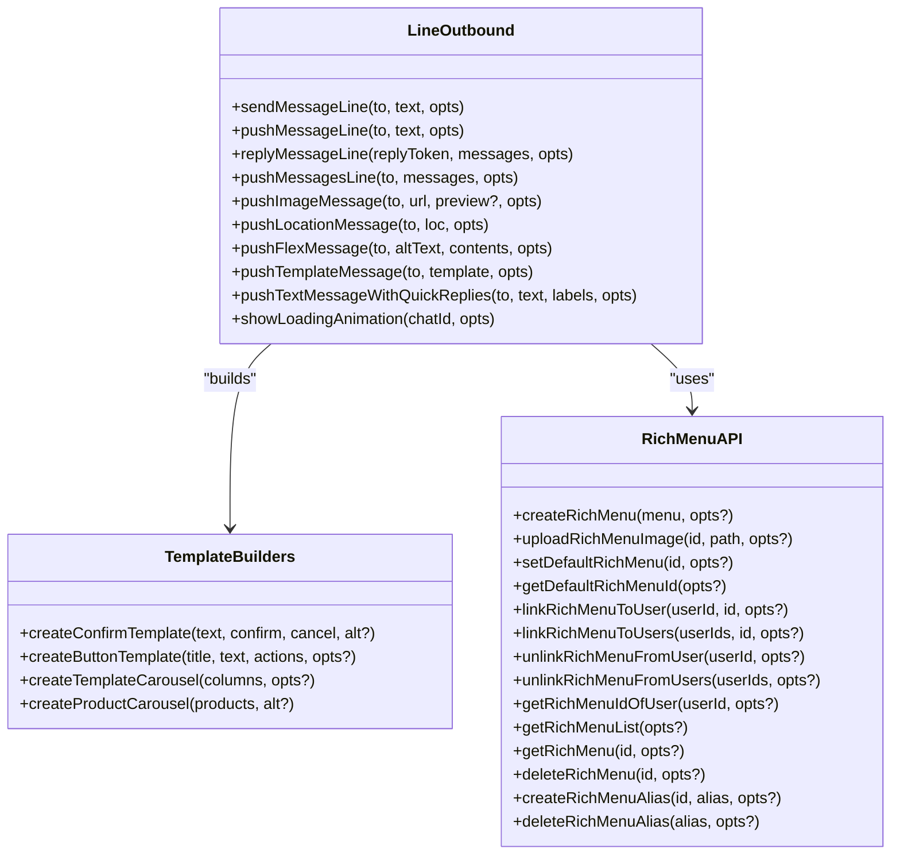
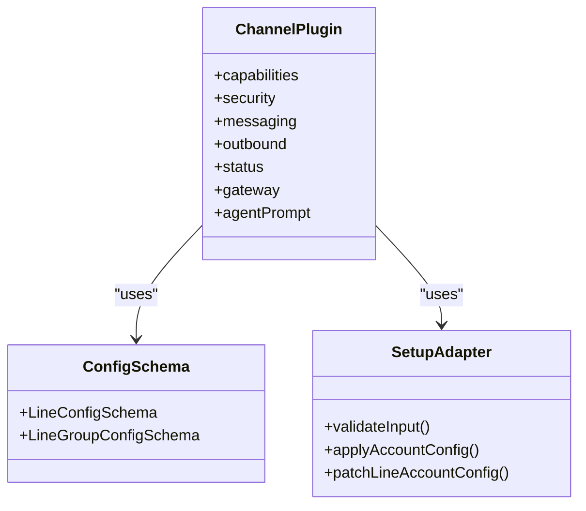
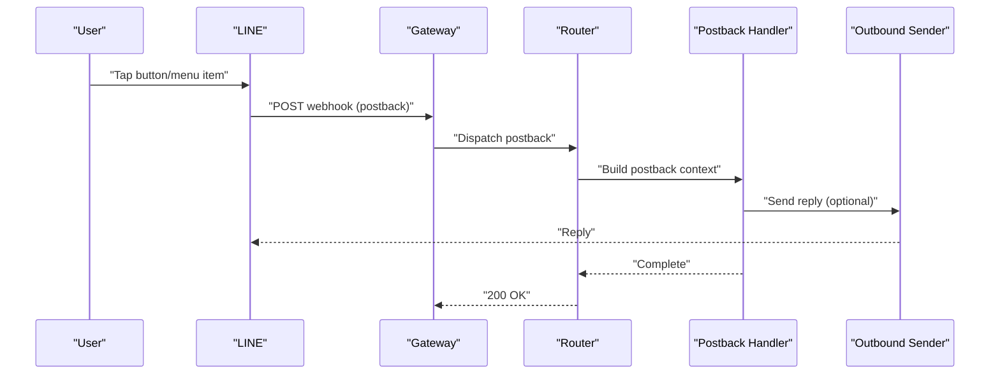
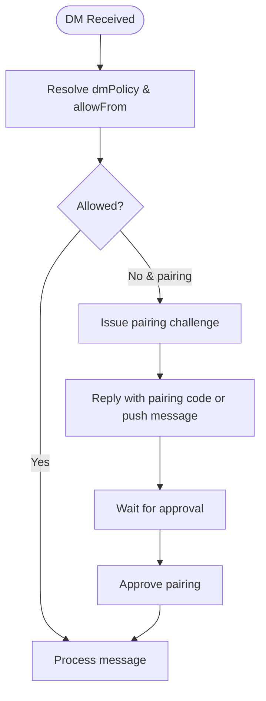
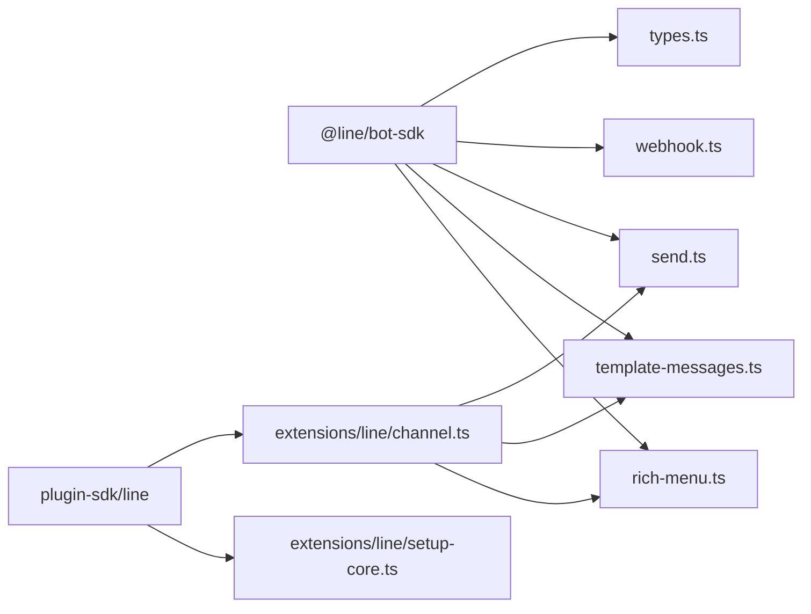

# LINE Integration

<cite>
**Referenced Files in This Document**
- [docs/channels/line.md](file://docs/channels/line)
- [src/line/types.ts](file://src/line/types)
- [src/line/webhook.ts](file://src/line/webhook)
- [src/line/signature.ts](file://src/line/signature)
- [src/line/webhook-utils.ts](file://src/line/webhook-utils)
- [src/line/bot.ts](file://src/line/bot)
- [src/line/config-schema.ts](file://src/line/config-schema)
- [src/line/bot-handlers.ts](file://src/line/bot-handlers)
- [src/line/send.ts](file://src/line/send)
- [src/line/download.ts](file://src/line/download)
- [src/line/actions.ts](file://src/line/actions)
- [src/line/template-messages.ts](file://src/line/template-messages)
- [src/line/rich-menu.ts](file://src/line/rich-menu)
- [src/line/flex-templates.ts](file://src/line/flex-templates)
- [extensions/line/src/channel.ts](file://extensions/line/src/channel)
- [extensions/line/src/setup-core.ts](file://extensions/line/src/setup-core)
</cite>

## Table of Contents
1. [Introduction](#introduction)
2. [Project Structure](#project-structure)
3. [Core Components](#core-components)
4. [Architecture Overview](#architecture-overview)
5. [Detailed Component Analysis](#detailed-component-analysis)
6. [Dependency Analysis](#dependency-analysis)
7. [Performance Considerations](#performance-considerations)
8. [Troubleshooting Guide](#troubleshooting-guide)
9. [Conclusion](#conclusion)
10. [Appendices](#appendices)

## Introduction
This document explains how OpenClaw integrates with the LINE Messaging API. It covers channel bot setup, access token and webhook configuration, inbound event handling, outbound messaging (text, images, videos, audio, locations, Flex messages, template messages), user authentication and pairing, rich menu management, and webhook security. It also provides troubleshooting guidance and practical examples for postback events, quick replies, and interactive menu systems.

## Project Structure
The LINE integration spans two primary areas:
- Core runtime implementation under src/line: webhook parsing, signature verification, inbound event processing, outbound sending, media downloading, and LINE-specific message builders.
- Extension implementation under extensions/line: plugin wiring, configuration schema, setup wizard, and outbound payload conversion.

**Diagram sources**
- [src/line/webhook.ts:1-117](file://src/line/webhook.ts#L1-L117)
- [src/line/signature.ts:1-19](file://src/line/signature.ts#L1-L19)
- [src/line/webhook-utils.ts:1-10](file://src/line/webhook-utils.ts#L1-L10)
- [src/line/bot.ts:1-84](file://src/line/bot.ts#L1-L84)
- [src/line/bot-handlers.ts:1-715](file://src/line/bot-handlers.ts#L1-L715)
- [src/line/send.ts:1-475](file://src/line/send.ts#L1-L475)
- [src/line/download.ts:1-126](file://src/line/download.ts#L1-L126)
- [src/line/template-messages.ts:1-356](file://src/line/template-messages.ts#L1-L356)
- [src/line/rich-menu.ts:1-394](file://src/line/rich-menu.ts#L1-L394)
- [src/line/actions.ts:1-62](file://src/line/actions.ts#L1-L62)
- [src/line/types.ts:1-144](file://src/line/types.ts#L1-L144)
- [src/line/config-schema.ts:1-43](file://src/line/config-schema.ts#L1-L43)
- [extensions/line/src/channel.ts:1-615](file://extensions/line/src/channel.ts#L1-L615)
- [extensions/line/src/setup-core.ts:1-163](file://extensions/line/src/setup-core.ts#L1-L163)

**Section sources**
- [docs/channels/line.md:1-194](file://docs/channels/line.md#L1-L194)
- [src/line/types.ts:1-144](file://src/line/types.ts#L1-L144)
- [src/line/webhook.ts:1-117](file://src/line/webhook.ts#L1-L117)
- [src/line/bot.ts:1-84](file://src/line/bot.ts#L1-L84)
- [src/line/bot-handlers.ts:1-715](file://src/line/bot-handlers.ts#L1-L715)
- [src/line/send.ts:1-475](file://src/line/send.ts#L1-L475)
- [src/line/template-messages.ts:1-356](file://src/line/template-messages.ts#L1-L356)
- [src/line/rich-menu.ts:1-394](file://src/line/rich-menu.ts#L1-L394)
- [extensions/line/src/channel.ts:1-615](file://extensions/line/src/channel.ts#L1-L615)
- [extensions/line/src/setup-core.ts:1-163](file://extensions/line/src/setup-core.ts#L1-L163)

## Core Components
- Webhook receiver and signature verification: Validates LINE’s X-Line-Signature header using HMAC-SHA256 over the raw request body and enforces a strict maximum payload size.
- Event router: Routes inbound events (message, follow, unfollow, join, leave, postback) to specialized handlers.
- Outbound sender: Supports text, image, location, Flex, template, and quick reply messages; includes media URL support and loading animations.
- Media handling: Downloads LINE media content to temporary files with size limits and content-type detection.
- Template and rich menu builders: Provides helpers to construct confirm/buttons/carousel templates and rich menu structures.
- Plugin integration: Exposes a channel plugin that integrates with OpenClaw’s configuration, security, and outbound pipeline.

**Section sources**
- [src/line/webhook.ts:1-117](file://src/line/webhook.ts#L1-L117)
- [src/line/signature.ts:1-19](file://src/line/signature.ts#L1-L19)
- [src/line/bot-handlers.ts:652-715](file://src/line/bot-handlers.ts#L652-L715)
- [src/line/send.ts:215-475](file://src/line/send.ts#L215-L475)
- [src/line/download.ts:1-126](file://src/line/download.ts#L1-L126)
- [src/line/template-messages.ts:1-356](file://src/line/template-messages.ts#L1-L356)
- [src/line/rich-menu.ts:1-394](file://src/line/rich-menu.ts#L1-L394)
- [extensions/line/src/channel.ts:1-615](file://extensions/line/src/channel.ts#L1-L615)

## Architecture Overview
The LINE integration follows a webhook-first architecture:
- Gateway exposes a webhook endpoint that accepts LINE’s signed POST requests.
- Middleware validates the signature and parses the body.
- Events are routed to handlers that enforce access control (DM/group policies, allowlists, pairing).
- Handlers may download media, build context, and invoke the configured message processor.
- Outbound messages are sent via LINE Messaging API clients, optionally with rich media and quick replies.

**Diagram sources**
- [src/line/webhook.ts:36-87](file://src/line/webhook.ts#L36-L87)
- [src/line/bot-handlers.ts:652-715](file://src/line/bot-handlers.ts#L652-L715)
- [src/line/send.ts:192-213](file://src/line/send.ts#L192-L213)

## Detailed Component Analysis

### Webhook Security and Signature Verification
- Signature verification uses HMAC-SHA256 over the raw request body against the configured channel secret.
- Body-dependent verification requires strict pre-auth limits and timeouts to mitigate abuse.
- The middleware rejects missing signatures, missing raw bodies, oversized payloads, and invalid signatures.

**Diagram sources**
- [src/line/webhook.ts:16-87](file://src/line/webhook.ts#L16-L87)
- [src/line/signature.ts:1-19](file://src/line/signature.ts#L1-L19)

**Section sources**
- [src/line/webhook.ts:1-117](file://src/line/webhook.ts#L1-L117)
- [src/line/signature.ts:1-19](file://src/line/signature.ts#L1-L19)
- [docs/channels/line.md:51-54](file://docs/channels/line.md#L51-L54)

### Inbound Event Handling and Access Control
- The router enforces DM and group policies, allowlists, and pairing challenges.
- For group chats, optional mention gating can be configured per group.
- Media downloads are attempted for downloadable message types, with size limits and safe temp storage.
- Pending history is recorded for group messages that are skipped due to mention gating.

**Diagram sources**
- [src/line/bot-handlers.ts:286-599](file://src/line/bot-handlers.ts#L286-L599)

**Section sources**
- [src/line/bot-handlers.ts:1-715](file://src/line/bot-handlers.ts#L1-L715)
- [src/line/download.ts:1-126](file://src/line/download.ts#L1-L126)

### Outbound Messaging and Rich Media
- Text messages are chunked at 5000 characters and Markdown is processed.
- Quick replies can be attached inline with text or as part of rich message batches.
- Locations, Flex messages, and templates are supported via dedicated builders and senders.
- Loading animations can be shown to improve perceived responsiveness.

**Diagram sources**
- [src/line/send.ts:215-475](file://src/line/send.ts#L215-L475)
- [src/line/template-messages.ts:1-356](file://src/line/template-messages.ts#L1-L356)
- [src/line/rich-menu.ts:1-394](file://src/line/rich-menu.ts#L1-L394)

**Section sources**
- [src/line/send.ts:1-475](file://src/line/send.ts#L1-L475)
- [src/line/template-messages.ts:1-356](file://src/line/template-messages.ts#L1-L356)
- [src/line/rich-menu.ts:1-394](file://src/line/rich-menu.ts#L1-L394)
- [docs/channels/line.md:144-185](file://docs/channels/line.md#L144-L185)

### Plugin Integration and Configuration
- The extension defines a channel plugin with capabilities, security, messaging, and outbound integrations.
- Configuration schema supports single or multiple accounts, per-group overrides, and runtime policies.
- Setup adapter validates inputs and writes configuration for default and named accounts.

**Diagram sources**
- [extensions/line/src/channel.ts:67-615](file://extensions/line/src/channel.ts#L67-L615)
- [src/line/config-schema.ts:1-43](file://src/line/config-schema.ts#L1-L43)
- [extensions/line/src/setup-core.ts:1-163](file://extensions/line/src/setup-core.ts#L1-L163)

**Section sources**
- [extensions/line/src/channel.ts:1-615](file://extensions/line/src/channel.ts#L1-L615)
- [src/line/config-schema.ts:1-43](file://src/line/config-schema.ts#L1-L43)
- [extensions/line/src/setup-core.ts:1-163](file://extensions/line/src/setup-core.ts#L1-L163)

### Postback Events and Interactive Menus
- Postback events are parsed and routed similarly to message events, respecting access control and command authorization.
- Template messages support postback actions; rich menus can be created with actionable areas.
- Quick replies can be attached inline with text or as part of rich message batches.

**Diagram sources**
- [src/line/bot-handlers.ts:627-650](file://src/line/bot-handlers.ts#L627-L650)
- [src/line/template-messages.ts:27-35](file://src/line/template-messages.ts#L27-L35)
- [src/line/rich-menu.ts:344-390](file://src/line/rich-menu.ts#L344-L390)

**Section sources**
- [src/line/bot-handlers.ts:627-650](file://src/line/bot-handlers.ts#L627-L650)
- [src/line/template-messages.ts:1-356](file://src/line/template-messages.ts#L1-L356)
- [src/line/rich-menu.ts:1-394](file://src/line/rich-menu.ts#L1-L394)

### User Authentication, Friend Management, and Profiles
- DM policy defaults to pairing; unknown senders receive a pairing challenge and their messages are held until approved.
- Allowlists and group policies can be configured; per-group overrides are supported.
- User profiles (display name, picture URL) are cached and retrieved via the Messaging API.

**Diagram sources**
- [src/line/bot-handlers.ts:235-284](file://src/line/bot-handlers.ts#L235-L284)
- [src/line/send.ts:429-475](file://src/line/send.ts#L429-L475)

**Section sources**
- [docs/channels/line.md:110-134](file://docs/channels/line.md#L110-L134)
- [src/line/bot-handlers.ts:235-284](file://src/line/bot-handlers.ts#L235-L284)
- [src/line/send.ts:429-475](file://src/line/send.ts#L429-L475)

### LINE Pay, Location Sharing, and Stamp/Emoji Handling
- Location messages are supported via dedicated builders and senders.
- Sticker messages are recognized as LINE message types and can be handled by media download logic if applicable.
- There is no explicit LINE Pay integration in the current implementation.

**Section sources**
- [src/line/types.ts:59-65](file://src/line/types.ts#L59-L65)
- [src/line/send.ts:311-324](file://src/line/send.ts#L311-L324)
- [src/line/bot-handlers.ts:59-70](file://src/line/bot-handlers.ts#L59-L70)

## Dependency Analysis
- Core runtime depends on the LINE SDK for Messaging API clients and webhook event types.
- The extension depends on OpenClaw’s plugin SDK for configuration, security, and outbound conversion.
- Template builders depend on action constructors; rich menu helpers depend on Messaging API blob clients.

**Diagram sources**
- [src/line/types.ts:1-144](file://src/line/types.ts#L1-L144)
- [src/line/webhook.ts:1-117](file://src/line/webhook.ts#L1-L117)
- [src/line/send.ts:1-475](file://src/line/send.ts#L1-L475)
- [src/line/template-messages.ts:1-356](file://src/line/template-messages.ts#L1-L356)
- [src/line/rich-menu.ts:1-394](file://src/line/rich-menu.ts#L1-L394)
- [extensions/line/src/channel.ts:1-615](file://extensions/line/src/channel.ts#L1-L615)
- [extensions/line/src/setup-core.ts:1-163](file://extensions/line/src/setup-core.ts#L1-L163)

**Section sources**
- [src/line/types.ts:1-144](file://src/line/types.ts#L1-L144)
- [extensions/line/src/channel.ts:1-615](file://extensions/line/src/channel.ts#L1-L615)

## Performance Considerations
- Webhook body size is strictly limited to reduce memory pressure during signature verification.
- Media downloads are streamed with a configurable maximum size to avoid excessive disk usage.
- Outbound batching is applied when sending multiple rich messages to respect LINE SDK constraints.
- User profile caching reduces repeated API calls for profile retrieval.

[No sources needed since this section provides general guidance]

## Troubleshooting Guide
Common issues and resolutions:
- Webhook verification fails: Ensure the webhook URL is HTTPS and the channel secret matches the LINE console.
- No inbound events: Confirm the webhook path matches the configured path and the gateway is reachable from LINE.
- Media download errors: Increase the media size limit if media exceeds the default cap.
- Rate limiting and delivery problems: Review outbound activity metrics and adjust throttling; ensure reply tokens are available for immediate responses.

**Section sources**
- [docs/channels/line.md:186-194](file://docs/channels/line.md#L186-L194)
- [src/line/webhook.ts:56-65](file://src/line/webhook.ts#L56-L65)
- [src/line/send.ts:151-190](file://src/line/send.ts#L151-L190)

## Conclusion
The LINE integration provides a robust, secure, and feature-rich bridge to the LINE Messaging API. It supports modern rich messages, interactive menus, and flexible access controls while maintaining strong security through signature verification and strict payload limits. The extension cleanly integrates with OpenClaw’s configuration and runtime, enabling straightforward deployment and maintenance.

[No sources needed since this section summarizes without analyzing specific files]

## Appendices

### Setup and Configuration Reference
- Install the LINE plugin and configure credentials and policies.
- Use environment variables or token/secret files for credentials.
- Configure multiple accounts and per-group overrides.

**Section sources**
- [docs/channels/line.md:20-108](file://docs/channels/line.md#L20-L108)
- [src/line/config-schema.ts:1-43](file://src/line/config-schema.ts#L1-L43)
- [extensions/line/src/setup-core.ts:82-160](file://extensions/line/src/setup-core.ts#L82-L160)

### Example Workflows
- Handling postback events: Build a postback context and route to the message processor.
- Quick replies and rich messages: Attach quick replies inline with text or send as part of a rich message batch.
- Interactive menu systems: Create rich menus with actionable areas and link to users.

**Section sources**
- [src/line/bot-handlers.ts:627-650](file://src/line/bot-handlers.ts#L627-L650)
- [src/line/template-messages.ts:289-356](file://src/line/template-messages.ts#L289-L356)
- [src/line/rich-menu.ts:344-390](file://src/line/rich-menu.ts#L344-L390)