# Major Messaging Platforms

<cite>
**Referenced Files in This Document**
- [docs/channels/index.md](file://docs/channels/index.md)
- [docs/channels/telegram.md](file://docs/channels/telegram.md)
- [docs/channels/whatsapp.md](file://docs/channels/whatsapp.md)
- [docs/channels/discord.md](file://docs/channels/discord.md)
- [docs/channels/slack.md](file://docs/channels/slack.md)
- [docs/channels/irc.md](file://docs/channels/irc.md)
- [docs/channels/googlechat.md](file://docs/channels/googlechat.md)
- [docs/channels/imessage.md](file://docs/channels/imessage.md)
- [docs/channels/line.md](file://docs/channels/line.md)
- [extensions/telegram/index.ts](file://extensions/telegram/index.ts)
- [extensions/whatsapp/index.ts](file://extensions/whatsapp/index.ts)
- [extensions/discord/src/index.ts](file://extensions/discord/src/index.ts)
- [extensions/slack/src/index.ts](file://extensions/slack/src/index.ts)
- [extensions/irc/index.ts](file://extensions/irc/index.ts)
- [extensions/googlechat/index.ts](file://extensions/googlechat/index.ts)
- [extensions/imessage/index.ts](file://extensions/imessage/index.ts)
- [extensions/line/index.ts](file://extensions/line/index.ts)
</cite>

## Table of Contents
1. [Introduction](#introduction)
2. [Project Structure](#project-structure)
3. [Core Components](#core-components)
4. [Architecture Overview](#architecture-overview)
5. [Detailed Component Analysis](#detailed-component-analysis)
6. [Dependency Analysis](#dependency-analysis)
7. [Performance Considerations](#performance-considerations)
8. [Troubleshooting Guide](#troubleshooting-guide)
9. [Conclusion](#conclusion)

## Introduction
This document covers the nine primary messaging platforms integrated by OpenClaw: Telegram, WhatsApp, Discord, Slack, IRC, Google Chat, iMessage, LINE, and others referenced in the channels index. For each platform, we describe setup, authentication, configuration options, message handling, media support, and troubleshooting. The goal is to provide a practical, step-by-step guide for deploying and operating these channels reliably.

## Project Structure
OpenClaw organizes channel documentation under docs/channels and channel-specific plugins under extensions. Each channel’s documentation includes quick setup steps, configuration references, access control, runtime behavior, and troubleshooting. Plugins encapsulate platform-specific integrations and actions.

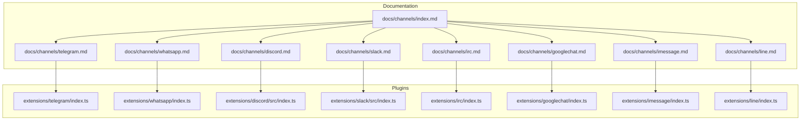

**Diagram sources**
- [docs/channels/index.md:1-48](file://docs/channels/index.md#L1-L48)
- [extensions/telegram/index.ts:1-1](file://extensions/telegram/index.ts#L1-L1)
- [extensions/whatsapp/index.ts:1-1](file://extensions/whatsapp/index.ts#L1-L1)
- [extensions/discord/src/index.ts:1-26](file://extensions/discord/src/index.ts#L1-L26)
- [extensions/slack/src/index.ts:1-26](file://extensions/slack/src/index.ts#L1-L26)
- [extensions/irc/index.ts:1-1](file://extensions/irc/index.ts#L1-L1)
- [extensions/googlechat/index.ts:1-1](file://extensions/googlechat/index.ts#L1-L1)
- [extensions/imessage/index.ts:1-1](file://extensions/imessage/index.ts#L1-L1)
- [extensions/line/index.ts:1-1](file://extensions/line/index.ts#L1-L1)

**Section sources**
- [docs/channels/index.md:1-48](file://docs/channels/index.md#L1-L48)

## Core Components
- Telegram: Bot API via grammY; supports long polling and optional webhook mode; robust DM/group access control, inline buttons, stickers, forum topics, and reaction notifications.
- WhatsApp: Web channel via Baileys; QR pairing; DM/group allowlists; media handling; read receipts; multi-account credentials.
- Discord: Bot API; native slash commands; guild channels; forum/media channels; interactive components; reaction notifications; persistent ACP bindings.
- Slack: Socket Mode and HTTP Events API; DMs/channels; interactive replies; streaming; reaction typing fallback; user vs bot token roles.
- IRC: Classic IRC networks; channel allowlists; sender allowlists; mention gating; NickServ; TLS; environment variables.
- Google Chat: HTTP webhook; Google Workspace authentication; DMs/spaces; pairing; reactions; typing indicators; media ingestion.
- iMessage: Legacy imsg JSON-RPC over stdio; remote Mac SSH wrapper; attachments; permissions; multi-account patterns.
- LINE: Messaging API plugin; webhook receiver; access token/secret; DMs/groups; media/Flex/template/quick replies; pairing.

**Section sources**
- [docs/channels/telegram.md:1-982](file://docs/channels/telegram.md#L1-L982)
- [docs/channels/whatsapp.md:1-446](file://docs/channels/whatsapp.md#L1-L446)
- [docs/channels/discord.md:1-1224](file://docs/channels/discord.md#L1-L1224)
- [docs/channels/slack.md:1-604](file://docs/channels/slack.md#L1-L604)
- [docs/channels/irc.md:1-242](file://docs/channels/irc.md#L1-L242)
- [docs/channels/googlechat.md:1-262](file://docs/channels/googlechat.md#L1-L262)
- [docs/channels/imessage.md:1-368](file://docs/channels/imessage.md#L1-L368)
- [docs/channels/line.md:1-194](file://docs/channels/line.md#L1-L194)

## Architecture Overview
OpenClaw’s channel architecture centers on a Gateway that owns connections and routes messages deterministically. Each channel plugin implements platform-specific authentication, message normalization, and outbound actions. Access control and activation policies are enforced per channel and per account.

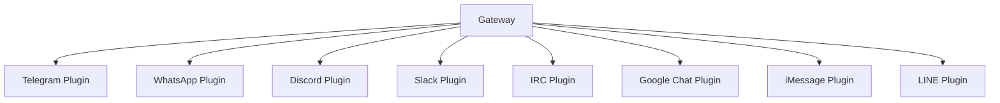

**Diagram sources**
- [extensions/telegram/index.ts:1-1](file://extensions/telegram/index.ts#L1-L1)
- [extensions/whatsapp/index.ts:1-1](file://extensions/whatsapp/index.ts#L1-L1)
- [extensions/discord/src/index.ts:1-26](file://extensions/discord/src/index.ts#L1-L26)
- [extensions/slack/src/index.ts:1-26](file://extensions/slack/src/index.ts#L1-L26)
- [extensions/irc/index.ts:1-1](file://extensions/irc/index.ts#L1-L1)
- [extensions/googlechat/index.ts:1-1](file://extensions/googlechat/index.ts#L1-L1)
- [extensions/imessage/index.ts:1-1](file://extensions/imessage/index.ts#L1-L1)
- [extensions/line/index.ts:1-1](file://extensions/line/index.ts#L1-L1)

## Detailed Component Analysis

### Telegram Integration
- Setup: Create a bot via BotFather, obtain token, configure dmPolicy and groups, and approve pairing.
- Authentication: Bot token; optional environment fallback TELEGRAM_BOT_TOKEN.
- Message handling: Long polling default; optional webhook mode with path/host/port/secret.
- Media: Supports stickers, audio/voice, video notes; mediaMaxMb limit; inline buttons gated by capability scope.
- Access control: dmPolicy allowlist/open/disabled; groupPolicy allowlist/open/disabled; per-topic overrides.
- Features: Live preview streaming (partial/block/progress), native commands, reply threading tags, forum topics, reaction notifications, ack reactions, config writes.

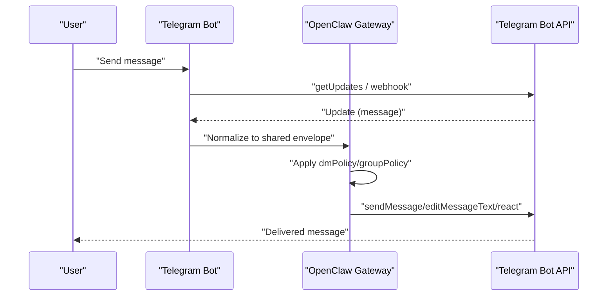

**Diagram sources**
- [docs/channels/telegram.md:248-289](file://docs/channels/telegram.md#L248-L289)
- [docs/channels/telegram.md:732-748](file://docs/channels/telegram.md#L732-L748)

**Section sources**
- [docs/channels/telegram.md:24-69](file://docs/channels/telegram.md#L24-L69)
- [docs/channels/telegram.md:750-795](file://docs/channels/telegram.md#L750-L795)
- [docs/channels/telegram.md:258-289](file://docs/channels/telegram.md#L258-L289)

### WhatsApp Integration (Web)
- Setup: Configure dmPolicy/groupPolicy/allowlists, QR login via channels login, start gateway, approve pairing.
- Session management: Gateway owns linked session; self-chat protections when linked self number is in allowFrom.
- Device pairing: QR-based; pairing list/approve commands; pending requests capped.
- Access control: dmPolicy allowlist/open/disabled; groupPolicy allowlist/open/disabled; groupAllowFrom; mention gating.
- Media: Image/video/audio/document; voice-note rewrite; animated GIF playback; mediaMaxMb caps; read receipts.

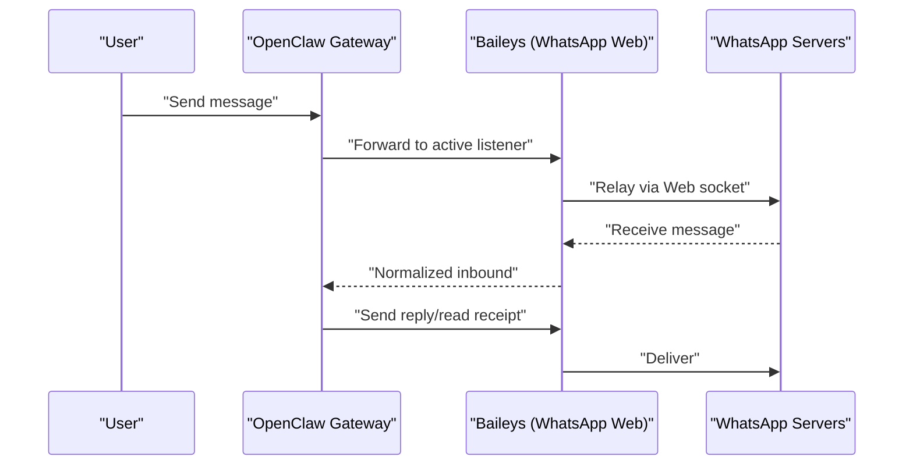

**Diagram sources**
- [docs/channels/whatsapp.md:126-133](file://docs/channels/whatsapp.md#L126-L133)
- [docs/channels/whatsapp.md:374-424](file://docs/channels/whatsapp.md#L374-L424)

**Section sources**
- [docs/channels/whatsapp.md:24-76](file://docs/channels/whatsapp.md#L24-L76)
- [docs/channels/whatsapp.md:134-200](file://docs/channels/whatsapp.md#L134-L200)
- [docs/channels/whatsapp.md:292-316](file://docs/channels/whatsapp.md#L292-L316)

### Discord Bot Integration
- Setup: Create app/bot, enable intents, copy tokens, invite bot, enable DMs, configure token and pairing.
- Permission management: Message Content Intent required; Server Members Intent recommended; role-based agent routing via bindings.
- Forum support: Auto-create threads from parent channel; media channels accept thread posts; components v2 containers.
- Access control: dmPolicy allowlist/open/disabled; guild allowlist with users/roles; per-channel requireMention; ignoreOtherMentions.

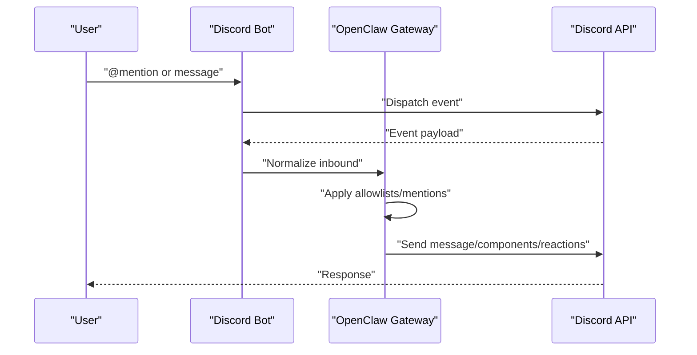

**Diagram sources**
- [docs/channels/discord.md:255-263](file://docs/channels/discord.md#L255-L263)
- [docs/channels/discord.md:463-488](file://docs/channels/discord.md#L463-L488)

**Section sources**
- [docs/channels/discord.md:24-167](file://docs/channels/discord.md#L24-L167)
- [docs/channels/discord.md:369-461](file://docs/channels/discord.md#L369-L461)
- [docs/channels/discord.md:264-286](file://docs/channels/discord.md#L264-L286)

### Slack Socket Mode Implementation
- Setup: Socket Mode (xapp/xoxb tokens) or HTTP Events API (botToken/signingSecret/webhookPath).
- Workspace integration: DMs/channels; MPIMs; thread replies; reply tagging; interactive replies (Slack Block Kit).
- Real-time events: Message edits/deletes, reactions, member joins/leaves, channel renames, pin events; assistant thread status via assistant:write.
- Commands: Native commands require registration; slash command behavior and ephemeral sessions.

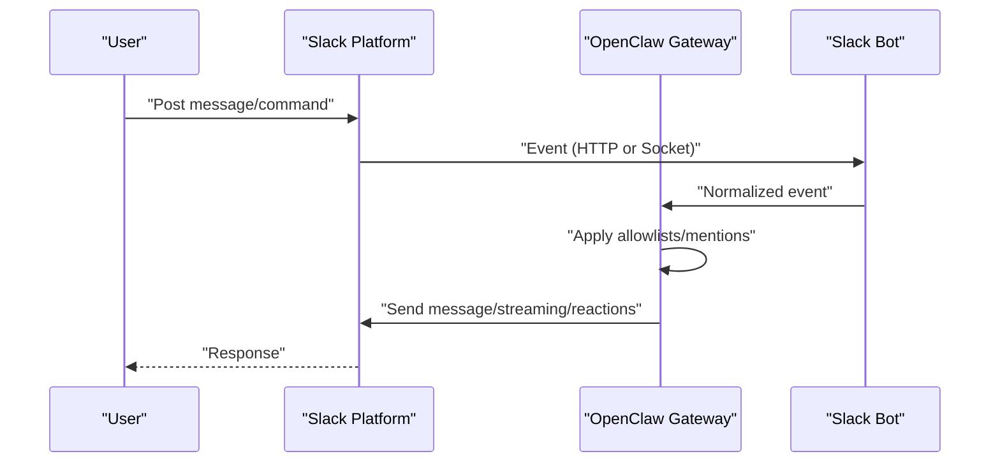

**Diagram sources**
- [docs/channels/slack.md:347-358](file://docs/channels/slack.md#L347-L358)
- [docs/channels/slack.md:541-581](file://docs/channels/slack.md#L541-L581)

**Section sources**
- [docs/channels/slack.md:24-121](file://docs/channels/slack.md#L24-L121)
- [docs/channels/slack.md:136-205](file://docs/channels/slack.md#L136-L205)
- [docs/channels/slack.md:283-331](file://docs/channels/slack.md#L283-L331)

### IRC Network Connectivity
- Setup: Configure host/port/TLS/nick/channels; start gateway.
- Channel routing: Classic channels (#room) and DMs; TLS recommended.
- Access control: dmPolicy pairing; groupPolicy allowlist; per-channel allowFrom; mention gating via patterns.
- NickServ: Optional identification and one-time registration; environment variables for defaults.

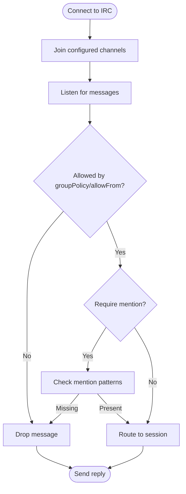

**Diagram sources**
- [docs/channels/irc.md:46-62](file://docs/channels/irc.md#L46-L62)
- [docs/channels/irc.md:89-112](file://docs/channels/irc.md#L89-L112)

**Section sources**
- [docs/channels/irc.md:13-38](file://docs/channels/irc.md#L13-L38)
- [docs/channels/irc.md:46-88](file://docs/channels/irc.md#L46-L88)
- [docs/channels/irc.md:187-221](file://docs/channels/irc.md#L187-L221)

### Google Chat Webhook Integration
- Setup: Service account + JSON key; enable Google Chat API; configure webhook audience (app URL or project number).
- Authentication: Bearer auth verification; optional systemIdToken support; webhook path exposure via Tailscale Funnel or reverse proxy.
- Message routing: DMs use direct sessions; spaces use group sessions; pairing for DMs; mention gating for spaces.
- Actions: Reactions via actions; typing indicators (message or reaction); mediaMaxMb cap.

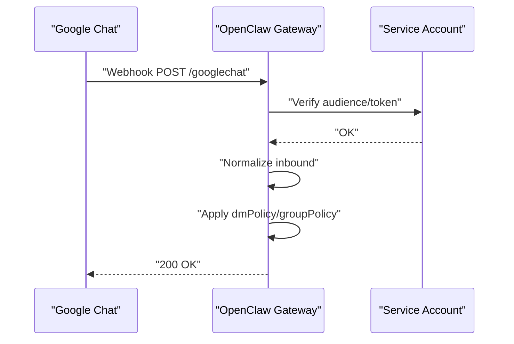

**Diagram sources**
- [docs/channels/googlechat.md:139-153](file://docs/channels/googlechat.md#L139-L153)
- [docs/channels/googlechat.md:209-256](file://docs/channels/googlechat.md#L209-L256)

**Section sources**
- [docs/channels/googlechat.md:12-51](file://docs/channels/googlechat.md#L12-L51)
- [docs/channels/googlechat.md:163-207](file://docs/channels/googlechat.md#L163-L207)

### iMessage Integration (Legacy)
- Setup: Local Mac with imsg CLI or remote Mac via SSH wrapper; configure cliPath/dbPath; start gateway; approve pairing.
- Permissions: Full Disk Access and Automation required; one-time interactive prompts in target context.
- Media: Optional attachment ingestion; SCP fetches when remoteHost set; allowed roots validation.
- Multi-account: Per-account overrides for paths, allowlists, and attachment roots.

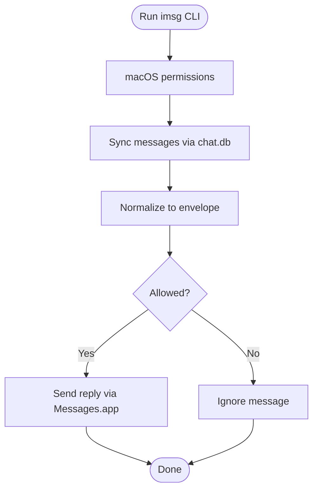

**Diagram sources**
- [docs/channels/imessage.md:117-133](file://docs/channels/imessage.md#L117-L133)
- [docs/channels/imessage.md:247-286](file://docs/channels/imessage.md#L247-L286)

**Section sources**
- [docs/channels/imessage.md:31-115](file://docs/channels/imessage.md#L31-L115)
- [docs/channels/imessage.md:134-185](file://docs/channels/imessage.md#L134-L185)
- [docs/channels/imessage.md:304-360](file://docs/channels/imessage.md#L304-L360)

### LINE Messaging API
- Setup: Install LINE plugin; create Messaging API channel; copy access token/secret; set webhook URL; configure dmPolicy/groupPolicy.
- Webhook handling: Strict pre-auth body limits; HMAC verification over raw body; custom webhookPath per account.
- Message behavior: Text chunking (5000), Markdown stripping, Flex/template/quick replies, mediaMaxMb cap.

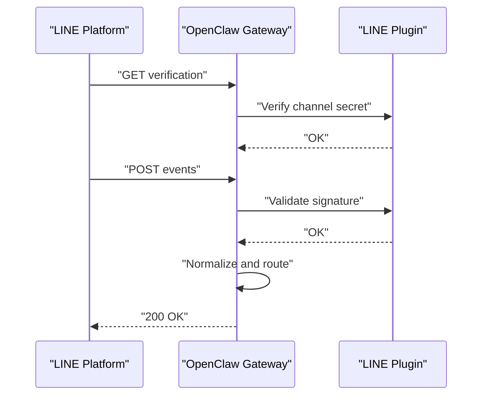

**Diagram sources**
- [docs/channels/line.md:47-54](file://docs/channels/line.md#L47-L54)
- [docs/channels/line.md:186-194](file://docs/channels/line.md#L186-L194)

**Section sources**
- [docs/channels/line.md:20-51](file://docs/channels/line.md#L20-L51)
- [docs/channels/line.md:110-128](file://docs/channels/line.md#L110-L128)
- [docs/channels/line.md:135-143](file://docs/channels/line.md#L135-L143)

## Dependency Analysis
Channel plugins export account resolvers, actions, monitors, probes, and token resolvers. These enable consistent configuration and operations across accounts and modes.

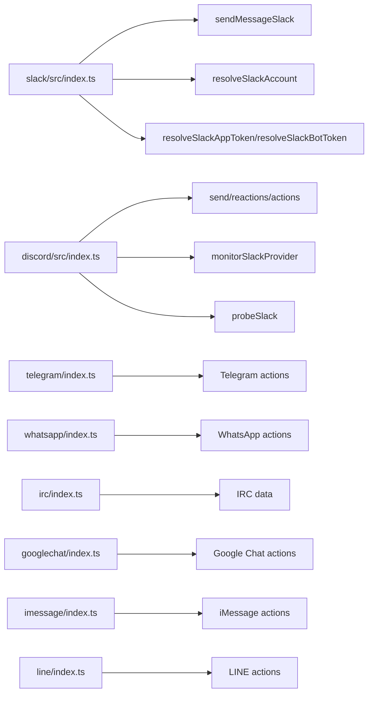

**Diagram sources**
- [extensions/slack/src/index.ts:1-26](file://extensions/slack/src/index.ts#L1-L26)
- [extensions/discord/src/index.ts:1-26](file://extensions/discord/src/index.ts#L1-L26)
- [extensions/telegram/index.ts:1-1](file://extensions/telegram/index.ts#L1-L1)
- [extensions/whatsapp/index.ts:1-1](file://extensions/whatsapp/index.ts#L1-L1)
- [extensions/irc/index.ts:1-1](file://extensions/irc/index.ts#L1-L1)
- [extensions/googlechat/index.ts:1-1](file://extensions/googlechat/index.ts#L1-L1)
- [extensions/imessage/index.ts:1-1](file://extensions/imessage/index.ts#L1-L1)
- [extensions/line/index.ts:1-1](file://extensions/line/index.ts#L1-L1)

**Section sources**
- [extensions/slack/src/index.ts:1-26](file://extensions/slack/src/index.ts#L1-L26)
- [extensions/discord/src/index.ts:1-26](file://extensions/discord/src/index.ts#L1-L26)

## Performance Considerations
- Chunking and limits: Each channel exposes textChunkLimit and mediaMaxMb; tune for throughput and platform constraints.
- Streaming: Partial/block/progress streaming reduces perceived latency; native Slack streaming leverages platform APIs.
- Concurrency: Telegram runners and agent defaults control concurrency; adjust agents.defaults.maxConcurrent as needed.
- Media optimization: Automatic resizing and fallback warnings prevent silent failures on large media.

[No sources needed since this section provides general guidance]

## Troubleshooting Guide
- Telegram: Verify bot token, webhook secret/path/host/port, Privacy Mode, group visibility, and pairing approvals.
- WhatsApp: Ensure QR login succeeded, gateway running, and pairing approvals; check groupPolicy/groupAllowFrom/mention gating.
- Discord: Confirm intents (Message Content, Server Members), permissions, DM privacy settings, and guild allowlist.
- Slack: Validate Socket Mode/HTTP mode tokens, signing secret, Request URLs, and unique webhookPath per account.
- IRC: Check groupPolicy/groups, mention gating, TLS, and NickServ configuration.
- Google Chat: Confirm service account file, audience type/value, webhook path, and public HTTPS exposure.
- iMessage: Verify permissions (Full Disk Access, Automation), CLI availability, and remote attachment SCP keys.
- LINE: Ensure HTTPS webhook URL, channel secret verification, and mediaMaxMb limits.

**Section sources**
- [docs/channels/telegram.md:750-795](file://docs/channels/telegram.md#L750-L795)
- [docs/channels/whatsapp.md:374-424](file://docs/channels/whatsapp.md#L374-L424)
- [docs/channels/discord.md:540-549](file://docs/channels/discord.md#L540-L549)
- [docs/channels/slack.md:482-539](file://docs/channels/slack.md#L482-L539)
- [docs/channels/irc.md:237-242](file://docs/channels/irc.md#L237-L242)
- [docs/channels/googlechat.md:209-256](file://docs/channels/googlechat.md#L209-L256)
- [docs/channels/imessage.md:304-360](file://docs/channels/imessage.md#L304-L360)
- [docs/channels/line.md:186-194](file://docs/channels/line.md#L186-L194)

## Conclusion
OpenClaw integrates nine major messaging platforms with consistent configuration patterns, robust access control, and platform-specific features. Use the quick setup steps and configuration references to deploy channels efficiently, and consult the troubleshooting sections for common issues. For advanced scenarios, leverage per-account overrides, thread bindings, and interactive components to tailor experiences to your workspace.