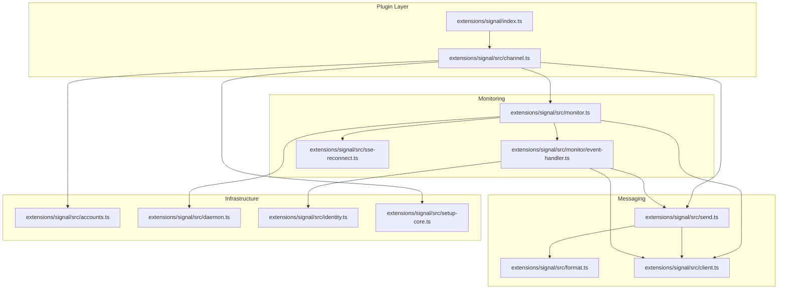
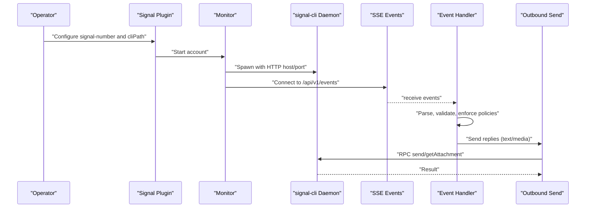
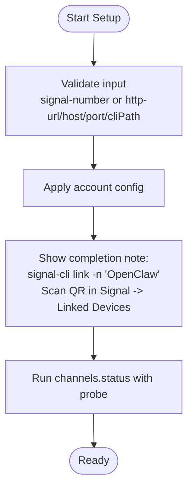
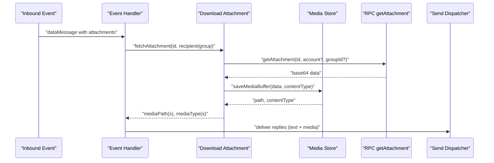
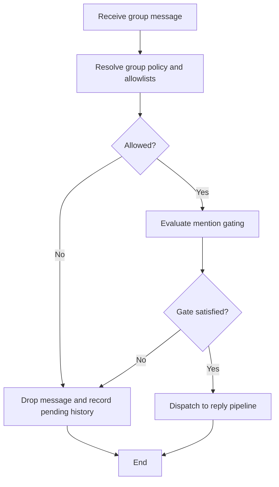
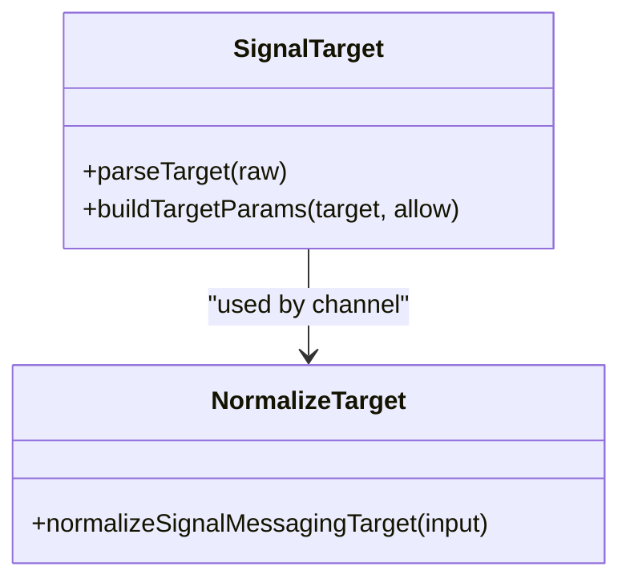
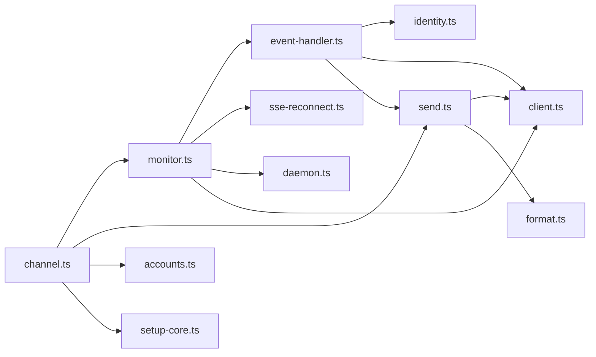

# Signal Integration

<cite>
**Referenced Files in This Document**
- [index.ts](file://extensions/signal/index.ts)
- [channel.ts](file://extensions/signal/src/channel.ts)
- [monitor.ts](file://extensions/signal/src/monitor.ts)
- [send.ts](file://extensions/signal/src/send.ts)
- [client.ts](file://extensions/signal/src/client.ts)
- [setup-core.ts](file://extensions/signal/src/setup-core.ts)
- [accounts.ts](file://extensions/signal/src/accounts.ts)
- [format.ts](file://extensions/signal/src/format.ts)
- [daemon.ts](file://extensions/signal/src/daemon.ts)
- [event-handler.ts](file://extensions/signal/src/monitor/event-handler.ts)
- [identity.ts](file://extensions/signal/src/identity.ts)
- [sse-reconnect.ts](file://extensions/signal/src/sse-reconnect.ts)
- [signal.md](file://docs/channels/signal.md)
</cite>

## Table of Contents
1. [Introduction](#introduction)
2. [Project Structure](#project-structure)
3. [Core Components](#core-components)
4. [Architecture Overview](#architecture-overview)
5. [Detailed Component Analysis](#detailed-component-analysis)
6. [Dependency Analysis](#dependency-analysis)
7. [Performance Considerations](#performance-considerations)
8. [Troubleshooting Guide](#troubleshooting-guide)
9. [Conclusion](#conclusion)
10. [Appendices](#appendices)

## Introduction
This document explains how Signal Private Messenger is integrated into the platform via the Signal channel plugin. It covers the Signal Desktop application setup and linking process for bot accounts, inbound/outbound message handling (text, multimedia, and encrypted attachments), group chat management, contact synchronization, message threading, Signal Protocol encryption considerations, attachment processing, delivery/read receipts, timestamps, troubleshooting, configuration, security best practices, compliance, rate limiting, connection stability, and performance optimization.

## Project Structure
The Signal integration is implemented as a channel plugin with modular components:
- Plugin registration and runtime wiring
- Channel definition and capabilities
- Monitoring and event handling (SSE)
- Outbound messaging and receipts
- Formatting and chunking for Signal-specific text styles
- Daemon orchestration for signal-cli
- Identity and access control
- SSE reconnection and robustness

**Diagram sources**
- [index.ts:1-18](file://extensions/signal/index.ts#L1-L18)
- [channel.ts:1-247](file://extensions/signal/src/channel.ts#L1-L247)
- [monitor.ts:1-485](file://extensions/signal/src/monitor.ts#L1-L485)
- [send.ts:1-250](file://extensions/signal/src/send.ts#L1-L250)
- [client.ts:1-216](file://extensions/signal/src/client.ts#L1-L216)
- [setup-core.ts:1-276](file://extensions/signal/src/setup-core.ts#L1-L276)
- [accounts.ts:1-69](file://extensions/signal/src/accounts.ts#L1-L69)
- [format.ts:1-398](file://extensions/signal/src/format.ts#L1-L398)
- [daemon.ts:1-148](file://extensions/signal/src/daemon.ts#L1-L148)
- [event-handler.ts:1-805](file://extensions/signal/src/monitor/event-handler.ts#L1-L805)
- [identity.ts:1-140](file://extensions/signal/src/identity.ts#L1-L140)
- [sse-reconnect.ts:1-81](file://extensions/signal/src/sse-reconnect.ts#L1-L81)

**Section sources**
- [index.ts:1-18](file://extensions/signal/index.ts#L1-L18)
- [channel.ts:1-247](file://extensions/signal/src/channel.ts#L1-L247)

## Core Components
- Plugin bootstrap and registration
  - Registers the Signal channel with the platform runtime and wires the channel runtime into the plugin lifecycle.
- Channel definition
  - Declares capabilities (direct and group chat, media, reactions), configuration schema, security policies, messaging target normalization, and outbound send pipeline.
- Monitor and SSE
  - Starts/stops the signal-cli daemon, probes readiness, streams events via SSE, and reconnects with exponential backoff.
- Event handler
  - Parses inbound envelopes, enforces access controls (DM/group allowlists), mentions gating, debounces, builds history context, and dispatches replies.
- Outbound messaging
  - Sends text and media, resolves markdown to Signal styles, chunks long text, and supports typing indicators and read receipts.
- Formatting
  - Converts markdown to Signal-formatted text with styles and safe splitting.
- Identity and access
  - Normalizes allowlists (E.164, UUID), checks sender/group permissions, and formats identifiers.
- Daemon orchestration
  - Spawns signal-cli daemon with configurable options and captures structured logs.

**Section sources**
- [channel.ts:95-247](file://extensions/signal/src/channel.ts#L95-L247)
- [monitor.ts:334-485](file://extensions/signal/src/monitor.ts#L334-L485)
- [event-handler.ts:100-805](file://extensions/signal/src/monitor/event-handler.ts#L100-L805)
- [send.ts:99-193](file://extensions/signal/src/send.ts#L99-L193)
- [format.ts:234-397](file://extensions/signal/src/format.ts#L234-L397)
- [identity.ts:1-140](file://extensions/signal/src/identity.ts#L1-L140)
- [daemon.ts:91-148](file://extensions/signal/src/daemon.ts#L91-L148)

## Architecture Overview
High-level flow:
- Setup links a Signal device via signal-cli QR and stores account configuration.
- Gateway starts the monitor which spawns signal-cli daemon and connects to SSE endpoint.
- Inbound events are parsed, validated, and dispatched to the reply pipeline.
- Outbound messages are sent via RPC to signal-cli with optional media and receipts.

**Diagram sources**
- [setup-core.ts:266-271](file://extensions/signal/src/setup-core.ts#L266-L271)
- [monitor.ts:389-426](file://extensions/signal/src/monitor.ts#L389-L426)
- [client.ts:134-216](file://extensions/signal/src/client.ts#L134-L216)
- [event-handler.ts:468-805](file://extensions/signal/src/monitor/event-handler.ts#L468-L805)
- [send.ts:99-193](file://extensions/signal/src/send.ts#L99-L193)

## Detailed Component Analysis

### Signal Desktop Setup and Linking
- The setup wizard validates either a phone number (E.164) or HTTP configuration for signal-cli.
- It provides a completion note instructing the operator to link the device via signal-cli and probe the gateway status.
- The monitor can auto-start signal-cli with configurable host/port and options.

**Diagram sources**
- [setup-core.ts:117-184](file://extensions/signal/src/setup-core.ts#L117-L184)
- [setup-core.ts:266-271](file://extensions/signal/src/setup-core.ts#L266-L271)

**Section sources**
- [setup-core.ts:117-184](file://extensions/signal/src/setup-core.ts#L117-L184)
- [setup-core.ts:266-271](file://extensions/signal/src/setup-core.ts#L266-L271)

### Message Handling: Text, Multimedia, Encrypted Attachments
- Outbound:
  - Supports markdown-to-Signal formatting with styles and safe chunking.
  - Resolves outbound attachments from URLs and enforces media size limits.
  - Sends text and media to recipients or groups via RPC.
- Inbound:
  - Hydrates mentions encoded as object replacement characters.
  - Downloads encrypted attachments via RPC and saves to media store.
  - Builds history context for group chats and debounces bursts.

**Diagram sources**
- [event-handler.ts:704-750](file://extensions/signal/src/monitor/event-handler.ts#L704-L750)
- [monitor.ts:241-286](file://extensions/signal/src/monitor.ts#L241-L286)
- [client.ts:70-107](file://extensions/signal/src/client.ts#L70-L107)

**Section sources**
- [send.ts:99-193](file://extensions/signal/src/send.ts#L99-L193)
- [format.ts:234-397](file://extensions/signal/src/format.ts#L234-L397)
- [monitor.ts:241-286](file://extensions/signal/src/monitor.ts#L241-L286)
- [event-handler.ts:704-750](file://extensions/signal/src/monitor/event-handler.ts#L704-L750)

### Group Chat Management and Contact Synchronization
- Group policy evaluation supports open, disabled, or allowlist modes.
- Allowlists can include E.164 numbers and UUIDs; group-specific allowlists supported.
- Mention gating and require-mention enforcement per group.
- Pending history context maintained for group conversations to enrich replies.

**Diagram sources**
- [event-handler.ts:591-702](file://extensions/signal/src/monitor/event-handler.ts#L591-L702)
- [identity.ts:128-140](file://extensions/signal/src/identity.ts#L128-L140)

**Section sources**
- [event-handler.ts:591-702](file://extensions/signal/src/monitor/event-handler.ts#L591-L702)
- [identity.ts:128-140](file://extensions/signal/src/identity.ts#L128-L140)

### Message Threading and Target Normalization
- Targets support multiple forms: E.164, uuid, group IDs, usernames.
- Messaging target normalization ensures consistent routing.
- Session keys and routing are derived per peer/group for coherent threading.

**Diagram sources**
- [send.ts:37-97](file://extensions/signal/src/send.ts#L37-L97)
- [channel.ts:174-180](file://extensions/signal/src/channel.ts#L174-L180)

**Section sources**
- [send.ts:37-97](file://extensions/signal/src/send.ts#L37-L97)
- [channel.ts:174-180](file://extensions/signal/src/channel.ts#L174-L180)

### Signal Protocol Encryption and End-to-End Encryption
- The integration relies on signal-cli to interface with the Signal network. All cryptographic operations (including Signal Protocol encryption) are handled by signal-cli; the platform communicates via RPC and SSE.
- The monitor and outbound paths do not decrypt or re-encrypt messages; they pass-through encrypted content and metadata to signal-cli.

**Section sources**
- [client.ts:70-107](file://extensions/signal/src/client.ts#L70-L107)
- [monitor.ts:389-426](file://extensions/signal/src/monitor.ts#L389-L426)

### Attachment Processing: Images, Videos, Documents, Voice Messages
- Attachment retrieval uses RPC with base64 payload decoding and saving to the media store.
- MIME-kind detection determines placeholders for inbound summaries.
- Multi-attachment sequences are supported with captions applied to the first item.

**Section sources**
- [monitor.ts:241-286](file://extensions/signal/src/monitor.ts#L241-L286)
- [event-handler.ts:704-750](file://extensions/signal/src/monitor/event-handler.ts#L704-L750)
- [format.ts:63-80](file://extensions/signal/src/format.ts#L63-L80)

### Receipts, Read Receipts, and Timestamp Handling
- Read receipts can be sent by the platform for direct messages when not using daemon-side read receipts.
- Timestamps from envelopes/data messages are used for message IDs and read receipts.
- Typing indicators are sent prior to replies.

**Section sources**
- [send.ts:221-249](file://extensions/signal/src/send.ts#L221-L249)
- [event-handler.ts:756-780](file://extensions/signal/src/monitor/event-handler.ts#L756-L780)
- [send.ts:195-219](file://extensions/signal/src/send.ts#L195-L219)

### Security and Access Control
- DM policy and group policy enforcement via allowlists.
- Sender and group allowlists accept E.164 and UUID entries.
- Pairing approval notifications are sent automatically upon approval.

**Section sources**
- [channel.ts:148-173](file://extensions/signal/src/channel.ts#L148-L173)
- [identity.ts:73-126](file://extensions/signal/src/identity.ts#L73-L126)

### Configuration Examples and Best Practices
- Typical configuration includes account number, signal-cli path, HTTP host/port, and media limits.
- Recommendations:
  - Use allowlists for DMs and groups.
  - Enable ignoreAttachments for privacy or bandwidth constraints.
  - Configure mediaMaxMb appropriately for your environment.
  - Use daemon-side read receipts when available to reduce duplicate sends.

**Section sources**
- [accounts.ts:43-53](file://extensions/signal/src/accounts.ts#L43-L53)
- [monitor.ts:376-378](file://extensions/signal/src/monitor.ts#L376-L378)

## Dependency Analysis

**Diagram sources**
- [channel.ts:1-247](file://extensions/signal/src/channel.ts#L1-L247)
- [monitor.ts:1-485](file://extensions/signal/src/monitor.ts#L1-L485)
- [send.ts:1-250](file://extensions/signal/src/send.ts#L1-L250)
- [client.ts:1-216](file://extensions/signal/src/client.ts#L1-L216)
- [setup-core.ts:1-276](file://extensions/signal/src/setup-core.ts#L1-L276)
- [accounts.ts:1-69](file://extensions/signal/src/accounts.ts#L1-L69)
- [format.ts:1-398](file://extensions/signal/src/format.ts#L1-L398)
- [daemon.ts:1-148](file://extensions/signal/src/daemon.ts#L1-L148)
- [event-handler.ts:1-805](file://extensions/signal/src/monitor/event-handler.ts#L1-L805)
- [identity.ts:1-140](file://extensions/signal/src/identity.ts#L1-L140)
- [sse-reconnect.ts:1-81](file://extensions/signal/src/sse-reconnect.ts#L1-L81)

**Section sources**
- [channel.ts:1-247](file://extensions/signal/src/channel.ts#L1-L247)
- [monitor.ts:1-485](file://extensions/signal/src/monitor.ts#L1-L485)

## Performance Considerations
- Chunking and text limits:
  - Text is chunked with mode-aware splitting and style preservation.
  - Limits are configurable per channel/account.
- Debouncing:
  - Inbound bursts are debounced to reduce reply overhead.
- SSE backoff:
  - Reconnection uses exponential backoff with jitter to stabilize long-lived connections.
- Media handling:
  - Base64 decoding and saving to disk; consider storage and bandwidth constraints.
- Daemon lifecycle:
  - Graceful stop and exit error propagation to avoid zombie processes.

[No sources needed since this section provides general guidance]

## Troubleshooting Guide
Common issues and resolutions:
- Linking failures
  - Verify signal-cli path and that the QR link step completes successfully.
  - Confirm account number normalization and that the daemon is reachable at the configured host/port.
- Encryption problems
  - Ensure the linked device is active and signal-cli is running; the platform does not handle decryption.
- Media handling
  - Check mediaMaxMb limits and attachment IDs; verify MIME kinds and content types.
- SSE connectivity
  - Inspect reconnection logs and backoff behavior; validate base URL and account parameter.
- Read receipts
  - If using daemon-side read receipts, disable platform-side sends to avoid duplicates.

**Section sources**
- [setup-core.ts:266-271](file://extensions/signal/src/setup-core.ts#L266-L271)
- [monitor.ts:412-426](file://extensions/signal/src/monitor.ts#L412-L426)
- [client.ts:134-216](file://extensions/signal/src/client.ts#L134-L216)
- [send.ts:221-249](file://extensions/signal/src/send.ts#L221-L249)

## Conclusion
The Signal integration leverages signal-cli for cryptographic operations and exposes a robust, configurable channel for both direct and group communications. It provides strong access control, efficient message threading, and resilient event streaming with automatic reconnection. Operators should focus on proper linking, allowlist configuration, and media/storage sizing to achieve reliable, secure bot operations.

[No sources needed since this section summarizes without analyzing specific files]

## Appendices

### Configuration Reference
- Account configuration keys:
  - account, cliPath, httpUrl, httpHost, httpPort, autoStart, receiveMode, ignoreAttachments, ignoreStories, sendReadReceipts, dmPolicy, allowFrom, groupPolicy, groupAllowFrom, historyLimit, mediaMaxMb, startupTimeoutMs, blockStreaming, reactionNotifications, reactionAllowlist.
- Defaults and overrides:
  - Channel-level defaults can be overridden per account; media limits default to 8 MB if unspecified.

**Section sources**
- [accounts.ts:43-53](file://extensions/signal/src/accounts.ts#L43-L53)
- [monitor.ts:341-384](file://extensions/signal/src/monitor.ts#L341-L384)

### Compliance and Security Best Practices
- Treat Signal as an end-to-end encrypted channel; avoid storing sensitive plaintext beyond the session lifecycle.
- Enforce allowlists for DMs and groups; prefer UUID-based allowlists for device-agnostic identities.
- Limit media sizes and retention; consider purging old media periodically.
- Monitor daemon logs and SSE errors; alert on repeated reconnections or attachment fetch failures.

**Section sources**
- [identity.ts:73-126](file://extensions/signal/src/identity.ts#L73-L126)
- [monitor.ts:412-426](file://extensions/signal/src/monitor.ts#L412-L426)