# Slack Integration

<cite>
**Referenced Files in This Document**
- [slack.md](file://docs/channels/slack.md)
- [index.ts](file://extensions/slack/src/index.ts)
- [client.ts](file://extensions/slack/src/client.ts)
- [setup-core.ts](file://extensions/slack/src/setup-core.ts)
- [provider.ts](file://extensions/slack/src/monitor/provider.ts)
- [monitor.ts](file://extensions/slack/src/monitor.ts)
- [actions.ts](file://extensions/slack/src/actions.ts)
- [send.ts](file://extensions/slack/src/send.ts)
- [streaming.ts](file://extensions/slack/src/streaming.ts)
</cite>

## Table of Contents
1. [Introduction](#introduction)
2. [Project Structure](#project-structure)
3. [Core Components](#core-components)
4. [Architecture Overview](#architecture-overview)
5. [Detailed Component Analysis](#detailed-component-analysis)
6. [Dependency Analysis](#dependency-analysis)
7. [Performance Considerations](#performance-considerations)
8. [Troubleshooting Guide](#troubleshooting-guide)
9. [Conclusion](#conclusion)
10. [Appendices](#appendices)

## Introduction
This document explains how OpenClaw integrates with Slack using Socket Mode and HTTP Events API. It covers app creation, OAuth and workspace installation, real-time messaging via WebSocket connections, event handling, Slash command implementation, workspace integration, channel and user permission handling, Slack-specific UI features (Block Kit, interactive elements, modals), message formatting, file sharing, and thread handling. It also includes troubleshooting guidance for common issues such as WebSocket reconnections, event delivery failures, and permission problems, along with examples for reactions, reminders, and workflow integrations.

## Project Structure
OpenClaw’s Slack integration is implemented as a first-party extension with a dedicated runtime monitor, action APIs, and configuration helpers. The key areas are:
- Documentation and setup guidance for Socket Mode and HTTP mode
- Slack app manifest generation and setup wizard
- Real-time monitoring and event handling (Socket Mode and HTTP)
- Action APIs for messages, reactions, pins, and file downloads
- Outbound message sending with text chunking, Block Kit, and file uploads
- Streaming support for Slack’s Agents and AI Apps API

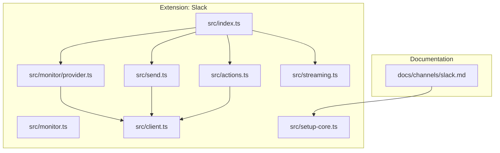

**Diagram sources**
- [slack.md:1-604](file://docs/channels/slack.md#L1-L604)
- [index.ts:1-26](file://extensions/slack/src/index.ts#L1-L26)
- [provider.ts:1-521](file://extensions/slack/src/monitor/provider.ts#L1-L521)
- [monitor.ts:1-6](file://extensions/slack/src/monitor.ts#L1-L6)
- [actions.ts:1-447](file://extensions/slack/src/actions.ts#L1-L447)
- [send.ts:1-361](file://extensions/slack/src/send.ts#L1-L361)
- [streaming.ts:1-154](file://extensions/slack/src/streaming.ts#L1-L154)
- [client.ts:1-21](file://extensions/slack/src/client.ts#L1-L21)
- [setup-core.ts:1-496](file://extensions/slack/src/setup-core.ts#L1-L496)

**Section sources**
- [slack.md:1-604](file://docs/channels/slack.md#L1-L604)
- [index.ts:1-26](file://extensions/slack/src/index.ts#L1-L26)

## Core Components
- Slack monitor: Orchestrates Socket Mode or HTTP mode, registers event listeners, slash commands, and handles reconnection policies.
- Action APIs: Provides functions to react, pin/unpin, list reactions, read messages, and download files.
- Send pipeline: Handles outbound messages with text chunking, Markdown-to-MRKDWN conversion, Block Kit validation, and file uploads via Slack’s external upload flow.
- Streaming: Integrates with Slack’s Agents and AI Apps streaming API for live previews and finalization.
- Setup and manifest: Generates a Slack app manifest and a guided setup wizard for tokens and permissions.

**Section sources**
- [provider.ts:97-509](file://extensions/slack/src/monitor/provider.ts#L97-L509)
- [actions.ts:80-446](file://extensions/slack/src/actions.ts#L80-L446)
- [send.ts:252-360](file://extensions/slack/src/send.ts#L252-L360)
- [streaming.ts:76-153](file://extensions/slack/src/streaming.ts#L76-L153)
- [setup-core.ts:29-96](file://extensions/slack/src/setup-core.ts#L29-L96)

## Architecture Overview
OpenClaw’s Slack integration supports two operational modes:
- Socket Mode: Uses the Slack SDK’s Socket Mode to receive events over WebSocket and emits system events for routing.
- HTTP Events API: Uses a signed HTTP receiver to accept events and slash commands at a configurable webhook path.

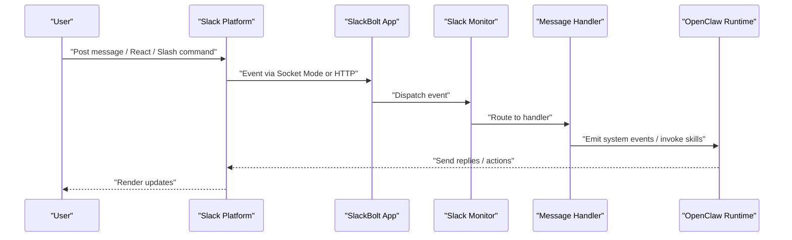

**Diagram sources**
- [provider.ts:188-308](file://extensions/slack/src/monitor/provider.ts#L188-L308)
- [monitor.ts:1-6](file://extensions/slack/src/monitor.ts#L1-L6)

## Detailed Component Analysis

### Socket Mode and HTTP Events API
- Socket Mode:
  - Requires bot and app tokens.
  - Starts the Slack App in Socket Mode and manages reconnection with exponential backoff.
  - Emits system events for messages, reactions, member joins/leaves, channel renames, and pins.
- HTTP Events API:
  - Requires bot token and signing secret.
  - Registers a receiver at a configurable path and enforces request body limits and timeouts.
  - Supports slash commands and interactivity via the same receiver.

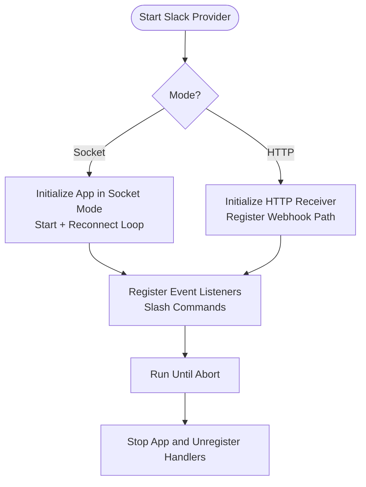

**Diagram sources**
- [provider.ts:130-308](file://extensions/slack/src/monitor/provider.ts#L130-L308)
- [provider.ts:414-508](file://extensions/slack/src/monitor/provider.ts#L414-L508)

**Section sources**
- [provider.ts:130-308](file://extensions/slack/src/monitor/provider.ts#L130-L308)
- [provider.ts:414-508](file://extensions/slack/src/monitor/provider.ts#L414-L508)

### Event Handling and Routing
- Event registration includes bot mentions, channel/group/DM messages, reaction events, member join/leave, channel rename, and pin events.
- Slash commands are registered conditionally and mapped to internal command sessions.
- Thread handling supports reply threading and manual reply tags.

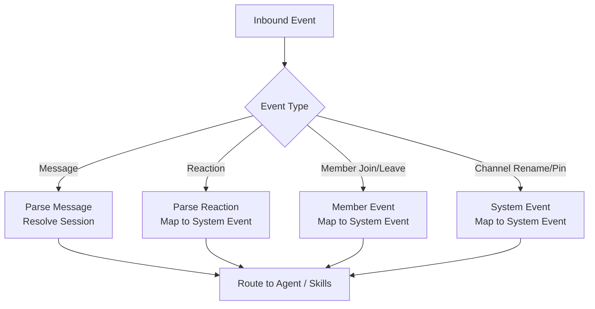

**Diagram sources**
- [slack.md:347-358](file://docs/channels/slack.md#L347-L358)
- [provider.ts:297-300](file://extensions/slack/src/monitor/provider.ts#L297-L300)

**Section sources**
- [slack.md:347-358](file://docs/channels/slack.md#L347-L358)
- [provider.ts:297-300](file://extensions/slack/src/monitor/provider.ts#L297-L300)

### Slash Commands
- Native commands are opt-in; when enabled, register matching slash commands in Slack.
- Single slash command mode is supported when native commands are disabled.
- Argument menus adapt rendering strategy based on option counts and use confirm dialogs for long payloads.

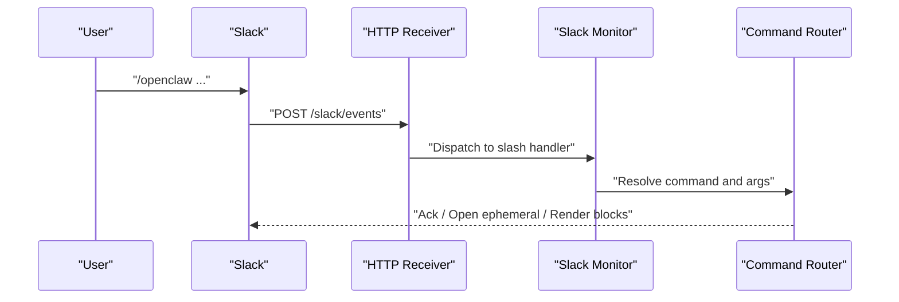

**Diagram sources**
- [slack.md:207-220](file://docs/channels/slack.md#L207-L220)
- [provider.ts:300-308](file://extensions/slack/src/monitor/provider.ts#L300-L308)

**Section sources**
- [slack.md:207-220](file://docs/channels/slack.md#L207-L220)
- [provider.ts:300-308](file://extensions/slack/src/monitor/provider.ts#L300-L308)

### Outbound Messaging and File Sharing
- Text chunking respects platform limits and Markdown table rendering.
- Block Kit payloads are validated and fall back to MRKDWN text when needed.
- File uploads use Slack’s external upload flow to avoid deprecated endpoints and scope issues.
- Identity customization requires the appropriate scope; the system retries without custom identity if missing.

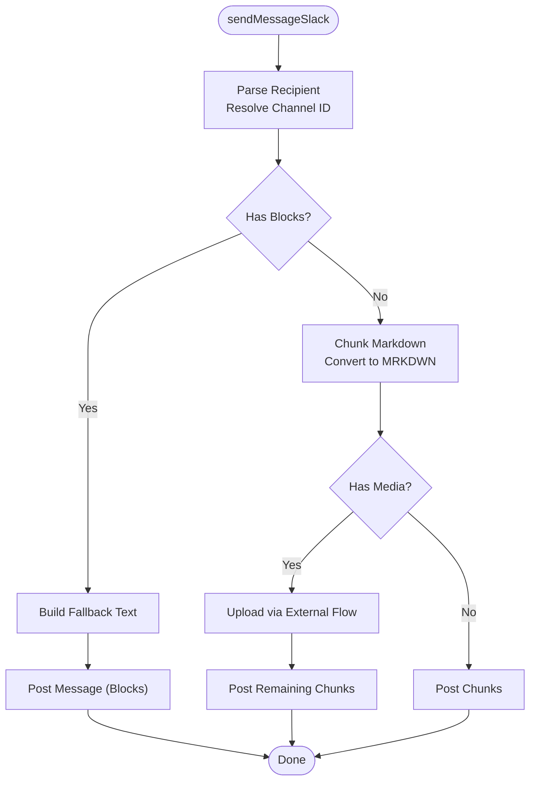

**Diagram sources**
- [send.ts:252-360](file://extensions/slack/src/send.ts#L252-L360)
- [send.ts:192-250](file://extensions/slack/src/send.ts#L192-L250)

**Section sources**
- [send.ts:252-360](file://extensions/slack/src/send.ts#L252-L360)
- [send.ts:192-250](file://extensions/slack/src/send.ts#L192-L250)

### Streaming with Slack Agents and AI Apps
- Live preview behavior is configurable (replace, append, progress).
- Uses Slack’s streaming API to start, append, and stop streams.
- Falls back to normal delivery if streaming fails mid-reply.

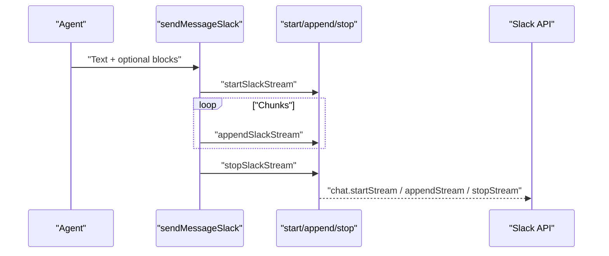

**Diagram sources**
- [streaming.ts:76-153](file://extensions/slack/src/streaming.ts#L76-L153)
- [slack.md:541-581](file://docs/channels/slack.md#L541-L581)

**Section sources**
- [streaming.ts:76-153](file://extensions/slack/src/streaming.ts#L76-L153)
- [slack.md:541-581](file://docs/channels/slack.md#L541-L581)

### Permissions, Scopes, and Workspace Integration
- Bot scopes include chat, channels/groups/history/read/write, users:read, app mentions, reactions, pins, emoji, commands, and files read/write.
- Optional user token scopes enable read-only operations when configured.
- Assistant typing requires the assistant:write scope.
- Manifest generation automates app creation and event subscriptions.

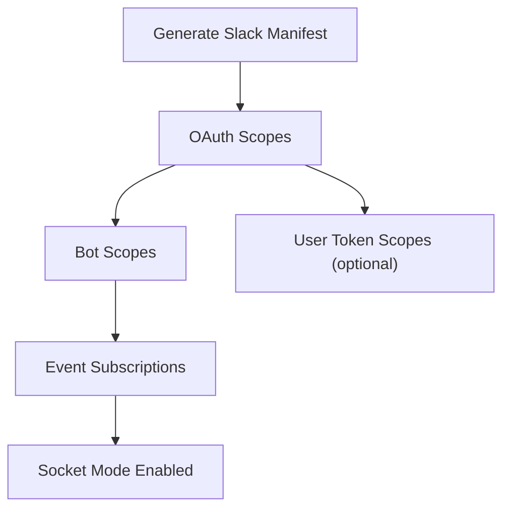

**Diagram sources**
- [setup-core.ts:29-96](file://extensions/slack/src/setup-core.ts#L29-L96)
- [slack.md:389-480](file://docs/channels/slack.md#L389-L480)

**Section sources**
- [setup-core.ts:29-96](file://extensions/slack/src/setup-core.ts#L29-L96)
- [slack.md:389-480](file://docs/channels/slack.md#L389-L480)

### Channel Management and User Permissions
- DM policy controls:
  - pairing (default), allowlist, open, disabled.
  - DM flags include allowFrom, groupEnabled, and groupChannels.
- Channel policy:
  - open, allowlist, disabled.
  - Allowlist entries use stable channel IDs; name matching requires explicit enabling.
- Mention gating and per-channel controls:
  - requireMention, users allowlist, allowBots, skills, systemPrompt, tools, toolsBySender.

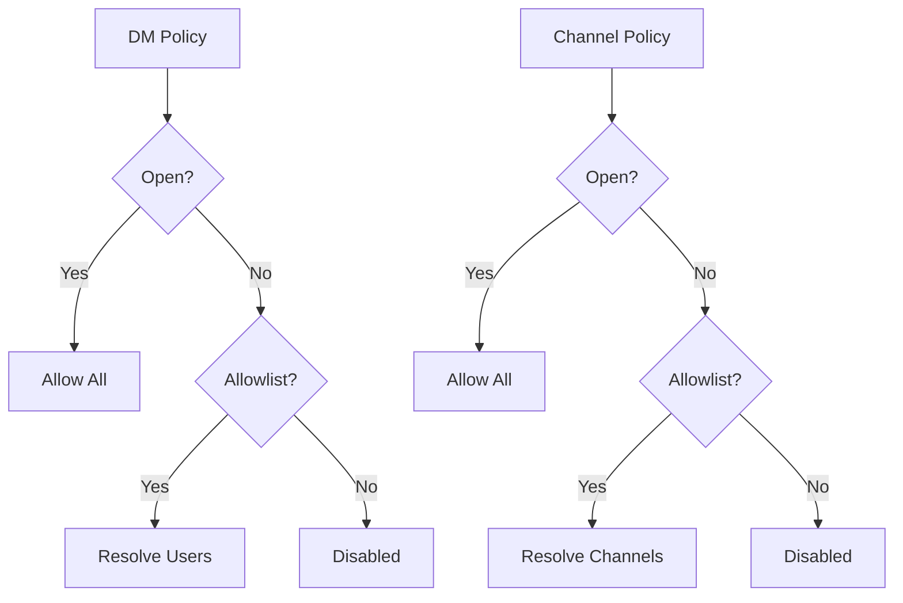

**Diagram sources**
- [slack.md:136-205](file://docs/channels/slack.md#L136-L205)

**Section sources**
- [slack.md:136-205](file://docs/channels/slack.md#L136-L205)

### Actions and Interactive Elements
- Actions include messages, reactions, pins, member info, and emoji lists.
- Interactive replies can be enabled to render Slack Block Kit buttons and selects.
- Modal dialogs and block actions emit structured system events with rich payloads.

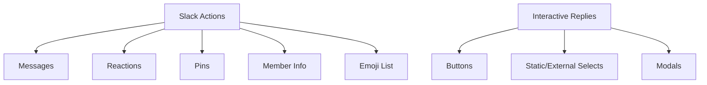

**Diagram sources**
- [slack.md:333-336](file://docs/channels/slack.md#L333-L336)
- [slack.md:221-269](file://docs/channels/slack.md#L221-L269)

**Section sources**
- [slack.md:333-336](file://docs/channels/slack.md#L333-L336)
- [slack.md:221-269](file://docs/channels/slack.md#L221-L269)

### Threads, Sessions, and Reply Tags
- Sessions:
  - DMs: direct
  - Channels: channel
  - MPIMs: group
- Thread replies can create thread session suffixes.
- Controls:
  - replyToMode and replyToModeByChatType
  - Manual reply tags: current and explicit IDs.

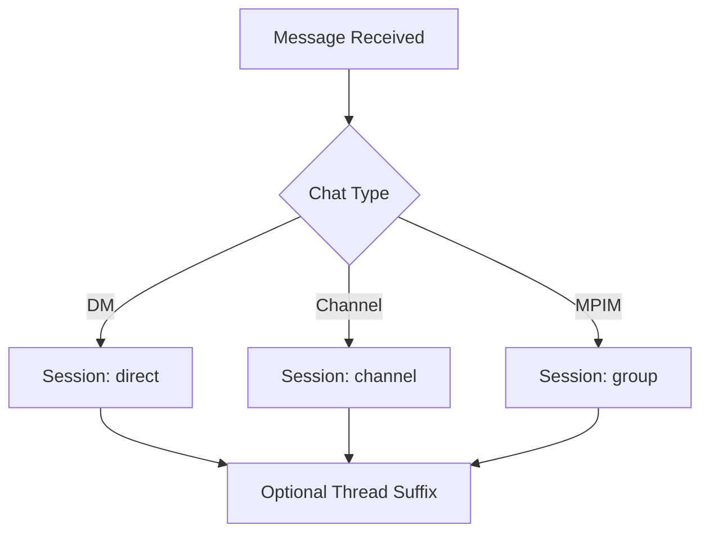

**Diagram sources**
- [slack.md:283-304](file://docs/channels/slack.md#L283-L304)

**Section sources**
- [slack.md:283-304](file://docs/channels/slack.md#L283-L304)

### Setup Wizard and Manifest
- Setup wizard generates a manifest and guides through:
  - Creating app and enabling Socket Mode
  - Installing app to workspace
  - Enabling event subscriptions and App Home messages tab
- Environment variable shortcuts for default account tokens.

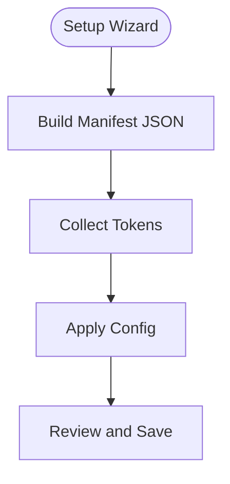

**Diagram sources**
- [setup-core.ts:98-111](file://extensions/slack/src/setup-core.ts#L98-L111)
- [setup-core.ts:144-214](file://extensions/slack/src/setup-core.ts#L144-L214)

**Section sources**
- [setup-core.ts:98-111](file://extensions/slack/src/setup-core.ts#L98-L111)
- [setup-core.ts:144-214](file://extensions/slack/src/setup-core.ts#L144-L214)

## Dependency Analysis
- External SDKs:
  - @slack/web-api for Web API calls and streaming
  - @slack/bolt for Socket Mode and HTTP receiver
- Internal dependencies:
  - Runtime environment and channel status patches
  - Config resolution and secrets handling
  - Allowlist resolution for channels and users

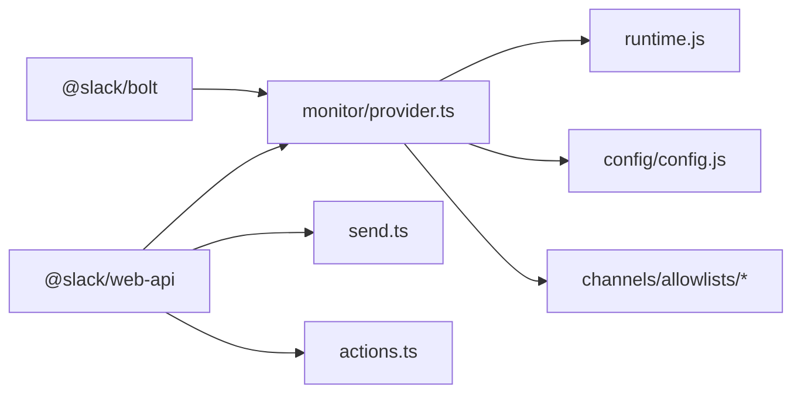

**Diagram sources**
- [provider.ts:1-60](file://extensions/slack/src/monitor/provider.ts#L1-L60)
- [send.ts:1-24](file://extensions/slack/src/send.ts#L1-L24)
- [actions.ts:1-11](file://extensions/slack/src/actions.ts#L1-L11)

**Section sources**
- [provider.ts:1-60](file://extensions/slack/src/monitor/provider.ts#L1-L60)
- [send.ts:1-24](file://extensions/slack/src/send.ts#L1-L24)
- [actions.ts:1-11](file://extensions/slack/src/actions.ts#L1-L11)

## Performance Considerations
- Retry configuration for Web API calls is tuned for reliability.
- Text chunking and Markdown table rendering optimize payload sizes.
- Streaming reduces perceived latency for long-running responses.
- HTTP body guards prevent oversized requests and improve stability.

**Section sources**
- [client.ts:3-16](file://extensions/slack/src/client.ts#L3-L16)
- [send.ts:300-312](file://extensions/slack/src/send.ts#L300-L312)
- [provider.ts:58-59](file://extensions/slack/src/monitor/provider.ts#L58-L59)

## Troubleshooting Guide
Common issues and resolutions:
- No replies in channels:
  - Verify groupPolicy, channel allowlist, requireMention, and per-channel users allowlist.
  - Use diagnostic commands to probe and review logs.
- DM messages ignored:
  - Check dm.enabled, dmPolicy, and pairing approvals.
- Socket mode not connecting:
  - Validate bot and app tokens and Socket Mode enablement.
- HTTP mode not receiving events:
  - Validate signing secret, webhook path, and Request URLs for Events, Interactivity, and Slash Commands.
- Native/slash commands not firing:
  - Confirm native command mode and matching slash commands in Slack; or enable single slash command mode.
- Permission problems:
  - Ensure assistant:write for typing indicators and chat:write.customize for identity customization.
  - Verify file upload flows and scope mismatches for shared files.

**Section sources**
- [slack.md:482-539](file://docs/channels/slack.md#L482-L539)
- [send.ts:63-87](file://extensions/slack/src/send.ts#L63-L87)
- [actions.ts:408-446](file://extensions/slack/src/actions.ts#L408-L446)

## Conclusion
OpenClaw’s Slack integration provides a robust foundation for real-time communication, permission-aware routing, and rich UI experiences. By supporting both Socket Mode and HTTP Events API, it adapts to diverse deployment scenarios. The integration includes comprehensive event mapping, Slash command handling, streaming, and file operations, with strong observability and troubleshooting aids.

## Appendices

### Configuration Reference Highlights
- Mode and authentication:
  - mode, botToken, appToken, signingSecret, webhookPath, accounts.*
- DM access:
  - dm.enabled, dmPolicy, allowFrom
- Channel access:
  - groupPolicy, channels.*, channels.*.users, channels.*.requireMention
- Threading and history:
  - replyToMode, replyToModeByChatType, thread.*, historyLimit, dmHistoryLimit
- Delivery:
  - textChunkLimit, chunkMode, mediaMaxMb, streaming, nativeStreaming
- Operations and features:
  - configWrites, commands.native, slashCommand.*, actions.*, userToken, userTokenReadOnly

**Section sources**
- [slack.md:582-596](file://docs/channels/slack.md#L582-L596)