# Telegram Integration

<cite>
**Referenced Files in This Document**
- [telegram.md](file://docs/channels/telegram.md)
- [channel.ts](file://extensions/telegram/src/channel.ts)
- [bot.ts](file://extensions/telegram/src/bot.ts)
- [bot-handlers.ts](file://extensions/telegram/src/bot-handlers.ts)
- [webhook.ts](file://extensions/telegram/src/webhook.ts)
- [polling-session.ts](file://extensions/telegram/src/polling-session.ts)
- [bot-message.ts](file://extensions/telegram/src/bot-message.ts)
- [inline-buttons.ts](file://extensions/telegram/src/inline-buttons.ts)
- [bot-native-commands.ts](file://extensions/telegram/src/bot-native-commands.ts)
- [setup-core.ts](file://extensions/telegram/src/setup-core.ts)
- [setup-surface.ts](file://extensions/telegram/src/setup-surface.ts)
- [network-errors.ts](file://extensions/telegram/src/network-errors.ts)
- [bot-access.ts](file://extensions/telegram/src/bot-access.ts)
- [group-access.ts](file://extensions/telegram/src/group-access.ts)
- [exec-approvals.ts](file://extensions/telegram/src/exec-approvals.ts)
- [bot-message-context.ts](file://extensions/telegram/src/bot-message-context.ts)
</cite>

## Table of Contents
1. [Introduction](#introduction)
2. [Project Structure](#project-structure)
3. [Core Components](#core-components)
4. [Architecture Overview](#architecture-overview)
5. [Detailed Component Analysis](#detailed-component-analysis)
6. [Dependency Analysis](#dependency-analysis)
7. [Performance Considerations](#performance-considerations)
8. [Troubleshooting Guide](#troubleshooting-guide)
9. [Conclusion](#conclusion)
10. [Appendices](#appendices)

## Introduction
This document explains how OpenClaw integrates with the Telegram Bot API, covering setup, configuration, message handling, routing, inline buttons, authentication, rate limiting, and production best practices. It consolidates the official documentation and the underlying implementation to guide both newcomers and operators deploying Telegram channels at scale.

## Project Structure
OpenClaw’s Telegram integration lives primarily in the Telegram extension package. The high-level structure relevant to Telegram includes:
- Channel plugin definition and configuration schema
- Telegram bot runtime and update processing
- Webhook and long polling transports
- Message parsing, routing, and reply handling
- Inline buttons and native command menus
- Access control and exec approvals
- Setup wizard and credential helpers

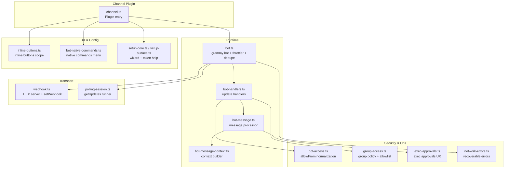

**Diagram sources**
- [channel.ts:182-574](file://extensions/telegram/src/channel.ts#L182-L574)
- [bot.ts:108-522](file://extensions/telegram/src/bot.ts#L108-L522)
- [bot-handlers.ts:130-800](file://extensions/telegram/src/bot-handlers.ts#L130-L800)
- [bot-message.ts:27-108](file://extensions/telegram/src/bot-message.ts#L27-L108)
- [bot-message-context.ts:40-474](file://extensions/telegram/src/bot-message-context.ts#L40-L474)
- [webhook.ts:100-313](file://extensions/telegram/src/webhook.ts#L100-L313)
- [polling-session.ts:52-322](file://extensions/telegram/src/polling-session.ts#L52-L322)
- [inline-buttons.ts:43-68](file://extensions/telegram/src/inline-buttons.ts#L43-L68)
- [bot-native-commands.ts:347-800](file://extensions/telegram/src/bot-native-commands.ts#L347-L800)
- [setup-core.ts:19-192](file://extensions/telegram/src/setup-core.ts#L19-L192)
- [setup-surface.ts:40-112](file://extensions/telegram/src/setup-surface.ts#L40-L112)
- [bot-access.ts:42-95](file://extensions/telegram/src/bot-access.ts#L42-L95)
- [group-access.ts:43-206](file://extensions/telegram/src/group-access.ts#L43-L206)
- [exec-approvals.ts:12-107](file://extensions/telegram/src/exec-approvals.ts#L12-L107)
- [network-errors.ts:196-235](file://extensions/telegram/src/network-errors.ts#L196-L235)

**Section sources**
- [channel.ts:182-574](file://extensions/telegram/src/channel.ts#L182-L574)
- [bot.ts:108-522](file://extensions/telegram/src/bot.ts#L108-L522)

## Core Components
- Channel plugin: Exposes Telegram as a channel, defines capabilities, config schema, security policies, and outbound delivery helpers.
- Telegram bot runtime: Wraps grammY, applies throttling, deduplication, sequentialization, and transport configuration.
- Transport modes: Webhook (with secret token) and long polling (with runner and watchdog).
- Message processing: Builds inbound context, enforces access, computes session keys, and dispatches replies.
- Inline buttons and native commands: Menu registration and callback handling.
- Access control: DM and group allowlists, inline button scopes, exec approvals.
- Setup wizard: Token acquisition, user ID resolution, and policy configuration.

**Section sources**
- [channel.ts:182-574](file://extensions/telegram/src/channel.ts#L182-L574)
- [bot.ts:108-522](file://extensions/telegram/src/bot.ts#L108-L522)
- [webhook.ts:100-313](file://extensions/telegram/src/webhook.ts#L100-L313)
- [polling-session.ts:52-322](file://extensions/telegram/src/polling-session.ts#L52-L322)
- [bot-message.ts:27-108](file://extensions/telegram/src/bot-message.ts#L27-L108)
- [inline-buttons.ts:43-68](file://extensions/telegram/src/inline-buttons.ts#L43-L68)
- [bot-native-commands.ts:347-800](file://extensions/telegram/src/bot-native-commands.ts#L347-L800)
- [bot-access.ts:42-95](file://extensions/telegram/src/bot-access.ts#L42-L95)
- [group-access.ts:43-206](file://extensions/telegram/src/group-access.ts#L43-L206)
- [exec-approvals.ts:12-107](file://extensions/telegram/src/exec-approvals.ts#L12-L107)
- [setup-core.ts:19-192](file://extensions/telegram/src/setup-core.ts#L19-L192)
- [setup-surface.ts:40-112](file://extensions/telegram/src/setup-surface.ts#L40-L112)

## Architecture Overview
The Telegram integration follows a clear separation of concerns:
- Configuration and channel lifecycle are managed by the plugin.
- The Telegram bot runtime handles transport (webhook or polling) and update processing.
- Handlers parse updates, enforce access, and build a unified inbound context.
- Dispatchers convert the context into agent sessions and deliver replies.

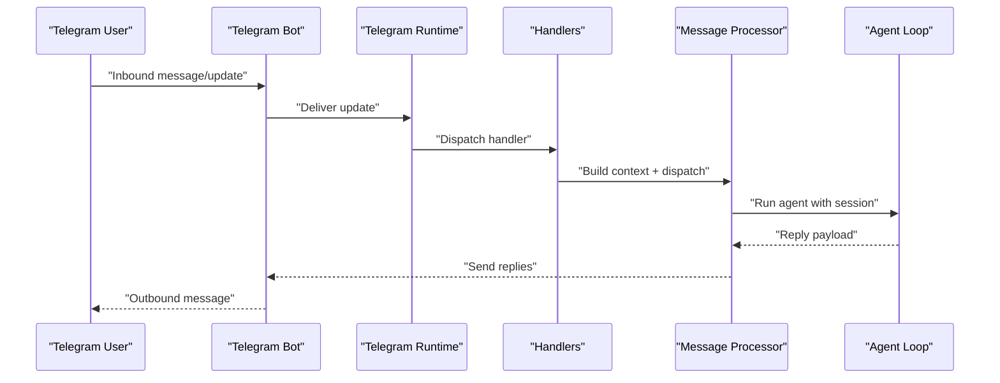

**Diagram sources**
- [bot.ts:298-522](file://extensions/telegram/src/bot.ts#L298-L522)
- [bot-handlers.ts:130-800](file://extensions/telegram/src/bot-handlers.ts#L130-L800)
- [bot-message.ts:27-108](file://extensions/telegram/src/bot-message.ts#L27-L108)

## Detailed Component Analysis

### Telegram Bot API Setup and Configuration
- Token acquisition: Use BotFather to create a bot and obtain a token. The setup wizard supports environment fallback for the default account.
- Configuration: The channel plugin exposes a config schema and helpers for allowFrom normalization and account scoping.
- Pairing and DM policy: Default DM policy is pairing; allowlist and open modes are supported. The wizard guides users to resolve @username to numeric IDs.

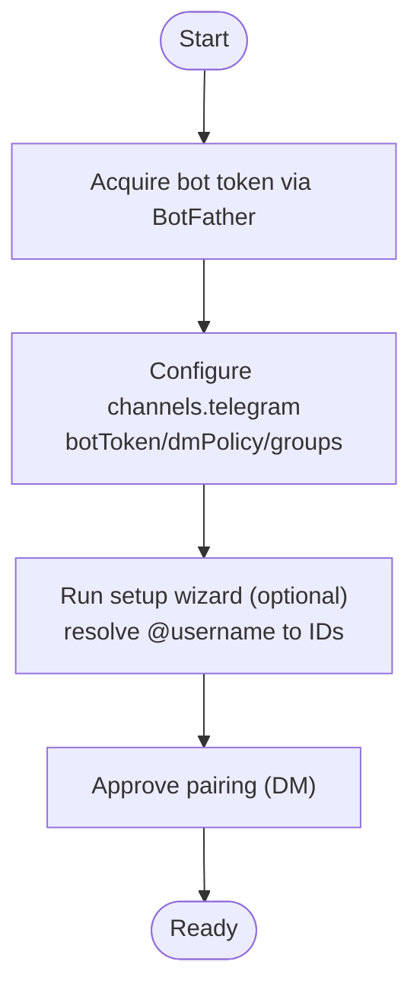

**Diagram sources**
- [setup-core.ts:19-192](file://extensions/telegram/src/setup-core.ts#L19-L192)
- [setup-surface.ts:40-112](file://extensions/telegram/src/setup-surface.ts#L40-L112)
- [channel.ts:182-574](file://extensions/telegram/src/channel.ts#L182-L574)

**Section sources**
- [telegram.md:24-73](file://docs/channels/telegram.md#L24-L73)
- [setup-core.ts:19-192](file://extensions/telegram/src/setup-core.ts#L19-L192)
- [setup-surface.ts:40-112](file://extensions/telegram/src/setup-surface.ts#L40-L112)
- [channel.ts:182-574](file://extensions/telegram/src/channel.ts#L182-L574)

### Webhook vs Long Polling
- Webhook mode:
  - Requires webhookUrl and webhookSecret.
  - Starts an HTTP server and registers setWebhook with allowed_updates and optional certificate.
  - Validates secret via X-Telegram-Bot-API-Secret-Token header.
- Long polling mode:
  - Uses grammY runner with backoff and watchdog to detect stalls.
  - Ensures clean webhook cleanup before starting polling.
  - Supports graceful stop and restart on errors.

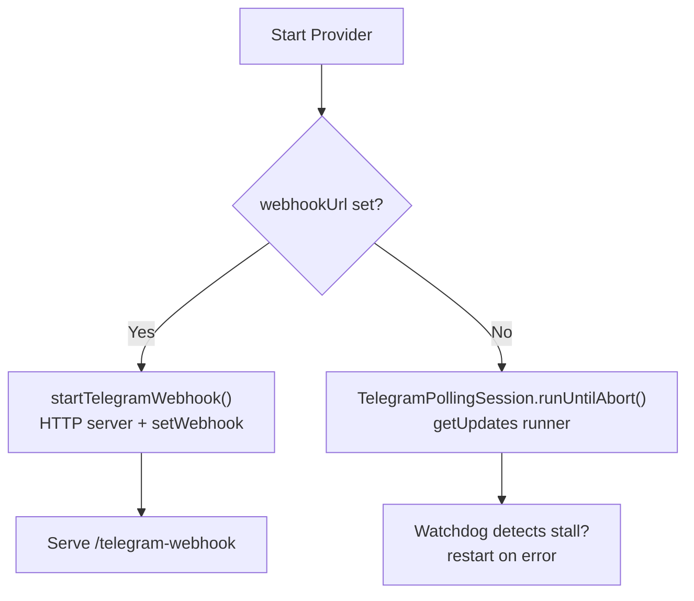

**Diagram sources**
- [webhook.ts:100-313](file://extensions/telegram/src/webhook.ts#L100-L313)
- [polling-session.ts:52-322](file://extensions/telegram/src/polling-session.ts#L52-L322)

**Section sources**
- [telegram.md:732-748](file://docs/channels/telegram.md#L732-L748)
- [webhook.ts:100-313](file://extensions/telegram/src/webhook.ts#L100-L313)
- [polling-session.ts:52-322](file://extensions/telegram/src/polling-session.ts#L52-L322)

### Message Handling: Text, Photos, Documents, Stickers, Media
- Inbound parsing:
  - Extracts text, media, mentions, and reply targets.
  - Handles media groups and text fragments with timeouts and debouncing.
  - Resolves reply media for quoted messages.
- Media processing:
  - Downloads and normalizes inbound media (photos, videos, documents, audio, voice, stickers).
  - Skips unsupported sticker formats and caches descriptions to reduce repeated vision calls.
- Outbound delivery:
  - Supports text, media, polls, stickers, and inline keyboards.
  - Enforces text chunking and media size limits.

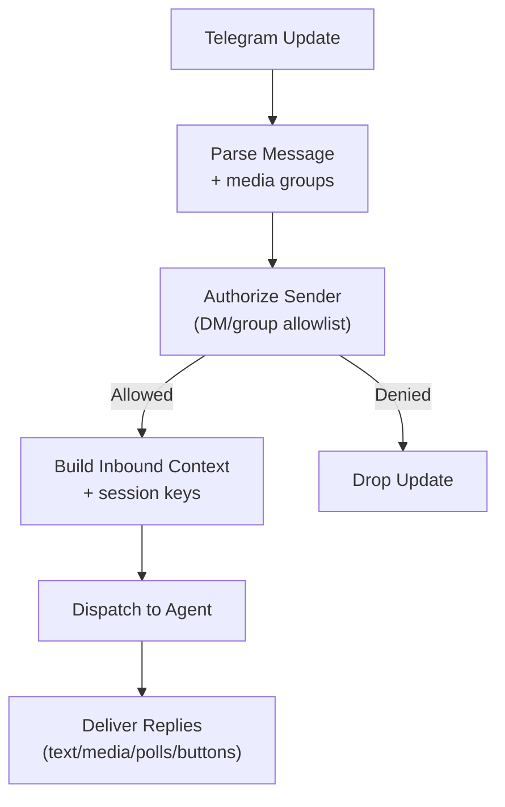

**Diagram sources**
- [bot-handlers.ts:130-800](file://extensions/telegram/src/bot-handlers.ts#L130-L800)
- [bot-message-context.ts:40-474](file://extensions/telegram/src/bot-message-context.ts#L40-L474)
- [bot-message.ts:27-108](file://extensions/telegram/src/bot-message.ts#L27-L108)

**Section sources**
- [bot-handlers.ts:100-800](file://extensions/telegram/src/bot-handlers.ts#L100-L800)
- [bot-message-context.ts:40-474](file://extensions/telegram/src/bot-message-context.ts#L40-L474)
- [telegram.md:571-667](file://docs/channels/telegram.md#L571-L667)

### Group and Channel Routing, Thread Management, Reply Handling
- Routing:
  - Deterministic routing by chat ID; group sessions isolated by group ID.
  - DM sessions support message_thread_id for thread-aware routing.
  - Forum topics append ":topic:<threadId>" to session keys.
- Reply threading:
  - Support for explicit reply threading tags [[reply_to_current]] and [[reply_to:<id>]].
  - Configurable replyToMode: off, first, all.
- Topic routing:
  - Topics can route to different agents via topic config.
  - Topic inheritance: requireMention, allowFrom, skills, systemPrompt, enabled, groupPolicy.

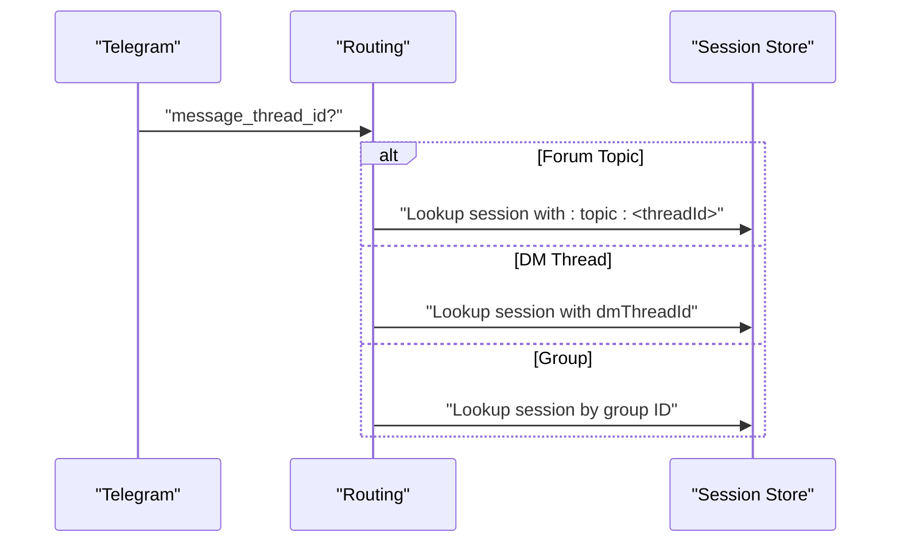

**Diagram sources**
- [bot.ts:372-413](file://extensions/telegram/src/bot.ts#L372-L413)
- [bot-message-context.ts:244-256](file://extensions/telegram/src/bot-message-context.ts#L244-L256)
- [telegram.md:446-569](file://docs/channels/telegram.md#L446-L569)

**Section sources**
- [telegram.md:248-257](file://docs/channels/telegram.md#L248-L257)
- [telegram.md:446-569](file://docs/channels/telegram.md#L446-L569)
- [bot.ts:372-413](file://extensions/telegram/src/bot.ts#L372-L413)

### Inline Keyboard Implementation and Callback Processing
- Scope resolution:
  - inlineButtons scope: off, dm, group, all, allowlist.
  - Defaults to allowlist when capabilities not set.
- Button injection:
  - Injected for exec approvals when enabled and target conditions match.
- Callback handling:
  - Authorizes callbacks based on scope and allowlist.
  - Converts callback_data to text and dispatches to agent.

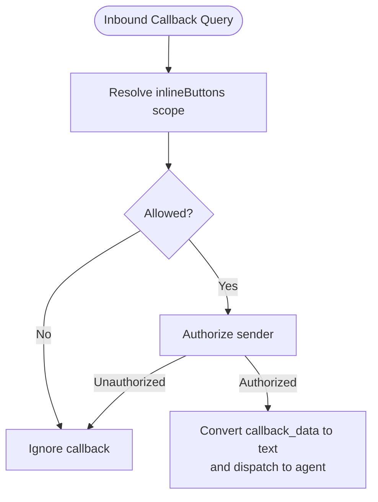

**Diagram sources**
- [inline-buttons.ts:43-68](file://extensions/telegram/src/inline-buttons.ts#L43-L68)
- [bot-handlers.ts:758-800](file://extensions/telegram/src/bot-handlers.ts#L758-L800)
- [exec-approvals.ts:56-96](file://extensions/telegram/src/exec-approvals.ts#L56-L96)

**Section sources**
- [inline-buttons.ts:43-68](file://extensions/telegram/src/inline-buttons.ts#L43-L68)
- [exec-approvals.ts:56-96](file://extensions/telegram/src/exec-approvals.ts#L56-L96)
- [bot-handlers.ts:758-800](file://extensions/telegram/src/bot-handlers.ts#L758-L800)

### Native Commands and Custom Menus
- Registration:
  - Registers native commands and custom commands at startup with setMyCommands.
  - Caps the number of menu entries to Telegram’s limit.
- Authorization:
  - Enforces group policy and allowlist gates for command execution.
- Execution:
  - Builds runtime context, records session metadata, and dispatches replies.

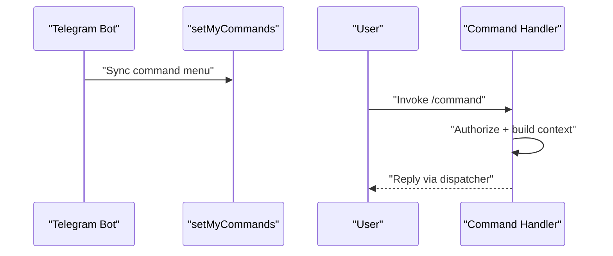

**Diagram sources**
- [bot-native-commands.ts:347-800](file://extensions/telegram/src/bot-native-commands.ts#L347-L800)
- [bot.ts:476-494](file://extensions/telegram/src/bot.ts#L476-L494)

**Section sources**
- [bot-native-commands.ts:347-800](file://extensions/telegram/src/bot-native-commands.ts#L347-L800)
- [telegram.md:302-353](file://docs/channels/telegram.md#L302-L353)

### Authentication, Access Control, and Exec Approvals
- DM policy:
  - pairing, allowlist, open, disabled with allowFrom normalization.
- Group policy:
  - open, allowlist, disabled; respects per-group/per-topic overrides.
- Inline buttons:
  - Scope-based gating; explicit allowlist enforcement for callback queries.
- Exec approvals:
  - Approver lists and target routing (DM/channel/both).
  - Optional inline buttons for approvals when enabled and scope permits.

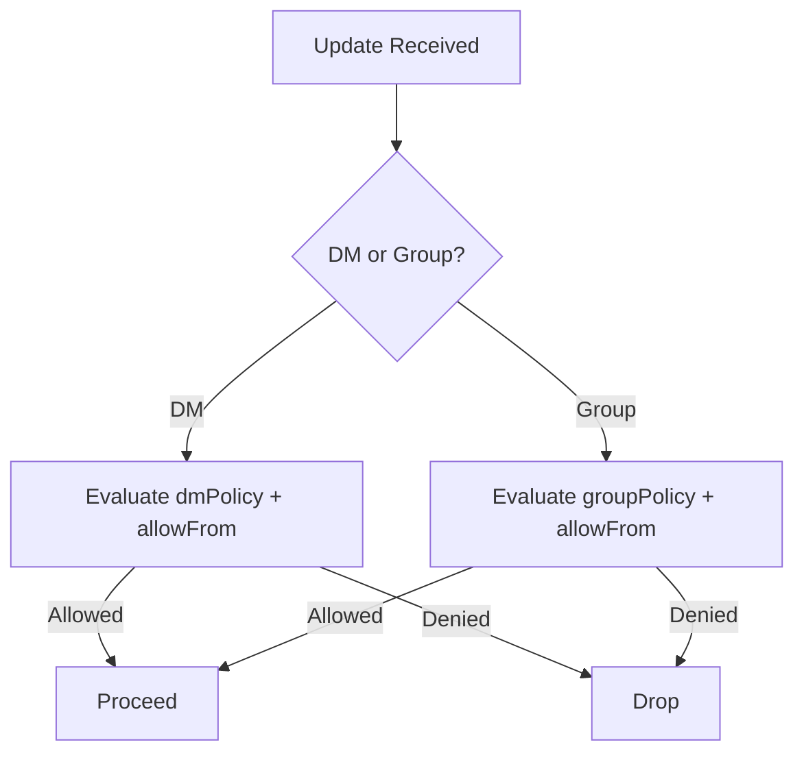

**Diagram sources**
- [bot-access.ts:42-95](file://extensions/telegram/src/bot-access.ts#L42-L95)
- [group-access.ts:43-206](file://extensions/telegram/src/group-access.ts#L43-L206)
- [bot-handlers.ts:728-756](file://extensions/telegram/src/bot-handlers.ts#L728-L756)

**Section sources**
- [bot-access.ts:42-95](file://extensions/telegram/src/bot-access.ts#L42-L95)
- [group-access.ts:43-206](file://extensions/telegram/src/group-access.ts#L43-L206)
- [exec-approvals.ts:12-107](file://extensions/telegram/src/exec-approvals.ts#L12-L107)
- [telegram.md:105-246](file://docs/channels/telegram.md#L105-L246)

### Rate Limiting, Network Errors, and Retry Behavior
- Recoverable network errors:
  - Detects transient DNS, socket, and timeout errors; safe to retry.
  - Distinguishes pre-connect errors (safe to retry) vs others (idempotent send retries require caution).
- Server/client errors:
  - 5xx server errors may have been applied; 4xx client rejections indicate policy or validation failures.
- Polling watchdog:
  - Restarts runner if no getUpdates activity for extended periods.
- Throttling:
  - Uses grammY throttler and sequentialization per chat/topic key.

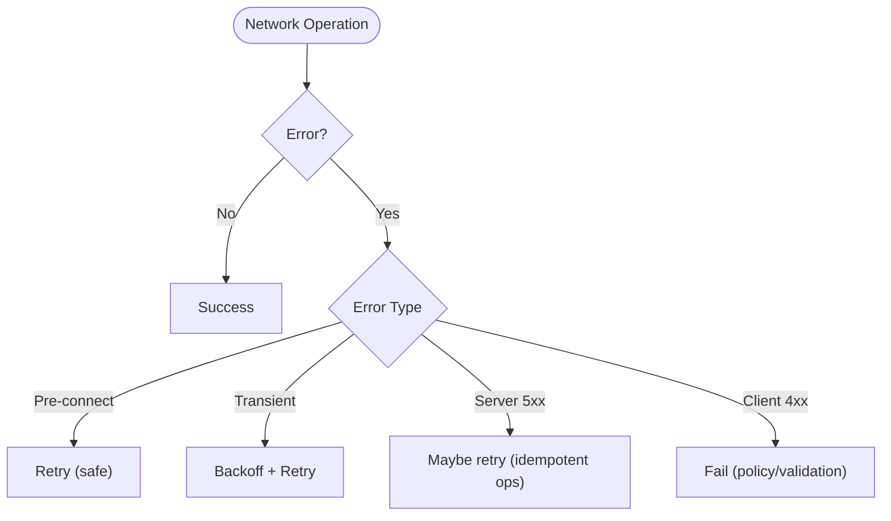

**Diagram sources**
- [network-errors.ts:196-235](file://extensions/telegram/src/network-errors.ts#L196-L235)
- [polling-session.ts:192-299](file://extensions/telegram/src/polling-session.ts#L192-L299)
- [bot.ts:222-228](file://extensions/telegram/src/bot.ts#L222-L228)

**Section sources**
- [network-errors.ts:196-235](file://extensions/telegram/src/network-errors.ts#L196-L235)
- [polling-session.ts:192-299](file://extensions/telegram/src/polling-session.ts#L192-L299)
- [bot.ts:222-228](file://extensions/telegram/src/bot.ts#L222-L228)

### Telegram-Specific Features
- Streaming replies:
  - Partial live preview editing for text and media; respects blockStreaming toggle.
- Formatting and link previews:
  - HTML parse mode with fallback to plain text; linkPreview configurable.
- Audio/video/voice and stickers:
  - Distinctions between voice notes/audio files and video notes/captions.
  - Sticker caching and search actions.
- Reactions and acknowledgements:
  - Own-only or all reaction notifications; ack reactions with status reactions support.
- Config writes:
  - Supports group migration and /config commands when enabled.

**Section sources**
- [telegram.md:258-795](file://docs/channels/telegram.md#L258-L795)
- [bot.ts:371-371](file://extensions/telegram/src/bot.ts#L371-L371)

## Dependency Analysis
The Telegram integration exhibits strong cohesion within the extension and clear boundaries:
- Channel plugin depends on runtime and configuration helpers.
- Runtime composes grammY, throttler, dedupe, and sequentialization.
- Handlers depend on access control and routing utilities.
- Transport modes are independent and interchangeable.

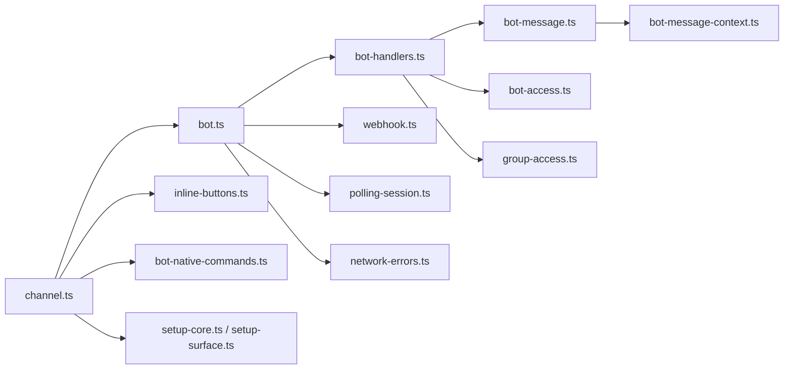

**Diagram sources**
- [channel.ts:182-574](file://extensions/telegram/src/channel.ts#L182-L574)
- [bot.ts:108-522](file://extensions/telegram/src/bot.ts#L108-L522)
- [bot-handlers.ts:130-800](file://extensions/telegram/src/bot-handlers.ts#L130-L800)
- [bot-message.ts:27-108](file://extensions/telegram/src/bot-message.ts#L27-L108)
- [bot-message-context.ts:40-474](file://extensions/telegram/src/bot-message-context.ts#L40-L474)
- [webhook.ts:100-313](file://extensions/telegram/src/webhook.ts#L100-L313)
- [polling-session.ts:52-322](file://extensions/telegram/src/polling-session.ts#L52-L322)
- [bot-access.ts:42-95](file://extensions/telegram/src/bot-access.ts#L42-L95)
- [group-access.ts:43-206](file://extensions/telegram/src/group-access.ts#L43-L206)
- [inline-buttons.ts:43-68](file://extensions/telegram/src/inline-buttons.ts#L43-L68)
- [bot-native-commands.ts:347-800](file://extensions/telegram/src/bot-native-commands.ts#L347-L800)
- [setup-core.ts:19-192](file://extensions/telegram/src/setup-core.ts#L19-L192)
- [setup-surface.ts:40-112](file://extensions/telegram/src/setup-surface.ts#L40-L112)
- [network-errors.ts:196-235](file://extensions/telegram/src/network-errors.ts#L196-L235)

**Section sources**
- [channel.ts:182-574](file://extensions/telegram/src/channel.ts#L182-L574)
- [bot.ts:108-522](file://extensions/telegram/src/bot.ts#L108-L522)

## Performance Considerations
- Concurrency and sequencing:
  - sequentialize per chat/topic key ensures ordered processing.
  - grammY throttler prevents API abuse.
- Chunking and media limits:
  - Text chunkLimit and mediaMaxMb configurable; enforced during outbound delivery.
- Polling watchdog:
  - Detects stalls and restarts runners to maintain responsiveness.
- Deduplication:
  - Recent update dedupe avoids redundant processing.

[No sources needed since this section provides general guidance]

## Troubleshooting Guide
Common issues and resolutions:
- Webhook failures:
  - Ensure webhookUrl and webhookSecret are set; verify X-Telegram-Bot-API-Secret-Token header; confirm allowed_updates and certificate if using TLS.
- Polling conflicts:
  - A 409 Conflict indicates another webhook is registered; polling cleanup deletes the webhook before starting.
- Permission problems:
  - Privacy mode and group visibility: disable privacy or make bot admin; verify groupPolicy and allowFrom entries.
  - Inline buttons disabled: check inlineButtons scope and capability settings.
- Rate limiting and network errors:
  - Transient DNS/socket/timeouts are retried; 5xx may require idempotent handling; 4xx indicates policy or validation failures.
- Pairing and DM access:
  - Use pairing list/approve; ensure dmPolicy and allowFrom are configured correctly.

**Section sources**
- [webhook.ts:120-125](file://extensions/telegram/src/webhook.ts#L120-L125)
- [polling-session.ts:301-322](file://extensions/telegram/src/polling-session.ts#L301-L322)
- [telegram.md:75-103](file://docs/channels/telegram.md#L75-L103)
- [network-errors.ts:196-235](file://extensions/telegram/src/network-errors.ts#L196-L235)
- [bot-access.ts:21-40](file://extensions/telegram/src/bot-access.ts#L21-L40)

## Conclusion
OpenClaw’s Telegram integration provides a robust, production-grade channel with flexible transport modes, comprehensive access control, rich media handling, and extensible UX features like inline buttons and native commands. By following the configuration patterns and operational guidance in this document, teams can deploy reliable Telegram bots at scale.

[No sources needed since this section summarizes without analyzing specific files]

## Appendices

### Configuration Examples
- Basic token and DM policy:
  - See [telegram.md:36-50](file://docs/channels/telegram.md#L36-L50)
- Group allowlist and mention behavior:
  - See [telegram.md:166-237](file://docs/channels/telegram.md#L166-L237)
- Inline buttons scope and actions:
  - See [telegram.md:358-414](file://docs/channels/telegram.md#L358-L414)
- Webhook and polling:
  - See [telegram.md:732-748](file://docs/channels/telegram.md#L732-L748)

**Section sources**
- [telegram.md:36-50](file://docs/channels/telegram.md#L36-L50)
- [telegram.md:166-237](file://docs/channels/telegram.md#L166-L237)
- [telegram.md:358-414](file://docs/channels/telegram.md#L358-L414)
- [telegram.md:732-748](file://docs/channels/telegram.md#L732-L748)