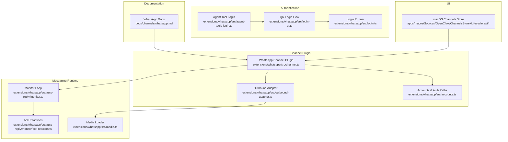
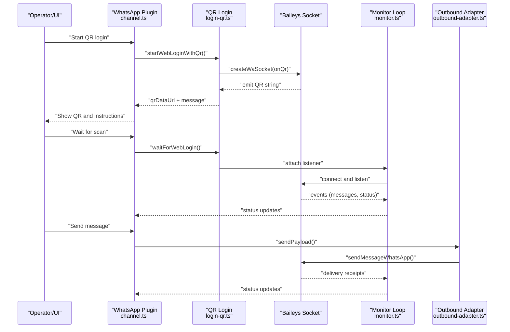
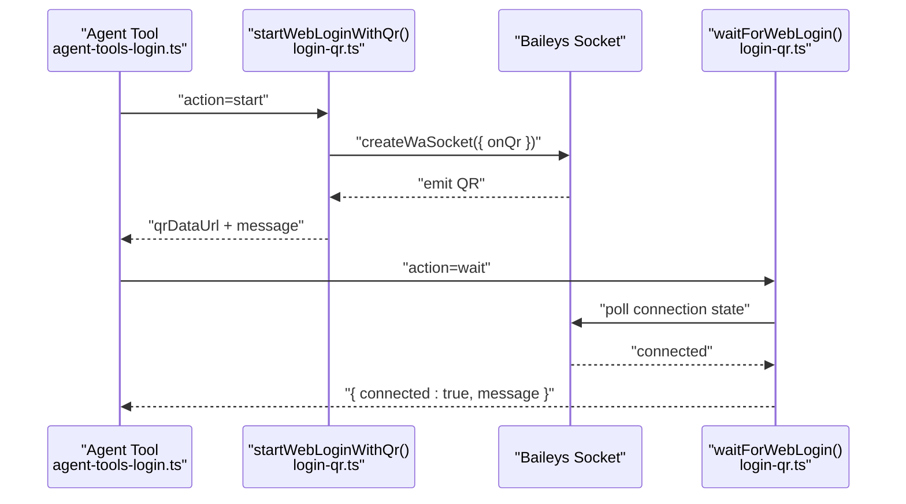
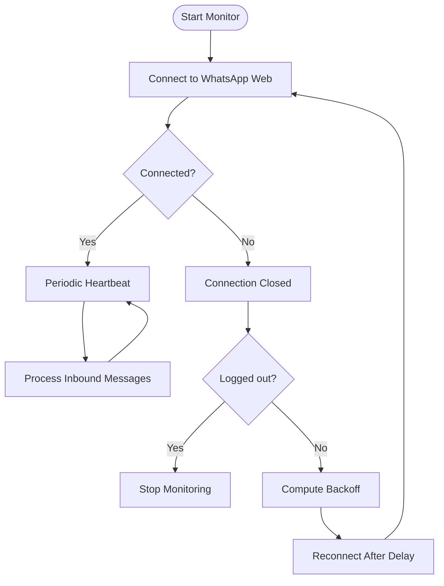
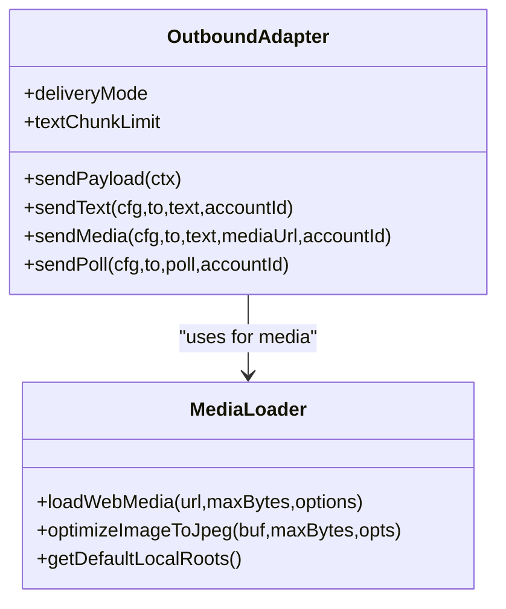
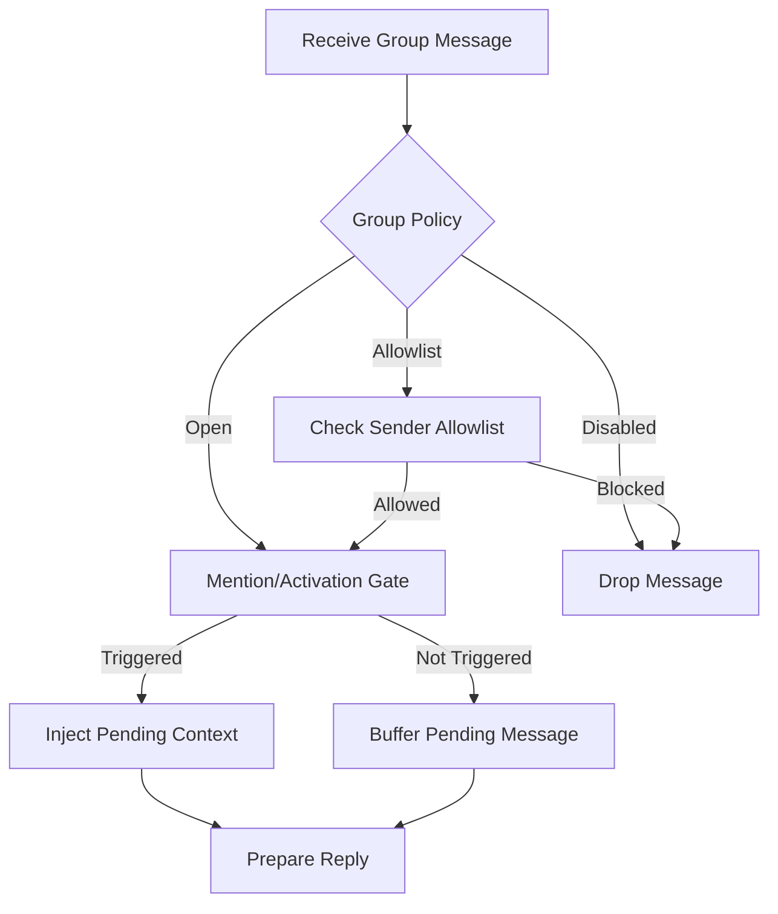
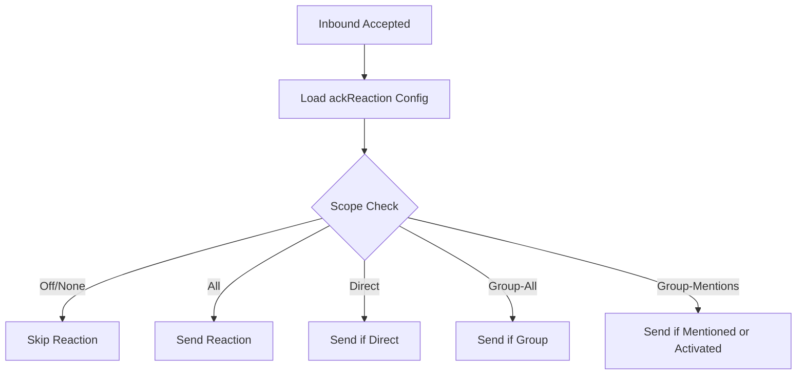
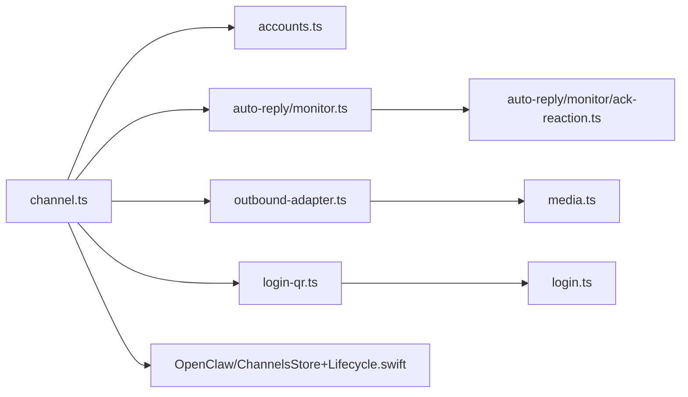

# WhatsApp Integration

<cite>
**Referenced Files in This Document**
- [whatsapp.md](file://docs/channels/whatsapp.md)
- [channel.ts](file://extensions/whatsapp/src/channel.ts)
- [login-qr.ts](file://extensions/whatsapp/src/login-qr.ts)
- [login.ts](file://extensions/whatsapp/src/login.ts)
- [agent-tools-login.ts](file://extensions/whatsapp/src/agent-tools-login.ts)
- [outbound-adapter.ts](file://extensions/whatsapp/src/outbound-adapter.ts)
- [media.ts](file://extensions/whatsapp/src/media.ts)
- [accounts.ts](file://extensions/whatsapp/src/accounts.ts)
- [monitor.ts](file://extensions/whatsapp/src/auto-reply/monitor.ts)
- [ack-reactions.ts](file://src/channels/ack-reactions.ts)
- [ack-reaction.ts](file://extensions/whatsapp/src/auto-reply/monitor/ack-reaction.ts)
- [status-issues.ts](file://extensions/whatsapp/src/status-issues.ts)
- [group-messages.md](file://docs/channels/group-messages.md)
- [location.md](file://docs/channels/location.md)
- [SwabbleCore](file://Swabble/Sources/SwabbleCore)
- [SwabbleKit](file://Swabble/Sources/SwabbleKit)
- [swabble](file://Swabble/Sources/swabble)
- [OpenClaw/ChannelsStore+Lifecycle.swift](file://apps/macos/Sources/OpenClaw/ChannelsStore+Lifecycle.swift)
</cite>

## Table of Contents
1. [Introduction](#introduction)
2. [Project Structure](#project-structure)
3. [Core Components](#core-components)
4. [Architecture Overview](#architecture-overview)
5. [Detailed Component Analysis](#detailed-component-analysis)
6. [Dependency Analysis](#dependency-analysis)
7. [Performance Considerations](#performance-considerations)
8. [Troubleshooting Guide](#troubleshooting-guide)
9. [Conclusion](#conclusion)
10. [Appendices](#appendices)

## Introduction
This document explains the WhatsApp Business API integration within the OpenClaw ecosystem, focusing on the WhatsApp Web channel powered by Baileys. It covers device pairing via QR code authentication, session lifecycle, message types and delivery, group chat and broadcast management, configuration and security, and troubleshooting. It also clarifies the relationship between WhatsApp Cloud API and WhatsApp Business API, and outlines setup procedures for both.

## Project Structure
The WhatsApp integration spans documentation, CLI tooling, a channel plugin, and runtime components:
- Documentation: channel-specific guidance and configuration references
- Plugin: channel registration, capability exposure, and gateway method bindings
- Authentication: QR generation, scanning, and session persistence
- Messaging: inbound processing, outbound sending, media handling, and acknowledgment reactions
- Accounts: credential storage, multi-account support, and status reporting
- macOS UI: gateway-side controls for login and logout

**Diagram sources**
- [channel.ts:1-443](file://extensions/whatsapp/src/channel.ts#L1-L443)
- [login-qr.ts:110-261](file://extensions/whatsapp/src/login-qr.ts#L110-L261)
- [login.ts:17-83](file://extensions/whatsapp/src/login.ts#L17-L83)
- [agent-tools-login.ts:1-72](file://extensions/whatsapp/src/agent-tools-login.ts#L1-L72)
- [outbound-adapter.ts:1-77](file://extensions/whatsapp/src/outbound-adapter.ts#L1-L77)
- [media.ts:1-494](file://extensions/whatsapp/src/media.ts#L1-L494)
- [monitor.ts:40-470](file://extensions/whatsapp/src/auto-reply/monitor.ts#L40-L470)
- [ack-reaction.ts:1-28](file://extensions/whatsapp/src/auto-reply/monitor/ack-reaction.ts#L1-L28)
- [accounts.ts:1-171](file://extensions/whatsapp/src/accounts.ts#L1-L171)
- [OpenClaw/ChannelsStore+Lifecycle.swift:47-119](file://apps/macos/Sources/OpenClaw/ChannelsStore+Lifecycle.swift#L47-L119)

**Section sources**
- [whatsapp.md:1-446](file://docs/channels/whatsapp.md#L1-L446)
- [channel.ts:1-443](file://extensions/whatsapp/src/channel.ts#L1-L443)

## Core Components
- Channel plugin: registers capabilities, exposes gateway methods, and binds configuration and security policies
- QR login: generates QR codes, tracks active logins, and waits for successful pairing
- Monitor loop: maintains the persistent WhatsApp Web connection, handles inbound messages, and manages reconnection
- Outbound adapter: chunks and sends text and media, supports polls, and integrates with the broader outbound pipeline
- Media loader: fetches, validates, optimizes, and caps media payloads for reliable delivery
- Accounts: resolves multi-account configuration, credential paths, and status snapshots
- Ack reactions: optional immediate feedback reactions based on scope and activation mode
- Status issues: collects and reports common problems (not linked, disconnected)

**Section sources**
- [channel.ts:90-443](file://extensions/whatsapp/src/channel.ts#L90-L443)
- [login-qr.ts:110-261](file://extensions/whatsapp/src/login-qr.ts#L110-L261)
- [monitor.ts:40-470](file://extensions/whatsapp/src/auto-reply/monitor.ts#L40-L470)
- [outbound-adapter.ts:13-77](file://extensions/whatsapp/src/outbound-adapter.ts#L13-L77)
- [media.ts:1-494](file://extensions/whatsapp/src/media.ts#L1-L494)
- [accounts.ts:16-171](file://extensions/whatsapp/src/accounts.ts#L16-L171)
- [ack-reaction.ts:1-28](file://extensions/whatsapp/src/auto-reply/monitor/ack-reaction.ts#L1-L28)
- [status-issues.ts:37-74](file://extensions/whatsapp/src/status-issues.ts#L37-L74)

## Architecture Overview
The WhatsApp Web channel is orchestrated by the gateway. The plugin registers capabilities and exposes gateway methods for QR login. The monitor loop keeps the Baileys WebSocket alive, processes inbound messages, and manages reconnection. Outbound sends are routed through the channel’s outbound adapter, which delegates to the send pipeline. Media handling ensures payloads meet platform limits and formats.

**Diagram sources**
- [channel.ts:424-432](file://extensions/whatsapp/src/channel.ts#L424-L432)
- [login-qr.ts:110-261](file://extensions/whatsapp/src/login-qr.ts#L110-L261)
- [monitor.ts:40-470](file://extensions/whatsapp/src/auto-reply/monitor.ts#L40-L470)
- [outbound-adapter.ts:21-38](file://extensions/whatsapp/src/outbound-adapter.ts#L21-L38)

## Detailed Component Analysis

### QR Code Authentication Flow
The QR login flow enables device pairing for WhatsApp Web:
- Generates a QR code and renders it as a data URL
- Tracks active logins with timeouts and freshness checks
- Waits for the QR to be scanned and the session to become active
- Provides agent tool and gateway method bindings for automation

**Diagram sources**
- [agent-tools-login.ts:20-72](file://extensions/whatsapp/src/agent-tools-login.ts#L20-L72)
- [login-qr.ts:110-261](file://extensions/whatsapp/src/login-qr.ts#L110-L261)

**Section sources**
- [login-qr.ts:110-261](file://extensions/whatsapp/src/login-qr.ts#L110-L261)
- [agent-tools-login.ts:1-72](file://extensions/whatsapp/src/agent-tools-login.ts#L1-L72)
- [OpenClaw/ChannelsStore+Lifecycle.swift:47-97](file://apps/macos/Sources/OpenClaw/ChannelsStore+Lifecycle.swift#L47-L97)

### Session Lifecycle and Reconnection
The monitor loop maintains the connection, emits heartbeats, and applies a backoff strategy on disconnects. It surfaces status updates and handles non-recoverable close statuses.

**Diagram sources**
- [monitor.ts:40-470](file://extensions/whatsapp/src/auto-reply/monitor.ts#L40-L470)

**Section sources**
- [monitor.ts:40-470](file://extensions/whatsapp/src/auto-reply/monitor.ts#L40-L470)

### Message Types and Delivery
Supported outbound message types include text, media (images, videos, audio/voice notes, documents), and polls. Delivery behavior includes:
- Text chunking with configurable limits and modes
- Media optimization and size capping
- Voice note compatibility adjustments
- Caption application to first media in multi-media replies
- Read receipts and optional acknowledgment reactions

**Diagram sources**
- [outbound-adapter.ts:13-77](file://extensions/whatsapp/src/outbound-adapter.ts#L13-L77)
- [media.ts:404-494](file://extensions/whatsapp/src/media.ts#L404-L494)

**Section sources**
- [whatsapp.md:292-316](file://docs/channels/whatsapp.md#L292-L316)
- [outbound-adapter.ts:13-77](file://extensions/whatsapp/src/outbound-adapter.ts#L13-L77)
- [media.ts:1-494](file://extensions/whatsapp/src/media.ts#L1-L494)

### Group Chat Management and Broadcast Lists
Group behavior includes:
- Activation modes (mention-based or always)
- Group policy allowlists and sender allowlists
- Per-group sessions with isolated contexts
- Pending message buffering and context injection
- Location and contact extraction normalization

**Diagram sources**
- [group-messages.md:14-22](file://docs/channels/group-messages.md#L14-L22)
- [whatsapp.md:134-200](file://docs/channels/whatsapp.md#L134-L200)

**Section sources**
- [group-messages.md:14-22](file://docs/channels/group-messages.md#L14-L22)
- [whatsapp.md:134-200](file://docs/channels/whatsapp.md#L134-L200)

### Acknowledgment Reactions
Optional immediate reactions can be configured per account. Behavior depends on scope (direct, group-all, group-mentions) and activation mode.

**Diagram sources**
- [ack-reaction.ts:9-28](file://extensions/whatsapp/src/auto-reply/monitor/ack-reaction.ts#L9-L28)
- [ack-reactions.ts:16-43](file://src/channels/ack-reactions.ts#L16-L43)

**Section sources**
- [whatsapp.md:318-342](file://docs/channels/whatsapp.md#L318-L342)
- [ack-reaction.ts:1-28](file://extensions/whatsapp/src/auto-reply/monitor/ack-reaction.ts#L1-L28)
- [ack-reactions.ts:1-43](file://src/channels/ack-reactions.ts#L1-L43)

### Location Sharing
Location payloads are extracted and normalized into a unified format for routing and display.

**Section sources**
- [location.md:59-64](file://docs/channels/location.md#L59-L64)

### WhatsApp Cloud API vs Business API
- WhatsApp Cloud API: REST-based API for businesses, suitable for high-volume messaging and integrations requiring server-to-server communication
- WhatsApp Business API: Typically refers to the Business Message APIs offered by providers (e.g., Twilio, 360Dialog), often layered on top of Cloud API
- Current OpenClaw architecture: Built around WhatsApp Web (Baileys), not the Cloud API REST endpoints

**Section sources**
- [whatsapp.md:118-124](file://docs/channels/whatsapp.md#L118-L124)

## Dependency Analysis
The channel plugin orchestrates authentication, messaging, and status reporting. It depends on:
- Account resolution and credential paths
- Media loading and outbound adapters
- Monitor loop and heartbeat management
- UI bindings for gateway controls

**Diagram sources**
- [channel.ts:1-443](file://extensions/whatsapp/src/channel.ts#L1-L443)
- [accounts.ts:1-171](file://extensions/whatsapp/src/accounts.ts#L1-L171)
- [monitor.ts:1-470](file://extensions/whatsapp/src/auto-reply/monitor.ts#L1-L470)
- [ack-reaction.ts:1-28](file://extensions/whatsapp/src/auto-reply/monitor/ack-reaction.ts#L1-L28)
- [outbound-adapter.ts:1-77](file://extensions/whatsapp/src/outbound-adapter.ts#L1-L77)
- [media.ts:1-494](file://extensions/whatsapp/src/media.ts#L1-L494)
- [login-qr.ts:110-261](file://extensions/whatsapp/src/login-qr.ts#L110-L261)
- [login.ts:17-83](file://extensions/whatsapp/src/login.ts#L17-L83)
- [OpenClaw/ChannelsStore+Lifecycle.swift:47-119](file://apps/macos/Sources/OpenClaw/ChannelsStore+Lifecycle.swift#L47-L119)

**Section sources**
- [channel.ts:1-443](file://extensions/whatsapp/src/channel.ts#L1-L443)

## Performance Considerations
- Media optimization: Images are resized and compressed to fit limits; HEIC conversion and alpha-aware PNG optimization reduce payload sizes
- Chunking: Text is split by length or paragraph boundaries to meet platform limits
- Debouncing: Inbound processing can be debounced for non-content messages to reduce churn
- Heartbeats and watchdogs: Periodic checks detect stalled connections and trigger reconnects

[No sources needed since this section provides general guidance]

## Troubleshooting Guide
Common issues and resolutions:
- Not linked (QR required): Use the login command and scan the QR; verify status
- Linked but disconnected: Run diagnostics and check logs; consider re-linking
- No active listener when sending: Ensure gateway is running and the account is linked
- Group messages ignored: Verify group policy, allowlists, and mention gating
- Bun runtime warning: Use Node for stable operation

**Section sources**
- [whatsapp.md:374-424](file://docs/channels/whatsapp.md#L374-L424)
- [status-issues.ts:37-74](file://extensions/whatsapp/src/status-issues.ts#L37-L74)

## Conclusion
The OpenClaw WhatsApp integration centers on a robust Web channel powered by Baileys. It provides secure, configurable access control, comprehensive message delivery (including media and polls), group management, and operational observability. While the current implementation targets WhatsApp Web, the documentation clarifies the distinction from Cloud/Business APIs and offers practical guidance for deployment and maintenance.

[No sources needed since this section summarizes without analyzing specific files]

## Appendices

### Configuration Examples
- Access control and activation policies
- Delivery and media behavior
- Multi-account and credential paths
- Operations and session behavior

**Section sources**
- [whatsapp.md:24-124](file://docs/channels/whatsapp.md#L24-L124)
- [whatsapp.md:292-364](file://docs/channels/whatsapp.md#L292-L364)

### Security Considerations
- Local media access is restricted to allowed roots; explicit overrides require a readFile callback
- Credential paths are normalized and migrated from legacy locations
- Self-chat protections and allowlists mitigate unintended self-replies

**Section sources**
- [media.ts:81-138](file://extensions/whatsapp/src/media.ts#L81-L138)
- [accounts.ts:98-118](file://extensions/whatsapp/src/accounts.ts#L98-L118)
- [whatsapp.md:202-210](file://docs/channels/whatsapp.md#L202-L210)

### Compliance Requirements
- Respect sender allowlists and group policies
- Honor read receipt preferences and opt-out mechanisms
- Apply appropriate media size limits and content restrictions
- Maintain audit trails via status logs and heartbeats

[No sources needed since this section provides general guidance]