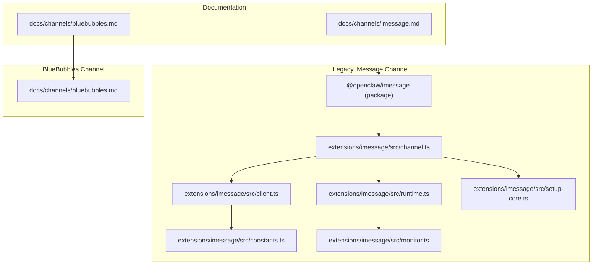
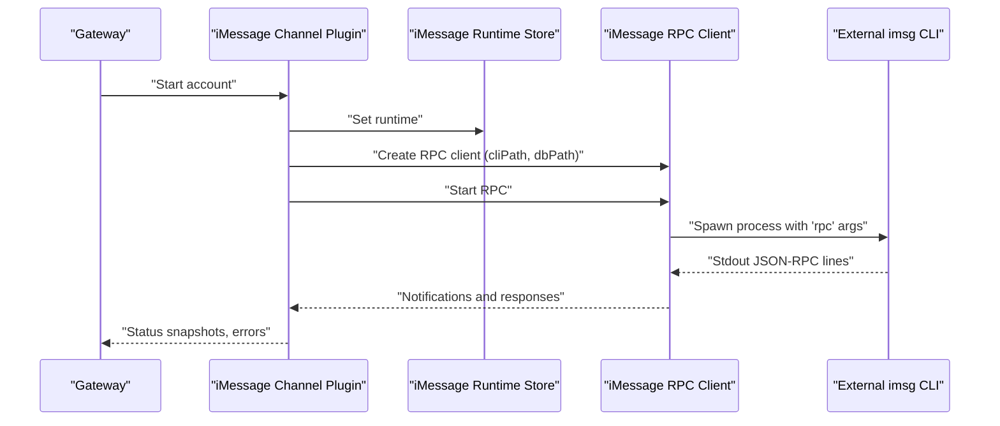
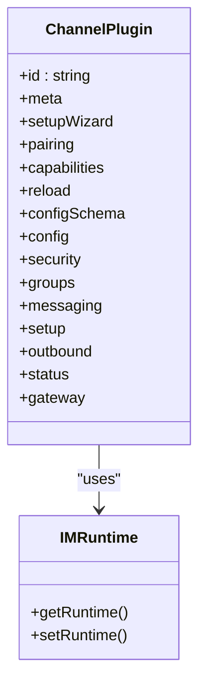
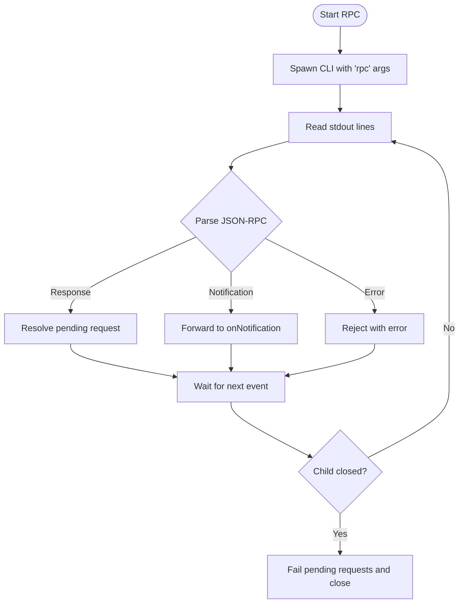
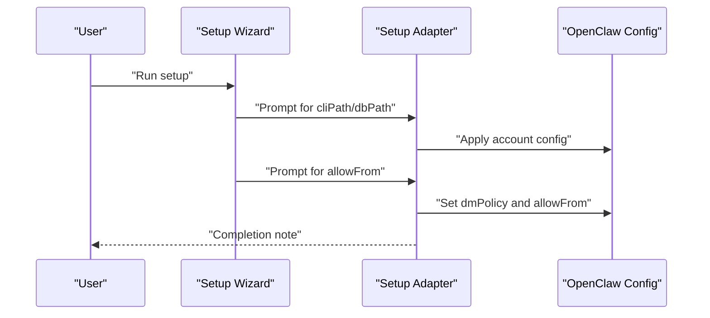
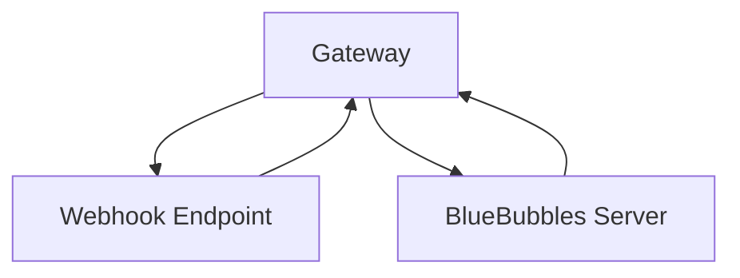
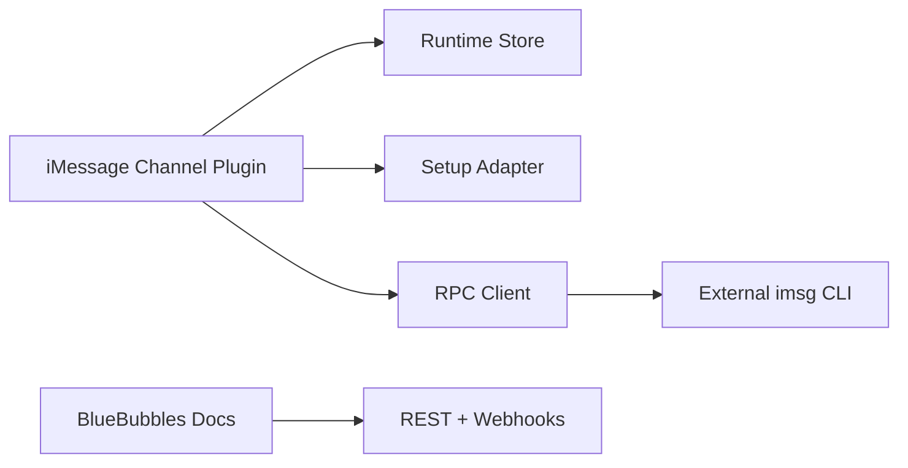

# iMessage Integration

<cite>
**Referenced Files in This Document**
- [docs/channels/imessage.md](file://docs/channels/imessage.md)
- [docs/channels/bluebubbles.md](file://docs/channels/bluebubbles.md)
- [extensions/imessage/index.ts](file://extensions/imessage/index.ts)
- [extensions/imessage/src/channel.ts](file://extensions/imessage/src/channel.ts)
- [extensions/imessage/src/client.ts](file://extensions/imessage/src/client.ts)
- [extensions/imessage/src/constants.ts](file://extensions/imessage/src/constants.ts)
- [extensions/imessage/src/runtime.ts](file://extensions/imessage/src/runtime.ts)
- [extensions/imessage/src/monitor.ts](file://extensions/imessage/src/monitor.ts)
- [extensions/imessage/src/setup-core.ts](file://extensions/imessage/src/setup-core.ts)
- [extensions/imessage/package.json](file://extensions/imessage/package.json)
- [docs/platforms/macos.md](file://docs/platforms/macos.md)
</cite>

## Table of Contents
1. [Introduction](#introduction)
2. [Project Structure](#project-structure)
3. [Core Components](#core-components)
4. [Architecture Overview](#architecture-overview)
5. [Detailed Component Analysis](#detailed-component-analysis)
6. [Dependency Analysis](#dependency-analysis)
7. [Performance Considerations](#performance-considerations)
8. [Troubleshooting Guide](#troubleshooting-guide)
9. [Conclusion](#conclusion)
10. [Appendices](#appendices)

## Introduction
This document explains the current iMessage integration landscape in the repository, focusing on the legacy iMessage channel powered by an external CLI and the preferred BlueBubbles channel. It outlines technical constraints, security model implications, platform-specific considerations (macOS), and practical workarounds. It also compares the two approaches, highlights sandboxing and entitlement requirements, and provides troubleshooting guidance for existing components.

## Project Structure
The iMessage integration spans documentation, a legacy channel plugin, and a modern BlueBubbles channel plugin. The legacy channel relies on an external CLI and JSON-RPC over stdio, while BlueBubbles provides a REST-based integration with richer features and easier setup.

**Diagram sources**
- [extensions/imessage/package.json:1-14](file://extensions/imessage/package.json#L1-L14)
- [extensions/imessage/src/channel.ts:1-251](file://extensions/imessage/src/channel.ts#L1-L251)
- [extensions/imessage/src/client.ts:1-256](file://extensions/imessage/src/client.ts#L1-L256)
- [extensions/imessage/src/constants.ts:1-3](file://extensions/imessage/src/constants.ts#L1-L3)
- [extensions/imessage/src/runtime.ts:1-7](file://extensions/imessage/src/runtime.ts#L1-L7)
- [extensions/imessage/src/monitor.ts:1-3](file://extensions/imessage/src/monitor.ts#L1-L3)
- [extensions/imessage/src/setup-core.ts:1-237](file://extensions/imessage/src/setup-core.ts#L1-L237)
- [docs/channels/imessage.md:1-368](file://docs/channels/imessage.md#L1-L368)
- [docs/channels/bluebubbles.md:1-348](file://docs/channels/bluebubbles.md#L1-L348)

**Section sources**
- [extensions/imessage/package.json:1-14](file://extensions/imessage/package.json#L1-L14)
- [docs/channels/imessage.md:1-368](file://docs/channels/imessage.md#L1-L368)
- [docs/channels/bluebubbles.md:1-348](file://docs/channels/bluebubbles.md#L1-L348)

## Core Components
- Legacy iMessage channel plugin: Provides configuration, security policies, outbound messaging, status probing, and runtime orchestration around an external CLI.
- iMessage RPC client: Spawns the CLI, speaks JSON-RPC over stdio, and handles notifications and timeouts.
- BlueBubbles channel: REST-based integration with webhooks, richer actions, and easier setup.

Key responsibilities:
- Channel plugin: configuration schema, security policy resolution, outbound chunking, pairing notifications, status collection, and runtime startup.
- RPC client: process lifecycle, request/response handling, notification routing, and error propagation.
- BlueBubbles: REST endpoints for send/receive, typing/read receipts, reactions, and advanced actions.

**Section sources**
- [extensions/imessage/src/channel.ts:77-251](file://extensions/imessage/src/channel.ts#L77-L251)
- [extensions/imessage/src/client.ts:48-256](file://extensions/imessage/src/client.ts#L48-L256)
- [docs/channels/bluebubbles.md:10-348](file://docs/channels/bluebubbles.md#L10-L348)

## Architecture Overview
The legacy iMessage channel integrates via a child process running an external CLI. The plugin orchestrates runtime state, security policies, and outbound delivery. The BlueBubbles channel integrates via HTTP and webhooks.

**Diagram sources**
- [extensions/imessage/src/channel.ts:230-248](file://extensions/imessage/src/channel.ts#L230-L248)
- [extensions/imessage/src/client.ts:70-119](file://extensions/imessage/src/client.ts#L70-L119)
- [extensions/imessage/src/runtime.ts:4-7](file://extensions/imessage/src/runtime.ts#L4-L7)

## Detailed Component Analysis

### Legacy iMessage Channel Plugin
The plugin defines channel metadata, capabilities, security policies, messaging normalization, outbound chunking, and status collection. It delegates actual RPC operations to the runtime store.

**Diagram sources**
- [extensions/imessage/src/channel.ts:77-251](file://extensions/imessage/src/channel.ts#L77-L251)
- [extensions/imessage/src/runtime.ts:4-7](file://extensions/imessage/src/runtime.ts#L4-L7)

**Section sources**
- [extensions/imessage/src/channel.ts:77-251](file://extensions/imessage/src/channel.ts#L77-L251)

### iMessage RPC Client
The RPC client manages a long-running child process, reads JSON-RPC responses, and forwards notifications. It enforces timeouts and propagates errors.

**Diagram sources**
- [extensions/imessage/src/client.ts:70-247](file://extensions/imessage/src/client.ts#L70-L247)
- [extensions/imessage/src/constants.ts:1-3](file://extensions/imessage/src/constants.ts#L1-L3)

**Section sources**
- [extensions/imessage/src/client.ts:48-256](file://extensions/imessage/src/client.ts#L48-L256)
- [extensions/imessage/src/constants.ts:1-3](file://extensions/imessage/src/constants.ts#L1-L3)

### Setup and Configuration
The setup adapter and wizard integrate with the broader configuration system, prompting for allowlists, DM policy, and CLI/db paths. It supports multi-account configurations.

**Diagram sources**
- [extensions/imessage/src/setup-core.ts:100-237](file://extensions/imessage/src/setup-core.ts#L100-L237)

**Section sources**
- [extensions/imessage/src/setup-core.ts:1-237](file://extensions/imessage/src/setup-core.ts#L1-L237)

### BlueBubbles Channel (Preferred Alternative)
BlueBubbles offers a REST-based integration with webhooks, richer actions (reactions, edits, replies, effects), and easier setup. It is documented as the recommended path for new deployments.

**Diagram sources**
- [docs/channels/bluebubbles.md:10-348](file://docs/channels/bluebubbles.md#L10-L348)

**Section sources**
- [docs/channels/bluebubbles.md:1-348](file://docs/channels/bluebubbles.md#L1-L348)

## Dependency Analysis
- The iMessage channel plugin depends on the runtime store to access the underlying iMessage implementation.
- The RPC client depends on the external CLI and the Node child process APIs.
- The setup adapter integrates with the configuration system and wizard helpers.
- BlueBubbles channel depends on HTTP endpoints and webhook authentication.

**Diagram sources**
- [extensions/imessage/src/channel.ts:1-30](file://extensions/imessage/src/channel.ts#L1-L30)
- [extensions/imessage/src/client.ts:1-10](file://extensions/imessage/src/client.ts#L1-L10)
- [extensions/imessage/src/setup-core.ts:1-20](file://extensions/imessage/src/setup-core.ts#L1-L20)
- [docs/channels/bluebubbles.md:10-348](file://docs/channels/bluebubbles.md#L10-L348)

**Section sources**
- [extensions/imessage/src/channel.ts:1-30](file://extensions/imessage/src/channel.ts#L1-L30)
- [extensions/imessage/src/client.ts:1-10](file://extensions/imessage/src/client.ts#L1-L10)
- [extensions/imessage/src/setup-core.ts:1-20](file://extensions/imessage/src/setup-core.ts#L1-L20)
- [docs/channels/bluebubbles.md:1-348](file://docs/channels/bluebubbles.md#L1-L348)

## Performance Considerations
- Legacy iMessage channel: Relies on an external CLI and JSON-RPC over stdio; performance depends on CLI responsiveness and disk access for the Messages database.
- BlueBubbles channel: REST-based with webhooks; throughput depends on network latency and server capacity.
- Chunking and media limits: Both channels expose configurable limits for outbound text and media to manage bandwidth and storage.

[No sources needed since this section provides general guidance]

## Troubleshooting Guide

### Legacy iMessage (imsg)
Common issues and resolutions:
- imsg not found or RPC unsupported: Verify the CLI installation and RPC support; update the CLI if probe reports unsupported.
- DMs ignored: Check DM policy and allowlist; review pairing approvals.
- Group messages ignored: Review group policy, allowlist, and mention patterns.
- Remote attachments fail: Confirm remote host, remote attachment roots, SSH/SCP key auth, and host key presence.
- Permission prompts missed: Re-run in an interactive GUI terminal in the same user/session context and approve Full Disk Access and Automation.

**Section sources**
- [docs/channels/imessage.md:304-360](file://docs/channels/imessage.md#L304-L360)

### BlueBubbles
Common issues and resolutions:
- Typing/read events stop: Check webhook logs and verify the gateway path matches the configured webhook path.
- Pairing codes expire: Use pairing commands to list and approve codes.
- Reactions require private API: Ensure the server exposes the private API.
- Known OS/server compatibility issues: Some actions are hidden or disabled based on detected macOS version; adjust configuration accordingly.

**Section sources**
- [docs/channels/bluebubbles.md:337-347](file://docs/channels/bluebubbles.md#L337-L347)

### macOS Permissions and Sandboxing
- Permissions: Full Disk Access for Messages DB and Automation permission for sending messages via Messages.app are required in the process context that runs the CLI.
- Headless contexts: If running headless (LaunchAgent/SSH), trigger interactive prompts once in the same context to approve permissions.
- macOS app role: The macOS companion app owns TCC prompts and can manage permissions for UI automation tasks.

**Section sources**
- [docs/channels/imessage.md:117-133](file://docs/channels/imessage.md#L117-L133)
- [docs/platforms/macos.md:11-25](file://docs/platforms/macos.md#L11-L25)

## Conclusion
The repository documents a legacy iMessage integration via an external CLI and JSON-RPC over stdio, alongside a modern BlueBubbles channel that offers a REST/webhook-based integration with richer capabilities. For new deployments, BlueBubbles is recommended due to its ease of setup and feature completeness. Legacy iMessage remains functional but is considered legacy and may be removed in future releases. macOS permissions and headless contexts require careful attention to ensure reliable operation.

[No sources needed since this section summarizes without analyzing specific files]

## Appendices

### Platform-Specific Considerations
- macOS: Permissions (Full Disk Access, Automation), headless operation via LaunchAgent/SSH, and the macOS companion app’s role in managing UI automation and TCC prompts.
- iOS: Not covered by the legacy iMessage channel; BlueBubbles is macOS-focused.

**Section sources**
- [docs/platforms/macos.md:1-227](file://docs/platforms/macos.md#L1-L227)
- [docs/channels/bluebubbles.md:10-348](file://docs/channels/bluebubbles.md#L10-L348)

### Alternative Messaging Solutions and Migration Strategies
- Migrate from legacy iMessage to BlueBubbles by installing the BlueBubbles server, configuring REST endpoints and webhooks, and setting up allowlists and policies.
- Preserve existing iMessage identities by using multi-account configuration in BlueBubbles.
- For environments where BlueBubbles is not feasible, maintain the legacy iMessage channel with careful attention to permissions and remote attachment handling.

**Section sources**
- [docs/channels/bluebubbles.md:25-46](file://docs/channels/bluebubbles.md#L25-L46)
- [docs/channels/imessage.md:187-245](file://docs/channels/imessage.md#L187-L245)