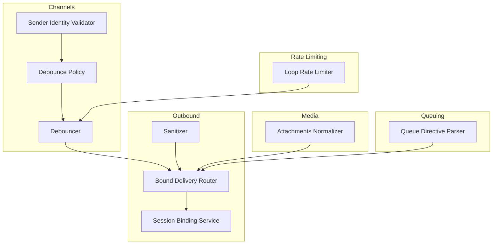
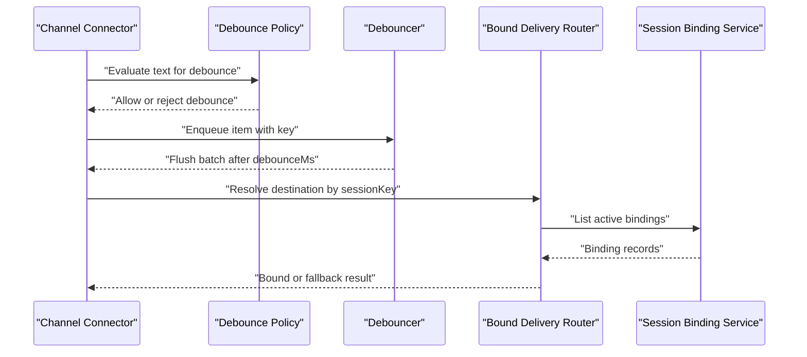
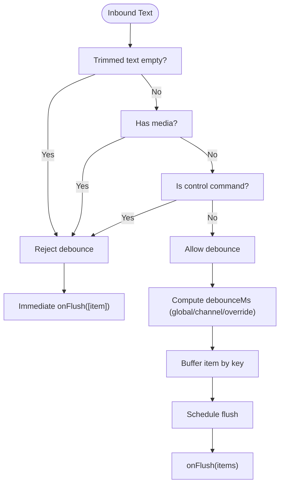
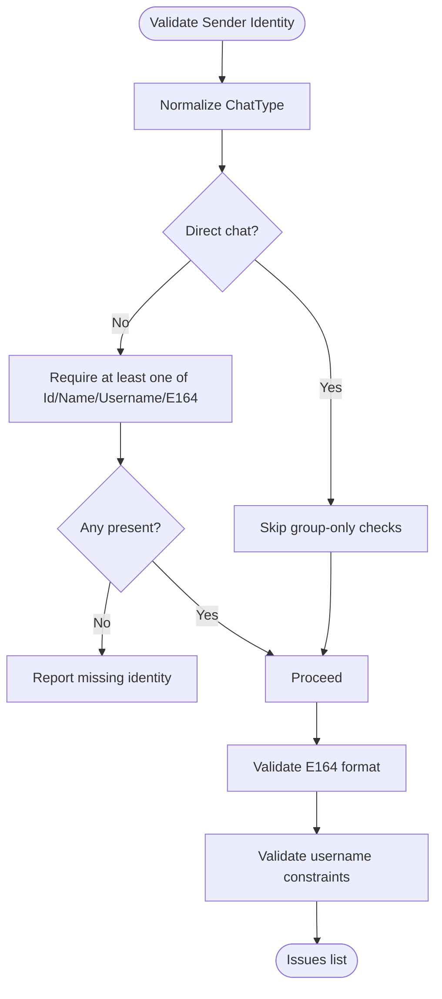
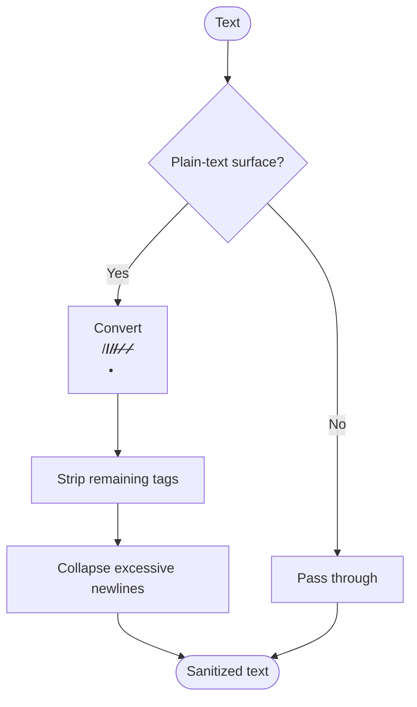
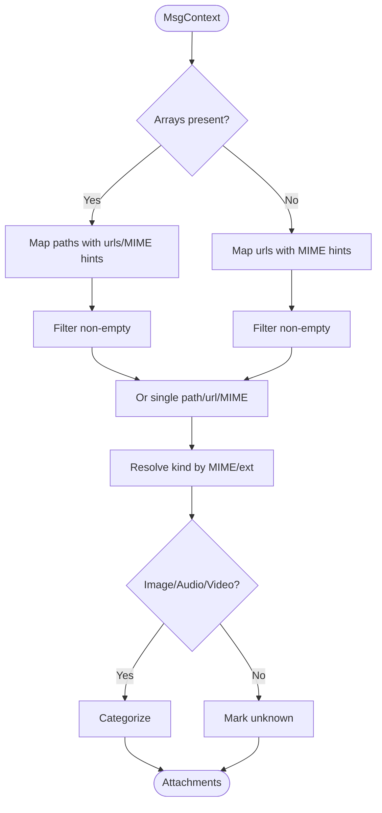
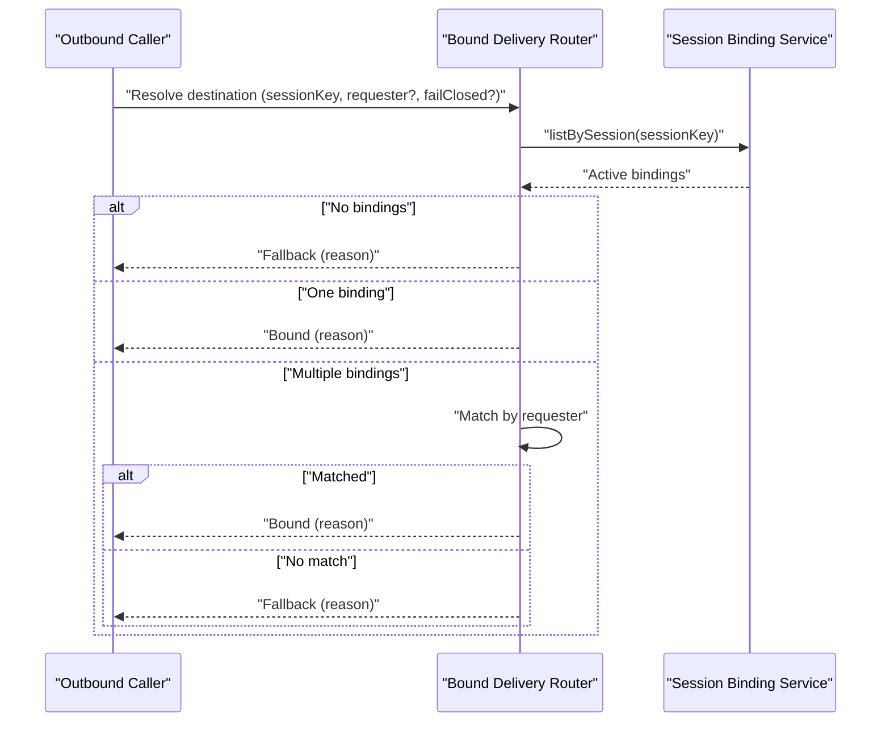
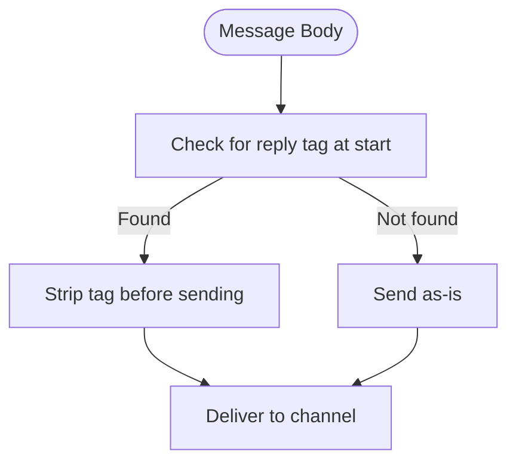
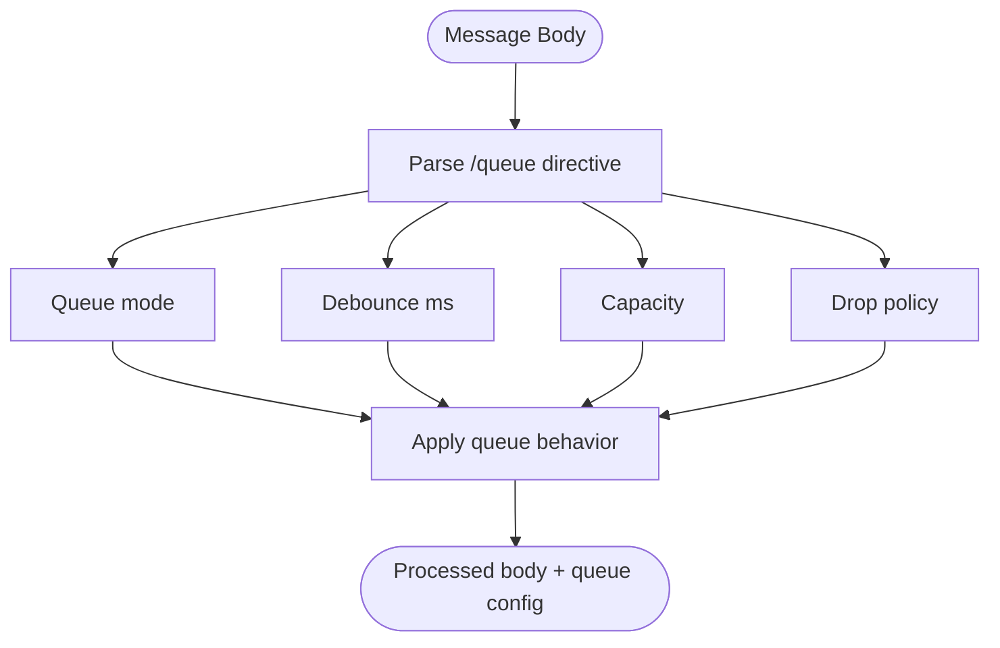
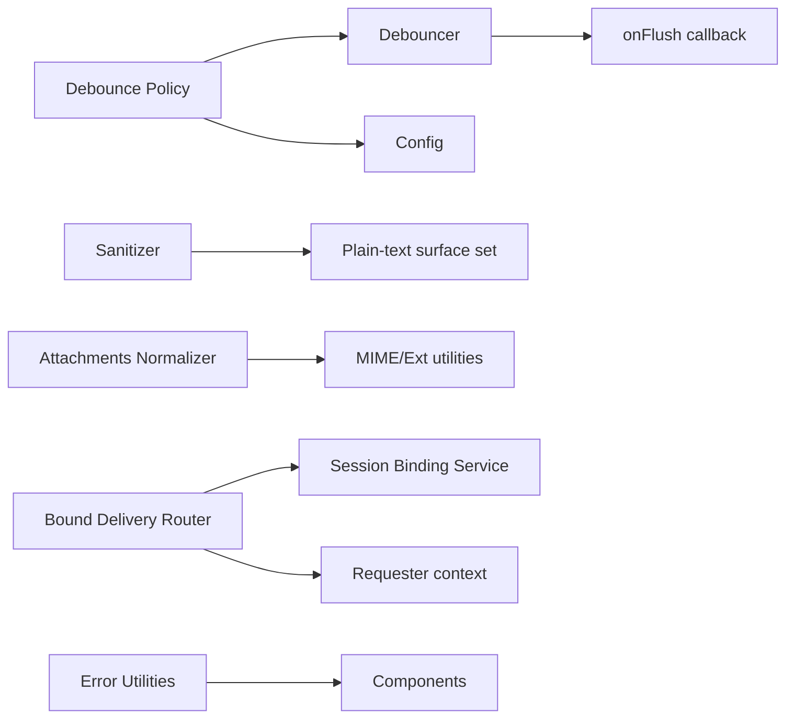

# Message Processing

<cite>
**Referenced Files in This Document**
- [inbound-debounce-policy.ts](file://src/channels/inbound-debounce-policy.ts)
- [inbound-debounce-policy.test.ts](file://src/channels/inbound-debounce-policy.test.ts)
- [inbound-debounce.ts](file://src/auto-reply/inbound-debounce.ts)
- [sender-identity.ts](file://src/channels/sender-identity.ts)
- [sanitize-text.ts](file://src/infra/outbound/sanitize-text.ts)
- [sanitize-text.test.ts](file://src/infra/outbound/sanitize-text.test.ts)
- [attachments.normalize.ts](file://src/media-understanding/attachments.normalize.ts)
- [bound-delivery-router.ts](file://src/infra/outbound/bound-delivery-router.ts)
- [session-binding-service.ts](file://src/infra/outbound/session-binding-service.ts)
- [loop-rate-limiter.ts](file://extensions/imessage/src/monitor/loop-rate-limiter.ts)
- [directive.ts](file://src/auto-reply/reply/queue/directive.ts)
- [system-prompt.ts](file://src/agents/system-prompt.ts)
- [errors.ts](file://src/infra/errors.ts)
- [manager.ts](file://src/memory/manager.ts)
</cite>

## Table of Contents
1. [Introduction](#introduction)
2. [Project Structure](#project-structure)
3. [Core Components](#core-components)
4. [Architecture Overview](#architecture-overview)
5. [Detailed Component Analysis](#detailed-component-analysis)
6. [Dependency Analysis](#dependency-analysis)
7. [Performance Considerations](#performance-considerations)
8. [Troubleshooting Guide](#troubleshooting-guide)
9. [Conclusion](#conclusion)
10. [Appendices](#appendices)

## Introduction
This document explains OpenClaw’s message processing workflows with a focus on inbound channel handling, debouncing, thread binding, routing, session management, conversation threading, identity verification, reply tagging, transformations, sanitization, media/attachments, queuing, batching, rate limiting, and debugging. It synthesizes the repository’s implementation to help both developers and operators customize behavior and extend platform-specific features.

## Project Structure
OpenClaw organizes message processing across several domains:
- Channel inbound policy and debouncing
- Outbound sanitization and routing
- Session binding and conversation threading
- Media normalization and rich content support
- Rate limiting and queue directives
- Identity validation and reply tagging system
- Error extraction and diagnostics

**Diagram sources**
- [sender-identity.ts:1-42](file://src/channels/sender-identity.ts#L1-L42)
- [inbound-debounce-policy.ts:1-52](file://src/channels/inbound-debounce-policy.ts#L1-L52)
- [inbound-debounce.ts:1-129](file://src/auto-reply/inbound-debounce.ts#L1-L129)
- [sanitize-text.ts:1-65](file://src/infra/outbound/sanitize-text.ts#L1-L65)
- [bound-delivery-router.ts:1-132](file://src/infra/outbound/bound-delivery-router.ts#L1-L132)
- [session-binding-service.ts:51-83](file://src/infra/outbound/session-binding-service.ts#L51-L83)
- [attachments.normalize.ts:1-109](file://src/media-understanding/attachments.normalize.ts#L1-L109)
- [directive.ts:1-176](file://src/auto-reply/reply/queue/directive.ts#L1-L176)
- [loop-rate-limiter.ts:1-44](file://extensions/imessage/src/monitor/loop-rate-limiter.ts#L1-L44)

**Section sources**
- [inbound-debounce-policy.ts:1-52](file://src/channels/inbound-debounce-policy.ts#L1-L52)
- [inbound-debounce.ts:1-129](file://src/auto-reply/inbound-debounce.ts#L1-L129)
- [sender-identity.ts:1-42](file://src/channels/sender-identity.ts#L1-L42)
- [sanitize-text.ts:1-65](file://src/infra/outbound/sanitize-text.ts#L1-L65)
- [attachments.normalize.ts:1-109](file://src/media-understanding/attachments.normalize.ts#L1-L109)
- [bound-delivery-router.ts:1-132](file://src/infra/outbound/bound-delivery-router.ts#L1-L132)
- [session-binding-service.ts:51-83](file://src/infra/outbound/session-binding-service.ts#L51-L83)
- [directive.ts:1-176](file://src/auto-reply/reply/queue/directive.ts#L1-L176)
- [loop-rate-limiter.ts:1-44](file://extensions/imessage/src/monitor/loop-rate-limiter.ts#L1-L44)

## Core Components
- Inbound Debounce Policy and Debouncer: Decide whether inbound text should be debounced, compute debounce timing per channel, and batch items safely.
- Sender Identity Validation: Enforce sender identity rules for direct and group contexts.
- Sanitization for Plain-Text Surfaces: Convert or strip HTML tags for channels that cannot render raw HTML.
- Attachment Normalization: Normalize media attachments from various inputs and classify kinds.
- Bound Delivery Router and Session Binding Service: Resolve destinations for outbound messages using session bindings and conversation references.
- Queue Directive Parser: Extract queue modes, caps, and drop policies from message bodies.
- Loop Rate Limiter: Detect and suppress rapid-fire echo patterns in specific connectors.
- Reply Tagging System: Provide structured reply/quote guidance embedded in system prompts.

**Section sources**
- [inbound-debounce-policy.ts:1-52](file://src/channels/inbound-debounce-policy.ts#L1-L52)
- [inbound-debounce.ts:1-129](file://src/auto-reply/inbound-debounce.ts#L1-L129)
- [sender-identity.ts:1-42](file://src/channels/sender-identity.ts#L1-L42)
- [sanitize-text.ts:1-65](file://src/infra/outbound/sanitize-text.ts#L1-L65)
- [attachments.normalize.ts:1-109](file://src/media-understanding/attachments.normalize.ts#L1-L109)
- [bound-delivery-router.ts:1-132](file://src/infra/outbound/bound-delivery-router.ts#L1-L132)
- [session-binding-service.ts:51-83](file://src/infra/outbound/session-binding-service.ts#L51-L83)
- [directive.ts:1-176](file://src/auto-reply/reply/queue/directive.ts#L1-L176)
- [loop-rate-limiter.ts:1-44](file://extensions/imessage/src/monitor/loop-rate-limiter.ts#L1-L44)
- [system-prompt.ts:81-118](file://src/agents/system-prompt.ts#L81-L118)

## Architecture Overview
The inbound pipeline validates sender identity, applies debounce decisions, batches messages, and routes them to the appropriate session binding. Outbound transformations sanitize content for plain-text surfaces, normalize attachments, and enforce queue directives. Rate limiting prevents amplification loops.

**Diagram sources**
- [inbound-debounce-policy.ts:1-52](file://src/channels/inbound-debounce-policy.ts#L1-L52)
- [inbound-debounce.ts:51-129](file://src/auto-reply/inbound-debounce.ts#L51-L129)
- [bound-delivery-router.ts:55-132](file://src/infra/outbound/bound-delivery-router.ts#L55-L132)
- [session-binding-service.ts:70-83](file://src/infra/outbound/session-binding-service.ts#L70-L83)

## Detailed Component Analysis

### Inbound Debounce Policy and Debouncer
- Policy evaluation considers blank text, media presence, control commands, and explicit overrides.
- Debouncer buffers items keyed by a stable key, schedules flushes, and invokes onFlush with batches.
- Per-channel debounce resolution supports overrides via configuration.

**Diagram sources**
- [inbound-debounce-policy.ts:10-28](file://src/channels/inbound-debounce-policy.ts#L10-L28)
- [inbound-debounce.ts:51-129](file://src/auto-reply/inbound-debounce.ts#L51-L129)

**Section sources**
- [inbound-debounce-policy.ts:1-52](file://src/channels/inbound-debounce-policy.ts#L1-L52)
- [inbound-debounce-policy.test.ts:1-62](file://src/channels/inbound-debounce-policy.test.ts#L1-L62)
- [inbound-debounce.ts:1-129](file://src/auto-reply/inbound-debounce.ts#L1-L129)

### Sender Identity Verification
- Validates sender identity fields depending on chat type (direct vs group).
- Enforces E164 format, rejects usernames containing “@” or whitespace, and ensures non-empty values when required.

**Diagram sources**
- [sender-identity.ts:4-41](file://src/channels/sender-identity.ts#L4-L41)

**Section sources**
- [sender-identity.ts:1-42](file://src/channels/sender-identity.ts#L1-L42)

### Message Sanitization for Plain-Text Surfaces
- Detects channels that cannot render raw HTML and converts common inline tags to lightweight markup.
- Preserves autolinks, normalizes line breaks, and strips remaining tags conservatively.

**Diagram sources**
- [sanitize-text.ts:26-64](file://src/infra/outbound/sanitize-text.ts#L26-L64)

**Section sources**
- [sanitize-text.ts:1-65](file://src/infra/outbound/sanitize-text.ts#L1-L65)
- [sanitize-text.test.ts:1-40](file://src/infra/outbound/sanitize-text.test.ts#L1-L40)

### Attachment Normalization and Rich Content Support
- Normalizes arrays or single values for paths, URLs, and MIME types.
- Resolves attachment kinds by MIME and file extension heuristics.

**Diagram sources**
- [attachments.normalize.ts:21-109](file://src/media-understanding/attachments.normalize.ts#L21-L109)

**Section sources**
- [attachments.normalize.ts:1-109](file://src/media-understanding/attachments.normalize.ts#L1-L109)

### Bound Delivery Routing and Session Binding
- Resolves destination binding for outbound messages using target session key and requester context.
- Supports single binding selection, requester matching, and fallback behavior.

**Diagram sources**
- [bound-delivery-router.ts:55-132](file://src/infra/outbound/bound-delivery-router.ts#L55-L132)
- [session-binding-service.ts:70-83](file://src/infra/outbound/session-binding-service.ts#L70-L83)

**Section sources**
- [bound-delivery-router.ts:1-132](file://src/infra/outbound/bound-delivery-router.ts#L1-L132)
- [session-binding-service.ts:51-83](file://src/infra/outbound/session-binding-service.ts#L51-L83)

### Conversation Threading and Reply Tagging
- System prompts include a structured “Reply Tags” section to guide native reply/quote usage on supported surfaces.
- Users can embed tags at the start of a message to request a native reply to the current trigger or a specific id.

**Diagram sources**
- [system-prompt.ts:104-118](file://src/agents/system-prompt.ts#L104-L118)

**Section sources**
- [system-prompt.ts:81-118](file://src/agents/system-prompt.ts#L81-L118)

### Message Queuing, Batch Processing, and Rate Limiting
- Queue directive parser extracts queue mode, debounce, capacity, and drop policy from message bodies.
- Loop rate limiter suppresses rapid-fire identical echoes in specific connectors to prevent queue overflow.

**Diagram sources**
- [directive.ts:124-176](file://src/auto-reply/reply/queue/directive.ts#L124-L176)

**Section sources**
- [directive.ts:1-176](file://src/auto-reply/reply/queue/directive.ts#L1-L176)
- [loop-rate-limiter.ts:1-44](file://extensions/imessage/src/monitor/loop-rate-limiter.ts#L1-L44)

## Dependency Analysis
- Debounce policy depends on configuration and command detection to decide buffering.
- Debouncer depends on a stable key function and optional per-item debounce resolution.
- Sanitizer depends on channel surface classification.
- Attachment normalizer depends on MIME and file extension utilities.
- Bound delivery router depends on session binding records and requester context.
- Error extraction utilities assist diagnostics across components.

**Diagram sources**
- [inbound-debounce-policy.ts:1-52](file://src/channels/inbound-debounce-policy.ts#L1-L52)
- [inbound-debounce.ts:1-129](file://src/auto-reply/inbound-debounce.ts#L1-L129)
- [sanitize-text.ts:1-65](file://src/infra/outbound/sanitize-text.ts#L1-L65)
- [attachments.normalize.ts:1-109](file://src/media-understanding/attachments.normalize.ts#L1-L109)
- [bound-delivery-router.ts:1-132](file://src/infra/outbound/bound-delivery-router.ts#L1-L132)
- [session-binding-service.ts:51-83](file://src/infra/outbound/session-binding-service.ts#L51-L83)
- [errors.ts:1-52](file://src/infra/errors.ts#L1-L52)

**Section sources**
- [inbound-debounce-policy.ts:1-52](file://src/channels/inbound-debounce-policy.ts#L1-L52)
- [inbound-debounce.ts:1-129](file://src/auto-reply/inbound-debounce.ts#L1-L129)
- [sanitize-text.ts:1-65](file://src/infra/outbound/sanitize-text.ts#L1-L65)
- [attachments.normalize.ts:1-109](file://src/media-understanding/attachments.normalize.ts#L1-L109)
- [bound-delivery-router.ts:1-132](file://src/infra/outbound/bound-delivery-router.ts#L1-L132)
- [session-binding-service.ts:51-83](file://src/infra/outbound/session-binding-service.ts#L51-L83)
- [errors.ts:1-52](file://src/infra/errors.ts#L1-L52)

## Performance Considerations
- Debounce scheduling uses timers with unref where available to avoid blocking the event loop.
- Per-channel debounceMs overrides allow tuning for noisy channels.
- Sanitization is linear in input length and avoids expensive regex work when not needed.
- Attachment normalization filters out empty entries early to reduce downstream processing.
- Loop rate limiting maintains bounded memory with periodic cleanup and sliding windows.

[No sources needed since this section provides general guidance]

## Troubleshooting Guide
- Error extraction helpers:
  - Extract error codes and names from exceptions for diagnostics.
  - Collect nested causes for richer error graphs.
- Memory diagnostics:
  - Error reason extraction focuses on message/code/name fields for readable summaries.
- Practical tips:
  - Verify sender identity issues reported by the validator.
  - Confirm plain-text sanitization is applied for unsupported channels.
  - Inspect queue directive parsing for unexpected modes or invalid durations.
  - Review bound delivery router reasons for ambiguous or missing bindings.

**Section sources**
- [errors.ts:1-52](file://src/infra/errors.ts#L1-L52)
- [manager.ts:521-552](file://src/memory/manager.ts#L521-L552)

## Conclusion
OpenClaw’s message processing pipeline combines configurable inbound debouncing, identity validation, sanitization, and robust routing to deliver reliable cross-platform messaging. Extensibility is achieved through per-channel debounce overrides, queue directives, and session binding semantics. Operators can tailor behavior by adjusting configuration, while developers can extend platform-specific features by integrating new sanitizers, attachment handlers, and rate-limiting strategies.

## Appendices
- Customization checklist:
  - Tune inbound debounceMs and per-channel overrides.
  - Add or refine sender identity rules for your connector.
  - Extend sanitizer for new plain-text surfaces.
  - Integrate new attachment kinds via MIME and extension heuristics.
  - Configure queue directives for desired batching and drop policies.
  - Enable loop rate limiting for connectors with echo risks.
  - Use bound delivery router to enforce strict session binding or controlled fallbacks.

[No sources needed since this section provides general guidance]