# Feishu/Lark Integration

<cite>
**Referenced Files in This Document**
- [index.ts](file://extensions/feishu/index.ts)
- [setup-entry.ts](file://extensions/feishu/setup-entry.ts)
- [client.ts](file://extensions/feishu/src/client.ts)
- [channel.ts](file://extensions/feishu/src/channel.ts)
- [config-schema.ts](file://extensions/feishu/src/config-schema.ts)
- [runtime.ts](file://extensions/feishu/src/runtime.ts)
- [monitor.ts](file://extensions/feishu/src/monitor.ts)
- [monitor.account.ts](file://extensions/feishu/src/monitor.account.ts)
- [outbound.ts](file://extensions/feishu/src/outbound.ts)
- [send.ts](file://extensions/feishu/src/send.ts)
- [reactions.ts](file://extensions/feishu/src/reactions.ts)
- [mention.ts](file://extensions/feishu/src/mention.ts)
</cite>

## Table of Contents
1. [Introduction](#introduction)
2. [Project Structure](#project-structure)
3. [Core Components](#core-components)
4. [Architecture Overview](#architecture-overview)
5. [Detailed Component Analysis](#detailed-component-analysis)
6. [Dependency Analysis](#dependency-analysis)
7. [Performance Considerations](#performance-considerations)
8. [Troubleshooting Guide](#troubleshooting-guide)
9. [Conclusion](#conclusion)
10. [Appendices](#appendices)

## Introduction
This document explains the Feishu/Lark enterprise communication integration within the project. It covers the Feishu API client implementation, authentication and connection modes (tenant access tokens via self-built app credentials), webhook setup for real-time message processing, message handling, reaction support, slash command integration, enterprise features such as department-based access control and organizational hierarchy integration, and practical guidance for configuring Feishu applications, bots, and webhook endpoints. It also documents message formatting, attachment handling, multimedia support, and best practices for enterprise deployments.

## Project Structure
The Feishu integration is implemented as a channel plugin with a modular design:
- Plugin entry and exports define the channel plugin surface and exported APIs for sending messages, media, reactions, and probing.
- Client utilities encapsulate the Feishu SDK client creation, caching, and event dispatching.
- Channel plugin wiring integrates with the platform’s plugin system, exposing capabilities, configuration, and runtime behavior.
- Monitoring orchestrates either WebSocket or Webhook connections, handles events, and routes inbound messages.
- Outbound adapters manage text and media delivery, with intelligent fallbacks and reply-in-thread support.
- Utilities provide mention parsing/formatting, reaction CRUD operations, and message retrieval/editing.

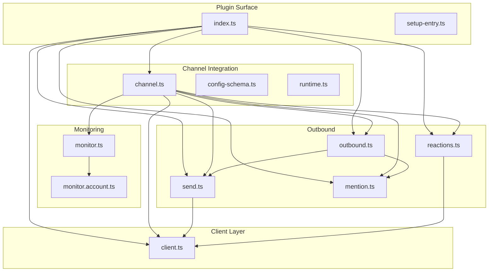

**Diagram sources**
- [index.ts:1-71](file://extensions/feishu/index.ts#L1-L71)
- [setup-entry.ts:1-6](file://extensions/feishu/setup-entry.ts#L1-L6)
- [channel.ts:1-482](file://extensions/feishu/src/channel.ts#L1-L482)
- [config-schema.ts:1-315](file://extensions/feishu/src/config-schema.ts#L1-L315)
- [runtime.ts:1-7](file://extensions/feishu/src/runtime.ts#L1-L7)
- [client.ts:1-197](file://extensions/feishu/src/client.ts#L1-L197)
- [monitor.ts:1-96](file://extensions/feishu/src/monitor.ts#L1-L96)
- [monitor.account.ts:1-657](file://extensions/feishu/src/monitor.account.ts#L1-L657)
- [outbound.ts:1-209](file://extensions/feishu/src/outbound.ts#L1-L209)
- [send.ts:1-668](file://extensions/feishu/src/send.ts#L1-L668)
- [reactions.ts:1-154](file://extensions/feishu/src/reactions.ts#L1-L154)
- [mention.ts:1-134](file://extensions/feishu/src/mention.ts#L1-L134)

**Section sources**
- [index.ts:1-71](file://extensions/feishu/index.ts#L1-L71)
- [setup-entry.ts:1-6](file://extensions/feishu/setup-entry.ts#L1-L6)
- [channel.ts:1-482](file://extensions/feishu/src/channel.ts#L1-L482)
- [config-schema.ts:1-315](file://extensions/feishu/src/config-schema.ts#L1-L315)
- [runtime.ts:1-7](file://extensions/feishu/src/runtime.ts#L1-L7)
- [client.ts:1-197](file://extensions/feishu/src/client.ts#L1-L197)
- [monitor.ts:1-96](file://extensions/feishu/src/monitor.ts#L1-L96)
- [monitor.account.ts:1-657](file://extensions/feishu/src/monitor.account.ts#L1-L657)
- [outbound.ts:1-209](file://extensions/feishu/src/outbound.ts#L1-L209)
- [send.ts:1-668](file://extensions/feishu/src/send.ts#L1-L668)
- [reactions.ts:1-154](file://extensions/feishu/src/reactions.ts#L1-L154)
- [mention.ts:1-134](file://extensions/feishu/src/mention.ts#L1-L134)

## Core Components
- Plugin entry exports:
  - Channel registration and runtime setup.
  - Public APIs for sending messages, cards, editing messages, retrieving messages, uploading media, adding/removing/listing reactions, and probing connectivity.
- Client utilities:
  - Feishu SDK client creation with caching, domain resolution, and HTTP timeout injection.
  - Event dispatcher and WebSocket client creation for webhook/WebSocket monitoring.
- Channel plugin:
  - Capability exposure (chat types, threads, media, reactions, edit, reply).
  - Configuration schema with multi-account support, connection modes, policies, and tool scopes.
  - Pairing, mentions stripping, directory integration, and outbound adapter integration.
- Monitoring:
  - Single-account orchestration for WebSocket or Webhook modes.
  - Event handler registration for message, reaction, card action, and bot menu events.
  - Deduplication, inbound debouncing, and synthetic reaction events.
- Outbound:
  - Text and media delivery with reply-in-thread support, markdown conversion, and fallbacks.
  - Auto-detection of local image paths and media uploads.
- Message and reaction utilities:
  - Mention extraction and formatting for text and cards.
  - Reaction CRUD and emoji constants.

**Section sources**
- [index.ts:13-71](file://extensions/feishu/index.ts#L13-L71)
- [client.ts:111-197](file://extensions/feishu/src/client.ts#L111-L197)
- [channel.ts:98-482](file://extensions/feishu/src/channel.ts#L98-L482)
- [monitor.account.ts:594-657](file://extensions/feishu/src/monitor.account.ts#L594-L657)
- [outbound.ts:79-209](file://extensions/feishu/src/outbound.ts#L79-L209)
- [send.ts:431-668](file://extensions/feishu/src/send.ts#L431-L668)
- [reactions.ts:31-154](file://extensions/feishu/src/reactions.ts#L31-L154)
- [mention.ts:22-134](file://extensions/feishu/src/mention.ts#L22-L134)

## Architecture Overview
The integration supports two connection modes:
- WebSocket: Real-time event streaming via the Feishu WebSocket client.
- Webhook: HTTP callbacks with verification and encryption keys.

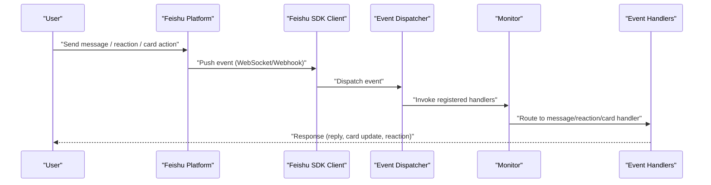

**Diagram sources**
- [client.ts:173-178](file://extensions/feishu/src/client.ts#L173-L178)
- [monitor.account.ts:589-588](file://extensions/feishu/src/monitor.account.ts#L589-L588)
- [monitor.account.ts:649-652](file://extensions/feishu/src/monitor.account.ts#L649-L652)

**Section sources**
- [client.ts:173-178](file://extensions/feishu/src/client.ts#L173-L178)
- [monitor.account.ts:589-588](file://extensions/feishu/src/monitor.account.ts#L589-L588)
- [monitor.account.ts:649-652](file://extensions/feishu/src/monitor.account.ts#L649-L652)

## Detailed Component Analysis

### Feishu API Client Implementation
- Client creation:
  - Self-built app credentials (appId/appSecret) with domain resolution (Feishu/Lark/custom URL).
  - HTTP instance wrapper injects default timeouts to avoid indefinite waits.
  - Client caching keyed by accountId to reuse instances.
- WebSocket client:
  - Creates a WS client per account with optional proxy support and logger level.
- Event dispatcher:
  - Builds an event dispatcher using encryptKey and verificationToken for webhook security.

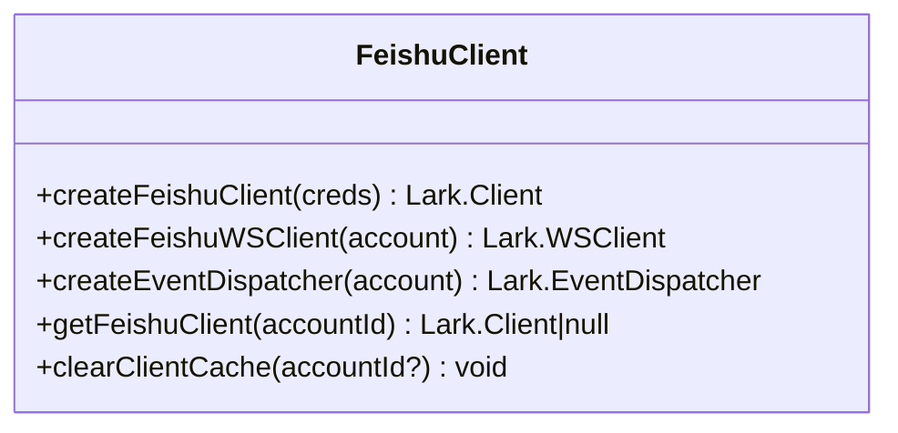

**Diagram sources**
- [client.ts:111-197](file://extensions/feishu/src/client.ts#L111-L197)

**Section sources**
- [client.ts:111-197](file://extensions/feishu/src/client.ts#L111-L197)

### Authentication Flow Using Tenant Access Tokens
- The integration uses self-built app credentials (appId/appSecret) to create clients.
- Domain resolution supports Feishu, Lark, or custom enterprise domains.
- For webhook mode, verificationToken and encryptKey are required for secure event validation and decryption.

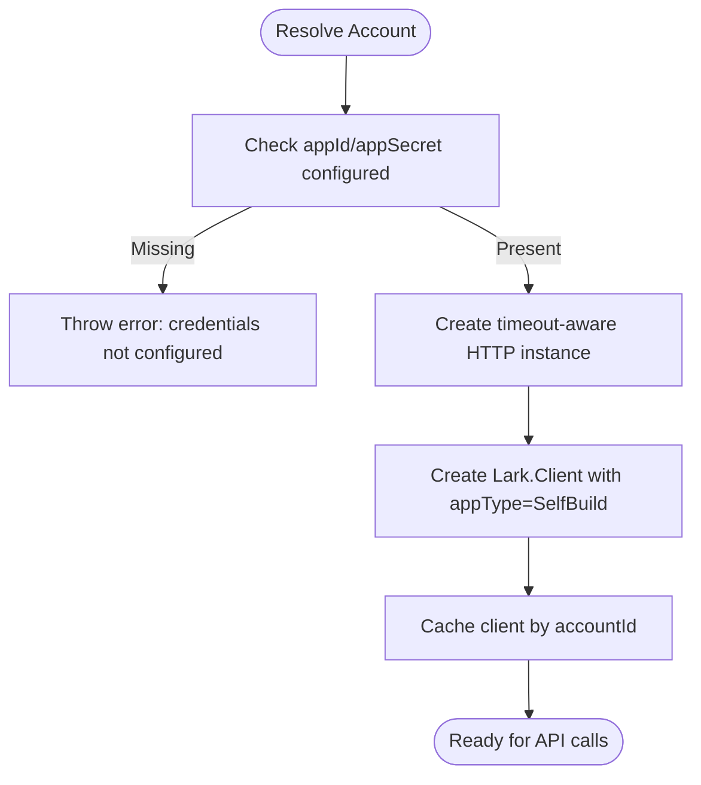

**Diagram sources**
- [client.ts:111-147](file://extensions/feishu/src/client.ts#L111-L147)

**Section sources**
- [client.ts:29-37](file://extensions/feishu/src/client.ts#L29-L37)
- [client.ts:111-147](file://extensions/feishu/src/client.ts#L111-L147)

### Webhook Setup for Real-Time Message Processing
- Webhook mode requires:
  - verificationToken (top-level or per-account).
  - encryptKey (top-level or per-account).
  - Optional webhookHost/webhookPort/path in configuration.
- Event dispatcher validates signatures and decrypts payloads.
- Handlers register for message, reaction, card action, and bot menu events.

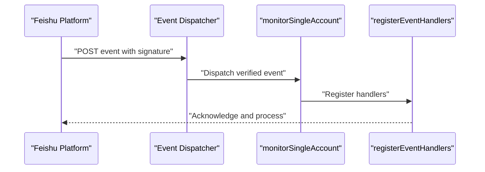

**Diagram sources**
- [config-schema.ts:252-299](file://extensions/feishu/src/config-schema.ts#L252-L299)
- [client.ts:173-178](file://extensions/feishu/src/client.ts#L173-L178)
- [monitor.account.ts:637-652](file://extensions/feishu/src/monitor.account.ts#L637-L652)

**Section sources**
- [config-schema.ts:252-299](file://extensions/feishu/src/config-schema.ts#L252-L299)
- [client.ts:173-178](file://extensions/feishu/src/client.ts#L173-L178)
- [monitor.account.ts:637-652](file://extensions/feishu/src/monitor.account.ts#L637-L652)

### Message Handling and Slash Command Integration
- Message parsing:
  - Parses inbound events, strips mentions, and merges debounced messages.
  - Supports synthetic reaction events to trigger bot behavior.
- Slash command integration:
  - Bot menu events are transformed into a standardized message event with a “/menu” command.
- Reply-in-thread:
  - Optional thread replies for group conversations using topic threads.

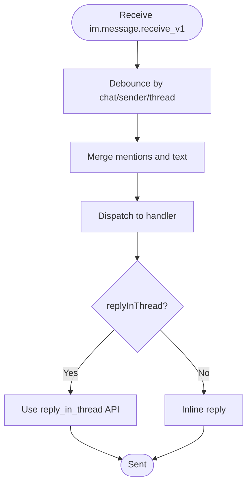

**Diagram sources**
- [monitor.account.ts:352-407](file://extensions/feishu/src/monitor.account.ts#L352-L407)
- [monitor.account.ts:512-565](file://extensions/feishu/src/monitor.account.ts#L512-L565)
- [send.ts:451-460](file://extensions/feishu/src/send.ts#L451-L460)

**Section sources**
- [monitor.account.ts:352-407](file://extensions/feishu/src/monitor.account.ts#L352-L407)
- [monitor.account.ts:512-565](file://extensions/feishu/src/monitor.account.ts#L512-L565)
- [send.ts:451-460](file://extensions/feishu/src/send.ts#L451-L460)

### Reaction Support
- Add/remove/list reactions with operator type and operator ID resolution.
- Emoji constants provide commonly used emojis.
- Synthetic reaction events:
  - Convert created/deleted reaction events into normalized message events for downstream processing.

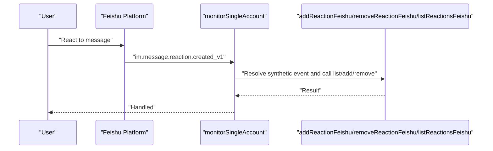

**Diagram sources**
- [reactions.ts:31-123](file://extensions/feishu/src/reactions.ts#L31-L123)
- [monitor.account.ts:453-511](file://extensions/feishu/src/monitor.account.ts#L453-L511)

**Section sources**
- [reactions.ts:31-123](file://extensions/feishu/src/reactions.ts#L31-L123)
- [monitor.account.ts:453-511](file://extensions/feishu/src/monitor.account.ts#L453-L511)

### Message Formatting, Attachment Handling, and Multimedia Support
- Text rendering:
  - Markdown tables are converted according to configuration.
  - Automatic card rendering for content with code blocks or tables.
- Media:
  - Local image path detection and automatic upload.
  - Fallback to URL link if upload fails.
  - Reply-to-messageId support for threaded replies.
- Cards:
  - Structured cards with optional header and note.
  - Interactive cards with markdown rendering.

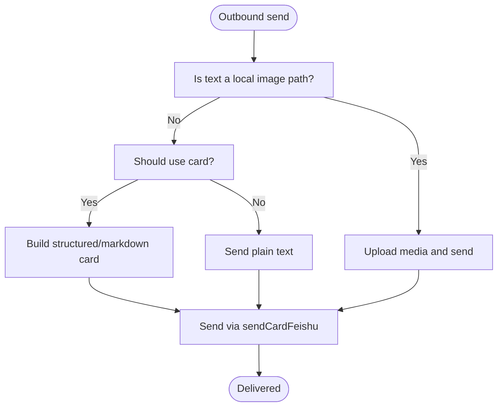

**Diagram sources**
- [outbound.ts:98-147](file://extensions/feishu/src/outbound.ts#L98-L147)
- [send.ts:585-605](file://extensions/feishu/src/send.ts#L585-L605)
- [send.ts:611-629](file://extensions/feishu/src/send.ts#L611-L629)

**Section sources**
- [outbound.ts:98-147](file://extensions/feishu/src/outbound.ts#L98-L147)
- [send.ts:585-605](file://extensions/feishu/src/send.ts#L585-L605)
- [send.ts:611-629](file://extensions/feishu/src/send.ts#L611-L629)

### Enterprise Features: Department-Based Access Control, Permissions, and Organizational Hierarchy
- Allowlists and policies:
  - allowFrom and groupAllowFrom controls inbound routing.
  - dmPolicy and groupPolicy govern open, allowlist, or disabled scopes.
- Directory integration:
  - Lists peers and groups for routing and permissions.
- Group tool policy:
  - Per-group tool enablement/deny lists.
- Mentions:
  - Extract and format mentions for both text and cards.

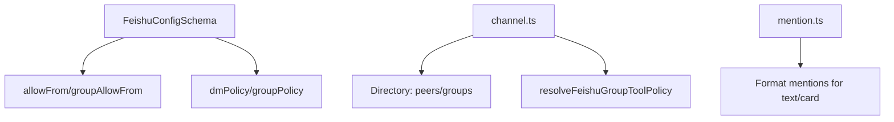

**Diagram sources**
- [config-schema.ts:13-315](file://extensions/feishu/src/config-schema.ts#L13-L315)
- [channel.ts:130-132](file://extensions/feishu/src/channel.ts#L130-L132)
- [mention.ts:22-134](file://extensions/feishu/src/mention.ts#L22-L134)

**Section sources**
- [config-schema.ts:13-315](file://extensions/feishu/src/config-schema.ts#L13-L315)
- [channel.ts:130-132](file://extensions/feishu/src/channel.ts#L130-L132)
- [mention.ts:22-134](file://extensions/feishu/src/mention.ts#L22-L134)

### Setup Procedures: Feishu Applications, Bot Configuration, and Webhook Endpoint Registration
- Application setup:
  - Create a self-built app in Feishu/Lark Cloud Console.
  - Obtain appId and appSecret.
- Bot configuration:
  - Configure domain, connectionMode, webhookHost/port, and webhookPath.
  - Enable verificationToken and encryptKey for webhook mode.
- Webhook endpoint:
  - Expose the configured path (default: /feishu/events) and ensure HTTPS termination.
  - Verify signature and decrypt payloads using provided keys.

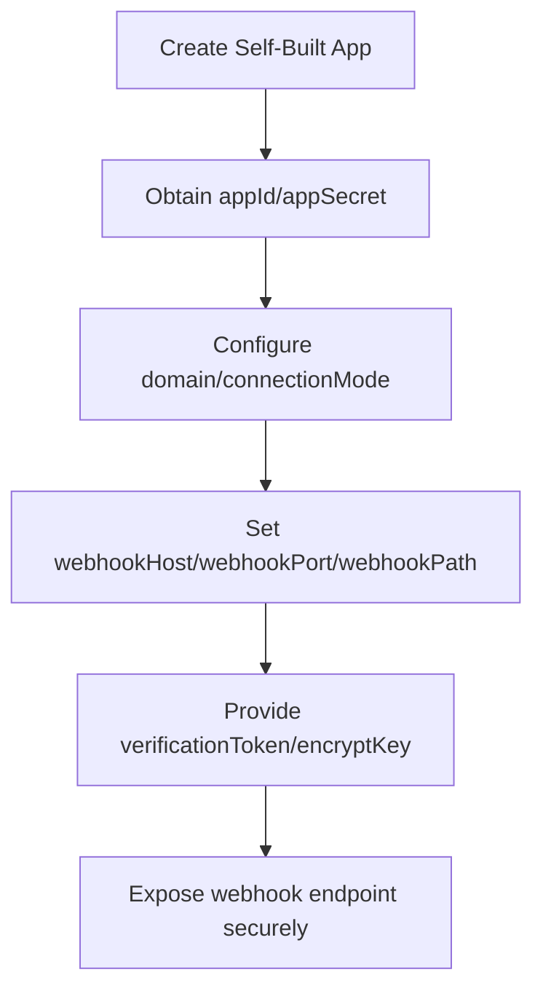

**Diagram sources**
- [config-schema.ts:208-235](file://extensions/feishu/src/config-schema.ts#L208-L235)
- [config-schema.ts:252-299](file://extensions/feishu/src/config-schema.ts#L252-L299)

**Section sources**
- [config-schema.ts:208-235](file://extensions/feishu/src/config-schema.ts#L208-L235)
- [config-schema.ts:252-299](file://extensions/feishu/src/config-schema.ts#L252-L299)

## Dependency Analysis
- Coupling:
  - Channel plugin depends on client utilities, outbound adapter, and runtime store.
  - Monitor depends on client dispatcher and runtime for event handling.
- Cohesion:
  - Each module encapsulates a responsibility: client, monitoring, outbound, utilities.
- External dependencies:
  - Feishu SDK client and event dispatcher.
  - Optional HTTPS proxy agent for WS connections.

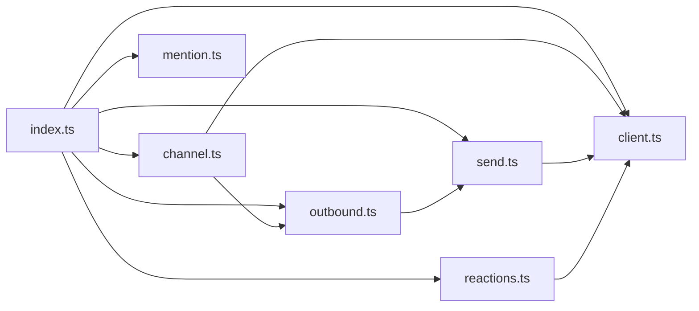

**Diagram sources**
- [index.ts:1-71](file://extensions/feishu/index.ts#L1-L71)
- [channel.ts:1-482](file://extensions/feishu/src/channel.ts#L1-L482)
- [client.ts:1-197](file://extensions/feishu/src/client.ts#L1-L197)
- [outbound.ts:1-209](file://extensions/feishu/src/outbound.ts#L1-L209)
- [send.ts:1-668](file://extensions/feishu/src/send.ts#L1-L668)
- [reactions.ts:1-154](file://extensions/feishu/src/reactions.ts#L1-L154)
- [mention.ts:1-134](file://extensions/feishu/src/mention.ts#L1-L134)

**Section sources**
- [index.ts:1-71](file://extensions/feishu/index.ts#L1-L71)
- [channel.ts:1-482](file://extensions/feishu/src/channel.ts#L1-L482)
- [client.ts:1-197](file://extensions/feishu/src/client.ts#L1-L197)
- [outbound.ts:1-209](file://extensions/feishu/src/outbound.ts#L1-L209)
- [send.ts:1-668](file://extensions/feishu/src/send.ts#L1-L668)
- [reactions.ts:1-154](file://extensions/feishu/src/reactions.ts#L1-L154)
- [mention.ts:1-134](file://extensions/feishu/src/mention.ts#L1-L134)

## Performance Considerations
- Client caching:
  - Reuse Feishu clients per accountId to reduce initialization overhead.
- Timeout configuration:
  - Default and configurable HTTP timeouts prevent indefinite hangs.
- Inbound debouncing:
  - Merges rapid-fire messages and suppresses duplicates to reduce processing load.
- Reply fallback:
  - Automatically falls back to direct send when reply target is unavailable, minimizing retries.

[No sources needed since this section provides general guidance]

## Troubleshooting Guide
- Missing credentials:
  - Ensure appId and appSecret are configured for the selected account.
- Webhook mode errors:
  - verificationToken and encryptKey must be set when connectionMode is webhook.
- Withdrawn reply target:
  - Reply failures with specific error codes trigger fallback to direct send.
- Rate limiting and deduplication:
  - Monitor rate-limit state and deduplication records for repeated events.
- Proxy connectivity:
  - WS client respects HTTPS proxy environment variables.

**Section sources**
- [client.ts:115-117](file://extensions/feishu/src/client.ts#L115-L117)
- [config-schema.ts:252-299](file://extensions/feishu/src/config-schema.ts#L252-L299)
- [send.ts:29-56](file://extensions/feishu/src/send.ts#L29-L56)
- [monitor.ts:23-29](file://extensions/feishu/src/monitor.ts#L23-L29)
- [client.ts:160-167](file://extensions/feishu/src/client.ts#L160-L167)

## Conclusion
The Feishu/Lark integration provides a robust, enterprise-grade channel plugin supporting both WebSocket and Webhook modes, comprehensive message and reaction handling, structured card rendering, and strong access control via allowlists and group policies. With clear setup procedures, resilient error handling, and performance-conscious design, it enables reliable real-time communication within Feishu/Lark environments.

[No sources needed since this section summarizes without analyzing specific files]

## Appendices

### Best Practices for Enterprise Deployments
- Prefer webhook mode for production with HTTPS termination and signed/encrypted events.
- Use multi-account configuration for segmented environments.
- Configure allowlists and group policies to enforce department-based access.
- Monitor rate limits and adjust inbound debounce settings for high-volume tenants.
- Leverage reply-in-thread for organized discussions and improve user experience.

[No sources needed since this section provides general guidance]