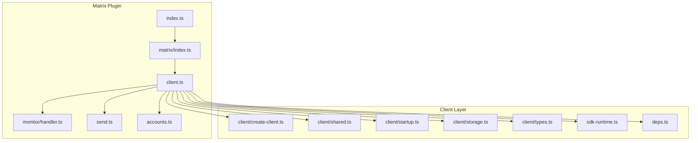
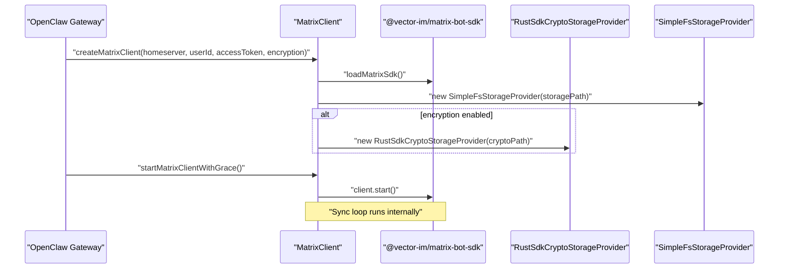
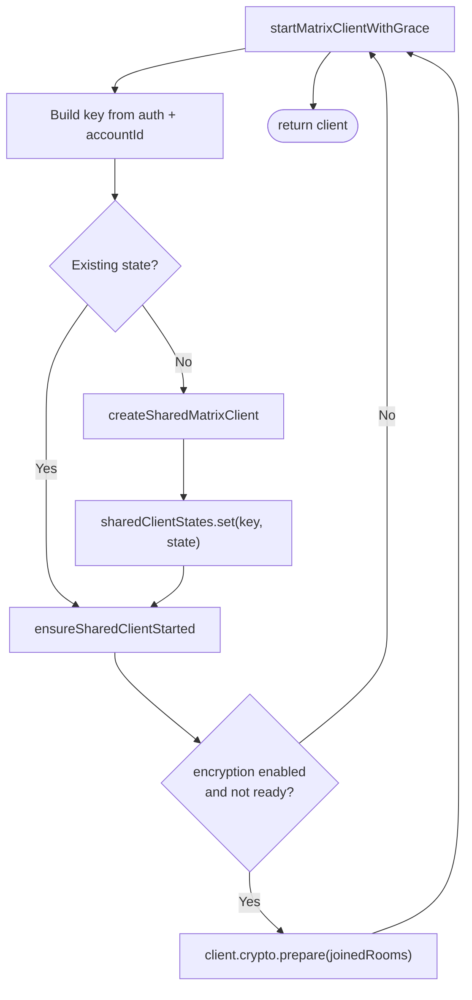
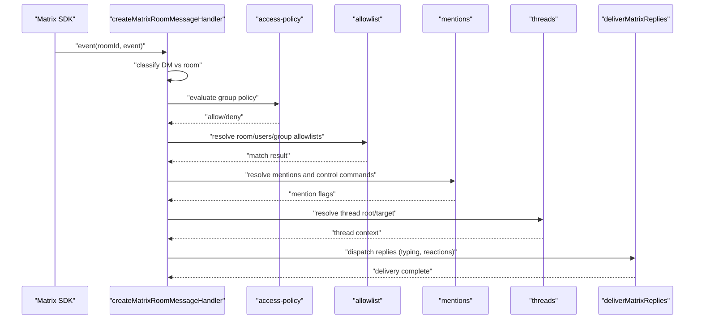
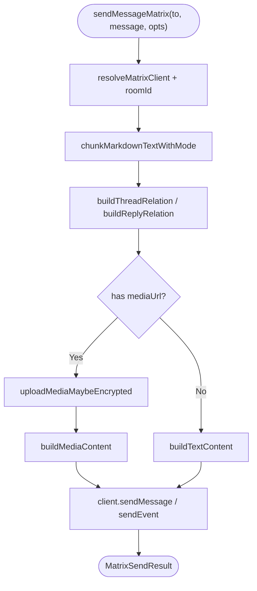
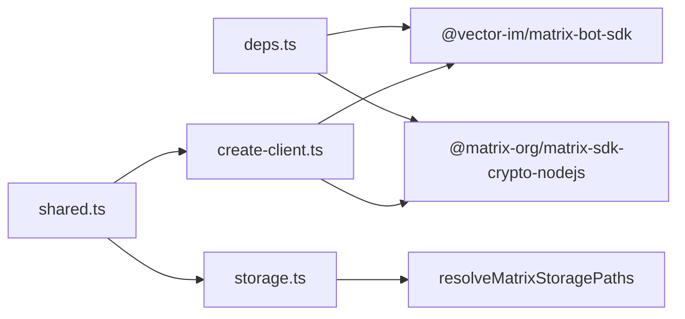

# Matrix Federation

<cite>
**Referenced Files in This Document**
- [matrix.md](file://docs/channels/matrix.md)
- [index.ts](file://extensions/matrix/src/index.ts)
- [matrix.ts](file://extensions/matrix/src/matrix/index.ts)
- [client.ts](file://extensions/matrix/src/matrix/client.ts)
- [create-client.ts](file://extensions/matrix/src/matrix/client/create-client.ts)
- [shared.ts](file://extensions/matrix/src/matrix/client/shared.ts)
- [startup.ts](file://extensions/matrix/src/matrix/client/startup.ts)
- [storage.ts](file://extensions/matrix/src/matrix/client/storage.ts)
- [types.ts](file://extensions/matrix/src/matrix/client/types.ts)
- [sdk-runtime.ts](file://extensions/matrix/src/matrix/sdk-runtime.ts)
- [deps.ts](file://extensions/matrix/src/matrix/deps.ts)
- [handler.ts](file://extensions/matrix/src/matrix/monitor/handler.ts)
- [rooms.ts](file://extensions/matrix/src/matrix/monitor/rooms.ts)
- [send.ts](file://extensions/matrix/src/matrix/send.ts)
- [targets.ts](file://extensions/matrix/src/matrix/send/targets.ts)
- [media.ts](file://extensions/matrix/src/matrix/monitor/media.ts)
- [poll-types.ts](file://extensions/matrix/src/matrix/poll-types.ts)
- [accounts.ts](file://extensions/matrix/src/matrix/accounts.ts)
- [runtime.ts](file://src/runtime.ts)
</cite>

## Table of Contents
1. [Introduction](#introduction)
2. [Project Structure](#project-structure)
3. [Core Components](#core-components)
4. [Architecture Overview](#architecture-overview)
5. [Detailed Component Analysis](#detailed-component-analysis)
6. [Dependency Analysis](#dependency-analysis)
7. [Performance Considerations](#performance-considerations)
8. [Troubleshooting Guide](#troubleshooting-guide)
9. [Conclusion](#conclusion)
10. [Appendices](#appendices)

## Introduction
This document explains how the project integrates with the Matrix decentralized messaging protocol to support federation and end-to-end encryption (E2EE). It covers the Matrix client implementation using the Matrix SDK, encryption setup, room membership management, and cross-domain message routing. It also documents homeserver configuration, bot account creation, encryption key distribution, room types, group chat features, media sharing, federation security and trust models, privacy considerations, and troubleshooting for federation and encryption issues.

## Project Structure
The Matrix integration is implemented as a plugin under the extensions/matrix directory. Key areas:
- Client lifecycle and crypto: client creation, shared client management, startup, storage, and types
- Monitoring and routing: inbound message handling, room allowlists, mentions, threads, and replies
- Sending: outbound message building, media upload, reactions, typing indicators, and receipts
- Accounts and runtime: multi-account support and runtime integration
- Documentation: channel-specific Matrix documentation and configuration guidance

**Diagram sources**
- [index.ts](file://extensions/matrix/src/index.ts)
- [matrix.ts](file://extensions/matrix/src/matrix/index.ts)
- [client.ts](file://extensions/matrix/src/matrix/client.ts)
- [create-client.ts](file://extensions/matrix/src/matrix/client/create-client.ts)
- [shared.ts](file://extensions/matrix/src/matrix/client/shared.ts)
- [startup.ts](file://extensions/matrix/src/matrix/client/startup.ts)
- [storage.ts](file://extensions/matrix/src/matrix/client/storage.ts)
- [types.ts](file://extensions/matrix/src/matrix/client/types.ts)
- [sdk-runtime.ts](file://extensions/matrix/src/matrix/sdk-runtime.ts)
- [deps.ts](file://extensions/matrix/src/matrix/deps.ts)
- [handler.ts](file://extensions/matrix/src/matrix/monitor/handler.ts)
- [send.ts](file://extensions/matrix/src/matrix/send.ts)
- [accounts.ts](file://extensions/matrix/src/matrix/accounts.ts)

**Section sources**
- [matrix.md](file://docs/channels/matrix.md)
- [index.ts](file://extensions/matrix/src/index.ts)
- [matrix.ts](file://extensions/matrix/src/matrix/index.ts)
- [client.ts](file://extensions/matrix/src/matrix/client.ts)

## Core Components
- Matrix client lifecycle and crypto:
  - Creation with storage and optional crypto storage
  - Shared client management keyed by homeserver, user, access token, encryption flag, and account ID
  - Startup with graceful error handling
  - Storage path resolution and migration, plus metadata persistence
- Monitoring and routing:
  - Inbound message handler supporting rooms, DMs, mentions, threads, media, location, and polls
  - Room allowlist evaluation and group routing policies
- Outbound messaging:
  - Text chunking, thread relations, media upload (including encryption), reactions, typing, read receipts
- Accounts and runtime:
  - Multi-account support and runtime integration for configuration and state

**Section sources**
- [create-client.ts](file://extensions/matrix/src/matrix/client/create-client.ts)
- [shared.ts](file://extensions/matrix/src/matrix/client/shared.ts)
- [startup.ts](file://extensions/matrix/src/matrix/client/startup.ts)
- [storage.ts](file://extensions/matrix/src/matrix/client/storage.ts)
- [handler.ts](file://extensions/matrix/src/matrix/monitor/handler.ts)
- [rooms.ts](file://extensions/matrix/src/matrix/monitor/rooms.ts)
- [send.ts](file://extensions/matrix/src/matrix/send.ts)
- [accounts.ts](file://extensions/matrix/src/matrix/accounts.ts)

## Architecture Overview
The Matrix integration composes a client layer built on the Matrix SDK, a monitoring layer that evaluates access and routes messages, and a sending layer that formats and delivers outbound content. Crypto is initialized per client when enabled, and storage is isolated per account and access token.

**Diagram sources**
- [create-client.ts](file://extensions/matrix/src/matrix/client/create-client.ts)
- [startup.ts](file://extensions/matrix/src/matrix/client/startup.ts)
- [sdk-runtime.ts](file://extensions/matrix/src/matrix/sdk-runtime.ts)
- [storage.ts](file://extensions/matrix/src/matrix/client/storage.ts)

## Detailed Component Analysis

### Matrix Client Lifecycle and Crypto
- Client creation:
  - Resolves storage paths per account and access token, migrates legacy storage, writes metadata
  - Optionally initializes crypto storage when encryption is enabled
  - Wraps crypto updateSyncData to sanitize device lists and handle malformed entries
- Shared client management:
  - Builds a composite key from homeserver, user, access token, encryption flag, and account ID
  - Serializes creation and startup to avoid races
  - Prepares crypto for joined rooms when encryption is enabled
- Startup:
  - Starts the client with a grace period to surface startup errors promptly

**Diagram sources**
- [shared.ts](file://extensions/matrix/src/matrix/client/shared.ts)
- [startup.ts](file://extensions/matrix/src/matrix/client/startup.ts)
- [create-client.ts](file://extensions/matrix/src/matrix/client/create-client.ts)

**Section sources**
- [create-client.ts](file://extensions/matrix/src/matrix/client/create-client.ts)
- [shared.ts](file://extensions/matrix/src/matrix/client/shared.ts)
- [startup.ts](file://extensions/matrix/src/matrix/client/startup.ts)
- [storage.ts](file://extensions/matrix/src/matrix/client/storage.ts)
- [types.ts](file://extensions/matrix/src/matrix/client/types.ts)
- [sdk-runtime.ts](file://extensions/matrix/src/matrix/sdk-runtime.ts)
- [deps.ts](file://extensions/matrix/src/matrix/deps.ts)

### Inbound Message Handling and Room Membership Management
- Inbound pipeline:
  - Filters encrypted messages (decrypted by SDK)
  - Handles poll start events, locations, and regular room messages
  - Determines DM vs room, applies group routing policy, enforces allowlists, and evaluates mentions
  - Downloads media (with size limits), resolves thread roots, and builds session context
  - Dispatches replies with typing indicators and optional acknowledgment reactions
- Room membership and routing:
  - Uses room allowlists and wildcard entries to gate access
  - Overrides DM-to-group routing when explicitly configured for a room
  - Supports thread replies and reply-to modes

**Diagram sources**
- [handler.ts](file://extensions/matrix/src/matrix/monitor/handler.ts)
- [rooms.ts](file://extensions/matrix/src/matrix/monitor/rooms.ts)
- [media.ts](file://extensions/matrix/src/matrix/monitor/media.ts)
- [poll-types.ts](file://extensions/matrix/src/matrix/poll-types.ts)

**Section sources**
- [handler.ts](file://extensions/matrix/src/matrix/monitor/handler.ts)
- [rooms.ts](file://extensions/matrix/src/matrix/monitor/rooms.ts)
- [media.ts](file://extensions/matrix/src/matrix/monitor/media.ts)
- [poll-types.ts](file://extensions/matrix/src/matrix/poll-types.ts)

### Outbound Messaging, Media, and Reactions
- Outbound message composition:
  - Markdown table conversion and text chunking with configurable limits and modes
  - Thread relations and reply-to relations
  - Media upload with encryption in encrypted rooms, image info preparation, and voice message decisions
- Reactions, typing, and read receipts:
  - Sends emoji reactions, typing indicators, and read receipts
  - Integrates with send queues for reliable delivery

**Diagram sources**
- [send.ts](file://extensions/matrix/src/matrix/send.ts)
- [targets.ts](file://extensions/matrix/src/matrix/send/targets.ts)

**Section sources**
- [send.ts](file://extensions/matrix/src/matrix/send.ts)
- [targets.ts](file://extensions/matrix/src/matrix/send/targets.ts)

### Multi-Account and Runtime Integration
- Multi-account support:
  - Separate clients per account, with per-account configuration inheriting from top-level settings
  - Serialized startup to avoid concurrency issues
- Runtime integration:
  - Loads configuration, resolves credentials, and manages client lifecycle
  - Stores crypto and sync state per account and access token

**Section sources**
- [accounts.ts](file://extensions/matrix/src/matrix/accounts.ts)
- [shared.ts](file://extensions/matrix/src/matrix/client/shared.ts)
- [storage.ts](file://extensions/matrix/src/matrix/client/storage.ts)
- [matrix.md](file://docs/channels/matrix.md)

## Dependency Analysis
- SDK and crypto:
  - Matrix SDK is lazily loaded and cached
  - Crypto runtime is bootstrapped if missing, with platform-specific binaries downloaded when needed
- Storage isolation:
  - Storage paths are derived from homeserver, user ID, and hashed access token
  - Metadata records the homeserver, user, account key, and token hash
- Client coupling:
  - Client creation depends on SDK availability and optional crypto availability
  - Shared client management coordinates startup and crypto preparation

**Diagram sources**
- [deps.ts](file://extensions/matrix/src/matrix/deps.ts)
- [create-client.ts](file://extensions/matrix/src/matrix/client/create-client.ts)
- [shared.ts](file://extensions/matrix/src/matrix/client/shared.ts)
- [storage.ts](file://extensions/matrix/src/matrix/client/storage.ts)

**Section sources**
- [deps.ts](file://extensions/matrix/src/matrix/deps.ts)
- [sdk-runtime.ts](file://extensions/matrix/src/matrix/sdk-runtime.ts)
- [create-client.ts](file://extensions/matrix/src/matrix/client/create-client.ts)
- [shared.ts](file://extensions/matrix/src/matrix/client/shared.ts)
- [storage.ts](file://extensions/matrix/src/matrix/client/storage.ts)

## Performance Considerations
- Client startup and synchronization:
  - Use appropriate initial sync limits to balance freshness and bandwidth
  - Enable encryption only when needed to avoid crypto initialization overhead
- Message throughput:
  - Chunk long text to respect client limits and improve readability
  - Batch media uploads and avoid redundant downloads
- Storage and crypto:
  - Keep crypto stores on fast disks; consider SSD for frequent syncs
  - Monitor storage growth per account and clean up old sessions periodically
- Concurrency:
  - Rely on internal SDK sync loops; avoid manual polling
  - Use send queues to serialize outbound operations and reduce rate-limiting risk

[No sources needed since this section provides general guidance]

## Troubleshooting Guide
- General diagnostics:
  - Use status and doctor commands to inspect channel and gateway health
  - Inspect logs for Matrix client errors and crypto warnings
- DM pairing:
  - List and approve pairing codes for unknown senders when pairing policy is enabled
- Room routing:
  - Verify group policy and allowlists; ensure rooms are explicitly allowed or wildcard rules match
- Encryption:
  - Confirm crypto runtime is available and properly bootstrapped
  - Re-verify devices in other clients to enable key sharing when decryption fails
- Media and threads:
  - Check media size limits and MXC URL validity
  - Validate thread IDs and reply-to relations

**Section sources**
- [matrix.md](file://docs/channels/matrix.md)

## Conclusion
The Matrix integration provides a robust, extensible foundation for decentralized messaging with strong support for E2EE, room management, and media. By leveraging shared clients, structured storage, and a clear separation of concerns across monitoring, routing, and sending, the system scales across multiple accounts and environments while maintaining security and performance.

[No sources needed since this section summarizes without analyzing specific files]

## Appendices

### Setup Procedures
- Install the Matrix plugin and configure credentials (homeserver, access token, or user/password)
- Enable encryption when required and verify devices in a Matrix client
- Configure DM and room policies, allowlists, and thread reply behavior
- For multi-account deployments, define per-account settings and bindings to agents

**Section sources**
- [matrix.md](file://docs/channels/matrix.md)

### Security and Privacy Notes
- Trust model:
  - Device verification establishes trust for key sharing in encrypted rooms
  - Access control relies on allowlists and policies for DMs and rooms
- Privacy:
  - Media is encrypted when sent to encrypted rooms
  - Storage is isolated per account and access token; metadata includes homeserver and user identifiers

**Section sources**
- [matrix.md](file://docs/channels/matrix.md)
- [storage.ts](file://extensions/matrix/src/matrix/client/storage.ts)