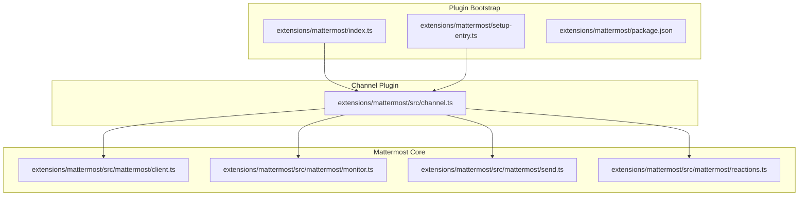
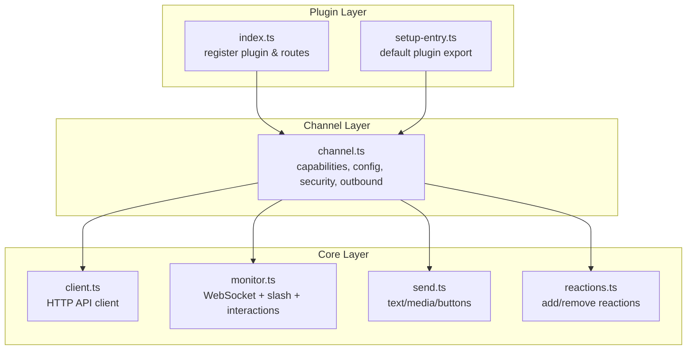
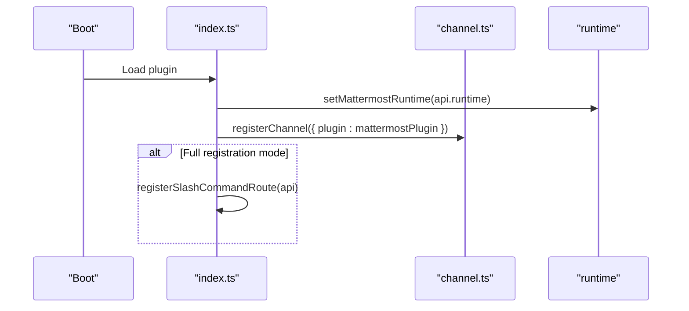
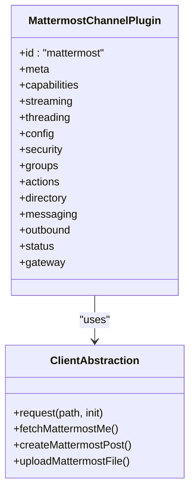
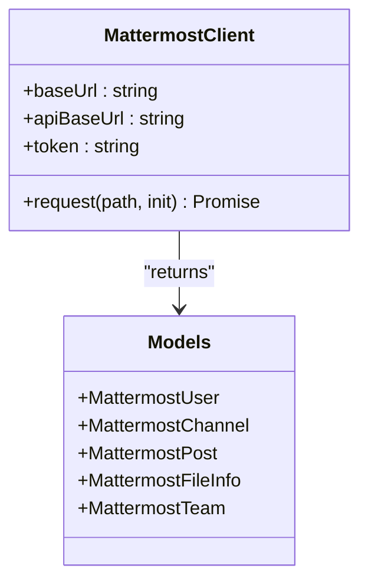
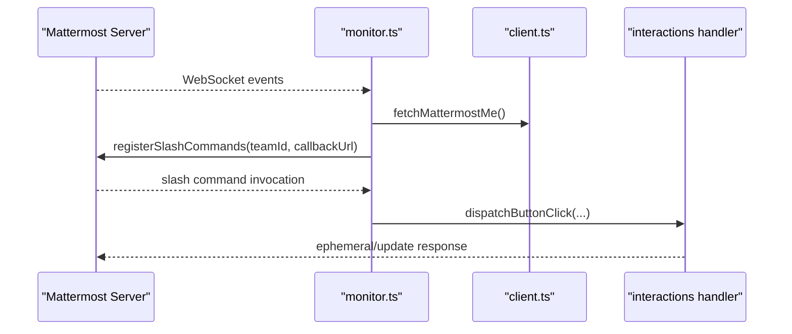
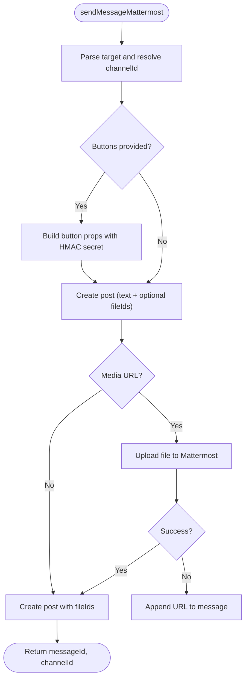
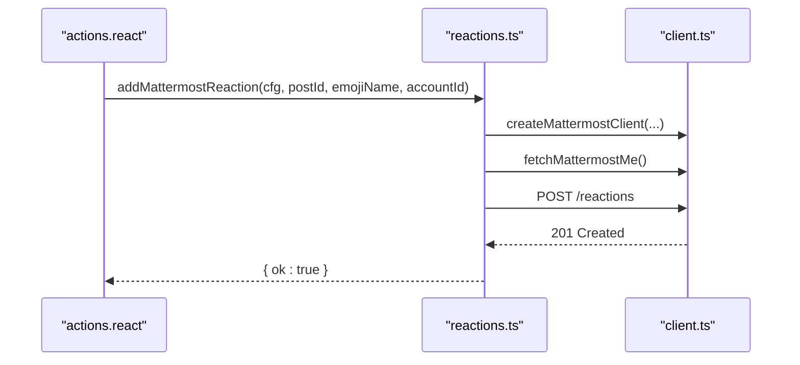
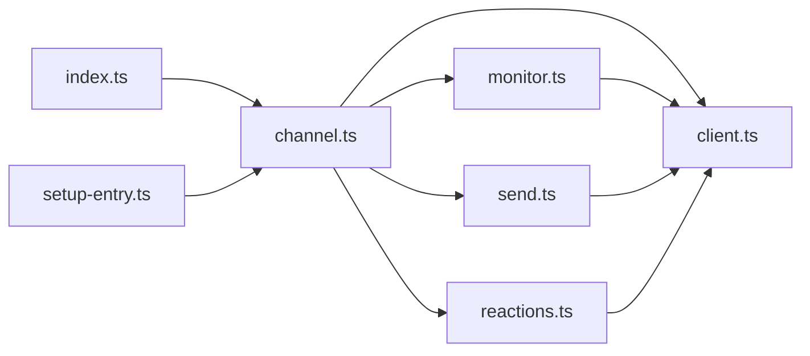

# Mattermost Integration

<cite>
**Referenced Files in This Document**
- [index.ts](file://extensions/mattermost/index.ts)
- [setup-entry.ts](file://extensions/mattermost/setup-entry.ts)
- [package.json](file://extensions/mattermost/package.json)
- [mattermost.md](file://docs/channels/mattermost.md)
- [channel.ts](file://extensions/mattermost/src/channel.ts)
- [client.ts](file://extensions/mattermost/src/mattermost/client.ts)
- [monitor.ts](file://extensions/mattermost/src/mattermost/monitor.ts)
- [send.ts](file://extensions/mattermost/src/mattermost/send.ts)
- [reactions.ts](file://extensions/mattermost/src/mattermost/reactions.ts)
</cite>

## Table of Contents
1. [Introduction](#introduction)
2. [Project Structure](#project-structure)
3. [Core Components](#core-components)
4. [Architecture Overview](#architecture-overview)
5. [Detailed Component Analysis](#detailed-component-analysis)
6. [Dependency Analysis](#dependency-analysis)
7. [Performance Considerations](#performance-considerations)
8. [Troubleshooting Guide](#troubleshooting-guide)
9. [Conclusion](#conclusion)

## Introduction
This document explains the Mattermost integration for team collaboration within the OpenClaw ecosystem. It covers the plugin’s architecture, authentication, channel monitoring, real-time message processing, slash command integration, reaction handling, interactive buttons, outbound message delivery, and multi-account support. It also provides setup instructions, configuration guidance, troubleshooting tips, and performance optimization recommendations tailored to Mattermost environments.

## Project Structure
The Mattermost integration is implemented as a plugin with a clear separation of concerns:
- Plugin bootstrap and registration
- Channel plugin definition and capabilities
- Mattermost client and API abstractions
- Real-time monitoring via WebSocket and HTTP routes
- Outbound message sending and media handling
- Reaction management and interactive button interactions

**Diagram sources**
- [index.ts:1-27](file://extensions/mattermost/index.ts#L1-L27)
- [setup-entry.ts:1-6](file://extensions/mattermost/setup-entry.ts#L1-L6)
- [package.json:1-31](file://extensions/mattermost/package.json#L1-L31)
- [channel.ts:250-486](file://extensions/mattermost/src/channel.ts#L250-L486)
- [client.ts:73-114](file://extensions/mattermost/src/mattermost/client.ts#L73-L114)
- [monitor.ts:353-800](file://extensions/mattermost/src/mattermost/monitor.ts#L353-L800)
- [send.ts:287-379](file://extensions/mattermost/src/mattermost/send.ts#L287-L379)
- [reactions.ts:36-103](file://extensions/mattermost/src/mattermost/reactions.ts#L36-L103)

**Section sources**
- [index.ts:1-27](file://extensions/mattermost/index.ts#L1-L27)
- [setup-entry.ts:1-6](file://extensions/mattermost/setup-entry.ts#L1-L6)
- [package.json:1-31](file://extensions/mattermost/package.json#L1-L31)
- [channel.ts:250-486](file://extensions/mattermost/src/channel.ts#L250-L486)

## Core Components
- Plugin registration and HTTP route exposure for slash commands and interactions
- Channel plugin exposing capabilities, configuration, security policies, and outbound delivery
- Mattermost client abstraction for API calls, typing indicators, uploads, and posts
- Real-time monitor orchestrating WebSocket connections, slash command registration, and inbound/outbound routing
- Outbound sender supporting text, media, and interactive buttons with caching and fallbacks
- Reaction manager for adding/removing emoji reactions

Key responsibilities:
- Authentication: Bot token-based bearer authentication to Mattermost API
- Monitoring: WebSocket event stream with dedupe cache and reconnection logic
- Routing: Session scoping by thread roots and reply-to modes
- Delivery: Markdown-aware chunking, media upload, and fallback strategies
- Interactions: Slash commands and interactive buttons with HMAC verification

**Section sources**
- [channel.ts:44-193](file://extensions/mattermost/src/channel.ts#L44-L193)
- [client.ts:73-114](file://extensions/mattermost/src/mattermost/client.ts#L73-L114)
- [monitor.ts:353-800](file://extensions/mattermost/src/mattermost/monitor.ts#L353-L800)
- [send.ts:287-379](file://extensions/mattermost/src/mattermost/send.ts#L287-L379)
- [reactions.ts:36-103](file://extensions/mattermost/src/mattermost/reactions.ts#L36-L103)

## Architecture Overview
The Mattermost integration follows a layered architecture:
- Plugin layer: registers channel, exposes HTTP routes, and wires runtime
- Channel layer: defines capabilities, config, security, and outbound delivery
- Core layer: Mattermost client, monitor, send, and reactions modules
- Runtime layer: logging, activity recording, and text chunking

**Diagram sources**
- [index.ts:7-24](file://extensions/mattermost/index.ts#L7-L24)
- [setup-entry.ts:3-5](file://extensions/mattermost/setup-entry.ts#L3-L5)
- [channel.ts:250-486](file://extensions/mattermost/src/channel.ts#L250-L486)
- [client.ts:73-114](file://extensions/mattermost/src/mattermost/client.ts#L73-L114)
- [monitor.ts:353-800](file://extensions/mattermost/src/mattermost/monitor.ts#L353-L800)
- [send.ts:287-379](file://extensions/mattermost/src/mattermost/send.ts#L287-L379)
- [reactions.ts:36-103](file://extensions/mattermost/src/mattermost/reactions.ts#L36-L103)

## Detailed Component Analysis

### Plugin Registration and Setup
- Registers the Mattermost channel plugin and conditionally exposes HTTP routes for slash commands and interactions
- Provides a setup entry for local development and installation flows

**Diagram sources**
- [index.ts:12-24](file://extensions/mattermost/index.ts#L12-L24)
- [channel.ts:250-256](file://extensions/mattermost/src/channel.ts#L250-L256)

**Section sources**
- [index.ts:1-27](file://extensions/mattermost/index.ts#L1-L27)
- [setup-entry.ts:1-6](file://extensions/mattermost/setup-entry.ts#L1-L6)

### Channel Plugin Definition
- Defines capabilities: direct, channel, group, thread; reactions; media; native commands
- Exposes configuration schema, account management, security policies, and directory adapter
- Implements outbound delivery with text chunking and media handling

**Diagram sources**
- [channel.ts:250-486](file://extensions/mattermost/src/channel.ts#L250-L486)
- [client.ts:73-114](file://extensions/mattermost/src/mattermost/client.ts#L73-L114)

**Section sources**
- [channel.ts:250-486](file://extensions/mattermost/src/channel.ts#L250-L486)

### Mattermost Client Implementation
- Encapsulates base URL normalization, API URL construction, and request handling
- Provides typed models for users, channels, posts, and file info
- Handles error extraction from JSON or text responses

**Diagram sources**
- [client.ts:1-114](file://extensions/mattermost/src/mattermost/client.ts#L1-L114)

**Section sources**
- [client.ts:1-279](file://extensions/mattermost/src/mattermost/client.ts#L1-L279)

### Real-Time Monitoring and Slash Commands
- Establishes WebSocket connection and deduplicates inbound messages
- Registers slash commands per team and validates callback reachability
- Exposes HTTP route for button interactions with HMAC verification and IP allowlisting

**Diagram sources**
- [monitor.ts:353-800](file://extensions/mattermost/src/mattermost/monitor.ts#L353-L800)
- [client.ts:116-132](file://extensions/mattermost/src/mattermost/client.ts#L116-L132)

**Section sources**
- [monitor.ts:353-800](file://extensions/mattermost/src/mattermost/monitor.ts#L353-L800)

### Outbound Message Delivery
- Parses targets supporting channel IDs, channel names, user IDs, and usernames
- Resolves DM channels and caches results to minimize API calls
- Uploads media when present and falls back to URL text if upload fails
- Applies Markdown table conversion and text chunking limits

**Diagram sources**
- [send.ts:287-379](file://extensions/mattermost/src/mattermost/send.ts#L287-L379)

**Section sources**
- [send.ts:287-379](file://extensions/mattermost/src/mattermost/send.ts#L287-L379)

### Reaction Handling
- Adds or removes reactions by invoking Mattermost API endpoints
- Caches bot user ID to avoid repeated lookups
- Returns structured results for success/failure

**Diagram sources**
- [channel.ts:80-193](file://extensions/mattermost/src/channel.ts#L80-L193)
- [reactions.ts:36-103](file://extensions/mattermost/src/mattermost/reactions.ts#L36-L103)
- [client.ts:116-118](file://extensions/mattermost/src/mattermost/client.ts#L116-L118)

**Section sources**
- [channel.ts:80-193](file://extensions/mattermost/src/channel.ts#L80-L193)
- [reactions.ts:36-103](file://extensions/mattermost/src/mattermost/reactions.ts#L36-L103)

## Dependency Analysis
- Plugin depends on the channel plugin interface and runtime
- Channel plugin depends on client, monitor, send, and reactions modules
- Monitor depends on client, interactions, model picker, and auth helpers
- Send depends on client, interactions, and target resolution
- Reactions depends on client and account resolution

**Diagram sources**
- [index.ts:1-27](file://extensions/mattermost/index.ts#L1-L27)
- [setup-entry.ts:1-6](file://extensions/mattermost/setup-entry.ts#L1-L6)
- [channel.ts:250-486](file://extensions/mattermost/src/channel.ts#L250-L486)
- [client.ts:73-114](file://extensions/mattermost/src/mattermost/client.ts#L73-L114)
- [monitor.ts:353-800](file://extensions/mattermost/src/mattermost/monitor.ts#L353-L800)
- [send.ts:287-379](file://extensions/mattermost/src/mattermost/send.ts#L287-L379)
- [reactions.ts:36-103](file://extensions/mattermost/src/mattermost/reactions.ts#L36-L103)

**Section sources**
- [index.ts:1-27](file://extensions/mattermost/index.ts#L1-L27)
- [channel.ts:250-486](file://extensions/mattermost/src/channel.ts#L250-L486)

## Performance Considerations
- Caching: Channel, user, and DM channel lookups are cached to reduce API calls
- Deduplication: Recent inbound messages are deduplicated to prevent duplicate processing
- Chunking: Text is chunked according to Mattermost limits; Markdown tables are converted for compatibility
- Media handling: Prefer direct uploads; fall back to URL text if upload fails
- WebSocket reconnection: Robust reconnection logic ensures resilience against transient failures
- Typing indicators: Optional typing indicators improve perceived responsiveness

[No sources needed since this section provides general guidance]

## Troubleshooting Guide
Common issues and resolutions:
- No replies in channels: Verify the bot is in the channel and mentioned, or adjust chat mode and prefixes
- Auth errors: Confirm bot token and base URL are correct and account is enabled
- Slash commands not working: Ensure callback URL is reachable from Mattermost; check allowed untrusted internal connections
- Button clicks failing: Validate action IDs are alphanumeric, HMAC token matches gateway verification, and callback URL is reachable
- Reaction failures: Confirm reactions are enabled in config and emoji names are valid

For detailed steps and configuration references, consult the Mattermost channel documentation.

**Section sources**
- [mattermost.md:387-399](file://docs/channels/mattermost.md#L387-L399)

## Conclusion
The Mattermost integration provides a robust, extensible plugin that supports team collaboration via bots, slash commands, interactive buttons, reactions, and real-time messaging. Its modular design separates concerns across plugin registration, channel capabilities, client abstractions, monitoring, and delivery. With proper configuration and attention to reachability and security settings, it delivers reliable, scalable communication within Mattermost environments.