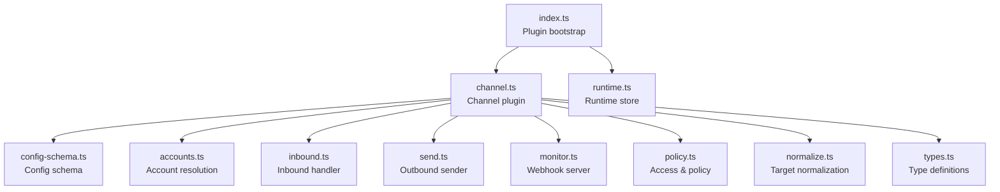
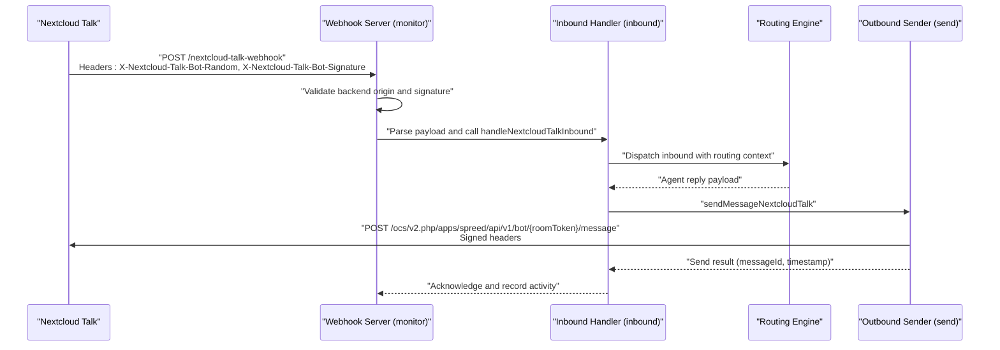
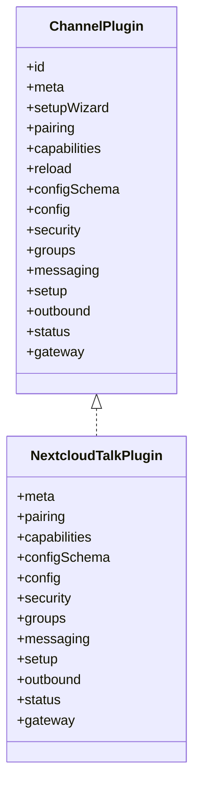
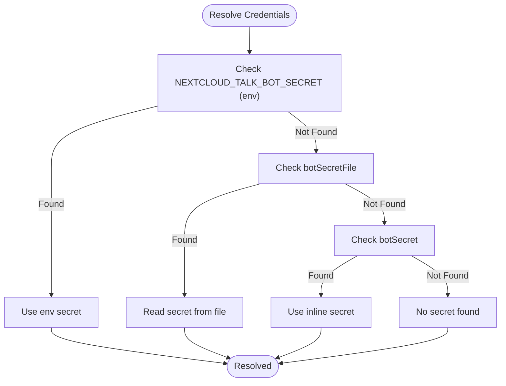
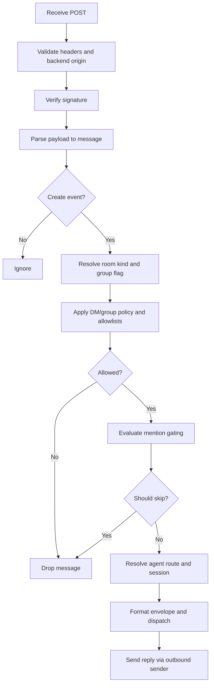
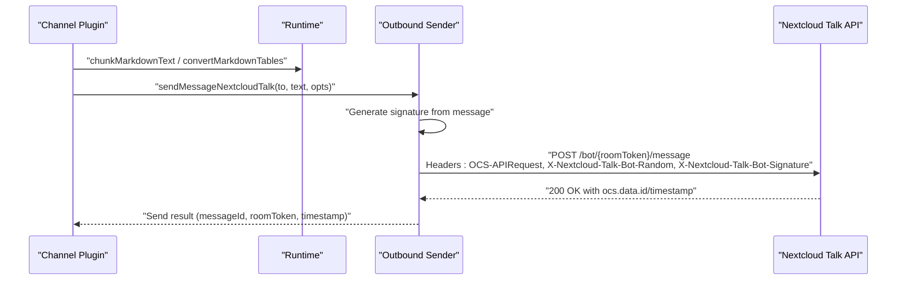
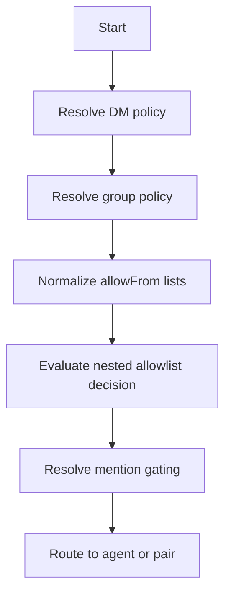
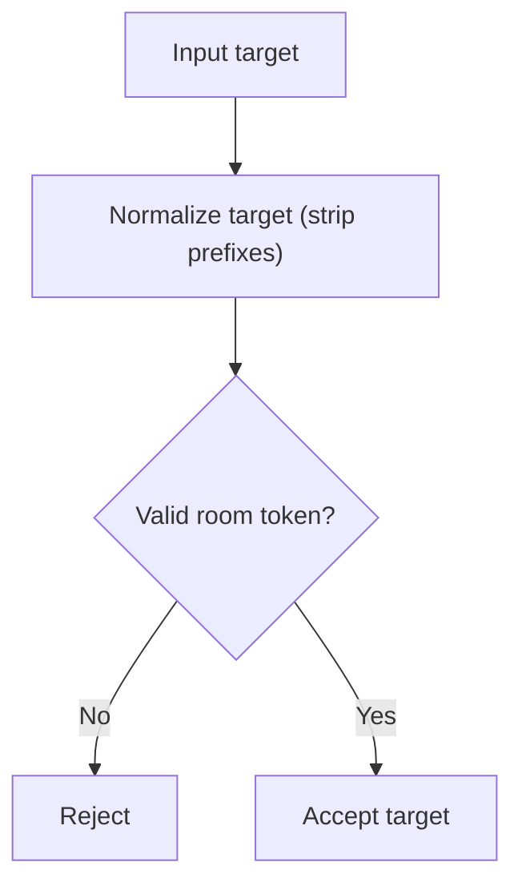
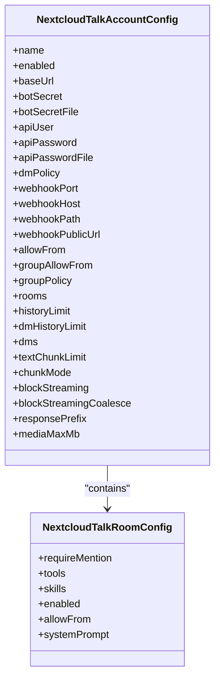
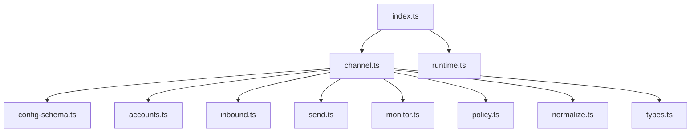

# Nextcloud Talk Integration

<cite>
**Referenced Files in This Document**
- [index.ts](file://extensions/nextcloud-talk/index.ts)
- [setup-entry.ts](file://extensions/nextcloud-talk/setup-entry.ts)
- [channel.ts](file://extensions/nextcloud-talk/src/channel.ts)
- [runtime.ts](file://extensions/nextcloud-talk/src/runtime.ts)
- [config-schema.ts](file://extensions/nextcloud-talk/src/config-schema.ts)
- [accounts.ts](file://extensions/nextcloud-talk/src/accounts.ts)
- [inbound.ts](file://extensions/nextcloud-talk/src/inbound.ts)
- [send.ts](file://extensions/nextcloud-talk/src/send.ts)
- [monitor.ts](file://extensions/nextcloud-talk/src/monitor.ts)
- [policy.ts](file://extensions/nextcloud-talk/src/policy.ts)
- [normalize.ts](file://extensions/nextcloud-talk/src/normalize.ts)
- [types.ts](file://extensions/nextcloud-talk/src/types.ts)
</cite>

## Table of Contents
1. [Introduction](#introduction)
2. [Project Structure](#project-structure)
3. [Core Components](#core-components)
4. [Architecture Overview](#architecture-overview)
5. [Detailed Component Analysis](#detailed-component-analysis)
6. [Dependency Analysis](#dependency-analysis)
7. [Performance Considerations](#performance-considerations)
8. [Troubleshooting Guide](#troubleshooting-guide)
9. [Conclusion](#conclusion)
10. [Appendices](#appendices)

## Introduction
This document explains the Nextcloud Talk integration for self-hosted communication. It covers the Nextcloud Talk API client implementation, authentication using personal access tokens (via a shared bot secret), and conversation management. It also documents chat room handling, file sharing and media integration within the Nextcloud ecosystem, user authentication and permissions, group management, and permission systems. Setup procedures for Nextcloud instances, Talk app configuration, and API endpoint setup are included, along with meeting integration, screen sharing, and notification handling. Self-hosting benefits, data privacy, and on-premises deployment advantages are highlighted, followed by troubleshooting guides and deployment best practices for self-hosted environments.

## Project Structure
The Nextcloud Talk integration is implemented as an OpenClaw plugin with a clear separation of concerns:
- Plugin bootstrap and registration
- Channel plugin definition and capabilities
- Runtime initialization and storage
- Configuration schema and validation
- Account resolution and credential sourcing
- Inbound webhook handling and routing
- Outbound message sending and reactions
- Policy evaluation for mentions, allowlists, and group access
- Target normalization and identifier handling
- Type definitions for payloads and options

**Diagram sources**
- [index.ts:1-18](file://extensions/nextcloud-talk/index.ts#L1-L18)
- [channel.ts:1-340](file://extensions/nextcloud-talk/src/channel.ts#L1-L340)
- [runtime.ts:1-7](file://extensions/nextcloud-talk/src/runtime.ts#L1-L7)
- [config-schema.ts:1-74](file://extensions/nextcloud-talk/src/config-schema.ts#L1-L74)
- [accounts.ts:1-157](file://extensions/nextcloud-talk/src/accounts.ts#L1-L157)
- [inbound.ts:1-318](file://extensions/nextcloud-talk/src/inbound.ts#L1-L318)
- [send.ts:1-205](file://extensions/nextcloud-talk/src/send.ts#L1-L205)
- [monitor.ts:1-418](file://extensions/nextcloud-talk/src/monitor.ts#L1-L418)
- [policy.ts:1-181](file://extensions/nextcloud-talk/src/policy.ts#L1-L181)
- [normalize.ts:1-45](file://extensions/nextcloud-talk/src/normalize.ts#L1-L45)
- [types.ts:1-191](file://extensions/nextcloud-talk/src/types.ts#L1-L191)

**Section sources**
- [index.ts:1-18](file://extensions/nextcloud-talk/index.ts#L1-L18)
- [channel.ts:1-340](file://extensions/nextcloud-talk/src/channel.ts#L1-L340)

## Core Components
- Plugin bootstrap and registration: Initializes runtime and registers the Nextcloud Talk channel.
- Channel plugin: Defines metadata, capabilities, configuration schema, security policies, messaging targets, setup adapter, outbound delivery, and gateway lifecycle.
- Runtime store: Provides a centralized runtime for the plugin.
- Configuration schema: Validates and normalizes account and room configurations, including allowlists, policies, and webhook settings.
- Account resolution: Merges global and per-account settings, resolves credentials from environment, files, or config, and determines enabled/disabled state.
- Inbound handler: Parses webhook payloads, validates signatures, applies allowlists and group policies, handles mention gating, routes to agents, and dispatches replies.
- Outbound sender: Sends messages and reactions to Nextcloud Talk with signature verification and proper headers.
- Monitor: Runs a webhook server, validates requests, guards against replays, and invokes the inbound handler.
- Policy: Implements allowlist matching, nested allowlist decisions, group tool policies, mention gating, and require-mention logic.
- Normalization: Strips prefixes and normalizes Nextcloud Talk identifiers and targets.
- Types: Defines payloads, headers, configuration shapes, and options for the integration.

**Section sources**
- [index.ts:6-15](file://extensions/nextcloud-talk/index.ts#L6-L15)
- [channel.ts:40-340](file://extensions/nextcloud-talk/src/channel.ts#L40-L340)
- [runtime.ts:4-7](file://extensions/nextcloud-talk/src/runtime.ts#L4-L7)
- [config-schema.ts:15-74](file://extensions/nextcloud-talk/src/config-schema.ts#L15-L74)
- [accounts.ts:22-157](file://extensions/nextcloud-talk/src/accounts.ts#L22-L157)
- [inbound.ts:53-318](file://extensions/nextcloud-talk/src/inbound.ts#L53-L318)
- [send.ts:63-205](file://extensions/nextcloud-talk/src/send.ts#L63-L205)
- [monitor.ts:316-418](file://extensions/nextcloud-talk/src/monitor.ts#L316-L418)
- [policy.ts:17-181](file://extensions/nextcloud-talk/src/policy.ts#L17-L181)
- [normalize.ts:1-45](file://extensions/nextcloud-talk/src/normalize.ts#L1-L45)
- [types.ts:11-191](file://extensions/nextcloud-talk/src/types.ts#L11-L191)

## Architecture Overview
The integration runs as a webhook-based channel. The gateway starts a local webhook server, validates Nextcloud Talk signatures, and forwards messages to the core routing engine. Outbound replies are sent back to Nextcloud Talk via signed API calls.

**Diagram sources**
- [monitor.ts:352-418](file://extensions/nextcloud-talk/src/monitor.ts#L352-L418)
- [inbound.ts:53-318](file://extensions/nextcloud-talk/src/inbound.ts#L53-L318)
- [send.ts:63-167](file://extensions/nextcloud-talk/src/send.ts#L63-L167)

## Detailed Component Analysis

### Channel Plugin Definition
The channel plugin defines metadata, capabilities, configuration schema, security policies, messaging targets, setup adapter, outbound delivery, and gateway lifecycle. It integrates with the core runtime for chunking, markdown conversion, and activity recording.

**Diagram sources**
- [channel.ts:52-340](file://extensions/nextcloud-talk/src/channel.ts#L52-L340)

**Section sources**
- [channel.ts:40-340](file://extensions/nextcloud-talk/src/channel.ts#L40-L340)

### Authentication and Credentials
Authentication relies on a shared bot secret configured per account. The resolver supports environment variables, secret files, and inline configuration, with precedence and safety checks.

**Diagram sources**
- [accounts.ts:79-110](file://extensions/nextcloud-talk/src/accounts.ts#L79-L110)

**Section sources**
- [accounts.ts:79-110](file://extensions/nextcloud-talk/src/accounts.ts#L79-L110)
- [config-schema.ts:32-36](file://extensions/nextcloud-talk/src/config-schema.ts#L32-L36)

### Inbound Message Flow
The inbound handler validates webhook headers, decodes the payload, enforces allowlists and group policies, applies mention gating, and dispatches the message to the routing engine.

**Diagram sources**
- [monitor.ts:199-275](file://extensions/nextcloud-talk/src/monitor.ts#L199-L275)
- [inbound.ts:53-318](file://extensions/nextcloud-talk/src/inbound.ts#L53-L318)

**Section sources**
- [monitor.ts:199-275](file://extensions/nextcloud-talk/src/monitor.ts#L199-L275)
- [inbound.ts:53-318](file://extensions/nextcloud-talk/src/inbound.ts#L53-L318)

### Outbound Delivery and Reactions
Outbound messages are sent with a signature derived from the message content, and reactions are supported similarly. The sender records activity and returns message metadata.

**Diagram sources**
- [send.ts:63-167](file://extensions/nextcloud-talk/src/send.ts#L63-L167)

**Section sources**
- [send.ts:63-167](file://extensions/nextcloud-talk/src/send.ts#L63-L167)

### Security Policies and Permissions
The integration enforces:
- Direct message policies (e.g., pairing-based)
- Group message policies (allowlist/open/disabled)
- Nested allowlists for rooms and senders
- Mention gating for group messages
- Pairing challenges for DMs

**Diagram sources**
- [policy.ts:17-181](file://extensions/nextcloud-talk/src/policy.ts#L17-L181)
- [inbound.ts:134-227](file://extensions/nextcloud-talk/src/inbound.ts#L134-L227)

**Section sources**
- [policy.ts:88-181](file://extensions/nextcloud-talk/src/policy.ts#L88-L181)
- [inbound.ts:134-227](file://extensions/nextcloud-talk/src/inbound.ts#L134-L227)

### Conversation Management and Targets
Targets are normalized to a canonical form, allowing flexible input formats. Room tokens are validated and used for message routing.

**Diagram sources**
- [normalize.ts:28-45](file://extensions/nextcloud-talk/src/normalize.ts#L28-L45)

**Section sources**
- [normalize.ts:1-45](file://extensions/nextcloud-talk/src/normalize.ts#L1-L45)

### Configuration Schema and Validation
The configuration schema defines account-level and room-level settings, including allowlists, policies, markdown options, webhook settings, and per-room overrides.

**Diagram sources**
- [config-schema.ts:15-74](file://extensions/nextcloud-talk/src/config-schema.ts#L15-L74)
- [types.ts:11-78](file://extensions/nextcloud-talk/src/types.ts#L11-L78)

**Section sources**
- [config-schema.ts:15-74](file://extensions/nextcloud-talk/src/config-schema.ts#L15-L74)
- [types.ts:11-78](file://extensions/nextcloud-talk/src/types.ts#L11-L78)

## Dependency Analysis
The plugin depends on the OpenClaw plugin SDK for channel primitives, security policies, and runtime utilities. It composes several internal modules to implement the full integration.

**Diagram sources**
- [index.ts:1-18](file://extensions/nextcloud-talk/index.ts#L1-L18)
- [channel.ts:1-39](file://extensions/nextcloud-talk/src/channel.ts#L1-L39)

**Section sources**
- [index.ts:1-18](file://extensions/nextcloud-talk/index.ts#L1-L18)
- [channel.ts:1-39](file://extensions/nextcloud-talk/src/channel.ts#L1-L39)

## Performance Considerations
- Webhook body limits and timeouts are enforced to prevent resource exhaustion during unauthenticated reads.
- Signature verification occurs after bounded reads to reduce attack surface.
- Replay guard prevents duplicate processing of messages.
- Markdown conversion and chunking are delegated to the runtime to optimize rendering and payload sizes.
- Outbound replies support optional coalescing to reduce chattiness.

[No sources needed since this section provides general guidance]

## Troubleshooting Guide
Common issues and resolutions:
- Authentication failures: Verify the bot secret is present and matches the Talk app installation output. Check environment variable precedence and secret file permissions.
- Forbidden errors: Confirm the bot has permissions in the target room and that the room exists.
- Bad request errors: Ensure the message format is valid and not empty.
- Room not found: Validate the room token and that the webhook URL matches the configured path.
- Signature verification failures: Confirm the webhook server is reachable and the backend origin matches the configured base URL.
- Rate limiting or timeouts: Adjust webhook body limits and timeouts as needed.

**Section sources**
- [send.ts:115-133](file://extensions/nextcloud-talk/src/send.ts#L115-L133)
- [monitor.ts:100-132](file://extensions/nextcloud-talk/src/monitor.ts#L100-L132)
- [monitor.ts:262-274](file://extensions/nextcloud-talk/src/monitor.ts#L262-L274)

## Conclusion
The Nextcloud Talk integration provides a secure, self-hosted communication channel with robust authentication, flexible policies, and efficient message handling. By leveraging webhook-based inbound processing and signed API calls for outbound delivery, it ensures integrity and scalability. Administrators gain fine-grained control over permissions, room-specific behavior, and session history, enabling secure collaboration within on-premises environments.

[No sources needed since this section summarizes without analyzing specific files]

## Appendices

### Setup Procedures
- Configure the Nextcloud Talk app and install a bot on your Nextcloud instance to obtain the bot secret.
- Set the base URL of your Nextcloud instance and the bot secret in the OpenClaw configuration (environment variable or secret file).
- Define webhook server options (port, host, path, public URL) and ensure the server is reachable from Nextcloud.
- Optionally configure allowlists, group policies, and per-room settings for granular control.

**Section sources**
- [config-schema.ts:31-51](file://extensions/nextcloud-talk/src/config-schema.ts#L31-L51)
- [monitor.ts:334-414](file://extensions/nextcloud-talk/src/monitor.ts#L334-L414)

### API Endpoint Details
- Inbound webhook endpoint: POST {webhookPath} with signature headers.
- Outbound message endpoint: POST /ocs/v2.php/apps/spreed/api/v1/bot/{roomToken}/message with signature headers.
- Outbound reaction endpoint: POST /ocs/v2.php/apps/spreed/api/v1/bot/{roomToken}/reaction/{messageId} with signature headers.

**Section sources**
- [monitor.ts:199-204](file://extensions/nextcloud-talk/src/monitor.ts#L199-L204)
- [send.ts:102-113](file://extensions/nextcloud-talk/src/send.ts#L102-L113)
- [send.ts:185-196](file://extensions/nextcloud-talk/src/send.ts#L185-L196)

### Meeting Integration and Screen Sharing
- Meetings and screen sharing are managed by the Nextcloud Talk app; the integration focuses on messaging and notifications. Ensure the Talk app is enabled and properly configured for meetings.

[No sources needed since this section provides general guidance]

### Notification Handling
- Notifications are delivered via webhook messages and replies. The integration records inbound/outbound activity and maintains session metadata for continuity.

**Section sources**
- [monitor.ts:377-394](file://extensions/nextcloud-talk/src/monitor.ts#L377-L394)
- [inbound.ts:287-316](file://extensions/nextcloud-talk/src/inbound.ts#L287-L316)

### Self-Hosting Benefits and Deployment Best Practices
- Data privacy: Keep sensitive credentials in secret files and avoid exposing secrets in logs.
- On-premises control: Manage your own infrastructure, backups, and compliance.
- Scalability: Use reverse proxies and load balancing for high availability.
- Security: Restrict webhook paths, enforce backend origin checks, and monitor logs for anomalies.

[No sources needed since this section provides general guidance]