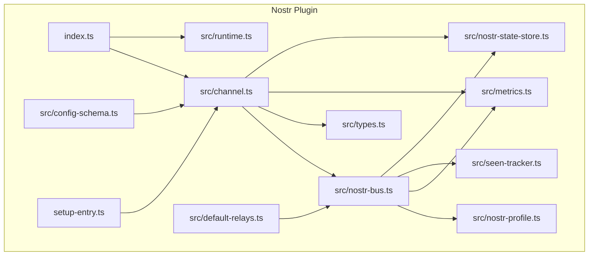
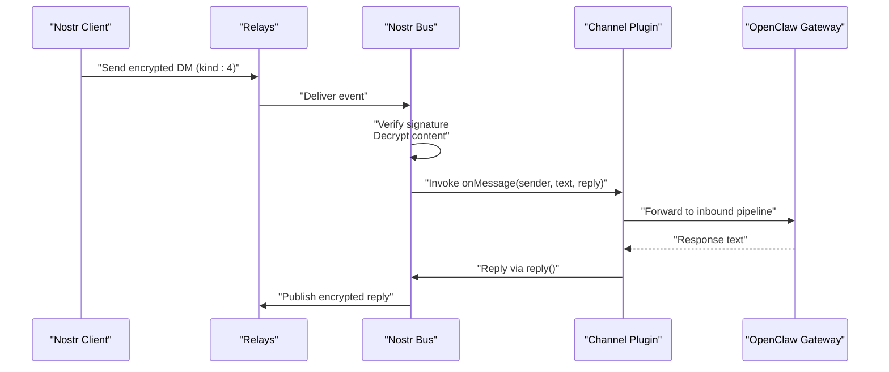
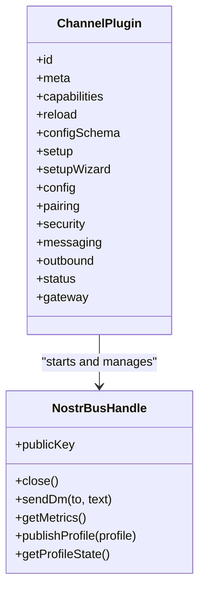
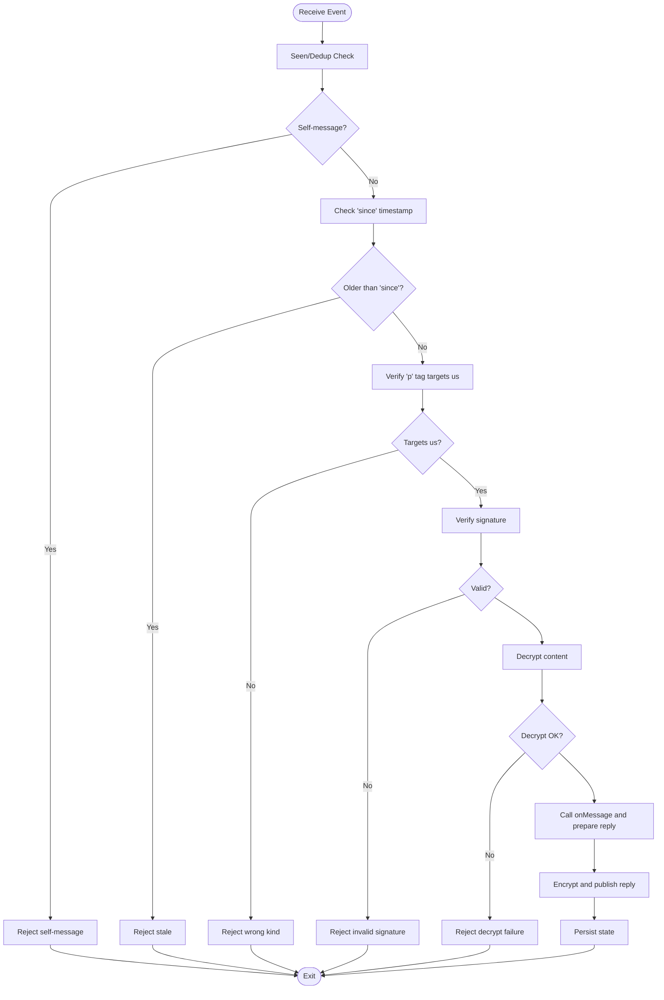
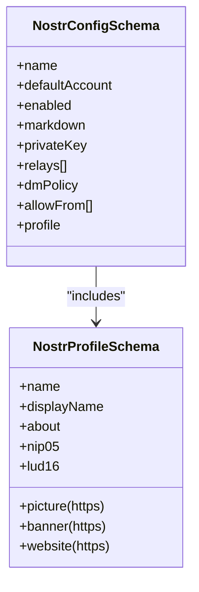
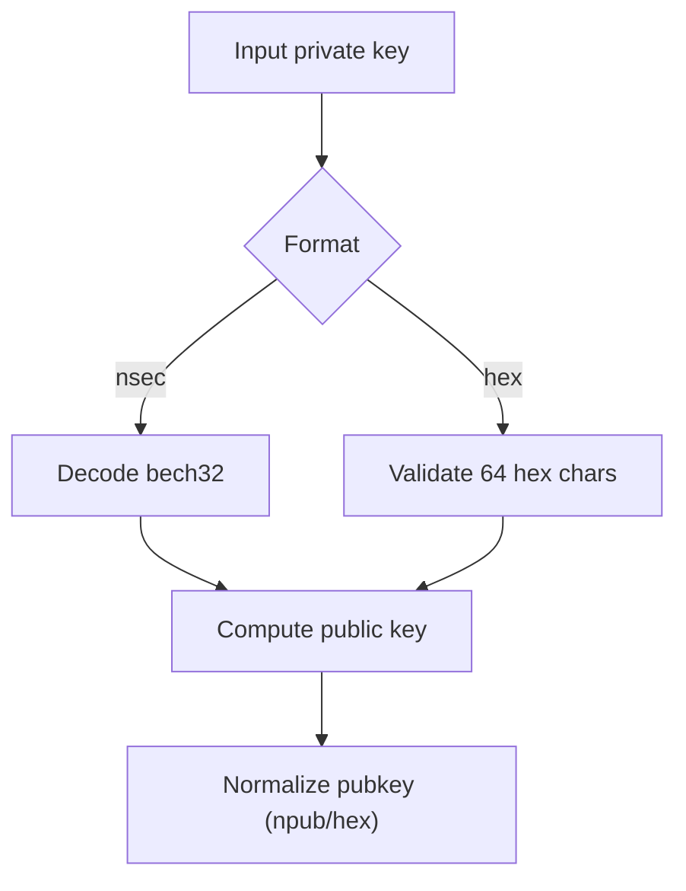
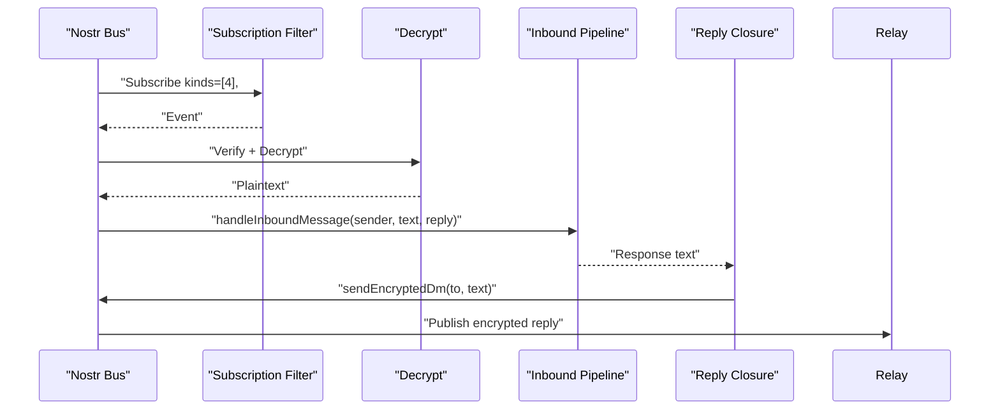
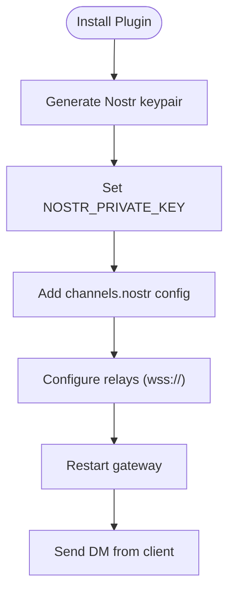
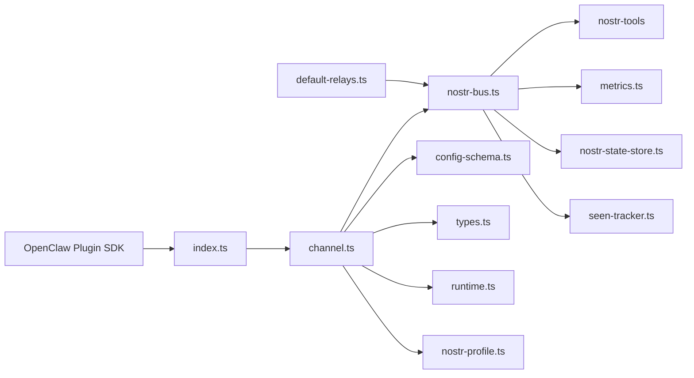

# Nostr Decentralized Social

<cite>
**Referenced Files in This Document**
- [README.md](file://extensions/nostr/README.md)
- [index.ts](file://extensions/nostr/index.ts)
- [setup-entry.ts](file://extensions/nostr/setup-entry.ts)
- [channel.ts](file://extensions/nostr/src/channel.ts)
- [nostr-bus.ts](file://extensions/nostr/src/nostr-bus.ts)
- [config-schema.ts](file://extensions/nostr/src/config-schema.ts)
- [default-relays.ts](file://extensions/nostr/src/default-relays.ts)
- [runtime.ts](file://extensions/nostr/src/runtime.ts)
- [nostr-profile.ts](file://extensions/nostr/src/nostr-profile.ts)
- [types.ts](file://extensions/nostr/src/types.ts)
- [metrics.ts](file://extensions/nostr/src/metrics.ts)
- [seen-tracker.ts](file://extensions/nostr/src/seen-tracker.ts)
- [nostr-state-store.ts](file://extensions/nostr/src/nostr-state-store.ts)
</cite>

## Table of Contents
1. [Introduction](#introduction)
2. [Project Structure](#project-structure)
3. [Core Components](#core-components)
4. [Architecture Overview](#architecture-overview)
5. [Detailed Component Analysis](#detailed-component-analysis)
6. [Dependency Analysis](#dependency-analysis)
7. [Performance Considerations](#performance-considerations)
8. [Troubleshooting Guide](#troubleshooting-guide)
9. [Conclusion](#conclusion)
10. [Appendices](#appendices)

## Introduction
This document explains the Nostr decentralized social integration in the project. It covers the Nostr client implementation aligned with NIP standards, key pair management, relay connections, event broadcasting, note creation, and DM handling. It also documents authentication via NIP-05 identifiers, signature verification, encrypted direct messages, setup procedures for relay selection, key generation, and event filtering. Message threading, reactions, and content moderation are discussed conceptually, along with the decentralized nature of Nostr, relay selection strategies, and privacy considerations.

## Project Structure
The Nostr plugin is implemented as a channel plugin within the extensions/nostr directory. It integrates with the OpenClaw plugin SDK and exposes:
- A channel plugin definition for DM-only operation
- A Nostr bus for connecting to relays, subscribing to DMs, and publishing events
- Configuration schema for channel settings, profiles, and policies
- Runtime utilities and state persistence
- Metrics, seen tracking, and profile publishing helpers

**Diagram sources**
- [index.ts:1-77](file://extensions/nostr/index.ts#L1-L77)
- [setup-entry.ts:1-6](file://extensions/nostr/setup-entry.ts#L1-L6)
- [channel.ts:1-347](file://extensions/nostr/src/channel.ts#L1-L347)
- [nostr-bus.ts:1-719](file://extensions/nostr/src/nostr-bus.ts#L1-L719)
- [config-schema.ts:1-93](file://extensions/nostr/src/config-schema.ts#L1-L93)
- [default-relays.ts:1-2](file://extensions/nostr/src/default-relays.ts#L1-L2)
- [runtime.ts:1-7](file://extensions/nostr/src/runtime.ts#L1-L7)
- [nostr-profile.ts:1-278](file://extensions/nostr/src/nostr-profile.ts#L1-L278)
- [types.ts:1-117](file://extensions/nostr/src/types.ts#L1-L117)
- [metrics.ts:1-459](file://extensions/nostr/src/metrics.ts#L1-L459)
- [seen-tracker.ts:1-290](file://extensions/nostr/src/seen-tracker.ts#L1-L290)
- [nostr-state-store.ts:1-227](file://extensions/nostr/src/nostr-state-store.ts#L1-L227)

**Section sources**
- [README.md:1-137](file://extensions/nostr/README.md#L1-L137)
- [index.ts:1-77](file://extensions/nostr/index.ts#L1-L77)
- [setup-entry.ts:1-6](file://extensions/nostr/setup-entry.ts#L1-L6)
- [channel.ts:1-347](file://extensions/nostr/src/channel.ts#L1-L347)

## Core Components
- Channel plugin: Defines capabilities (DMs only), configuration schema, setup surfaces, security policy resolution, messaging target normalization, outbound delivery, and lifecycle hooks for starting/stopping.
- Nostr bus: Manages relay connections, subscription filters, event deduplication, signature verification, decryption, reply handling, and publishing with health-aware relay selection.
- Configuration schema: Enforces HTTPS-only profile URLs, defines NIP-01 profile fields, and validates channel configuration including DM policy and allowlist.
- Profile publishing: Converts profile data to NIP-01 kind:0 events, ensures monotonic timestamps, and publishes to relays with per-relay results.
- Runtime and state: Stores runtime context, persists bus and profile state, and computes subscription “since” timestamps.
- Observability: Comprehensive metrics for events, relays, decryption, memory, and rate limiting; seen tracker with LRU and TTL eviction.

**Section sources**
- [channel.ts:34-289](file://extensions/nostr/src/channel.ts#L34-L289)
- [nostr-bus.ts:320-588](file://extensions/nostr/src/nostr-bus.ts#L320-L588)
- [config-schema.ts:58-93](file://extensions/nostr/src/config-schema.ts#L58-L93)
- [nostr-profile.ts:127-224](file://extensions/nostr/src/nostr-profile.ts#L127-L224)
- [runtime.ts:1-7](file://extensions/nostr/src/runtime.ts#L1-L7)
- [nostr-state-store.ts:95-158](file://extensions/nostr/src/nostr-state-store.ts#L95-L158)
- [metrics.ts:157-424](file://extensions/nostr/src/metrics.ts#L157-L424)
- [seen-tracker.ts:44-289](file://extensions/nostr/src/seen-tracker.ts#L44-L289)

## Architecture Overview
The Nostr plugin integrates with OpenClaw’s channel framework. The channel plugin registers a Nostr bus per account, which subscribes to encrypted DMs (kind:4) and forwards decrypted messages to the gateway’s message pipeline. Outbound replies are encrypted and published to relays using health-aware selection and circuit breaker protection.

**Diagram sources**
- [channel.ts:209-232](file://extensions/nostr/src/channel.ts#L209-L232)
- [nostr-bus.ts:401-488](file://extensions/nostr/src/nostr-bus.ts#L401-L488)
- [nostr-bus.ts:514-526](file://extensions/nostr/src/nostr-bus.ts#L514-L526)

## Detailed Component Analysis

### Channel Plugin
- Capabilities: Supports direct (DM) chats; media disabled for MVP.
- Configuration: Uses a composite schema combining channel defaults and Nostr-specific fields.
- Security: Resolves DM policy and allow-from lists; normalizes entries and supports pairing approvals.
- Messaging: Normalizes targets (npub, hex pubkey, or nostr: URI); resolves account IDs and default account.
- Outbound: Sends text messages as DMs with markdown table conversion and chunk limits.
- Lifecycle: Starts/stops Nostr bus per account, tracks runtime state, and exposes metrics.

**Diagram sources**
- [channel.ts:34-289](file://extensions/nostr/src/channel.ts#L34-L289)
- [nostr-bus.ts:77-94](file://extensions/nostr/src/nostr-bus.ts#L77-L94)

**Section sources**
- [channel.ts:34-187](file://extensions/nostr/src/channel.ts#L34-L187)
- [channel.ts:189-289](file://extensions/nostr/src/channel.ts#L189-L289)

### Nostr Bus
- Subscription: Subscribes to kind:4 events targeted at the bot’s public key with a computed “since” timestamp.
- Deduplication: Uses a seen tracker (LRU + TTL) and an inflight set to avoid processing duplicates or concurrent events.
- Verification: Verifies event signatures before decrypting content.
- Reply: Creates a reply closure that encrypts and publishes to relays ordered by health score and circuit breaker state.
- Publishing: Encrypts and publishes DMs; publishes NIP-01 kind:0 profiles with monotonic timestamps and per-relay results.
- Relays: Health tracker and circuit breaker protect against failing relays; supports EOSE and connection/disconnection callbacks.

**Diagram sources**
- [nostr-bus.ts:401-488](file://extensions/nostr/src/nostr-bus.ts#L401-L488)
- [nostr-bus.ts:597-657](file://extensions/nostr/src/nostr-bus.ts#L597-L657)

**Section sources**
- [nostr-bus.ts:320-588](file://extensions/nostr/src/nostr-bus.ts#L320-L588)
- [nostr-bus.ts:597-657](file://extensions/nostr/src/nostr-bus.ts#L597-L657)

### Configuration and Profiles
- Channel config schema enforces HTTPS URLs for profile images and websites, validates NIP-01 fields, and supports DM policy and allowlist.
- Profile publishing converts the internal profile schema to NIP-01 kind:0 content, ensuring monotonic timestamps and robust per-relay reporting.

**Diagram sources**
- [config-schema.ts:58-93](file://extensions/nostr/src/config-schema.ts#L58-L93)
- [nostr-profile.ts:27-51](file://extensions/nostr/src/nostr-profile.ts#L27-L51)

**Section sources**
- [config-schema.ts:58-93](file://extensions/nostr/src/config-schema.ts#L58-L93)
- [nostr-profile.ts:127-224](file://extensions/nostr/src/nostr-profile.ts#L127-L224)

### Authentication and Identity
- Public key derivation: Accepts hex or nsec private key formats and derives the public key.
- Target normalization: Accepts npub, hex pubkey, or nostr: URI and normalizes to hex.
- Pairing and allowlist: Resolves DM policy and allow-from lists; supports pairing approvals and entry normalization.

**Diagram sources**
- [nostr-bus.ts:280-311](file://extensions/nostr/src/nostr-bus.ts#L280-L311)
- [types.ts:75-116](file://extensions/nostr/src/types.ts#L75-L116)

**Section sources**
- [nostr-bus.ts:280-311](file://extensions/nostr/src/nostr-bus.ts#L280-L311)
- [types.ts:75-116](file://extensions/nostr/src/types.ts#L75-L116)

### Event Broadcasting and DM Handling
- Subscription filter: kind:4, targeted to the bot’s pubkey, with a computed “since” timestamp.
- Delivery: Decrypted plaintext is forwarded to the gateway’s inbound pipeline; replies are encrypted and published.
- Replies: The reply closure encrypts and publishes to relays ordered by health and circuit breaker state.

**Diagram sources**
- [nostr-bus.ts:490-511](file://extensions/nostr/src/nostr-bus.ts#L490-L511)
- [nostr-bus.ts:514-526](file://extensions/nostr/src/nostr-bus.ts#L514-L526)
- [channel.ts:213-232](file://extensions/nostr/src/channel.ts#L213-L232)

**Section sources**
- [nostr-bus.ts:490-526](file://extensions/nostr/src/nostr-bus.ts#L490-L526)
- [channel.ts:213-232](file://extensions/nostr/src/channel.ts#L213-L232)

### Setup Procedures and Configuration
- Installation and quick setup steps are documented in the plugin README.
- Configuration keys include private key, relay URLs, DM policy, allowlist, enable flag, and optional display name.
- Access control modes: pairing (default), allowlist, open, disabled.

**Diagram sources**
- [README.md:13-50](file://extensions/nostr/README.md#L13-L50)

**Section sources**
- [README.md:13-83](file://extensions/nostr/README.md#L13-L83)
- [config-schema.ts:58-93](file://extensions/nostr/src/config-schema.ts#L58-L93)

### Message Threading, Reactions, and Moderation
- Threading: Not implemented in the current MVP; DMs are handled as direct messages without parent/child relationships.
- Reactions: Not implemented; the bus filters for kind:4 DMs and does not process kind:7 reactions.
- Content moderation: Signature verification and decryption failures are rejected; seen tracker prevents replay; allowlist policy restricts senders.

**Section sources**
- [channel.ts:46-47](file://extensions/nostr/src/channel.ts#L46-L47)
- [nostr-bus.ts:438-458](file://extensions/nostr/src/nostr-bus.ts#L438-L458)
- [channel.ts:104-119](file://extensions/nostr/src/channel.ts#L104-L119)

### Decentralization, Relay Selection, and Censorship Resistance
- Decentralized: Messages propagate across multiple independent relays; clients choose their preferred relays.
- Relay selection: Relays are ranked by a health score (success rate, recency, latency) and circuit breaker state.
- Censorship resistance: Multiple relays reduce single points of failure; health-aware publishing increases delivery reliability.

**Section sources**
- [nostr-bus.ts:205-271](file://extensions/nostr/src/nostr-bus.ts#L205-L271)
- [nostr-bus.ts:118-179](file://extensions/nostr/src/nostr-bus.ts#L118-L179)

## Dependency Analysis
The Nostr plugin depends on:
- OpenClaw plugin SDK for channel registration, runtime, and configuration.
- nostr-tools for cryptographic operations, event signing/finalizing, and relay pooling.
- Internal modules for metrics, seen tracking, state persistence, and profile publishing.

**Diagram sources**
- [index.ts:1-77](file://extensions/nostr/index.ts#L1-L77)
- [channel.ts:1-26](file://extensions/nostr/src/channel.ts#L1-L26)
- [nostr-bus.ts:1-27](file://extensions/nostr/src/nostr-bus.ts#L1-L27)
- [default-relays.ts:1-2](file://extensions/nostr/src/default-relays.ts#L1-L2)

**Section sources**
- [index.ts:1-77](file://extensions/nostr/index.ts#L1-L77)
- [channel.ts:1-26](file://extensions/nostr/src/channel.ts#L1-L26)
- [nostr-bus.ts:1-27](file://extensions/nostr/src/nostr-bus.ts#L1-L27)

## Performance Considerations
- Deduplication: Seen tracker with LRU eviction and TTL prevents memory growth and replay.
- Relay health: Health tracker and circuit breaker improve resilience and reduce wasted retries.
- Metrics: Real-time counters and snapshots enable monitoring of rejection reasons, relay errors, and decryption outcomes.
- State persistence: Debounced writes reduce I/O overhead during high-volume periods.

**Section sources**
- [seen-tracker.ts:44-289](file://extensions/nostr/src/seen-tracker.ts#L44-L289)
- [metrics.ts:157-424](file://extensions/nostr/src/metrics.ts#L157-L424)
- [nostr-bus.ts:378-396](file://extensions/nostr/src/nostr-bus.ts#L378-L396)

## Troubleshooting Guide
Common issues and resolutions:
- Bot not receiving messages:
  - Verify private key configuration and that the bot’s public key matches the recipient in the client.
  - Confirm relays are reachable and using secure WebSocket URLs.
  - Ensure the channel is enabled and the account is configured.
- Messages not being delivered:
  - Check relay URLs and availability; reduce message frequency to avoid rate limiting.
  - Review relay circuit breaker state and health scores.
- Security and privacy:
  - Use environment variables for private keys; avoid committing secrets to configuration files.
  - Prefer allowlist mode in production environments.

**Section sources**
- [README.md:119-137](file://extensions/nostr/README.md#L119-L137)
- [nostr-bus.ts:118-179](file://extensions/nostr/src/nostr-bus.ts#L118-L179)
- [config-schema.ts:8-21](file://extensions/nostr/src/config-schema.ts#L8-L21)

## Conclusion
The Nostr plugin provides a robust, decentralized DM channel built on NIP-04 encryption and NIP-01 profiles. It emphasizes security through signature verification, deduplication, and policy-driven access control, while offering resilience via relay health scoring and circuit breakers. The modular architecture supports extensibility for future features such as gift-wrapped DMs, reactions, and advanced moderation.

## Appendices

### Configuration Reference
- Keys: privateKey (required), relays (defaulted), dmPolicy ("pairing"|"allowlist"|"open"|"disabled"), allowFrom (pubkeys), enabled (boolean), name (display), profile (NIP-01 fields).
- Defaults: relays include popular public relays; dmPolicy defaults to pairing.

**Section sources**
- [README.md:51-61](file://extensions/nostr/README.md#L51-L61)
- [config-schema.ts:58-93](file://extensions/nostr/src/config-schema.ts#L58-L93)
- [default-relays.ts:1-2](file://extensions/nostr/src/default-relays.ts#L1-L2)