# Specialized Platforms

<cite>
**Referenced Files in This Document**
- [docs/channels/mattermost.md](file://docs/channels/mattermost.md)
- [docs/channels/feishu.md](file://docs/channels/feishu.md)
- [docs/channels/nostr.md](file://docs/channels/nostr.md)
- [docs/channels/twitch.md](file://docs/channels/twitch.md)
- [docs/channels/matrix.md](file://docs/channels/matrix.md)
- [docs/channels/nextcloud-talk.md](file://docs/channels/nextcloud-talk.md)
- [docs/channels/synology-chat.md](file://docs/channels/synology-chat.md)
- [docs/channels/zalo.md](file://docs/channels/zalo.md)
- [docs/channels/zalouser.md](file://docs/channels/zalouser.md)
- [extensions/mattermost/index.ts](file://extensions/mattermost/index.ts)
- [extensions/feishu/index.ts](file://extensions/feishu/index.ts)
- [extensions/nostr/index.ts](file://extensions/nostr/index.ts)
- [extensions/twitch/index.ts](file://extensions/twitch/index.ts)
- [extensions/matrix/index.ts](file://extensions/matrix/index.ts)
- [extensions/nextcloud-talk/index.ts](file://extensions/nextcloud-talk/index.ts)
- [extensions/synology-chat/index.ts](file://extensions/synology-chat/index.ts)
- [extensions/zalo/index.ts](file://extensions/zalo/index.ts)
- [extensions/zalouser/index.ts](file://extensions/zalouser/index.ts)
</cite>

## Table of Contents
1. [Introduction](#introduction)
2. [Project Structure](#project-structure)
3. [Core Components](#core-components)
4. [Architecture Overview](#architecture-overview)
5. [Detailed Component Analysis](#detailed-component-analysis)
6. [Dependency Analysis](#dependency-analysis)
7. [Performance Considerations](#performance-considerations)
8. [Troubleshooting Guide](#troubleshooting-guide)
9. [Conclusion](#conclusion)

## Introduction
This document covers specialized messaging and communication channels beyond the major platforms. It consolidates setup, authentication, platform-specific features, and configuration examples for:
- Mattermost team collaboration and webhooks
- Feishu/Lark enterprise communication
- Nostr decentralized social networking
- Twitch chat for streaming communities
- Matrix federation and encryption
- Nextcloud Talk for self-hosted environments
- Synology Chat for NAS environments
- Zalo and Zalo Personal for Vietnamese markets

Where applicable, it references the official documentation pages and plugin entry points that integrate each channel into the OpenClaw gateway.

## Project Structure
Each specialized platform is implemented as a plugin with a dedicated entry point and a documentation page. The plugin entry files register the channel and, where applicable, HTTP routes or tools.

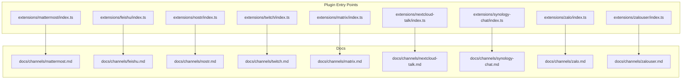

**Diagram sources**
- [extensions/mattermost/index.ts:1-27](file://extensions/mattermost/index.ts#L1-L27)
- [extensions/feishu/index.ts:1-71](file://extensions/feishu/index.ts#L1-L71)
- [extensions/nostr/index.ts:1-77](file://extensions/nostr/index.ts#L1-L77)
- [extensions/twitch/index.ts:1-21](file://extensions/twitch/index.ts#L1-L21)
- [extensions/matrix/index.ts:1-18](file://extensions/matrix/index.ts#L1-L18)
- [extensions/nextcloud-talk/index.ts:1-18](file://extensions/nextcloud-talk/index.ts#L1-L18)
- [extensions/synology-chat/index.ts:1-18](file://extensions/synology-chat/index.ts#L1-L18)
- [extensions/zalo/index.ts:1-18](file://extensions/zalo/index.ts#L1-L18)
- [extensions/zalouser/index.ts:1-33](file://extensions/zalouser/index.ts#L1-L33)
- [docs/channels/mattermost.md:1-399](file://docs/channels/mattermost.md#L1-L399)
- [docs/channels/feishu.md:1-724](file://docs/channels/feishu.md#L1-L724)
- [docs/channels/nostr.md:1-243](file://docs/channels/nostr.md#L1-L243)
- [docs/channels/twitch.md:1-380](file://docs/channels/twitch.md#L1-L380)
- [docs/channels/matrix.md:1-304](file://docs/channels/matrix.md#L1-L304)
- [docs/channels/nextcloud-talk.md:1-139](file://docs/channels/nextcloud-talk.md#L1-L139)
- [docs/channels/synology-chat.md:1-133](file://docs/channels/synology-chat.md#L1-L133)
- [docs/channels/zalo.md:1-244](file://docs/channels/zalo.md#L1-L244)
- [docs/channels/zalouser.md:1-182](file://docs/channels/zalouser.md#L1-L182)

**Section sources**
- [extensions/mattermost/index.ts:1-27](file://extensions/mattermost/index.ts#L1-L27)
- [extensions/feishu/index.ts:1-71](file://extensions/feishu/index.ts#L1-L71)
- [extensions/nostr/index.ts:1-77](file://extensions/nostr/index.ts#L1-L77)
- [extensions/twitch/index.ts:1-21](file://extensions/twitch/index.ts#L1-L21)
- [extensions/matrix/index.ts:1-18](file://extensions/matrix/index.ts#L1-L18)
- [extensions/nextcloud-talk/index.ts:1-18](file://extensions/nextcloud-talk/index.ts#L1-L18)
- [extensions/synology-chat/index.ts:1-18](file://extensions/synology-chat/index.ts#L1-L18)
- [extensions/zalo/index.ts:1-18](file://extensions/zalo/index.ts#L1-L18)
- [extensions/zalouser/index.ts:1-33](file://extensions/zalouser/index.ts#L1-L33)

## Core Components
- Mattermost: Plugin-based channel supporting DMs, channels, groups, slash commands, inline buttons, reactions, and multi-account configuration. See [docs/channels/mattermost.md:1-399](file://docs/channels/mattermost.md#L1-L399).
- Feishu/Lark: Bundled plugin with WebSocket-based event subscription, streaming cards, and rich tool integrations. See [docs/channels/feishu.md:1-724](file://docs/channels/feishu.md#L1-L724).
- Nostr: Optional plugin for NIP-04 encrypted DMs, configurable relays, and pairing policies. See [docs/channels/nostr.md:1-243](file://docs/channels/nostr.md#L1-L243).
- Twitch: IRC-based chat with access control, roles, and optional token refresh. See [docs/channels/twitch.md:1-380](file://docs/channels/twitch.md#L1-L380).
- Matrix: Plugin-based with E2EE support, rooms, threads, reactions, and polls. See [docs/channels/matrix.md:1-304](file://docs/channels/matrix.md#L1-L304).
- Nextcloud Talk: Webhook-based bot for DMs and rooms with reactions and markdown. See [docs/channels/nextcloud-talk.md:1-139](file://docs/channels/nextcloud-talk.md#L1-L139).
- Synology Chat: Webhook-based DM channel with token verification and rate limiting. See [docs/channels/synology-chat.md:1-133](file://docs/channels/synology-chat.md#L1-L133).
- Zalo: Bot API for DMs; optional webhook mode; marketplace bot limitations documented. See [docs/channels/zalo.md:1-244](file://docs/channels/zalo.md#L1-L244).
- Zalo Personal: Experimental personal account automation via native zca-js with QR login and group support. See [docs/channels/zalouser.md:1-182](file://docs/channels/zalouser.md#L1-L182).

**Section sources**
- [docs/channels/mattermost.md:1-399](file://docs/channels/mattermost.md#L1-L399)
- [docs/channels/feishu.md:1-724](file://docs/channels/feishu.md#L1-L724)
- [docs/channels/nostr.md:1-243](file://docs/channels/nostr.md#L1-L243)
- [docs/channels/twitch.md:1-380](file://docs/channels/twitch.md#L1-L380)
- [docs/channels/matrix.md:1-304](file://docs/channels/matrix.md#L1-L304)
- [docs/channels/nextcloud-talk.md:1-139](file://docs/channels/nextcloud-talk.md#L1-L139)
- [docs/channels/synology-chat.md:1-133](file://docs/channels/synology-chat.md#L1-L133)
- [docs/channels/zalo.md:1-244](file://docs/channels/zalo.md#L1-L244)
- [docs/channels/zalouser.md:1-182](file://docs/channels/zalouser.md#L1-L182)

## Architecture Overview
The gateway integrates each channel via a plugin entry that registers the channel implementation and, when applicable, HTTP routes or tools.

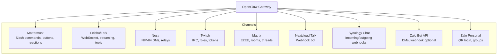

**Diagram sources**
- [extensions/mattermost/index.ts:1-27](file://extensions/mattermost/index.ts#L1-L27)
- [extensions/feishu/index.ts:1-71](file://extensions/feishu/index.ts#L1-L71)
- [extensions/nostr/index.ts:1-77](file://extensions/nostr/index.ts#L1-L77)
- [extensions/twitch/index.ts:1-21](file://extensions/twitch/index.ts#L1-L21)
- [extensions/matrix/index.ts:1-18](file://extensions/matrix/index.ts#L1-L18)
- [extensions/nextcloud-talk/index.ts:1-18](file://extensions/nextcloud-talk/index.ts#L1-L18)
- [extensions/synology-chat/index.ts:1-18](file://extensions/synology-chat/index.ts#L1-L18)
- [extensions/zalo/index.ts:1-18](file://extensions/zalo/index.ts#L1-L18)
- [extensions/zalouser/index.ts:1-33](file://extensions/zalouser/index.ts#L1-L33)

## Detailed Component Analysis

### Mattermost
- Installation and quick setup, including plugin installation and minimal configuration.
- Slash commands: optional native commands registered via Mattermost API with callback validation and reachability requirements.
- Chat modes: oncall, onmessage, onchar; threading via replyToMode.
- Access control: DM pairing, allowlist; group policy and sender allowlists.
- Targets: channel, user, @username resolution.
- Reactions and interactive buttons: inline buttons with HMAC verification and callback base URL configuration.
- Directory adapter: resolves channel and user names via Mattermost API.
- Multi-account support and troubleshooting.

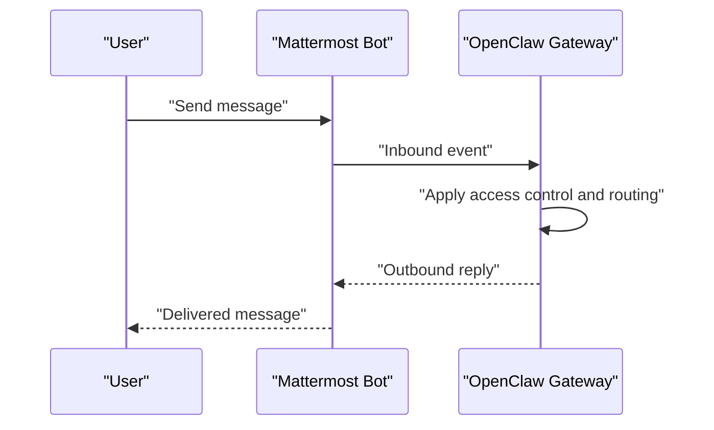

**Diagram sources**
- [docs/channels/mattermost.md:1-399](file://docs/channels/mattermost.md#L1-L399)

**Section sources**
- [docs/channels/mattermost.md:1-399](file://docs/channels/mattermost.md#L1-L399)
- [extensions/mattermost/index.ts:1-27](file://extensions/mattermost/index.ts#L1-L27)

### Feishu/Lark
- Bundled plugin with WebSocket event subscription and optional webhook mode.
- Permissions and app capability setup, event subscription, and publishing steps.
- Configuration via wizard, config file, or environment variables; domain override for Lark.
- Access control: DM pairing, allowlist; group policy and sender allowlists.
- Streaming and quota optimization flags; multi-agent bindings and ACP sessions.
- Configuration reference and troubleshooting.

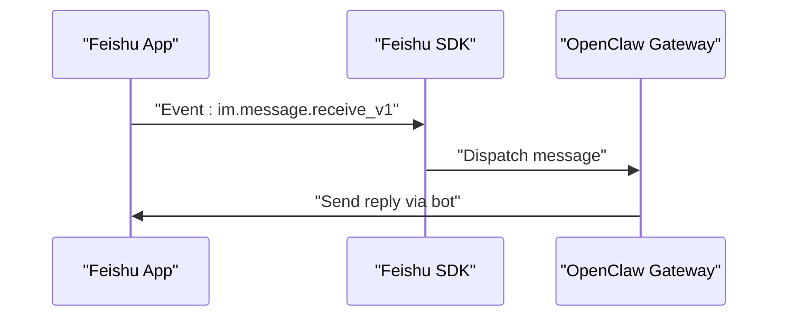

**Diagram sources**
- [docs/channels/feishu.md:1-724](file://docs/channels/feishu.md#L1-L724)

**Section sources**
- [docs/channels/feishu.md:1-724](file://docs/channels/feishu.md#L1-L724)
- [extensions/feishu/index.ts:1-71](file://extensions/feishu/index.ts#L1-L71)

### Nostr
- Optional plugin installation and non-interactive setup with private key and relay configuration.
- Profile metadata publication and retrieval via HTTP route.
- DM policies: pairing, allowlist, open, disabled; key formats for private/public keys.
- Protocol support: NIP-01, NIP-04; planned NIP-17, NIP-44.
- Testing with local relay and troubleshooting.

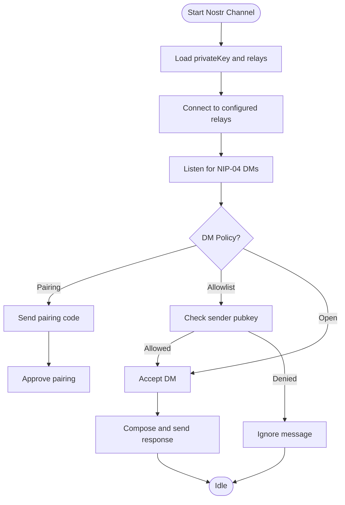

**Diagram sources**
- [docs/channels/nostr.md:1-243](file://docs/channels/nostr.md#L1-L243)
- [extensions/nostr/index.ts:1-77](file://extensions/nostr/index.ts#L1-L77)

**Section sources**
- [docs/channels/nostr.md:1-243](file://docs/channels/nostr.md#L1-L243)
- [extensions/nostr/index.ts:1-77](file://extensions/nostr/index.ts#L1-L77)

### Twitch
- IRC-based chat integration with bot account credentials and channel selection.
- Access control via user ID allowlist or roles; mention requirement defaults to true.
- Token refresh support for long-running deployments; multi-account configuration.
- Tool actions for sending messages; limits and safety guidance.

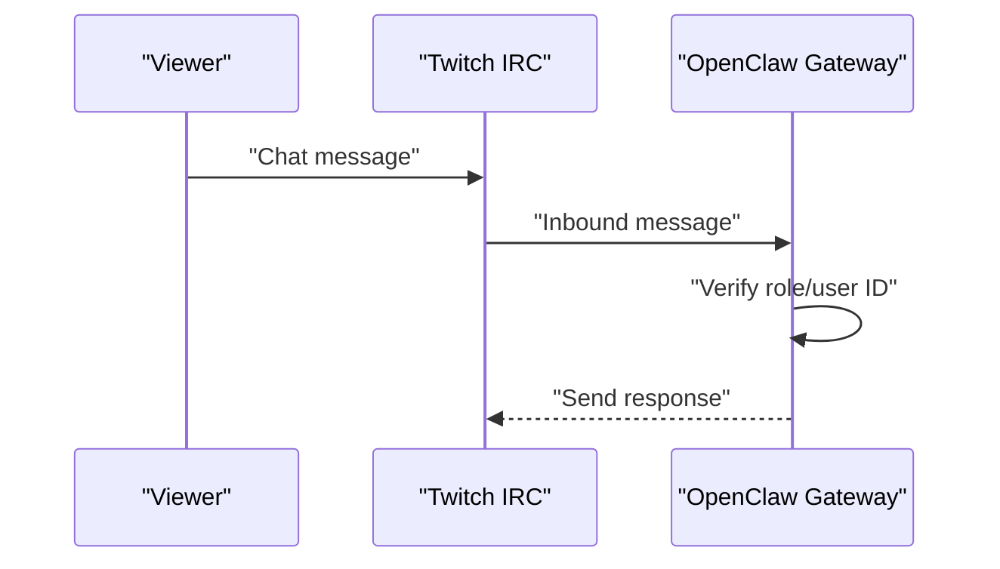

**Diagram sources**
- [docs/channels/twitch.md:1-380](file://docs/channels/twitch.md#L1-L380)
- [extensions/twitch/index.ts:1-21](file://extensions/twitch/index.ts#L1-L21)

**Section sources**
- [docs/channels/twitch.md:1-380](file://docs/channels/twitch.md#L1-L380)
- [extensions/twitch/index.ts:1-21](file://extensions/twitch/index.ts#L1-L21)

### Matrix
- Plugin-based integration with E2EE support via Rust crypto SDK.
- Homeserver login, access token storage, and device verification flow.
- DM and room policies, threading, reactions, polls, location; multi-account support.
- Troubleshooting ladder and configuration reference.

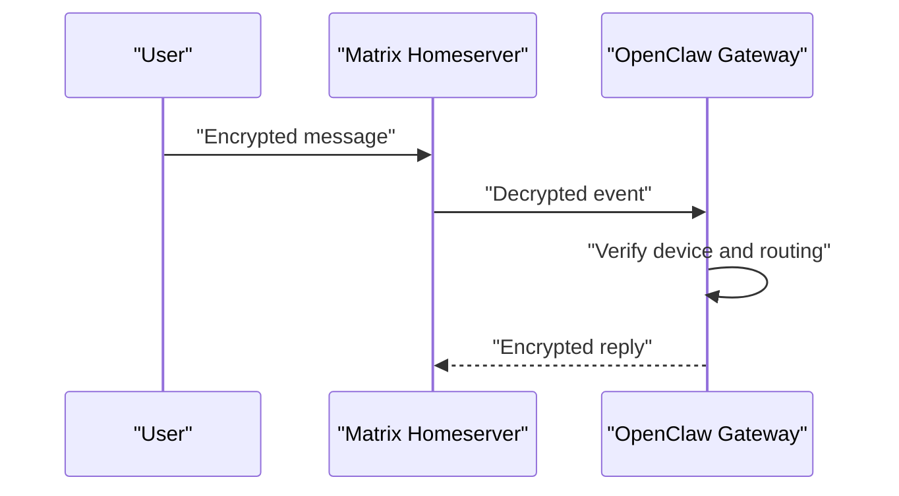

**Diagram sources**
- [docs/channels/matrix.md:1-304](file://docs/channels/matrix.md#L1-L304)
- [extensions/matrix/index.ts:1-18](file://extensions/matrix/index.ts#L1-L18)

**Section sources**
- [docs/channels/matrix.md:1-304](file://docs/channels/matrix.md#L1-L304)
- [extensions/matrix/index.ts:1-18](file://extensions/matrix/index.ts#L1-L18)

### Nextcloud Talk
- Webhook-based bot with shared secret and reaction feature enablement.
- Access control for DMs and rooms; webhook reachability and media URL delivery.
- Configuration reference and capabilities.

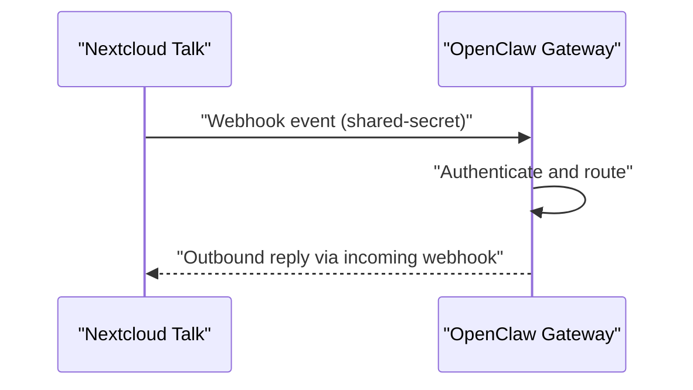

**Diagram sources**
- [docs/channels/nextcloud-talk.md:1-139](file://docs/channels/nextcloud-talk.md#L1-L139)
- [extensions/nextcloud-talk/index.ts:1-18](file://extensions/nextcloud-talk/index.ts#L1-L18)

**Section sources**
- [docs/channels/nextcloud-talk.md:1-139](file://docs/channels/nextcloud-talk.md#L1-L139)
- [extensions/nextcloud-talk/index.ts:1-18](file://extensions/nextcloud-talk/index.ts#L1-L18)

### Synology Chat
- Webhook-based DM channel with outgoing secret token and incoming webhook URL.
- Access control via allowlist; rate limiting and SSL security notes.
- Multi-account configuration and outbound delivery targets.

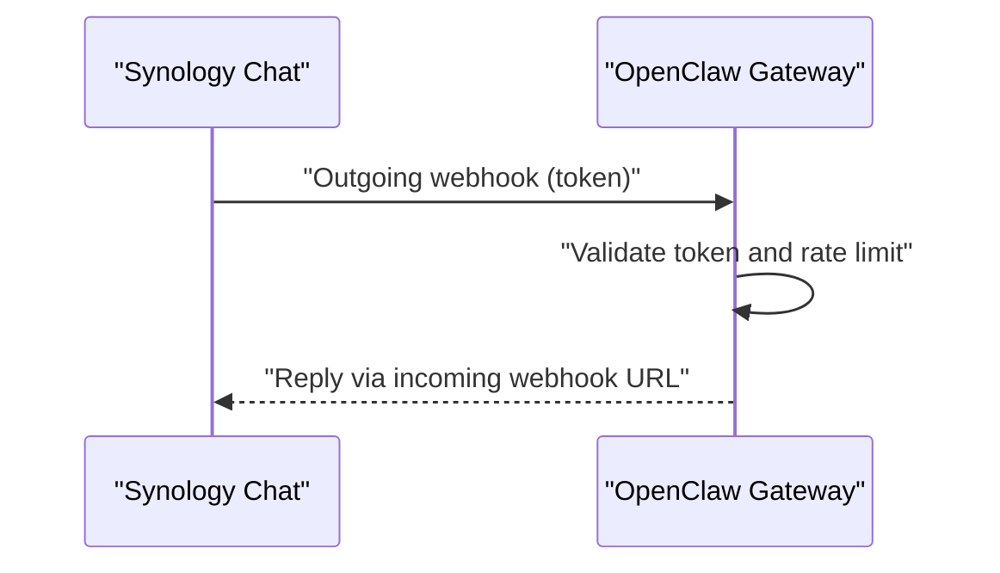

**Diagram sources**
- [docs/channels/synology-chat.md:1-133](file://docs/channels/synology-chat.md#L1-L133)
- [extensions/synology-chat/index.ts:1-18](file://extensions/synology-chat/index.ts#L1-L18)

**Section sources**
- [docs/channels/synology-chat.md:1-133](file://docs/channels/synology-chat.md#L1-L133)
- [extensions/synology-chat/index.ts:1-18](file://extensions/synology-chat/index.ts#L1-L18)

### Zalo
- Bot API for DMs; optional webhook mode with secret and HTTPS requirement.
- Access control via pairing or allowlist; limits and capabilities for marketplace bots.
- Multi-account configuration and troubleshooting.

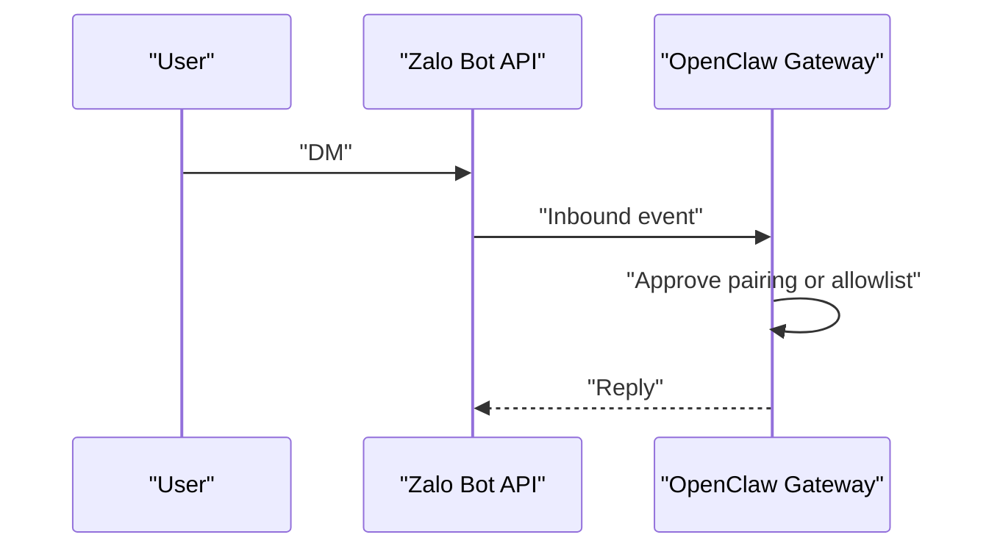

**Diagram sources**
- [docs/channels/zalo.md:1-244](file://docs/channels/zalo.md#L1-L244)
- [extensions/zalo/index.ts:1-18](file://extensions/zalo/index.ts#L1-L18)

**Section sources**
- [docs/channels/zalo.md:1-244](file://docs/channels/zalo.md#L1-L244)
- [extensions/zalo/index.ts:1-18](file://extensions/zalo/index.ts#L1-L18)

### Zalo Personal
- Experimental personal account automation via native zca-js with QR login.
- Supports DMs and groups with access control, typing indicators, reactions, and delivery acknowledgments.
- Multi-account profiles and troubleshooting.

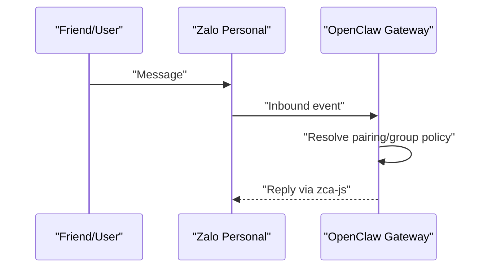

**Diagram sources**
- [docs/channels/zalouser.md:1-182](file://docs/channels/zalouser.md#L1-L182)
- [extensions/zalouser/index.ts:1-33](file://extensions/zalouser/index.ts#L1-L33)

**Section sources**
- [docs/channels/zalouser.md:1-182](file://docs/channels/zalouser.md#L1-L182)
- [extensions/zalouser/index.ts:1-33](file://extensions/zalouser/index.ts#L1-L33)

## Dependency Analysis
- Each plugin registers the channel and, when applicable, additional HTTP routes or tools.
- Mattermost registers slash command callbacks; Nostr exposes a profile HTTP handler; Feishu registers multiple tool hooks and subagent hooks; Zalo Personal registers a tool for outbound actions.

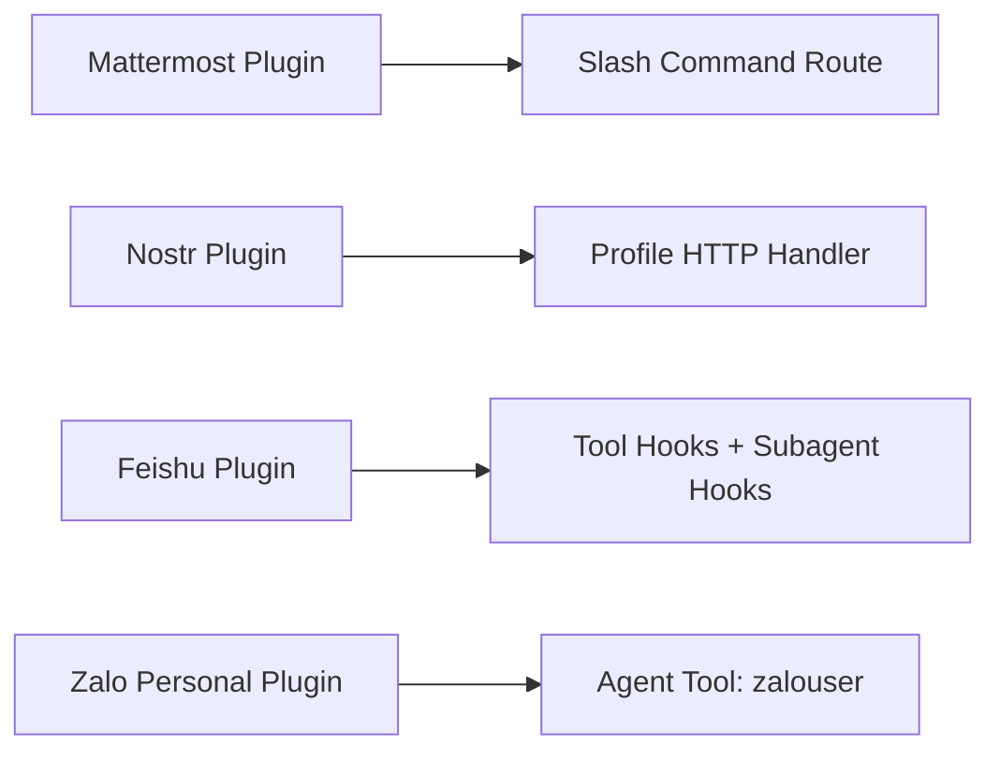

**Diagram sources**
- [extensions/mattermost/index.ts:1-27](file://extensions/mattermost/index.ts#L1-L27)
- [extensions/nostr/index.ts:1-77](file://extensions/nostr/index.ts#L1-L77)
- [extensions/feishu/index.ts:1-71](file://extensions/feishu/index.ts#L1-L71)
- [extensions/zalouser/index.ts:1-33](file://extensions/zalouser/index.ts#L1-L33)

**Section sources**
- [extensions/mattermost/index.ts:1-27](file://extensions/mattermost/index.ts#L1-L27)
- [extensions/nostr/index.ts:1-77](file://extensions/nostr/index.ts#L1-L77)
- [extensions/feishu/index.ts:1-71](file://extensions/feishu/index.ts#L1-L71)
- [extensions/zalouser/index.ts:1-33](file://extensions/zalouser/index.ts#L1-L33)

## Performance Considerations
- Minimize API calls: Feishu supports quota flags to reduce typing indicators and sender name resolution.
- Use streaming judiciously: Some channels (for example, Zalo) block streaming due to message size limits.
- Optimize relay selection: Nostr benefits from 2–3 reliable relays; avoid excessive relays to reduce latency.
- Rate limiting: Synology Chat enforces per-minute limits; tune accordingly.
- E2EE overhead: Matrix encryption adds CPU and storage overhead; ensure crypto module availability and device verification.

[No sources needed since this section provides general guidance]

## Troubleshooting Guide
- Mattermost: Verify bot token, base URL, callback reachability, and Mattermost egress allowlist; check HMAC token generation for buttons.
- Feishu: Confirm app is published, event subscription includes the required event, WebSocket is enabled, and permissions are complete.
- Nostr: Validate private key, relay URLs, and enabled flag; check for relay rate limits and duplicates.
- Twitch: Ensure access token scopes include chat:read and chat:write; use user IDs for allowlists; enable token refresh for long-running bots.
- Matrix: Confirm crypto module load, device verification, and encryption settings; check homeserver URL and access token validity.
- Nextcloud Talk: Ensure webhook URL is reachable, shared secret matches, and room lookups are configured if DM distinction is needed.
- Synology Chat: Validate outgoing token, incoming URL, rate limits, and SSL settings; ensure webhook path is correct.
- Zalo: Confirm token validity and pairing/approval; for marketplace bots, verify capabilities and webhook exclusivity with long-polling.

**Section sources**
- [docs/channels/mattermost.md:387-399](file://docs/channels/mattermost.md#L387-L399)
- [docs/channels/feishu.md:452-482](file://docs/channels/feishu.md#L452-L482)
- [docs/channels/nostr.md:212-243](file://docs/channels/nostr.md#L212-L243)
- [docs/channels/twitch.md:249-380](file://docs/channels/twitch.md#L249-L380)
- [docs/channels/matrix.md:248-304](file://docs/channels/matrix.md#L248-L304)
- [docs/channels/nextcloud-talk.md:63-139](file://docs/channels/nextcloud-talk.md#L63-L139)
- [docs/channels/synology-chat.md:75-133](file://docs/channels/synology-chat.md#L75-L133)
- [docs/channels/zalo.md:194-244](file://docs/channels/zalo.md#L194-L244)
- [docs/channels/zalouser.md:167-182](file://docs/channels/zalouser.md#L167-L182)

## Conclusion
These specialized platforms extend OpenClaw’s communication capabilities across diverse ecosystems: enterprise collaboration (Feishu), decentralized networks (Nostr), streaming communities (Twitch), federated messaging (Matrix), self-hosted environments (Nextcloud Talk, Synology Chat), and regional markets (Zalo, Zalo Personal). Each integration provides tailored authentication, access control, and configuration options, with plugin entry points that cleanly integrate into the gateway runtime.

[No sources needed since this section summarizes without analyzing specific files]