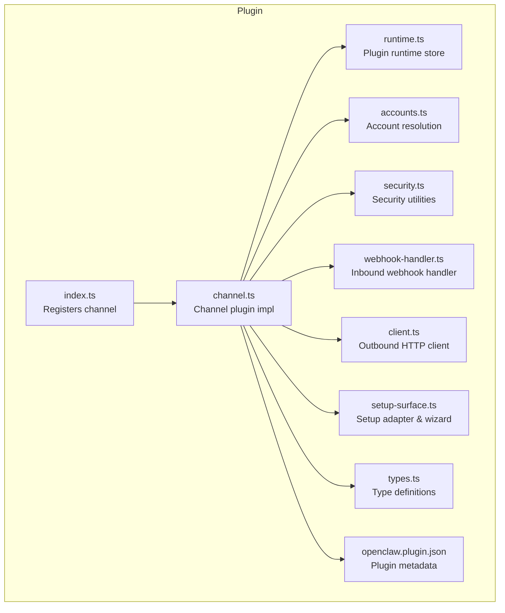
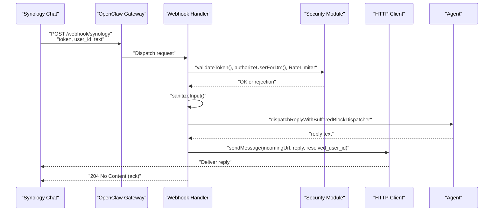
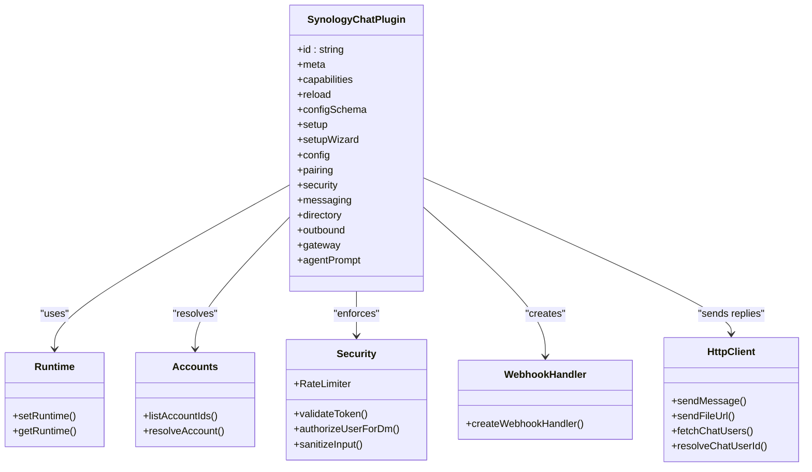
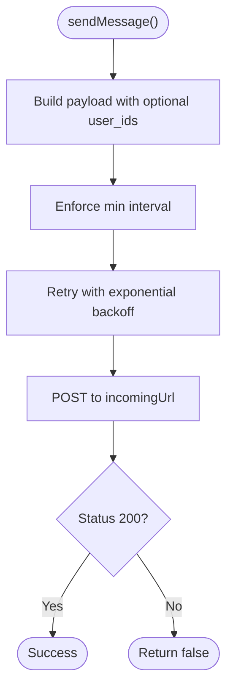
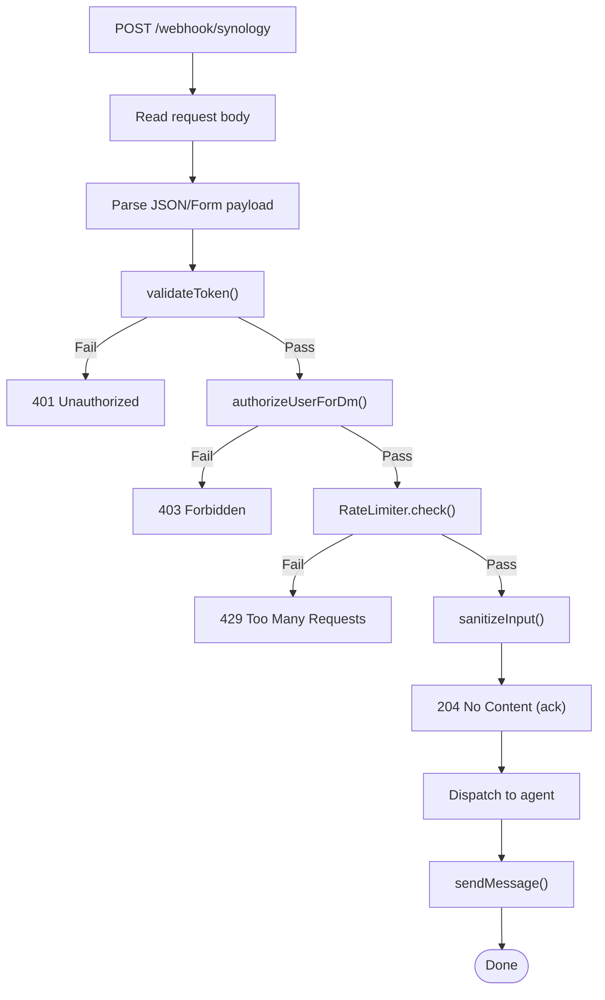
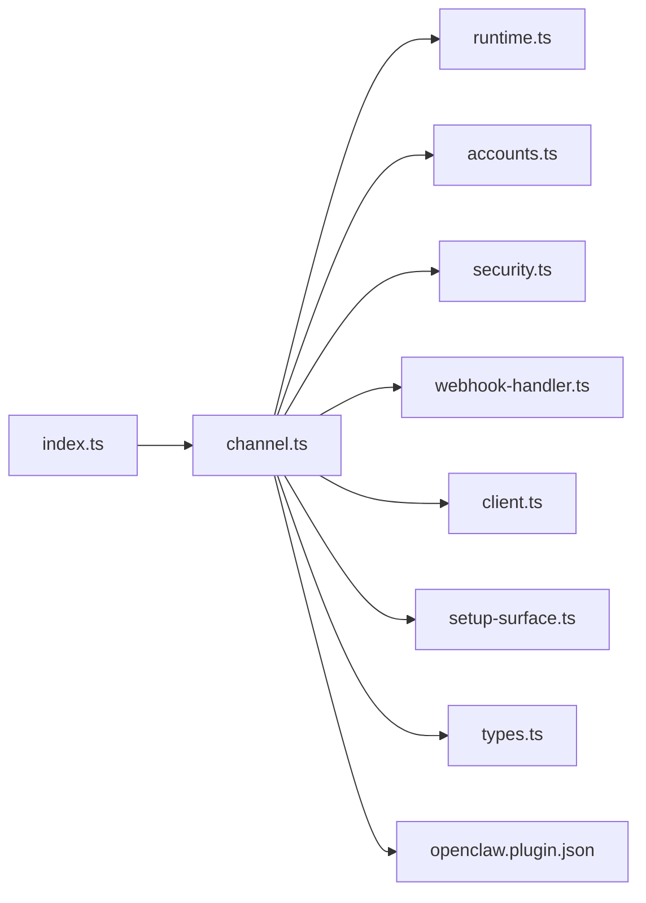

# Synology Chat Integration

<cite>
**Referenced Files in This Document**
- [index.ts](file://extensions/synology-chat/index.ts)
- [channel.ts](file://extensions/synology-chat/src/channel.ts)
- [client.ts](file://extensions/synology-chat/src/client.ts)
- [webhook-handler.ts](file://extensions/synology-chat/src/webhook-handler.ts)
- [accounts.ts](file://extensions/synology-chat/src/accounts.ts)
- [security.ts](file://extensions/synology-chat/src/security.ts)
- [setup-surface.ts](file://extensions/synology-chat/src/setup-surface.ts)
- [runtime.ts](file://extensions/synology-chat/src/runtime.ts)
- [types.ts](file://extensions/synology-chat/src/types.ts)
- [openclaw.plugin.json](file://extensions/synology-chat/openclaw.plugin.json)
- [synology-chat.md](file://docs/channels/synology-chat.md)
</cite>

## Table of Contents
1. [Introduction](#introduction)
2. [Project Structure](#project-structure)
3. [Core Components](#core-components)
4. [Architecture Overview](#architecture-overview)
5. [Detailed Component Analysis](#detailed-component-analysis)
6. [Dependency Analysis](#dependency-analysis)
7. [Performance Considerations](#performance-considerations)
8. [Troubleshooting Guide](#troubleshooting-guide)
9. [Conclusion](#conclusion)
10. [Appendices](#appendices)

## Introduction
This document explains the Synology Chat integration built as an OpenClaw plugin. It covers the plugin’s architecture, authentication via Synology Chat webhooks, inbound/outbound message handling, DM policy enforcement, multi-account support, and operational guidance. It also outlines setup steps for Synology DSM and Chat app, API access permissions, and security considerations for NAS-based deployments.

## Project Structure
The Synology Chat integration is implemented as a plugin with the following key parts:
- Plugin registration and channel export
- Channel plugin definition implementing inbound/outbound flows
- HTTP client for sending messages to Synology Chat
- Webhook handler for inbound messages
- Account resolution and environment variable fallbacks
- Security utilities for token validation, rate limiting, and input sanitization
- Setup adapter and wizard for guided configuration
- Runtime storage for plugin-scoped runtime access

**Diagram sources**
- [index.ts:1-18](file://extensions/synology-chat/index.ts#L1-L18)
- [channel.ts:1-385](file://extensions/synology-chat/src/channel.ts#L1-L385)
- [client.ts:1-271](file://extensions/synology-chat/src/client.ts#L1-L271)
- [webhook-handler.ts:1-398](file://extensions/synology-chat/src/webhook-handler.ts#L1-L398)
- [accounts.ts:1-97](file://extensions/synology-chat/src/accounts.ts#L1-L97)
- [security.ts:1-125](file://extensions/synology-chat/src/security.ts#L1-L125)
- [setup-surface.ts:1-325](file://extensions/synology-chat/src/setup-surface.ts#L1-L325)
- [runtime.ts:1-9](file://extensions/synology-chat/src/runtime.ts#L1-L9)
- [types.ts:1-53](file://extensions/synology-chat/src/types.ts#L1-L53)
- [openclaw.plugin.json:1-10](file://extensions/synology-chat/openclaw.plugin.json#L1-L10)

**Section sources**
- [index.ts:1-18](file://extensions/synology-chat/index.ts#L1-L18)
- [channel.ts:1-385](file://extensions/synology-chat/src/channel.ts#L1-L385)
- [client.ts:1-271](file://extensions/synology-chat/src/client.ts#L1-L271)
- [webhook-handler.ts:1-398](file://extensions/synology-chat/src/webhook-handler.ts#L1-L398)
- [accounts.ts:1-97](file://extensions/synology-chat/src/accounts.ts#L1-L97)
- [security.ts:1-125](file://extensions/synology-chat/src/security.ts#L1-L125)
- [setup-surface.ts:1-325](file://extensions/synology-chat/src/setup-surface.ts#L1-L325)
- [runtime.ts:1-9](file://extensions/synology-chat/src/runtime.ts#L1-L9)
- [types.ts:1-53](file://extensions/synology-chat/src/types.ts#L1-L53)
- [openclaw.plugin.json:1-10](file://extensions/synology-chat/openclaw.plugin.json#L1-L10)

## Core Components
- Plugin registration and channel export: registers the Synology Chat channel with OpenClaw runtime and exposes the channel plugin.
- Channel plugin: defines capabilities, configuration schema, setup adapters, security policies, messaging targets, and gateway lifecycle hooks.
- HTTP client: sends outbound messages and file URLs to Synology Chat via incoming webhook URLs, with internal throttling and retries.
- Webhook handler: parses inbound payloads, validates tokens, enforces DM policy and rate limits, sanitizes input, and dispatches messages to the agent.
- Account resolution: merges base channel config, per-account overrides, and environment variables into a resolved account profile.
- Security utilities: constant-time token validation, user allowlist checks, rate limiting, and input sanitization.
- Setup adapter and wizard: guides users through configuring tokens, incoming URLs, webhook paths, and DM allowlists.
- Runtime store: provides plugin-scoped runtime access for internal operations.

**Section sources**
- [index.ts:1-18](file://extensions/synology-chat/index.ts#L1-L18)
- [channel.ts:43-385](file://extensions/synology-chat/src/channel.ts#L43-L385)
- [client.ts:48-104](file://extensions/synology-chat/src/client.ts#L48-L104)
- [webhook-handler.ts:253-398](file://extensions/synology-chat/src/webhook-handler.ts#L253-L398)
- [accounts.ts:64-97](file://extensions/synology-chat/src/accounts.ts#L64-L97)
- [security.ts:19-87](file://extensions/synology-chat/src/security.ts#L19-L87)
- [setup-surface.ts:140-325](file://extensions/synology-chat/src/setup-surface.ts#L140-L325)
- [runtime.ts:4-9](file://extensions/synology-chat/src/runtime.ts#L4-L9)

## Architecture Overview
The integration operates as a webhook-based channel:
- Outbound: OpenClaw sends replies to Synology Chat via an incoming webhook URL.
- Inbound: Synology Chat posts outgoing webhooks to a configurable path on the OpenClaw gateway; the handler validates, authorizes, rate-limits, and dispatches messages to the agent.
- Agent processing: The agent responds asynchronously; the handler sends replies back to the resolved Chat user ID.

**Diagram sources**
- [webhook-handler.ts:253-398](file://extensions/synology-chat/src/webhook-handler.ts#L253-L398)
- [security.ts:19-87](file://extensions/synology-chat/src/security.ts#L19-L87)
- [client.ts:48-104](file://extensions/synology-chat/src/client.ts#L48-L104)
- [channel.ts:260-354](file://extensions/synology-chat/src/channel.ts#L260-L354)

## Detailed Component Analysis

### Channel Plugin Implementation
The channel plugin defines:
- Capabilities: direct messages, media via URL, no threading/reactions/edit/unsend/reply/effects.
- Configuration schema and account management: list accounts, resolve account, default account ID, enable/disable per account.
- Pairing and DM policy: resolves policy and allow-from entries, approval notifications via incoming webhook.
- Messaging: normalizes targets (supports numeric IDs and prefixed forms), sends text and media URLs.
- Gateway lifecycle: starts/stops HTTP routes per account, registers webhook handlers, handles abort signals, and deregisters stale routes.

**Diagram sources**
- [channel.ts:43-385](file://extensions/synology-chat/src/channel.ts#L43-L385)
- [runtime.ts:4-9](file://extensions/synology-chat/src/runtime.ts#L4-L9)
- [accounts.ts:38-97](file://extensions/synology-chat/src/accounts.ts#L38-L97)
- [security.ts:19-125](file://extensions/synology-chat/src/security.ts#L19-L125)
- [webhook-handler.ts:253-398](file://extensions/synology-chat/src/webhook-handler.ts#L253-L398)
- [client.ts:48-205](file://extensions/synology-chat/src/client.ts#L48-L205)

**Section sources**
- [channel.ts:43-385](file://extensions/synology-chat/src/channel.ts#L43-L385)
- [runtime.ts:4-9](file://extensions/synology-chat/src/runtime.ts#L4-L9)
- [accounts.ts:38-97](file://extensions/synology-chat/src/accounts.ts#L38-L97)
- [security.ts:19-125](file://extensions/synology-chat/src/security.ts#L19-L125)
- [webhook-handler.ts:253-398](file://extensions/synology-chat/src/webhook-handler.ts#L253-L398)
- [client.ts:48-205](file://extensions/synology-chat/src/client.ts#L48-L205)

### HTTP Client and User ID Resolution
The client:
- Builds form-encoded payloads with optional user_ids for mentions.
- Enforces a minimum interval between sends to avoid flooding.
- Retries with exponential backoff on failures.
- Resolves Chat API user IDs from webhook usernames/nicknames via the user_list API and caches results.

**Diagram sources**
- [client.ts:48-104](file://extensions/synology-chat/src/client.ts#L48-L104)
- [client.ts:223-266](file://extensions/synology-chat/src/client.ts#L223-L266)

**Section sources**
- [client.ts:48-104](file://extensions/synology-chat/src/client.ts#L48-L104)
- [client.ts:113-205](file://extensions/synology-chat/src/client.ts#L113-L205)
- [client.ts:223-266](file://extensions/synology-chat/src/client.ts#L223-L266)

### Inbound Webhook Processing
The handler:
- Reads and parses request bodies supporting JSON and form-encoded payloads.
- Extracts token from body/query/header with flexible aliases.
- Validates token using constant-time comparison.
- Authorizes DMs according to policy and allowlist.
- Applies rate limiting per user ID.
- Sanitizes input and strips trigger words.
- Immediately acknowledges the request, then dispatches to the agent and sends replies.

**Diagram sources**
- [webhook-handler.ts:253-398](file://extensions/synology-chat/src/webhook-handler.ts#L253-L398)
- [security.ts:19-62](file://extensions/synology-chat/src/security.ts#L19-L62)

**Section sources**
- [webhook-handler.ts:152-206](file://extensions/synology-chat/src/webhook-handler.ts#L152-L206)
- [webhook-handler.ts:286-336](file://extensions/synology-chat/src/webhook-handler.ts#L286-L336)
- [security.ts:19-62](file://extensions/synology-chat/src/security.ts#L19-L62)

### Account Resolution and Environment Variables
Accounts are resolved by merging:
- Per-account overrides
- Base channel configuration
- Environment variables (only for the default account)

Environment variables include token, incoming URL, NAS host, allowed user IDs, rate limit, and bot name.

**Section sources**
- [accounts.ts:64-97](file://extensions/synology-chat/src/accounts.ts#L64-L97)
- [synology-chat.md:62-74](file://docs/channels/synology-chat.md#L62-L74)

### Setup Adapter and Wizard
The setup adapter and wizard:
- Validate inputs (token, incoming URL, webhook path).
- Apply configuration patches for accounts.
- Support environment-based credential usage for the default account.
- Provide guided steps for creating incoming/outgoing webhooks and allowlisting user IDs.

**Section sources**
- [setup-surface.ts:140-173](file://extensions/synology-chat/src/setup-surface.ts#L140-L173)
- [setup-surface.ts:175-325](file://extensions/synology-chat/src/setup-surface.ts#L175-L325)

### Plugin Registration and Metadata
The plugin registers itself with OpenClaw and exports the channel plugin. The metadata declares the channel ID and schema.

**Section sources**
- [index.ts:6-15](file://extensions/synology-chat/index.ts#L6-L15)
- [openclaw.plugin.json:1-10](file://extensions/synology-chat/openclaw.plugin.json#L1-L10)

## Dependency Analysis
High-level dependencies among components:

**Diagram sources**
- [index.ts:1-18](file://extensions/synology-chat/index.ts#L1-L18)
- [channel.ts:1-385](file://extensions/synology-chat/src/channel.ts#L1-L385)
- [runtime.ts:1-9](file://extensions/synology-chat/src/runtime.ts#L1-L9)
- [accounts.ts:1-97](file://extensions/synology-chat/src/accounts.ts#L1-L97)
- [security.ts:1-125](file://extensions/synology-chat/src/security.ts#L1-L125)
- [webhook-handler.ts:1-398](file://extensions/synology-chat/src/webhook-handler.ts#L1-L398)
- [client.ts:1-271](file://extensions/synology-chat/src/client.ts#L1-L271)
- [setup-surface.ts:1-325](file://extensions/synology-chat/src/setup-surface.ts#L1-L325)
- [types.ts:1-53](file://extensions/synology-chat/src/types.ts#L1-L53)
- [openclaw.plugin.json:1-10](file://extensions/synology-chat/openclaw.plugin.json#L1-L10)

**Section sources**
- [index.ts:1-18](file://extensions/synology-chat/index.ts#L1-L18)
- [channel.ts:1-385](file://extensions/synology-chat/src/channel.ts#L1-L385)

## Performance Considerations
- Internal send throttling: minimum interval between outbound sends prevents rate spikes.
- Retries with exponential backoff reduce transient failure impact.
- Rate limiting per user ID protects the agent and downstream systems.
- Caching of user lists reduces repeated API calls to the Chat user_list endpoint.
- Immediate acknowledgment of inbound requests ensures timely feedback to Synology Chat.

[No sources needed since this section provides general guidance]

## Troubleshooting Guide
Common issues and resolutions:
- Webhook rejects all requests: ensure the token is configured and matches the outgoing webhook secret.
- Cannot send replies: verify the incoming webhook URL is set and reachable from the gateway.
- Allowlist blocking all senders: switch to open DM policy or populate allowed user IDs.
- Self-signed certificate errors: enable insecure SSL only for local NAS with self-signed certs.
- Agent response timeouts: confirm the agent completes within the expected timeframe; review logs for errors.

Operational checks:
- Confirm the route path matches the outgoing webhook URL configured in Synology Chat.
- Verify environment variables are correctly set for the default account.
- Review warnings emitted by the security module for misconfigurations.

**Section sources**
- [channel.ts:142-171](file://extensions/synology-chat/src/channel.ts#L142-L171)
- [webhook-handler.ts:286-317](file://extensions/synology-chat/src/webhook-handler.ts#L286-L317)
- [synology-chat.md:127-133](file://docs/channels/synology-chat.md#L127-L133)

## Conclusion
The Synology Chat integration provides a secure, webhook-based channel for NAS-local communication. It supports direct messages, media sharing via URL, multi-account configurations, and robust security controls including token validation, rate limiting, and input sanitization. The setup wizard streamlines configuration, and the runtime model enables reliable gateway lifecycle management.

[No sources needed since this section summarizes without analyzing specific files]

## Appendices

### Setup Procedures
- Install the plugin from a local checkout.
- Enable the channel and configure credentials via the wizard or CLI.
- Create incoming and outgoing webhooks in Synology Chat and point the outgoing URL to the gateway route.
- Configure DM policy and allowed user IDs.
- Restart the gateway and test with a direct message.

**Section sources**
- [synology-chat.md:15-41](file://docs/channels/synology-chat.md#L15-L41)
- [setup-surface.ts:175-200](file://extensions/synology-chat/src/setup-surface.ts#L175-L200)

### Configuration Reference
- Channel-level fields: enable, token, incoming URL, NAS host, webhook path, DM policy, allowed user IDs, rate limit, bot name, SSL allow-insecure.
- Multi-account: define multiple accounts under the channel section to override base settings.

**Section sources**
- [types.ts:5-39](file://extensions/synology-chat/src/types.ts#L5-L39)
- [synology-chat.md:43-60](file://docs/channels/synology-chat.md#L43-L60)
- [synology-chat.md:104-125](file://docs/channels/synology-chat.md#L104-L125)

### Security Notes
- Keep tokens secret and rotate if compromised.
- Prefer allowlist DM policy for production.
- Avoid disabling SSL verification except for local NAS with self-signed certificates.
- Monitor rate-limit warnings and adjust limits as needed.

**Section sources**
- [synology-chat.md:127-133](file://docs/channels/synology-chat.md#L127-L133)
- [security.ts:19-62](file://extensions/synology-chat/src/security.ts#L19-L62)