# Twitch Chat Integration

<cite>
**Referenced Files in This Document**
- [docs/channels/twitch.md](file://docs/channels/twitch.md)
- [extensions/twitch/src/plugin.ts](file://extensions/twitch/src/plugin.ts)
- [extensions/twitch/src/twitch-client.ts](file://extensions/twitch/src/twitch-client.ts)
- [extensions/twitch/src/token.ts](file://extensions/twitch/src/token.ts)
- [extensions/twitch/src/access-control.ts](file://extensions/twitch/src/access-control.ts)
- [extensions/twitch/src/outbound.ts](file://extensions/twitch/src/outbound.ts)
- [extensions/twitch/src/send.ts](file://extensions/twitch/src/send.ts)
- [extensions/twitch/src/status.ts](file://extensions/twitch/src/status.ts)
- [extensions/twitch/src/utils/twitch.ts](file://extensions/twitch/src/utils/twitch.ts)
- [extensions/twitch/src/client-manager-registry.ts](file://extensions/twitch/src/client-manager-registry.ts)
- [extensions/twitch/src/actions.ts](file://extensions/twitch/src/actions.ts)
- [extensions/twitch/src/resolver.ts](file://extensions/twitch/src/resolver.ts)
- [extensions/twitch/src/probe.ts](file://extensions/twitch/src/probe.ts)
- [extensions/twitch/src/monitor.ts](file://extensions/twitch/src/monitor.ts)
- [extensions/twitch/src/types.ts](file://extensions/twitch/src/types.ts)
</cite>

## Table of Contents
1. [Introduction](#introduction)
2. [Project Structure](#project-structure)
3. [Core Components](#core-components)
4. [Architecture Overview](#architecture-overview)
5. [Detailed Component Analysis](#detailed-component-analysis)
6. [Dependency Analysis](#dependency-analysis)
7. [Performance Considerations](#performance-considerations)
8. [Troubleshooting Guide](#troubleshooting-guide)
9. [Conclusion](#conclusion)
10. [Appendices](#appendices)

## Introduction
This document explains the Twitch chat integration for streaming communities. It covers the Twitch IRC client implementation, OAuth-based authentication, chat room management, message handling, access control (including mention requirements and roles), outbound messaging, and operational status monitoring. It also documents setup procedures for bot accounts and OAuth applications, connection parameters, and practical guidance for reliability and performance in high-volume chat scenarios.

## Project Structure
The Twitch integration is implemented as a plugin with a clear separation of concerns:
- Plugin entry and orchestration
- Client management and connection lifecycle
- Authentication and token handling
- Access control and message routing
- Outbound messaging and actions
- Status, probing, and monitoring
- Utilities for normalization and validation

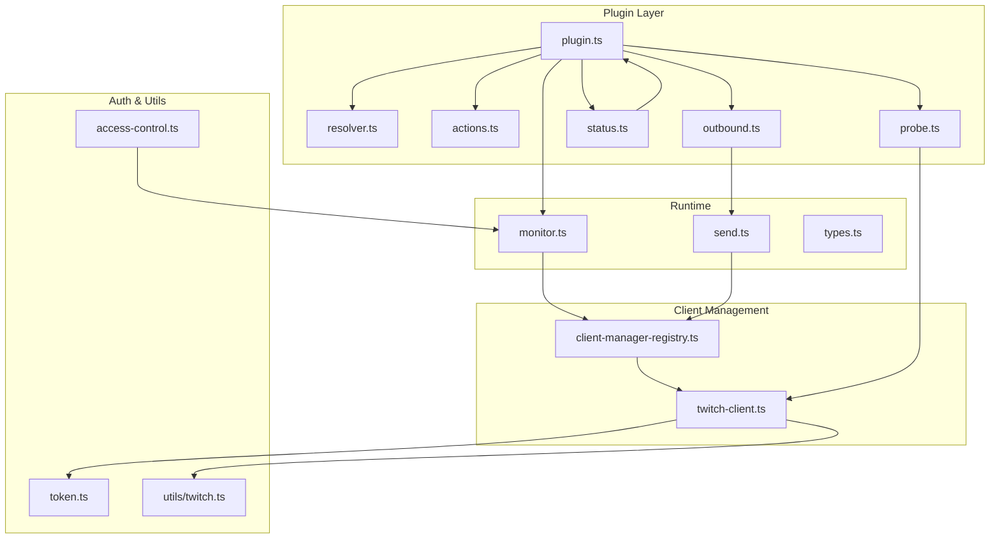

**Diagram sources**
- [extensions/twitch/src/plugin.ts:40-270](file://extensions/twitch/src/plugin.ts#L40-L270)
- [extensions/twitch/src/resolver.ts:46-138](file://extensions/twitch/src/resolver.ts#L46-L138)
- [extensions/twitch/src/actions.ts:67-175](file://extensions/twitch/src/actions.ts#L67-L175)
- [extensions/twitch/src/outbound.ts:24-188](file://extensions/twitch/src/outbound.ts#L24-L188)
- [extensions/twitch/src/status.ts:30-180](file://extensions/twitch/src/status.ts#L30-L180)
- [extensions/twitch/src/probe.ts:23-120](file://extensions/twitch/src/probe.ts#L23-L120)
- [extensions/twitch/src/monitor.ts:192-274](file://extensions/twitch/src/monitor.ts#L192-L274)
- [extensions/twitch/src/client-manager-registry.ts:38-87](file://extensions/twitch/src/client-manager-registry.ts#L38-L87)
- [extensions/twitch/src/twitch-client.ts:11-278](file://extensions/twitch/src/twitch-client.ts#L11-L278)
- [extensions/twitch/src/token.ts:54-95](file://extensions/twitch/src/token.ts#L54-L95)
- [extensions/twitch/src/utils/twitch.ts:20-81](file://extensions/twitch/src/utils/twitch.ts#L20-L81)
- [extensions/twitch/src/access-control.ts:34-173](file://extensions/twitch/src/access-control.ts#L34-L173)
- [extensions/twitch/src/send.ts:51-137](file://extensions/twitch/src/send.ts#L51-L137)
- [extensions/twitch/src/types.ts:39-142](file://extensions/twitch/src/types.ts#L39-L142)

**Section sources**
- [extensions/twitch/src/plugin.ts:40-270](file://extensions/twitch/src/plugin.ts#L40-L270)
- [extensions/twitch/src/twitch-client.ts:11-278](file://extensions/twitch/src/twitch-client.ts#L11-L278)
- [extensions/twitch/src/token.ts:54-95](file://extensions/twitch/src/token.ts#L54-L95)
- [extensions/twitch/src/access-control.ts:34-173](file://extensions/twitch/src/access-control.ts#L34-L173)
- [extensions/twitch/src/outbound.ts:24-188](file://extensions/twitch/src/outbound.ts#L24-L188)
- [extensions/twitch/src/send.ts:51-137](file://extensions/twitch/src/send.ts#L51-L137)
- [extensions/twitch/src/status.ts:30-180](file://extensions/twitch/src/status.ts#L30-L180)
- [extensions/twitch/src/utils/twitch.ts:20-81](file://extensions/twitch/src/utils/twitch.ts#L20-L81)
- [extensions/twitch/src/client-manager-registry.ts:38-87](file://extensions/twitch/src/client-manager-registry.ts#L38-L87)
- [extensions/twitch/src/actions.ts:67-175](file://extensions/twitch/src/actions.ts#L67-L175)
- [extensions/twitch/src/resolver.ts:46-138](file://extensions/twitch/src/resolver.ts#L46-L138)
- [extensions/twitch/src/probe.ts:23-120](file://extensions/twitch/src/probe.ts#L23-L120)
- [extensions/twitch/src/monitor.ts:192-274](file://extensions/twitch/src/monitor.ts#L192-L274)
- [extensions/twitch/src/types.ts:39-142](file://extensions/twitch/src/types.ts#L39-L142)

## Core Components
- Plugin entry: Defines capabilities, configuration schema, setup surfaces, resolver, status, and gateway lifecycle.
- Client manager: Creates and manages a Twurple ChatClient per account, handles authentication, logging, message routing, and sending.
- Token resolution: Supports config-based and environment-based tokens, normalizes prefixes, and merges multi-account configs.
- Access control: Enforces mention requirements, allowlists by user ID, and role-based access (moderator, owner, VIP, subscriber, all).
- Outbound adapter: Validates targets, chunks text, strips markdown, and sends messages to channels.
- Actions adapter: Provides tool-based actions (e.g., send) for external integrations.
- Resolver: Resolves usernames and user IDs via the Twitch Helix API.
- Probing: Verifies connectivity and credentials without maintaining a long-lived connection.
- Status collection: Reports configuration and runtime issues across accounts.

**Section sources**
- [extensions/twitch/src/plugin.ts:40-270](file://extensions/twitch/src/plugin.ts#L40-L270)
- [extensions/twitch/src/twitch-client.ts:11-278](file://extensions/twitch/src/twitch-client.ts#L11-L278)
- [extensions/twitch/src/token.ts:54-95](file://extensions/twitch/src/token.ts#L54-L95)
- [extensions/twitch/src/access-control.ts:34-173](file://extensions/twitch/src/access-control.ts#L34-L173)
- [extensions/twitch/src/outbound.ts:24-188](file://extensions/twitch/src/outbound.ts#L24-L188)
- [extensions/twitch/src/actions.ts:67-175](file://extensions/twitch/src/actions.ts#L67-L175)
- [extensions/twitch/src/resolver.ts:46-138](file://extensions/twitch/src/resolver.ts#L46-L138)
- [extensions/twitch/src/probe.ts:23-120](file://extensions/twitch/src/probe.ts#L23-L120)
- [extensions/twitch/src/status.ts:30-180](file://extensions/twitch/src/status.ts#L30-L180)

## Architecture Overview
The integration uses Twurple’s ChatClient to connect to Twitch IRC. The plugin orchestrates lifecycle, routing, and delivery. Messages flow from Twitch to the monitor, which applies access control and dispatches to agents. Replies are formatted and sent back via the client manager.

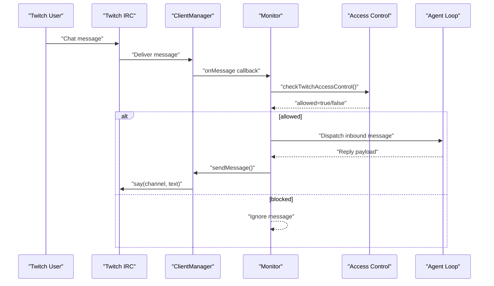

**Diagram sources**
- [extensions/twitch/src/monitor.ts:228-263](file://extensions/twitch/src/monitor.ts#L228-L263)
- [extensions/twitch/src/access-control.ts:34-173](file://extensions/twitch/src/access-control.ts#L34-L173)
- [extensions/twitch/src/twitch-client.ts:235-261](file://extensions/twitch/src/twitch-client.ts#L235-L261)

**Section sources**
- [extensions/twitch/src/monitor.ts:192-274](file://extensions/twitch/src/monitor.ts#L192-L274)
- [extensions/twitch/src/access-control.ts:34-173](file://extensions/twitch/src/access-control.ts#L34-L173)
- [extensions/twitch/src/twitch-client.ts:235-261](file://extensions/twitch/src/twitch-client.ts#L235-L261)

## Detailed Component Analysis

### Twitch Client Manager
Responsibilities:
- Create or reuse a ChatClient per account.
- Build StaticAuthProvider or RefreshingAuthProvider depending on configuration.
- Connect, log, and route incoming messages.
- Send messages and manage disconnection.

Key behaviors:
- Uses normalized tokens and logs refresh events when RefreshingAuthProvider is used.
- Emits debug logs for inbound messages with previews.
- Exposes onMessage handler registration and sendMessage wrapper.

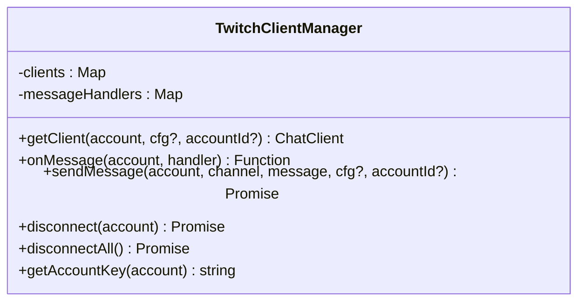

**Diagram sources**
- [extensions/twitch/src/twitch-client.ts:11-278](file://extensions/twitch/src/twitch-client.ts#L11-L278)

**Section sources**
- [extensions/twitch/src/twitch-client.ts:11-278](file://extensions/twitch/src/twitch-client.ts#L11-L278)

### Authentication and Token Resolution
- Supports config-based tokens and environment variables (default account only).
- Normalizes tokens by stripping or adding the “oauth:” prefix.
- Merges base-level and per-account configuration for the default account.

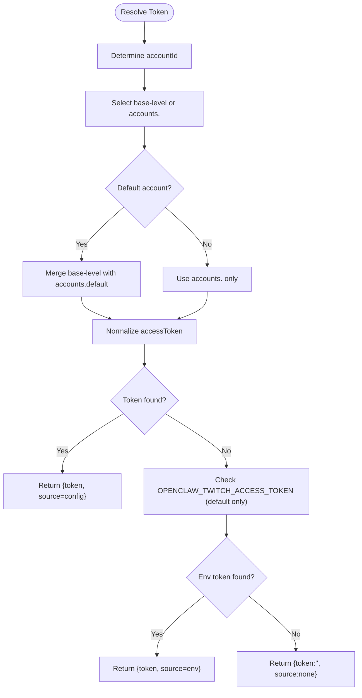

**Diagram sources**
- [extensions/twitch/src/token.ts:54-95](file://extensions/twitch/src/token.ts#L54-L95)

**Section sources**
- [extensions/twitch/src/token.ts:54-95](file://extensions/twitch/src/token.ts#L54-L95)

### Access Control and Mention Handling
- requireMention: If true, message must mention the bot username.
- allowFrom: Hard allowlist by Twitch user ID (recommended).
- allowedRoles: Role-based access (moderator, owner, VIP, subscriber, all).
- Mentions are extracted and compared case-insensitively.

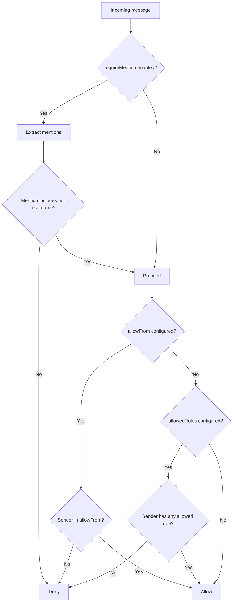

**Diagram sources**
- [extensions/twitch/src/access-control.ts:34-173](file://extensions/twitch/src/access-control.ts#L34-L173)

**Section sources**
- [extensions/twitch/src/access-control.ts:34-173](file://extensions/twitch/src/access-control.ts#L34-L173)

### Outbound Messaging and Target Resolution
- Enforces a 500-character limit per message with word-boundary chunking and markdown stripping.
- Validates targets and supports allowlists for implicit/heartbeat modes.
- Sends via the client manager; returns a generated message ID for tracking.

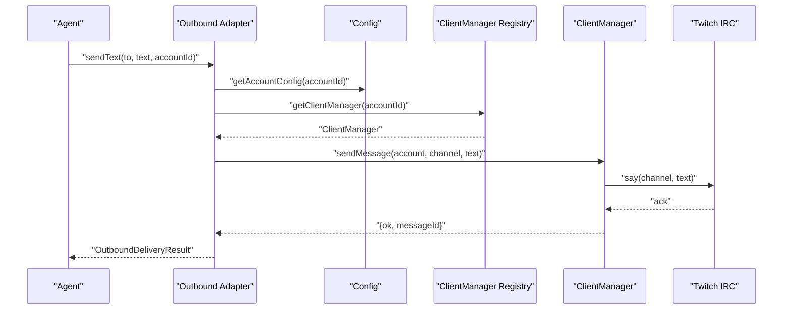

**Diagram sources**
- [extensions/twitch/src/outbound.ts:108-149](file://extensions/twitch/src/outbound.ts#L108-L149)
- [extensions/twitch/src/send.ts:51-137](file://extensions/twitch/src/send.ts#L51-L137)
- [extensions/twitch/src/client-manager-registry.ts:38-57](file://extensions/twitch/src/client-manager-registry.ts#L38-L57)
- [extensions/twitch/src/twitch-client.ts:235-261](file://extensions/twitch/src/twitch-client.ts#L235-L261)

**Section sources**
- [extensions/twitch/src/outbound.ts:24-188](file://extensions/twitch/src/outbound.ts#L24-L188)
- [extensions/twitch/src/send.ts:51-137](file://extensions/twitch/src/send.ts#L51-L137)

### Tool Actions (External Integration)
- Supports the “send” action to post messages to a channel.
- Validates parameters and delegates to the outbound adapter.

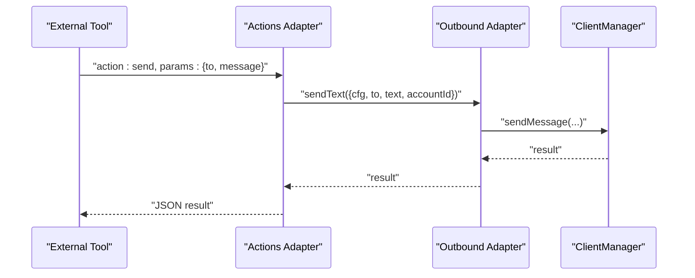

**Diagram sources**
- [extensions/twitch/src/actions.ts:123-173](file://extensions/twitch/src/actions.ts#L123-L173)
- [extensions/twitch/src/outbound.ts:108-149](file://extensions/twitch/src/outbound.ts#L108-L149)
- [extensions/twitch/src/twitch-client.ts:235-261](file://extensions/twitch/src/twitch-client.ts#L235-L261)

**Section sources**
- [extensions/twitch/src/actions.ts:67-175](file://extensions/twitch/src/actions.ts#L67-L175)

### Resolver (Username/User ID Resolution)
- Resolves usernames or user IDs via the Twitch Helix API using a StaticAuthProvider.
- Handles both numeric user IDs and usernames, returning normalized results.

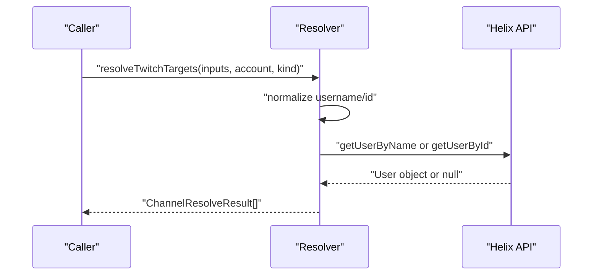

**Diagram sources**
- [extensions/twitch/src/resolver.ts:46-138](file://extensions/twitch/src/resolver.ts#L46-L138)

**Section sources**
- [extensions/twitch/src/resolver.ts:46-138](file://extensions/twitch/src/resolver.ts#L46-L138)

### Probing and Status Monitoring
- probeTwitch: Attempts a short-lived connection to verify credentials and reach the chat server.
- collectTwitchStatusIssues: Detects configuration problems, runtime errors, and suggests fixes.

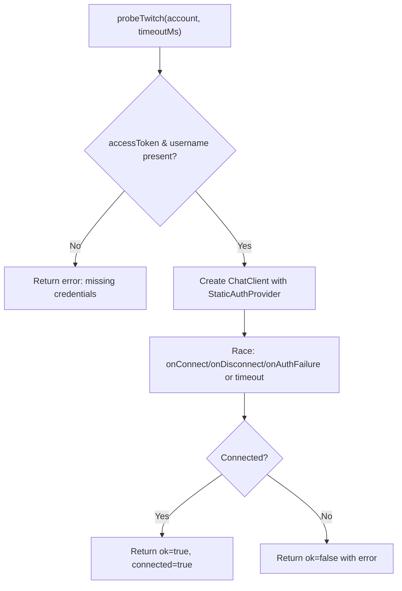

**Diagram sources**
- [extensions/twitch/src/probe.ts:23-120](file://extensions/twitch/src/probe.ts#L23-L120)

**Section sources**
- [extensions/twitch/src/probe.ts:23-120](file://extensions/twitch/src/probe.ts#L23-L120)
- [extensions/twitch/src/status.ts:30-180](file://extensions/twitch/src/status.ts#L30-L180)

### Data Models
Representative types used across the integration.

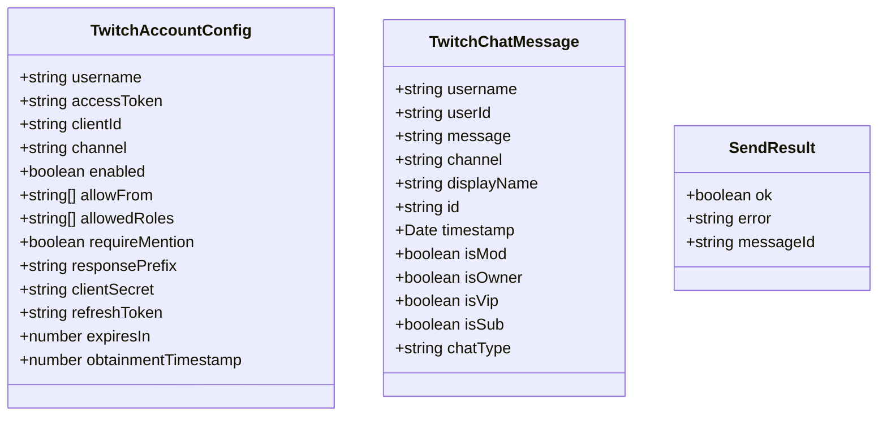

**Diagram sources**
- [extensions/twitch/src/types.ts:39-142](file://extensions/twitch/src/types.ts#L39-L142)

**Section sources**
- [extensions/twitch/src/types.ts:39-142](file://extensions/twitch/src/types.ts#L39-L142)

## Dependency Analysis
- External libraries: @twurple/chat, @twurple/auth, @twurple/api.
- Internal dependencies: client-manager-registry, token resolution, access control, outbound adapter, resolver, probe, monitor, utilities.

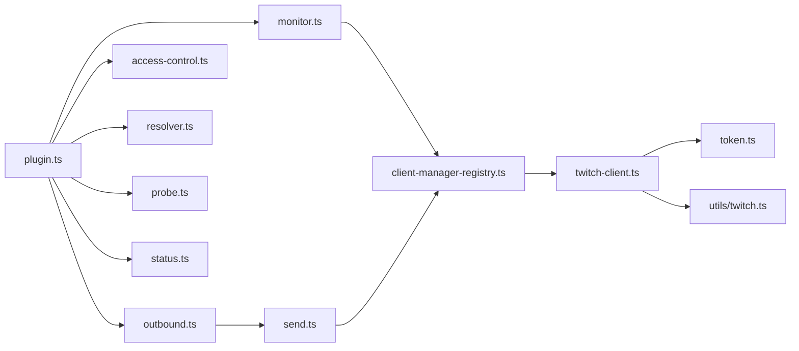

**Diagram sources**
- [extensions/twitch/src/plugin.ts:40-270](file://extensions/twitch/src/plugin.ts#L40-L270)
- [extensions/twitch/src/monitor.ts:192-274](file://extensions/twitch/src/monitor.ts#L192-L274)
- [extensions/twitch/src/client-manager-registry.ts:38-87](file://extensions/twitch/src/client-manager-registry.ts#L38-L87)
- [extensions/twitch/src/twitch-client.ts:11-278](file://extensions/twitch/src/twitch-client.ts#L11-L278)
- [extensions/twitch/src/token.ts:54-95](file://extensions/twitch/src/token.ts#L54-L95)
- [extensions/twitch/src/utils/twitch.ts:20-81](file://extensions/twitch/src/utils/twitch.ts#L20-L81)
- [extensions/twitch/src/outbound.ts:24-188](file://extensions/twitch/src/outbound.ts#L24-L188)
- [extensions/twitch/src/send.ts:51-137](file://extensions/twitch/src/send.ts#L51-L137)
- [extensions/twitch/src/access-control.ts:34-173](file://extensions/twitch/src/access-control.ts#L34-L173)
- [extensions/twitch/src/resolver.ts:46-138](file://extensions/twitch/src/resolver.ts#L46-L138)
- [extensions/twitch/src/probe.ts:23-120](file://extensions/twitch/src/probe.ts#L23-L120)
- [extensions/twitch/src/status.ts:30-180](file://extensions/twitch/src/status.ts#L30-L180)

**Section sources**
- [extensions/twitch/src/plugin.ts:40-270](file://extensions/twitch/src/plugin.ts#L40-L270)
- [extensions/twitch/src/twitch-client.ts:11-278](file://extensions/twitch/src/twitch-client.ts#L11-L278)
- [extensions/twitch/src/token.ts:54-95](file://extensions/twitch/src/token.ts#L54-L95)
- [extensions/twitch/src/access-control.ts:34-173](file://extensions/twitch/src/access-control.ts#L34-L173)
- [extensions/twitch/src/outbound.ts:24-188](file://extensions/twitch/src/outbound.ts#L24-L188)
- [extensions/twitch/src/send.ts:51-137](file://extensions/twitch/src/send.ts#L51-L137)
- [extensions/twitch/src/status.ts:30-180](file://extensions/twitch/src/status.ts#L30-L180)
- [extensions/twitch/src/utils/twitch.ts:20-81](file://extensions/twitch/src/utils/twitch.ts#L20-L81)
- [extensions/twitch/src/client-manager-registry.ts:38-87](file://extensions/twitch/src/client-manager-registry.ts#L38-L87)
- [extensions/twitch/src/actions.ts:67-175](file://extensions/twitch/src/actions.ts#L67-L175)
- [extensions/twitch/src/resolver.ts:46-138](file://extensions/twitch/src/resolver.ts#L46-L138)
- [extensions/twitch/src/probe.ts:23-120](file://extensions/twitch/src/probe.ts#L23-L120)
- [extensions/twitch/src/monitor.ts:192-274](file://extensions/twitch/src/monitor.ts#L192-L274)
- [extensions/twitch/src/types.ts:39-142](file://extensions/twitch/src/types.ts#L39-L142)

## Performance Considerations
- Message size: 500 characters per message with word-boundary chunking and markdown stripping.
- Rate limiting: Relies on Twitch’s built-in rate limits; the underlying client handles throttling.
- Connection stability: Reconnect on failures and rejoin channels on reconnect; periodic restart recommended for long-running sessions.
- Logging: Client logs are mapped to the channel logger; adjust verbosity as needed.
- Throughput: Monitor lastInboundAt/lastOutboundAt to detect stalls; consider restarting connections if idle for extended periods.

[No sources needed since this section provides general guidance]

## Troubleshooting Guide
Common issues and resolutions:
- Bot does not respond:
  - Verify allowFrom or allowedRoles configuration.
  - Confirm the bot joined the correct channel.
- Authentication errors:
  - Ensure accessToken has required scopes and is properly prefixed.
  - For automatic refresh, confirm clientSecret and refreshToken are set.
- Token refresh not working:
  - Check logs for refresh events; ensure refresh token is provided when clientSecret is present.
- Diagnostics:
  - Use the built-in status probes and doctor commands to inspect configuration and runtime state.

**Section sources**
- [docs/channels/twitch.md:249-380](file://docs/channels/twitch.md#L249-L380)
- [extensions/twitch/src/status.ts:30-180](file://extensions/twitch/src/status.ts#L30-L180)
- [extensions/twitch/src/probe.ts:23-120](file://extensions/twitch/src/probe.ts#L23-L120)

## Conclusion
The Twitch integration provides a robust, modular foundation for building streaming community features. It handles authentication, access control, message routing, outbound delivery, and operational visibility. By following the setup and best practices outlined here, operators can deploy reliable, scalable chat experiences on Twitch.

[No sources needed since this section summarizes without analyzing specific files]

## Appendices

### Setup Procedures
- Install the plugin and configure credentials:
  - Use the documented minimal configuration and environment variables.
  - Generate tokens with required scopes and configure clientId and accessToken.
- Configure access control:
  - Prefer allowFrom with user IDs for security.
  - Optionally restrict by roles or disable mention requirement.
- Multi-account and multi-channel:
  - Use accounts.<name> to define multiple bot accounts and channels.

**Section sources**
- [docs/channels/twitch.md:30-380](file://docs/channels/twitch.md#L30-L380)

### Configuration Reference
- Account-level fields: username, accessToken, clientId, channel, enabled, clientSecret, refreshToken, expiresIn, obtainmentTimestamp, allowFrom, allowedRoles, requireMention, responsePrefix.
- Provider options: top-level toggles and simplified single-account fields.

**Section sources**
- [docs/channels/twitch.md:287-346](file://docs/channels/twitch.md#L287-L346)
- [extensions/twitch/src/types.ts:39-142](file://extensions/twitch/src/types.ts#L39-L142)

### Operational Notes
- Limits: 500-character messages with automatic chunking; no additional rate limiting enforced.
- Safety: Treat tokens as secrets; use refresh tokens for long-running deployments.
- Monitoring: Watch logs for token refresh events and connection status.

**Section sources**
- [docs/channels/twitch.md:375-380](file://docs/channels/twitch.md#L375-L380)
- [extensions/twitch/src/twitch-client.ts:52-60](file://extensions/twitch/src/twitch-client.ts#L52-L60)