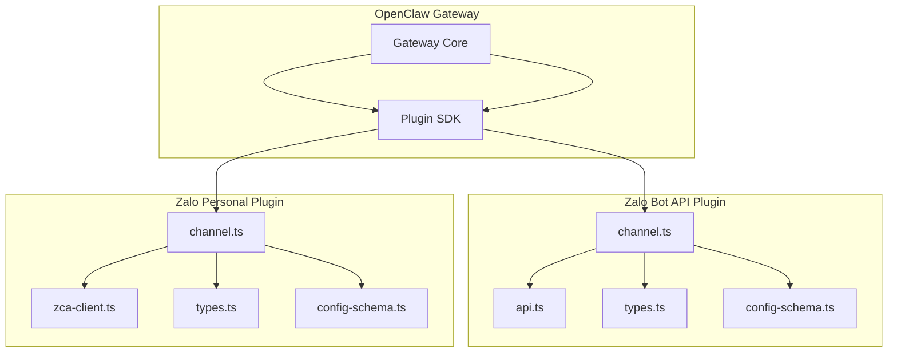
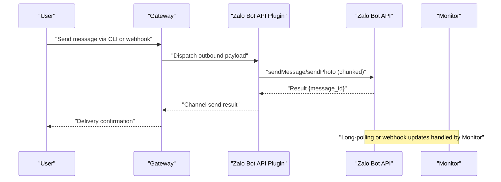
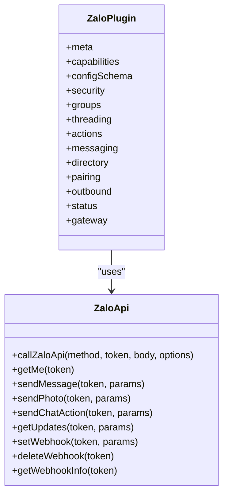
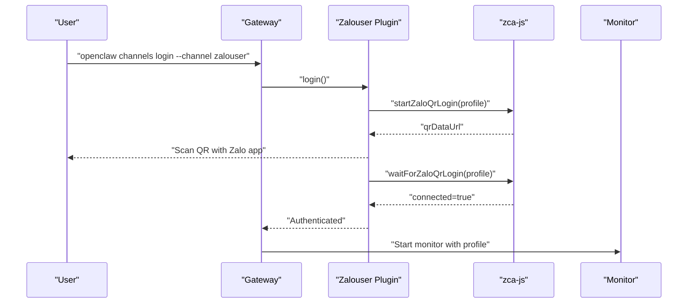
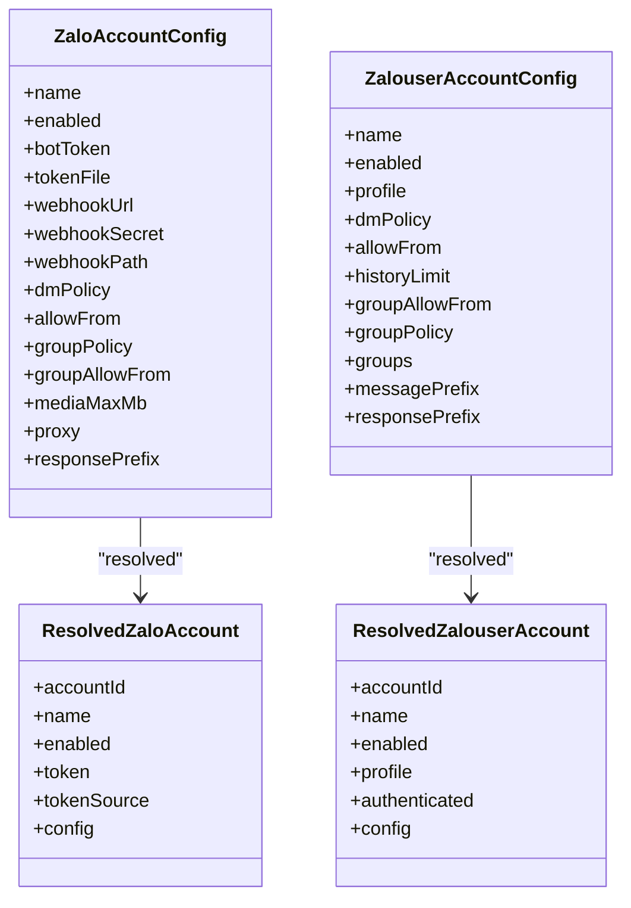
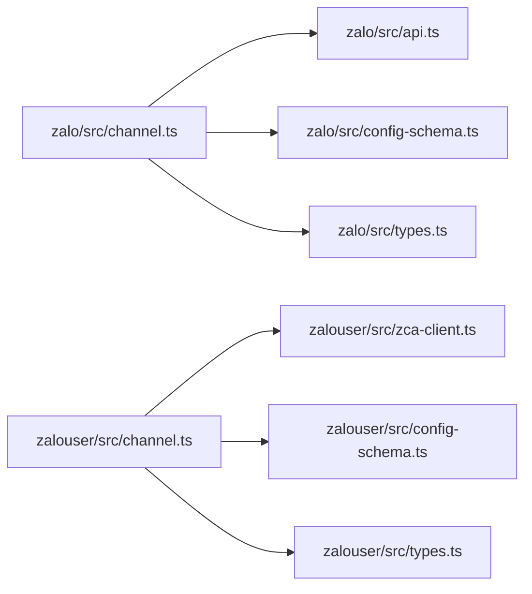

# Zalo Integration

<cite>
**Referenced Files in This Document**
- [docs/channels/zalo.md](file://docs/channels/zalo.md)
- [docs/channels/zalouser.md](file://docs/channels/zalouser.md)
- [extensions/zalo/src/channel.ts](file://extensions/zalo/src/channel.ts)
- [extensions/zalo/src/api.ts](file://extensions/zalo/src/api.ts)
- [extensions/zalo/src/types.ts](file://extensions/zalo/src/types.ts)
- [extensions/zalo/src/config-schema.ts](file://extensions/zalo/src/config-schema.ts)
- [extensions/zalouser/src/channel.ts](file://extensions/zalouser/src/channel.ts)
- [extensions/zalouser/src/zca-client.ts](file://extensions/zalouser/src/zca-client.ts)
- [extensions/zalouser/src/types.ts](file://extensions/zalouser/src/types.ts)
- [extensions/zalouser/src/config-schema.ts](file://extensions/zalouser/src/config-schema.ts)
</cite>

## Table of Contents
1. [Introduction](#introduction)
2. [Project Structure](#project-structure)
3. [Core Components](#core-components)
4. [Architecture Overview](#architecture-overview)
5. [Detailed Component Analysis](#detailed-component-analysis)
6. [Dependency Analysis](#dependency-analysis)
7. [Performance Considerations](#performance-considerations)
8. [Troubleshooting Guide](#troubleshooting-guide)
9. [Conclusion](#conclusion)
10. [Appendices](#appendices)

## Introduction
This document explains the Zalo integration for the OpenClaw platform, focusing on Vietnamese market messaging. It covers two complementary integrations:
- Zalo Bot API (official Bot Creator/Marketplace bots): official channel for deterministic 1:1 bot messaging with long-polling or webhook modes.
- Zalo Personal (unofficial): automated personal Zalo account via QR login, enabling broader group and media features.

The guide documents configuration, authentication, message handling, media sharing, access control, rate limiting, and operational best practices tailored for the Vietnamese market.

## Project Structure
The Zalo integrations are implemented as plugins under the extensions directory:
- Zalo Bot API plugin: extensions/zalo
- Zalo Personal plugin: extensions/zalouser
Documentation pages for both are located under docs/channels.

**Diagram sources**
- [extensions/zalo/src/channel.ts:1-334](file://extensions/zalo/src/channel.ts#L1-L334)
- [extensions/zalo/src/api.ts:1-239](file://extensions/zalo/src/api.ts#L1-L239)
- [extensions/zalo/src/types.ts:1-51](file://extensions/zalo/src/types.ts#L1-L51)
- [extensions/zalo/src/config-schema.ts:1-30](file://extensions/zalo/src/config-schema.ts#L1-L30)
- [extensions/zalouser/src/channel.ts:1-696](file://extensions/zalouser/src/channel.ts#L1-L696)
- [extensions/zalouser/src/zca-client.ts:1-296](file://extensions/zalouser/src/zca-client.ts#L1-L296)
- [extensions/zalouser/src/types.ts:1-126](file://extensions/zalouser/src/types.ts#L1-L126)
- [extensions/zalouser/src/config-schema.ts:1-34](file://extensions/zalouser/src/config-schema.ts#L1-L34)

**Section sources**
- [docs/channels/zalo.md:1-244](file://docs/channels/zalo.md#L1-L244)
- [docs/channels/zalouser.md:1-182](file://docs/channels/zalouser.md#L1-L182)

## Core Components
- Zalo Bot API plugin
  - Provides channel metadata, capabilities, configuration schema, security policies, directory helpers, pairing, outbound messaging, and lifecycle management.
  - Implements long-polling and webhook modes, with token-based authentication and rate-limit-aware handling.
- Zalo Personal plugin
  - Provides QR login, native event listeners, outbound sending (text/media/link), group policy enforcement, reactions, and directory resolution.
  - Operates entirely in-process via zca-js, supporting personal account automation.

Key configuration surfaces:
- Zalo Bot API: channels.zalo.accounts.<id>.*
- Zalo Personal: channels.zalouser.accounts.<id>.*

**Section sources**
- [extensions/zalo/src/channel.ts:47-334](file://extensions/zalo/src/channel.ts#L47-L334)
- [extensions/zalouser/src/channel.ts:58-696](file://extensions/zalouser/src/channel.ts#L58-L696)

## Architecture Overview
Two distinct integration modes operate within the OpenClaw plugin framework:
- Official Bot API mode: deterministic routing, long-polling or webhook, token-based authentication, and strict outbound chunking.
- Personal account mode: QR login, native event listeners, flexible group policies, and rich media/text styles.

**Diagram sources**
- [extensions/zalo/src/channel.ts:224-253](file://extensions/zalo/src/channel.ts#L224-L253)
- [extensions/zalo/src/api.ts:156-173](file://extensions/zalo/src/api.ts#L156-L173)

**Section sources**
- [extensions/zalo/src/channel.ts:285-331](file://extensions/zalo/src/channel.ts#L285-L331)
- [extensions/zalo/src/api.ts:194-203](file://extensions/zalo/src/api.ts#L194-L203)

## Detailed Component Analysis

### Zalo Bot API Plugin
- Channel metadata and capabilities
  - Supports direct and group chats, media, blocks streaming, enforces 2000-character text chunking.
- Security and access control
  - DM policy: pairing, allowlist, open, disabled.
  - Group policy: open, allowlist, disabled; sender allowlists apply to both DM and group contexts.
- Outbound messaging
  - Text chunking and media sending via unified payload pipeline.
  - Target normalization strips channel prefixes.
- Lifecycle and monitoring
  - Probes bot identity before start; starts monitor with either long-polling or webhook mode.
  - Status summary includes token source, mode, and DM policy.

**Diagram sources**
- [extensions/zalo/src/channel.ts:89-334](file://extensions/zalo/src/channel.ts#L89-L334)
- [extensions/zalo/src/api.ts:101-239](file://extensions/zalo/src/api.ts#L101-L239)

**Section sources**
- [extensions/zalo/src/channel.ts:67-87](file://extensions/zalo/src/channel.ts#L67-L87)
- [extensions/zalo/src/channel.ts:137-185](file://extensions/zalo/src/channel.ts#L137-L185)
- [extensions/zalo/src/channel.ts:186-192](file://extensions/zalo/src/channel.ts#L186-L192)
- [extensions/zalo/src/channel.ts:193-253](file://extensions/zalo/src/channel.ts#L193-L253)
- [extensions/zalo/src/channel.ts:254-331](file://extensions/zalo/src/channel.ts#L254-L331)

### Zalo Personal Plugin
- Authentication
  - QR login flow: start QR generation, persist QR image, wait for scan and connection.
  - Profile-based multi-account support; checks authentication status per profile.
- Messaging and media
  - Parses explicit targets (user:, group:) or numeric IDs; supports markdown chunking and media uploads.
  - Reactions supported via message action adapter.
- Directory and group policy
  - Lists friends and groups; resolves group entries by ID/name/wildcard; enforces mention gating and tool policies.
- Lifecycle
  - Starts monitor with account context; exposes login/logout helpers.

**Diagram sources**
- [extensions/zalouser/src/channel.ts:542-575](file://extensions/zalouser/src/channel.ts#L542-L575)
- [extensions/zalouser/src/zca-client.ts:287-296](file://extensions/zalouser/src/zca-client.ts#L287-L296)

**Section sources**
- [extensions/zalouser/src/channel.ts:58-696](file://extensions/zalouser/src/channel.ts#L58-L696)
- [extensions/zalouser/src/zca-client.ts:1-296](file://extensions/zalouser/src/zca-client.ts#L1-L296)

### API and Data Models
- Zalo Bot API client
  - Base URL and typed responses; error wrapper with polling timeout detection.
  - Methods for bot info, text/photo sending, chat actions, long-polling, and webhook management.
- Zalo Personal client
  - Typed wrappers around zca-js: thread types, login QR events, reactions, message/event structures, and API surface for sending, uploading, reactions, and delivery events.

**Diagram sources**
- [extensions/zalo/src/types.ts:3-51](file://extensions/zalo/src/types.ts#L3-L51)
- [extensions/zalouser/src/types.ts:118-126](file://extensions/zalouser/src/types.ts#L118-L126)

**Section sources**
- [extensions/zalo/src/api.ts:1-239](file://extensions/zalo/src/api.ts#L1-L239)
- [extensions/zalo/src/types.ts:1-51](file://extensions/zalo/src/types.ts#L1-L51)
- [extensions/zalouser/src/zca-client.ts:1-296](file://extensions/zalouser/src/zca-client.ts#L1-L296)
- [extensions/zalouser/src/types.ts:1-126](file://extensions/zalouser/src/types.ts#L1-L126)

## Dependency Analysis
- Zalo Bot API plugin depends on:
  - Plugin SDK for configuration schema, status snapshots, and helper utilities.
  - Zalo API client for HTTP calls and typed responses.
  - Monitor module for long-polling/webhook orchestration.
- Zalo Personal plugin depends on:
  - Plugin SDK for configuration and runtime helpers.
  - zca-js for native login, event listening, and message sending.
  - Monitor module for runtime orchestration.

**Diagram sources**
- [extensions/zalo/src/channel.ts:1-334](file://extensions/zalo/src/channel.ts#L1-L334)
- [extensions/zalo/src/api.ts:1-239](file://extensions/zalo/src/api.ts#L1-L239)
- [extensions/zalo/src/config-schema.ts:1-30](file://extensions/zalo/src/config-schema.ts#L1-L30)
- [extensions/zalo/src/types.ts:1-51](file://extensions/zalo/src/types.ts#L1-L51)
- [extensions/zalouser/src/channel.ts:1-696](file://extensions/zalouser/src/channel.ts#L1-L696)
- [extensions/zalouser/src/zca-client.ts:1-296](file://extensions/zalouser/src/zca-client.ts#L1-L296)
- [extensions/zalouser/src/config-schema.ts:1-34](file://extensions/zalouser/src/config-schema.ts#L1-L34)
- [extensions/zalouser/src/types.ts:1-126](file://extensions/zalouser/src/types.ts#L1-L126)

**Section sources**
- [extensions/zalo/src/channel.ts:1-46](file://extensions/zalo/src/channel.ts#L1-L46)
- [extensions/zalouser/src/channel.ts:1-57](file://extensions/zalouser/src/channel.ts#L1-L57)

## Performance Considerations
- Outbound text chunking
  - Zalo Bot API enforces 2000-character chunks; Zalo Personal enforces ~2000-character limits and blocks streaming.
- Media handling
  - Media size capped by configuration; uploads/downloads constrained by limits.
- Long-polling vs webhook
  - Long-polling is simpler but webhook reduces latency and avoids mutual exclusivity with polling.
- Rate limiting
  - Webhook endpoints may return HTTP 429 under burst traffic; implement retries with backoff.

**Section sources**
- [docs/channels/zalo.md:106-111](file://docs/channels/zalo.md#L106-L111)
- [docs/channels/zalo.md:142-154](file://docs/channels/zalo.md#L142-L154)
- [extensions/zalo/src/channel.ts:74-74](file://extensions/zalo/src/channel.ts#L74-L74)
- [extensions/zalouser/src/channel.ts:314-314](file://extensions/zalouser/src/channel.ts#L314-L314)

## Troubleshooting Guide
Common issues and remedies:
- Bot does not respond
  - Verify token validity and sender approval; check gateway logs.
- Webhook not receiving events
  - Ensure HTTPS URL, correct secret length, and that polling is not running concurrently.
- Personal account login not sticking
  - Probe status and re-run login; remove outdated external assumptions.
- Allowlist/group name resolution
  - Use numeric IDs or exact names; enable dangerous name matching only when necessary.

Operational references:
- Zalo Bot API troubleshooting and configuration reference.
- Zalo Personal troubleshooting and multi-account guidance.

**Section sources**
- [docs/channels/zalo.md:194-208](file://docs/channels/zalo.md#L194-L208)
- [docs/channels/zalouser.md:167-182](file://docs/channels/zalouser.md#L167-L182)

## Conclusion
The Zalo integrations provide robust, production-ready capabilities for Vietnamese market messaging:
- Zalo Bot API offers deterministic 1:1 bot messaging with long-polling or webhook modes and strict access control.
- Zalo Personal enables broad personal account automation, including QR login, group policies, reactions, and rich media/text.

Adopt the recommended configurations, monitor status, and follow best practices to ensure reliable deployments in the Vietnamese market.

## Appendices

### Setup Procedures
- Zalo Bot API
  - Install plugin, create bot token on Zalo Bot Platform, configure token via environment or config, restart gateway, approve pairing for DMs.
- Zalo Personal
  - Install plugin, run QR login on gateway host, enable channel, configure DM/group policies, restart gateway.

**Section sources**
- [docs/channels/zalo.md:20-98](file://docs/channels/zalo.md#L20-L98)
- [docs/channels/zalouser.md:25-46](file://docs/channels/zalouser.md#L25-L46)

### Authentication and Access Control
- Zalo Bot API
  - Token-based authentication; DM policy defaults to pairing; group policy defaults to allowlist when groups are unavailable.
- Zalo Personal
  - QR login; DM policy supports pairing/allowlist/open/disabled; group policy supports allowlist and mention gating.

**Section sources**
- [extensions/zalo/src/channel.ts:137-185](file://extensions/zalo/src/channel.ts#L137-L185)
- [extensions/zalouser/src/channel.ts:387-400](file://extensions/zalouser/src/channel.ts#L387-L400)

### Message Handling and Media Sharing
- Zalo Bot API
  - Text chunking to 2000 characters; media uploads via unified payload; outbound delivery mode is direct.
- Zalo Personal
  - Markdown chunking; media uploads; reactions supported; mentions enforced per group policy.

**Section sources**
- [extensions/zalo/src/channel.ts:224-253](file://extensions/zalo/src/channel.ts#L224-L253)
- [extensions/zalouser/src/channel.ts:576-613](file://extensions/zalouser/src/channel.ts#L576-L613)

### Configuration Reference
- Zalo Bot API
  - Provider options: enabled, botToken/tokenFile, dmPolicy, allowFrom, groupPolicy/groupAllowFrom, mediaMaxMb, webhookUrl/webhookSecret/webhookPath, proxy.
  - Multi-account options mirror provider options under accounts.<id>.
- Zalo Personal
  - Provider options: enabled, profile, dmPolicy, allowFrom, historyLimit, groupPolicy/groupAllowFrom/groups, messagePrefix/responsePrefix.
  - Multi-account options mirror provider options under accounts.<id>.

**Section sources**
- [docs/channels/zalo.md:209-244](file://docs/channels/zalo.md#L209-L244)
- [docs/channels/zalouser.md:99-157](file://docs/channels/zalouser.md#L99-L157)

### Rate Limiting and Webhook Verification
- Webhook verification
  - Zalo verifies requests with X-Bot-Api-Secret-Token; duplicates within a short window are ignored.
- Burst traffic
  - Per-path/source rate limiting may return HTTP 429; implement retry with exponential backoff.

**Section sources**
- [docs/channels/zalo.md:142-154](file://docs/channels/zalo.md#L142-L154)

### Vietnamese Market Considerations
- Language and formatting
  - Zalo Personal supports rich text styles and markdown chunking suitable for Vietnamese text.
- Cultural features
  - Mention gating in groups aligns with typical Vietnamese group communication norms.
- Regional messaging patterns
  - Pairing-based DM access and allowlists provide appropriate privacy controls for customer service and notifications.

**Section sources**
- [extensions/zalouser/src/zca-client.ts:35-49](file://extensions/zalouser/src/zca-client.ts#L35-L49)
- [extensions/zalouser/src/channel.ts:401-404](file://extensions/zalouser/src/channel.ts#L401-L404)

### Zalo Ecosystem Integration
- ZaloPay and other services
  - The Zalo Bot API focuses on messaging; ecosystem integrations (e.g., ZaloPay) are outside the scope of this plugin and would require separate implementations aligned with Zalo’s official APIs.

**Section sources**
- [docs/channels/zalo.md:50-62](file://docs/channels/zalo.md#L50-L62)