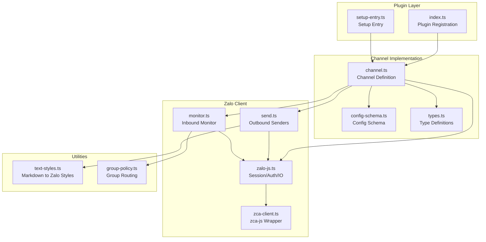
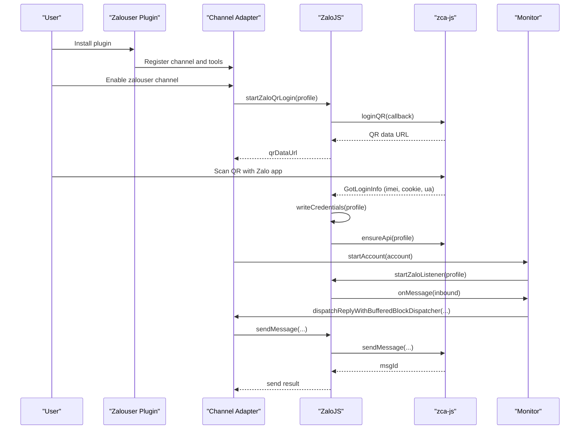
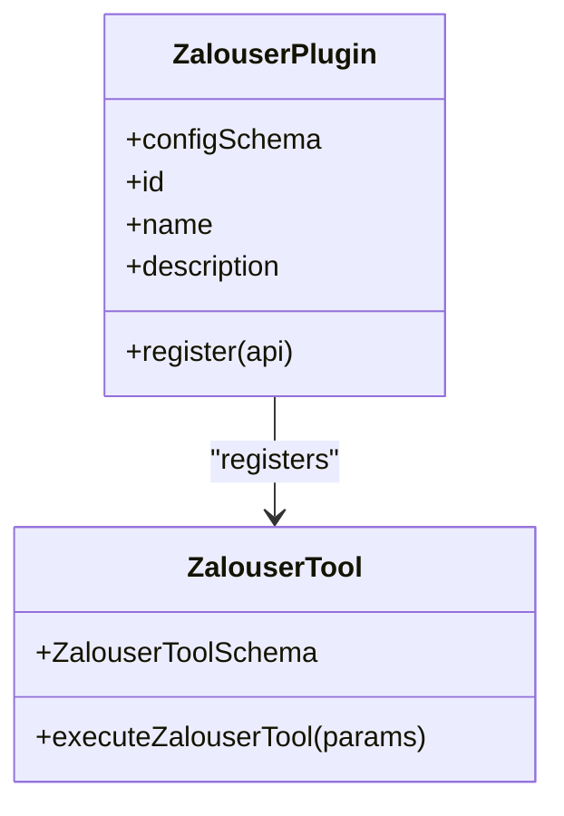
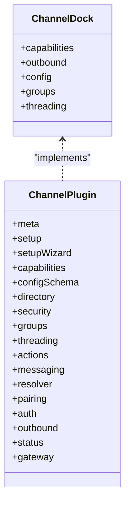
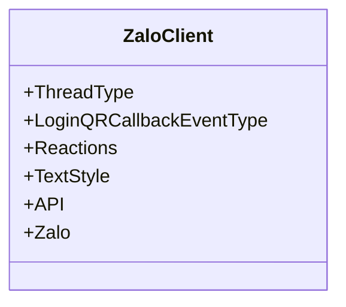
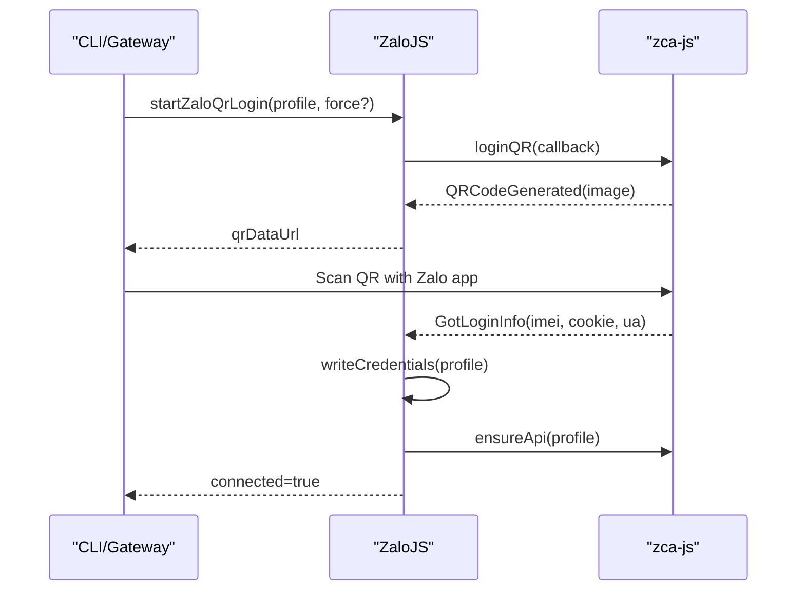
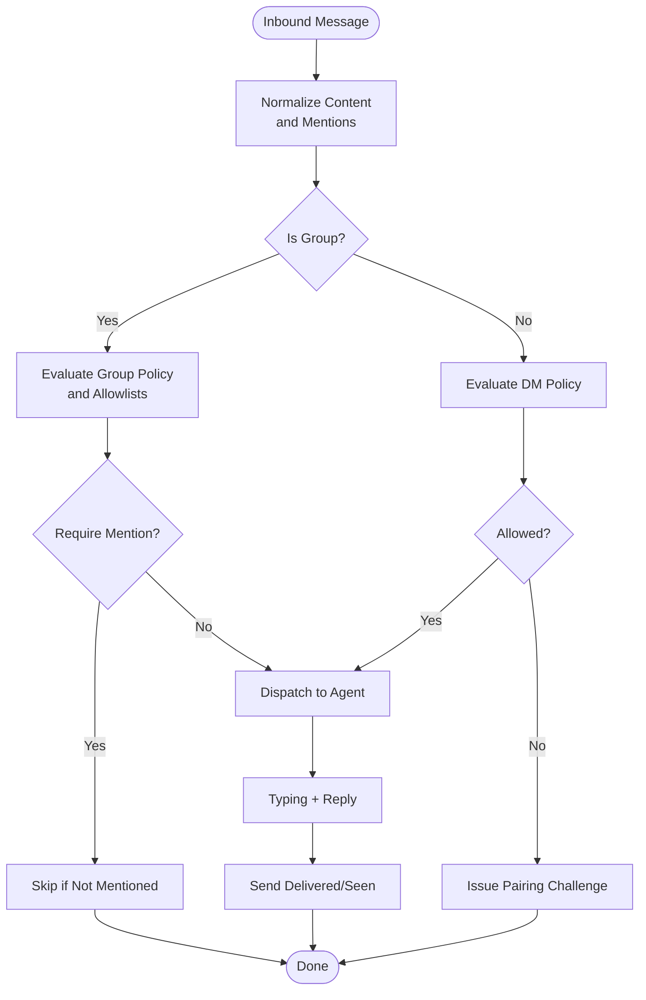
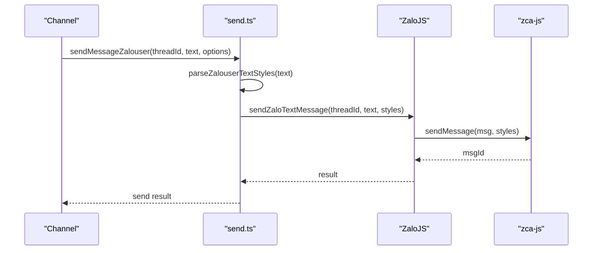
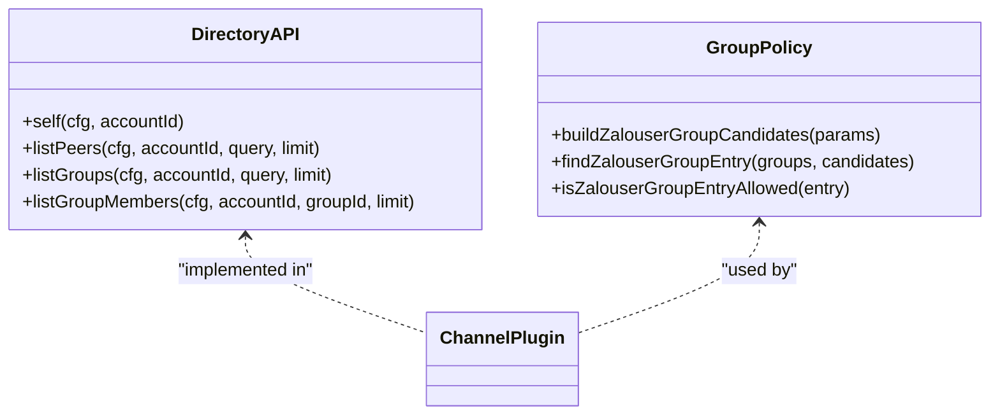
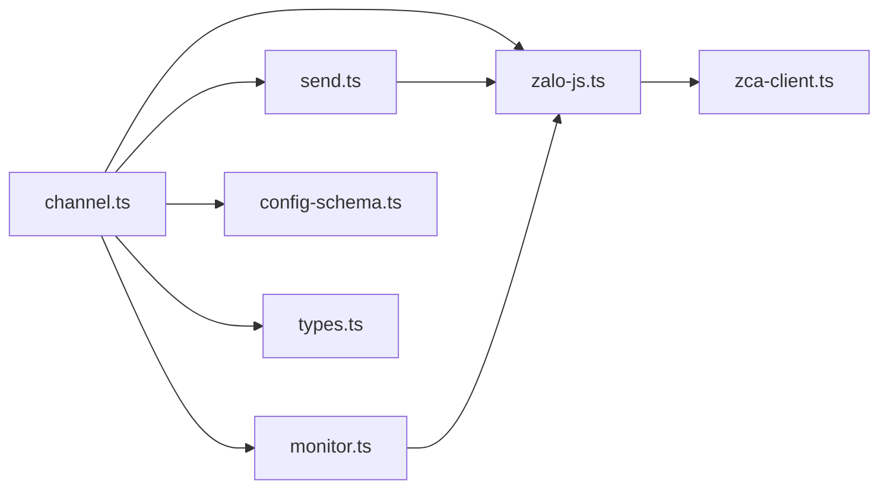

# ZaloUser Integration

<cite>
**Referenced Files in This Document**
- [index.ts](file://extensions/zalouser/index.ts)
- [setup-entry.ts](file://extensions/zalouser/setup-entry.ts)
- [channel.ts](file://extensions/zalouser/src/channel.ts)
- [zca-client.ts](file://extensions/zalouser/src/zca-client.ts)
- [zalo-js.ts](file://extensions/zalouser/src/zalo-js.ts)
- [send.ts](file://extensions/zalouser/src/send.ts)
- [monitor.ts](file://extensions/zalouser/src/monitor.ts)
- [config-schema.ts](file://extensions/zalouser/src/config-schema.ts)
- [types.ts](file://extensions/zalouser/src/types.ts)
- [text-styles.ts](file://extensions/zalouser/src/text-styles.ts)
- [group-policy.ts](file://extensions/zalouser/src/group-policy.ts)
- [package.json](file://extensions/zalouser/package.json)
- [zalouser.md](file://docs/channels/zalouser.md)
</cite>

## Table of Contents
1. [Introduction](#introduction)
2. [Project Structure](#project-structure)
3. [Core Components](#core-components)
4. [Architecture Overview](#architecture-overview)
5. [Detailed Component Analysis](#detailed-component-analysis)
6. [Dependency Analysis](#dependency-analysis)
7. [Performance Considerations](#performance-considerations)
8. [Troubleshooting Guide](#troubleshooting-guide)
9. [Conclusion](#conclusion)
10. [Appendices](#appendices)

## Introduction
This document explains the ZaloUser integration for OpenClaw, focusing on individual user messaging via the unofficial Zalo Personal channel. It covers the ZaloUser API client implementation, QR-based authentication, personal chat management, direct message handling, contact and group management, user profile integration, access control policies, and operational guidance. It also documents setup procedures, configuration options, and troubleshooting steps tailored to ZaloPersonal usage.

## Project Structure
The ZaloUser integration is implemented as an OpenClaw plugin under extensions/zalouser. The key elements include:
- Plugin registration and tool integration
- Channel definition and capabilities
- Zalo API client wrapper around zca-js
- Authentication and session management
- Message ingestion and outbound delivery
- Directory and group policy resolution
- Text styling and chunking utilities

**Diagram sources**
- [index.ts:1-33](file://extensions/zalouser/index.ts#L1-L33)
- [setup-entry.ts:1-6](file://extensions/zalouser/setup-entry.ts#L1-L6)
- [channel.ts:1-696](file://extensions/zalouser/src/channel.ts#L1-L696)
- [config-schema.ts:1-34](file://extensions/zalouser/src/config-schema.ts#L1-L34)
- [types.ts:1-126](file://extensions/zalouser/src/types.ts#L1-L126)
- [zca-client.ts:1-296](file://extensions/zalouser/src/zca-client.ts#L1-L296)
- [zalo-js.ts:1-1695](file://extensions/zalouser/src/zalo-js.ts#L1-L1695)
- [send.ts:1-273](file://extensions/zalouser/src/send.ts#L1-L273)
- [monitor.ts:1-991](file://extensions/zalouser/src/monitor.ts#L1-L991)
- [text-styles.ts:1-538](file://extensions/zalouser/src/text-styles.ts#L1-L538)
- [group-policy.ts:1-82](file://extensions/zalouser/src/group-policy.ts#L1-L82)

**Section sources**
- [index.ts:1-33](file://extensions/zalouser/index.ts#L1-L33)
- [setup-entry.ts:1-6](file://extensions/zalouser/setup-entry.ts#L1-L6)
- [channel.ts:1-696](file://extensions/zalouser/src/channel.ts#L1-L696)
- [config-schema.ts:1-34](file://extensions/zalouser/src/config-schema.ts#L1-L34)
- [types.ts:1-126](file://extensions/zalouser/src/types.ts#L1-L126)
- [zca-client.ts:1-296](file://extensions/zalouser/src/zca-client.ts#L1-L296)
- [zalo-js.ts:1-1695](file://extensions/zalouser/src/zalo-js.ts#L1-L1695)
- [send.ts:1-273](file://extensions/zalouser/src/send.ts#L1-L273)
- [monitor.ts:1-991](file://extensions/zalouser/src/monitor.ts#L1-L991)
- [text-styles.ts:1-538](file://extensions/zalouser/src/text-styles.ts#L1-L538)
- [group-policy.ts:1-82](file://extensions/zalouser/src/group-policy.ts#L1-L82)

## Core Components
- Plugin registration: Declares the zalouser channel, registers tools, and wires runtime integration.
- Channel definition: Exposes capabilities, directory APIs, security policies, and outbound handlers.
- Zalo client wrapper: Provides typed access to zca-js, including credentials storage, listener lifecycle, and message parsing.
- Authentication: QR login flow with state persistence and session restoration.
- Message processing: Inbound monitoring with grouping, mention gating, and session management; outbound chunking and media sending.
- Configuration: Multi-account support, allowlists, group policies, and markdown rendering options.

**Section sources**
- [index.ts:7-33](file://extensions/zalouser/index.ts#L7-L33)
- [channel.ts:330-696](file://extensions/zalouser/src/channel.ts#L330-L696)
- [zca-client.ts:1-296](file://extensions/zalouser/src/zca-client.ts#L1-L296)
- [zalo-js.ts:835-848](file://extensions/zalouser/src/zalo-js.ts#L835-L848)
- [monitor.ts:244-691](file://extensions/zalouser/src/monitor.ts#L244-L691)
- [config-schema.ts:17-34](file://extensions/zalouser/src/config-schema.ts#L17-L34)

## Architecture Overview
The integration runs entirely in-process using zca-js. It manages:
- Authentication state per profile
- Event-driven inbound message processing
- Outbound message chunking and media uploads
- Pairing and group access control
- Typing indicators and delivery/seen acknowledgements

**Diagram sources**
- [index.ts:12-29](file://extensions/zalouser/index.ts#L12-L29)
- [channel.ts:542-575](file://extensions/zalouser/src/channel.ts#L542-L575)
- [zalo-js.ts:1253-1463](file://extensions/zalouser/src/zalo-js.ts#L1253-L1463)
- [monitor.ts:753-751](file://extensions/zalouser/src/monitor.ts#L753-L751)
- [send.ts:26-63](file://extensions/zalouser/src/send.ts#L26-L63)

## Detailed Component Analysis

### Plugin Registration and Tool Integration
- Registers the zalouser channel and dock, sets runtime, and exposes a tool for messaging and directory queries.
- Tool supports actions: send, image, link, friends, groups, me, status.

**Diagram sources**
- [index.ts:7-33](file://extensions/zalouser/index.ts#L7-L33)
- [tool.ts:58-149](file://extensions/zalouser/src/tool.ts#L58-L149)

**Section sources**
- [index.ts:7-33](file://extensions/zalouser/index.ts#L7-L33)
- [tool.ts:58-149](file://extensions/zalouser/src/tool.ts#L58-L149)

### Channel Definition and Capabilities
- Defines channel capabilities: direct and group chats, media, reactions, and streaming blocking.
- Implements directory APIs for self, peers, groups, and group members.
- Provides security policies for DMs and groups, including allowlists and mention gating.
- Handles outbound chunking and media uploads with markdown-aware text styling.

**Diagram sources**
- [channel.ts:307-328](file://extensions/zalouser/src/channel.ts#L307-L328)
- [channel.ts:330-408](file://extensions/zalouser/src/channel.ts#L330-L408)

**Section sources**
- [channel.ts:307-408](file://extensions/zalouser/src/channel.ts#L307-L408)

### Zalo API Client Wrapper (zca-js)
- Wraps zca-js types and constants for ThreadType, Login events, and Reactions.
- Exposes typed API surface for message sending, media upload, reactions, typing, and delivery/seen events.
- Manages credentials persistence, session restoration, and listener lifecycle.

**Diagram sources**
- [zca-client.ts:10-296](file://extensions/zalouser/src/zca-client.ts#L10-L296)

**Section sources**
- [zca-client.ts:1-296](file://extensions/zalouser/src/zca-client.ts#L1-L296)

### Authentication Flow (QR Login)
- Initiates QR login, captures QR data URL, and waits for user confirmation.
- Persists credentials and restores sessions automatically.
- Supports forced re-login and logout with credential clearing.

**Diagram sources**
- [zalo-js.ts:1253-1463](file://extensions/zalouser/src/zalo-js.ts#L1253-L1463)

**Section sources**
- [zalo-js.ts:1253-1463](file://extensions/zalouser/src/zalo-js.ts#L1253-L1463)

### Inbound Message Processing and Delivery Acknowledgements
- Listens for inbound messages, normalizes content, detects mentions, and applies group routing and mention gating.
- Issues typing indicators before replies and sends delivered/seen acknowledgements when available.
- Manages session keys for DMs and groups, and buffers recent group history for context.

**Diagram sources**
- [monitor.ts:244-691](file://extensions/zalouser/src/monitor.ts#L244-L691)
- [zalo-js.ts:1127-1222](file://extensions/zalouser/src/zalo-js.ts#L1127-L1222)

**Section sources**
- [monitor.ts:244-691](file://extensions/zalouser/src/monitor.ts#L244-L691)
- [zalo-js.ts:1127-1222](file://extensions/zalouser/src/zalo-js.ts#L1127-L1222)

### Outbound Sending and Media Uploads
- Splits long messages according to Zalo limits and markdown-aware styles.
- Supports text, media, links, and reactions with proper chunking and caption handling.
- Uploads media and voice messages, resolving file names and content types.

**Diagram sources**
- [send.ts:26-63](file://extensions/zalouser/src/send.ts#L26-L63)
- [text-styles.ts:102-323](file://extensions/zalouser/src/text-styles.ts#L102-L323)
- [zalo-js.ts:1029-1125](file://extensions/zalouser/src/zalo-js.ts#L1029-L1125)

**Section sources**
- [send.ts:1-273](file://extensions/zalouser/src/send.ts#L1-L273)
- [text-styles.ts:1-538](file://extensions/zalouser/src/text-styles.ts#L1-L538)
- [zalo-js.ts:1029-1125](file://extensions/zalouser/src/zalo-js.ts#L1029-L1125)

### Contact and Group Management
- Lists friends and groups, resolves by name or ID, and retrieves group members.
- Builds group routing candidates and evaluates allowlists and mention requirements.

**Diagram sources**
- [channel.ts:425-478](file://extensions/zalouser/src/channel.ts#L425-L478)
- [group-policy.ts:20-82](file://extensions/zalouser/src/group-policy.ts#L20-L82)

**Section sources**
- [channel.ts:425-478](file://extensions/zalouser/src/channel.ts#L425-L478)
- [group-policy.ts:1-82](file://extensions/zalouser/src/group-policy.ts#L1-L82)

### Configuration and Security Policies
- Multi-account configuration with profiles, allowlists, and group policies.
- DM policy modes: pairing, allowlist, open, disabled.
- Group policy modes: open, allowlist, disabled with wildcard and name matching options.
- Mention gating per group and history buffering for group context.

**Section sources**
- [config-schema.ts:17-34](file://extensions/zalouser/src/config-schema.ts#L17-L34)
- [channel.ts:387-400](file://extensions/zalouser/src/channel.ts#L387-L400)
- [channel.ts:401-408](file://extensions/zalouser/src/channel.ts#L401-L408)

## Dependency Analysis
- Internal dependencies: channel.ts orchestrates zalo-js.ts, send.ts, and monitor.ts.
- External dependency: zca-js is wrapped via zca-client.ts.
- Configuration and types are centralized in types.ts and config-schema.ts.

**Diagram sources**
- [channel.ts:1-696](file://extensions/zalouser/src/channel.ts#L1-L696)
- [zalo-js.ts:1-1695](file://extensions/zalouser/src/zalo-js.ts#L1-L1695)
- [send.ts:1-273](file://extensions/zalouser/src/send.ts#L1-L273)
- [monitor.ts:1-991](file://extensions/zalouser/src/monitor.ts#L1-L991)
- [config-schema.ts:1-34](file://extensions/zalouser/src/config-schema.ts#L1-L34)
- [types.ts:1-126](file://extensions/zalouser/src/types.ts#L1-L126)
- [zca-client.ts:1-296](file://extensions/zalouser/src/zca-client.ts#L1-L296)

**Section sources**
- [channel.ts:1-696](file://extensions/zalouser/src/channel.ts#L1-L696)
- [zalo-js.ts:1-1695](file://extensions/zalouser/src/zalo-js.ts#L1-L1695)
- [send.ts:1-273](file://extensions/zalouser/src/send.ts#L1-L273)
- [monitor.ts:1-991](file://extensions/zalouser/src/monitor.ts#L1-L991)
- [config-schema.ts:1-34](file://extensions/zalouser/src/config-schema.ts#L1-L34)
- [types.ts:1-126](file://extensions/zalouser/src/types.ts#L1-L126)
- [zca-client.ts:1-296](file://extensions/zalouser/src/zca-client.ts#L1-L296)

## Performance Considerations
- Text chunking: Messages are split at ~2000 characters with markdown-aware style preservation.
- Media uploads: Buffered uploads with appropriate filenames derived from content types.
- Listener watchdog: Periodic checks detect gaps and force reconnection to maintain reliability.
- Group context caching: Group metadata cached to reduce repeated lookups.

[No sources needed since this section provides general guidance]

## Troubleshooting Guide
Common issues and resolutions:
- Login does not stick: Probe status and re-run QR login; ensure credentials are persisted.
- Allowlist/group name did not resolve: Use numeric IDs or exact names; enable dangerous name matching only if necessary.
- Upgraded from old CLI-based setup: Remove external zca assumptions; rely on in-process zca-js.
- QR expired or declined: Start a new QR login and scan again.
- Mention gating skips messages: Verify mention detection configuration and group requireMention settings.

**Section sources**
- [zalouser.md:167-182](file://docs/channels/zalouser.md#L167-L182)
- [zalo-js.ts:1414-1463](file://extensions/zalouser/src/zalo-js.ts#L1414-L1463)
- [monitor.ts:466-530](file://extensions/zalouser/src/monitor.ts#L466-L530)

## Conclusion
The ZaloUser integration provides a robust, in-process solution for managing personal Zalo accounts within OpenClaw. It supports QR-based authentication, secure access control, rich text and media messaging, and reliable inbound/outbound processing. Proper configuration of profiles, allowlists, and group policies ensures safe and effective operation.

[No sources needed since this section summarizes without analyzing specific files]

## Appendices

### Setup Procedures
- Install the plugin and enable the zalouser channel.
- Run QR login on the Gateway machine and scan with the Zalo mobile app.
- Configure DM and group policies, allowlists, and optional mention gating.
- Use the zalouser tool for messaging and directory queries.

**Section sources**
- [zalouser.md:25-46](file://docs/channels/zalouser.md#L25-L46)
- [zalouser.md:73-98](file://docs/channels/zalouser.md#L73-L98)
- [index.ts:12-29](file://extensions/zalouser/index.ts#L12-L29)

### Privacy Controls and Compliance Notes
- Authentication credentials are stored locally per profile and restored automatically.
- The integration operates as an unofficial client; users should review Zalo terms and local regulations.
- Consider enabling pairing mode and allowlists to restrict access to trusted contacts.

**Section sources**
- [zalouser.md:13](file://docs/channels/zalouser.md#L13)
- [zalo-js.ts:530-588](file://extensions/zalouser/src/zalo-js.ts#L530-L588)