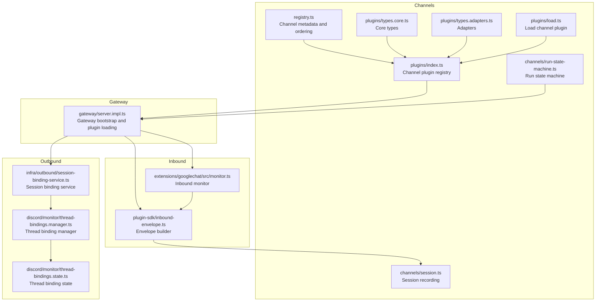
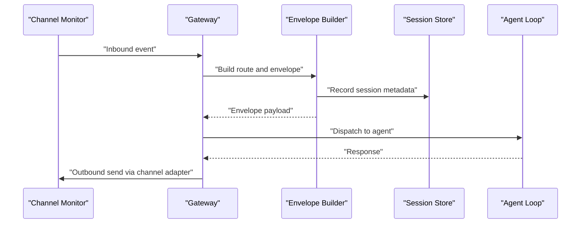
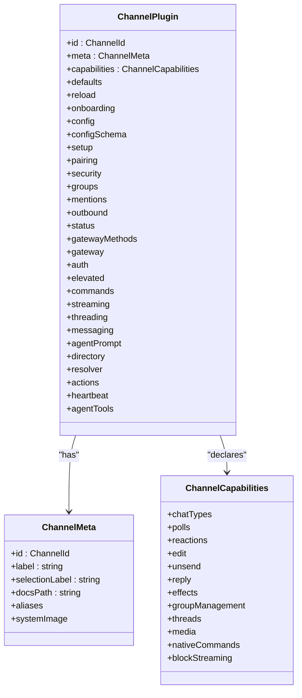
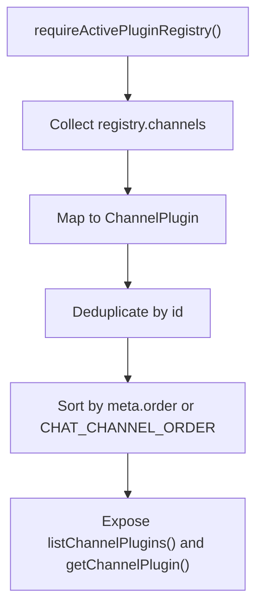
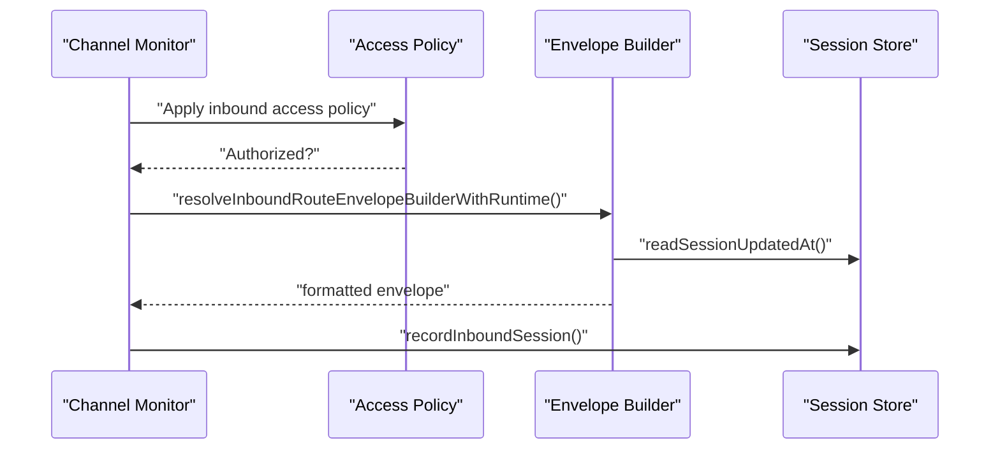
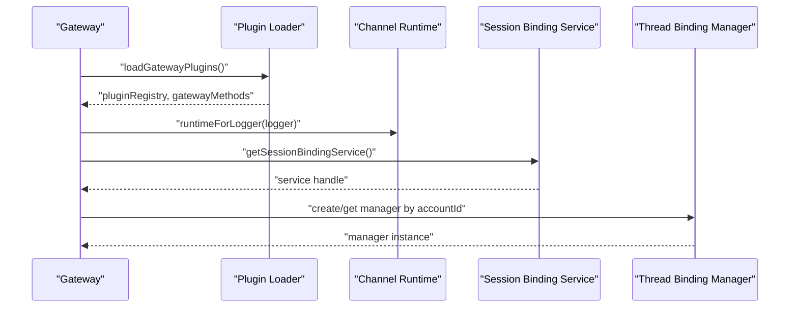
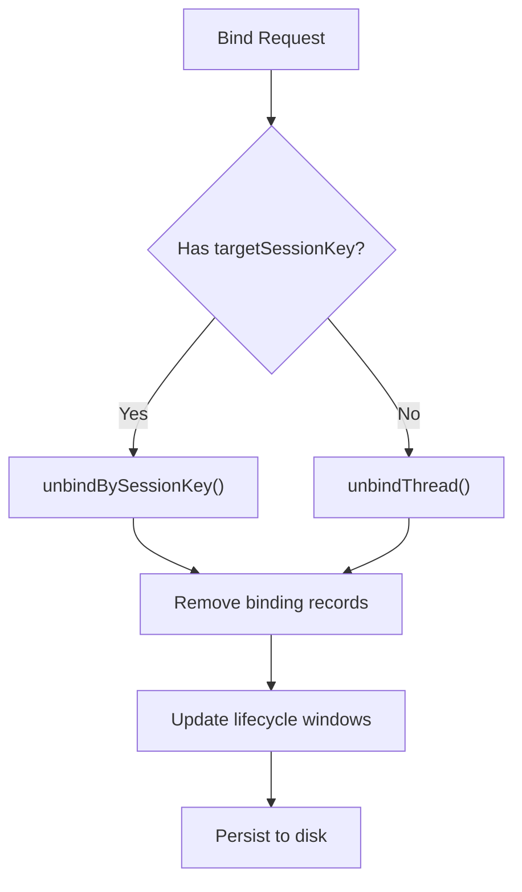
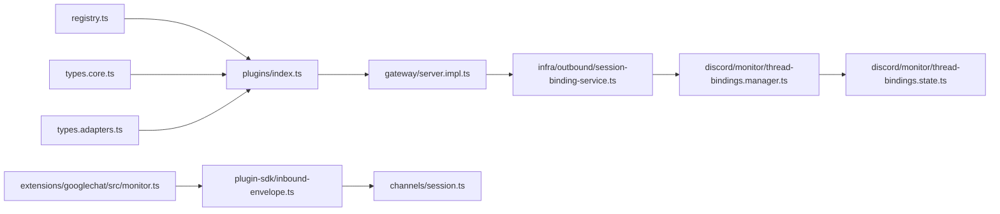

# Channel Architecture

<cite>
**Referenced Files in This Document**
- [registry.ts](file://src/channels/registry.ts)
- [types.core.ts](file://src/channels/plugins/types.core.ts)
- [types.plugin.ts](file://src/channels/plugins/types.plugin.ts)
- [types.adapters.ts](file://src/channels/plugins/types.adapters.ts)
- [index.ts](file://src/channels/plugins/index.ts)
- [load.ts](file://src/channels/plugins/load.ts)
- [session.ts](file://src/channels/session.ts)
- [run-state-machine.ts](file://src/channels/run-state-machine.ts)
- [server.impl.ts](file://src/gateway/server.impl.ts)
- [monitor.ts](file://extensions/googlechat/src/monitor.ts)
- [inbound-envelope.ts](file://src/plugin-sdk/inbound-envelope.ts)
- [session-binding-service.ts](file://src/infra/outbound/session-binding-service.ts)
- [thread-bindings.manager.ts](file://src/discord/monitor/thread-bindings.manager.ts)
- [thread-bindings.state.ts](file://src/discord/monitor/thread-bindings.state.ts)
- [message-tool.ts](file://src/agents/tools/message-tool.ts)
- [server-channels.test.ts](file://src/gateway/server-channels.test.ts)
- [session-binding-channel-agnostic.md](file://docs/experiments/plans/session-binding-channel-agnostic.md)
</cite>

## Table of Contents
1. [Introduction](#introduction)
2. [Project Structure](#project-structure)
3. [Core Components](#core-components)
4. [Architecture Overview](#architecture-overview)
5. [Detailed Component Analysis](#detailed-component-analysis)
6. [Dependency Analysis](#dependency-analysis)
7. [Performance Considerations](#performance-considerations)
8. [Troubleshooting Guide](#troubleshooting-guide)
9. [Conclusion](#conclusion)
10. [Appendices](#appendices)

## Introduction
This document explains OpenClaw’s channel architecture: the channel abstraction layer, plugin-based design, message routing, and lifecycle management. It covers how channels integrate with the gateway, how authentication and session management work, and how inbound/outbound messages are processed. It also documents channel capabilities, feature support matrices, and platform-specific constraints.

## Project Structure
OpenClaw organizes channel-related logic under src/channels and integrates with the gateway via a plugin-driven architecture. Key areas:
- Channel registry and metadata
- Channel plugin interface and adapters
- Session and run state management
- Gateway initialization and channel loading
- Inbound routing and envelope building
- Outbound session binding and thread binding managers
- Example channel monitor for inbound processing

**Diagram sources**
- [registry.ts](file://src/channels/registry.ts#L1-L201)
- [index.ts](file://src/channels/plugins/index.ts#L1-L118)
- [types.core.ts](file://src/channels/plugins/types.core.ts#L1-L391)
- [types.adapters.ts](file://src/channels/plugins/types.adapters.ts#L241-L289)
- [load.ts](file://src/channels/plugins/load.ts#L1-L9)
- [server.impl.ts](file://src/gateway/server.impl.ts#L1-L200)
- [monitor.ts](file://extensions/googlechat/src/monitor.ts#L161-L210)
- [inbound-envelope.ts](file://src/plugin-sdk/inbound-envelope.ts#L1-L55)
- [session.ts](file://src/channels/session.ts#L1-L82)
- [session-binding-service.ts](file://src/infra/outbound/session-binding-service.ts#L312-L325)
- [thread-bindings.manager.ts](file://src/discord/monitor/thread-bindings.manager.ts#L39-L654)
- [thread-bindings.state.ts](file://src/discord/monitor/thread-bindings.state.ts#L276-L321)

**Section sources**
- [registry.ts](file://src/channels/registry.ts#L1-L201)
- [index.ts](file://src/channels/plugins/index.ts#L1-L118)
- [types.core.ts](file://src/channels/plugins/types.core.ts#L1-L391)
- [types.adapters.ts](file://src/channels/plugins/types.adapters.ts#L241-L289)
- [load.ts](file://src/channels/plugins/load.ts#L1-L9)
- [server.impl.ts](file://src/gateway/server.impl.ts#L1-L200)

## Core Components
- Channel registry and metadata: centralizes channel IDs, aliases, and human-readable metadata used across the system.
- Channel plugin interface: defines the contract for channel implementations, including adapters for configuration, authentication, outbound messaging, directory, and more.
- Session management: records inbound context and routes for continuity across conversations.
- Gateway integration: loads channel plugins, builds gateway method sets, and initializes channel-specific runtimes.
- Inbound routing: constructs envelopes and routes messages to appropriate agents and sessions.
- Outbound session binding: binds destinations to sessions and manages thread bindings for providers that support it.
- Run state machine: tracks active runs and lifecycle status for channel accounts.

**Section sources**
- [registry.ts](file://src/channels/registry.ts#L1-L201)
- [types.core.ts](file://src/channels/plugins/types.core.ts#L1-L391)
- [types.adapters.ts](file://src/channels/plugins/types.adapters.ts#L241-L289)
- [session.ts](file://src/channels/session.ts#L1-L82)
- [server.impl.ts](file://src/gateway/server.impl.ts#L465-L493)
- [inbound-envelope.ts](file://src/plugin-sdk/inbound-envelope.ts#L1-L55)
- [session-binding-service.ts](file://src/infra/outbound/session-binding-service.ts#L312-L325)
- [thread-bindings.manager.ts](file://src/discord/monitor/thread-bindings.manager.ts#L39-L654)
- [run-state-machine.ts](file://src/channels/run-state-machine.ts#L1-L100)

## Architecture Overview
OpenClaw’s channel architecture is plugin-centric:
- Channels declare capabilities and adapters in a unified interface.
- The gateway loads channel plugins, merges their gateway methods, and initializes channel runtimes.
- Inbound messages are routed through channel monitors and envelope builders into the agent system.
- Outbound delivery uses session binding and provider-specific thread binding managers.
- Authentication and pairing flows are handled by channel adapters.

**Diagram sources**
- [monitor.ts](file://extensions/googlechat/src/monitor.ts#L200-L210)
- [inbound-envelope.ts](file://src/plugin-sdk/inbound-envelope.ts#L27-L55)
- [session.ts](file://src/channels/session.ts#L41-L82)
- [server.impl.ts](file://src/gateway/server.impl.ts#L465-L493)

## Detailed Component Analysis

### Channel Interface Design
The channel interface is defined by a plugin contract that exposes capabilities and adapters. Key elements:
- Channel identity and metadata
- Capabilities matrix (chat types, reactions, edits, threads, media, etc.)
- Adapter surface for configuration, authentication, outbound messaging, directory, grouping, threading, streaming, mentions, agent prompts, resolvers, actions, heartbeats, and elevated operations
- Optional agent tools and onboarding helpers

**Diagram sources**
- [types.plugin.ts](file://src/channels/plugins/types.plugin.ts#L49-L85)
- [types.core.ts](file://src/channels/plugins/types.core.ts#L76-L194)

**Section sources**
- [types.plugin.ts](file://src/channels/plugins/types.plugin.ts#L1-L86)
- [types.core.ts](file://src/channels/plugins/types.core.ts#L1-L391)

### Plugin Architecture and Registry
- The registry maintains channel order, aliases, and metadata.
- The runtime plugin registry is queried to resolve channel plugins and deduplicate them.
- Channel plugins are loaded lazily and sorted by declared order or default ordering.

**Diagram sources**
- [registry.ts](file://src/channels/registry.ts#L5-L21)
- [index.ts](file://src/channels/plugins/index.ts#L42-L72)

**Section sources**
- [registry.ts](file://src/channels/registry.ts#L1-L201)
- [index.ts](file://src/channels/plugins/index.ts#L1-L118)
- [load.ts](file://src/channels/plugins/load.ts#L1-L9)

### Message Routing Mechanisms
- Inbound monitors resolve access policies and build envelopes with routing context.
- The envelope builder formats agent envelopes and reads session timestamps for continuity.
- Session recording updates last route and metadata for inbound continuity.

**Diagram sources**
- [monitor.ts](file://extensions/googlechat/src/monitor.ts#L181-L210)
- [inbound-envelope.ts](file://src/plugin-sdk/inbound-envelope.ts#L27-L55)
- [session.ts](file://src/channels/session.ts#L41-L82)

**Section sources**
- [monitor.ts](file://extensions/googlechat/src/monitor.ts#L161-L210)
- [inbound-envelope.ts](file://src/plugin-sdk/inbound-envelope.ts#L1-L55)
- [session.ts](file://src/channels/session.ts#L1-L82)

### Channel Lifecycle, Authentication, and Session Management
- Gateway initializes channel runtimes and aggregates gateway methods from core and channel plugins.
- Channel monitors receive a channel runtime context that includes channel-specific APIs.
- Session binding service provides a singleton accessor for binding destinations to sessions.
- Thread binding managers maintain per-account bindings and lifecycle windows.

**Diagram sources**
- [server.impl.ts](file://src/gateway/server.impl.ts#L465-L493)
- [session-binding-service.ts](file://src/infra/outbound/session-binding-service.ts#L312-L325)
- [thread-bindings.manager.ts](file://src/discord/monitor/thread-bindings.manager.ts#L641-L648)

**Section sources**
- [server.impl.ts](file://src/gateway/server.impl.ts#L465-L493)
- [server-channels.test.ts](file://src/gateway/server-channels.test.ts#L171-L183)
- [session-binding-service.ts](file://src/infra/outbound/session-binding-service.ts#L312-L325)
- [thread-bindings.manager.ts](file://src/discord/monitor/thread-bindings.manager.ts#L39-L654)

### Thread Binding and Session Binding Mechanics
- Thread binding managers track bindings per account and thread ID, with configurable idle timeouts and max age.
- Session binding service exposes a default singleton and allows adapters to be registered per channel/account.
- Binding records are linked to session keys and persisted to disk with sweep intervals.

**Diagram sources**
- [thread-bindings.manager.ts](file://src/discord/monitor/thread-bindings.manager.ts#L614-L634)
- [thread-bindings.state.ts](file://src/discord/monitor/thread-bindings.state.ts#L276-L321)
- [session-binding-service.ts](file://src/infra/outbound/session-binding-service.ts#L312-L325)

**Section sources**
- [thread-bindings.manager.ts](file://src/discord/monitor/thread-bindings.manager.ts#L39-L654)
- [thread-bindings.state.ts](file://src/discord/monitor/thread-bindings.state.ts#L276-L321)
- [session-binding-service.ts](file://src/infra/outbound/session-binding-service.ts#L312-L325)

### Channel Capabilities and Feature Support Matrix
Capabilities are declared per channel and include:
- Chat types and threading support
- Polls, reactions, edits, unsend, replies
- Effects, group management, media
- Native commands and streaming blocking

Providers may override defaults via adapters (mention stripping, threading reply modes, streaming coalescing).

**Section sources**
- [types.core.ts](file://src/channels/plugins/types.core.ts#L181-L194)
- [types.core.ts](file://src/channels/plugins/types.core.ts#L225-L255)

### Platform-Specific Constraints and Examples
- Google Chat inbound monitor applies access policies and builds envelopes with runtime context.
- Thread binding defaults and lifecycle windows are configurable per provider.
- Session binding channel-agnostic plan outlines routing invariants and compatibility targets.

**Section sources**
- [monitor.ts](file://extensions/googlechat/src/monitor.ts#L161-L210)
- [thread-bindings.manager.ts](file://src/discord/monitor/thread-bindings.manager.ts#L71-L88)
- [session-binding-channel-agnostic.md](file://docs/experiments/plans/session-binding-channel-agnostic.md#L131-L181)

## Dependency Analysis
- Channel plugins depend on the active plugin registry and channel metadata.
- Gateway depends on channel plugins to extend method sets and initialize runtimes.
- Inbound monitors depend on envelope builders and session stores.
- Outbound depends on session binding service and thread binding managers.

**Diagram sources**
- [registry.ts](file://src/channels/registry.ts#L1-L201)
- [index.ts](file://src/channels/plugins/index.ts#L1-L118)
- [types.core.ts](file://src/channels/plugins/types.core.ts#L1-L391)
- [types.adapters.ts](file://src/channels/plugins/types.adapters.ts#L241-L289)
- [server.impl.ts](file://src/gateway/server.impl.ts#L1-L200)
- [monitor.ts](file://extensions/googlechat/src/monitor.ts#L161-L210)
- [inbound-envelope.ts](file://src/plugin-sdk/inbound-envelope.ts#L1-L55)
- [session.ts](file://src/channels/session.ts#L1-L82)
- [session-binding-service.ts](file://src/infra/outbound/session-binding-service.ts#L312-L325)
- [thread-bindings.manager.ts](file://src/discord/monitor/thread-bindings.manager.ts#L39-L654)
- [thread-bindings.state.ts](file://src/discord/monitor/thread-bindings.state.ts#L276-L321)

**Section sources**
- [index.ts](file://src/channels/plugins/index.ts#L1-L118)
- [server.impl.ts](file://src/gateway/server.impl.ts#L465-L493)

## Performance Considerations
- Lazy plugin runtime initialization avoids eager loading of heavy channel dependencies during startup.
- Thread binding managers use periodic sweeps and touch operations to manage lifecycle windows efficiently.
- Debounce and queue configurations can be tuned per channel via plugin defaults.

[No sources needed since this section provides general guidance]

## Troubleshooting Guide
Common areas to inspect:
- Channel runtime context passed to monitors (ensure channelRuntime is present when expected).
- Session binding service registration and adapter keys for specific channel/account combinations.
- Thread binding manager lifecycle windows and persistence paths.

**Section sources**
- [server-channels.test.ts](file://src/gateway/server-channels.test.ts#L171-L183)
- [session-binding-service.ts](file://src/infra/outbound/session-binding-service.ts#L312-L325)
- [thread-bindings.manager.ts](file://src/discord/monitor/thread-bindings.manager.ts#L641-L648)

## Conclusion
OpenClaw’s channel architecture centers on a robust plugin interface, a unified capability model, and a gateway-driven lifecycle. Inbound routing leverages envelope builders and session stores, while outbound delivery is coordinated through session binding and provider-specific thread binding managers. The design balances extensibility with operational safety, enabling consistent behavior across diverse messaging platforms.

## Appendices

### Agent-to-Gateway Interaction Notes
- Agents invoking gateway methods include explicit client metadata and mode for traceability and routing.

**Section sources**
- [message-tool.ts](file://src/agents/tools/message-tool.ts#L726-L747)