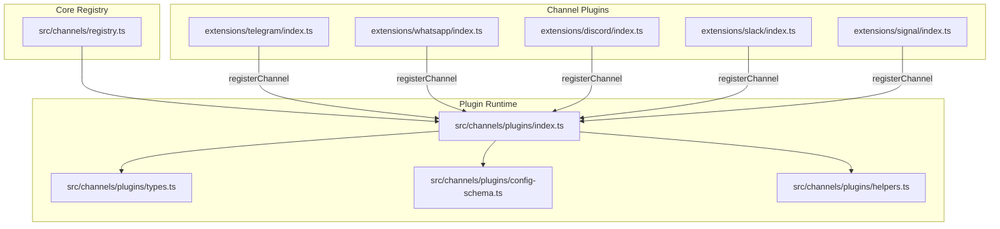
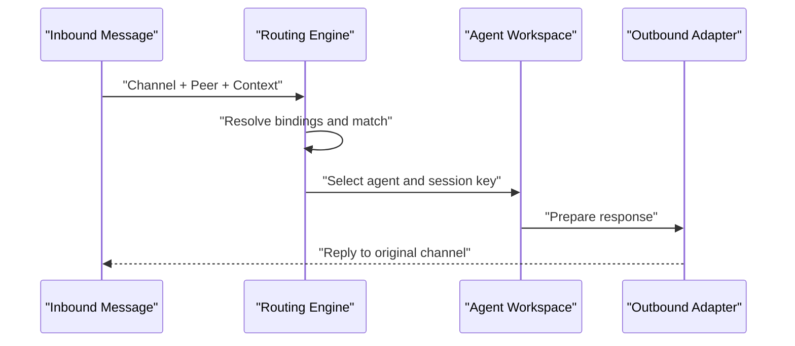
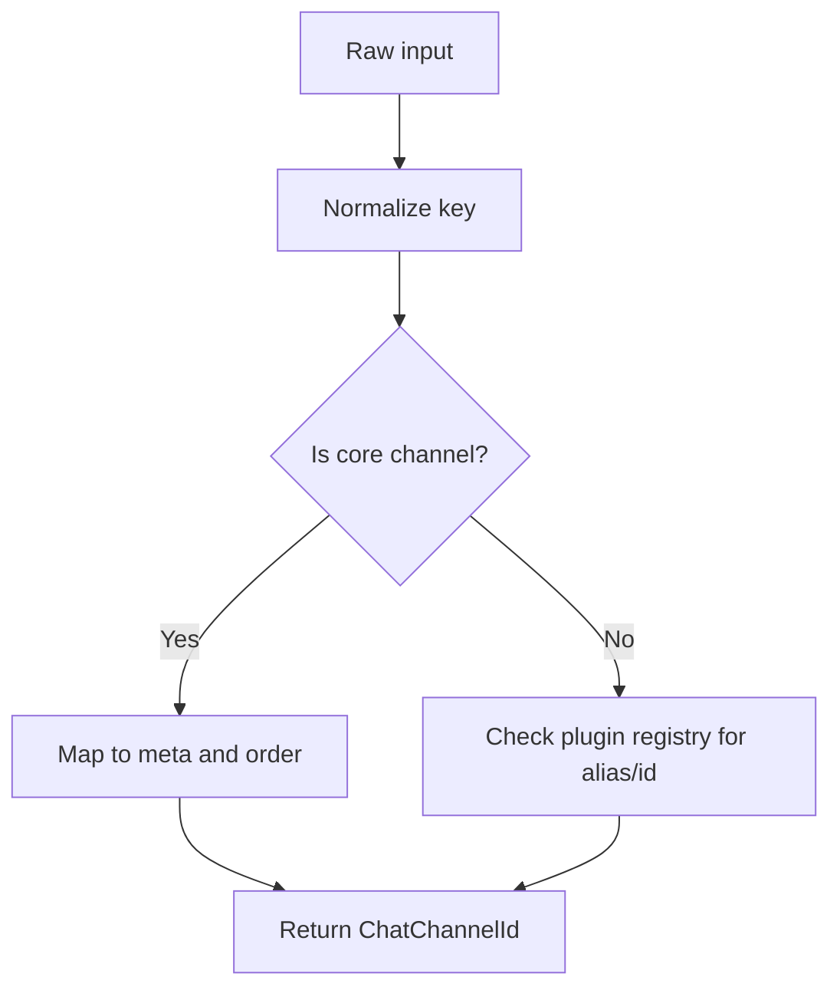
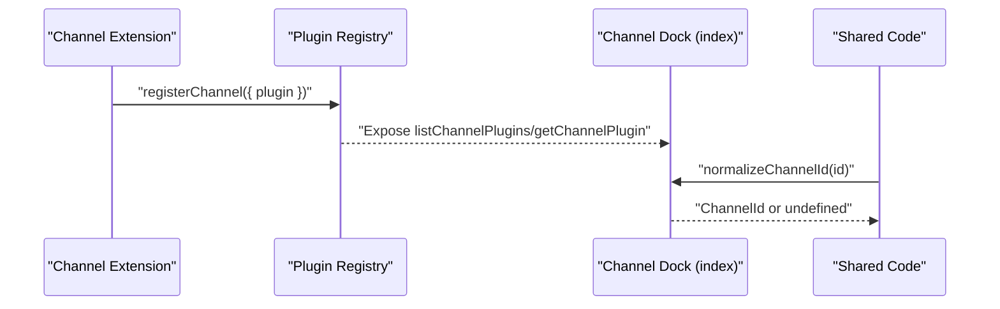
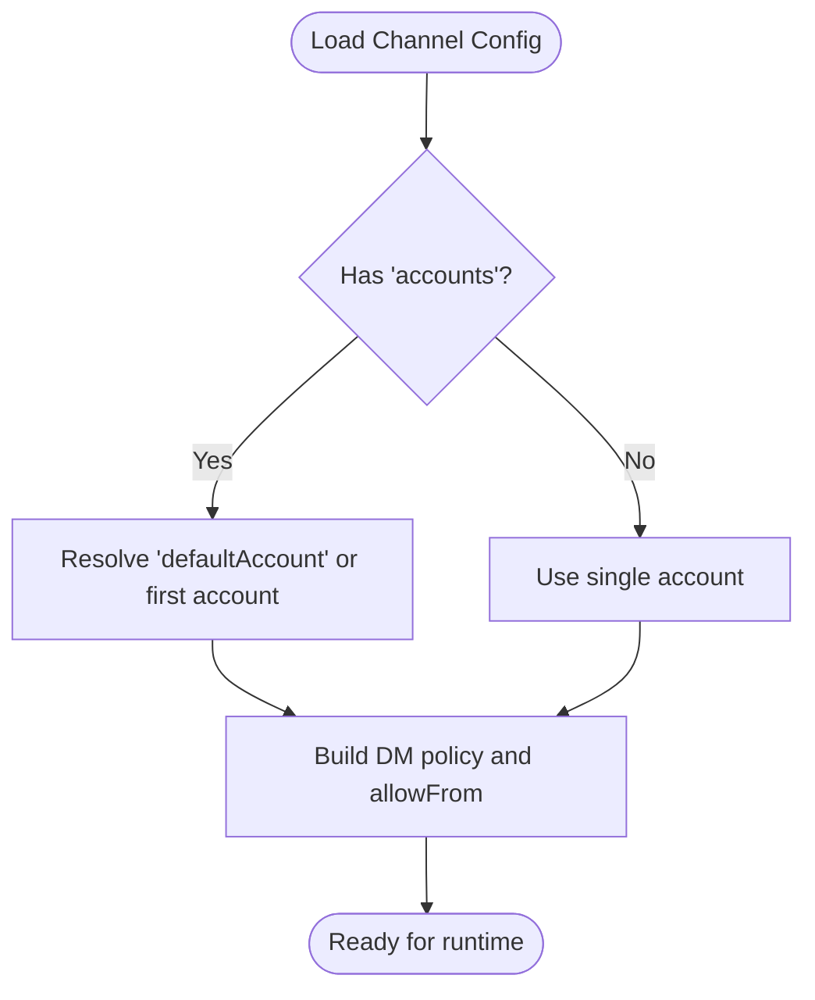
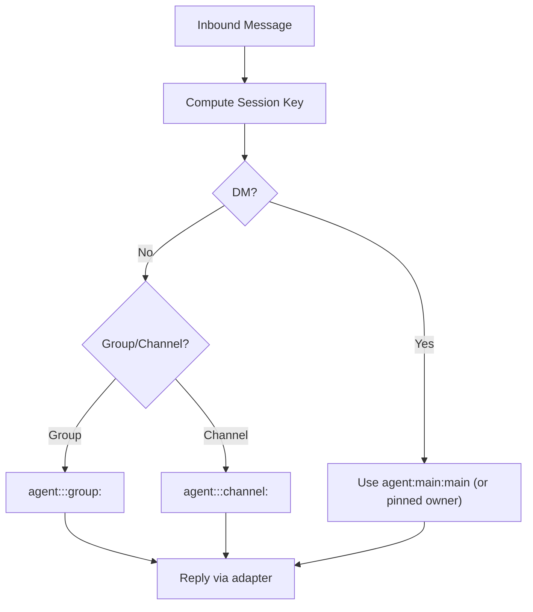
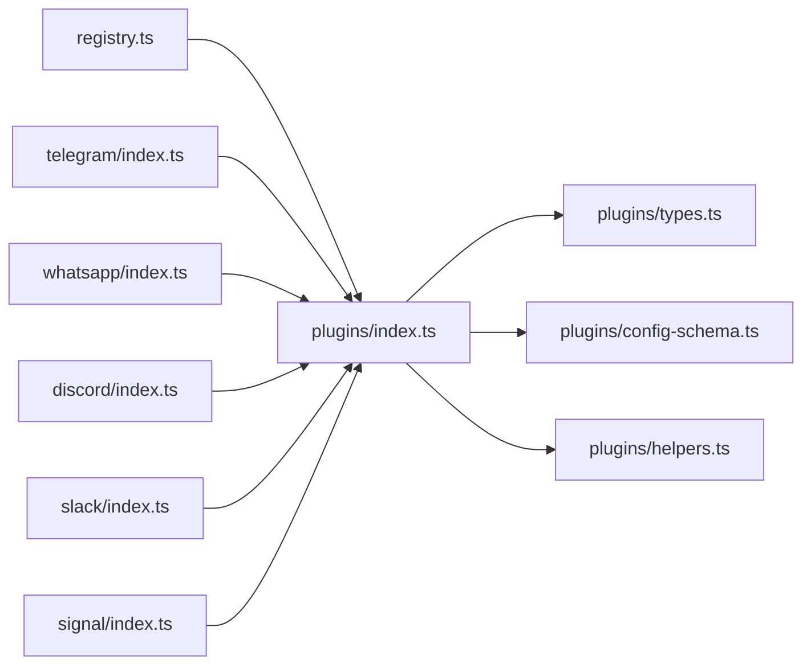

# Channel Integrations

<cite>
**Referenced Files in This Document**
- [docs/channels/index.md](file://docs/channels/index.md)
- [docs/channels/channel-routing.md](file://docs/channels/channel-routing.md)
- [src/channels/registry.ts](file://src/channels/registry.ts)
- [src/channels/plugins/index.ts](file://src/channels/plugins/index.ts)
- [src/channels/plugins/types.ts](file://src/channels/plugins/types.ts)
- [src/channels/plugins/config-schema.ts](file://src/channels/plugins/config-schema.ts)
- [src/channels/plugins/helpers.ts](file://src/channels/plugins/helpers.ts)
- [extensions/telegram/index.ts](file://extensions/telegram/index.ts)
- [extensions/whatsapp/index.ts](file://extensions/whatsapp/index.ts)
- [extensions/discord/index.ts](file://extensions/discord/index.ts)
- [extensions/slack/index.ts](file://extensions/slack/index.ts)
- [extensions/signal/index.ts](file://extensions/signal/index.ts)
</cite>

## Table of Contents
1. [Introduction](#introduction)
2. [Project Structure](#project-structure)
3. [Core Components](#core-components)
4. [Architecture Overview](#architecture-overview)
5. [Detailed Component Analysis](#detailed-component-analysis)
6. [Dependency Analysis](#dependency-analysis)
7. [Performance Considerations](#performance-considerations)
8. [Troubleshooting Guide](#troubleshooting-guide)
9. [Conclusion](#conclusion)
10. [Appendices](#appendices)

## Introduction
This document explains how OpenClaw integrates with 20+ messaging platforms. It covers the channel architecture, integration patterns, and platform-specific implementations. You will learn how to configure and authenticate each supported channel, how messages are routed, how media and group features are handled, and how to develop custom channels. Security, rate limiting, and compliance considerations are addressed per channel where applicable.

## Project Structure
OpenClaw organizes channel integrations around a plugin-based architecture:
- Centralized channel registry defines supported channels and their metadata.
- Channel plugins encapsulate platform-specific logic and expose adapters for messaging, authentication, grouping, and more.
- Shared routing and session logic ensures deterministic reply paths and consistent behavior across channels.

**Diagram sources**
- [src/channels/registry.ts](file://src/channels/registry.ts#L1-L201)
- [src/channels/plugins/index.ts](file://src/channels/plugins/index.ts#L1-L118)
- [src/channels/plugins/types.ts](file://src/channels/plugins/types.ts#L1-L66)
- [src/channels/plugins/config-schema.ts](file://src/channels/plugins/config-schema.ts#L1-L43)
- [src/channels/plugins/helpers.ts](file://src/channels/plugins/helpers.ts#L1-L59)
- [extensions/telegram/index.ts](file://extensions/telegram/index.ts#L1-L18)
- [extensions/whatsapp/index.ts](file://extensions/whatsapp/index.ts#L1-L18)
- [extensions/discord/index.ts](file://extensions/discord/index.ts#L1-L20)
- [extensions/slack/index.ts](file://extensions/slack/index.ts#L1-L18)
- [extensions/signal/index.ts](file://extensions/signal/index.ts#L1-L18)

**Section sources**
- [docs/channels/index.md](file://docs/channels/index.md#L1-L48)
- [src/channels/registry.ts](file://src/channels/registry.ts#L1-L201)
- [src/channels/plugins/index.ts](file://src/channels/plugins/index.ts#L1-L118)

## Core Components
- Channel registry: Defines canonical channel IDs, display metadata, aliases, and ordering. Provides normalization helpers for channel IDs.
- Plugin system: Loads channel plugins at runtime, deduplicates, sorts, and exposes lookup by ID.
- Type contracts: Defines adapters for messaging, authentication, directory, grouping, threading, status, and more.
- Configuration schema builder: Produces JSON Schema-compatible channel configs with multi-account support.
- Helpers: Resolve default accounts, build DM security policies, and format pairing hints.

**Section sources**
- [src/channels/registry.ts](file://src/channels/registry.ts#L5-L121)
- [src/channels/plugins/index.ts](file://src/channels/plugins/index.ts#L14-L84)
- [src/channels/plugins/types.ts](file://src/channels/plugins/types.ts#L7-L66)
- [src/channels/plugins/config-schema.ts](file://src/channels/plugins/config-schema.ts#L14-L42)
- [src/channels/plugins/helpers.ts](file://src/channels/plugins/helpers.ts#L8-L58)

## Architecture Overview
OpenClaw routes replies deterministically back to the originating channel. Agents are selected via bindings and match criteria. Sessions are scoped per agent and channel context, with optional thread/topic isolation.

**Diagram sources**
- [docs/channels/channel-routing.md](file://docs/channels/channel-routing.md#L58-L74)

**Section sources**
- [docs/channels/channel-routing.md](file://docs/channels/channel-routing.md#L1-L135)

## Detailed Component Analysis

### Channel Registry and Selection
- Canonical IDs and aliases are defined centrally.
- Ordering influences UI selection and default prioritization.
- Normalization resolves both core channels and external plugins by ID or alias.

**Diagram sources**
- [src/channels/registry.ts](file://src/channels/registry.ts#L147-L183)

**Section sources**
- [src/channels/registry.ts](file://src/channels/registry.ts#L5-L121)
- [src/channels/registry.ts](file://src/channels/registry.ts#L123-L183)

### Plugin Registration and Lookup
- Each channel plugin registers itself with the runtime and exposes a ChannelPlugin interface.
- The plugin registry caches and deduplicates channel plugins, sorting by order and ID.
- Lookup by channel ID is centralized and safe for shared code paths.

**Diagram sources**
- [extensions/telegram/index.ts](file://extensions/telegram/index.ts#L11-L14)
- [extensions/whatsapp/index.ts](file://extensions/whatsapp/index.ts#L11-L14)
- [extensions/discord/index.ts](file://extensions/discord/index.ts#L12-L15)
- [extensions/slack/index.ts](file://extensions/slack/index.ts#L11-L14)
- [extensions/signal/index.ts](file://extensions/signal/index.ts#L11-L14)
- [src/channels/plugins/index.ts](file://src/channels/plugins/index.ts#L74-L84)

**Section sources**
- [src/channels/plugins/index.ts](file://src/channels/plugins/index.ts#L14-L84)
- [extensions/telegram/index.ts](file://extensions/telegram/index.ts#L1-L18)
- [extensions/whatsapp/index.ts](file://extensions/whatsapp/index.ts#L1-L18)
- [extensions/discord/index.ts](file://extensions/discord/index.ts#L1-L20)
- [extensions/slack/index.ts](file://extensions/slack/index.ts#L1-L18)
- [extensions/signal/index.ts](file://extensions/signal/index.ts#L1-L18)

### Configuration and Multi-Account Support
- Channel configs can define multiple accounts and a default account.
- JSON Schema generation supports plugin-defined schemas with compatibility fallbacks.
- Helpers compute effective DM security policies and pairing hints.

**Diagram sources**
- [src/channels/plugins/config-schema.ts](file://src/channels/plugins/config-schema.ts#L14-L42)
- [src/channels/plugins/helpers.ts](file://src/channels/plugins/helpers.ts#L23-L58)

**Section sources**
- [src/channels/plugins/config-schema.ts](file://src/channels/plugins/config-schema.ts#L1-L43)
- [src/channels/plugins/helpers.ts](file://src/channels/plugins/helpers.ts#L1-L59)

### Channel-Specific Implementations

#### Telegram
- Uses a plugin that registers the Telegram ChannelPlugin.
- Supports groups and is noted as one of the fastest to set up.

**Section sources**
- [extensions/telegram/index.ts](file://extensions/telegram/index.ts#L1-L18)
- [docs/channels/index.md](file://docs/channels/index.md#L31-L31)

#### WhatsApp
- Uses a plugin that registers the WhatsApp ChannelPlugin.
- Requires QR pairing and maintains state on disk.

**Section sources**
- [extensions/whatsapp/index.ts](file://extensions/whatsapp/index.ts#L1-L18)
- [docs/channels/index.md](file://docs/channels/index.md#L35-L35)

#### Discord
- Uses a plugin that registers the Discord ChannelPlugin.
- Integrates subagent hooks during registration.

**Section sources**
- [extensions/discord/index.ts](file://extensions/discord/index.ts#L1-L20)
- [docs/channels/index.md](file://docs/channels/index.md#L17-L17)

#### Slack
- Uses a plugin that registers the Slack ChannelPlugin.

**Section sources**
- [extensions/slack/index.ts](file://extensions/slack/index.ts#L1-L18)
- [docs/channels/index.md](file://docs/channels/index.md#L30-L30)

#### Signal
- Uses a plugin that registers the Signal ChannelPlugin.

**Section sources**
- [extensions/signal/index.ts](file://extensions/signal/index.ts#L1-L18)
- [docs/channels/index.md](file://docs/channels/index.md#L28-L28)

### Message Routing and Sessions
- Replies route deterministically to the originating channel.
- Session keys collapse DMs to a main session by default; groups and channels remain isolated.
- Threads and topics are supported where the platform provides them.

**Diagram sources**
- [docs/channels/channel-routing.md](file://docs/channels/channel-routing.md#L24-L44)

**Section sources**
- [docs/channels/channel-routing.md](file://docs/channels/channel-routing.md#L10-L74)

### Authentication and Pairing
- Pairing flows are standardized; helpers format approval hints for CLI commands.
- DM security policies can be scoped per account and allowlisted senders.

**Section sources**
- [src/channels/plugins/helpers.ts](file://src/channels/plugins/helpers.ts#L17-L21)
- [src/channels/plugins/helpers.ts](file://src/channels/plugins/helpers.ts#L23-L58)

### Media Handling and Group Management
- Text is supported broadly; media and reactions vary by channel.
- Group behavior differs by platform; consult platform-specific docs.

**Section sources**
- [docs/channels/index.md](file://docs/channels/index.md#L11-L12)
- [docs/channels/index.md](file://docs/channels/index.md#L44-L44)

### Platform-Specific Setup Requirements
- Fastest setup is often Telegram (bot token).
- WhatsApp requires QR pairing and persistent state.
- Other channels are documented in platform-specific guides.

**Section sources**
- [docs/channels/index.md](file://docs/channels/index.md#L42-L43)

## Dependency Analysis
The channel system exhibits low coupling between core and platform-specific logic:
- Core depends on the plugin registry for channel identity resolution.
- Plugins depend on the runtime to register adapters and capabilities.
- Shared helpers and schemas are reused across channels.

**Diagram sources**
- [src/channels/registry.ts](file://src/channels/registry.ts#L1-L201)
- [src/channels/plugins/index.ts](file://src/channels/plugins/index.ts#L1-L118)
- [src/channels/plugins/types.ts](file://src/channels/plugins/types.ts#L1-L66)
- [src/channels/plugins/config-schema.ts](file://src/channels/plugins/config-schema.ts#L1-L43)
- [src/channels/plugins/helpers.ts](file://src/channels/plugins/helpers.ts#L1-L59)
- [extensions/telegram/index.ts](file://extensions/telegram/index.ts#L1-L18)
- [extensions/whatsapp/index.ts](file://extensions/whatsapp/index.ts#L1-L18)
- [extensions/discord/index.ts](file://extensions/discord/index.ts#L1-L20)
- [extensions/slack/index.ts](file://extensions/slack/index.ts#L1-L18)
- [extensions/signal/index.ts](file://extensions/signal/index.ts#L1-L18)

**Section sources**
- [src/channels/plugins/index.ts](file://src/channels/plugins/index.ts#L1-L118)

## Performance Considerations
- Prefer channels with simpler authentication flows for rapid deployment.
- Use multi-account configuration judiciously; default account selection impacts routing determinism.
- Monitor session storage paths and consider overrides for scalability.

[No sources needed since this section provides general guidance]

## Troubleshooting Guide
- Refer to channel-specific troubleshooting documents for platform issues.
- Verify pairing approvals and allowlists when DMs are blocked.
- Review session scopes and bindings to ensure correct agent routing.

**Section sources**
- [docs/channels/index.md](file://docs/channels/index.md#L46-L46)
- [docs/channels/channel-routing.md](file://docs/channels/channel-routing.md#L45-L56)

## Conclusion
OpenClaw’s channel architecture cleanly separates core routing and session logic from platform-specific implementations. The plugin system enables rapid addition of new channels while maintaining consistent behavior, authentication, and security policies. Use the provided guides and APIs to configure, secure, and extend channel integrations.

[No sources needed since this section summarizes without analyzing specific files]

## Appendices

### Appendix A: Supported Channels Overview
- Telegram, WhatsApp, Discord, IRC, Google Chat, Slack, Signal, iMessage, and more are documented in the channels index.

**Section sources**
- [docs/channels/index.md](file://docs/channels/index.md#L14-L37)

### Appendix B: Routing and Session Keys
- Deterministic reply routing and session scoping rules are defined in the channel routing guide.

**Section sources**
- [docs/channels/channel-routing.md](file://docs/channels/channel-routing.md#L10-L44)