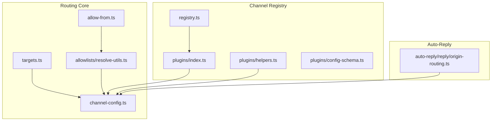
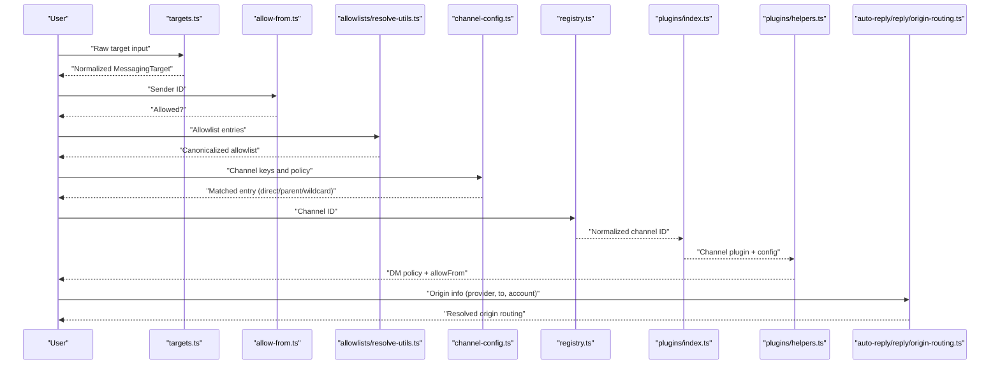
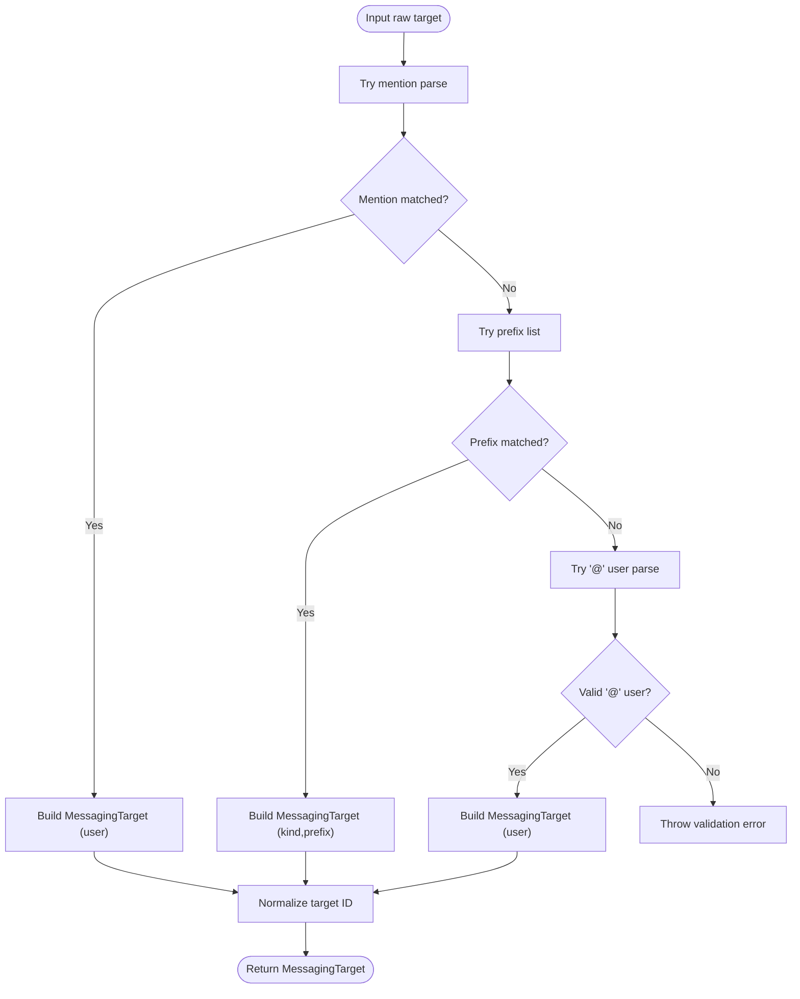
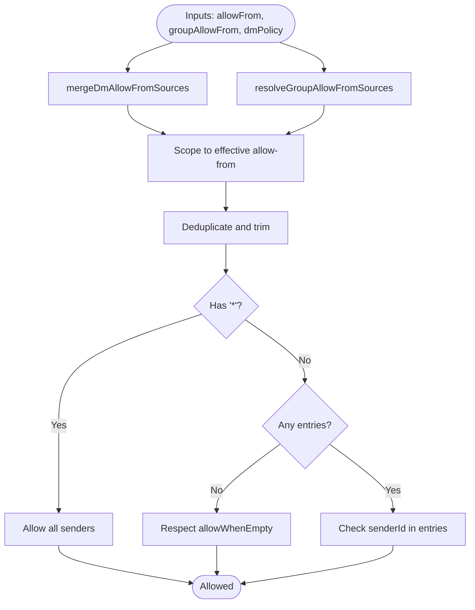
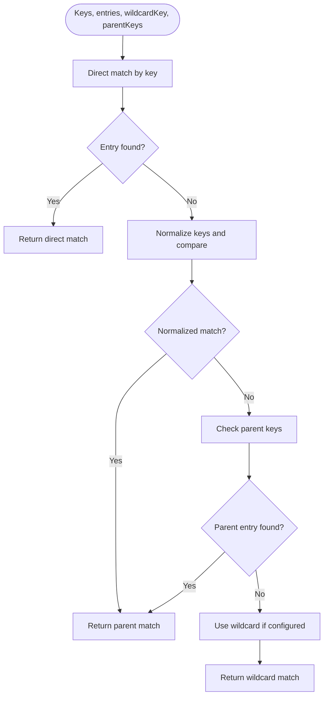
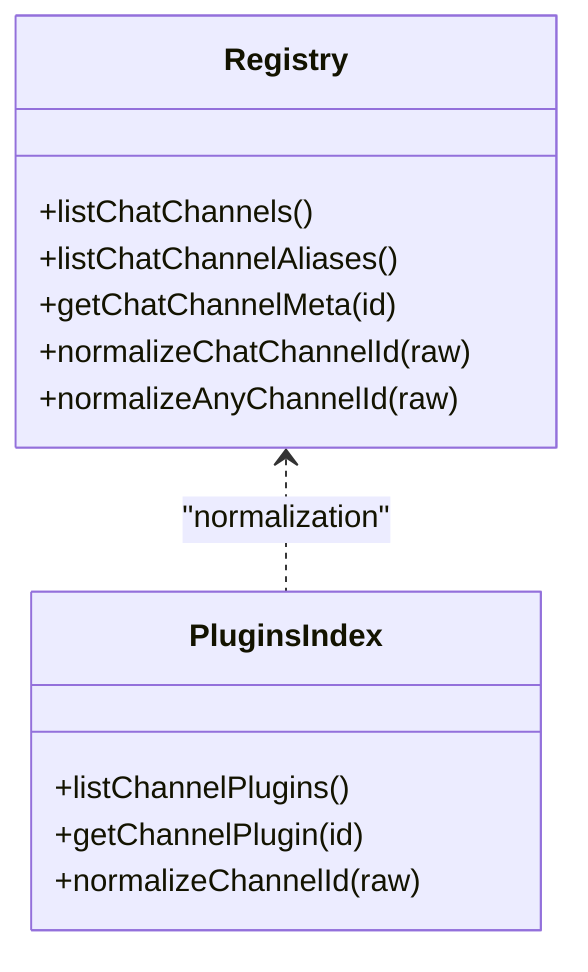
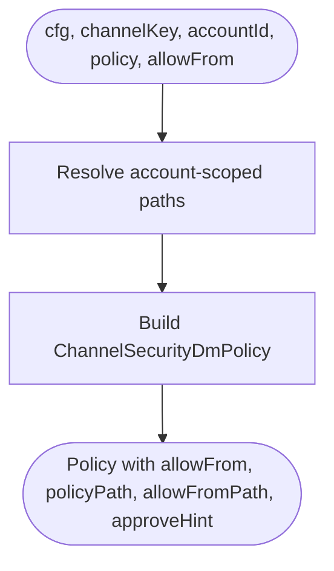
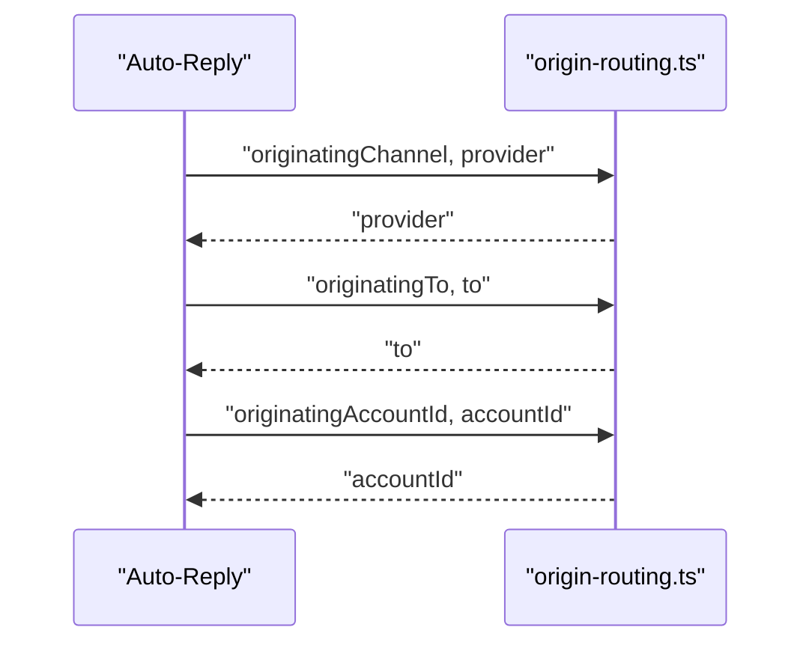
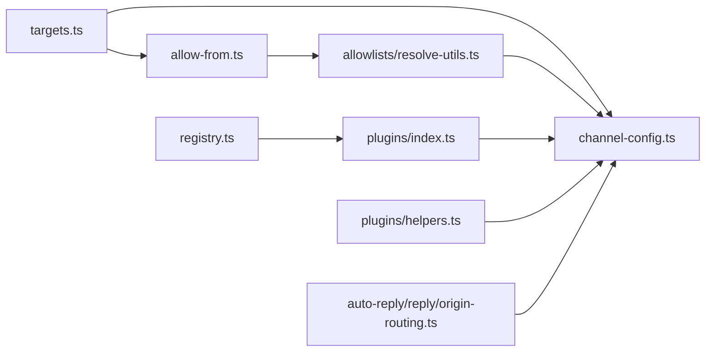

# Channel Routing & Configuration

<cite>
**Referenced Files in This Document**
- [targets.ts](file://src/channels/targets.ts)
- [allow-from.ts](file://src/channels/allow-from.ts)
- [resolve-utils.ts](file://src/channels/allowlists/resolve-utils.ts)
- [channel-config.ts](file://src/channels/channel-config.ts)
- [registry.ts](file://src/channels/registry.ts)
- [index.ts](file://src/channels/plugins/index.ts)
- [helpers.ts](file://src/channels/plugins/helpers.ts)
- [config-schema.ts](file://src/channels/plugins/config-schema.ts)
- [origin-routing.ts](file://src/auto-reply/reply/origin-routing.ts)
</cite>

## Table of Contents
1. [Introduction](#introduction)
2. [Project Structure](#project-structure)
3. [Core Components](#core-components)
4. [Architecture Overview](#architecture-overview)
5. [Detailed Component Analysis](#detailed-component-analysis)
6. [Dependency Analysis](#dependency-analysis)
7. [Performance Considerations](#performance-considerations)
8. [Troubleshooting Guide](#troubleshooting-guide)
9. [Conclusion](#conclusion)
10. [Appendices](#appendices)

## Introduction
This document explains how OpenClaw routes messages across channels, focusing on routing algorithms, target resolution, message forwarding, allowlists, pairing controls, and security policies. It also covers configuration options for channel routing, message filtering, and destination selection, with examples of complex routing scenarios and advanced configuration patterns. Guidance on performance and troubleshooting is included to help operators deploy reliable multi-channel setups.

## Project Structure
OpenClaw’s channel routing spans several modules:
- Target parsing and normalization for user/channel identifiers
- Allowlist and sender allow-from resolution
- Channel configuration matching and fallback logic
- Channel registry and plugin resolution
- Security policy helpers for DM routing and pairing
- Auto-reply origin routing helpers

**Diagram sources**
- [targets.ts](file://src/channels/targets.ts#L1-L147)
- [allow-from.ts](file://src/channels/allow-from.ts#L1-L54)
- [resolve-utils.ts](file://src/channels/allowlists/resolve-utils.ts#L1-L163)
- [channel-config.ts](file://src/channels/channel-config.ts#L1-L183)
- [registry.ts](file://src/channels/registry.ts#L1-L201)
- [index.ts](file://src/channels/plugins/index.ts#L1-L118)
- [helpers.ts](file://src/channels/plugins/helpers.ts#L1-L59)
- [config-schema.ts](file://src/channels/plugins/config-schema.ts#L1-L43)
- [origin-routing.ts](file://src/auto-reply/reply/origin-routing.ts#L1-L30)

**Section sources**
- [targets.ts](file://src/channels/targets.ts#L1-L147)
- [allow-from.ts](file://src/channels/allow-from.ts#L1-L54)
- [resolve-utils.ts](file://src/channels/allowlists/resolve-utils.ts#L1-L163)
- [channel-config.ts](file://src/channels/channel-config.ts#L1-L183)
- [registry.ts](file://src/channels/registry.ts#L1-L201)
- [index.ts](file://src/channels/plugins/index.ts#L1-L118)
- [helpers.ts](file://src/channels/plugins/helpers.ts#L1-L59)
- [config-schema.ts](file://src/channels/plugins/config-schema.ts#L1-L43)
- [origin-routing.ts](file://src/auto-reply/reply/origin-routing.ts#L1-L30)

## Core Components
- Messaging targets and normalization: Parse mentions, prefixes, and user identifiers; produce normalized target IDs for routing.
- Allow-from and allowlists: Merge, deduplicate, and canonicalize allowlist entries; evaluate sender allowlists with wildcards and empty defaults.
- Channel configuration matching: Resolve direct, parent, and wildcard matches; support nested allowlist decisions.
- Channel registry and plugin resolution: Normalize channel IDs, maintain ordering, and resolve channel plugins at runtime.
- Security policy helpers: Build DM security policies scoped to channel and account; derive allow-from and policy paths.
- Auto-reply origin routing: Resolve originating provider, recipient, and account ID for replies.

**Section sources**
- [targets.ts](file://src/channels/targets.ts#L18-L147)
- [allow-from.ts](file://src/channels/allow-from.ts#L1-L54)
- [resolve-utils.ts](file://src/channels/allowlists/resolve-utils.ts#L11-L163)
- [channel-config.ts](file://src/channels/channel-config.ts#L14-L183)
- [registry.ts](file://src/channels/registry.ts#L5-L201)
- [index.ts](file://src/channels/plugins/index.ts#L14-L90)
- [helpers.ts](file://src/channels/plugins/helpers.ts#L23-L58)
- [origin-routing.ts](file://src/auto-reply/reply/origin-routing.ts#L8-L30)

## Architecture Overview
OpenClaw routes messages through a layered pipeline:
- Input parsing normalizes targets and identifies channel-specific identifiers.
- Allow-from and allowlists gate who can send and receive.
- Channel configuration selects the appropriate channel entry (direct, parent, wildcard).
- Channel registry resolves plugins and applies security policies.
- Auto-reply origin routing ensures replies route back to the originating channel/account/provider.

**Diagram sources**
- [targets.ts](file://src/channels/targets.ts#L22-L147)
- [allow-from.ts](file://src/channels/allow-from.ts#L38-L54)
- [resolve-utils.ts](file://src/channels/allowlists/resolve-utils.ts#L29-L128)
- [channel-config.ts](file://src/channels/channel-config.ts#L60-L183)
- [registry.ts](file://src/channels/registry.ts#L147-L183)
- [index.ts](file://src/channels/plugins/index.ts#L74-L90)
- [helpers.ts](file://src/channels/plugins/helpers.ts#L23-L58)
- [origin-routing.ts](file://src/auto-reply/reply/origin-routing.ts#L8-L30)

## Detailed Component Analysis

### Messaging Targets and Normalization
- Builds normalized target IDs combining kind and identifier.
- Parses mentions, prefixes, and “@user” forms; supports optional default kinds and ambiguous message hints.
- Enforces ID patterns and throws descriptive errors when invalid.
- Resolves required target kinds and extracts clean IDs.

**Diagram sources**
- [targets.ts](file://src/channels/targets.ts#L46-L147)

**Section sources**
- [targets.ts](file://src/channels/targets.ts#L18-L147)

### Allow-from and Allowlists Resolution
- Merges allow-from sources for DMs and groups, with policy-aware scoping.
- Deduplicates and trims allowlist entries; supports wildcard entries.
- Canonicalizes allowlists by replacing resolved usernames with IDs and merging additions.
- Summarizes mapping outcomes for logging and diagnostics.

**Diagram sources**
- [allow-from.ts](file://src/channels/allow-from.ts#L1-L54)
- [resolve-utils.ts](file://src/channels/allowlists/resolve-utils.ts#L11-L90)

**Section sources**
- [allow-from.ts](file://src/channels/allow-from.ts#L1-L54)
- [resolve-utils.ts](file://src/channels/allowlists/resolve-utils.ts#L11-L163)

### Channel Configuration Matching and Fallbacks
- Resolves direct matches first; falls back to normalized parent keys; finally uses wildcard if present.
- Applies metadata (matchKey, matchSource) to downstream logic.
- Supports nested allowlist decisions based on outer/inner configuration and matching.

**Diagram sources**
- [channel-config.ts](file://src/channels/channel-config.ts#L60-L183)

**Section sources**
- [channel-config.ts](file://src/channels/channel-config.ts#L14-L183)

### Channel Registry and Plugin Resolution
- Maintains channel order and aliases; normalizes channel IDs and resolves plugin metadata.
- Provides helpers to list channels, resolve meta, and normalize any channel ID against the active plugin registry.

**Diagram sources**
- [registry.ts](file://src/channels/registry.ts#L135-L183)
- [index.ts](file://src/channels/plugins/index.ts#L74-L90)

**Section sources**
- [registry.ts](file://src/channels/registry.ts#L1-L201)
- [index.ts](file://src/channels/plugins/index.ts#L1-L118)

### Security Policies and Pairing Controls
- Builds DM security policy scoped to channel and account, deriving allow-from and policy paths.
- Supports configurable default policies and approval hints for pairing flows.

**Diagram sources**
- [helpers.ts](file://src/channels/plugins/helpers.ts#L23-L58)

**Section sources**
- [helpers.ts](file://src/channels/plugins/helpers.ts#L23-L58)

### Auto-Reply Origin Routing
- Resolves originating provider, recipient, and account ID for replies, prioritizing originating values.

**Diagram sources**
- [origin-routing.ts](file://src/auto-reply/reply/origin-routing.ts#L8-L30)

**Section sources**
- [origin-routing.ts](file://src/auto-reply/reply/origin-routing.ts#L1-L30)

## Dependency Analysis
- targets.ts depends on allow-from.ts for target normalization and on channel-config.ts for key normalization.
- allowlists/resolve-utils.ts depends on plugin-sdk helpers to map allow-from entries and on shared utilities for summaries.
- channel-config.ts integrates with registry.ts for slug normalization and with plugins/index.ts for plugin resolution.
- plugins/helpers.ts composes channel-config.ts and registry.ts to construct security policies.
- auto-reply/reply/origin-routing.ts is independent and feeds into routing decisions.

**Diagram sources**
- [targets.ts](file://src/channels/targets.ts#L18-L147)
- [allow-from.ts](file://src/channels/allow-from.ts#L1-L54)
- [resolve-utils.ts](file://src/channels/allowlists/resolve-utils.ts#L1-L163)
- [channel-config.ts](file://src/channels/channel-config.ts#L1-L183)
- [registry.ts](file://src/channels/registry.ts#L1-L201)
- [index.ts](file://src/channels/plugins/index.ts#L1-L118)
- [helpers.ts](file://src/channels/plugins/helpers.ts#L1-L59)
- [origin-routing.ts](file://src/auto-reply/reply/origin-routing.ts#L1-L30)

**Section sources**
- [targets.ts](file://src/channels/targets.ts#L18-L147)
- [allow-from.ts](file://src/channels/allow-from.ts#L1-L54)
- [resolve-utils.ts](file://src/channels/allowlists/resolve-utils.ts#L1-L163)
- [channel-config.ts](file://src/channels/channel-config.ts#L1-L183)
- [registry.ts](file://src/channels/registry.ts#L1-L201)
- [index.ts](file://src/channels/plugins/index.ts#L1-L118)
- [helpers.ts](file://src/channels/plugins/helpers.ts#L1-L59)
- [origin-routing.ts](file://src/auto-reply/reply/origin-routing.ts#L1-L30)

## Performance Considerations
- Deduplication and trimming: Allowlist resolution trims whitespace and deduplicates entries to minimize set sizes and reduce lookup costs.
- Early exits: Allow-from evaluation short-circuits on wildcard and empty allowlists.
- Caching: Channel plugin resolution caches results keyed by registry version to avoid repeated heavy imports.
- Normalization: Slug normalization and key deduplication reduce mis-matches and improve matching performance.
- Logging summaries: Mapping summaries cap reported entries to limit log volume while preserving visibility.

[No sources needed since this section provides general guidance]

## Troubleshooting Guide
Common issues and resolutions:
- Invalid target identifiers: Ensure mentions, prefixes, and “@user” formats conform to expected patterns; validation errors indicate malformed inputs.
- Unexpected sender blocked: Verify allow-from entries, wildcard usage, and whether the allowlist is empty vs. policy-driven.
- Mis-matched channel keys: Confirm direct, parent, and wildcard keys; use normalized keys to align with configuration.
- Incorrect DM policy: Check account-scoped paths and default policy overrides; confirm allow-from path suffixes and policy path suffixes.
- Replies routed incorrectly: Validate originating provider, recipient, and account ID resolution.

**Section sources**
- [targets.ts](file://src/channels/targets.ts#L35-L147)
- [allow-from.ts](file://src/channels/allow-from.ts#L38-L54)
- [channel-config.ts](file://src/channels/channel-config.ts#L60-L183)
- [helpers.ts](file://src/channels/plugins/helpers.ts#L23-L58)
- [origin-routing.ts](file://src/auto-reply/reply/origin-routing.ts#L8-L30)

## Conclusion
OpenClaw’s channel routing combines robust target parsing, flexible allowlist management, and precise channel configuration matching. Operators can enforce strong security policies, scale across multiple channels, and maintain predictable message forwarding by leveraging normalized identifiers, allow-from scoping, and account-scoped policies. The architecture supports complex routing scenarios while keeping performance and observability in focus.

[No sources needed since this section summarizes without analyzing specific files]

## Appendices

### Configuration Options and Examples
- Channel entry matching:
  - Direct match by key
  - Parent fallback with normalized keys
  - Wildcard fallback when configured
- Allow-from scoping:
  - DM policy-aware merging
  - Group allow-from with optional fallback to global allow-from
  - Wildcard support and empty allowlist behavior
- Security policy:
  - Account-scoped allow-from and policy paths
  - Approval hints for pairing flows
- Auto-reply origin routing:
  - Provider, recipient, and account ID resolution

**Section sources**
- [channel-config.ts](file://src/channels/channel-config.ts#L60-L183)
- [allow-from.ts](file://src/channels/allow-from.ts#L1-L54)
- [helpers.ts](file://src/channels/plugins/helpers.ts#L23-L58)
- [origin-routing.ts](file://src/auto-reply/reply/origin-routing.ts#L8-L30)