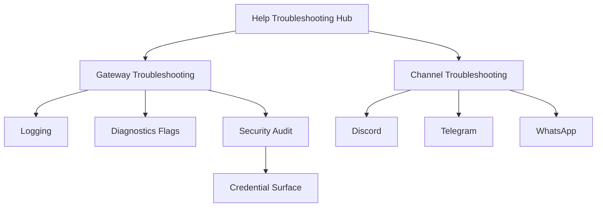
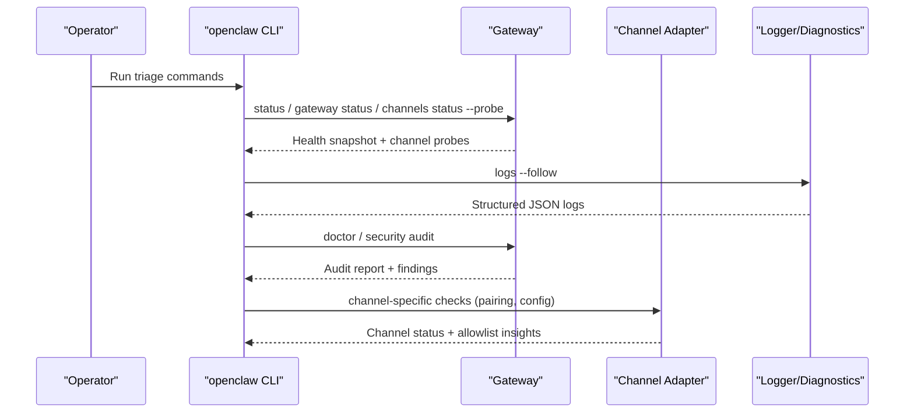
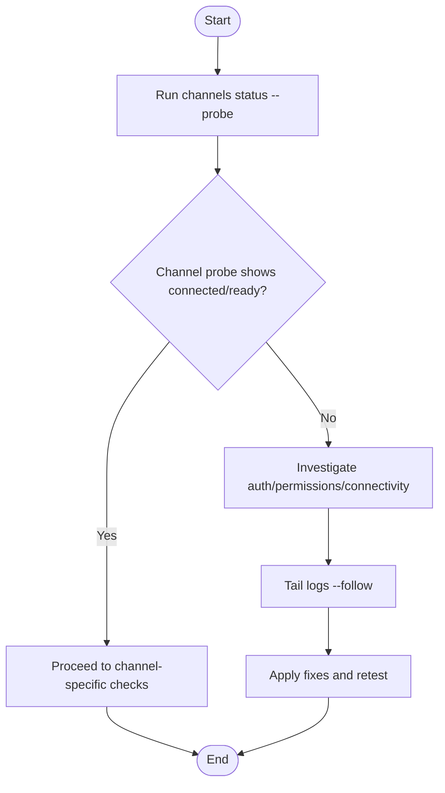
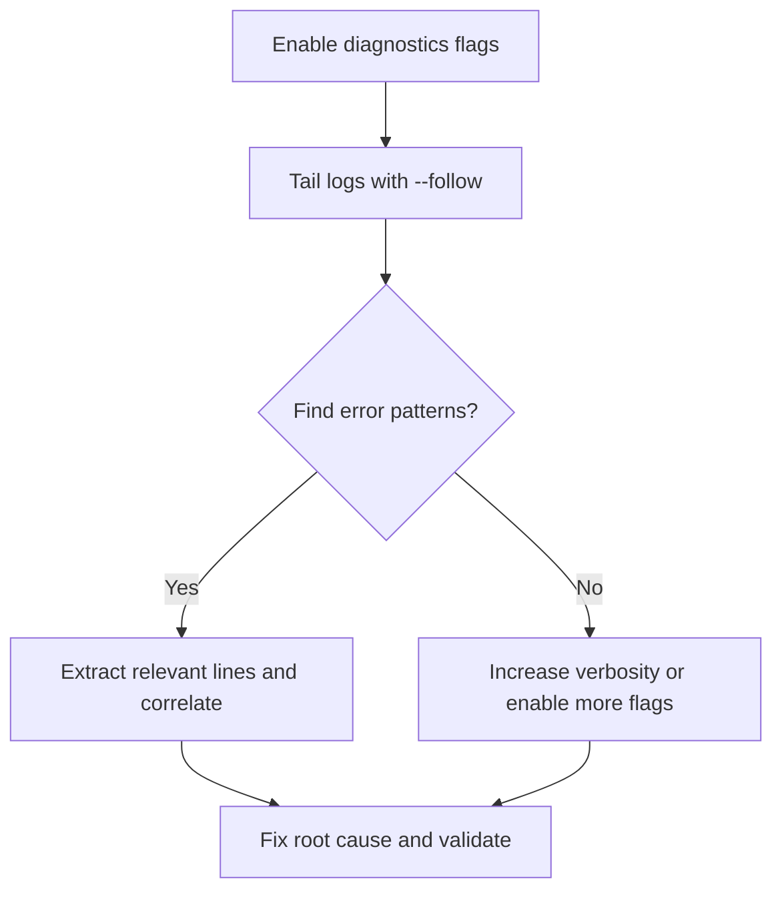
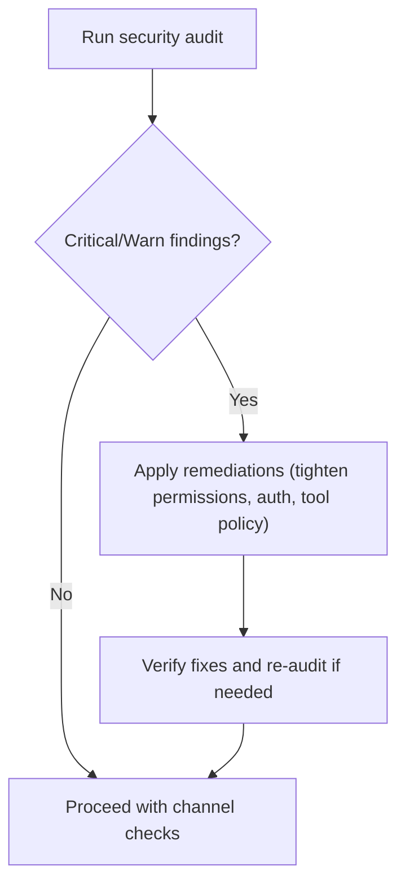
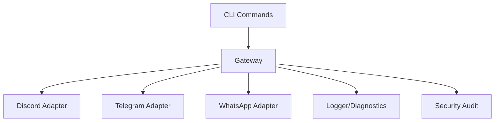

# Channel Troubleshooting

<cite>
**Referenced Files in This Document**
- [docs/help/troubleshooting.md](file://docs/help/troubleshooting.md)
- [docs/gateway/troubleshooting.md](file://docs/gateway/troubleshooting.md)
- [docs/channels/troubleshooting.md](file://docs/channels/troubleshooting.md)
- [docs/channels/discord.md](file://docs/channels/discord.md)
- [docs/channels/telegram.md](file://docs/channels/telegram.md)
- [docs/channels/whatsapp.md](file://docs/channels/whatsapp.md)
- [docs/nodes/troubleshooting.md](file://docs/nodes/troubleshooting.md)
- [docs/logging.md](file://docs/logging.md)
- [docs/diagnostics/flags.md](file://docs/diagnostics/flags.md)
- [src/agents/pi-embedded-helpers/failover-matches.ts](file://src/agents/pi-embedded-helpers/failover-matches.ts)
- [src/agents/pi-embedded-helpers/errors.ts](file://src/agents/pi-embedded-helpers/errors.ts)
- [src/security/audit.ts](file://src/security/audit.ts)
- [src/commands/status.command.ts](file://src/commands/status.command.ts)
- [apps/macos/Sources/OpenClaw/HealthStore.swift](file://apps/macos/Sources/OpenClaw/HealthStore.swift)
- [src/plugin-sdk/status-helpers.ts](file://src/plugin-sdk/status-helpers.ts)
- [docs/reference/secretref-credential-surface.md](file://docs/reference/secretref-credential-surface.md)
- [docs/gateway/security/index.md](file://docs/gateway/security/index.md)
</cite>

## Table of Contents
1. [Introduction](#introduction)
2. [Project Structure](#project-structure)
3. [Core Components](#core-components)
4. [Architecture Overview](#architecture-overview)
5. [Detailed Component Analysis](#detailed-component-analysis)
6. [Dependency Analysis](#dependency-analysis)
7. [Performance Considerations](#performance-considerations)
8. [Troubleshooting Guide](#troubleshooting-guide)
9. [Conclusion](#conclusion)
10. [Appendices](#appendices)

## Introduction
This document provides a comprehensive channel troubleshooting guide for OpenClaw across all supported platforms. It focuses on diagnosing and resolving authentication failures, connectivity issues, and message delivery problems. It includes platform-specific guidance for major channels (Discord, Telegram, WhatsApp), diagnostic procedures, log analysis techniques, performance monitoring, configuration pitfalls, rate limiting, and compliance considerations.

## Project Structure
OpenClaw organizes troubleshooting content across:
- Help and gateway runbooks for system-level diagnostics
- Channel-specific guides for platform nuances
- Logging and diagnostics documentation for observability
- Security and compliance guidance for safe operations

**Diagram sources**
- [docs/help/troubleshooting.md](file://docs/help/troubleshooting.md#L1-L298)
- [docs/gateway/troubleshooting.md](file://docs/gateway/troubleshooting.md#L1-L367)
- [docs/channels/troubleshooting.md](file://docs/channels/troubleshooting.md#L1-L118)
- [docs/logging.md](file://docs/logging.md#L1-L353)
- [docs/diagnostics/flags.md](file://docs/diagnostics/flags.md#L1-L92)
- [docs/gateway/security/index.md](file://docs/gateway/security/index.md#L1-L800)
- [docs/reference/secretref-credential-surface.md](file://docs/reference/secretref-credential-surface.md#L1-L130)

**Section sources**
- [docs/help/troubleshooting.md](file://docs/help/troubleshooting.md#L1-L298)
- [docs/gateway/troubleshooting.md](file://docs/gateway/troubleshooting.md#L1-L367)
- [docs/channels/troubleshooting.md](file://docs/channels/troubleshooting.md#L1-L118)
- [docs/logging.md](file://docs/logging.md#L1-L353)
- [docs/diagnostics/flags.md](file://docs/diagnostics/flags.md#L1-L92)
- [docs/gateway/security/index.md](file://docs/gateway/security/index.md#L1-L800)
- [docs/reference/secretref-credential-surface.md](file://docs/reference/secretref-credential-surface.md#L1-L130)

## Core Components
- Health and status reporting: runtime, RPC probe, channel probes, and last error aggregation
- Logging and diagnostics: structured JSON logs, console modes, and targeted diagnostics flags
- Security audit: automated checks for exposure, permissions, and policy drift
- Platform-specific channels: Discord, Telegram, WhatsApp with distinct access control and delivery rules
- Rate limit and billing error detection helpers for provider-side throttling

**Section sources**
- [apps/macos/Sources/OpenClaw/HealthStore.swift](file://apps/macos/Sources/OpenClaw/HealthStore.swift#L147-L195)
- [src/plugin-sdk/status-helpers.ts](file://src/plugin-sdk/status-helpers.ts#L125-L172)
- [docs/logging.md](file://docs/logging.md#L1-L353)
- [docs/diagnostics/flags.md](file://docs/diagnostics/flags.md#L1-L92)
- [src/security/audit.ts](file://src/security/audit.ts#L25-L1129)
- [src/agents/pi-embedded-helpers/failover-matches.ts](file://src/agents/pi-embedded-helpers/failover-matches.ts#L96-L132)
- [src/agents/pi-embedded-helpers/errors.ts](file://src/agents/pi-embedded-helpers/errors.ts#L211-L246)

## Architecture Overview
The troubleshooting workflow begins at the CLI and leverages the Gateway’s health snapshots, channel probes, and logs. Security audit and diagnostics flags refine the scope of investigation.

**Diagram sources**
- [docs/help/troubleshooting.md](file://docs/help/troubleshooting.md#L13-L25)
- [docs/gateway/troubleshooting.md](file://docs/gateway/troubleshooting.md#L14-L24)
- [docs/channels/troubleshooting.md](file://docs/channels/troubleshooting.md#L13-L23)
- [docs/logging.md](file://docs/logging.md#L40-L67)
- [src/security/audit.ts](file://src/security/audit.ts#L1093-L1129)

## Detailed Component Analysis

### Health and Status Reporting
- Runtime and RPC probe signals indicate whether the Gateway is reachable and responsive.
- Channel probes reflect configured state and recent probe outcomes.
- Last error aggregation surfaces runtime issues per channel.

**Diagram sources**
- [docs/help/troubleshooting.md](file://docs/help/troubleshooting.md#L13-L25)
- [src/plugin-sdk/status-helpers.ts](file://src/plugin-sdk/status-helpers.ts#L125-L172)

**Section sources**
- [apps/macos/Sources/OpenClaw/HealthStore.swift](file://apps/macos/Sources/OpenClaw/HealthStore.swift#L147-L195)
- [src/plugin-sdk/status-helpers.ts](file://src/plugin-sdk/status-helpers.ts#L125-L172)

### Logging and Diagnostics
- Tail logs via CLI or Control UI; switch between pretty, compact, JSON, and plain modes.
- Use diagnostics flags to target subsystems (e.g., telegram.http) without raising global verbosity.
- Export structured diagnostics via OTLP for metrics, traces, and logs.

**Diagram sources**
- [docs/logging.md](file://docs/logging.md#L40-L67)
- [docs/diagnostics/flags.md](file://docs/diagnostics/flags.md#L21-L41)

**Section sources**
- [docs/logging.md](file://docs/logging.md#L1-L353)
- [docs/diagnostics/flags.md](file://docs/diagnostics/flags.md#L1-L92)

### Security Audit and Compliance
- Run security audit to detect exposure risks, weak permissions, and policy drift.
- Use credential surface reference to validate SecretRef coverage and supported credentials.
- Apply remediations for high-severity findings before enabling broad tool access.

**Diagram sources**
- [src/security/audit.ts](file://src/security/audit.ts#L1093-L1129)
- [docs/gateway/security/index.md](file://docs/gateway/security/index.md#L26-L37)
- [docs/reference/secretref-credential-surface.md](file://docs/reference/secretref-credential-surface.md#L19-L96)

**Section sources**
- [src/security/audit.ts](file://src/security/audit.ts#L25-L1129)
- [src/commands/status.command.ts](file://src/commands/status.command.ts#L473-L508)
- [docs/gateway/security/index.md](file://docs/gateway/security/index.md#L1-L800)
- [docs/reference/secretref-credential-surface.md](file://docs/reference/secretref-credential-surface.md#L1-L130)

### Discord Troubleshooting
- Common symptoms: bot online but no guild replies, mention gating drops, DM pairing required.
- Checks: channel probe, mention requirements, allowlists, pairing approvals.
- Setup notes: intents, permissions, and privacy mode impacts.

**Section sources**
- [docs/channels/troubleshooting.md](file://docs/channels/troubleshooting.md#L56-L66)
- [docs/channels/discord.md](file://docs/channels/discord.md#L1-L800)

### Telegram Troubleshooting
- Common symptoms: bot silent in groups, privacy mode restrictions, network/API reachability issues.
- Checks: privacy mode, mention gating, DNS/IPv6 routing to api.telegram.org, allowlists.
- Setup notes: bot token, webhook vs long polling, inline buttons, exec approvals.

**Section sources**
- [docs/channels/troubleshooting.md](file://docs/channels/troubleshooting.md#L43-L54)
- [docs/channels/telegram.md](file://docs/channels/telegram.md#L1-L800)

### WhatsApp Troubleshooting
- Common symptoms: not linked, random disconnects, group messages ignored, Bun runtime warnings.
- Checks: QR linking, pairing approvals, group policies, mention gating, media limits.
- Setup notes: multi-account credentials, read receipts, ack reactions.

**Section sources**
- [docs/channels/troubleshooting.md](file://docs/channels/troubleshooting.md#L31-L41)
- [docs/channels/whatsapp.md](file://docs/channels/whatsapp.md#L1-L446)

### Node Troubleshooting
- Foreground-only capabilities on iOS/Android nodes.
- Permissions matrix for camera, screen, location, and system.run approvals.
- Pairing vs approvals distinction and recovery loop.

**Section sources**
- [docs/nodes/troubleshooting.md](file://docs/nodes/troubleshooting.md#L1-L115)

## Dependency Analysis
- CLI commands orchestrate health checks, logs, and security audit.
- Gateway aggregates channel probes and exposes health snapshots.
- Channel adapters encapsulate platform-specific policies and delivery rules.
- Diagnostics and logging provide observability for root cause analysis.

**Diagram sources**
- [docs/help/troubleshooting.md](file://docs/help/troubleshooting.md#L13-L25)
- [docs/gateway/troubleshooting.md](file://docs/gateway/troubleshooting.md#L14-L24)
- [docs/logging.md](file://docs/logging.md#L40-L67)
- [src/security/audit.ts](file://src/security/audit.ts#L1093-L1129)

**Section sources**
- [docs/help/troubleshooting.md](file://docs/help/troubleshooting.md#L1-L298)
- [docs/gateway/troubleshooting.md](file://docs/gateway/troubleshooting.md#L1-L367)
- [docs/logging.md](file://docs/logging.md#L1-L353)
- [src/security/audit.ts](file://src/security/audit.ts#L25-L1129)

## Performance Considerations
- Use targeted diagnostics flags to minimize log volume while capturing relevant signals.
- Tune logging levels to balance insight and overhead.
- Monitor queue depths and session stuck warnings to detect backpressure.
- Prefer modern, instruction-hardened models for tool-enabled agents to reduce prompt-injection risk and improve reliability.

[No sources needed since this section provides general guidance]

## Troubleshooting Guide

### Step-by-Step Command Ladder
Follow this order for rapid triage:
- Run status and gateway status to confirm runtime and RPC probe health.
- Tail logs to observe steady activity and recurring errors.
- Run doctor and security audit to detect exposure and policy drift.
- Probe channels to verify connectivity and configured state.
- Inspect pairing lists and channel allowlists for sender/device approvals.

**Section sources**
- [docs/help/troubleshooting.md](file://docs/help/troubleshooting.md#L13-L25)
- [docs/gateway/troubleshooting.md](file://docs/gateway/troubleshooting.md#L14-L24)
- [docs/channels/troubleshooting.md](file://docs/channels/troubleshooting.md#L13-L23)

### Authentication Failures
- Gateway connectivity and device auth:
  - Validate URL, auth mode, and secure context for Control UI.
  - Look for device nonce/signature errors and update clients to complete challenge-based flows.
- Channel-specific auth:
  - Discord: intents, permissions, and privacy mode.
  - Telegram: bot token reachability and privacy mode.
  - WhatsApp: QR linking and pairing approvals.

**Section sources**
- [docs/gateway/troubleshooting.md](file://docs/gateway/troubleshooting.md#L91-L137)
- [docs/channels/discord.md](file://docs/channels/discord.md#L36-L74)
- [docs/channels/telegram.md](file://docs/channels/telegram.md#L75-L103)
- [docs/channels/whatsapp.md](file://docs/channels/whatsapp.md#L374-L424)

### Connectivity Issues
- Gateway service not running:
  - Check runtime state, config/service mismatch, and port conflicts.
- Channel transport connectivity:
  - Confirm channel probe shows connected/ready.
  - Validate network reachability to provider endpoints (e.g., api.telegram.org).

**Section sources**
- [docs/gateway/troubleshooting.md](file://docs/gateway/troubleshooting.md#L139-L167)
- [docs/channels/troubleshooting.md](file://docs/channels/troubleshooting.md#L169-L199)

### Message Delivery Problems
- No replies:
  - Inspect mention gating, pairing requests, and allowlist blocks.
- Channel connected but messages not flowing:
  - Review DM policy, group allowlists, and missing permissions.
- Provider-side throttling:
  - Detect rate limit and billing error patterns; adjust model or credentials accordingly.

**Section sources**
- [docs/gateway/troubleshooting.md](file://docs/gateway/troubleshooting.md#L61-L90)
- [docs/gateway/troubleshooting.md](file://docs/gateway/troubleshooting.md#L169-L199)
- [src/agents/pi-embedded-helpers/failover-matches.ts](file://src/agents/pi-embedded-helpers/failover-matches.ts#L96-L132)
- [src/agents/pi-embedded-helpers/errors.ts](file://src/agents/pi-embedded-helpers/errors.ts#L211-L246)

### Log Analysis Techniques
- Live tail logs with CLI or Control UI; switch to JSON mode for parsing.
- Use diagnostics flags to narrow scope (e.g., telegram.http).
- Extract recent log lines around failures and correlate with channel events.

**Section sources**
- [docs/logging.md](file://docs/logging.md#L40-L67)
- [docs/diagnostics/flags.md](file://docs/diagnostics/flags.md#L65-L85)

### Performance Monitoring Approaches
- Enable diagnostics and export via OTLP for metrics and traces.
- Monitor queue depth, wait times, and session stuck warnings.
- Track model usage and message flow counters to identify bottlenecks.

**Section sources**
- [docs/logging.md](file://docs/logging.md#L142-L353)

### Common Configuration Errors
- Pairing and device identity:
  - Pending approvals for DMs or dashboard access.
- Policy drift:
  - Open group policies combined with elevated tools create high-impact vectors.
- Channel allowlists:
  - Empty or wildcard allowlists without explicit opt-in.

**Section sources**
- [docs/gateway/security/index.md](file://docs/gateway/security/index.md#L212-L261)
- [docs/channels/discord.md](file://docs/channels/discord.md#L368-L460)
- [docs/channels/telegram.md](file://docs/channels/telegram.md#L105-L161)
- [docs/channels/whatsapp.md](file://docs/channels/whatsapp.md#L134-L200)

### Rate Limiting and Compliance Violations
- Detect rate limit and billing error patterns in provider responses.
- Adjust model tier or credentials; configure fallback models when long-context requests are rejected.
- Maintain strict tool policies and sandboxing to reduce blast radius.

**Section sources**
- [src/agents/pi-embedded-helpers/failover-matches.ts](file://src/agents/pi-embedded-helpers/failover-matches.ts#L96-L132)
- [src/agents/pi-embedded-helpers/errors.ts](file://src/agents/pi-embedded-helpers/errors.ts#L211-L246)
- [docs/gateway/troubleshooting.md](file://docs/gateway/troubleshooting.md#L32-L59)
- [docs/gateway/security/index.md](file://docs/gateway/security/index.md#L566-L581)

### Preventive Maintenance Guidelines
- Regularly run security audit and apply remediations.
- Keep logging levels appropriate for environment; avoid excessive verbosity.
- Validate channel configurations after upgrades; reconcile allowlists and permissions.
- Use SecretRef for supported credentials and avoid unsupported surfaces.

**Section sources**
- [src/security/audit.ts](file://src/security/audit.ts#L1093-L1129)
- [docs/logging.md](file://docs/logging.md#L116-L124)
- [docs/reference/secretref-credential-surface.md](file://docs/reference/secretref-credential-surface.md#L19-L96)

## Conclusion
Effective channel troubleshooting in OpenClaw relies on a disciplined command ladder, robust logging and diagnostics, and strong security posture. By validating health snapshots, inspecting channel-specific policies, and applying targeted fixes, operators can resolve authentication, connectivity, and delivery issues quickly while maintaining compliance and minimizing risk.

[No sources needed since this section summarizes without analyzing specific files]

## Appendices

### Platform-Specific Quick Checks
- Discord: intents, permissions, privacy mode, mention gating.
- Telegram: privacy mode, webhook reachability, DNS/IPv6, allowlists.
- WhatsApp: QR linking, pairing approvals, group policies, media limits.

**Section sources**
- [docs/channels/discord.md](file://docs/channels/discord.md#L36-L74)
- [docs/channels/telegram.md](file://docs/channels/telegram.md#L75-L103)
- [docs/channels/whatsapp.md](file://docs/channels/whatsapp.md#L374-L424)