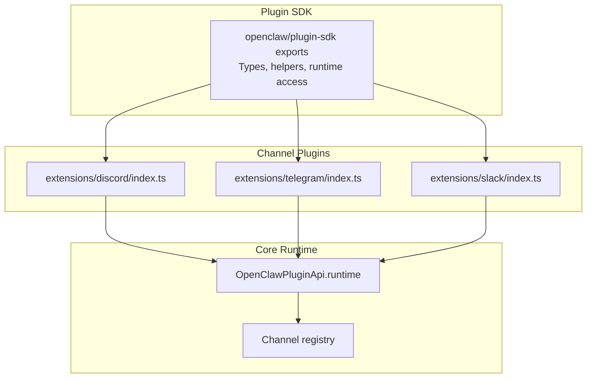
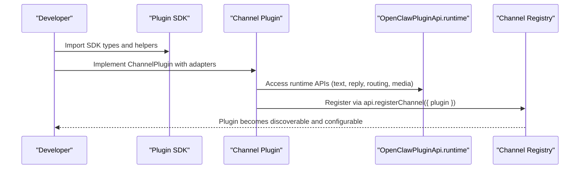
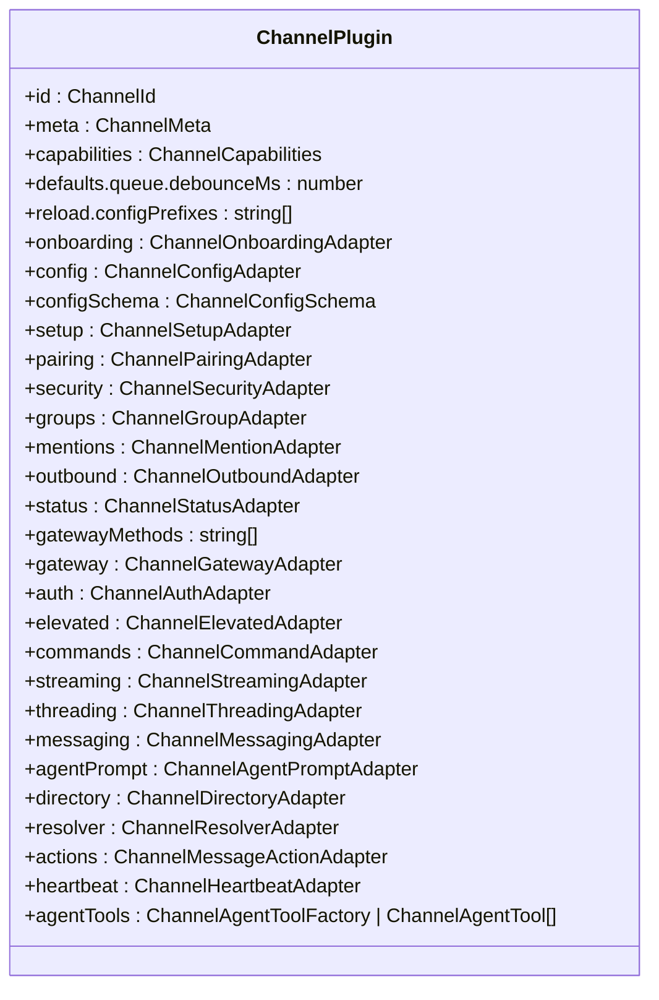
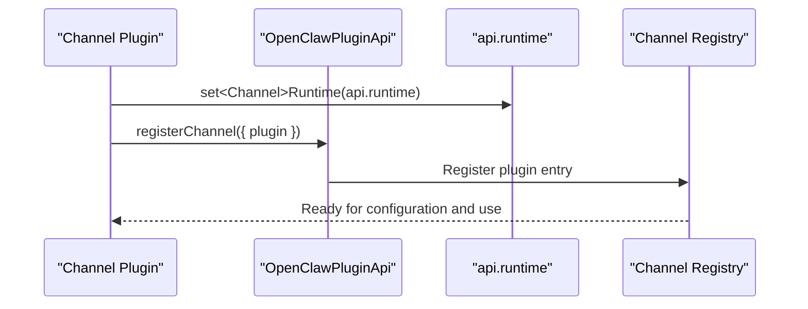
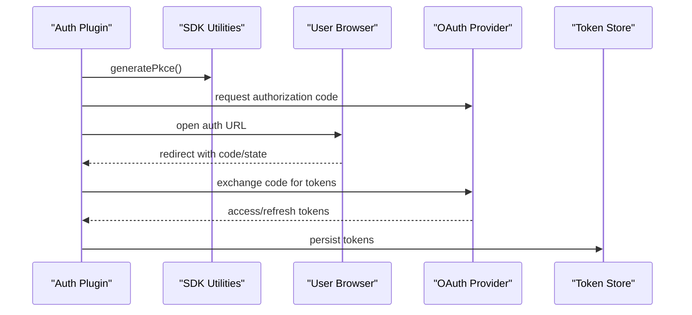
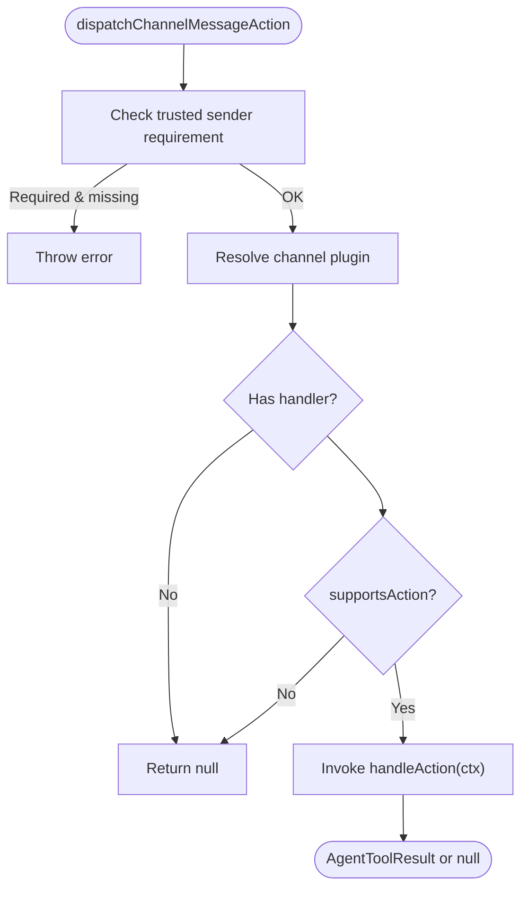
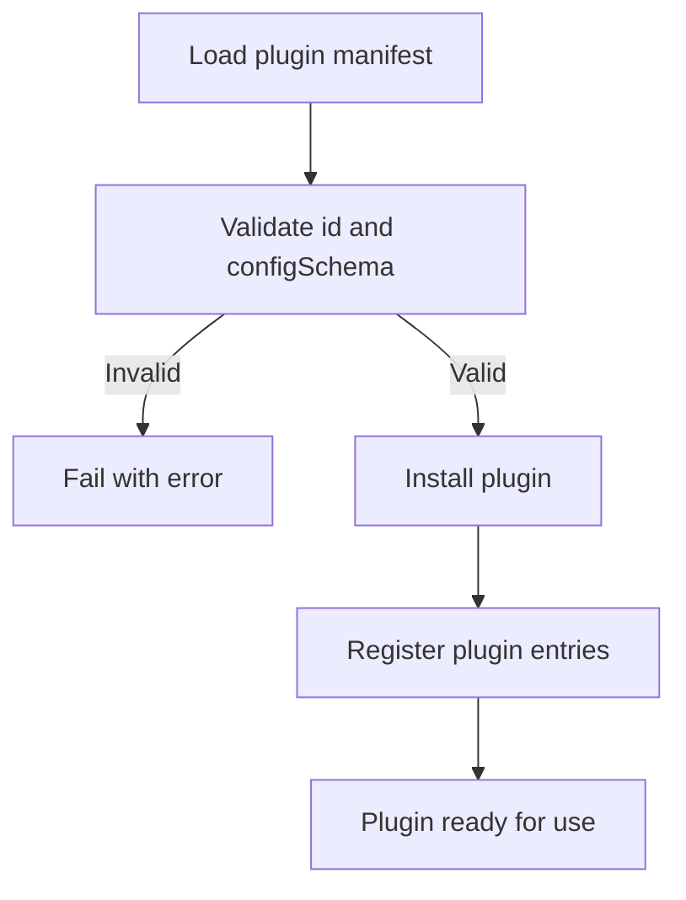
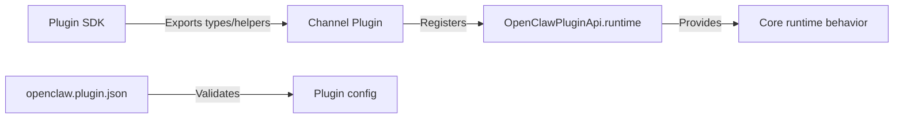

# Custom Channel Development

<cite>
**Referenced Files in This Document**
- [plugin-sdk.md](file://docs/refactor/plugin-sdk.md)
- [manifest.md](file://docs/plugins/manifest.md)
- [index.ts](file://src/plugin-sdk/index.ts)
- [types.plugin.ts](file://src/channels/plugins/types.plugin.ts)
- [types.ts](file://src/channels/plugins/types.ts)
- [message-actions.ts](file://src/channels/plugins/message-actions.ts)
- [install.ts](file://src/plugins/install.ts)
- [manifest.ts](file://src/plugins/manifest.ts)
- [discord/index.ts](file://extensions/discord/index.ts)
- [telegram/index.ts](file://extensions/telegram/index.ts)
- [slack/index.ts](file://extensions/slack/index.ts)
- [oauth.ts (google-gemini-cli-auth)](file://extensions/google-gemini-cli-auth/oauth.ts)
- [oauth.ts (minimax-portal-auth)](file://extensions/minimax-portal-auth/oauth.ts)
- [oauth.ts (qwen-portal-auth)](file://extensions/qwen-portal-auth/oauth.ts)
</cite>

## Table of Contents
1. [Introduction](#introduction)
2. [Project Structure](#project-structure)
3. [Core Components](#core-components)
4. [Architecture Overview](#architecture-overview)
5. [Detailed Component Analysis](#detailed-component-analysis)
6. [Dependency Analysis](#dependency-analysis)
7. [Performance Considerations](#performance-considerations)
8. [Troubleshooting Guide](#troubleshooting-guide)
9. [Conclusion](#conclusion)
10. [Appendices](#appendices)

## Introduction
This document explains how to build custom channel integrations for OpenClaw using the unified plugin SDK and runtime. It covers the channel plugin interface, authentication patterns, message processing workflows, plugin manifest requirements, and integration testing procedures. Step-by-step tutorials guide you through creating a custom channel, implementing authentication flows, and handling platform-specific features. Deployment, configuration management, and troubleshooting are also addressed.

## Project Structure
OpenClaw organizes channel connectors as plugins under the extensions/ directory. Each channel plugin registers itself via the plugin SDK’s OpenClawPluginApi and exposes a ChannelPlugin implementation. The SDK exports types, helpers, and runtime access points that plugins must use instead of importing core internals directly.

**Diagram sources**
- [index.ts](file://src/plugin-sdk/index.ts#L1-L812)
- [discord/index.ts](file://extensions/discord/index.ts#L1-L20)
- [telegram/index.ts](file://extensions/telegram/index.ts#L1-L18)
- [slack/index.ts](file://extensions/slack/index.ts#L1-L18)

**Section sources**
- [plugin-sdk.md](file://docs/refactor/plugin-sdk.md#L1-L215)
- [index.ts](file://src/plugin-sdk/index.ts#L1-L812)
- [discord/index.ts](file://extensions/discord/index.ts#L1-L20)
- [telegram/index.ts](file://extensions/telegram/index.ts#L1-L18)
- [slack/index.ts](file://extensions/slack/index.ts#L1-L18)

## Core Components
- ChannelPlugin interface: Defines the contract for a channel plugin, including metadata, capabilities, adapters for configuration, pairing, security, groups, mentions, outbound messaging, status, gateway, authentication, commands, streaming, threading, messaging, agent prompts, directory, resolvers, message actions, heartbeat, and agent tools.
- Plugin SDK exports: Provides types, helpers, and runtime accessors that plugins must use. Examples include adapters for auth, outbound, mentions, groups, and media utilities.
- Manifest and installation: Every plugin must ship a manifest (openclaw.plugin.json) with a strict JSON Schema for configuration validation. Installation enforces plugin id correctness and manifest integrity.

Key responsibilities:
- Define ChannelPlugin with optional adapters for each capability.
- Use SDK helpers for configuration, onboarding, pairing, and security.
- Provide a minimal runtime surface via OpenClawPluginApi.runtime.
- Ship a manifest with a valid configSchema.

**Section sources**
- [types.plugin.ts](file://src/channels/plugins/types.plugin.ts#L48-L85)
- [types.ts](file://src/channels/plugins/types.ts#L7-L66)
- [index.ts](file://src/plugin-sdk/index.ts#L1-L812)
- [manifest.md](file://docs/plugins/manifest.md#L1-L76)
- [manifest.ts](file://src/plugins/manifest.ts#L45-L88)
- [install.ts](file://src/plugins/install.ts#L224-L260)

## Architecture Overview
The plugin architecture separates concerns into two layers:
- Plugin SDK: Stable, compile-time API with types and helpers.
- Plugin Runtime: Controlled access to core runtime behavior via OpenClawPluginApi.runtime.

Channel plugins register themselves and rely on SDK helpers for configuration, onboarding, pairing, and security. Authentication flows leverage SDK utilities for PKCE and secure HTTP requests.

**Diagram sources**
- [plugin-sdk.md](file://docs/refactor/plugin-sdk.md#L40-L145)
- [index.ts](file://src/plugin-sdk/index.ts#L1-L812)
- [discord/index.ts](file://extensions/discord/index.ts#L12-L16)

**Section sources**
- [plugin-sdk.md](file://docs/refactor/plugin-sdk.md#L1-L215)
- [index.ts](file://src/plugin-sdk/index.ts#L1-L812)

## Detailed Component Analysis

### Channel Plugin Interface
The ChannelPlugin type aggregates optional adapters for all channel capabilities. Implementations choose which adapters to provide based on platform support.

**Diagram sources**
- [types.plugin.ts](file://src/channels/plugins/types.plugin.ts#L48-L85)

**Section sources**
- [types.plugin.ts](file://src/channels/plugins/types.plugin.ts#L48-L85)
- [types.ts](file://src/channels/plugins/types.ts#L7-L66)

### Plugin Registration and Runtime Access
Channel plugins register themselves using OpenClawPluginApi and set the runtime for platform-specific behavior.

**Diagram sources**
- [discord/index.ts](file://extensions/discord/index.ts#L12-L16)
- [telegram/index.ts](file://extensions/telegram/index.ts#L11-L14)
- [slack/index.ts](file://extensions/slack/index.ts#L11-L14)

**Section sources**
- [discord/index.ts](file://extensions/discord/index.ts#L1-L20)
- [telegram/index.ts](file://extensions/telegram/index.ts#L1-L18)
- [slack/index.ts](file://extensions/slack/index.ts#L1-L18)

### Authentication Patterns
OpenClaw provides several authentication flows leveraging SDK utilities for PKCE and secure HTTP requests. These patterns are reusable across plugins.

- Google Gemini CLI OAuth: Demonstrates PKCE, local callback handling, and project discovery.
- MiniMax Portal OAuth: Implements device code flow with polling and state verification.
- Qwen Portal OAuth: Uses device code flow with backoff and user-code approval.

**Diagram sources**
- [oauth.ts (google-gemini-cli-auth)](file://extensions/google-gemini-cli-auth/oauth.ts#L221-L275)
- [oauth.ts (minimax-portal-auth)](file://extensions/minimax-portal-auth/oauth.ts#L56-L101)
- [oauth.ts (qwen-portal-auth)](file://extensions/qwen-portal-auth/oauth.ts#L136-L182)

**Section sources**
- [oauth.ts (google-gemini-cli-auth)](file://extensions/google-gemini-cli-auth/oauth.ts#L1-L735)
- [oauth.ts (minimax-portal-auth)](file://extensions/minimax-portal-auth/oauth.ts#L1-L245)
- [oauth.ts (qwen-portal-auth)](file://extensions/qwen-portal-auth/oauth.ts#L1-L183)

### Message Actions Workflow
Message actions enable interactive features (buttons, cards) and tool-driven actions. The system validates trusted requester senders for sensitive actions and delegates to the channel plugin.

**Diagram sources**
- [message-actions.ts](file://src/channels/plugins/message-actions.ts#L87-L103)

**Section sources**
- [message-actions.ts](file://src/channels/plugins/message-actions.ts#L1-L104)

### Plugin Manifest and Installation
Every plugin must ship a manifest (openclaw.plugin.json) with a strict JSON Schema for configuration validation. Installation enforces plugin id correctness and manifest integrity.

**Diagram sources**
- [manifest.ts](file://src/plugins/manifest.ts#L45-L88)
- [install.ts](file://src/plugins/install.ts#L224-L260)

**Section sources**
- [manifest.md](file://docs/plugins/manifest.md#L1-L76)
- [manifest.ts](file://src/plugins/manifest.ts#L45-L88)
- [install.ts](file://src/plugins/install.ts#L224-L260)

## Dependency Analysis
- SDK-to-Core separation: Plugins import only SDK exports; they never import core internals directly.
- Runtime access: Plugins access core behavior exclusively via OpenClawPluginApi.runtime.
- Manifest-first validation: Configuration is validated against the manifest schema before plugin code runs.

**Diagram sources**
- [plugin-sdk.md](file://docs/refactor/plugin-sdk.md#L11-L145)
- [index.ts](file://src/plugin-sdk/index.ts#L1-L812)

**Section sources**
- [plugin-sdk.md](file://docs/refactor/plugin-sdk.md#L1-L215)
- [index.ts](file://src/plugin-sdk/index.ts#L1-L812)

## Performance Considerations
- Debounce inbound processing: Use SDK-provided debouncers to batch inbound events and reduce redundant work.
- Media limits: Respect channel-specific media size limits to avoid oversized payloads.
- Rate limiting and anomaly detection: Use SDK utilities for webhook rate limiting and anomaly tracking.
- Text chunking: Use SDK helpers to chunk text according to channel limits.

[No sources needed since this section provides general guidance]

## Troubleshooting Guide
Common issues and resolutions:
- Manifest errors: Ensure openclaw.plugin.json exists and contains a valid configSchema. Unknown channel ids or invalid plugin ids will fail validation.
- Plugin id mismatch: Installation compares the manifest id with the expected id; mismatches cause installation failure.
- Authentication failures: Verify PKCE state, redirect URIs, and provider scopes. Handle local callback server conflicts by falling back to manual mode.
- Message action errors: For sensitive actions, ensure trusted requester sender identity is present in tool-driven contexts.

**Section sources**
- [manifest.md](file://docs/plugins/manifest.md#L53-L62)
- [install.ts](file://src/plugins/install.ts#L254-L260)
- [oauth.ts (google-gemini-cli-auth)](file://extensions/google-gemini-cli-auth/oauth.ts#L714-L733)
- [message-actions.ts](file://src/channels/plugins/message-actions.ts#L90-L94)

## Conclusion
OpenClaw’s plugin SDK and runtime provide a consistent, stable surface for building channel integrations. By adhering to the ChannelPlugin interface, shipping a manifest with a strict config schema, and leveraging SDK helpers for authentication and runtime access, developers can implement robust, maintainable channel connectors. The provided patterns and examples serve as templates for new channels and platform-specific features.

[No sources needed since this section summarizes without analyzing specific files]

## Appendices

### Step-by-Step Tutorial: Creating a Custom Channel
1. Define the ChannelPlugin
   - Implement required adapters (config, messaging, outbound, auth, etc.) based on platform support.
   - Export ChannelPlugin with meta, capabilities, and optional adapters.

2. Build the Plugin Manifest
   - Create openclaw.plugin.json with id and configSchema.
   - Include uiHints for configuration UI rendering if applicable.

3. Register the Plugin
   - In the plugin entry file, call api.registerChannel({ plugin }) after setting the runtime.

4. Implement Authentication
   - Use SDK utilities for PKCE and secure HTTP requests.
   - Handle redirects and token exchange; persist tokens securely.

5. Integrate Message Actions
   - Implement actions adapter and handleAction for interactive features.
   - Enforce trusted sender requirements for sensitive actions.

6. Test and Deploy
   - Validate manifest and config schema.
   - Run integration tests and smoke checks.
   - Install and register the plugin in the OpenClaw environment.

**Section sources**
- [types.plugin.ts](file://src/channels/plugins/types.plugin.ts#L48-L85)
- [manifest.md](file://docs/plugins/manifest.md#L18-L46)
- [discord/index.ts](file://extensions/discord/index.ts#L12-L16)
- [oauth.ts (google-gemini-cli-auth)](file://extensions/google-gemini-cli-auth/oauth.ts#L659-L734)
- [message-actions.ts](file://src/channels/plugins/message-actions.ts#L87-L103)