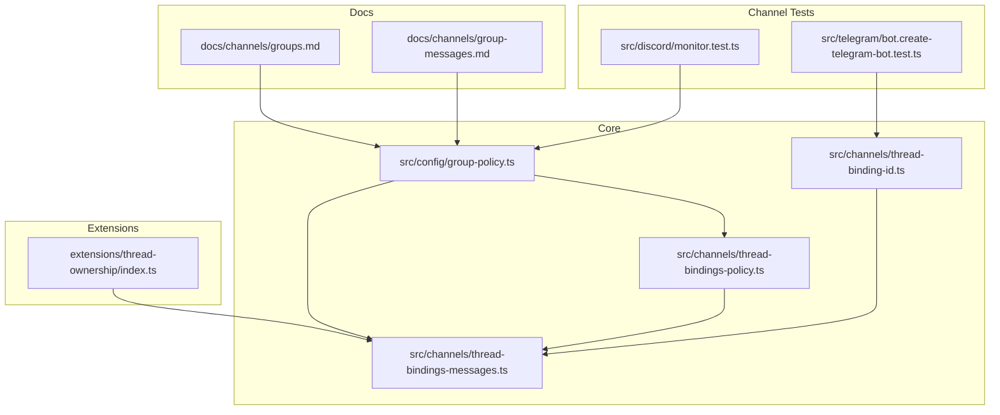
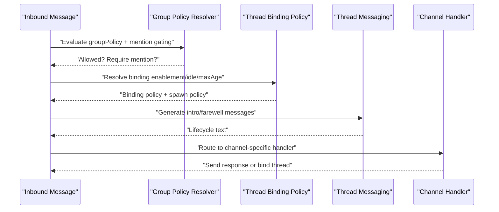
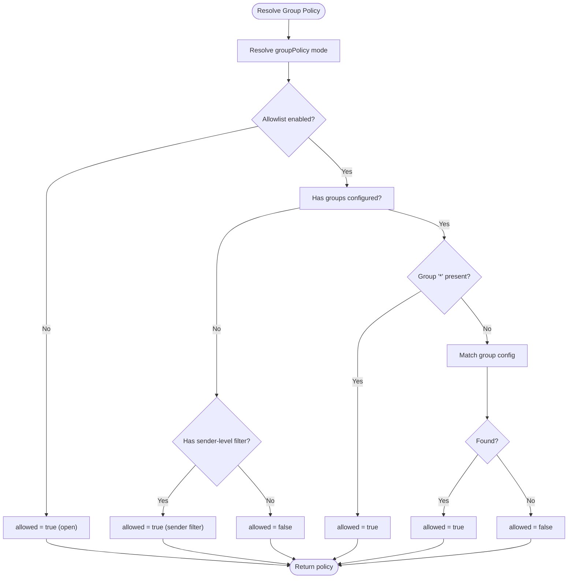
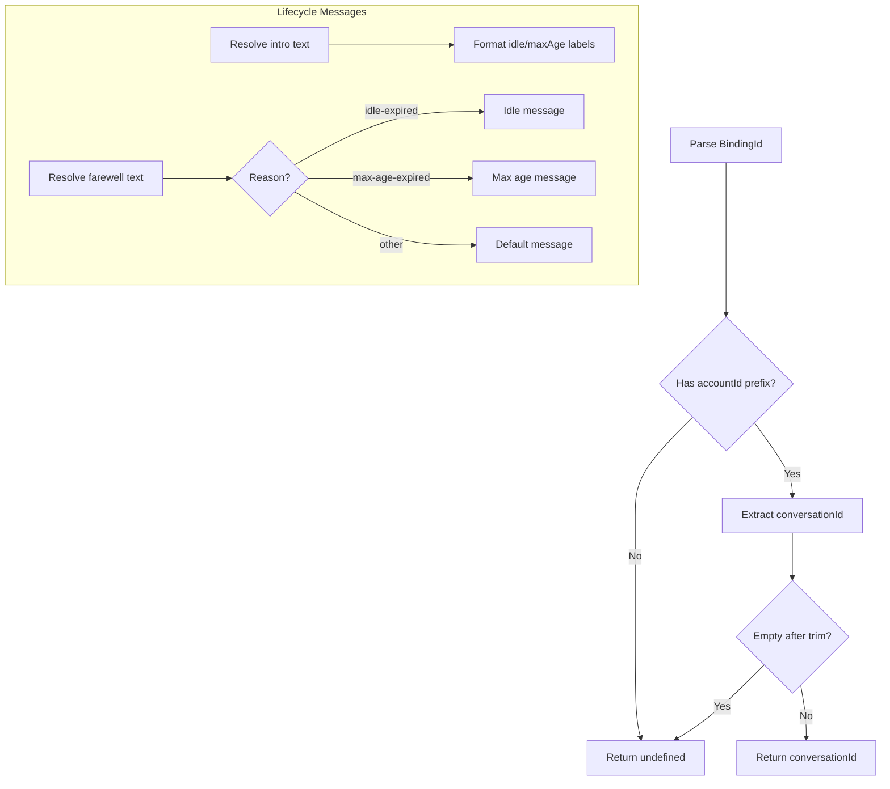
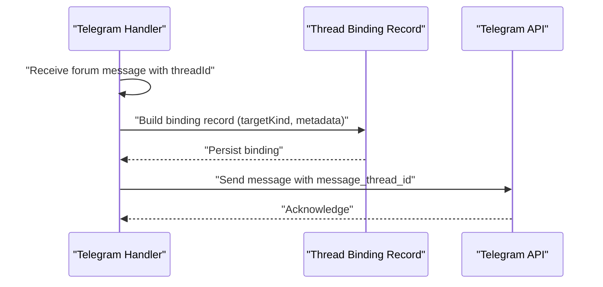
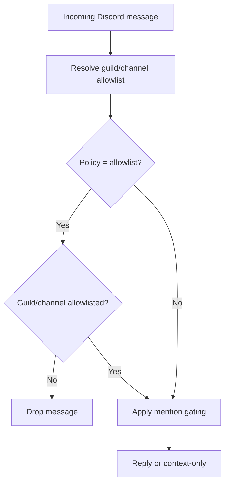
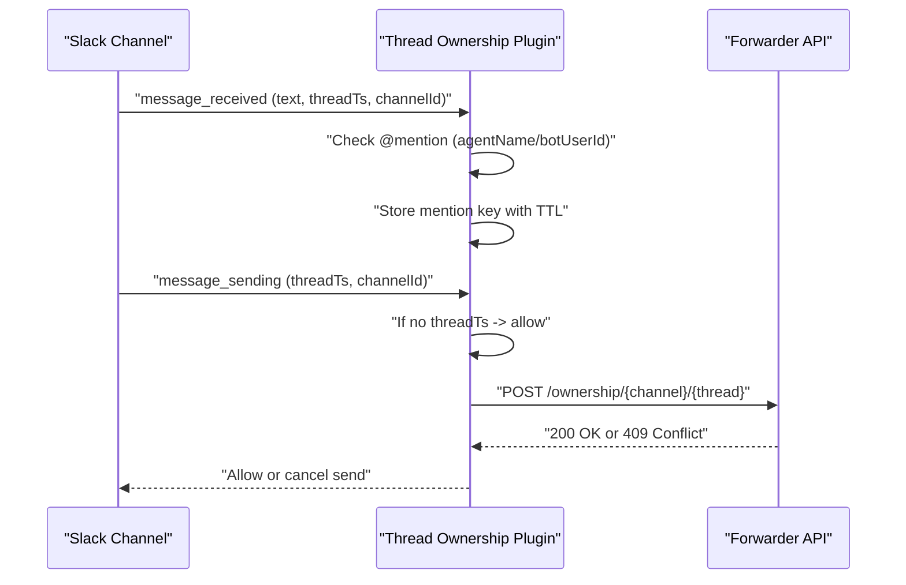
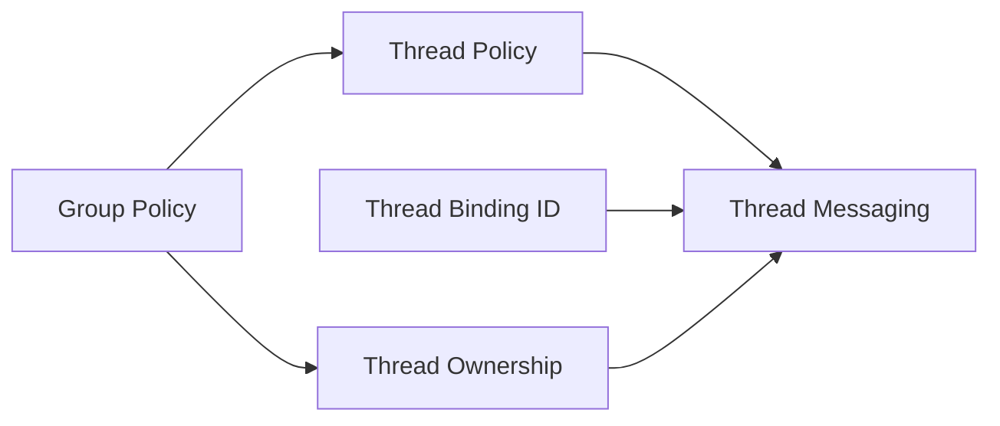

# Group & Thread Management

<cite>
**Referenced Files in This Document**
- [docs/channels/groups.md](file://docs/channels/groups.md)
- [docs/channels/group-messages.md](file://docs/channels/group-messages.md)
- [src/config/group-policy.ts](file://src/config/group-policy.ts)
- [src/channels/thread-binding-id.ts](file://src/channels/thread-binding-id.ts)
- [src/channels/thread-bindings-messages.ts](file://src/channels/thread-bindings-messages.ts)
- [src/channels/thread-bindings-policy.ts](file://src/channels/thread-bindings-policy.ts)
- [extensions/thread-ownership/index.ts](file://extensions/thread-ownership/index.ts)
- [src/discord/monitor.test.ts](file://src/discord/monitor.test.ts)
- [src/telegram/bot.create-telegram-bot.test.ts](file://src/telegram/bot.create-telegram-bot.test.ts)
- [src/telegram/thread-bindings.ts](file://src/telegram/thread-bindings.ts)
</cite>

## Table of Contents
1. [Introduction](#introduction)
2. [Project Structure](#project-structure)
3. [Core Components](#core-components)
4. [Architecture Overview](#architecture-overview)
5. [Detailed Component Analysis](#detailed-component-analysis)
6. [Dependency Analysis](#dependency-analysis)
7. [Performance Considerations](#performance-considerations)
8. [Troubleshooting Guide](#troubleshooting-guide)
9. [Conclusion](#conclusion)
10. [Appendices](#appendices)

## Introduction
This document explains how OpenClaw manages multi-user conversations, group messaging, and threads across channels. It covers:
- Thread binding mechanisms for persistent routing
- Conversation labeling and lifecycle messaging
- Group state management and session scoping
- Channel-specific group behaviors, permissions, and moderation
- Configuration examples for group policies, member management, and thread isolation
- Security, privacy, and compliance considerations

## Project Structure
OpenClaw centralizes group and thread logic in configuration resolvers, channel-specific policies, and extension-driven enforcement. Key areas:
- Group policy resolution and tool policy by sender
- Thread binding configuration and lifecycle messaging
- Channel-specific thread handling (Telegram forum topics, Discord threads)
- Multi-agent thread ownership enforcement via an extension

**Diagram sources**
- [docs/channels/groups.md](file://docs/channels/groups.md#L1-L380)
- [docs/channels/group-messages.md](file://docs/channels/group-messages.md#L1-L85)
- [src/config/group-policy.ts](file://src/config/group-policy.ts#L1-L429)
- [src/channels/thread-binding-id.ts](file://src/channels/thread-binding-id.ts#L1-L16)
- [src/channels/thread-bindings-messages.ts](file://src/channels/thread-bindings-messages.ts#L1-L114)
- [src/channels/thread-bindings-policy.ts](file://src/channels/thread-bindings-policy.ts#L1-L202)
- [extensions/thread-ownership/index.ts](file://extensions/thread-ownership/index.ts#L1-L134)
- [src/discord/monitor.test.ts](file://src/discord/monitor.test.ts#L528-L574)
- [src/telegram/bot.create-telegram-bot.test.ts](file://src/telegram/bot.create-telegram-bot.test.ts#L1466-L1477)

**Section sources**
- [docs/channels/groups.md](file://docs/channels/groups.md#L1-L380)
- [docs/channels/group-messages.md](file://docs/channels/group-messages.md#L1-L85)

## Core Components
- Group policy resolver: evaluates allowlist policies, mention gating, and per-group/per-default overrides.
- Thread binding policy: resolves enablement, idle timeout, max age, and spawn policies per channel/account.
- Thread binding messaging: generates lifecycle and farewell messages for thread-bound sessions.
- Thread binding ID parsing: extracts conversation IDs from binding identifiers.
- Thread ownership extension: enforces multi-agent thread ownership and concurrency control.

**Section sources**
- [src/config/group-policy.ts](file://src/config/group-policy.ts#L1-L429)
- [src/channels/thread-bindings-policy.ts](file://src/channels/thread-bindings-policy.ts#L1-L202)
- [src/channels/thread-bindings-messages.ts](file://src/channels/thread-bindings-messages.ts#L1-L114)
- [src/channels/thread-binding-id.ts](file://src/channels/thread-binding-id.ts#L1-L16)
- [extensions/thread-ownership/index.ts](file://extensions/thread-ownership/index.ts#L1-L134)

## Architecture Overview
High-level flow for group and thread handling:
- Inbound messages are evaluated against group policy and mention gating.
- Optional thread binding determines persistent routing to a session.
- Lifecycle messages inform participants about session activity and termination.
- Channel-specific behaviors (e.g., Telegram forum topics, Discord threads) are enforced by tests and channel implementations.

**Diagram sources**
- [src/config/group-policy.ts](file://src/config/group-policy.ts#L325-L389)
- [src/channels/thread-bindings-policy.ts](file://src/channels/thread-bindings-policy.ts#L53-L138)
- [src/channels/thread-bindings-messages.ts](file://src/channels/thread-bindings-messages.ts#L41-L113)
- [src/telegram/thread-bindings.ts](file://src/telegram/thread-bindings.ts#L161-L198)

## Detailed Component Analysis

### Group Policy Resolution
Group policy is resolved per channel and account, with support for:
- Allowlist modes: open, disabled, allowlist
- Per-group and default configurations
- Mention gating overrides
- Tool policy by sender with typed keys

**Diagram sources**
- [src/config/group-policy.ts](file://src/config/group-policy.ts#L303-L359)

**Section sources**
- [src/config/group-policy.ts](file://src/config/group-policy.ts#L1-L429)
- [docs/channels/groups.md](file://docs/channels/groups.md#L128-L201)

### Thread Binding Mechanisms
Thread binding enables persistent routing of messages to a session:
- Binding ID parsing ensures account-scoped conversation IDs.
- Lifecycle messaging informs participants about session status and termination.
- Spawn policies control whether subagent or ACP sessions can be spawned within a thread.

**Diagram sources**
- [src/channels/thread-binding-id.ts](file://src/channels/thread-binding-id.ts#L1-L16)
- [src/channels/thread-bindings-messages.ts](file://src/channels/thread-bindings-messages.ts#L17-L113)
- [src/channels/thread-bindings-policy.ts](file://src/channels/thread-bindings-policy.ts#L53-L138)

**Section sources**
- [src/channels/thread-binding-id.ts](file://src/channels/thread-binding-id.ts#L1-L16)
- [src/channels/thread-bindings-messages.ts](file://src/channels/thread-bindings-messages.ts#L1-L114)
- [src/channels/thread-bindings-policy.ts](file://src/channels/thread-bindings-policy.ts#L1-L202)

### Channel-Specific Behaviors

#### Telegram Forum Topics
- Forum topics are supported with thread IDs; tests verify message thread ID propagation.
- Thread binding records capture target kinds and metadata for routing.

**Diagram sources**
- [src/telegram/bot.create-telegram-bot.test.ts](file://src/telegram/bot.create-telegram-bot.test.ts#L1466-L1477)
- [src/telegram/thread-bindings.ts](file://src/telegram/thread-bindings.ts#L161-L198)

**Section sources**
- [src/telegram/bot.create-telegram-bot.test.ts](file://src/telegram/bot.create-telegram-bot.test.ts#L1466-L1477)
- [src/telegram/thread-bindings.ts](file://src/telegram/thread-bindings.ts#L161-L198)

#### Discord Threads and Group Policy Gating
- Group policy gating tests demonstrate allowlist evaluation and channel allowlists.
- Thread binding policies differentiate Discord from other channels.

**Diagram sources**
- [src/discord/monitor.test.ts](file://src/discord/monitor.test.ts#L528-L574)
- [src/channels/thread-bindings-policy.ts](file://src/channels/thread-bindings-policy.ts#L109-L138)

**Section sources**
- [src/discord/monitor.test.ts](file://src/discord/monitor.test.ts#L528-L574)
- [src/channels/thread-bindings-policy.ts](file://src/channels/thread-bindings-policy.ts#L1-L202)

### Multi-Agent Thread Ownership
The thread ownership extension enforces exclusive ownership of Slack threads among agents:
- Tracks recent mentions to allow immediate replies.
- Claims ownership via a forwarder API; cancels sends if another agent owns the thread.

**Diagram sources**
- [extensions/thread-ownership/index.ts](file://extensions/thread-ownership/index.ts#L63-L132)

**Section sources**
- [extensions/thread-ownership/index.ts](file://extensions/thread-ownership/index.ts#L1-L134)

## Dependency Analysis
- Group policy depends on channel configuration and account scoping.
- Thread binding policy depends on channel and session scopes, with defaults.
- Thread binding messaging depends on policy-derived durations and labels.
- Thread ownership extension depends on environment variables and a forwarder service.

**Diagram sources**
- [src/config/group-policy.ts](file://src/config/group-policy.ts#L325-L429)
- [src/channels/thread-bindings-policy.ts](file://src/channels/thread-bindings-policy.ts#L53-L138)
- [src/channels/thread-bindings-messages.ts](file://src/channels/thread-bindings-messages.ts#L41-L113)
- [src/channels/thread-binding-id.ts](file://src/channels/thread-binding-id.ts#L1-L16)
- [extensions/thread-ownership/index.ts](file://extensions/thread-ownership/index.ts#L42-L132)

**Section sources**
- [src/config/group-policy.ts](file://src/config/group-policy.ts#L1-L429)
- [src/channels/thread-bindings-policy.ts](file://src/channels/thread-bindings-policy.ts#L1-L202)
- [src/channels/thread-bindings-messages.ts](file://src/channels/thread-bindings-messages.ts#L1-L114)
- [src/channels/thread-binding-id.ts](file://src/channels/thread-binding-id.ts#L1-L16)
- [extensions/thread-ownership/index.ts](file://extensions/thread-ownership/index.ts#L1-L134)

## Performance Considerations
- Group policy evaluation is O(1) per message with minimal lookups.
- Thread binding caches compiled sender policies to avoid repeated parsing.
- Lifecycle message formatting is constant-time string operations.
- Thread ownership checks involve a small HTTP call; timeouts and fail-open behavior prevent blocking.

[No sources needed since this section provides general guidance]

## Troubleshooting Guide
- Group policy gating:
  - Verify groupPolicy mode and allowlists for the channel.
  - Confirm per-group or default requireMention settings.
  - Check sender-level filters and channel-specific allowlists.
- Thread binding:
  - Ensure binding IDs include the correct account prefix.
  - Confirm idle/maxAge settings align with expectations.
  - Validate spawn policies for subagent/ACP sessions.
- Multi-agent thread ownership:
  - Confirm forwarder URL and environment variables.
  - Review TTL and recent mention tracking behavior.
  - Inspect logs for ownership claim failures.

**Section sources**
- [src/config/group-policy.ts](file://src/config/group-policy.ts#L325-L429)
- [src/channels/thread-binding-id.ts](file://src/channels/thread-binding-id.ts#L1-L16)
- [src/channels/thread-bindings-policy.ts](file://src/channels/thread-bindings-policy.ts#L178-L202)
- [extensions/thread-ownership/index.ts](file://extensions/thread-ownership/index.ts#L104-L132)

## Conclusion
OpenClaw provides a unified framework for group and thread management across channels:
- Flexible group policies and mention gating
- Persistent thread binding with lifecycle messaging
- Channel-specific behaviors (Telegram forums, Discord threads)
- Multi-agent thread ownership enforcement
- Strong configuration extensibility for member management, tool restrictions, and isolation

[No sources needed since this section summarizes without analyzing specific files]

## Appendices

### Configuration Examples and Best Practices
- Group policy and allowlists:
  - Use groupPolicy modes and groupAllowFrom to control access.
  - Leverage per-group and default requireMention settings.
- Thread binding:
  - Configure idle hours and max age to balance persistence and resource usage.
  - Enable spawn policies for subagent/ACP sessions when needed.
- Tool restrictions:
  - Apply group/channel tool policies and per-sender overrides.
- Security and privacy:
  - Restrict tool access in group contexts.
  - Use sandboxing for group sessions to isolate host access.
  - Enforce multi-agent thread ownership to prevent conflicts.

**Section sources**
- [docs/channels/groups.md](file://docs/channels/groups.md#L128-L294)
- [docs/channels/group-messages.md](file://docs/channels/group-messages.md#L24-L55)
- [src/channels/thread-bindings-policy.ts](file://src/channels/thread-bindings-policy.ts#L53-L138)
- [src/channels/thread-bindings-messages.ts](file://src/channels/thread-bindings-messages.ts#L41-L113)