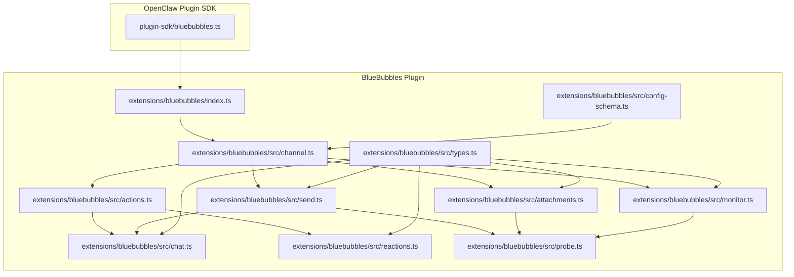
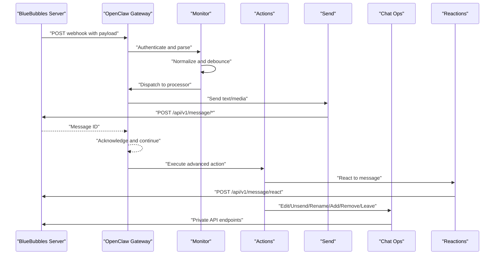
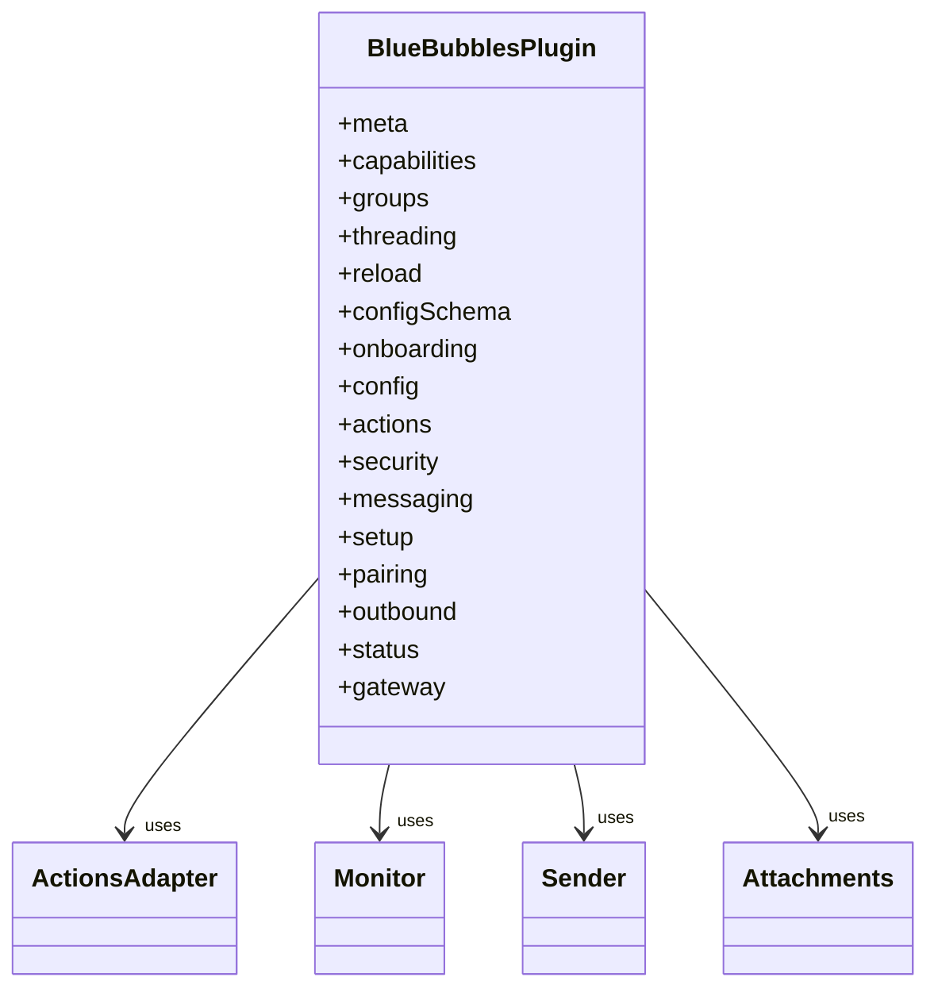
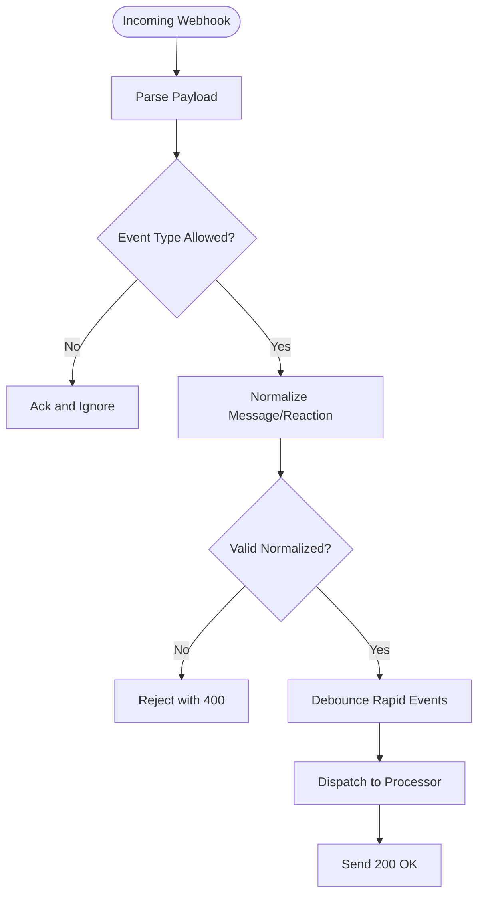
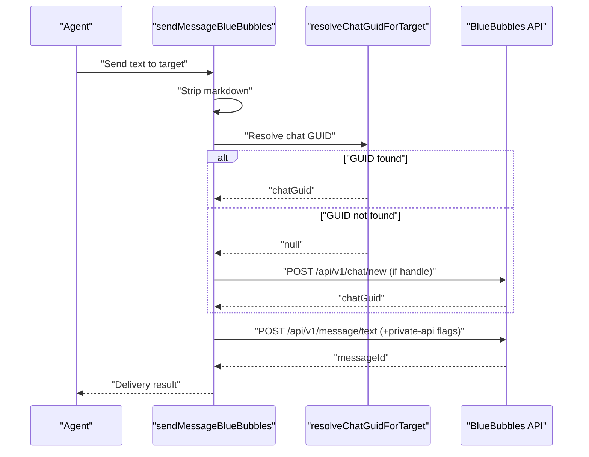
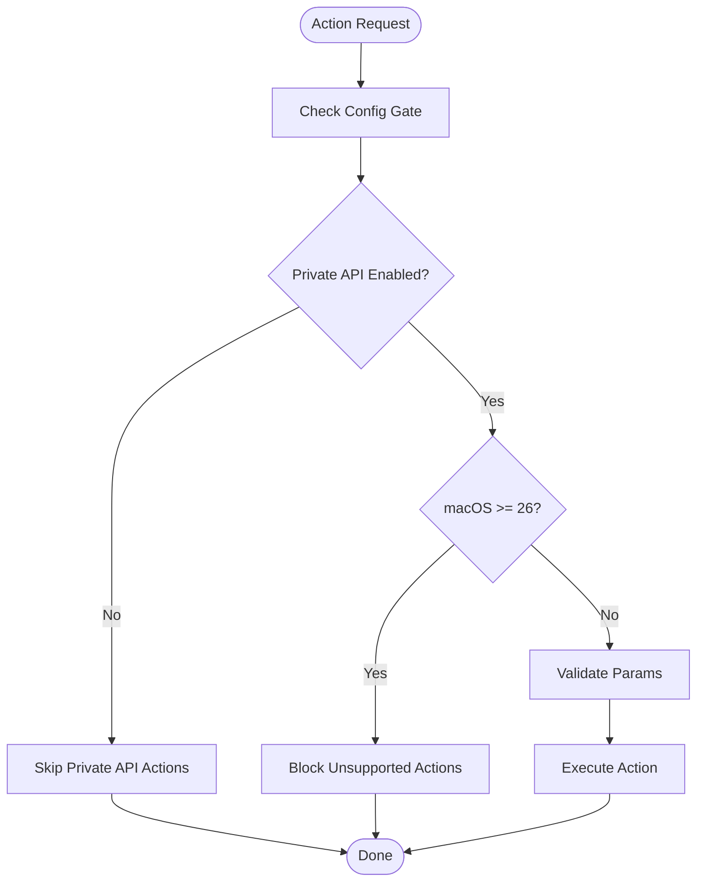
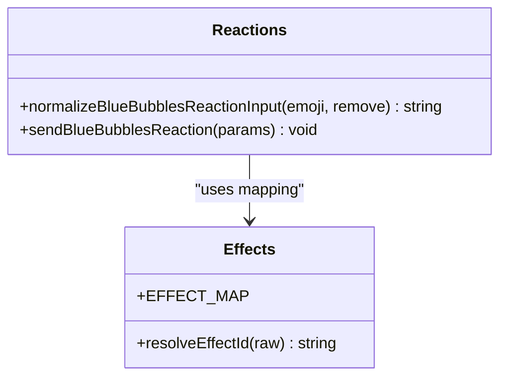
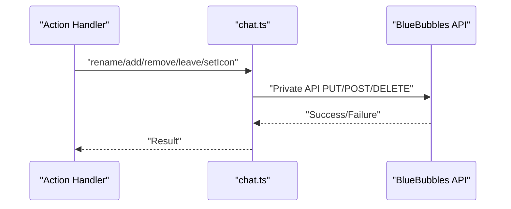
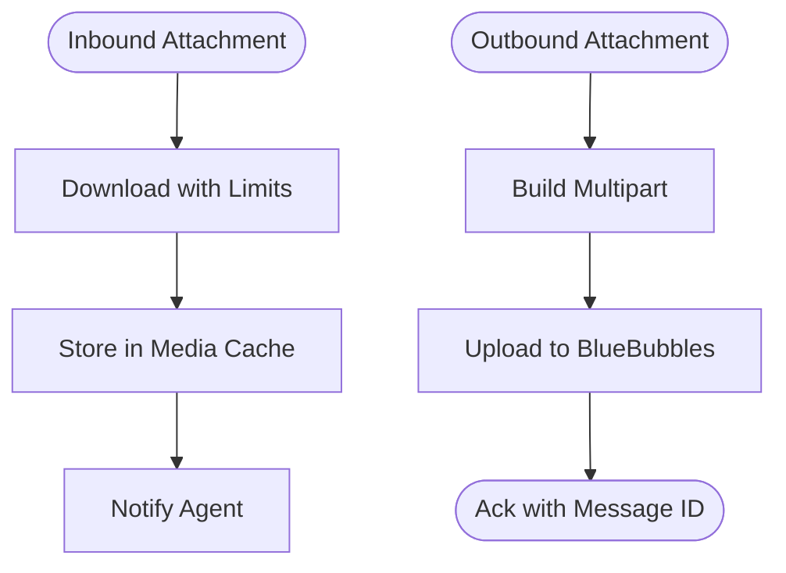
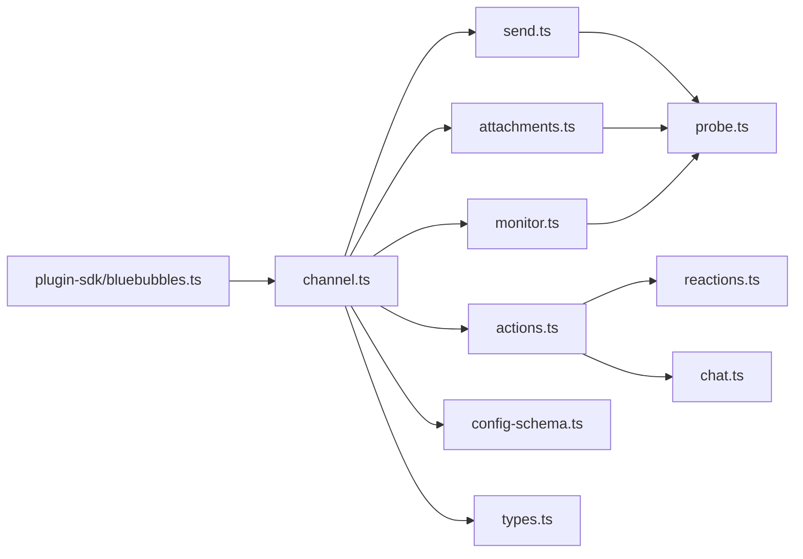

# BlueBubbles Channel

<cite>
**Referenced Files in This Document**
- [index.ts](file://extensions/bluebubbles/index.ts)
- [channel.ts](file://extensions/bluebubbles/src/channel.ts)
- [actions.ts](file://extensions/bluebubbles/src/actions.ts)
- [config-schema.ts](file://extensions/bluebubbles/src/config-schema.ts)
- [types.ts](file://extensions/bluebubbles/src/types.ts)
- [monitor.ts](file://extensions/bluebubbles/src/monitor.ts)
- [send.ts](file://extensions/bluebubbles/src/send.ts)
- [chat.ts](file://extensions/bluebubbles/src/chat.ts)
- [reactions.ts](file://extensions/bluebubbles/src/reactions.ts)
- [probe.ts](file://extensions/bluebubbles/src/probe.ts)
- [attachments.ts](file://extensions/bluebubbles/src/attachments.ts)
- [bluebubbles.ts](file://src/plugin-sdk/bluebubbles.ts)
- [bluebubbles.md](file://docs/channels/bluebubbles.md)
</cite>

## Table of Contents
1. [Introduction](#introduction)
2. [Project Structure](#project-structure)
3. [Core Components](#core-components)
4. [Architecture Overview](#architecture-overview)
5. [Detailed Component Analysis](#detailed-component-analysis)
6. [Dependency Analysis](#dependency-analysis)
7. [Performance Considerations](#performance-considerations)
8. [Troubleshooting Guide](#troubleshooting-guide)
9. [Conclusion](#conclusion)

## Introduction
This document provides comprehensive documentation for the BlueBubbles channel integration in OpenClaw. It covers the macOS server REST API implementation, full feature support including editing, unsend, effects, and reactions, server setup, authentication, configuration options, macOS 26 Tahoe compatibility issues, group management features, performance considerations, and platform-specific limitations.

## Project Structure
The BlueBubbles channel is implemented as a bundled plugin under the extensions directory. The plugin integrates with OpenClaw’s plugin SDK and exposes a channel plugin that handles inbound webhooks, outbound messaging, reactions, and advanced actions.

**Diagram sources**
- [bluebubbles.ts](file://src/plugin-sdk/bluebubbles.ts#L1-L113)
- [index.ts](file://extensions/bluebubbles/index.ts#L1-L18)
- [channel.ts](file://extensions/bluebubbles/src/channel.ts#L1-L388)
- [actions.ts](file://extensions/bluebubbles/src/actions.ts#L1-L446)
- [config-schema.ts](file://extensions/bluebubbles/src/config-schema.ts#L1-L70)
- [types.ts](file://extensions/bluebubbles/src/types.ts#L1-L138)
- [monitor.ts](file://extensions/bluebubbles/src/monitor.ts#L1-L316)
- [send.ts](file://extensions/bluebubbles/src/send.ts#L1-L473)
- [chat.ts](file://extensions/bluebubbles/src/chat.ts#L1-L337)
- [reactions.ts](file://extensions/bluebubbles/src/reactions.ts#L1-L183)
- [probe.ts](file://extensions/bluebubbles/src/probe.ts#L1-L165)
- [attachments.ts](file://extensions/bluebubbles/src/attachments.ts#L1-L283)

**Section sources**
- [index.ts](file://extensions/bluebubbles/index.ts#L1-L18)
- [channel.ts](file://extensions/bluebubbles/src/channel.ts#L1-L388)
- [bluebubbles.ts](file://src/plugin-sdk/bluebubbles.ts#L1-L113)

## Core Components
- Plugin registration and channel definition: The plugin registers the BlueBubbles channel with OpenClaw and sets runtime context.
- Channel capabilities: Supports direct and group chats, media, reactions, editing, unsend, reply threading, message effects, and group management.
- Configuration schema: Defines account-level and multi-account configurations, including policies, limits, and action gating.
- Webhook monitoring: Handles inbound events from BlueBubbles, authenticates requests, normalizes payloads, and routes to processors.
- Outbound messaging: Sends text and media messages, resolves targets, and supports reply threading and effects.
- Advanced actions: Implements reactions, edits, unsend, replies, effects, group renaming, icon setting, participant management, leaving groups, and sending attachments.
- Probe and compatibility: Probes server info, caches macOS version and private API status, and gates actions accordingly.

**Section sources**
- [index.ts](file://extensions/bluebubbles/index.ts#L6-L15)
- [channel.ts](file://extensions/bluebubbles/src/channel.ts#L64-L126)
- [config-schema.ts](file://extensions/bluebubbles/src/config-schema.ts#L9-L69)
- [monitor.ts](file://extensions/bluebubbles/src/monitor.ts#L265-L313)
- [send.ts](file://extensions/bluebubbles/src/send.ts#L361-L472)
- [actions.ts](file://extensions/bluebubbles/src/actions.ts#L72-L98)

## Architecture Overview
The BlueBubbles channel architecture consists of:
- Plugin bootstrap: Initializes runtime and registers the channel.
- Gateway lifecycle: Starts the webhook listener and probes server capabilities.
- Inbound pipeline: Authenticates webhook requests, parses payloads, debounces rapid events, and processes messages and reactions.
- Outbound pipeline: Resolves targets, strips markdown, validates inputs, and posts to BlueBubbles REST endpoints.
- Action pipeline: Validates parameters, checks private API and macOS compatibility, and executes advanced actions.

**Diagram sources**
- [monitor.ts](file://extensions/bluebubbles/src/monitor.ts#L120-L262)
- [send.ts](file://extensions/bluebubbles/src/send.ts#L361-L472)
- [actions.ts](file://extensions/bluebubbles/src/actions.ts#L101-L444)
- [reactions.ts](file://extensions/bluebubbles/src/reactions.ts#L135-L182)
- [chat.ts](file://extensions/bluebubbles/src/chat.ts#L128-L275)

## Detailed Component Analysis

### Plugin Registration and Channel Definition
- Registers the BlueBubbles plugin with OpenClaw, sets runtime context, and registers the channel implementation.
- Exposes channel metadata, capabilities, security policies, messaging normalization, and outbound senders.

**Diagram sources**
- [channel.ts](file://extensions/bluebubbles/src/channel.ts#L64-L387)
- [index.ts](file://extensions/bluebubbles/index.ts#L6-L15)

**Section sources**
- [index.ts](file://extensions/bluebubbles/index.ts#L1-L18)
- [channel.ts](file://extensions/bluebubbles/src/channel.ts#L50-L126)

### Webhook Monitoring and Authentication
- Registers webhook routes with authentication against the configured password.
- Parses payloads supporting JSON and form-encoded variants, normalizes event types, and ignores unsupported types.
- Debounces rapid-fire events to coalesce related messages and reactions.

**Diagram sources**
- [monitor.ts](file://extensions/bluebubbles/src/monitor.ts#L120-L262)

**Section sources**
- [monitor.ts](file://extensions/bluebubbles/src/monitor.ts#L1-L316)

### Outbound Messaging and Target Resolution
- Validates and strips markdown from outbound text.
- Resolves targets by chat GUID, chat ID, chat identifier, or handle, with special handling for DM vs group chats.
- Supports reply threading and message effects via private API when enabled.
- Auto-creates DM chats when sending to a handle without an existing chat.

**Diagram sources**
- [send.ts](file://extensions/bluebubbles/src/send.ts#L361-L472)
- [send.ts](file://extensions/bluebubbles/src/send.ts#L224-L312)

**Section sources**
- [send.ts](file://extensions/bluebubbles/src/send.ts#L19-L77)
- [send.ts](file://extensions/bluebubbles/src/send.ts#L361-L472)

### Advanced Actions Implementation
- Lists and gates actions based on configuration, private API availability, and macOS version.
- Executes reactions, edits, unsend, replies, effects, group management, and attachment sending.
- Enforces parameter validation and maps short message IDs to full GUIDs.

**Diagram sources**
- [actions.ts](file://extensions/bluebubbles/src/actions.ts#L72-L98)
- [actions.ts](file://extensions/bluebubbles/src/actions.ts#L101-L444)
- [probe.ts](file://extensions/bluebubbles/src/probe.ts#L123-L130)

**Section sources**
- [actions.ts](file://extensions/bluebubbles/src/actions.ts#L57-L98)
- [actions.ts](file://extensions/bluebubbles/src/actions.ts#L101-L444)

### Reactions and Effects
- Normalizes reaction inputs to supported types and emojis.
- Sends reactions via private API endpoint with optional part index.
- Maps short effect names to Apple effect identifiers for expressive sends.

**Diagram sources**
- [reactions.ts](file://extensions/bluebubbles/src/reactions.ts#L118-L156)
- [send.ts](file://extensions/bluebubbles/src/send.ts#L60-L77)

**Section sources**
- [reactions.ts](file://extensions/bluebubbles/src/reactions.ts#L1-L183)
- [send.ts](file://extensions/bluebubbles/src/send.ts#L38-L77)

### Group Management Operations
- Renames group chats, sets icons, adds/removes participants, leaves groups, and manages read receipts/typing indicators.
- Uses private API endpoints guarded by capability checks.

**Diagram sources**
- [chat.ts](file://extensions/bluebubbles/src/chat.ts#L128-L275)

**Section sources**
- [chat.ts](file://extensions/bluebubbles/src/chat.ts#L1-L337)

### Attachments and Media
- Downloads inbound attachments with size limits and SSRF policies.
- Uploads outbound attachments with multipart/form-data, supports voice memos, and optional captions.
- Sanitizes filenames and enforces MIME type expectations for voice messages.

**Diagram sources**
- [attachments.ts](file://extensions/bluebubbles/src/attachments.ts#L86-L130)
- [attachments.ts](file://extensions/bluebubbles/src/attachments.ts#L141-L282)

**Section sources**
- [attachments.ts](file://extensions/bluebubbles/src/attachments.ts#L1-L283)

### Configuration Reference
- Account-level and multi-account configuration with policies, limits, and action gating.
- Secret inputs for server URL and password, with schema validation and enforced pairing when server URL is set.

**Section sources**
- [config-schema.ts](file://extensions/bluebubbles/src/config-schema.ts#L9-L69)
- [types.ts](file://extensions/bluebubbles/src/types.ts#L12-L82)

## Dependency Analysis
The BlueBubbles plugin depends on OpenClaw’s plugin SDK for channel primitives, webhook handling, configuration, and status reporting. Internally, it composes several modules for monitoring, sending, reactions, chat operations, attachments, and probing.

**Diagram sources**
- [bluebubbles.ts](file://src/plugin-sdk/bluebubbles.ts#L1-L113)
- [channel.ts](file://extensions/bluebubbles/src/channel.ts#L1-L49)
- [monitor.ts](file://extensions/bluebubbles/src/monitor.ts#L1-L25)
- [send.ts](file://extensions/bluebubbles/src/send.ts#L1-L17)
- [attachments.ts](file://extensions/bluebubbles/src/attachments.ts#L1-L19)
- [actions.ts](file://extensions/bluebubbles/src/actions.ts#L1-L31)
- [reactions.ts](file://extensions/bluebubbles/src/reactions.ts#L1-L4)
- [chat.ts](file://extensions/bluebubbles/src/chat.ts#L1-L7)
- [probe.ts](file://extensions/bluebubbles/src/probe.ts#L1-L3)
- [config-schema.ts](file://extensions/bluebubbles/src/config-schema.ts#L1-L7)
- [types.ts](file://extensions/bluebubbles/src/types.ts#L1-L3)

**Section sources**
- [bluebubbles.ts](file://src/plugin-sdk/bluebubbles.ts#L1-L113)
- [channel.ts](file://extensions/bluebubbles/src/channel.ts#L1-L49)

## Performance Considerations
- Webhook throughput: Inbound events are processed with an in-flight limiter and debounced to reduce redundant processing.
- Timeout handling: Network calls use timeouts to prevent blocking; uploads use extended timeouts for attachments.
- Caching: Server info is cached with TTL to avoid repeated probes and to gate actions efficiently.
- Media limits: Enforced caps on inbound and outbound media sizes to control bandwidth and storage usage.
- Chunking: Outbound text is chunked based on configured limits and modes to fit provider constraints.

[No sources needed since this section provides general guidance]

## Troubleshooting Guide
Common issues and resolutions:
- Webhook authentication failures: Ensure the webhook password matches the configured password and that the gateway path matches the configured webhook path.
- Typing/read events stopping: Verify webhook logs and confirm the gateway path and password configuration.
- Pairing codes expiration: Use the pairing commands to list and approve codes.
- Private API requirements: Many advanced actions require the BlueBubbles Private API to be enabled; errors indicate missing capability.
- macOS 26 Tahoe compatibility: Editing is unsupported on macOS 26 and above; the plugin hides edit actions automatically when detected.
- Group icon updates: On macOS 26, icon updates may report success but not sync; disable edit and icon actions if experiencing issues.
- Status checks: Use status commands to inspect connectivity and capabilities.

**Section sources**
- [bluebubbles.md](file://docs/channels/bluebubbles.md#L337-L347)
- [probe.ts](file://extensions/bluebubbles/src/probe.ts#L123-L130)
- [actions.ts](file://extensions/bluebubbles/src/actions.ts#L192-L201)

## Conclusion
The BlueBubbles channel integration provides a robust, feature-rich bridge between OpenClaw and the BlueBubbles macOS server. It supports modern iMessage features including reactions, editing, unsend, effects, reply threading, and comprehensive group management. With strong authentication, flexible configuration, and careful handling of platform-specific constraints like macOS 26 Tahoe, it enables reliable automation and interaction across direct and group conversations.