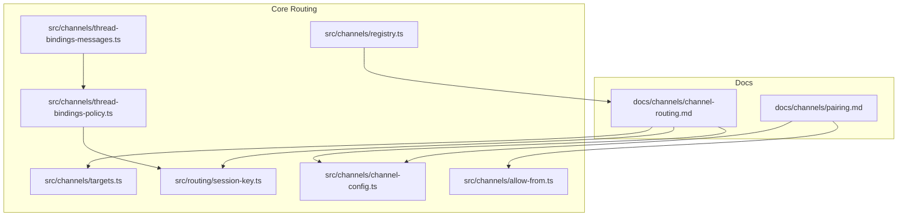
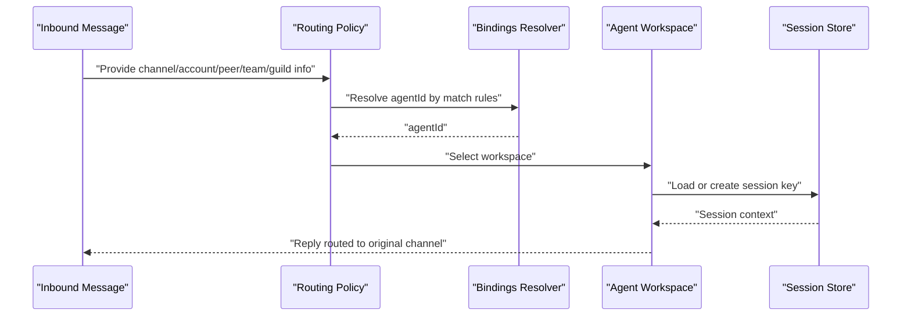
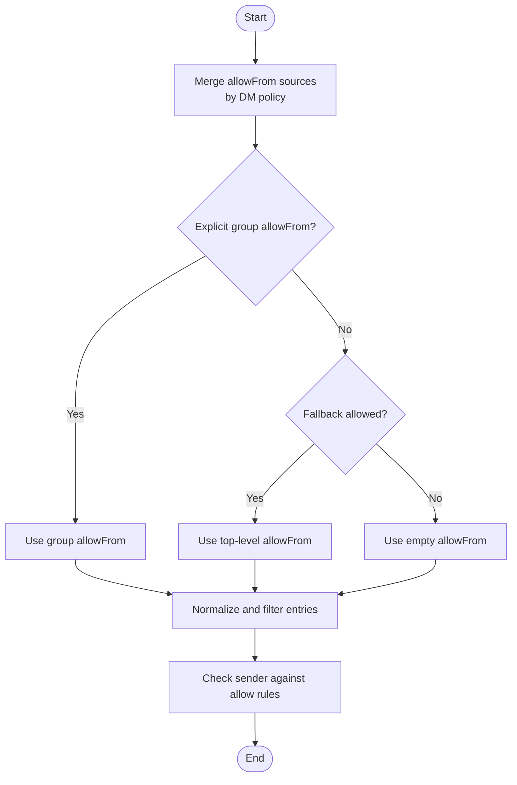
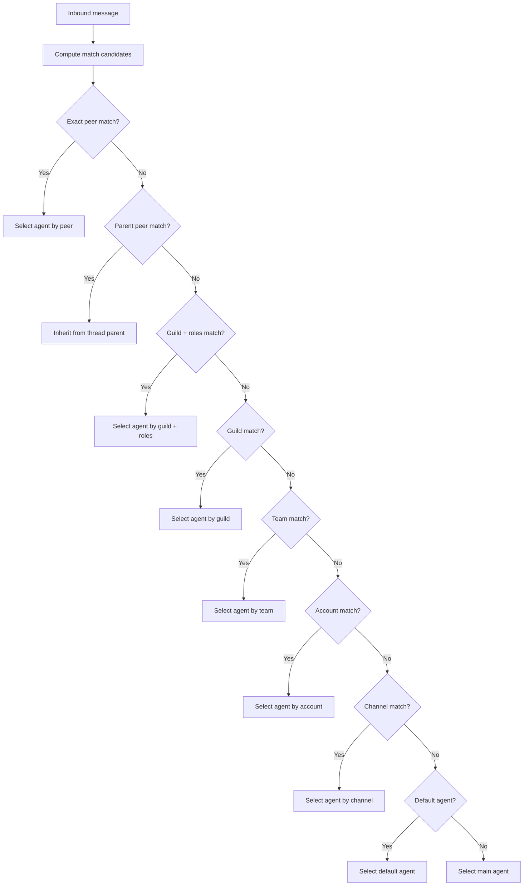
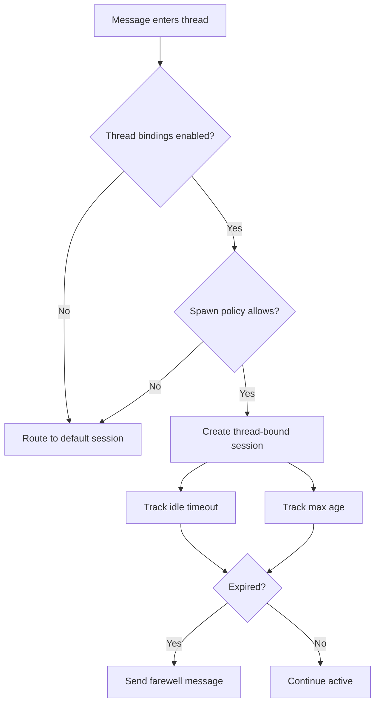
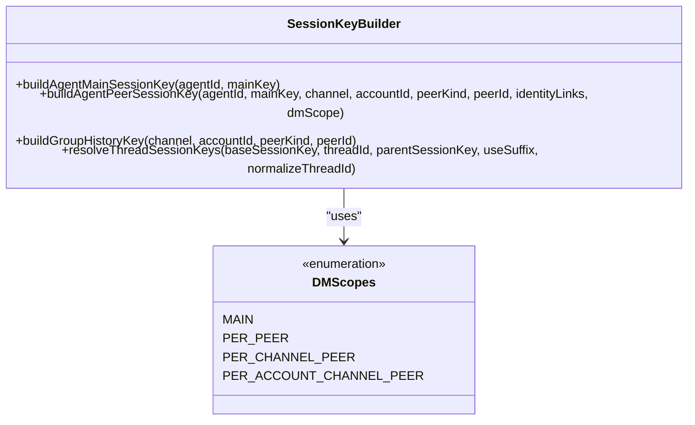
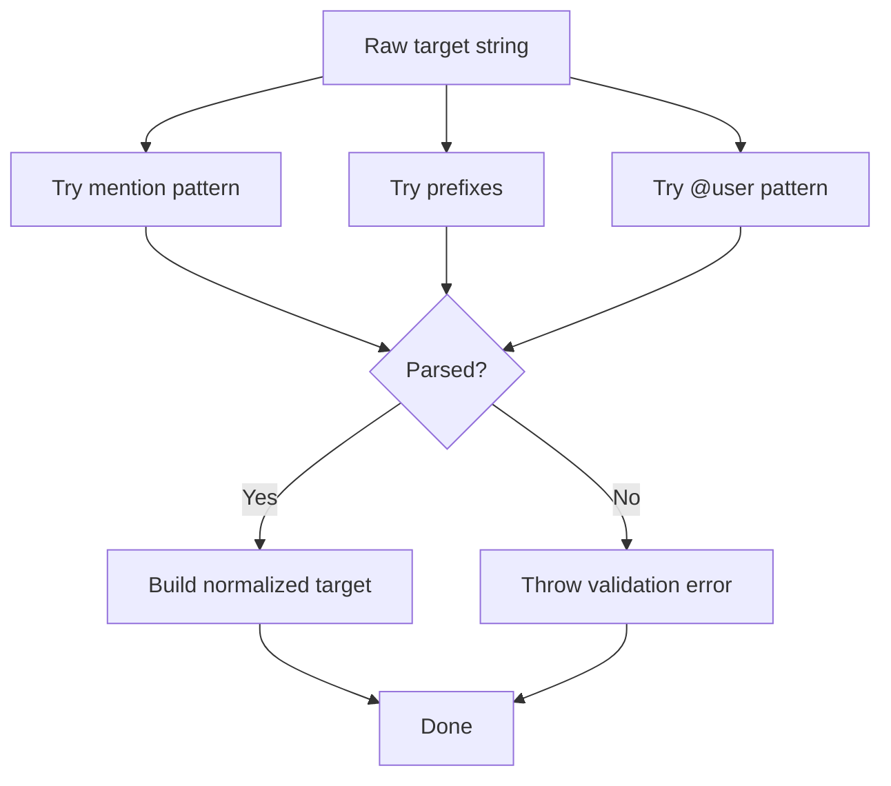
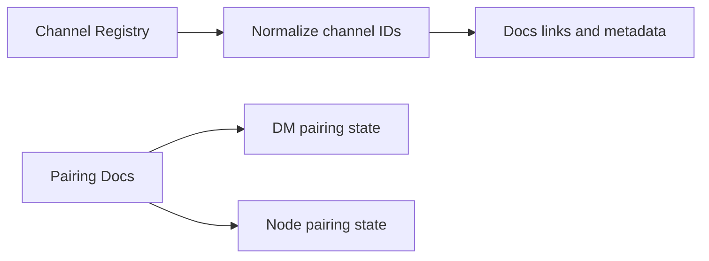
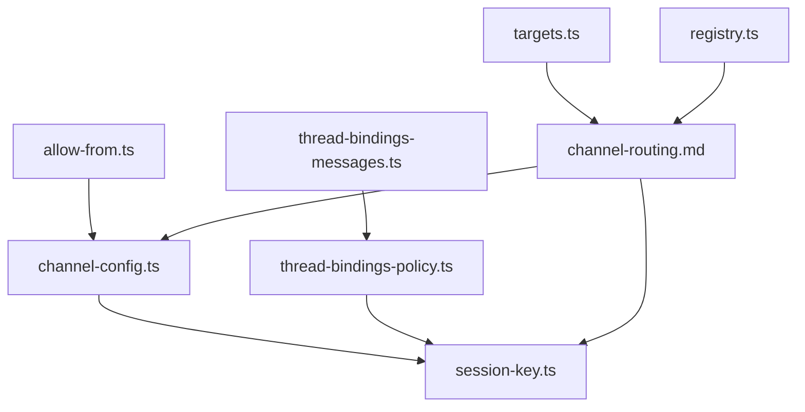

# Channel Configuration & Routing

<cite>
**Referenced Files in This Document**
- [channel-routing.md](file://docs/channels/channel-routing.md)
- [pairing.md](file://docs/channels/pairing.md)
- [channel-config.ts](file://src/channels/channel-config.ts)
- [allow-from.ts](file://src/channels/allow-from.ts)
- [thread-bindings-policy.ts](file://src/channels/thread-bindings-policy.ts)
- [thread-bindings-messages.ts](file://src/channels/thread-bindings-messages.ts)
- [session-key.ts](file://src/routing/session-key.ts)
- [targets.ts](file://src/channels/targets.ts)
- [registry.ts](file://src/channels/registry.ts)
</cite>

## Table of Contents
1. [Introduction](#introduction)
2. [Project Structure](#project-structure)
3. [Core Components](#core-components)
4. [Architecture Overview](#architecture-overview)
5. [Detailed Component Analysis](#detailed-component-analysis)
6. [Dependency Analysis](#dependency-analysis)
7. [Performance Considerations](#performance-considerations)
8. [Troubleshooting Guide](#troubleshooting-guide)
9. [Conclusion](#conclusion)

## Introduction
This document explains how OpenClaw configures and routes messages across multiple channels. It covers allowlist-based access control, channel routing policies, pairing security, group message handling, thread binding, and conversation/session management. It also provides configuration examples, security best practices, and troubleshooting guidance for multi-channel coordination and message consistency.

## Project Structure
OpenClaw organizes channel configuration and routing logic primarily under:
- docs/channels: user-facing documentation for channel routing and pairing
- src/channels: core logic for allowlists, thread bindings, session keys, targets, and channel registry
- src/routing: session key construction and classification used by routing decisions

**Diagram sources**
- [channel-routing.md](file://docs/channels/channel-routing.md#L1-L135)
- [pairing.md](file://docs/channels/pairing.md#L1-L111)
- [channel-config.ts](file://src/channels/channel-config.ts#L1-L183)
- [allow-from.ts](file://src/channels/allow-from.ts#L1-L54)
- [thread-bindings-policy.ts](file://src/channels/thread-bindings-policy.ts#L1-L202)
- [thread-bindings-messages.ts](file://src/channels/thread-bindings-messages.ts#L1-L114)
- [session-key.ts](file://src/routing/session-key.ts#L1-L254)
- [targets.ts](file://src/channels/targets.ts#L1-L147)
- [registry.ts](file://src/channels/registry.ts#L1-L201)

**Section sources**
- [channel-routing.md](file://docs/channels/channel-routing.md#L1-L135)
- [pairing.md](file://docs/channels/pairing.md#L1-L111)
- [channel-config.ts](file://src/channels/channel-config.ts#L1-L183)
- [allow-from.ts](file://src/channels/allow-from.ts#L1-L54)
- [thread-bindings-policy.ts](file://src/channels/thread-bindings-policy.ts#L1-L202)
- [thread-bindings-messages.ts](file://src/channels/thread-bindings-messages.ts#L1-L114)
- [session-key.ts](file://src/routing/session-key.ts#L1-L254)
- [targets.ts](file://src/channels/targets.ts#L1-L147)
- [registry.ts](file://src/channels/registry.ts#L1-L201)

## Core Components
- Allowlist and DM policy resolution: merges user-provided allowFrom entries with stored allowFrom lists and applies DM policy semantics.
- Channel routing and binding: resolves which agent handles an inbound message based on match criteria (peer, guild/team, account, channel).
- Thread binding: controls whether threads/topics spawn dedicated sessions and how long they stay active.
- Session keys: constructs deterministic session identifiers for DMs, groups, channels, and threads.
- Targets and mentions: parses and normalizes messaging targets (users, channels) for routing and mentions.
- Channel registry: enumerates supported channels and normalizes channel identifiers.

**Section sources**
- [allow-from.ts](file://src/channels/allow-from.ts#L1-L54)
- [channel-config.ts](file://src/channels/channel-config.ts#L1-L183)
- [thread-bindings-policy.ts](file://src/channels/thread-bindings-policy.ts#L1-L202)
- [thread-bindings-messages.ts](file://src/channels/thread-bindings-messages.ts#L1-L114)
- [session-key.ts](file://src/routing/session-key.ts#L1-L254)
- [targets.ts](file://src/channels/targets.ts#L1-L147)
- [registry.ts](file://src/channels/registry.ts#L1-L201)

## Architecture Overview
OpenClaw routes replies deterministically back to the originating channel and selects an agent per inbound message using a ranked matching policy. Session keys isolate conversations across agents and channels, with optional thread binding for extended lifecycles.

**Diagram sources**
- [channel-routing.md](file://docs/channels/channel-routing.md#L58-L74)
- [session-key.ts](file://src/routing/session-key.ts#L118-L174)

## Detailed Component Analysis

### Allowlist and DM Access Control
- Merging allowFrom sources: combines user-defined allowFrom with stored allowFrom entries depending on DM policy.
- Group allowFrom scoping: supports explicit group-level allowFrom or falls back to top-level allowFrom.
- Sender allow checks: evaluates wildcard presence, empty allow sets, and sender ID membership.

**Diagram sources**
- [allow-from.ts](file://src/channels/allow-from.ts#L1-L54)

**Section sources**
- [allow-from.ts](file://src/channels/allow-from.ts#L1-L54)
- [pairing.md](file://docs/channels/pairing.md#L20-L56)

### Channel Routing Policies and Bindings
- Match precedence: exact peer, parent peer (thread inheritance), guild+roles (Discord), guild (Discord), team (Slack), account, channel, default agent.
- Binding evaluation: all provided fields must match; matched agent determines workspace and session store.
- Broadcast groups: run multiple agents for the same peer when appropriate.

**Diagram sources**
- [channel-routing.md](file://docs/channels/channel-routing.md#L58-L74)

**Section sources**
- [channel-routing.md](file://docs/channels/channel-routing.md#L58-L74)

### Thread Binding and Conversation Lifecycle
- Enablement and spawn policy: configurable per channel/account/session; Discord has dedicated spawn gates.
- Idle timeout and max age: derived from channel/account/session configuration with sensible defaults.
- Intro and farewell messages: formatted system messages indicating lifecycle and termination reasons.

**Diagram sources**
- [thread-bindings-policy.ts](file://src/channels/thread-bindings-policy.ts#L75-L138)
- [thread-bindings-messages.ts](file://src/channels/thread-bindings-messages.ts#L41-L114)

**Section sources**
- [thread-bindings-policy.ts](file://src/channels/thread-bindings-policy.ts#L1-L202)
- [thread-bindings-messages.ts](file://src/channels/thread-bindings-messages.ts#L1-L114)

### Session Keys and Conversation Management
- Session key shapes:
  - Direct messages collapse to the agent’s main session by default.
  - Groups and channels remain isolated per channel.
  - Threads append thread identifiers; Telegram forum topics embed topic identifiers.
- DM scope and owner pinning: when dmScope is main, inbound DMs infer a pinned owner from allowFrom to avoid overwriting lastRoute by non-owner DMs.
- Thread session keys: suffix thread identifiers to base session keys; parent session key preserved for inheritance.

**Diagram sources**
- [session-key.ts](file://src/routing/session-key.ts#L118-L254)
- [channel-routing.md](file://docs/channels/channel-routing.md#L24-L57)

**Section sources**
- [session-key.ts](file://src/routing/session-key.ts#L1-L254)
- [channel-routing.md](file://docs/channels/channel-routing.md#L24-L57)

### Targets and Mentions
- Target parsing: supports mention patterns, prefixed targets, and @user forms; ensures normalized IDs.
- Validation: enforces required kinds and formats for downstream routing.

**Diagram sources**
- [targets.ts](file://src/channels/targets.ts#L46-L131)

**Section sources**
- [targets.ts](file://src/channels/targets.ts#L1-L147)

### Channel Registry and Pairing Security
- Supported channels: enumeration and normalization of channel IDs and aliases.
- Pairing:
  - DM pairing: pending requests are capped and expire; approved allowlists are stored per channel/account.
  - Node pairing: device pairing via Telegram with short-lived setup codes; approvals managed via CLI.

**Diagram sources**
- [registry.ts](file://src/channels/registry.ts#L1-L201)
- [pairing.md](file://docs/channels/pairing.md#L1-L111)

**Section sources**
- [registry.ts](file://src/channels/registry.ts#L1-L201)
- [pairing.md](file://docs/channels/pairing.md#L1-L111)

## Dependency Analysis
- Routing depends on bindings resolution and session key construction.
- Thread binding policy depends on channel/account/session configuration.
- AllowFrom merging depends on DM policy and stored allowFrom entries.
- Targets parsing is used by routing and mentions logic.

**Diagram sources**
- [allow-from.ts](file://src/channels/allow-from.ts#L1-L54)
- [channel-config.ts](file://src/channels/channel-config.ts#L1-L183)
- [session-key.ts](file://src/routing/session-key.ts#L1-L254)
- [thread-bindings-policy.ts](file://src/channels/thread-bindings-policy.ts#L1-L202)
- [thread-bindings-messages.ts](file://src/channels/thread-bindings-messages.ts#L1-L114)
- [channel-routing.md](file://docs/channels/channel-routing.md#L1-L135)
- [targets.ts](file://src/channels/targets.ts#L1-L147)
- [registry.ts](file://src/channels/registry.ts#L1-L201)

**Section sources**
- [channel-config.ts](file://src/channels/channel-config.ts#L1-L183)
- [session-key.ts](file://src/routing/session-key.ts#L1-L254)
- [thread-bindings-policy.ts](file://src/channels/thread-bindings-policy.ts#L1-L202)
- [thread-bindings-messages.ts](file://src/channels/thread-bindings-messages.ts#L1-L114)
- [allow-from.ts](file://src/channels/allow-from.ts#L1-L54)
- [targets.ts](file://src/channels/targets.ts#L1-L147)
- [registry.ts](file://src/channels/registry.ts#L1-L201)
- [channel-routing.md](file://docs/channels/channel-routing.md#L1-L135)

## Performance Considerations
- Prefer explicit bindings and channel/account scopes to reduce match ambiguity and improve lookup performance.
- Use thread bindings judiciously; idle timeouts and max age should balance continuity with resource usage.
- Normalize and cache allowFrom entries to minimize repeated computation during routing.
- Keep session key shapes concise; avoid overly long thread/topic identifiers.

## Troubleshooting Guide
- Replies not returning to the originating channel:
  - Verify bindings and match rules; ensure channel/account specificity is configured.
  - Confirm session keys reflect the correct channel and peer.
- Unexpected agent selection:
  - Check match precedence and binding specificity; parent peer matches inherit from threads.
  - Validate that all provided fields in a binding match.
- Thread binding not taking effect:
  - Confirm threadBindings are enabled for the channel/account/session.
  - Ensure spawn policy permits the requested session kind.
- DM pairing flood or stale requests:
  - Review pending request caps and expiration behavior.
  - Approve or clear pending entries via CLI.
- Multi-channel coordination inconsistencies:
  - Align dmScope and identity linking to prevent main session overwrites.
  - Use explicit default accounts when multiple accounts are present.

**Section sources**
- [channel-routing.md](file://docs/channels/channel-routing.md#L58-L74)
- [thread-bindings-policy.ts](file://src/channels/thread-bindings-policy.ts#L75-L138)
- [pairing.md](file://docs/channels/pairing.md#L20-L56)
- [session-key.ts](file://src/routing/session-key.ts#L118-L174)

## Conclusion
OpenClaw’s channel configuration and routing system emphasizes determinism and security. By combining allowlists, precise bindings, thread-aware sessions, and robust pairing controls, it ensures consistent, secure, and scalable multi-channel coordination. Apply the configuration examples and best practices outlined here to maintain predictable behavior across environments and agents.