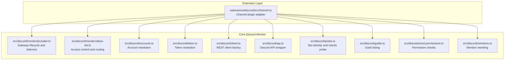
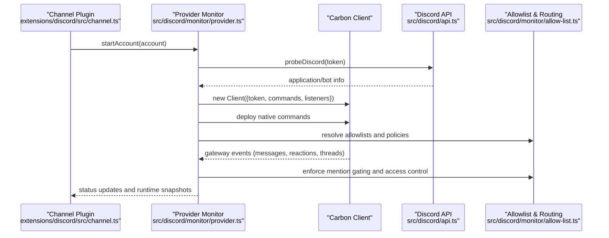
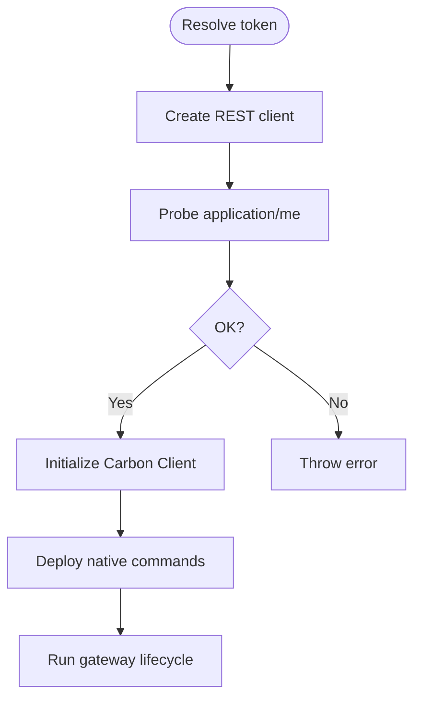
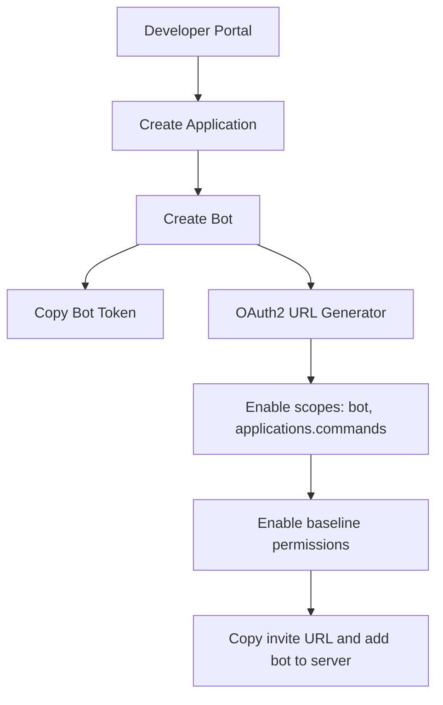
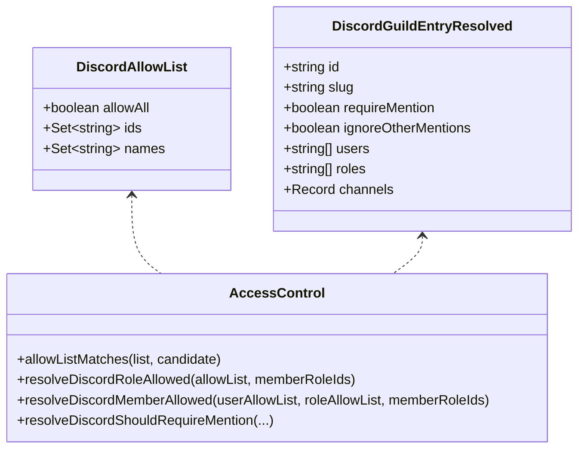
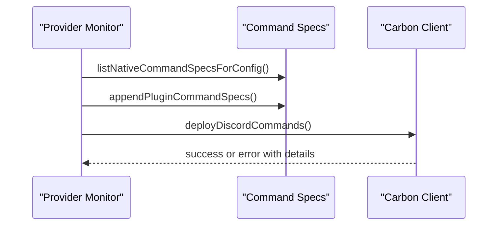
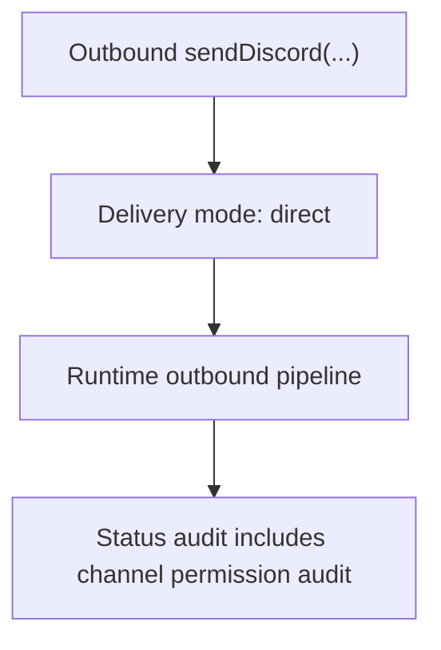
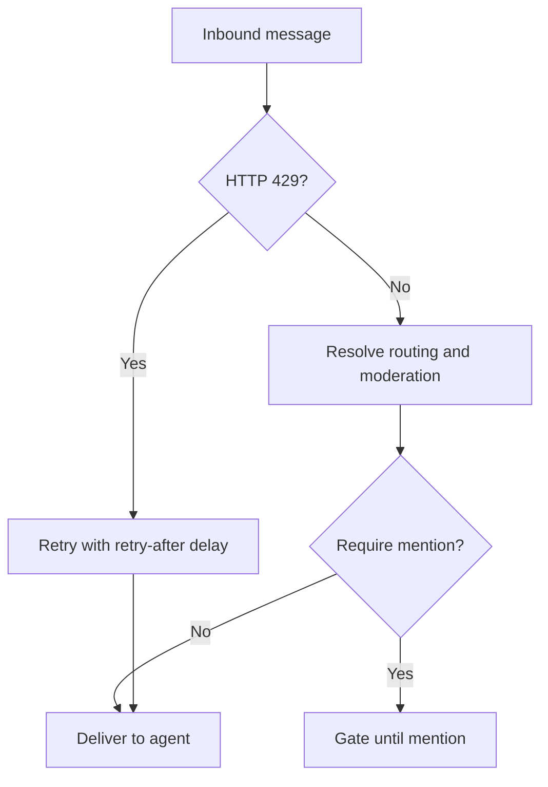
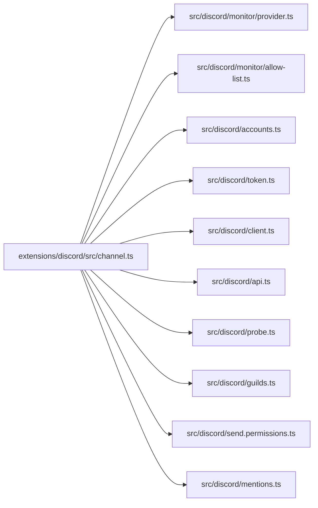
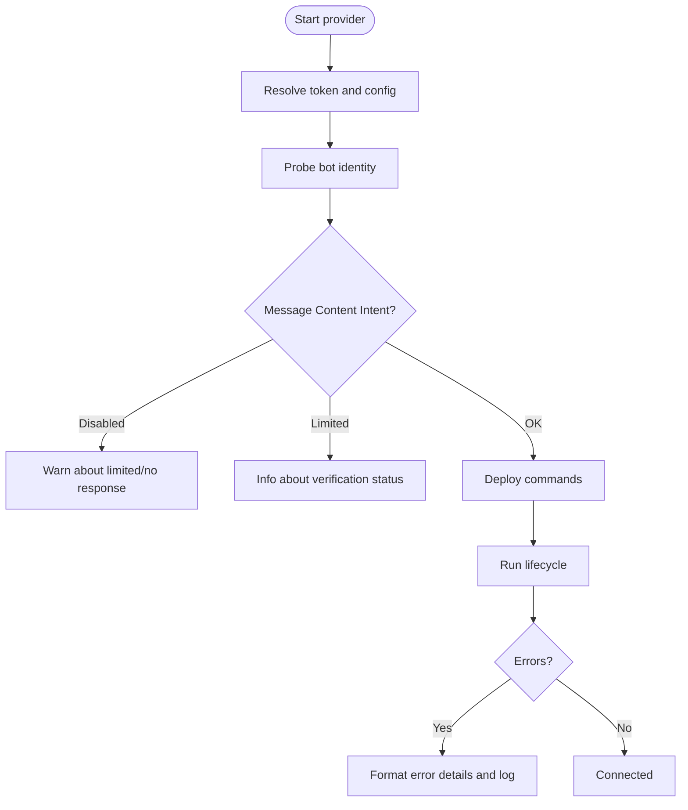

# Discord Channel

<cite>
**Referenced Files in This Document**
- [discord.md](file://docs/channels/discord.md)
- [channel.ts](file://extensions/discord/src/channel.ts)
- [provider.ts](file://src/discord/monitor/provider.ts)
- [allow-list.ts](file://src/discord/monitor/allow-list.ts)
- [accounts.ts](file://src/discord/accounts.ts)
- [token.ts](file://src/discord/token.ts)
- [client.ts](file://src/discord/client.ts)
- [api.ts](file://src/discord/api.ts)
- [probe.ts](file://src/discord/probe.ts)
- [guilds.ts](file://src/discord/guilds.ts)
- [send.permissions.ts](file://src/discord/send.permissions.ts)
- [mentions.ts](file://src/discord/mentions.ts)
</cite>

## Table of Contents
1. [Introduction](#introduction)
2. [Project Structure](#project-structure)
3. [Core Components](#core-components)
4. [Architecture Overview](#architecture-overview)
5. [Detailed Component Analysis](#detailed-component-analysis)
6. [Dependency Analysis](#dependency-analysis)
7. [Performance Considerations](#performance-considerations)
8. [Troubleshooting Guide](#troubleshooting-guide)
9. [Conclusion](#conclusion)
10. [Appendices](#appendices)

## Introduction
This document explains the Discord channel integration in OpenClaw. It covers the Discord Bot API implementation, OAuth2-based invite generation, server/channel permissions, guild management, role-based access control, and webhook-related configuration. It also documents setup procedures for bot creation, invite links, permission scopes, large server handling, rate limits, and moderation features such as mention gating and reaction notifications.

## Project Structure
The Discord integration spans two primary areas:
- Extension-level channel plugin that exposes configuration, security policies, and outbound messaging to the OpenClaw runtime.
- Core Discord monitor that manages the Bot API connection, native slash commands, inbound/outbound routing, and moderation features.

**Diagram sources**
- [channel.ts](file://extensions/discord/src/channel.ts#L74-L463)
- [provider.ts](file://src/discord/monitor/provider.ts#L289-L780)
- [allow-list.ts](file://src/discord/monitor/allow-list.ts#L1-L586)
- [accounts.ts](file://src/discord/accounts.ts#L51-L69)
- [token.ts](file://src/discord/token.ts#L20-L72)
- [client.ts](file://src/discord/client.ts#L34-L60)
- [api.ts](file://src/discord/api.ts#L96-L136)
- [probe.ts](file://src/discord/probe.ts#L36-L67)
- [guilds.ts](file://src/discord/guilds.ts#L10-L30)
- [send.permissions.ts](file://src/discord/send.permissions.ts#L60-L233)
- [mentions.ts](file://src/discord/mentions.ts#L41-L84)

**Section sources**
- [channel.ts](file://extensions/discord/src/channel.ts#L74-L463)
- [provider.ts](file://src/discord/monitor/provider.ts#L289-L780)

## Core Components
- Channel plugin: Provides configuration schema, security policy builders, directory resolution, outbound senders, and status auditing for the Discord channel.
- Provider monitor: Manages the Carbon Client lifecycle, registers listeners, deploys native commands, handles voice, thread bindings, and moderation.
- Allowlist and routing: Implements guild/channel allowlists, mention gating, role-based access, and owner allow-from resolution.
- Accounts and token resolution: Normalizes tokens from config/env, merges account-scoped overrides, and resolves effective account configuration.
- REST client and API wrapper: Creates authenticated clients and wraps Discord API calls with retries and rate-limit handling.
- Permissions: Computes guild and channel permissions for moderation decisions.
- Mentions: Rewrites plaintext mentions to Discord-safe formats.

**Section sources**
- [channel.ts](file://extensions/discord/src/channel.ts#L103-L415)
- [provider.ts](file://src/discord/monitor/provider.ts#L376-L405)
- [allow-list.ts](file://src/discord/monitor/allow-list.ts#L12-L93)
- [accounts.ts](file://src/discord/accounts.ts#L51-L69)
- [token.ts](file://src/discord/token.ts#L20-L72)
- [client.ts](file://src/discord/client.ts#L34-L60)
- [api.ts](file://src/discord/api.ts#L96-L136)
- [send.permissions.ts](file://src/discord/send.permissions.ts#L60-L233)
- [mentions.ts](file://src/discord/mentions.ts#L41-L84)

## Architecture Overview
The Discord integration follows a provider pattern:
- The extension plugin defines channel capabilities, security, and outbound behavior.
- The provider monitor initializes the Carbon Client, deploys native commands, registers listeners, and orchestrates inbound/outbound processing.
- Access control is enforced via allowlists and routing rules.
- Moderation features include mention gating, reaction notifications, and thread binding.

**Diagram sources**
- [channel.ts](file://extensions/discord/src/channel.ts#L416-L462)
- [provider.ts](file://src/discord/monitor/provider.ts#L289-L780)
- [api.ts](file://src/discord/api.ts#L96-L136)
- [allow-list.ts](file://src/discord/monitor/allow-list.ts#L510-L528)

## Detailed Component Analysis

### Discord Bot API Implementation
- REST client creation: Builds authenticated clients using normalized tokens and retry runners.
- API wrapper: Wraps Discord endpoints with standardized error handling and automatic retry on 429 with retry-after parsing.
- Identity probe: Validates token and checks Message Content Intent status.

**Diagram sources**
- [client.ts](file://src/discord/client.ts#L34-L60)
- [api.ts](file://src/discord/api.ts#L96-L136)
- [probe.ts](file://src/discord/probe.ts#L36-L67)
- [provider.ts](file://src/discord/monitor/provider.ts#L289-L410)

**Section sources**
- [client.ts](file://src/discord/client.ts#L34-L60)
- [api.ts](file://src/discord/api.ts#L96-L136)
- [probe.ts](file://src/discord/probe.ts#L36-L67)
- [provider.ts](file://src/discord/monitor/provider.ts#L289-L410)

### OAuth2 Authentication and Invite Generation
- The documentation describes generating an OAuth2 invite URL with scopes and permissions required to add the bot to a server.
- Baseline permissions include View Channels, Send Messages, Read Message History, Embed Links, Attach Files, and optional Add Reactions.

**Diagram sources**
- [discord.md](file://docs/channels/discord.md#L24-L94)

**Section sources**
- [discord.md](file://docs/channels/discord.md#L24-L94)

### Server/Channel Permissions and Role-Based Access Control
- Allowlists support IDs and optional name/tag matching (with a safety flag).
- Roles are enforced via role IDs only.
- Owner allow-from supports user IDs and mentions.
- Channel-level overrides permit per-channel requireMention and ignoreOtherMentions.
- Group DM allowlist supports channel IDs or slugs.

**Diagram sources**
- [allow-list.ts](file://src/discord/monitor/allow-list.ts#L12-L93)
- [allow-list.ts](file://src/discord/monitor/allow-list.ts#L152-L219)
- [allow-list.ts](file://src/discord/monitor/allow-list.ts#L472-L491)

**Section sources**
- [allow-list.ts](file://src/discord/monitor/allow-list.ts#L12-L93)
- [allow-list.ts](file://src/discord/monitor/allow-list.ts#L152-L219)
- [allow-list.ts](file://src/discord/monitor/allow-list.ts#L472-L491)

### Guild Management and Native Slash Commands
- Native commands are resolved from global specs and plugin specs, with deduplication and deployment via the Carbon Client.
- Slash command ephemeral defaults and access groups are configurable.
- Command deployment errors are captured with structured details.

**Diagram sources**
- [provider.ts](file://src/discord/monitor/provider.ts#L413-L438)
- [provider.ts](file://src/discord/monitor/provider.ts#L229-L246)

**Section sources**
- [provider.ts](file://src/discord/monitor/provider.ts#L413-L438)
- [provider.ts](file://src/discord/monitor/provider.ts#L229-L246)

### Webhook Configurations
- The extension plugin exposes outbound delivery mode as direct and integrates with the runtime’s outbound pipeline.
- Status collection includes permission audits for configured channels.

**Diagram sources**
- [channel.ts](file://extensions/discord/src/channel.ts#L296-L342)
- [channel.ts](file://extensions/discord/src/channel.ts#L389-L414)

**Section sources**
- [channel.ts](file://extensions/discord/src/channel.ts#L296-L342)
- [channel.ts](file://extensions/discord/src/channel.ts#L389-L414)

### Setup Procedures: Bot Creation, Invite Links, and Permission Scopes
- Steps include creating an application and bot, enabling privileged intents, copying the token, generating an invite URL with scopes and permissions, enabling Developer Mode to copy IDs, and configuring OpenClaw with the token and allowlists.

**Section sources**
- [discord.md](file://docs/channels/discord.md#L24-L171)

### Large Server Handling, Rate Limits, and Moderation Features
- Rate limiting: API wrapper retries on 429 with retry-after handling.
- Moderation: Mention gating, ignoreOtherMentions, reaction notifications modes, and thread binding for persistent sessions.
- History and context: Configurable history limits and thread behavior inheritance.

**Diagram sources**
- [api.ts](file://src/discord/api.ts#L108-L136)
- [allow-list.ts](file://src/discord/monitor/allow-list.ts#L472-L491)
- [provider.ts](file://src/discord/monitor/provider.ts#L677-L700)

**Section sources**
- [api.ts](file://src/discord/api.ts#L108-L136)
- [allow-list.ts](file://src/discord/monitor/allow-list.ts#L472-L491)
- [provider.ts](file://src/discord/monitor/provider.ts#L677-L700)

## Dependency Analysis
The extension plugin depends on the core monitor for runtime orchestration, while the monitor depends on allowlists, accounts, token resolution, REST client, and API wrappers.

**Diagram sources**
- [channel.ts](file://extensions/discord/src/channel.ts#L74-L463)
- [provider.ts](file://src/discord/monitor/provider.ts#L289-L780)
- [allow-list.ts](file://src/discord/monitor/allow-list.ts#L1-L586)
- [accounts.ts](file://src/discord/accounts.ts#L51-L69)
- [token.ts](file://src/discord/token.ts#L20-L72)
- [client.ts](file://src/discord/client.ts#L34-L60)
- [api.ts](file://src/discord/api.ts#L96-L136)
- [probe.ts](file://src/discord/probe.ts#L36-L67)
- [guilds.ts](file://src/discord/guilds.ts#L10-L30)
- [send.permissions.ts](file://src/discord/send.permissions.ts#L60-L233)
- [mentions.ts](file://src/discord/mentions.ts#L41-L84)

**Section sources**
- [channel.ts](file://extensions/discord/src/channel.ts#L74-L463)
- [provider.ts](file://src/discord/monitor/provider.ts#L289-L780)

## Performance Considerations
- Event queue tuning: The monitor passes eventQueue options to Carbon to adjust listener timeouts for heavy normalization workloads.
- Text chunking: The extension defines block streaming coalesce defaults for large replies.
- Media limits: Configurable mediaMaxMb influences outbound media handling.
- History limits: Tunable historyLimit reduces context size for large servers.

**Section sources**
- [provider.ts](file://src/discord/monitor/provider.ts#L604-L607)
- [channel.ts](file://extensions/discord/src/channel.ts#L98-L100)
- [provider.ts](file://src/discord/monitor/provider.ts#L329-L336)

## Troubleshooting Guide
- Missing token: Account resolution throws when no token is available for the requested account.
- Disallowed intents: Gateway lifecycle detects disallowed intents and surfaces actionable warnings.
- Command deployment failures: Errors include status, code, and body details for diagnosis.
- Permission audits: Status audit collects channel permission checks for configured channels.

**Diagram sources**
- [accounts.ts](file://src/discord/accounts.ts#L51-L69)
- [provider.ts](file://src/discord/monitor/provider.ts#L289-L410)
- [provider.ts](file://src/discord/monitor/provider.ts#L229-L246)
- [provider.ts](file://src/discord/monitor/provider.ts#L757-L770)

**Section sources**
- [accounts.ts](file://src/discord/accounts.ts#L51-L69)
- [provider.ts](file://src/discord/monitor/provider.ts#L289-L410)
- [provider.ts](file://src/discord/monitor/provider.ts#L229-L246)
- [provider.ts](file://src/discord/monitor/provider.ts#L757-L770)

## Conclusion
The Discord channel integration in OpenClaw provides a robust, secure, and scalable bridge to Discord via the Bot API. It supports fine-grained access control, native slash commands, moderation features, and efficient handling of large servers. Proper configuration of tokens, intents, and allowlists ensures safe and reliable operation across guilds, channels, and threads.

## Appendices

### Configuration Reference Highlights
- Token resolution precedence and environment fallback for the default account.
- Group policy defaults and allowlist behavior for guilds and channels.
- Mention gating and reaction notification modes.
- Native command ephemeral defaults and access groups.

**Section sources**
- [token.ts](file://src/discord/token.ts#L20-L72)
- [discord.md](file://docs/channels/discord.md#L368-L460)
- [discord.md](file://docs/channels/discord.md#L539-L548)