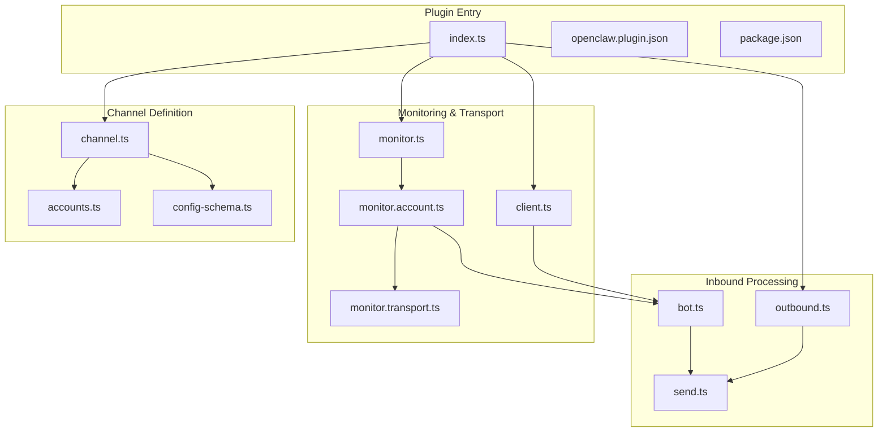
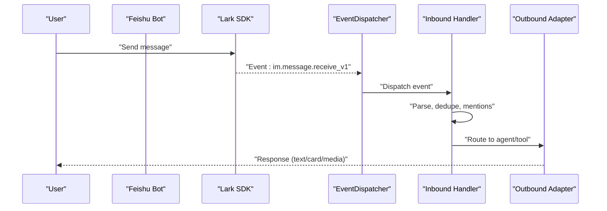
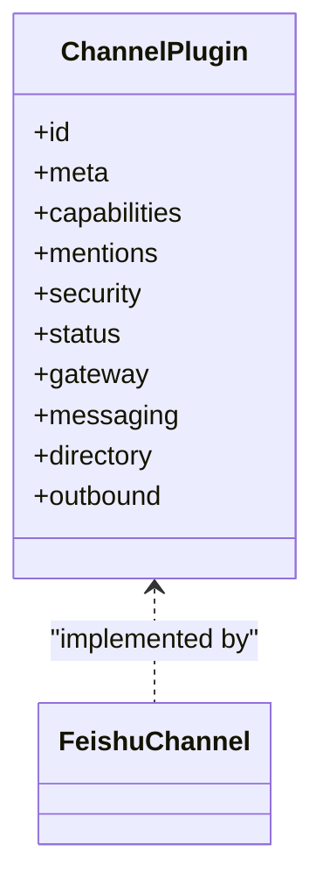
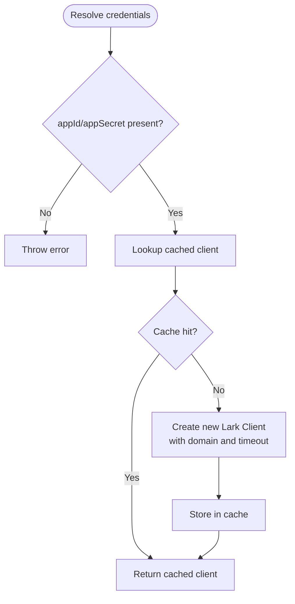
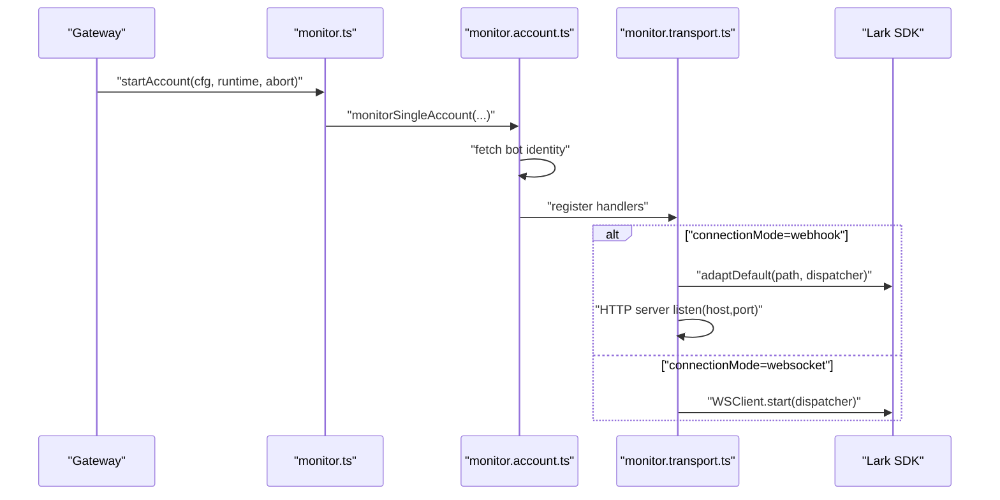
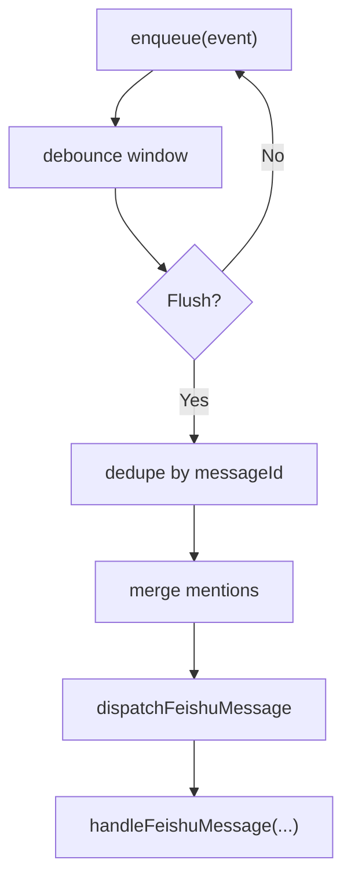
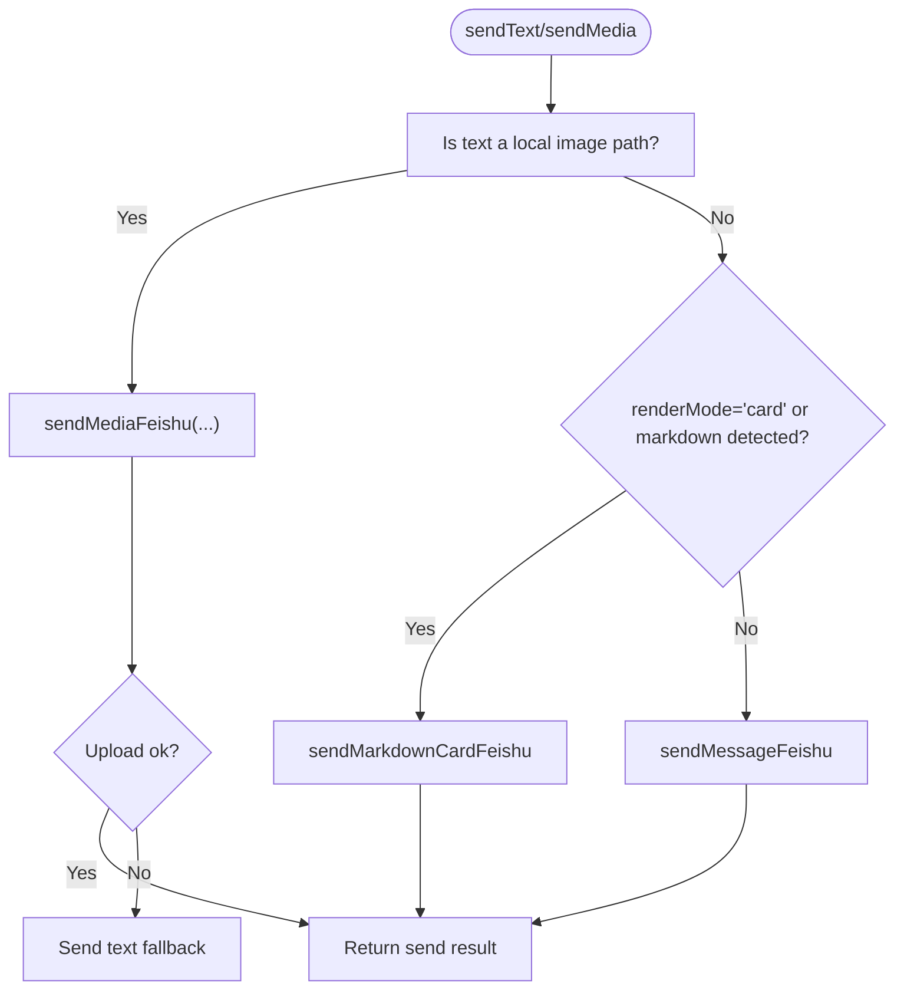
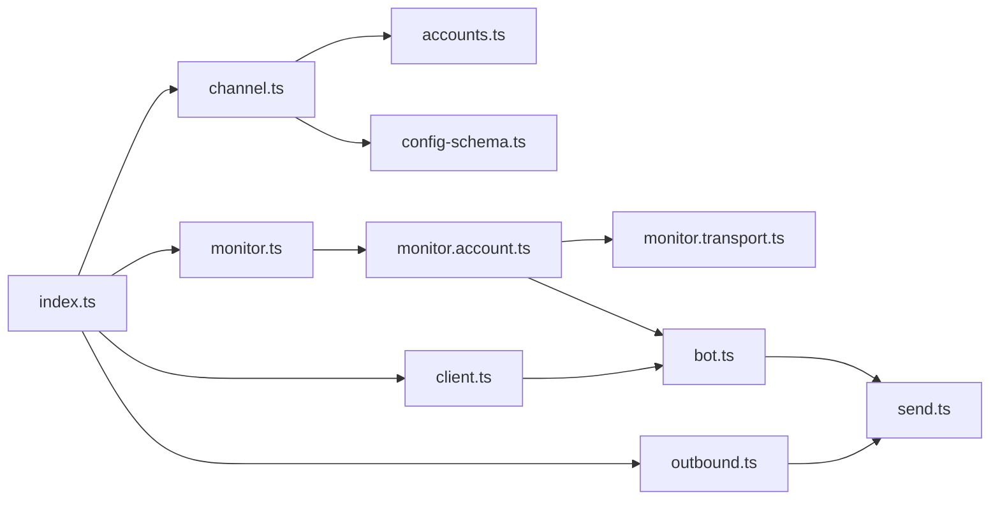

# Feishu Channel

<cite>
**Referenced Files in This Document**
- [package.json](file://extensions/feishu/package.json)
- [openclaw.plugin.json](file://extensions/feishu/openclaw.plugin.json)
- [index.ts](file://extensions/feishu/index.ts)
- [channel.ts](file://extensions/feishu/src/channel.ts)
- [client.ts](file://extensions/feishu/src/client.ts)
- [accounts.ts](file://extensions/feishu/src/accounts.ts)
- [monitor.ts](file://extensions/feishu/src/monitor.ts)
- [monitor.account.ts](file://extensions/feishu/src/monitor.account.ts)
- [monitor.transport.ts](file://extensions/feishu/src/monitor.transport.ts)
- [bot.ts](file://extensions/feishu/src/bot.ts)
- [send.ts](file://extensions/feishu/src/send.ts)
- [outbound.ts](file://extensions/feishu/src/outbound.ts)
- [config-schema.ts](file://extensions/feishu/src/config-schema.ts)
</cite>

## Table of Contents
1. [Introduction](#introduction)
2. [Project Structure](#project-structure)
3. [Core Components](#core-components)
4. [Architecture Overview](#architecture-overview)
5. [Detailed Component Analysis](#detailed-component-analysis)
6. [Dependency Analysis](#dependency-analysis)
7. [Performance Considerations](#performance-considerations)
8. [Troubleshooting Guide](#troubleshooting-guide)
9. [Conclusion](#conclusion)
10. [Appendices](#appendices)

## Introduction
This document describes the Feishu/Lark channel integration for OpenClaw. It explains how the plugin registers the Feishu channel, authenticates bots, and handles events via WebSocket or Webhook. It also documents configuration for company applications, webhook endpoints, and message formatting, along with regional differences and compliance considerations.

## Project Structure
The Feishu channel is implemented as an OpenClaw plugin with a dedicated TypeScript module. Key areas:
- Plugin registration and exports
- Channel metadata, capabilities, and configuration schema
- Client creation for Feishu APIs and event dispatching
- Monitoring transports (WebSocket/Webhook)
- Event handling pipeline for messages, reactions, and card actions
- Outbound sending and media handling
- Account resolution and multi-account support

**Diagram sources**
- [index.ts](file://extensions/feishu/index.ts#L1-L66)
- [channel.ts](file://extensions/feishu/src/channel.ts#L85-L370)
- [config-schema.ts](file://extensions/feishu/src/config-schema.ts#L200-L227)
- [accounts.ts](file://extensions/feishu/src/accounts.ts#L187-L241)
- [monitor.ts](file://extensions/feishu/src/monitor.ts#L31-L96)
- [monitor.account.ts](file://extensions/feishu/src/monitor.account.ts#L500-L546)
- [monitor.transport.ts](file://extensions/feishu/src/monitor.transport.ts#L29-L167)
- [client.ts](file://extensions/feishu/src/client.ts#L111-L197)
- [bot.ts](file://extensions/feishu/src/bot.ts#L771-L800)
- [send.ts](file://extensions/feishu/src/send.ts#L278-L324)
- [outbound.ts](file://extensions/feishu/src/outbound.ts#L79-L177)

**Section sources**
- [package.json](file://extensions/feishu/package.json#L1-L36)
- [openclaw.plugin.json](file://extensions/feishu/openclaw.plugin.json#L1-L11)
- [index.ts](file://extensions/feishu/index.ts#L1-L66)

## Core Components
- Plugin registration: Registers channel, tools, and runtime hooks.
- Channel definition: Provides metadata, capabilities, security, and configuration schema.
- Client factory: Creates typed clients for Feishu APIs and event dispatchers.
- Monitoring: Starts WebSocket or Webhook listeners and routes events.
- Inbound pipeline: Parses events, resolves mentions, de-duplicates, and dispatches to handlers.
- Outbound adapter: Sends text, cards, and media; handles fallbacks and threading.
- Account resolution: Supports single and multi-account configurations.

**Section sources**
- [index.ts](file://extensions/feishu/index.ts#L48-L66)
- [channel.ts](file://extensions/feishu/src/channel.ts#L85-L370)
- [client.ts](file://extensions/feishu/src/client.ts#L111-L197)
- [monitor.account.ts](file://extensions/feishu/src/monitor.account.ts#L500-L546)
- [bot.ts](file://extensions/feishu/src/bot.ts#L771-L800)
- [outbound.ts](file://extensions/feishu/src/outbound.ts#L79-L177)
- [accounts.ts](file://extensions/feishu/src/accounts.ts#L187-L241)

## Architecture Overview
The Feishu channel integrates with OpenClaw’s plugin SDK and the LarkSuite SDK. Two transport modes are supported:
- WebSocket: Real-time event streaming via the Lark WS client.
- Webhook: HTTP endpoint receiving event callbacks with signature verification.

**Diagram sources**
- [monitor.account.ts](file://extensions/feishu/src/monitor.account.ts#L379-L486)
- [bot.ts](file://extensions/feishu/src/bot.ts#L771-L800)
- [outbound.ts](file://extensions/feishu/src/outbound.ts#L79-L177)

## Detailed Component Analysis

### Plugin Registration and Exports
- Registers the Feishu channel, tools (docs, chat, wiki, drive, perm, bitable), and runtime.
- Exposes send, media, reactions, mention utilities, and probing helpers.

**Section sources**
- [index.ts](file://extensions/feishu/index.ts#L1-L66)
- [openclaw.plugin.json](file://extensions/feishu/openclaw.plugin.json#L1-L11)
- [package.json](file://extensions/feishu/package.json#L12-L34)

### Channel Definition and Capabilities
- Metadata includes id, labels, docs path, and aliases.
- Capabilities: chat types, threads, media, reactions, edit, reply.
- Mentions stripping and normalization.
- Security warnings for allowlist policies.
- Status probe and runtime snapshot building.
- Gateway lifecycle: startAccount initializes monitoring.

**Diagram sources**
- [channel.ts](file://extensions/feishu/src/channel.ts#L85-L370)

**Section sources**
- [channel.ts](file://extensions/feishu/src/channel.ts#L34-L43)
- [channel.ts](file://extensions/feishu/src/channel.ts#L101-L109)
- [channel.ts](file://extensions/feishu/src/channel.ts#L119-L121)
- [channel.ts](file://extensions/feishu/src/channel.ts#L258-L272)
- [channel.ts](file://extensions/feishu/src/channel.ts#L334-L351)
- [channel.ts](file://extensions/feishu/src/channel.ts#L352-L369)

### Client Creation and Authentication
- Creates Lark Client instances with timeouts and optional proxy.
- Supports domain selection: Feishu or Lark, or custom HTTPS URL.
- Caches clients keyed by account ID.
- Builds WSClient and EventDispatcher for transport.

**Diagram sources**
- [client.ts](file://extensions/feishu/src/client.ts#L111-L147)

**Section sources**
- [client.ts](file://extensions/feishu/src/client.ts#L29-L37)
- [client.ts](file://extensions/feishu/src/client.ts#L76-L105)
- [client.ts](file://extensions/feishu/src/client.ts#L111-L147)
- [client.ts](file://extensions/feishu/src/client.ts#L153-L168)
- [client.ts](file://extensions/feishu/src/client.ts#L173-L178)

### Monitoring and Transport Modes
- WebSocket mode: Starts WSClient and listens for events.
- Webhook mode: Runs HTTP server on configured host/port/path, validates requests, and adapts incoming events.

**Diagram sources**
- [channel.ts](file://extensions/feishu/src/channel.ts#L352-L369)
- [monitor.ts](file://extensions/feishu/src/monitor.ts#L31-L96)
- [monitor.account.ts](file://extensions/feishu/src/monitor.account.ts#L500-L546)
- [monitor.transport.ts](file://extensions/feishu/src/monitor.transport.ts#L29-L167)

**Section sources**
- [monitor.ts](file://extensions/feishu/src/monitor.ts#L31-L96)
- [monitor.account.ts](file://extensions/feishu/src/monitor.account.ts#L500-L546)
- [monitor.transport.ts](file://extensions/feishu/src/monitor.transport.ts#L29-L167)

### Event Handling Pipeline
- Registers handlers for message receive, bot added/removed, reaction created, and card action trigger.
- Debounces inbound text messages, merges mentions, and suppresses duplicates.
- Resolves reaction synthetic events and dispatches to the same handler path.
- Maintains per-chat serial queues to preserve ordering.

**Diagram sources**
- [monitor.account.ts](file://extensions/feishu/src/monitor.account.ts#L303-L377)
- [monitor.account.ts](file://extensions/feishu/src/monitor.account.ts#L379-L486)

**Section sources**
- [monitor.account.ts](file://extensions/feishu/src/monitor.account.ts#L230-L486)
- [bot.ts](file://extensions/feishu/src/bot.ts#L771-L800)

### Outbound Sending and Formatting
- Text sending: Chooses between plain text and interactive card based on render mode and content hints.
- Media sending: Auto-detects local image paths, uploads, and falls back to URL text if needed.
- Reply threading: Supports replying in thread or inline; handles withdrawn reply targets gracefully.
- Message editing: Updates existing messages within platform limits.

**Diagram sources**
- [outbound.ts](file://extensions/feishu/src/outbound.ts#L84-L115)
- [send.ts](file://extensions/feishu/src/send.ts#L278-L324)
- [send.ts](file://extensions/feishu/src/send.ts#L421-L439)

**Section sources**
- [outbound.ts](file://extensions/feishu/src/outbound.ts#L79-L177)
- [send.ts](file://extensions/feishu/src/send.ts#L278-L324)
- [send.ts](file://extensions/feishu/src/send.ts#L421-L478)

### Account Resolution and Multi-Account Support
- Supports single-account (legacy) and multi-account modes.
- Merges top-level and per-account configuration, with per-account overrides.
- Lists enabled and configured accounts and resolves default selection.

**Section sources**
- [accounts.ts](file://extensions/feishu/src/accounts.ts#L27-L34)
- [accounts.ts](file://extensions/feishu/src/accounts.ts#L89-L100)
- [accounts.ts](file://extensions/feishu/src/accounts.ts#L187-L241)
- [config-schema.ts](file://extensions/feishu/src/config-schema.ts#L200-L227)

## Dependency Analysis
- External SDK: @larksuiteoapi/node-sdk for Feishu APIs and event handling.
- Type validation: Zod schemas for configuration and secret inputs.
- HTTP proxy support for WebSocket connections.
- OpenClaw plugin SDK for channel contracts, runtime, and security utilities.

**Diagram sources**
- [index.ts](file://extensions/feishu/index.ts#L1-L66)
- [channel.ts](file://extensions/feishu/src/channel.ts#L85-L370)
- [client.ts](file://extensions/feishu/src/client.ts#L1-L197)
- [monitor.account.ts](file://extensions/feishu/src/monitor.account.ts#L1-L546)
- [bot.ts](file://extensions/feishu/src/bot.ts#L1-L800)
- [send.ts](file://extensions/feishu/src/send.ts#L1-L478)
- [outbound.ts](file://extensions/feishu/src/outbound.ts#L1-L177)
- [accounts.ts](file://extensions/feishu/src/accounts.ts#L1-L241)
- [config-schema.ts](file://extensions/feishu/src/config-schema.ts#L1-L286)

**Section sources**
- [package.json](file://extensions/feishu/package.json#L6-L11)
- [index.ts](file://extensions/feishu/index.ts#L1-L11)

## Performance Considerations
- HTTP timeouts: Configurable per account and clamped to a maximum to prevent indefinite waits.
- Client caching: Reuses Lark Client instances keyed by account to reduce initialization overhead.
- Inbound debouncing: Merges rapid text messages and suppresses duplicates to reduce downstream load.
- Per-chat serial queues: Ensures ordered processing per chat while allowing concurrency across chats.
- Media downloads: Streams and detects MIME types efficiently; saves to disk with size limits.

[No sources needed since this section provides general guidance]

## Troubleshooting Guide
Common issues and remedies:
- Missing credentials: Ensure appId and appSecret are configured; multi-account mode requires per-account credentials.
- Webhook mode misconfiguration: Requires verificationToken when connectionMode is webhook.
- Withdrawn reply target: Automatic fallback to direct send when reply target is invalid or deleted.
- Permission errors: Detected and normalized; some scopes may require correction in grant URLs.
- Rate limiting and request guards: Webhook servers enforce body size/timeouts and basic guards.

**Section sources**
- [config-schema.ts](file://extensions/feishu/src/config-schema.ts#L228-L285)
- [send.ts](file://extensions/feishu/src/send.ts#L14-L41)
- [bot.ts](file://extensions/feishu/src/bot.ts#L67-L94)
- [monitor.transport.ts](file://extensions/feishu/src/monitor.transport.ts#L98-L129)

## Conclusion
The Feishu/Lark channel plugin integrates tightly with OpenClaw and the LarkSuite SDK to provide robust real-time messaging, multi-account support, and flexible transport modes. Its configuration schema, security warnings, and outbound formatting enable secure and user-friendly deployments across regions and environments.

[No sources needed since this section summarizes without analyzing specific files]

## Appendices

### Setup Procedures and Developer Platform Notes
- Company application setup: Create a Self-built app in the Feishu/Lark Developer Console and note appId/appSecret.
- Domain selection: Choose “feishu” or “lark”; for private deployments, provide a custom HTTPS URL.
- Transport mode:
  - WebSocket: No webhook endpoint required; SDK manages real-time events.
  - Webhook: Configure host/port/path; verificationToken is mandatory for webhook mode.
- Permissions and scopes: Review app scopes and grant URLs surfaced by the plugin; correct known scope mismatches automatically.
- Regional differences: Domain setting controls whether to use Feishu or Lark endpoints; custom domains are supported.

**Section sources**
- [config-schema.ts](file://extensions/feishu/src/config-schema.ts#L11-L15)
- [config-schema.ts](file://extensions/feishu/src/config-schema.ts#L242-L271)
- [client.ts](file://extensions/feishu/src/client.ts#L29-L37)
- [monitor.transport.ts](file://extensions/feishu/src/monitor.transport.ts#L84-L86)
- [bot.ts](file://extensions/feishu/src/bot.ts#L49-L60)

### Webhook Configuration and Security
- Path and host: Configure webhookPath and webhookHost; default path is provided.
- Verification: EventDispatcher verifies signatures using verificationToken.
- Guards: Body size limits and timeouts protect against abuse and slow clients.

**Section sources**
- [config-schema.ts](file://extensions/feishu/src/config-schema.ts#L209-L211)
- [monitor.transport.ts](file://extensions/feishu/src/monitor.transport.ts#L91-L130)

### Message Formatting and Rendering
- Markdown rendering: Cards use schema 2.0 with markdown elements for rich content.
- Table mode: Configurable table rendering mode for markdown tables.
- Reply threading: Optional reply-in-thread mode for topic-based conversations.

**Section sources**
- [send.ts](file://extensions/feishu/src/send.ts#L400-L415)
- [send.ts](file://extensions/feishu/src/send.ts#L421-L439)
- [config-schema.ts](file://extensions/feishu/src/config-schema.ts#L33-L39)
- [config-schema.ts](file://extensions/feishu/src/config-schema.ts#L132-L132)